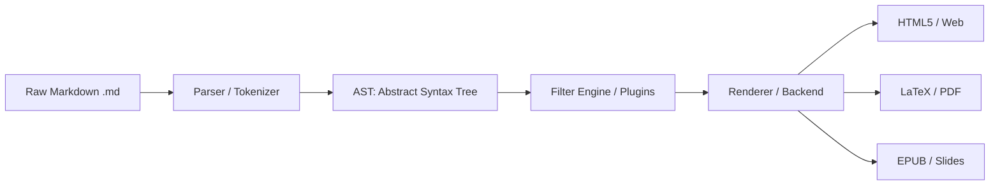
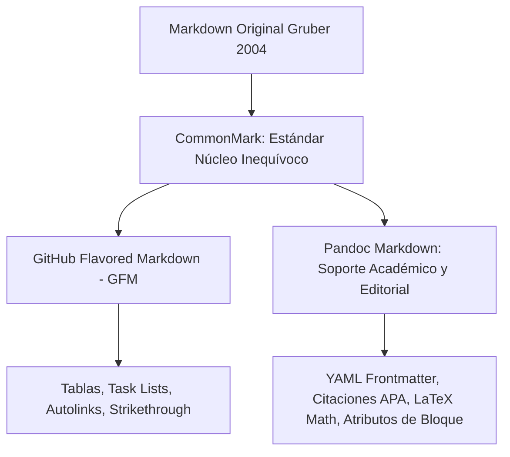
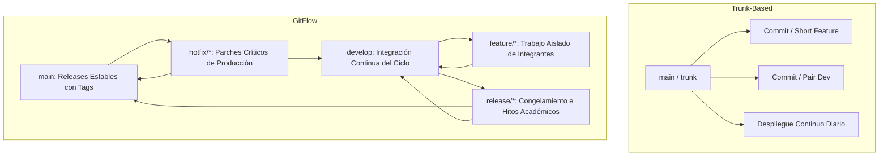
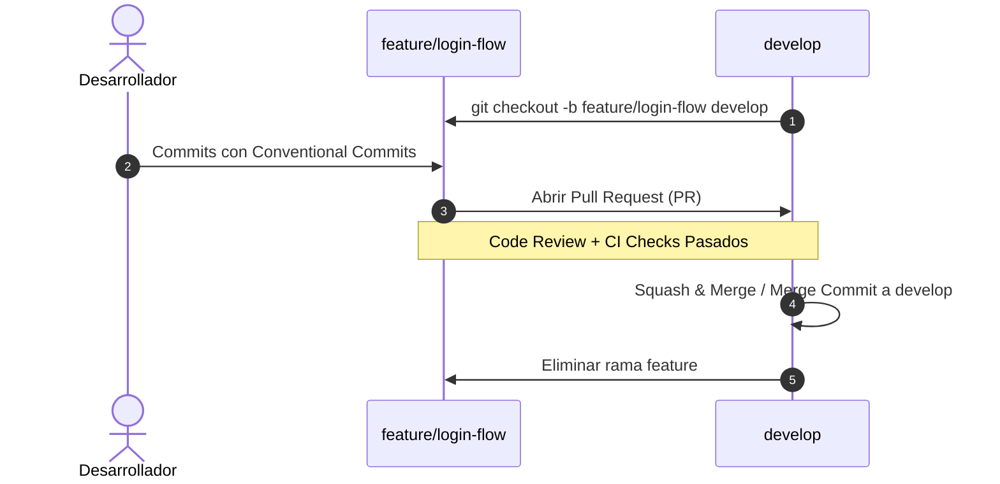
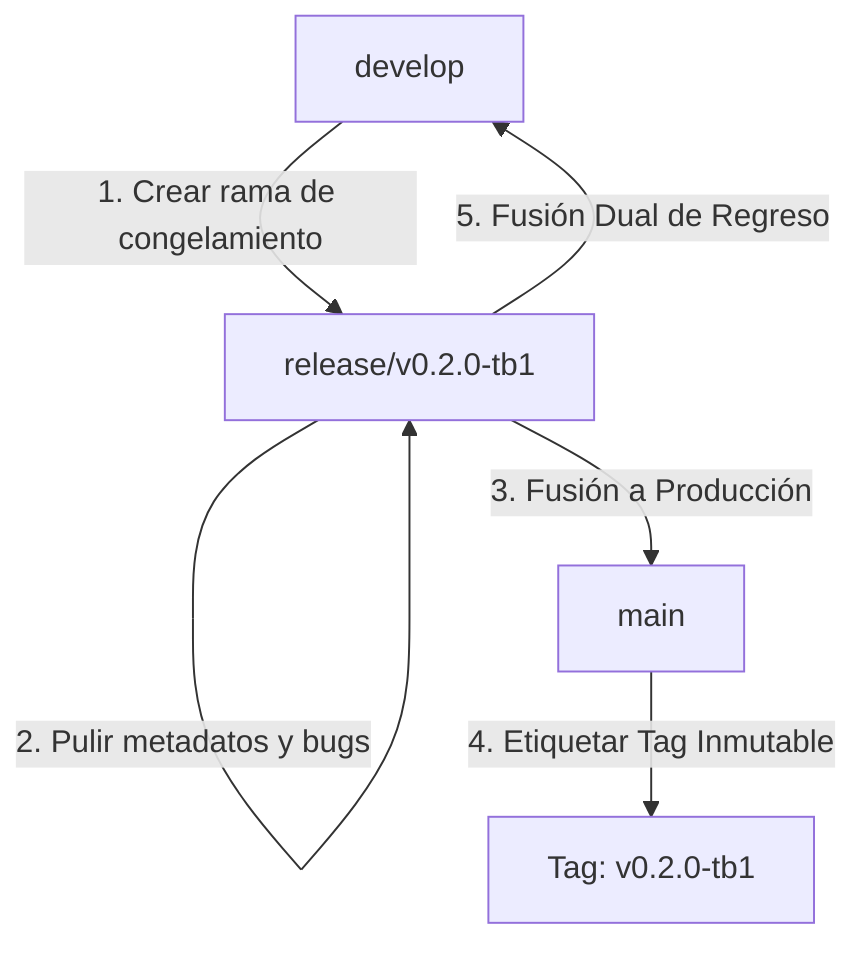
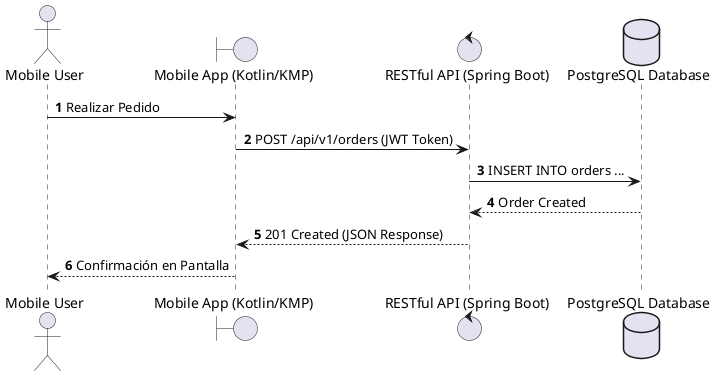
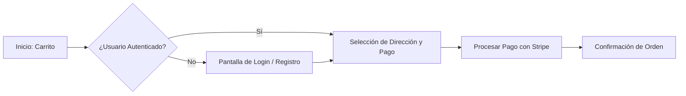

# GUÍA MAESTRA DE DOCS-AS-CODE Y GOBERNANZA DE REPOSITORIOS
## Facultad de Ingeniería | Carrera de Ingeniería de Software | UPC
### Especificación Oficial, Convenciones, Mejores Prácticas y Guía Operativa (V1.0)

---

| Metadato | Detalle |
| :--- | :--- |
| **DOCUMENTO FUENTE** | `upc-software-engineering-docs-as-code-v1.pdf` (98 Páginas) |
| **APLICABILIDAD** | Proyectos de Software, Reportes Técnicos y Repositorios Colaborativos |
| **ENFOQUE** | Docs-as-Code, GitFlow, SemVer 2.0.0, Conventional Commits 1.0.0, Pandoc & CI/CD |
| **STACK BASE** | Markdown (CommonMark / GFM), Git, Pandoc, Eisvogel LaTeX, PlantUML, Mermaid |

---

> [!IMPORTANT]
> **FILOSOFÍA DOCS-AS-CODE**
> Trata la documentación con la **misma rigurosidad técnica, control de versiones, revisión por pares y pipelines automatizados que el código fuente de producción**. La documentación no es un anexo secundario; es un artefacto de ingeniería de primer nivel.

---

## 🧭 Tabla de Contenidos

1. [Capítulo 01: Markdown como Capa de Abstracción Universal](#capítulo-01-markdown-como-capa-de-abstracción-universal)
   - [1.1. El Cambio de Paradigma: WYSIWYG vs Markdown](#11-el-cambio-de-paradigma-wysiwyg-vs-markdown)
   - [1.2. El Pipeline de Compilación: Del Texto Plano al AST](#12-el-pipeline-de-compilación-del-texto-plano-al-ast)
   - [1.3. Ecosistema de Dialectos (CommonMark, GFM y Pandoc)](#13-ecosistema-de-dialectos-los-sabores-de-markdown)
   - [1.4. Sintaxis a Nivel de Línea, Escapes y Enlaces por Referencia](#14-sintaxis-a-nivel-de-línea-y-enlaces-por-referencia)
   - [1.5. Sintaxis a Nivel de Bloque, Listas Anidadas y Reglas de Espaciado](#15-sintaxis-a-nivel-de-bloque-y-reglas-de-espaciado)
   - [1.6. Sintaxis Extendida: Tablas, Fenced Code Blocks, Task Lists y Callouts](#16-sintaxis-extendida-tablas-código-y-tareas)
   - [1.7. Ecosistema de Herramientas, Linters y Parsers](#17-ecosistema-de-herramientas-linters-y-parsers)
2. [Capítulo 02: GitFlow Workflow: Arquitectura de Ramas y Control de Versiones](#capítulo-02-gitflow-workflow-arquitectura-de-ramas-y-control-de-versiones)
   - [2.1. El Contexto: Trunk-Based vs GitFlow](#21-el-contexto-trunk-based-vs-gitflow)
   - [2.2. La Fundación: El Sistema de Rama Dual (`main` y `develop`)](#22-la-fundación-el-sistema-de-rama-dual)
   - [2.3. Ramas de Funcionalidad (`feature/*`)](#23-ramas-de-funcionalidad-feature)
   - [2.4. Ramas de Lanzamiento (`release/*`) y la Fusión Dual](#24-ramas-de-lanzamiento-release-y-la-fusión-dual)
   - [2.5. Ramas de Corrección Rápida (`hotfix/*`)](#25-ramas-de-corrección-rápida-hotfix)
   - [2.6. Matriz Oficial de Reglas de Ramificación](#26-matriz-oficial-de-reglas-de-ramificación)
3. [Capítulo 03: Versionado Semántico 2.0.0 (SemVer)](#capítulo-03-versionado-semántico-200-semver)
   - [3.1. El Problema: El Infierno de las Dependencias (*Dependency Hell*)](#31-el-problema-el-infierno-de-las-dependencias)
   - [3.2. Anatomía de SemVer: `MAJOR.MINOR.PATCH`](#32-anatomía-de-semver-majorminorpatch)
   - [3.3. La Matriz de Incremento y Reglas de Transición](#33-la-matriz-de-incremento-y-reglas-de-transición)
   - [3.4. Extensiones: Pre-releases y Metadatos de Compilación](#34-extensiones-pre-releases-y-build-metadata)
   - [3.5. Regla de Precedencia y el Umbral de Estabilidad (`0.y.z` vs `1.0.0`)](#35-regla-de-precedencia-y-el-umbral-de-estabilidad)
   - [3.6. Preguntas Frecuentes y Decisiones Pragmáticas](#36-preguntas-frecuentes-y-decisiones-pragmáticas)
4. [Capítulo 04: Conventional Commits 1.0.0: Código como Comunicación](#capítulo-04-conventional-commits-100-código-como-comunicación)
   - [4.1. El Paradigma: De Mensajes Informales a Payloads Estructurados](#41-el-paradigma-de-mensajes-informales-a-payloads-estructurados)
   - [4.2. Anatomía Estructural del Commit Message](#42-anatomía-estructural-del-commit-message)
   - [4.3. Vocabulario Estándar de Tipos](#43-vocabulario-estándar-de-tipos)
   - [4.4. Roturas de Compatibilidad: `BREAKING CHANGE` y Notación `!`](#44-roturas-de-compatibilidad-breaking-change-y-el-operador-)
   - [4.5. Reglas Normativas RFC 2119 y Automatización de SemVer](#45-reglas-normativas-rfc-2119-y-automatización-de-semver)
5. [Capítulo 05: Pandoc: De Markdown a PDF a Escala](#capítulo-05-pandoc-de-markdown-a-pdf-a-escala)
   - [5.1. Compilación Documental Basada en AST](#51-compilación-documental-basada-en-ast)
   - [5.2. Orquestación de Múltiples Archivos y Ámbitos de Enlace (`--file-scope`)](#52-orquestación-de-múltiples-archivos-y-file-scope)
   - [5.3. Configuración Declarativa con `defaults.yaml`](#53-configuración-declarativa-con-defaultsyaml)
   - [5.4. Selección de Motores PDF (`xelatex`, `lualatex`, `typst`)](#54-selección-de-motores-pdf)
   - [5.5. Inyección de Variables Tipográficas y Formato APA 7](#55-inyección-de-variables-tipográficas-y-formato-apa-7)
   - [5.6. Renderizado de Bloques de Código y Sintaxis Resaltada](#56-renderizado-de-bloques-de-código-y-sintaxis-resaltada)
6. [Capítulo 06: Arquitectura de un Repositorio Git para Reportes](#capítulo-06-arquitectura-de-un-repositorio-git-para-reportes)
   - [6.1. Organización Modular de Carpetas y Nomenclatura Estricta](#61-organización-modular-de-carpetas-y-nomenclatura-estricta)
   - [6.2. Diagramas como Código: PlantUML y Mermaid](#62-diagramas-como-código-plantuml-y-mermaid)
   - [6.3. Filtros Pandoc y Plantilla Eisvogel](#63-filtros-pandoc-y-plantilla-eisvogel)
   - [6.4. Pipeline de Automatización con Makefile y CI/CD](#64-pipeline-de-automatización-con-makefile-y-cicd)
7. [⭐ PLUS: Guías Prácticas, Cheat Sheets y Recetas Listas para Usar](#-plus-guías-prácticas-cheat-sheets-y-recetas-listas-para-usar)
   - [Plus 1: Catálogo Extendido de Conventional Commits para Proyectos UPC](#plus-1-catálogo-extendido-de-conventional-commits-para-proyectos-upc)
   - [Plus 2: Cheat Sheet de Comandos GitFlow Paso a Paso](#plus-2-cheat-sheet-de-comandos-gitflow-paso-a-paso)
   - [Plus 3: Mapeo de SemVer para Entregas Académicas (AV1, TB1, AV2, TB2)](#plus-3-mapeo-de-semver-para-entregas-académicas-av1-tb1-av2-tb2)
   - [Plus 4: Workflow Completo de GitHub Actions (`.github/workflows/docs.yml`)](#plus-4-workflow-completo-de-github-actions)
   - [Plus 5: Plantilla `defaults.yaml` y `Makefile` para Compilación PDF APA 7](#plus-5-plantilla-defaultsyaml-y-makefile-para-compilación-pdf-apa-7)
   - [Plus 6: Estructura Completa del Repositorio de Documentación (`nexa-suite/report`)](#plus-6-estructura-completa-del-repositorio-de-documentación)

---

# Capítulo 01: Markdown como Capa de Abstracción Universal

## 1.1. El Cambio de Paradigma: WYSIWYG vs Markdown

El desarrollo moderno de software exige que la documentación sea tratada con las mismas herramientas y prácticas que el código fuente. La transición de editores gráficos tradicionales (WYSIWYG como Word o Google Docs) a **Markdown** resuelve los problemas críticos de reproducibilidad, trazabilidad y control de versiones.

| Dimensión | Editores WYSIWYG (Word / Docs) | Markdown (Docs-as-Code) |
| :--- | :--- | :--- |
| **Control de Versiones** | Conflictos binarios opacos; imposible auditar cambios línea por línea. | Diffs limpios, claros y rastreables línea por línea en Git. |
| **Formato de Archivo** | Bloqueo propietario (*Vendor Lock-in*); formato binario o XML complejo. | Texto plano universal, portable y legible sin herramientas comerciales. |
| **Velocidad de Formato** | Fricción constante por menús, diálogos y manipulación de ratón. | Escritura continua con manos en el teclado mediante sintaxis simple. |
| **Longevidad (Future-Proof)** | Depende de la retrocompatibilidad del software propietario. | Legible indefinidamente en cualquier sistema operativo y época. |
| **Automatización (CI/CD)** | Dificultad extrema para integrar en pipelines automáticos de compilación. | Integración nativa con linters, pruebas de enlaces y generadores automáticos. |

> [!NOTE]
> **Nota Histórica:** John Gruber creó Markdown en 2004 con la colaboración de Aaron Swartz, con el objetivo de permitir a las personas escribir en formato de texto plano fácil de leer y escribir, y convertirlo de forma limpia a XHTML/HTML.

---

## 1.2. El Pipeline de Compilación: Del Texto Plano al AST

Markdown opera como una **capa de abstracción intermedia**. Los procesadores modernos no convierten Markdown directamente a texto enriquecido mediante expresiones regulares; en su lugar, implementan un pipeline formal de compilación:



1. **Parser / Tokenizer:** Lee el texto plano y genera una estructura en árbol denominada **Árbol de Sintaxis Abstracta (AST)**.
2. **AST:** Modela encabezados, párrafos, listas, tablas y bloques de código como nodos de datos desacoplados de la presentación visual.
3. **Filtros / Transformaciones:** Permite interceptar nodos (por ejemplo, convertir un bloque de código Mermaid en una imagen PNG/SVG antes de renderizar).
4. **Renderer / Writer:** Emite el documento final en el formato destino deseado (HTML, LaTeX/PDF, ePub).

---

## 1.3. Ecosistema de Dialectos: Los "Sabores" de Markdown

Existen múltiples especificaciones de Markdown según el ámbito de uso:



- **CommonMark:** Especificación estricta y formal que elimina ambigüedades en la sintaxis base.
- **GFM (GitHub Flavored Markdown):** Extensión de CommonMark utilizada en repositorios de GitHub; añade tablas, listas de tareas interactivas, tachado (`~~texto~~`) y menciones.
- **Pandoc Markdown:** El dialecto más potente para ingeniería y academia; añade soporte nativo para metadatos YAML, citaciones bibliográficas (`[@ref2026]`), ecuaciones LaTeX (`$E=mc^2$`), notas al pie y atributos extendidos de bloque.

---

## 1.4. Sintaxis a Nivel de Línea y Enlaces por Referencia

### Formato de Texto Inline
- **Negrita:** `**texto en negrita**` o `__texto en negrita__`
- *Cursiva:* `*texto en cursiva*` o `_texto en cursiva_`
- ***Negrita y Cursiva:*** `***texto destacado***`
- ~~Tachado:~~ `~~texto tachado~~`
- `Código inline:` `` `variableName` ``
- Atajo de teclado: `<kbd>Ctrl</kbd> + <kbd>C</kbd>`

### Escapes de Caracteres Especiales
Para renderizar caracteres que tienen significado en Markdown sin que sean interpretados, se utiliza la barra invertida `\`:
`\*literal asterisco\*`, `\[literal corchete\]`, `\$100`, `\# no es título`.

### Enlaces Directos y por Referencia
```markdown
<!-- Enlace inline directo -->
Consulte la [Guía de Pandoc](https://pandoc.org/MANUAL.html).

<!-- Topología de enlaces por referencia (Variables estáticas) -->
El enfoque se basa en [Domain-Driven Design][ddd-book] y [GitFlow][gitflow-guide].

<!-- Definición de enlaces al pie del documento -->
[ddd-book]: https://www.oreilly.com/library/view/domain-driven-design-tackling/0321125215/
[gitflow-guide]: https://nvie.com/posts/a-successful-git-branching-model/
```

### Inserción de Imágenes
```markdown

```

---

## 1.5. Sintaxis a Nivel de Bloque y Reglas de Espaciado

> [!CAUTION]
> **REGLA DE ESPACIADO ESTRICTO:**
> Siempre debe existir **una línea en blanco completa antes y después** de cada encabezado, lista, tabla, bloque de código o blockquote. Omitir esta línea genera fallos de parseo en CommonMark y Pandoc.

### Jerarquía de Encabezados
```markdown
# Título Principal Nivel 1 (H1) - Solo uno por documento / capítulo
## Subtítulo Nivel 2 (H2) - Secciones principales
### Subtítulo Nivel 3 (H3) - Subsecciones
#### Subtítulo Nivel 4 (H4) - Detalle de componentes
```

### Párrafos y Saltos de Línea
- **Nuevo Párrafo:** Se separa por una línea en blanco.
- **Salto de Línea Suave (*Soft Break*):** Dos espacios al final de la línea anterior o una barra invertida `\`.

### Blockquotes Estructurales y Anidados
```markdown
> Este es un bloque de cita de primer nivel.
>
> > Este es un bloque anidado que enfatiza una regla crítica.
```

### Arquitectura de Listas Anidadas
```markdown
1. Primer elemento ordenado
   - Subelemento no ordenado (sangría estricta de 3 o 4 espacios)
   - Segundo subelemento con párrafo explicativo:

     Este párrafo pertenece al subelemento y mantiene la alineación.
2. Segundo elemento ordenado
   ```bash
   # Bloque de código embebido dentro de la lista
   npm install --save-dev
   ```
```

---

## 1.6. Sintaxis Extendida: Tablas, Código y Tareas

### Tablas GFM con Alineación
```markdown
| Parámetro | Tipo de Dato | Requerido | Descripción |
| :--- | :---: | :---: | ---: |
| `userId` | UUID | Sí | Identificador único del usuario |
| `timeoutMs` | Integer | No | Tiempo máximo de espera (ms) |
```
- `:---` Alineación a la izquierda (por defecto).
- `:---:` Alineación centrada.
- `---:` Alineación a la derecha (ideal para números y métricas).

### Fenced Code Blocks y Atributos Extendidos
````markdown
```typescript
interface UserProfile {
  id: string;
  fullName: string;
  email: string;
  isActive: boolean;
}
```
````

Para Pandoc con atributos avanzados de numeración de líneas:
```markdown
```python {.numberLines startFrom="10"}
def compile_report(source_dir: str) -> bool:
    print(f"Building AST from {source_dir}...")
    return True
```
```

### Task Lists (Listas de Verificación)
```markdown
- [x] Diseñar Bounded Context Canvases
- [x] Modelar flujos de mensajes con Domain Storytelling
- [ ] Ejecutar pruebas de carga en endpoints REST
```

---

## 1.7. Ecosistema de Herramientas, Linters y Parsers

- **Linters:** `markdownlint` (valida consistencia de espacios, niveles de encabezados, longitud de líneas y tablas).
- **Formatters:** `Prettier` (formateo automático determinista).
- **Editores recomendados:** Visual Studio Code (con extensiones *Markdown All in One*, *Markdownlint*, *PlantUML*, *Mermaid Preview*), Obsidian, Neovim.

---

# Capítulo 02: GitFlow Workflow: Arquitectura de Ramas y Control de Versiones

## 2.1. El Contexto: Trunk-Based vs GitFlow



- **Trunk-Based:** Ideal para equipos senior con CI/CD maduro y despliegue continuo múltiples veces al día sobre la rama principal.
- **GitFlow (Obligatorio en Ingeniería de Software UPC):** Diseñado para proyectos con **entregables e hitos planificados** (AV1, TB1, AV2, TB2), donde se requiere aislamiento estricto de tareas, revisión exhaustiva por pares (*Pull Requests*) y congelamiento formal de código para evaluación.

---

## 2.2. La Fundación: El Sistema de Rama Dual

GitFlow establece dos ramas principales de duración infinita:

1. **`main` (Rama de Producción / Entregas Formales):**
   - Aloja exclusivamente código y documentación listos para producción.
   - Cada commit en `main` representa una entrega oficial y **DEBE tener un Tag Semántico inmutable** (`v0.1.0-av1`, `v0.2.0-tb1`, `v1.0.0`).
   - Nadie realiza commits directos sobre `main`.
2. **`develop` (Rama de Integración Continua):**
   - Línea base de trabajo de la iteración en curso.
   - Refleja el estado integrado de las últimas funcionalidades aprobadas.
   - Es la rama destino de todas las ramas `feature/*`.

---

## 2.3. Ramas de Funcionalidad (`feature/*`)

- **Propósito:** Desarrollar una User Story, componente, Bounded Context o capítulo específico de forma aislada.
- **Origen:** Se crea siempre a partir de `develop`.
- **Destino:** Se fusiona de regreso a `develop` mediante un **Pull Request**.
- **Nomenclatura:** `feature/<nombre-descriptivo-en-kebab-case>`
  *Ejemplos:* `feature/iam-bounded-context`, `feature/mobile-offline-sync`, `feature/cap2-requirements`.



---

## 2.4. Ramas de Lanzamiento (`release/*`) y la Fusión Dual

- **Propósito:** Preparar una entrega oficial de hito (ej. TB1 o TB2).
- **Origen:** Se crea a partir de `develop` cuando todas las funcionalidades del hito están completadas.
- **Actividades permitidas:** Corrección de errores menores, alineación de metadatos, actualización de números de versión y changelog. **No se añaden nuevas funcionalidades**.
- **Fusión Dual (*Dual Merge*):**
  1. Se fusiona hacia **`main`** y se etiqueta con un Tag (`git tag -a v1.0.0 -m "Release v1.0.0"`).
  2. Se fusiona de regreso hacia **`develop`** para que las correcciones de última hora no se pierdan.



---

## 2.5. Ramas de Corrección Rápida (`hotfix/*`)

- **Propósito:** Solucionar errores críticos detectados en producción o en el entregable ya publicado que no pueden esperar al siguiente ciclo de release.
- **Origen:** Se crea directamente a partir de **`main`**.
- **Fusión:** Se fusiona hacia **`main`** (con un nuevo tag de PATCH, ej. `v1.0.1`) y simultáneamente hacia **`develop`**.

---

## 2.6. Matriz Oficial de Reglas de Ramificación

| Tipo de Rama | Rama Origen (*Branch From*) | Rama Destino (*Merge To*) | Convención de Nombre | Tag Asociado |
| :--- | :--- | :--- | :--- | :---: |
| **`main`** | Inicial (`git init`) | Nunca | `main` | Sí (`vX.Y.Z`) |
| **`develop`** | `main` | Nunca | `develop` | No |
| **`feature`** | `develop` | `develop` | `feature/<kebab-case>` | No |
| **`release`** | `develop` | `main` **y** `develop` | `release/<vX.Y.Z>` | Sí (en `main`) |
| **`hotfix`** | `main` | `main` **y** `develop` | `hotfix/<vX.Y.Z>` | Sí (en `main`) |

---

# Capítulo 03: Versionado Semántico 2.0.0 (SemVer)

## 3.1. El Problema: El Infierno de las Dependencias

El crecimiento de los sistemas y la integración de módulos genera el problema del **Dependency Hell**:
- **Bloqueo de Versión:** Dependencias que exigen versiones fijas e incompatibles entre sí.
- **Ambigüedad de Ruptura:** No saber si actualizar un paquete romperá el código en tiempo de ejecución.
- **Falta de Contrato:** Cambios invisibles en APIs y modelos de datos sin advertencia formal.

SemVer 2.0.0 resuelve este problema estableciendo un **contrato formal de comunicación** entre productores y consumidores de software.

---

## 3.2. Anatomía de SemVer: `MAJOR.MINOR.PATCH`

Toda versión formal se compone de tres enteros no negativos separados por puntos:

$$\Large \mathbf{X}.\mathbf{Y}.\mathbf{Z} \implies \mathbf{MAJOR}.\mathbf{MINOR}.\mathbf{PATCH}$$

```text
       1  .  4  .  2
       │     │     │
       │     │     └─ PATCH : Corrección de bugs (Bug fixes compatibles)
       │     └─────── MINOR : Nuevas funcionalidades compatibles hacia atrás
       └───────────── MAJOR : Cambios incompatibles (Breaking Changes en la API)
```

---

## 3.3. La Matriz de Incremento y Reglas de Transición

| Componente | Cuándo se Incrementa | Impacto en la Compatibilidad | Qué ocurre con los dígitos inferiores |
| :---: | :--- | :--- | :--- |
| **MAJOR** (`X`) | Cuando se introducen cambios que **rompen la compatibilidad** con versiones previas (cambios en contratos de API, eliminación de campos, reestructuración no retrocompatible). | ⚠️ **Incompatible** | Se reinician a cero: `X+1.0.0` |
| **MINOR** (`Y`) | Cuando se añade **nueva funcionalidad compatible hacia atrás** o cuando se deprecian métodos existentes. | ✅ **Compatible** | El PATCH se reinicia a cero: `X.Y+1.0` |
| **PATCH** (`Z`) | Cuando se realizan **correcciones de errores (*bug fixes*) compatibles hacia atrás**. | ✅ **Compatible** | Solo incrementa Z: `X.Y.Z+1` |

---

## 3.4. Extensiones: Pre-Releases y Build Metadata

### Pre-Releases (Etiquetas de Prelanzamiento)
Se añaden mediante un guión `-` inmediatamente después del PATCH. Indican versiones inestables de prueba:
- `1.0.0-alpha.1` < `1.0.0-beta.1` < `1.0.0-beta.2` < `1.0.0-rc.1` < `1.0.0`

### Build Metadata (Metadatos de Compilación)
Se añaden mediante el signo `+` después de la versión o pre-release. **No afectan la precedencia de versiones**:
- `1.0.0+20260828` o `1.0.0-beta+exp.sha.5114f85`

---

## 3.5. Regla de Precedencia y el Umbral de Estabilidad

### El Umbral de Estabilidad: `0.y.z` vs `1.0.0`
- **Fase Inicial (`0.y.z`):** Representa software en desarrollo inicial. Cualquier elemento de la API puede cambiar en cualquier momento. No garantiza estabilidad pública.
- **Versión Estable (`1.0.0`):** Define formalmente la primera versión pública y estable del software. A partir de este momento, cualquier cambio incompatible **obliga** a subir el número MAJOR (`2.0.0`).

---

## 3.6. Preguntas Frecuentes y Decisiones Pragmáticas

- **¿El prefijo `v` forma parte de SemVer?**
  Técnicamente no. SemVer especifica solo `1.2.3`. Sin embargo, en Git es el estándar universal prefijar los tags con `v` (ej. `git tag v1.2.3`).
- **¿Qué hacer si publico por error un cambio incompatible en una versión MINOR?**
  Debe publicarse inmediatamente una nueva versión MINOR que restaure la compatibilidad hacia atrás, o lanzar una versión MAJOR formal.

---

# Capítulo 04: Conventional Commits 1.0.0: Código como Comunicación

## 4.1. El Paradigma: De Mensajes Informales a Payloads Estructurados

Los mensajes de commit tradicionales (*"fix bug"*, *"update files"*, *"changes"*) arruinan la trazabilidad. **Conventional Commits 1.0.0** convierte cada commit en un mensaje estructurado legible por personas y herramientas de automatización.

---

## 4.2. Anatomía Estructural del Commit Message

```text
<type>[optional scope][!]: <description>

[optional body]

[optional footer(s)]
```

### Ejemplo Completo:
```text
feat(iam)!: enforce jwt multi-tenant organization context

Migrate tenant access validation from query parameter to cryptographically
verified claims in the Bearer JWT token to prevent cross-tenant leakage.

BREAKING CHANGE: The query parameter '?tenantId=xyz' is no longer supported.
All clients must provide the 'X-Tenant-Id' header and valid JWT signature.
Refs: #42, #108
Reviewed-by: @lead-architect
```

---

## 4.3. Vocabulario Estándar de Tipos

| Tipo | Propósito | Mapeo SemVer | Ejemplo |
| :--- | :--- | :---: | :--- |
| **`feat`** | Introduce una nueva característica o funcionalidad. | **MINOR** | `feat(catalog): add bulk product import via csv` |
| **`fix`** | Corrige un error o bug en el sistema. | **PATCH** | `fix(auth): handle expired refresh token gracefully` |
| **`docs`** | Cambios exclusivamente en la documentación. | - | `docs(readme): add docker compose setup guide` |
| **`style`** | Cambios de formato que no afectan la lógica (espacios, comas, linter). | - | `style(css): align button margins with design tokens` |
| **`refactor`** | Refactorización de código sin añadir features ni corregir bugs. | - | `refactor(db): extract connection pool into factory` |
| **`perf`** | Mejora de rendimiento de ejecución o memoria. | **PATCH** | `perf(queries): add index on tenant_id and created_at` |
| **`test`** | Añade o corrige pruebas unitarias, de integración o BDD. | - | `test(bdd): add acceptance scenarios for checkout flow` |
| **`build`** | Cambios que afectan el sistema de compilación o dependencias externas. | - | `build(deps): bump spring-boot from 3.4.0 to 3.5.5` |
| **`ci`** | Modificaciones en pipelines de CI/CD (GitHub Actions, Dockerfiles). | - | `ci(github): add automated pandoc pdf build workflow` |
| **`chore`** | Tareas de mantenimiento general y herramientas auxiliares. | - | `chore(release): prepare v1.0.0 metadata` |
| **`revert`** | Revierte un commit previo. | - | `revert: feat(payment): revert stripe webhook retry logic` |

---

## 4.4. Roturas de Compatibilidad: `BREAKING CHANGE` y el Operador `!`

Cuando un commit introduce un cambio incompatible con la versión anterior:
1. Se añade un signo de exclamación `!` justo antes de los dos puntos: `feat(api)!: ...` o `refactor!: ...`.
2. O se incluye en el pie de página el texto: `BREAKING CHANGE: <descripción detallada del cambio y migración>`.

> Esto le indica a los motores de release automático (`release-please`, `semantic-release`) que deben realizar un incremento **MAJOR** en SemVer de forma 100% desatendida.

---

## 4.5. Reglas Normativas RFC 2119 y Automatización de SemVer

1. **Línea de encabezado (*Subject*):**
   - Redactada en tiempo presente y modo imperativo (*"add"*, *"fix"*, no *"added"* ni *"fixes"*).
   - En minúsculas después de los dos puntos.
   - **Sin punto final al término del asunto**.
2. **Separación:** Línea en blanco obligatoria entre encabezado, cuerpo (*body*) y pies de página (*footers*).

---

# Capítulo 05: Pandoc: De Markdown a PDF a Escala

## 5.1. Compilación Documental Basada en AST

Pandoc es el estándar de facto para la conversión universal de documentos. A diferencia de convertidores basados en expresiones regulares, Pandoc parsea el Markdown en una representación intermedia en memoria (**AST**) escrita en Haskell, lo que garantiza transformaciones matemáticas y tipográficas perfectas.

---

## 5.2. Orquestación de Múltiples Archivos y `--file-scope`

Al compilar un informe dividido en múltiples archivos `.md`, Pandoc concatena los contenidos. Para evitar que las notas al pie o las referencias colisionen entre capítulos, se utiliza el flag `--file-scope`.

```bash
# Compilación secuencial segura
pandoc --file-scope \
  report/front-matter/*.md \
  report/chapters/*.md \
  report/annexes/*.md \
  -o output/final-report.pdf
```

---

## 5.3. Configuración Declarativa con `defaults.yaml`

En lugar de escribir comandos de terminal kilométricos y propensos a error, la ingeniería profesional exige definir la configuración en un archivo `defaults.yaml`:

```yaml
# config/build.yaml
input-files:
  - report/00-caratula.md
  - report/01-registro-versiones.md
  - report/02-student-outcome.md
  - report/capitulo-1-presentacion.md
  - report/capitulo-2-requirements.md
  - report/capitulo-3-design.md
  - report/capitulo-4-implementation.md
  - report/conclusiones.md
  - report/bibliografia.md
  - report/anexos.md

output-file: build/upc-pre-202620-1acc0238-4949-nexa-team-report-tb2.pdf

pdf-engine: xelatex
template: templates/eisvogel.latex
number-sections: true
table-of-contents: true
toc-depth: 3
highlight-style: tango

variables:
  documentclass: article
  papersize: a4
  geometry:
    - top=2.54cm
    - bottom=2.54cm
    - left=2.54cm
    - right=2.54cm
  fontsize: 11pt
  linestretch: 1.5
  mainfont: "DejaVu Sans"
  monofont: "DejaVu Sans Mono"
  colorlinks: true
  linkcolor: NavyBlue
  urlcolor: NavyBlue
```

Ejecución limpia e idempotente:
```bash
pandoc --defaults=config/build.yaml
```

---

## 5.4. Selección de Motores PDF

| Motor PDF | Ventajas Principales | Ámbito Recomendado |
| :--- | :--- | :--- |
| **`xelatex`** | Soporte nativo de fuentes del sistema operativo y codificación UTF-8 impecable. | **Recomendado para informes académicos UPC con plantilla Eisvogel.** |
| **`lualatex`** | Motor moderno con soporte extendido de memoria y scripting Lua. | Informes masivos con cientos de páginas y tablas complejas. |
| **`typst`** | Motor ultrarrápido escrito en Rust; sintaxis moderna y compilación instantánea. | Pipelines de CI/CD de alta frecuencia. |
| **`pdflatex`** | Motor histórico tradicional de TeX. | Documentos simples (soporte UTF-8 limitado). |

---

## 5.5. Inyección de Variables Tipográficas y Formato APA 7

Para cumplir con las exigencias del informe oficial (interlineado 1.5, márgenes de 1 pulgada / 2.54 cm, sangría de párrafo de 0.5 pulgadas y sangría francesa en bibliografía), se configuran las variables en el encabezado YAML o `defaults.yaml`:

```yaml
variables:
  linestretch: 1.5
  indent: true
  parindent: 0.5in
  citecolor: NavyBlue
  biblio-style: apa
```

---

## 5.6. Renderizado de Bloques de Código y Sintaxis Resaltada

Pandoc incluye soporte para más de 140 lenguajes de programación mediante esquemas de resaltado sintáctico de KDE (*tango, pygments, kate, espresso, zenburn*):
```bash
pandoc --highlight-style=tango ...
```

---

# Capítulo 06: Arquitectura de un Repositorio Git para Reportes

## 6.1. Organización Modular de Carpetas y Nomenclatura Estricta

```text
project-report-repo/
├── .github/
│   └── workflows/
│       └── build-pdf.yml           # Pipeline CI/CD para compilar PDF
├── assets/
│   ├── images/                     # Capturas de pantalla, fotos del equipo
│   └── diagrams/                   # Diagramas SVG/PNG generados
├── config/
│   ├── defaults.yaml               # Configuración declarativa de Pandoc
│   └── metadata.yaml               # Metadatos del proyecto y autores
├── report/
│   ├── 00-front-matter/
│   │   ├── 00-caratula.md          # Carátula oficial según plantilla
│   │   ├── 01-versiones.md         # Registro de Versiones del Informe
│   │   ├── 02-collaboration.md     # Project Report Collaboration Insights
│   │   ├── 03-student-outcome.md   # ABET Student Outcome 7 (Anexo A)
│   │   └── 04-objetivos-smart.md   # Objetivos SMART individuales
│   ├── 10-capitulo-1/
│   │   ├── 1.1-startup-profile.md
│   │   ├── 1.2-solution-profile.md
│   │   └── 1.3-segmentos-objetivo.md
│   ├── 20-capitulo-2/
│   │   ├── 2.1-competidores.md
│   │   ├── 2.2-entrevistas.md
│   │   ├── 2.3-needfinding.md
│   │   ├── 2.4-requirements.md
│   │   ├── 2.5-strategic-ddd.md
│   │   └── 2.6-tactical-ddd.md
│   ├── 30-capitulo-3/
│   │   ├── 3.1-product-design.md
│   │   └── 3.2-mobile-design.md
│   ├── 40-capitulo-4/
│   │   ├── 4.1-scm.md
│   │   ├── 4.2-sprint-1.md
│   │   ├── 4.3-sprint-2.md
│   │   └── 4.4-validation.md
│   ├── 50-back-matter/
│   │   ├── 5.1-conclusiones.md
│   │   ├── 5.2-glosario.md
│   │   └── 5.3-bibliografia.md     # Bibliografía APA 7 (Anexo G)
│   └── 60-anexos/
│       ├── anexo-a-student-outcome.md
│       ├── anexo-b-performance.md
│       └── anexo-c-videos.md
├── templates/
│   └── eisvogel.latex              # Plantilla LaTeX profesional
├── Makefile                        # Automatización de tareas (make pdf)
└── README.md                       # Índice interactivo para navegación en GitHub
```

---

## 6.2. Diagramas como Código: PlantUML y Mermaid

Evita subir imágenes estáticas sin código fuente. Mantén los diagramas en archivos versionables (`.puml`, `.mmd`) o en bloques de código dentro del Markdown:

### Diagrama PlantUML (Arquitectura / Secuencia):


### Diagrama Mermaid (Flujo de Negocio):


---

## 6.3. Filtros Pandoc y Plantilla Eisvogel

Para que Pandoc interprete bloques de diagramas y genere imágenes de alta resolución automáticamente, se integran filtros en el pipeline:
- `pandoc-plantuml-filter`
- `mermaid-filter`

La plantilla **Eisvogel** proporciona:
- Portada académica con diseño elegante.
- Resaltado de encabezados y cajas de alerta (*callouts* estilizados).
- Formato tipográfico de tablas con bordes limpios.
- Encabezados y pies de página con numeración y título del documento.

---

## 6.4. Pipeline de Automatización con Makefile

```makefile
# Makefile para compilación del informe
PDF_NAME=build/upc-pre-202620-1acc0238-4949-nexa-team-report-tb2.pdf

all: pdf

pdf:
	@mkdir -p build
	pandoc --defaults=config/defaults.yaml -o $(PDF_NAME)
	@echo "PDF compilado con éxito en $(PDF_NAME)"

clean:
	rm -rf build/
```

---

# ⭐ PLUS: Guías Prácticas, Cheat Sheets y Recetas Listas para Usar

---

## Plus 1: Catálogo Extendido de Conventional Commits para Proyectos UPC

A continuación se presentan ejemplos reales y validados para cada área del proyecto:

### 1. Documentación e Informe (`report` / `blueprint`)
```text
docs(cap1): add 5w2h problem analysis and lean ux canvas
docs(cap2): document ubiquitous language terms and definitions
docs(cap2): add gherkin acceptance criteria for mobile epic 03
docs(cap3): integrate information architecture and aso elements
docs(cap4): add sprint 1 planning table and lacx matrix
docs(biblio): add 4 q1/q2 research papers in apa 7 format
```

### 2. Backend API (Spring Boot / Java)
```text
feat(iam): implement jwt authentication and tenant filter
feat(orders): add rest endpoint for order creation with validation
fix(db): add missing foreign key constraint on order_items table
test(unit): add unit tests for paymentservice business rules
test(bdd): add cucumber feature scenarios for buyer registration
refactor(config): extract security rules into dedicated securityconfiguration
```

### 3. Aplicación Móvil (Android / Kotlin / KMP / Flutter)
```text
feat(ui): implement modern catalog screen using jetpack compose
feat(offline): configure sqlcipher room database for local persistence
feat(device): integrate camera api for barcode scanning
fix(network): handle offline retry policy when network reconnects
test(ui): add compose ui test for login authentication flow
perf(list): optimize lazycolumn recomposition with stable keys
```

### 4. Landing Page (HTML5 / CSS3 / JavaScript)
```text
feat(hero): create responsive landing hero section with cta buttons
feat(media): embed about-the-product and about-the-team youtube videos
feat(a11y): add aria-labels and semantic role attributes
feat(i18n): add spanish and english language selector
fix(css): correct mobile responsive navigation drawer overflow
```

---

## Plus 2: Cheat Sheet de Comandos GitFlow Paso a Paso

### 🚀 1. Configuración Inicial del Repositorio:
```bash
# Clonar el repositorio
git clone https://github.com/nexa-suite/report.git
cd report

# Crear y posicionarse en la rama develop
git checkout -b develop
git push -u origin develop
```

### 🌿 2. Desarrollar una Nueva Funcionalidad o Sección (`feature`):
```bash
# 1. Actualizar develop local
git checkout develop
git pull origin develop

# 2. Crear rama feature
git checkout -b feature/cap2-tactical-ddd develop

# 3. Realizar cambios y commits convencionales
git add .
git commit -m "docs(tactical-ddd): add bounded context class dictionaries"

# 4. Publicar rama y abrir Pull Request en GitHub
git push -u origin feature/cap2-tactical-ddd
```

### 📦 3. Preparar una Entrega Oficial (`release`):
```bash
# 1. Crear rama de release desde develop
git checkout develop
git pull origin develop
git checkout -b release/v0.1.0-av1 develop

# 2. Ajustar versiones, changelog y compilar PDF final
git add .
git commit -m "chore(release): prepare v0.1.0-av1 deliverable"

# 3. FUSIÓN DUAL:
# A) Fusionar a main
git checkout main
git pull origin main
git merge --no-ff release/v0.1.0-av1 -m "merge: release v0.1.0-av1 into main"

# B) Etiquetar Tag Semántico inmutable
git tag -a v0.1.0-av1 -m "Entrega Oficial Primer Hito AV1"
git push origin main --tags

# C) Fusionar de regreso a develop
git checkout develop
git pull origin develop
git merge --no-ff release/v0.1.0-av1 -m "merge: backmerge v0.1.0-av1 into develop"
git push origin develop

# D) Eliminar rama de release
git branch -d release/v0.1.0-av1
git push origin --delete release/v0.1.0-av1
```

### 🚨 4. Corrección de Emergencia en Producción (`hotfix`):
```bash
# 1. Crear rama hotfix desde main
git checkout main
git pull origin main
git checkout -b hotfix/v0.1.1-caratula main

# 2. Corregir el error
git add .
git commit -m "fix(caratula): correct team member student code"

# 3. Fusión a main con nuevo Tag
git checkout main
git merge --no-ff hotfix/v0.1.1-caratula -m "merge: hotfix v0.1.1 into main"
git tag -a v0.1.1 -m "Hotfix corrección de carátula"
git push origin main --tags

# 4. Fusión de regreso a develop
git checkout develop
git merge --no-ff hotfix/v0.1.1-caratula -m "merge: backmerge hotfix v0.1.1 into develop"
git push origin develop

# 5. Eliminar rama hotfix
git branch -d hotfix/v0.1.1-caratula
```

---

## Plus 3: Mapeo de SemVer para Entregas Académicas (AV1, TB1, AV2, TB2)

| Hito | Semana | Versión SemVer | Tag de Git | Estado de la Solución |
| :--- | :---: | :---: | :--- | :--- |
| **AV1: Sprint Review** | Semana 4 | `v0.1.0` | `v0.1.0-av1` | Capítulos I y II completos; arquitectura DDD y requisitos formalizados. |
| **TB1: Stage Review** | Semana 7 | `v0.2.0` | `v0.2.0-tb1` | Landing Page 100% desplegado; Backend al 70%; Sprint 1 implementado. |
| **AV2: Sprint Review** | Semana 12 | `v0.3.0` | `v0.3.0-av2` | Backend 100% desplegado con OpenAPI; Funcionalidades core móviles; Sprint 2; Primeros videos. |
| **TB2: Release Review** | Semana 15 | `v1.0.0` | `v1.0.0` | **Primera versión estable final**. App móvil 100% desplegada en Firebase App Distribution; Todos los videos finales; Sprint 3. |

---

## Plus 4: Workflow Completo de GitHub Actions

Crea el archivo `.github/workflows/build-pdf.yml` en tu repositorio de informe para compilar automáticamente el PDF en cada Pull Request y generar un artefacto descargable:

```yaml
name: Build and Validate Docs-as-Code PDF

on:
  push:
    branches: [ main, develop ]
  pull_request:
    branches: [ main, develop ]

jobs:
  build-pdf:
    runs-on: ubuntu-latest

    steps:
      - name: Checkout Repository
        uses: actions/checkout@v4

      - name: Install TeX Live and Pandoc
        run: |
          sudo apt-get update
          sudo apt-get install -y pandoc texlive-xetex texlive-fonts-recommended texlive-plain-generic librsvg2-bin

      - name: Download Eisvogel Template
        run: |
          mkdir -p ~/.pandoc/templates
          wget https://raw.githubusercontent.com/Wandmalfarbe/pandoc-latex-template/master/eisvogel.tex -O ~/.pandoc/templates/eisvogel.latex

      - name: Compile Report to PDF
        run: |
          mkdir -p build
          pandoc --defaults=config/defaults.yaml \
                 --pdf-engine=xelatex \
                 -o build/upc-pre-202620-1acc0238-4949-nexa-team-report.pdf

      - name: Upload PDF Artifact
        uses: actions/upload-artifact@v4
        with:
          name: project-report-pdf
          path: build/upc-pre-202620-1acc0238-4949-nexa-team-report.pdf
          retention-days: 14
```

---

## Plus 5: Plantilla `defaults.yaml` y `Makefile` para Compilación PDF APA 7

### Archivo `config/defaults.yaml`:
```yaml
from: markdown+yaml_metadata_block+table_captures+fenced_code_attributes
to: pdf
pdf-engine: xelatex
template: eisvogel.latex
number-sections: true
table-of-contents: true
toc-depth: 3
highlight-style: tango

variables:
  documentclass: article
  papersize: a4
  geometry:
    - top=2.54cm
    - bottom=2.54cm
    - left=2.54cm
    - right=2.54cm
  fontsize: 11pt
  linestretch: 1.5
  indent: true
  parindent: 0.5in
  mainfont: "DejaVu Sans"
  monofont: "DejaVu Sans Mono"
  colorlinks: true
  linkcolor: NavyBlue
  urlcolor: NavyBlue
  toccolor: Black
  titlepage: true
  titlepage-color: "003366"
  titlepage-text-color: "FFFFFF"
  titlepage-rule-color: "FFFFFF"
  titlepage-rule-height: 2
```

### Archivo `Makefile`:
```makefile
REPORT_PDF=build/upc-pre-202620-1acc0238-4949-nexa-team-report.pdf

.PHONY: all pdf clean

all: pdf

pdf:
	@mkdir -p build
	@echo "Compilando informe Markdown a PDF con Pandoc y XeLaTeX..."
	pandoc --defaults=config/defaults.yaml -o $(REPORT_PDF)
	@echo "Compilación exitosa: $(REPORT_PDF)"

clean:
	rm -rf build/
```

---

## Plus 6: Estructura Completa del Repositorio de Documentación

Esta es la plantilla de estructura lista para instanciar en tu organización de GitHub (`nexa-suite/report`):

```text
nexa-suite-report/
├── .github/
│   └── workflows/
│       └── build-pdf.yml
├── assets/
│   ├── images/
│   │   ├── team/
│   │   └── mockups/
│   └── diagrams/
│       ├── c4/
│       └── database/
├── config/
│   ├── defaults.yaml
│   └── metadata.yaml
├── report/
│   ├── 00-caratula.md
│   ├── 01-registro-versiones.md
│   ├── 02-collaboration-insights.md
│   ├── 03-student-outcome.md
│   ├── 04-objetivos-smart.md
│   ├── 10-capitulo-1-presentacion.md
│   ├── 20-capitulo-2-requirements-ddd.md
│   ├── 30-capitulo-3-ui-ux-design.md
│   ├── 40-capitulo-4-implementation.md
│   ├── 50-conclusiones.md
│   ├── 60-glosario.md
│   ├── 70-bibliografia.md
│   └── 80-anexos.md
├── templates/
│   └── eisvogel.latex
├── .gitignore
├── Makefile
└── README.md
```

---

> [!TIP]
> **COMPILACIÓN RÁPIDA LOCAL:**
> Con Pandoc y XeLaTeX instalados en tu máquina (vía `brew install pandoc` y `brew install --cask mactex-no-gui`), basta con ejecutar:
> ```bash
> make pdf
> ```
> Y tendrás el PDF final con carátula, formato APA 7, tablas y enlaces 100% funcionales para subir al Aula Virtual.
