# Domain-Driven Design Distilled
**Author**: Vaughn Vernon  
**Publisher**: Addison-Wesley Professional  

---

**About This E-Book** 

EPUB is an open, industry-standard format for e-books. However, support for EPUB and its many features varies across reading devices and applications. Use your device or app settings to customize the presentation to your liking. Settings that you can customize often include font, font size, single or double column, landscape or portrait mode, and figures that you can click or tap to enlarge. For additional information about the settings and features on your reading device or app, visit the device manufacturer’s Web site. 

Many titles include programming code or configuration examples. To optimize the presentation of these elements, view the e-book in single-column, landscape mode and adjust the font size to the smallest setting. In addition to presenting code and configurations in the reflowable text format, we have included images of the code that mimic the presentation found in the print book; therefore, where the reflowable format may compromise the presentation of the code listing, you will see a “Click here to view code image” link. Click the link to view the print-fidelity code image. To return to the previous page viewed, click the Back button on your device or app. 

# **Domain-Driven Design Distilled** 

### **Vaughn Vernon** 


Boston • Columbus • Indianapolis • New York • San Francisco • Amsterdam • Cape Town Dubai • London • Madrid • Milan • Munich • Paris • Montreal • Toronto • Delhi • Mexico City São Paulo • Sydney • Hong Kong • Seoul • Singapore • Taipei • Tokyo 

Many of the designations used by manufacturers and sellers to distinguish their products are claimed as trademarks. Where those designations appear in this book, and the publisher was aware of a trademark claim, the designations have been printed with initial capital letters or in all capitals. 

The author and publisher have taken care in the preparation of this book, but make no expressed or implied warranty of any kind and assume no responsibility for errors or omissions. No liability is assumed for incidental or consequential damages in connection with or arising out of the use of the information or programs contained herein. 

For information about buying this title in bulk quantities, or for special sales opportunities (which may include electronic versions; custom cover designs; and content particular to your business, training goals, marketing focus, or branding interests), please contact our corporate sales department at corpsales@pearsoned.com or (800) 382-3419. 

. For government sales inquiries, please contact governmentsales@pearsoned.com 

. For questions about sales outside the U.S., please contact intlcs@pearson.com 

Visit us on the Web: informit.com/aw 

Library of Congress Control Number: 2016936587 

Copyright © 2016 Pearson Education, Inc. 

All rights reserved. Printed in the United States of America. This publication is protected by copyright, and permission must be obtained from the publisher prior to any prohibited reproduction, storage in a retrieval system, or transmission in any form or by any means, electronic, mechanical, photocopying, recording, or likewise. For information regarding permissions, request forms and the appropriate contacts within the Pearson Education Global Rights & Permissions Department, please . visit www.pearsoned.com/permissions/ 

ISBN-13: 978-0-13-443442-1 

ISBN-10: 0-13-443442-0 

Text printed in the United States on recycled paper at RR Donnelley in Crawfordsville, Indiana. First printing, May 2016 

_Nicole and Tristan We did it again!_ 

## **Contents** 

**<u>Preface</u>** 

**<u>Acknowledgments</u>** 

**<u>About the Author</u>** 

**<u>Chapter 1 DDD for Me</u>** <u>Will DDD Hurt? Good, Bad, and Effective Design Strategic Design Tactical Design The Learning Process and Refining Knowledge</u> 

<u>Let’s Get Started!</u> 

**<u>Chapter 2 Strategic Design with Bounded Contexts and the Ubiquitous Language</u>** <u>Domain Experts and Business Drivers</u> 

<u>Case Study Fundamental Strategic Design Needed Challenge and Unify</u> 

<u>Developing a Ubiquitous Language Putting Scenarios to Work What about the Long Haul?</u> 

<u>Architecture</u> 

<u>Summary</u> 

**<u>Chapter 3 Strategic Design with Subdomains</u>** 

<u>What Is a Subdomain? Types of Subdomains Dealing with Complexity Summary</u> 

**<u>Chapter 4 Strategic Design with Context Mapping</u>** <u>Kinds of Mappings</u> 

<u>Partnership Shared Kernel Customer-Supplier Conformist Anticorruption Layer</u> 

<u>Open Host Service Published Language Separate Ways Big Ball of Mud Making Good Use of Context Mapping RPC with SOAP RESTful HTTP Messaging An Example in Context Mapping Summary</u> 

**<u>Chapter 5 Tactical Design with Aggregates</u>** <u>Why Used Aggregate Rules of Thumb Rule 1: Protect Business Invariants inside Aggregate Boundaries Rule 2: Design Small Aggregates Rule 3: Reference Other Aggregates by Identity Only Rule 4: Update Other Aggregates Using Eventual Consistency Modeling Aggregates Choose Your Abstractions Carefully Right-Sizing Aggregates Testable Units Summary</u> 

**<u>Chapter 6 Tactical Design with Domain Events</u>** <u>Designing, Implementing, and Using Domain Events Event Sourcing Summary</u> 

#### **<u>Chapter 7 Acceleration and Management Tools</u>** <u>Event Storming Other Tools</u> 

<u>Managing DDD on an Agile Project First Things First Use SWOT Analysis Modeling Spikes and Modeling Debt Identifying Tasks and Estimating Effort Timeboxed Modeling How to Implement</u> 

<u>Interacting with Domain Experts</u> 

#### <u>Summary</u> 

#### **<u>References</u>** 

#### **<u>Index</u>** 

## **Preface** 

Why is model building such a fun and rewarding activity? Ever since I was a kid I have loved to build models. At that time I mostly built models of cars and airplanes. I am not sure where LEGO was in those days. Still, LEGO has been a big part of my son’s life since he was very young. It is so fascinating to conceive and build models with those small bricks. It’s easy to come up with basic models, and it seems you can extend your ideas almost endlessly. 

You can probably relate to some kind of youthful model building. 

Models occur in so many situations in life. If you enjoy playing board games, you are using models. It might be a model of real estate and property owners, or models of islands and survivors, or models of territories and building activities, and who knows what all. Similarly, video games are models. Perhaps they model a fantasy world with fanciful characters playing fantastic roles. A deck of cards and related games model power. We use models all the time and probably so often that we don’t give most models a well-deserved acknowledgment. Models are just part of our lives. 

But why? Every person has a learning style. There are a number of learning styles, but three of the most discussed are auditory, visual, and tactile styles. The auditory learners learn by hearing and listening. The visual learners learn by reading or seeing imagery. The tactile learners learn by doing something that involves touching. It’s interesting that each learning style is heavily favored by the individual to the extent that he or she can sometimes have trouble with other types of learning. For example, tactile learners likely remember what they have done but may have problems remembering what was said during the process. With model building, you would think that visual and tactile learners would have a huge advantage over the auditory learners, because model building seems to mostly involve visual and tactile stimulation. However, that might not always hold true, especially if a team of model builders uses audible communication in their building process. In other words, model building holds out the possibility to accommodate the learning style of the vast majority of individuals. 

With our natural affinity to learning through model building, why would we not naturally desire to model the software that ever increasingly assists and influences our lives? In fact, to model software appears to be, well, human. And model software we should. It seems to me that humans should be elite software model builders. 

It is my strong desire to help you be as human as you can possibly be by modeling software using some of the best software modeling tools available. These tools are packaged under the name “Domain-Driven Design,” or DDD. This toolbox, actually a set of patterns, was first codified by Eric Evans in the book _Domain-Driven Design: Tackling Complexity in the Heart of Software_ <u>[DDD]</u> . It is my vision to bring DDD to everyone possible. To make my point, if I must say that I want to bring DDD to the masses, then so be it. That is where DDD deserves to be, and DDD is the toolbox that model-oriented humans deserve to use to create their most advanced software models. With this book, I am determined to make learning and using DDD as simple and easy as possible and to bring that to the broadest conceivable audience. 

For auditory learners, DDD holds out the prospect of learning through the team communication of building a model based on the development of a _Ubiquitous Language._ For visual and tactile learners, the process of using DDD tools is very visual and hands-on as your team models both strategically and tactically. This is especially true when drawing _Context Maps_ and modeling the 

business process using _Event Storming._ Thus, I believe that DDD can support everyone who wants to learn and achieve greatness through model building. 

### **Who Is This Book For?** 

This book is for everyone interested in learning the most important DDD aspects and tools and in learning quickly. The most common readers are software architects and software developers who will put DDD into practice on projects. Very often, software developers quickly discover the beauty of DDD and are keenly attracted to its powerful tooling. Even so, I have made the subject understandable for executives, domain experts, managers, business analysts, information architects, and testers alike. There’s really no limit to those in the information technology (IT) industry and research and development (R&D) environments who can benefit from reading this book. 

If you are a consultant and you are working with a client to whom you have recommended the use of DDD, provide this book as a way to bring the major stakeholders up to speed quickly. If you have developers—perhaps junior or midlevel or even senior—working on your project who are unfamiliar with DDD but need to use it very soon, make sure that they read this book. By reading this book, at minimum, all the project stakeholders and developers will have the vocabulary and understand the primary DDD tools being used. This will enable them to share things meaningfully as they move the project forward. 

Whatever your experience level and role, read this book and then practice DDD on a project. Afterward, reread this book and see what you can learn from your experiences and where you can improve in the future. 

### **What This Book Covers** 

The first chapter, “DDD for Me,” explains what DDD can do for you and your organization and provides a more detailed overview of what you will learn and why it’s important. 

<u>Chapter 2</u> , “Strategic Design with Bounded Contexts and the Ubiquitous Language ,” introduces DDD strategic design and teaches the cornerstones of DDD, _Bounded Contexts_ and the _Ubiquitous Language._ <u>Chapter 3</u> , “Strategic Design with Subdomains ,” explains _Subdomains_ and how you can use them to deal with the complexity of integrating with existing legacy systems as you model your new applications. <u>Chapter 4</u> , “Strategic Design with Context Mapping ,” teaches the variety of ways that teams work together strategically and ways that their software can integrate. This is called _Context Mapping._ 

<u>Chapter 5</u> , “Tactical Design with Aggregates ,” switches your attention to tactical modeling with _Aggregates._ An important and powerful tactical modeling tool to be used with _Aggregates_ is _Domain Events_ , which is the subject of <u>Chapter 6</u> , “Tactical Design with Domain Events .” 

Finally, in Chapter 7 , “Acceleration and Management Tools ,” the book highlights some project acceleration and project management tools that can help teams establish and maintain their cadence. These two topics are seldom if ever discussed in other DDD sources and are sorely needed by those who are determined to put DDD into practice. 

### **Conventions** 

There are only a few conventions to keep in mind while reading. All of the DDD tools that I discuss are printed in italics. For example, you will read about _Bounded Contexts_ and _Domain Events._ 

Another convention is that any source code is presented in a monospaced Courier font. Acronyms and abbreviations for works listed in the References on pages 136 -137 appear in square brackets throughout the chapters. 

Even so, what this book emphasizes most, and what your brain should like a lot, is visual learning through lots of diagrams and figures. You will notice that there are no figure numbers in the book, because I didn’t want to distract you with so many of those. In every case the figures and diagrams precede the text that discusses them, which means that the graphic visuals introduce thoughts as you work your way through the book. That means that when you are reading text, you can count on referring back to the previous figure or diagram for visual support. 

**Acknowledgments** 

This is now my third book within the esteemed Addison-Wesley label. It’s also my third time working with my editor, Chris Guzikowski, and developmental editor, Chris Zahn, and I am happy to say that the third time has been as much a charm as the first two. Thanks again for choosing to publish my books. 

As always, a book cannot be successfully written and published without critical feedback. This time I turned to a number of DDD practitioners who don’t necessarily teach or write about it but are nonetheless working on projects while helping others use the powerful toolbox. I felt that this kind of practitioner was crucial to make sure this aggressively distilled material said exactly what is necessary and in just the right way. It’s kind of like, if you want me to talk for 60 minutes, give me 5 minutes to prepare; if you want me to talk for 5 minutes, give me a few hours to prepare. 

In alphabetical order by last name, those who helped me the most were Jérémie Chassaing, Brian Dunlap, Yuji Kiriki, Tom Stockton, Tormod J. Varhaugvik, Daniel Westheide, and Philip Windley. Thanks much! 

## **About the Author** 

**Vaughn Vernon** is a veteran software craftsman and thought leader in simplifying software design and implementation. He is the author of the best-selling books _Implementing Domain-Driven Design_ and _Reactive Messaging Patterns with the Actor Model,_ also published by Addison-Wesley. He has taught his IDDD Workshop around the globe to hundreds of software developers. Vaughn is a frequent speaker at industry conferences. He is most interested in distributed computing, messaging, and in particular with the Actor model. Vaughn specializes in consulting around Domain-Driven Design and DDD using the Actor model with Scala and Akka. You can keep up with Vaughn’s latest work by reading his blog at www.VaughnVernon.co and by following him on his Twitter account @VaughnVernon. 

## **Chapter 1. DDD for Me** 

You want to improve your craft and to increase your success on projects. You are eager to help your business compete at new heights using the software you create. You want to implement software that not only correctly models your business’s needs but also performs at scale using the most advanced software architectures. Learning _Domain-Driven Design_ (DDD), and learning it quickly, can help you achieve all of this and more. 

DDD is a set of tools that assist you in designing and implementing software that delivers high value, both strategically and tactically. Your organization can’t be the best at everything, so it had better choose carefully at what it must excel. The DDD strategic development tools help you and your team make the competitively best software design choices and integration decisions for your business. Your organization will benefit most from software models that explicitly reflect its core competencies. The DDD tactical development tools can help you and your team design useful software that accurately models the business’s unique operations. Your organization should benefit from the broad options to deploy its solutions in a variety of infrastructures, whether in house or in the cloud. With DDD, you and your team can be the ones to bring about the most effective software designs and implementations needed to succeed in today’s competitive business landscape. 

In this book I have distilled DDD for you, with condensed treatment of both the strategic and tactical modeling tools. I understand the unique demands of software development and the challenges you face as you work to improve your craft in a fast-paced industry. You can’t always take months to read up on a subject like DDD, and yet you still want to put DDD to work as soon as possible. 

I am the author of the best-selling book _Implementing Domain-Driven Design_ <u>[IDDD]</u> , and I have also created and teach the three-day IDDD Workshop. And now I have also written this book to bring you DDD in an aggressively condensed form. It’s all part of my commitment to bringing DDD to every software development team, where it deserves to be. My goal, of course, includes bringing DDD to you. 


### **Will DDD Hurt?** 

You may have heard that DDD is a complicated approach to software development. Complicated? It certainly is not complicated of necessity. Indeed, it is a set of advanced techniques to be used on complex software projects. Due to its power and how much you have to learn, without expert instruction it can be daunting to put DDD into practice on your own. You have probably also found that some of the other DDD books are many hundreds of pages long and far from easy to consume and apply. It required a lot of words for me to explain DDD in great detail in order to provide an exhaustive implementation reference on more than a dozen DDD topics and tools. That effort resulted in _Implementing Domain-Driven Design_ <u>[IDDD]</u> . This new condensed book is provided to familiarize you with the most important parts of DDD as quickly and simply as possible. Why? Because some are overwhelmed by the larger texts and need a distilled guide to help them take the initial steps to adoption. I have found that those who use DDD revisit the literature about it several times. In fact, you might even conclude that you will never learn enough, and so you will use this book as a quick reference, and refer to others for more detail, a number of times as your craft is refined. Others have had trouble selling DDD to their colleagues and the all-important management team. This book will help you do that, not only by explaining DDD in a condensed format, but also by showing that tools are available to accelerate and manage its use. 

Of course, it is not possible to teach you everything about DDD in this book, because I have purposely distilled the DDD techniques for you. For much more in-depth coverage, see my book _Implementing Domain-Driven Design_ <u>[IDDD]</u> , and look into taking my three-day IDDD Workshop. The three-day intensive course, which I have delivered around the globe to a broad audience of hundreds of developers, helps get you up to speed with DDD rapidly. I also provide DDD training 

. online at <u>http://ForComprehension.com</u> 

The good news is, DDD doesn’t have to hurt. Since you probably already deal with complexity on your projects, you can learn to use DDD to reduce the pain of winning over complexity. 

### **Good, Bad, and Effective Design** 

Often people talk about good design and bad design. What kind of design do you do? Many software development teams don’t give design even a passing thought. Instead, they perform what I call “the task-board shuffle.” This is where the team has a list of development tasks, such as with a Scrum product backlog, and they move a sticky note from the “To Do” column of their board to the “In Progress” column. Coming up with the backlog item and performing “the task-board shuffle” constitutes the entirety of thoughtful insights, and the rest is left to coding heroics as programmers blast out the source. It rarely turns out as well as it could, and the cost to the business is usually the highest price paid for such nonexistent designs. 

This often happens due to the pressure to deliver software releases on a relentless schedule, where management uses Scrum to primarily control timelines rather than allow for one of Scrum’s most important tenets: _knowledge acquisition._ 

When I consult or teach at individual businesses, I generally find the same situations. Software projects are in peril, and entire teams are hired to keep systems up and running, patching code and data daily. The following are some of the insidious problems that I find, and interestingly ones that DDD can readily help teams avoid. I start with the higher-level business problems and move to the more technical ones: 

- Software development is considered a cost center rather than a profit center. Generally this is because the business views computers and software as necessary nuisances rather than sources of strategic advantage. (Unfortunately there may not be a cure for this if the business culture is firmly fixed.) 

- Developers are too wrapped up with technology and trying to solve problems using technology rather than careful thought and design. This leads developers to constantly chase after new “shiny objects,” which are the latest fads in technology. 

- The database is given too much priority, and most discussions about the solutions center around the database and a data model rather than business processes and operations. 

- Developers don’t give proper emphasis to naming objects and operations according to the business purpose that they fill. This leads to a large chasm between the mental model that the business owns and the software that developers deliver. 

- The previous problem is generally a result of poor collaboration with the business. Often the business stakeholders spend too much time in isolated work producing specifications that nobody uses, or that are only partly consumed by developers. 

- Project estimates are in high demand, and very frequently producing them can add significant time and effort, resulting in the delay of software deliverables. Developers use the “task-board shuffle” rather than thoughtful design. They produce a _Big Ball of Mud_ (discussed in the following chapters) rather than appropriately segregating models according to business drivers. 

- Developers house business logic in user interface components and persistence components. Also, developers often perform persistence operations in the middle of business logic. 

- There are broken, slow, and locking database queries that block users from performing timesensitive business operations. 

- There are wrong abstractions, where developers attempt to address all current and imagined future needs by overly generalizing solutions rather than addressing actual concrete business needs. 

- There are strongly coupled services, where an operation is performed in one service, and that service calls directly to another service to cause a balancing operation. This coupling often leads to broken business processes and unreconciled data, not to mention systems that are very difficult to maintain. 

This all seems to happen in the spirit of “no design yields lower-cost software.” And all too often it is simply a matter of businesses and the software developers not knowing that there is a much better alternative. “Software is eating the world” [WSJ] , and it should matter to you that software can also eat your profits, or feed your profits a banquet. 

It’s important to understand that the imagined economy of No Design is a fallacy that has cleverly fooled those who apply the pressure to produce software without thoughtful design. That’s because design still flows from the brains of the individual developers through their fingertips as they wrangle with the code, without any input from others, including the business. I think that this quote sums up the situation well: 

Questions about whether design is necessary or affordable are quite beside the point: design is inevitable. The alternative to good design is bad design, not no design at all. 

— _Book Design: A Practical Introduction_ by Douglas Martin 

Although Mr. Martin’s comments are not specifically about software design, they are still applicable to our craft, where there is no substitute for thoughtful design. In the situation just described, if you have five software developers working on the project, No Design will actually produce an amalgamation of five different designs in one. That is, you get a blend of five different made-up business language interpretations that are developed without the benefit of the real _Domain Experts._ 

The bottom line: we model whether we acknowledge modeling or not. This can be likened to how roads are developed. Some ancient roads started out as cart paths that were eventually molded into well-worn trails. They took unexplained turns and made forks that served only a few who had rudimentary needs. At some point these pathways were smoothed and then paved for the comfort of the increasing number of travelers who used them. These makeshift thoroughfares aren’t traveled today because they were well designed, but because they exist. Few of our contemporaries can understand why traveling one of these is so uncomfortable and inconvenient. Modern roads are planned and designed according to careful studies of population, environment, and predictable flow. Both kinds of roads are modeled. One model employed minimal, base intellect. The other model exploited maximum cognition. Software can be modeled from either perspective. 

If you are afraid that producing software with thoughtful design is expensive, think of how much more expensive it’s going to be to live with or even fix a bad design. This is especially so when we are talking about software that needs to distinguish your organization from all others and yield considerable competitive advantages. 

A word closely related to _good_ is _effective_ , and it possibly more accurately states what we should 

strive for in software design: _effective design._ Effective design meets the needs of the business organization to the extent that it can distinguish itself from its competition by means of software. Effective design forces the organization to understand what it must excel at and is used to guide the creation of the correct software model. 

In Scrum, _knowledge acquisition_ is done through experimentation and collaborative learning and is referred to as “buying information” [Essential Scrum] . Knowledge is never free, but in this book I do provide ways for you to accelerate how you come by it. 

Just in case you still doubt that effective design matters, don’t forget the insights of someone who seems to have understood its importance: 

Most people make the mistake of thinking design is what it looks like. People think it’s this veneer—that the designers are handed this box and told, “Make it look good!” That’s not what we think design is. It’s not just what it looks like and feels like. Design is how it works. 

—Steve Jobs 

In software, effective design matters, most. Given the single alternative, I recommend effective design. 


### **Strategic Design** 

We begin with the all-important strategic design. You really cannot apply tactical design in an effective way unless you begin with strategic design. Strategic design is used like broad brushstrokes prior to getting into the details of implementation. It highlights what is strategically important to your business, how to divide up the work by importance, and how to best integrate as needed. 

First you will learn how to segregate your domain models using the strategic design pattern called _Bounded Contexts._ Hand in glove, you will see how to develop a _Ubiquitous Language_ as your domain model within an explicitly _Bounded Context._ 

You will learn about the importance of engaging with not only developers but also _Domain Experts_ as you develop your model’s _Ubiquitous Language._ You will see how a team of both software developers and _Domain Experts_ collaborate. This is a vital combination of smart and motivated people who are needed for DDD to produce the best results. The language you develop together through collaboration will become ubiquitous, pervasive, throughout the team’s spoken communication and software model. 

As you advance further into strategic design, you will learn about _Subdomains_ and how these can help you deal with the unbounded complexity of legacy systems, and how to improve your results on greenfield projects. You will also see how to integrate multiple _Bounded Contexts_ using a technique called _Context Mapping. Context Maps_ define both team relationships and technical mechanisms that exist between two integrating _Bounded Contexts._ 


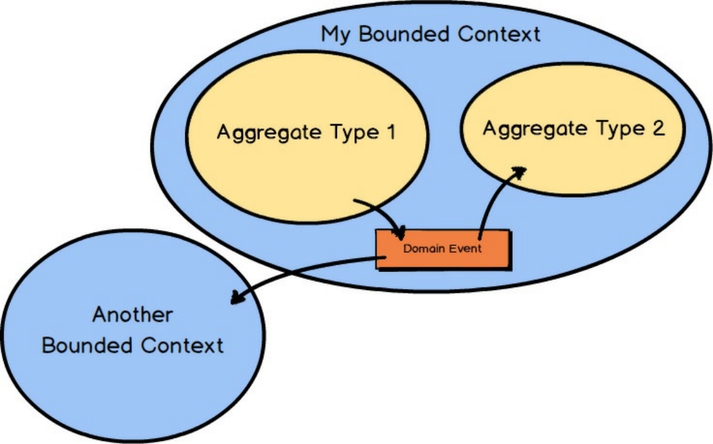


### **Tactical Design** 

After I have given you a sound foundation with strategic design, you will discover DDD’s most prominent tactical design tools. Tactical design is like using a thin brush to paint the fine details of your domain model. One of the more important tools is used to aggregate entities and value objects together into a right-sized cluster. It’s the _Aggregate_ pattern. 

DDD is all about modeling your domain in the most explicit way possible. Using _Domain Events_ will help you both to model explicitly and to share what has occurred within your model with the systems that need to know about it. The interested parties might be your own local _Bounded Context_ and other remote _Bounded Contexts._ 


### **The Learning Process and Refining Knowledge** 

DDD teaches a way of thinking to help you and your team refine knowledge as you learn about your business’s core competencies. This learning process is a matter of discovery through group conversation and experimentation. By questioning the status quo and challenging your assumptions about your software model, you will learn much, and this all-important knowledge acquisition will spread across the whole team. This is a critical investment in your business and team. The goal should be not only to learn and refine, but to learn and refine as quickly as possible. There are additional tools to help with those goals that can be found in Chapter 7 , “Acceleration and <u>Management Tools</u> .” 

### **Let’s Get Started!** 

Even in a condensed presentation, there’s plenty to learn about DDD. So let’s get started with <u>Chapter 2</u> , “Strategic Design with Bounded Contexts and the Ubiquitous Language .” 

**Chapter 2. Strategic Design with Bounded Contexts and the Ubiquitous Language** 


What are these things called _Bounded Contexts_ ? What’s the _Ubiquitous Language_ ? In short, DDD is primarily about modeling a _Ubiquitous Language_ in an explicitly _Bounded Context._ While true, that probably wasn’t the most helpful description that I could provide. Let me break this down for you. 


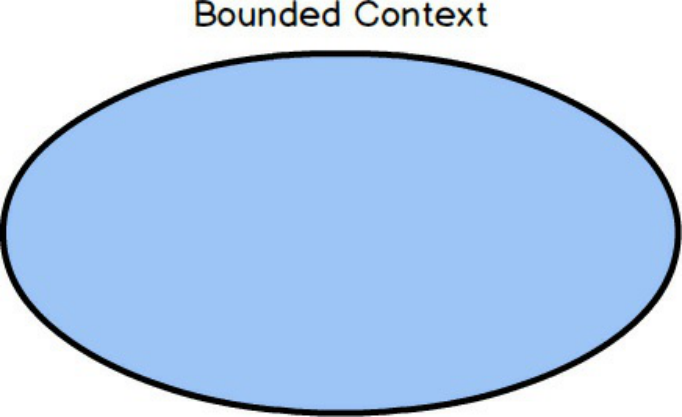


First, a _Bounded Context_ is a semantic contextual boundary. This means that within the boundary each component of the software model has a specific meaning and does specific things. The components inside a _Bounded Context_ are context specific and semantically motivated. That’s simple enough. 

When you are just getting started in your software modeling efforts, your _Bounded Context_ is somewhat conceptual. You could think of it as part of your _problem space._ However, as your model starts to take on deeper meaning and clarity, your _Bounded Context_ will quickly transition to your _solution space_ , with your software model being reflected as project source code. (The _problem space_ and _solution space_ are better explained in the box.) Remember that a _Bounded Context_ is where a model is implemented, and you will have separate software artifacts for each _Bounded Context._ 

**What Is a Problem Space and a Solution Space?** 

Your problem space is where you perform high-level strategic analysis and design steps within the constraints of a given project. You can use simple diagrams as you discuss the high-level project drivers and note important goals and risks. In practice, _Context Maps_ work very well in the problem space. Note too that _Bounded Contexts_ may be used in problem space discussions, when needed, but are also closely associated with your solution space. 

Your solution space is where you actually implement the solution that your problem space discussions identify as your _Core Domain._ When the _Bounded Context_ is being developed as a key strategic initiative of your organization, it’s called the _Core Domain._ You develop your solution in the _Bounded Context_ as code, both main source and test source. You will also produce code in your solution space that supports integration with other _Bounded Contexts_ . 


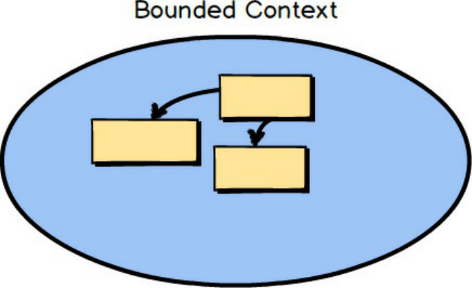


The software model inside the context boundary reflects a language that is developed by the team working in the _Bounded Context_ and is spoken by every member of the team that creates the software model that functions within that _Bounded Context._ The language is called the _Ubiquitous Language_ because it is both spoken among the team members and implemented in the software model. Thus, it is necessary that the _Ubiquitous Language_ be rigorous—strict, exact, stringent, and tight. In the diagram, the boxes inside the _Bounded Context_ represent the concepts of the model, which may be implemented as classes. When the _Bounded Context_ is being developed as a key strategic initiative of your organization, it’s called the _Core Domain._ 

When compared with all the software your organization uses, a _Core Domain_ is a software model that ranks among the most important, because it is a means to achieve greatness. A _Core Domain_ is developed to distinguish your organization competitively from all others. At the very least it addresses a major line of business. Your organization can’t excel at everything and shouldn’t even try. So you choose wisely what should be part of your _Core Domain_ and what should not. This is the primary value proposition of DDD, and you want to invest appropriately by committing your best resources to a _Core Domain._ 


When someone on the team uses expressions from the _Ubiquitous Language_ , everyone on the team understands what is meant with precision and constraints. The expression is ubiquitous within the team, as is all language used by the team that defines the software model being developed. When you consider language in a software model, think of the various nations that make up Europe. Within one of the countries across this space, the official language of each country is clear. Within the boundaries of those nations—for example, Germany, France, and Italy—the official languages are certain. As you cross a boundary, the official language changes. The same goes for Asia, where Japanese is spoken in Japan, and the languages spoken in China and Korea are clearly different across the national boundaries. You can think of _Bounded Contexts_ in much the same way, as being language boundaries. In the case of DDD, the languages are those spoken by the team that owns the software model, and a notable written form of the language is the software model’s source code. 

#### **Bounded Contexts, Teams, and Source Code Repositories** 

There should be one team assigned to work on one _Bounded Context._ There should also be a separate source code repository for each _Bounded Context._ It is possible that one team could work on multiple _Bounded Contexts_ , but multiple teams should not work on a single _Bounded Context._ Cleanly separate the source code and database schema for each _Bounded Context_ in the same way that you separate the _Ubiquitous Language._ Keep acceptance tests and unit tests together with the main source code. 

It is especially important to be clear that one team works on a single _Bounded Context._ This completely eliminates the chances of any unwelcome surprises that arise when another team makes a change to your source code. Your team owns the source code and the database and defines the official interfaces through which your _Bounded Context_ must be used. It’s a benefit of using DDD. 


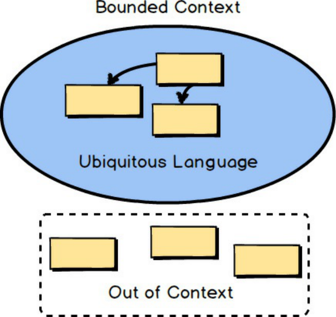


In human languages, terminology evolves over time, and across national boundaries the same or similar words take on nuances of meaning. Think of the differences between Spanish words used in Spain and those same words used in Colombia, where even the pronunciation changes. There is clearly Spain’s Spanish and Colombia’s Spanish. So too with software model languages. It’s possible that people from other teams would have a different meaning for the same terminology, because their business knowledge is within a different context; they are developing a different _Bounded Context._ Any components outside the context are not expected to adhere to the same definitions. In fact, they are probably different, either slightly or vastly, from the components that your team models. That’s fine. 


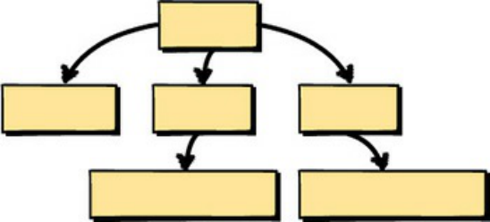


To understand one big reason to use _Bounded Contexts_ , let’s consider a common problem with software designs. Often teams don’t know when to stop piling more and more concepts into their domain models. The model may start out small and manageable . . . 


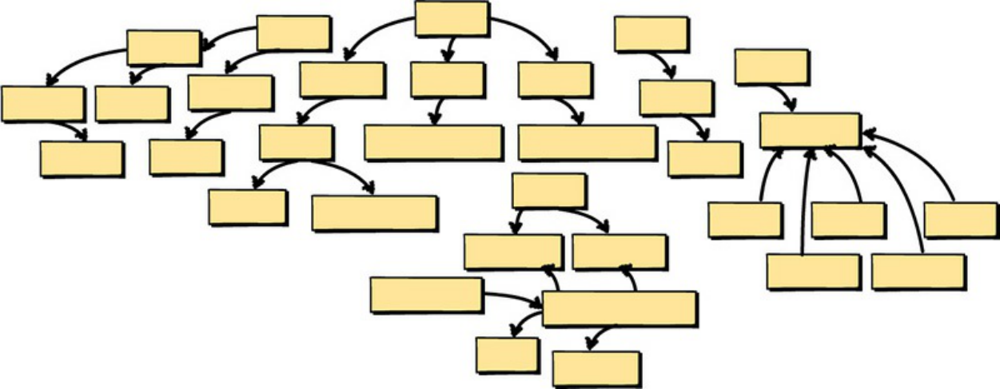


But then the team adds more concepts, and more, and still more. This soon results in a big problem. Not only are there too many concepts, but the language of the model becomes blurred, because when you think about it there are actually multiple languages in one large, confusing, unbounded model. 


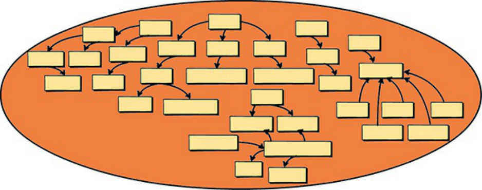


Due to this fault, teams will often turn a brand-new software product into what is called a _Big Ball of Mud._ To be sure, a _Big Ball of Mud_ is not something to be proud of. It’s a monolith, and worse. This is where a system has multiple tangled models without explicit boundaries. It probably also requires multiple teams to work on it, which is very problematic. Furthermore, various unrelated concepts are blown out over many modules and interconnected with conflicting elements. If this project has tests, it probably takes a very long time to run them, and so the tests may be bypassed at especially important times. 

It’s the product of trying to do too much, with too many people, in the wrong place. Any attempt to develop and speak a _Ubiquitous Language_ will result in a fractured and ill-defined dialect that will soon be abandoned. The language wouldn’t even be as well conceived as Esperanto. It’s just a mess, like a _Big Ball of Mud._ 


**Domain Experts and Business Drivers** There may be strong, or at least subtle, hints communicated by business stakeholders that could have been used to help the technical team make better modeling choices. Thus, a _Big Ball of Mud_ is often the result of unbridled effort made by a team of software developers who don’t listen to the business experts. 


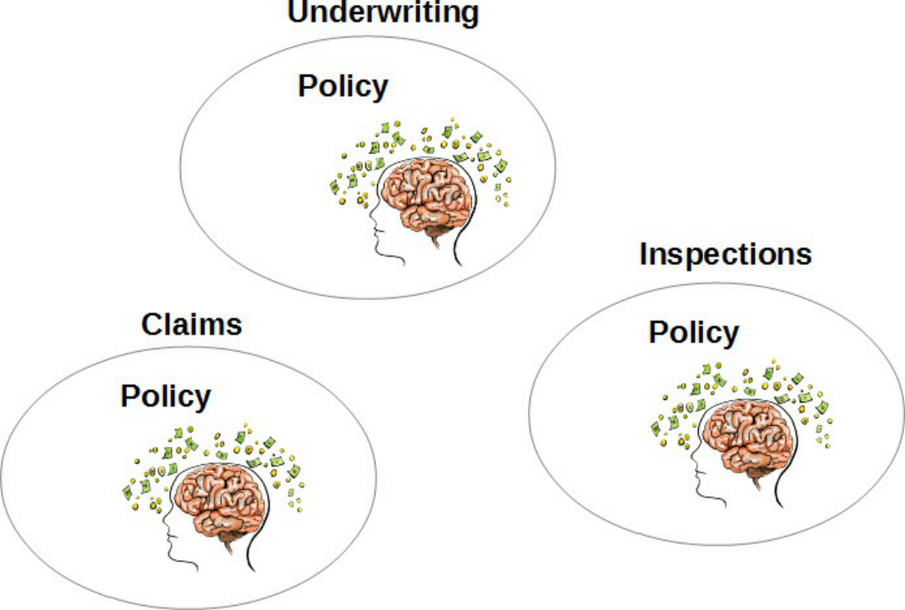


The business’s department or work group divisions can provide a good indication of where model boundaries should exist. You will tend to find at least one business expert per business function. Lately there is a trend toward grouping people by project, while business divisions or even functional groups under a management hierarchy seem to be less popular. Even in the face of newer business models you will still find that projects are organized according to business drivers and under an area 

of expertise. You may need to think of division or function in those terms. 

You can determine that this kind of segregation is needed when you consider that each business function likely has different definitions for the same term. Consider the concept named “policy” and how the meaning differs across the various insurance business functions. You can easily imagine that a policy in underwriting is vastly different from a policy in claims and a policy in inspections. See the box for more details. 

The policy in each of these business areas exists for different reasons. There is no escaping this fact, and no amount of mental gymnastics changes this. 

#### **Differences in Policies by Function** 

_Policy in Underwriting:_ In the area of expertise that is focused on underwriting, a policy is created based on the evaluation of the risks of the insured entity. For example, when working in underwriting for property insurance, the underwriters would assess the risks associated with a given property in order to calculate the premium for the policy to cover the property asset. 

_Policy in Inspections:_ Again, if we are working in the property insurance field, the insurance organization will likely have an inspections area of expertise that is responsible for inspecting a property that is to be insured. The underwriters are somewhat dependent on the information found during inspections, but only from the standpoint that the property is in the condition asserted by the insured. Assuming that a property will be insured, the inspection details—photos and notes—are associated with a policy in the inspections area, and its data can be referenced by underwriting to negotiate the final premium cost in the underwriting area. 

_Policy in Claims:_ A policy in the claims area of expertise tracks the request for payment by the insured based on the terms of the policy created by the underwriting area. The claims policy will need to make some references to the underwriting policy but will be focused on, for example, damages to the insured property and reviews performed by the claims personnel to determine the payment, if any, that should be made. 


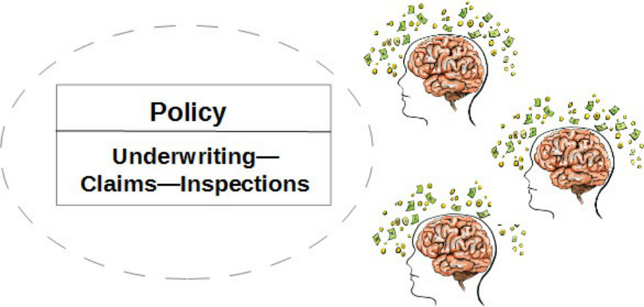


If you try to merge all three of these policy types into a single policy for all three business groups, you will certainly have problems. This would become even more problematic if the already- 

overloaded policy had to support a fourth and fifth business concept in the future. Nobody wins. 


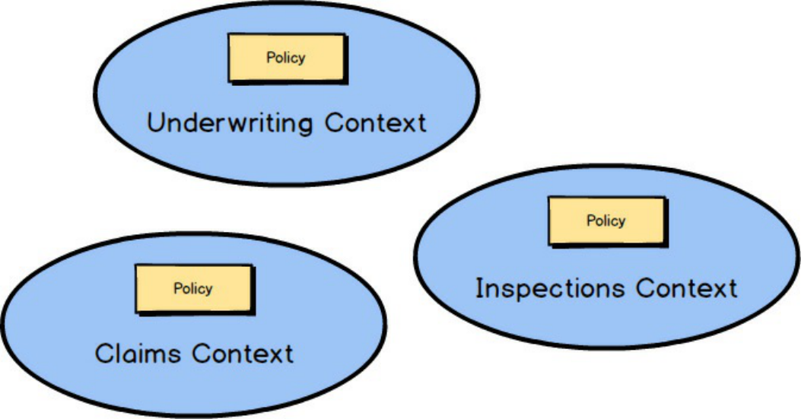


On the other hand, DDD emphasizes embracing such differences by segregating the differing types into different _Bounded Contexts._ Admit that there are different languages, and function accordingly. Are there three meanings for policy? Then there are three _Bounded Contexts_ , each with its own policy, with each policy having its own unique qualities. There’s no need to name these `UnderwritingPolicy` , `ClaimsPolicy` , or `InspectionsPolicy` . The name of the _Bounded Context_ takes care of that scoping. The name is simply `Policy` in all three _Bounded Contexts._ 

#### **Another Example: What Is a Flight?** 

In the airline industry, a “flight” can have multiple meanings. There is a flight that is defined as a single takeoff and landing, where the aircraft is flown from one airport to another. There is a different kind of flight that is defined in terms of aircraft maintenance. And there is yet another flight that is defined in terms of passenger ticketing, either nonstop or one-stop. Because each of these uses of “flight” is clearly understood only by its context, each should be modeled in a separate _Bounded Context._ To model all three of these in the same _Bounded Context_ would lead to a confusing tangle. 


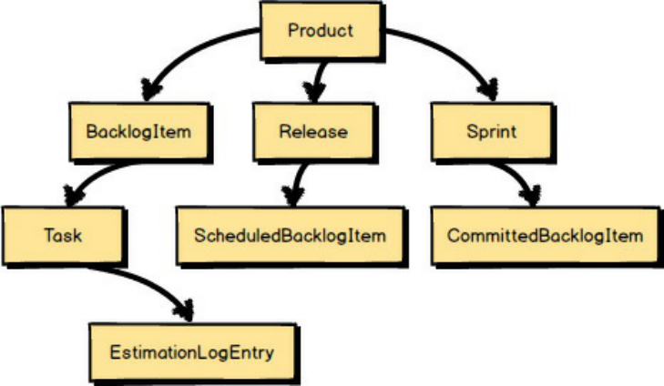


### **Case Study** 

To make the reason to use _Bounded Contexts_ more concrete, let me illustrate with a sample domain model. In this case we are working on a Scrum-based agile project management application. So, a central or core concept is Product, which represents the software that is to be built and that will be refined over perhaps years of development. The Product has Backlog Items, Releases, and Sprints. Each Backlog Item has a number of Tasks, and each Task can have a collection of Estimation Log Entries. Releases have Scheduled Backlog Items and Sprints have Committed Backlog Items. So far, so good. We have identified the core concepts of our domain model, and the language is focused and intact. 


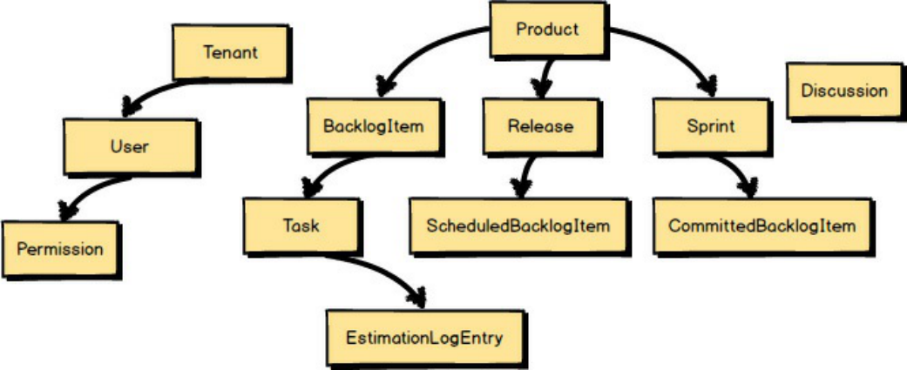


“Oh, yeah,” say the team members, “we also need our users. And we want to facilitate collaborative discussions within the product team. Let’s represent each subscribing organization as a Tenant. Within Tenants we will allow the registration of any number of Users, and Users will have Permissions. And let’s add a concept called Discussion to represent one of the collaborative tools that we will support.” 


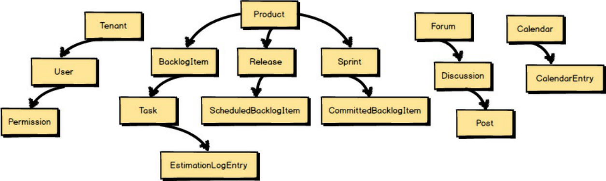


Then the team members add, “Well, there are also other collaboration tools. Discussions belong within Forums and Discussions have Posts. Also we want to support Shared Calendars.” 


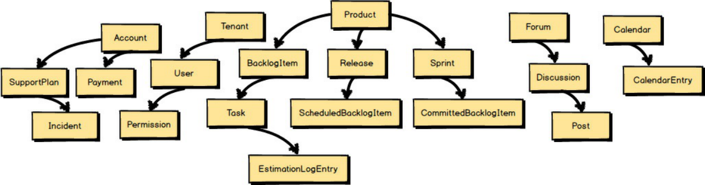


They continue: “And don’t forget that we need a way for Tenants to make Payments. We will also sell tiered support plans, so we need a way to track support incidences. Both Support and Payments should be managed under an Account.” 


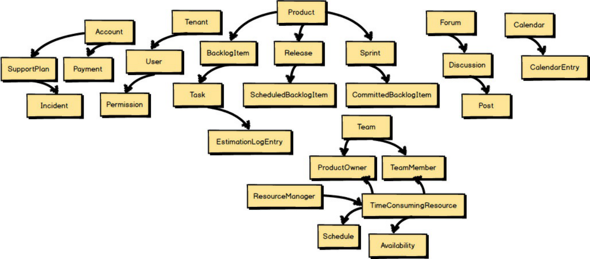


And still more concepts emerge: “Every Scrum-based Product has a specific Team that works on the product. Teams are composed of a single Product Owner and a number of Team Members. But how can we address Human Resource Utilization concerns? Hmmm, what if we modeled the Schedules of Team Members along with their utilization and availability?” 


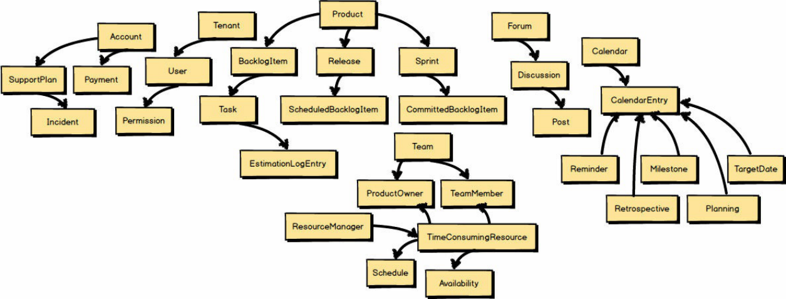


“You know what else?” they ask. “Shared Calendars should not be limited to bland Calendar Entries. We should be able to identify specific kinds of Calendar Entries, such as Reminders, Team Milestones, Planning and Retrospective Meetings, and Target Dates.” 

Hang on a minute! Do you see the trap that the team is falling into? Look at how far they have strayed from the original core concepts of Product, Backlog Items, Releases, and Sprints. The language is no longer purely about Scrum; it has become fractured and confused. 


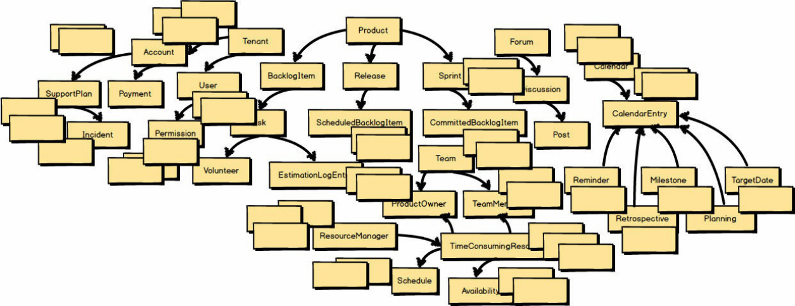


Don’t be fooled by the somewhat limited number of named concepts. For every named element, we might expect to have two or three more concepts to support those that quickly popped into mind. The team is already well on its way to delivering a _Big Ball of Mud_ and the project has barely started. 


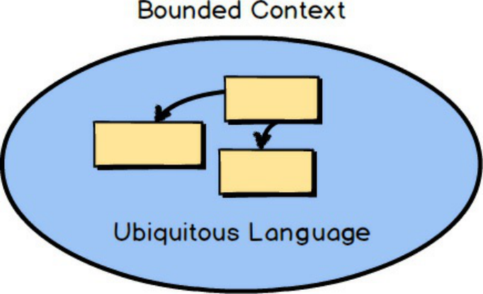


### **Fundamental Strategic Design Needed** 

What tools are available with DDD to help us avoid such pitfalls? You need at least two fundamental strategic design tools. One is the _Bounded Context_ and the other is the _Ubiquitous Language._ Employing a _Bounded Context_ forces us to answer the question “What is core?” The _Bounded Context_ should hold closely all concepts that are core to the strategic initiative and push out all others. The concepts that remain are part of the team’s _Ubiquitous Language._ You will see how DDD works to avoid the design of monolithic applications. 

#### **Testing Benefits** 

Because _Bounded Contexts_ are not monolithic, other benefits are experienced when they are used. One such benefit is that tests will be focused on one model and thus be fewer in number and will run more quickly. Although this isn’t the primary motivation to use _Bounded Contexts_ , it sure pays off in other ways. 


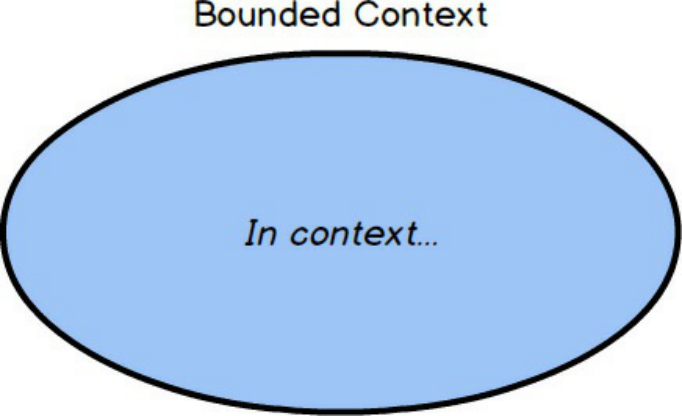


Literally, some concepts will be in context and be clearly included in the team’s language. 


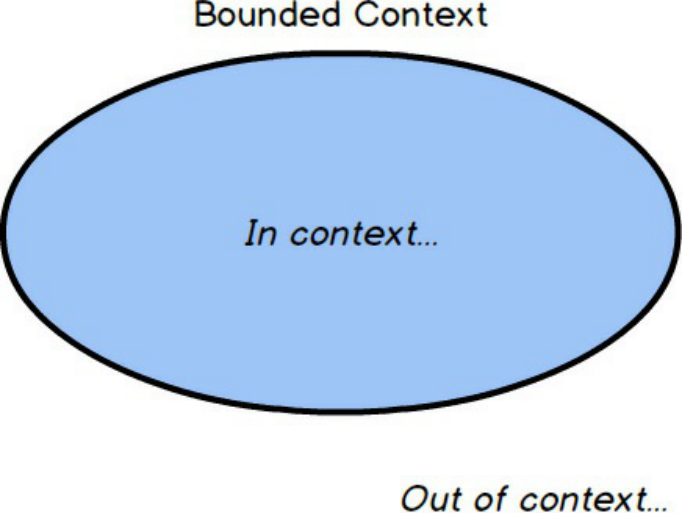


And other concepts will be out of context. The concepts that survive this stringent application of core-only filtering are part of the _Ubiquitous Language_ of the team that owns the _Bounded Context._ 

#### **Take Note** 

The concepts that survive this stringent application of core-only filtering are part of the _Ubiquitous Language_ of the team that owns the _Bounded Context._ The boundary emphasizes the rigor inside. 


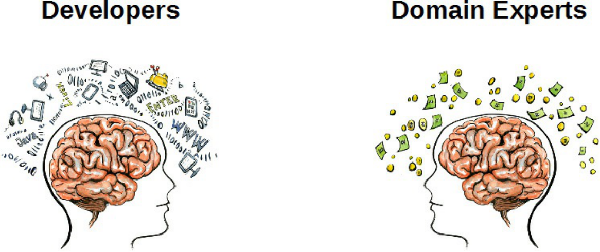


So, how do we know what is core? This is where we have to bring together two vital groups of individuals into one cohesive, collaborative team: _Domain Experts_ and software developers. 


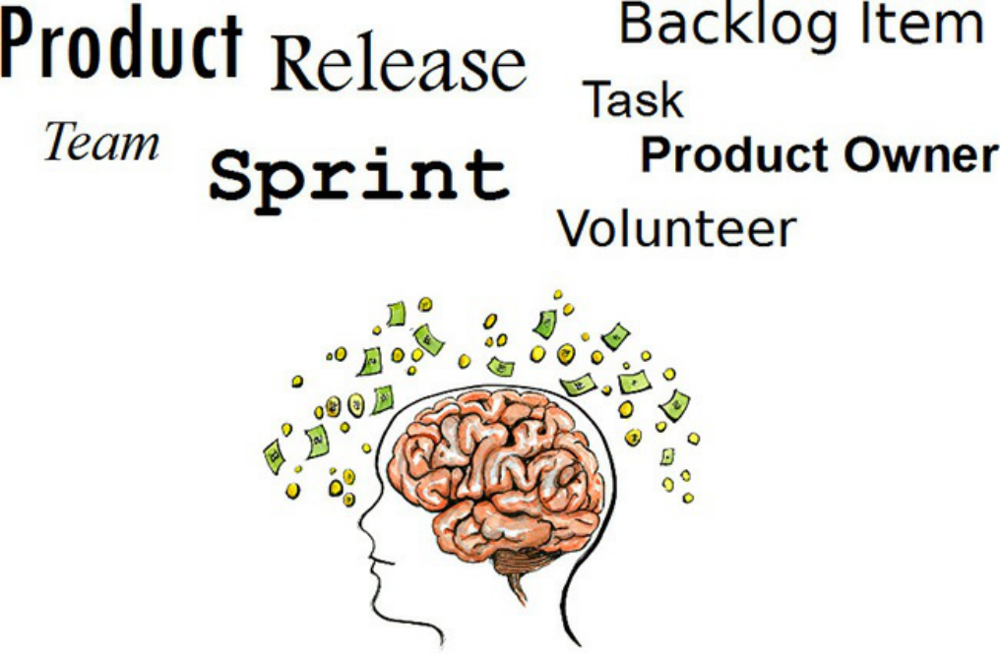


The _Domain Experts_ will naturally be more focused on business concerns. Their thoughts will be centered on their vision of how the business works. In the domain of Scrum, count on the _Domain Expert_ being a Scrum Master who thoroughly understands how Scrum is executed on a project. 

#### **Product Owner or Domain Expert?** 

You may wonder what the difference is between a Scrum product owner and a DDD _Domain Expert._ Well, in some cases they might be one and the same, that is, one person capable of filling both roles. Yet it should not be surprising that a product owner is typically more focused on managing and prioritizing the product backlog and seeing to it that the conceptual and technical continuity of the project is maintained. This doesn’t mean, however, that the product owner is naturally an expert in the business’s core competency in which you are working. Make sure that you have a true _Domain Expert_ on the team, and don’t substitute a product owner without the necessary know-how instead. 

In your particular business, you also have _Domain Experts._ It’s not a job title but rather describes those who are primarily focused on the business. It’s their mental model that we start with to form the foundation of the team’s _Ubiquitous Language._ 


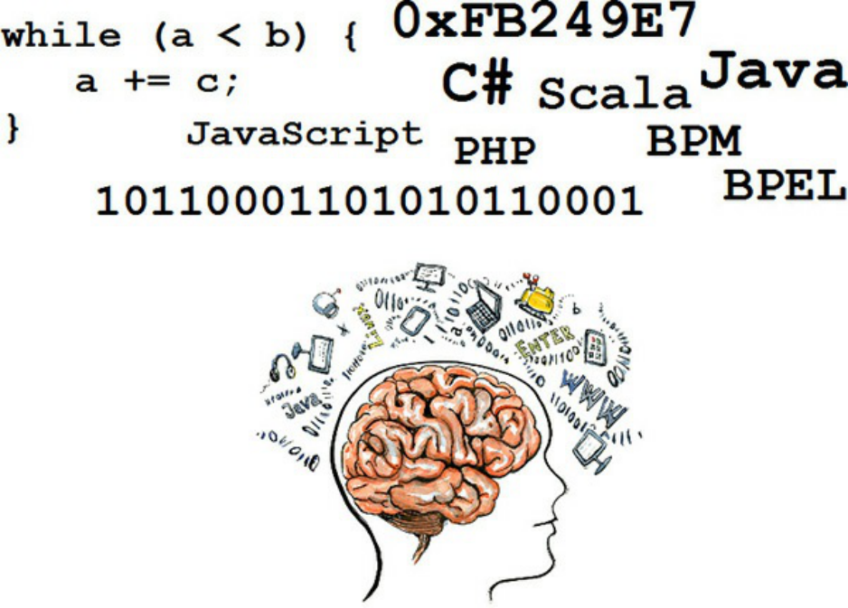


On the other hand, developers are focused on software development. As depicted here, developers can become consumed by programming languages and technologies. Yet developers working in a DDD project need to carefully resist the urge to be so technically centered that they cannot accept the business focus of the core strategic initiative. Rather, the developers should reject any uncalled-for terseness and be able to embrace the _Ubiquitous Language_ that is gradually developed by the team inside their particular _Bounded Context._ 

#### **Focus on Business Complexity, Not Technical Complexity** 

You are using DDD because the business model complexity is high. We never want to make the domain model more complex than it should be. Still, you are using DDD because the business model is more complex than the technical aspects of the project. That’s why the developers have to dig into the business model with _Domain Experts_ ! 


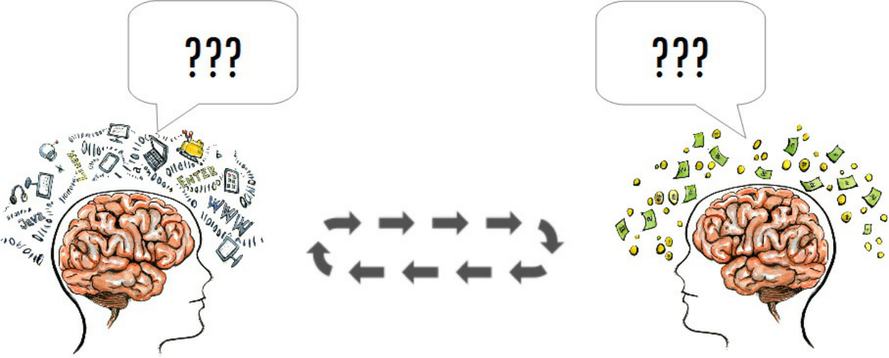


Both developers and _Domain Experts_ should reject any tendency to allow documents to rule over conversation. The best _Ubiquitous Language_ will be developed by a collaborative feedback loop that drives out the combined mental model of the team. Open conversation, exploration, and challenges to your current knowledge base result in deeper insights about the _Core Domain._ 

### **Challenge and Unify** 

Now back to the question “What is core?” Using the previously out-of-control and ever-expanding model, let’s challenge and unify! 


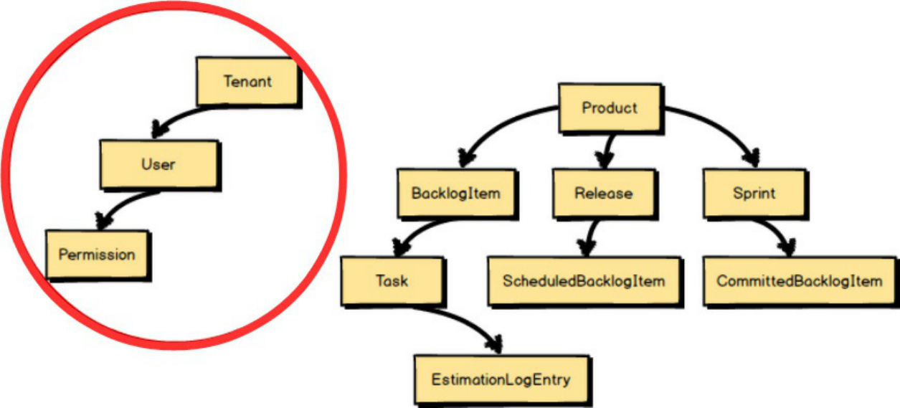


One very simple challenge is to ask whether each of the large-model concepts adheres to the _Ubiquitous Language_ of Scrum. Well, do they? For example, `Tenant` , `User` , and `Permission` have nothing to do with Scrum. These concepts should be factored out of our Scrum software model. 


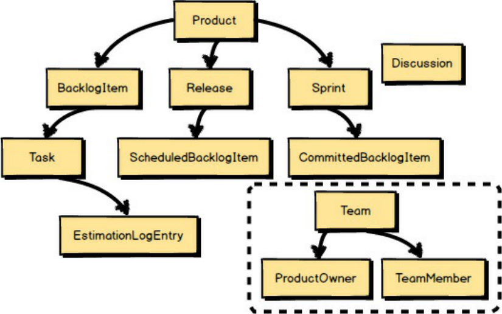


`Tenant` , `User` , and `Permission` should be replaced by `Team` , `ProductOwner` , and `TeamMember` . A `ProductOwner` and a `TeamMember` are actually `Users` in a `Tenancy` , but with `ProductOwner` and `TeamMember` we adhere to the _Ubiquitous Language_ of Scrum. They are naturally the terms we use when we have conversations about Scrum products and the work a team does with them. 


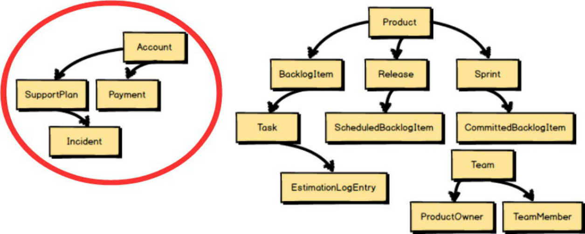


Are `SupportPlans` and `Payments` really part of Scrum project management? The answer here is clearly “no.” True, both `SupportPlans` and `Payments` will be managed under a `Tenant` ’s `Account` , but these are not part of our core Scrum language. They are out of context and are removed from this model. 


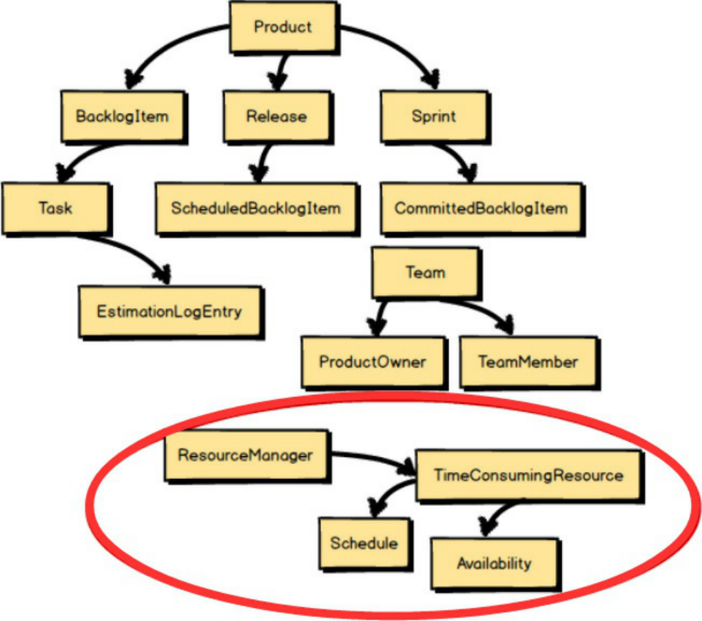


What about introducing Human Resource Utilization concerns? It’s probably useful to someone, but it’s not going to be directly used by `TeamMember Volunteers` who will work on `BacklogItemTasks` . It’s out of context. 


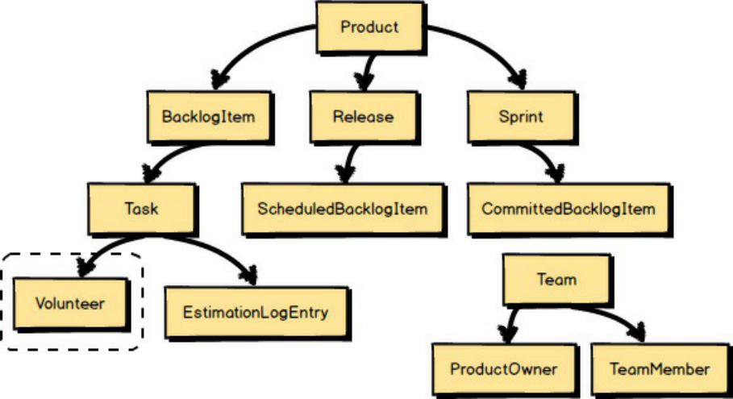


After the addition of the `Team` , `ProductOwner` , and `TeamMember` , the modelers realized that they were missing a core concept to allow `TeamMembers` to work on `Tasks` . In Scrum this is 

known as a `Volunteer` . So, the `Volunteer` concept is in context and was included in the language of the core model. 


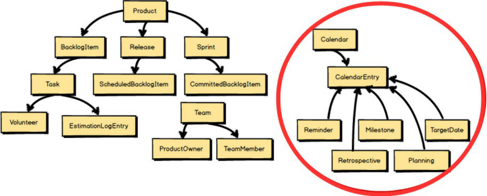


Even though calendar-based `Milestones` , `Retrospectives` , and the like are in context, the team would prefer to save those modeling efforts for a later sprint. They are in context, but for now they are out of scope. 


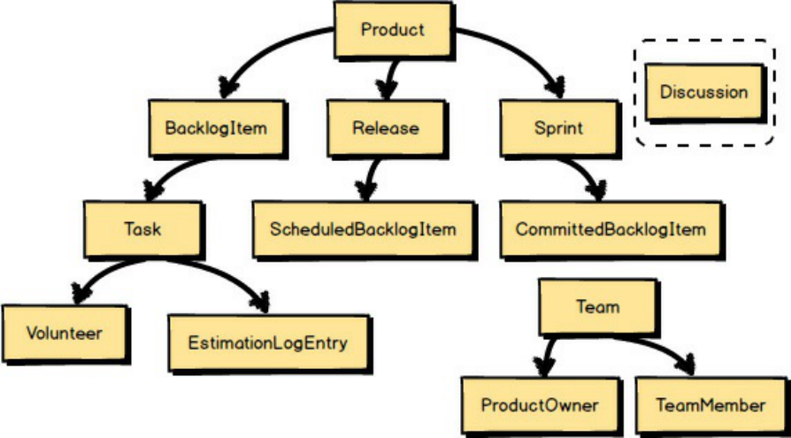


Finally, the modelers want to make sure that they account for the fact that threaded `Discussions` will be part of the core model. So they model a `Discussion` . This means that `Discussion` is part of the team’s _Ubiquitous Language_ , and thus inside the _Bounded Context._ 


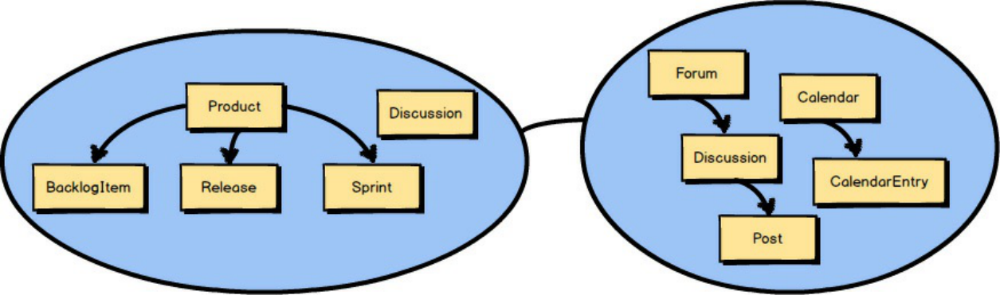


These linguistic challenges have resulted in a much cleaner and clearer model of the _Ubiquitous Language._ Yet how will the Scrum model fulfill needed _Discussions_ ? It would certainly require a lot of ancillary software component support to make it work, so it seems inappropriate to model it inside our Scrum _Bounded Context._ In fact, the full _Collaboration_ suite is out of context. The _Discussion_ will be supported by integrating with another _Bounded Context_ —the _Collaboration Context._ 


After that walk-through, we’re left with a much smaller actual _Core Domain._ Of course the _Core Domain_ will grow. We already know that `Planning` , `Retrospectives` , `Milestones` , and related calendar-based models must be developed in time. Still, the model will grow only as new concepts adhere to the _Ubiquitous Language_ of Scrum. 


And what about all the other modeling concepts that have been removed from the _Core Domain_ ? It’s quite possible that several of the other concepts, if not all, will be composed into their own respective _Bounded Contexts_ , each adhering to its own _Ubiquitous Language._ Later you will see how we integrate with them using _Context Mapping._ 

### **Developing a Ubiquitous Language** 

So how do you actually go about developing a _Ubiquitous Language_ within your team as you put into practice one of the chief tools provided by DDD? Is your _Ubiquitous Language_ formed from a set of well-known nouns? Nouns are important, but often software developers put too much emphasis on the nouns within a domain model, forgetting that spoken language is composed of far more than nouns alone. True, we have mainly focused on nouns within our previous sample _Bounded Contexts_ to this point, but that’s because we were interested in another aspect of DDD, that of constraining a _Core Domain_ down to essential model elements. 

#### **Accelerate Your Discovery** 

You may want to try a few _Event Storming_ sessions as you work on your scenarios. These can help you to quickly understand which scenarios you should be working on, and how they should be prioritized. Likewise, developing concrete scenarios will give you a better idea of the direction that you should take in your _Event Storming_ sessions. They are two tools that work well together. I explain the use of _Event Storming_ in <u>Chapter 7</u> , “Acceleration and Management Tools .” 

Don’t limit your _Core Domain_ to nouns alone. Rather, consider expressing your _Core Domain_ as a set of concrete scenarios about what the domain model is supposed to do. When I say “scenarios” I don’t mean use cases or user stories, such as is common in software projects. I literally mean 

scenarios in terms of how the domain model should work—what the various components do. This can be accomplished in the most thorough way only by collaborating as a team of both _Domain Experts_ and developers. 

Here’s an example of a scenario that fits with the _Ubiquitous Language_ of Scrum: 

_Allow each backlog item to be committed to a sprint. The backlog item may be committed only if it is already scheduled for release. If it is already committed to a different sprint, it must be uncommitted first. When the commit completes, notify interested parties._ 

Notice that this is not just a scenario about how humans use Scrum on a project. We are not talking about human procedures. Rather, this scenario is a description of how the very real software model components are used to support the management of a Scrum-based project. 

The previous scenario is not a perfectly stated one, and a perk of using DDD is that we are constantly on the lookout for ways to improve the model. Yet this is a decent start. We hear nouns spoken, but our scenario doesn’t limit us to nouns. We also hear verbs and adverbs, and other kinds of grammar. You also hear that there are constraints—conditions that must be met before the scenario can be completed to its successful end. The most important benefit and empowering feature is that you can actually have conversations about how the domain model works—its design. 

We can even draw simple pictures and diagrams. It’s all about doing whatever is needed to communicate well on the team. One word of warning is appropriate here. Be careful about the time spent in your domain-modeling efforts when it comes to keeping documents with written scenarios and drawings and diagrams up-to-date over the long haul. Those things are not the domain model. Rather, they are just tools to help you develop a domain model. In the end the code is the model and the model is the code. Ceremony is for distinguished observances, like weddings, not domain models. This doesn’t mean that you forgo any efforts to freshen scenarios, but only do so as long as it is helpful rather than burdensome. 

What would you do to improve a part of the _Ubiquitous Language_ in our previous example? Think about it for just a minute. What’s missing? Before too long you probably wish for an understanding of _who_ does the committing of backlog items to a sprint. Let’s add the _who_ and see what happens: 

_The product owner commits each backlog item to a sprint . . ._ 

You will find in many cases that you should name each persona involved in the scenario and give some distinguishing attribute to other concepts such as to the backlog item and sprint. This will help to make your scenario more concrete and less like a set of statements about acceptance criteria. Still, in this particular case there isn’t a strong reason to name the product owner or further describe the backlog item and sprint involved. In this case all product owners, backlog items, and sprints will work the same way whether or not they have a concrete persona or identity. In cases where giving names or other distinguishing identities to concepts in the scenario helps, use them: 

_The product owner Isabel commits the View User Profile backlog item to the Deliver User Profiles sprint . . ._ 

Now let’s pause for a moment. It’s not that the product owner is the sole individual responsible for deciding that a backlog item will be committed to a sprint. Scrum teams wouldn’t like that very much, because they would be committed to delivering software within some time frame that they had no say in determining. Still, for our software model it may be most practical for a single person to have the 

responsibility to carry out this particular action on the model. So in this case we have stated that it’s the product owner role that does this. Even so, the nature of Scrum teams forces the question “Is there anything that must be done by the remainder of the team to enable the product owner to perform the commitment?” 

Do you see what has happened? By challenging the current model with the _who_ question, we have been led to an opportunity for deeper insight into the model. Perhaps we should require at least some team consensus that a backlog item can be committed before actually allowing the product owner to carry out the commit operation. This could lead to the following refined scenario: 

_The product owner commits a backlog item to a sprint. The backlog item may be committed only if it is already scheduled for release, and if a quorum of team members have approved commitment . . ._ 

OK, now we have a refined _Ubiquitous Language_ , because we have identified a new model concept called a _quorum._ We decided that there must be a _quorum_ of team members who agree that a backlog item should be committed, and there must be a way for them to _approve_ commitment. This has now introduced a new modeling concept and some idea that the user interface will have to facilitate these team interactions. Do you see the innovation unfolding? 

There is another _who_ missing from the model. Which one? Our opening scenario concluded: 

_When the commit completes, notify interested parties._ 

Who or what are the interested parties? This question and challenge further lead to modeling insights. Who needs to know when a backlog item has been committed to a sprint? Actually one important model element is the sprint itself. The sprint needs to track total sprint commitment, and what effort is already required to deliver all the sprint’s tasks. However you decide to design the sprint to track that, the important point now is for the sprint to be notified when a backlog item is committed to it: 

_If it is already committed to a different sprint, it must be uncommitted first. When the commitment completes, notify the sprint from which it was uncommitted and the sprint to which it is now committed._ 

Now we have a fairly decent domain scenario. This concluding sentence has also led us to an understanding that the backlog item and the sprint may not necessarily be aware of commitment at the same time. We need to ask the business to be certain, but it sounds like a great place to introduce _eventual consistency._ You will see why that is important and how it is accomplished in <u>Chapter 5</u> , “Tactical Design with Aggregates .” 

The refined scenario in its entirety looks like this: 

_The product owner commits a backlog item to a sprint. The backlog item may be committed only if it is already scheduled for release, and if a quorum of team members have approved commitment. If it is already committed to a different sprint, it must be uncommitted first. When the commitment completes, notify the sprint from which it was uncommitted and the sprint to which it is now committed._ 

How would a software model actually work in practice? You can well imagine a very innovative user interface supporting this software model. As a Scrum team is participating in a sprint planning 

session, team members use their smartphones or other mobile devices to add their approval to each backlog item as it is discussed and agreed upon to work on during the next sprint. The consensus of the quorum of team members approving each of the backlog items gives the product owner the ability to commit all of the approved backlog items to the sprint. 

### **Putting Scenarios to Work** 

You may be wondering how you can make the transition from a written scenario to some sort of artifact that can be used to validate your domain model against the team’s specifications. There is a technique named _Specification by Example_ <u>[Specification]</u> that can be used; it’s also called _Behavior-Driven Development_ <u>[BDD]</u> . What you are trying to achieve with this approach is to collaboratively develop and refine a _Ubiquitous Language_ , model with a shared understanding, and determine whether your model adheres to your specifications. You will do this by creating acceptance tests. Here is how we might restate the preceding scenario as an executable specification: **<u>Click here to view code image</u>** 

```
Scenario:
```

```
  The product owner commits a backlog item to a sprint
   Given a backlog item that is scheduled for release
   And the product owner of the backlog item
   And a sprint for commitment
   And a quorum of team approval for commitment
   When the product owner commits the backlog item to the sprint
   Then the backlog item is committed to the sprint
   And the backlog item committed event is created
```

With a scenario written in this form, you can create some backing code and use a tool to execute this specification. Even without a tool, you may find that this form of scenario authoring with its given/when/then approach works better than the previous scenario authoring example. Yet executing your specifications as a means of validating the domain model may be hard to resist. I comment on this further in <u>Chapter 7</u> , “Acceleration and Management Tools .” 

You don’t have to use this form of executable specification in order to validate your domain model against your scenarios. You can use a unit testing framework to accomplish much the same thing, where you create acceptance tests (not unit tests) that validate your domain model: 

**<u>Click here to view code image</u>** 

```
/*
```

```
 The product owner commits a backlog item to a sprint.
 The backlog item may be committed only if it is already
 scheduled for release, and if a quorum of team members
 have approved commitment. When the commitment completes,
 notify the sprint to which it is now committed.
*/
```

```
[Test]
public void ShouldCommitBacklogItemToSprint()
{
  // Given
  var backlogItem = BacklogItemScheduledForRelease();
  var productOwner = ProductOwnerOf(backlogItem);
```

```
  var sprint = SprintForCommitment();
```

```
  var quorum = QuorumOfTeamApproval(backlogItem, sprint);
```

```
  // When
  backlogItem.CommitTo(sprint, productOwner, quorum);
  // Then
  Assert.IsTrue(backlogItem.IsCommitted());
  var backlogItemCommitted =
    backlogItem.Events.OfType<BacklogItemCommitted>().SingleOrDefault();
  Assert.IsNotNull(backlogItemCommitted);
}
```

This unit-test-based approach to acceptance testing accomplishes the same goal as the executable specification. The advantage here may be the ability to write this kind of scenario validation more rapidly but at the cost of some readability. Still, most _Domain Experts_ should be able to follow this code with some help from the developer. When using this approach it would probably work best to maintain the document form of the scenario associated with the validation code in comments, as seen in this example. 

Whichever approach you decide on, both will generally be used in a red-green (fail-pass) fashion, where your specification will first fail when run, because there is no implementation of domain model concepts yet to be validated. You stepwise refine your domain model through a series of red results until you fully support your specification and the validations pass (you see all green). These acceptance tests will be directly associated with your _Bounded Context_ and kept in its source code repository. 

### **What about the Long Haul?** 

Now you may be wondering how we should support the _Ubiquitous Language_ once the innovation has ceased and maintenance sets in. Actually, some of the best learning, or knowledge acquisition, takes place over a long period of time, even during what some might refer to as “maintenance.” It is a mistake for teams to take the view that innovation ends when maintenance begins. 

Perhaps the worst thing that could happen is for the label “maintenance phase” to be attached to a _Core Domain._ A continuous learning process is not a phase at all. The _Ubiquitous Language_ that was developed early on must continue to thrive as years pass. True, it may eventually be less significant, but probably not for quite a while. It is all part of your organization’s commitment to a core initiative. If this long-term commitment cannot be made, is this model that you are working on today truly a strategic differentiator, a _Core Domain_ ? 


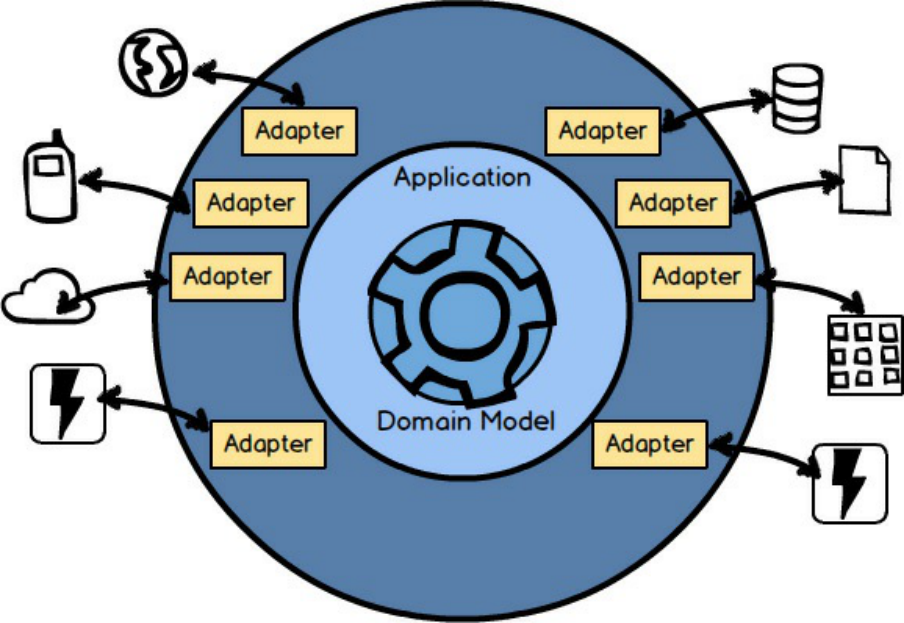


### **Architecture** 

There is another question that you may have wondered about. What’s inside a _Bounded Context_ ? Using this _Ports and Adapters_ <u>[IDDD]</u> architecture diagram, you can see that a _Bounded Context_ is composed of more than a domain model. 


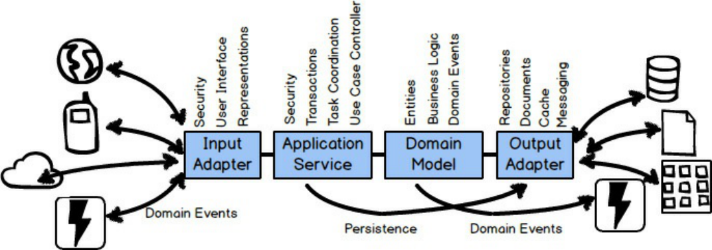


These layers are common in a _Bounded Context: Input Adapters_ , such as user interface controllers, REST endpoints, and message listeners; _Application Services_ that orchestrate use cases and manage transactions; the domain model that we’ve been focusing on; and _Output Adapters_ such as persistence management and message senders. There is much to be said about the various layers in this architecture, and it is too elaborate to state in this distilled book. See <u>Chapter 4</u> of _Implementing Domain-Driven Design_ <u>[IDDD]</u> for an exhaustive discussion. 

#### **Technology-Free Domain Model** 

Although there will be technology scattered throughout your architecture, the domain model should be free of technology. For one thing, that’s why transactions are managed by the application services and not by the domain model. 

Ports and Adapters can be used as a foundational architecture, but it’s not the only one that can be used along with DDD. Along with Ports and Adapters, you can use DDD with any of these architectures or architecture patterns (and others), mixing and matching them as needed: 

- Event-Driven Architecture; _Event Sourcing_ <u>[IDDD]</u> . Note that _Event Sourcing_ is discussed in this book in <u>Chapter 6</u> , “Tactical Design with Domain Events .” 

- . 

- • Command Query Responsibility Segregation (CQRS) <u>[IDDD]</u> 

- Reactive and Actor Model; see _Reactive Messaging Patterns with the Actor Model_ <u>[Reactive]</u> , which also elaborates on the use of the Actor model with DDD. 

- . 

- • Representational State Transfer (REST) <u>[IDDD]</u> 

- . 

- • Service-Oriented Architecture (SOA) <u>[IDDD]</u> 

- Microservices are explained in _Building Microservices_ <u>[Microservices]</u> as essentially equivalent to DDD _Bounded Contexts_ , so both the book you are reading and _Implementing Domain-Driven Design_ <u>[IDDD]</u> discuss the development of microservices from that perspective. 

- Cloud computing is supported in much the same way as microservices, such that anything you read in this book, in _Implementing Domain-Driven Design_ <u>[IDDD]</u> , and in _Reactive Messaging Patterns with the Actor Model_ <u>[Reactive]</u> is applicable. 

Another comment on microservices is in order. Some consider a microservice to be much smaller than a DDD _Bounded Context._ Using that definition, a microservice models only one concept and manages one narrow type of data. An example of such a microservice is a `Product` and another is a `BacklogItem` . If this is the granularity that you consider a worthy microservice, understand that both the `Product` microservice and the `BacklogItem` microservice will still be in the same larger, logical _Bounded Context._ The two small microservice components have only different deployment units, which may also have an impact on how they interact (see _Context Mapping_ ). Linguistically they are still within the same Scrum-based contextual and semantic boundary. 

### **Summary** 

In summary you have learned: 

- Some of the major pitfalls of putting too much into one model and creating a _Big Ball of Mud_ 

- The application of DDD strategic design 

- The use of _Bounded Context_ and _Ubiquitous Language_ 

- How to challenge your assumptions and unify mental models 

- How to develop a _Ubiquitous Language_ 

- About the architectural components found inside a _Bounded Context_ 

- That DDD is not too difficult to put into practice yourself! 

For a more in-depth treatment of _Bounded Contexts_ , see <u>Chapter 2</u> of _Implementing Domain-Driven_ . _Design_ <u>[IDDD]</u> 

## **Chapter 3. Strategic Design with Subdomains** 


When you work on a DDD project, there are always multiple _Bounded Contexts_ in play. One of the _Bounded Contexts_ will be the _Core Domain_ , and there will also be various _Subdomains_ in other _Bounded Contexts._ In the previous chapter you saw the importance of dividing different models by their specific _Ubiquitous Language_ and forming multiple _Bounded Contexts_ . There are six _Bounded Contexts_ and six _Subdomains_ in the preceding diagram. Because DDD strategic design was used, the teams achieved the most optimal modeling composition: one _Subdomain_ per _Bounded Context_ , and one _Bounded Context_ per _Subdomain._ In other words, the _Agile Project Management Core_ is both one clean _Bounded Context_ and one clean _Subdomain._ In some situations, there may be multiple _Subdomains_ in one _Bounded Context_ , but that doesn’t achieve the most optimal modeling outcome. 

### **What Is a Subdomain?** 

Simply stated, a _Subdomain_ is a sub-part of your overall business domain. You can think of a _Subdomain_ as representing a single, logical domain model. Most business domains are usually too large and complex to reason about as a whole, so we generally concern ourselves only with the _Subdomains_ that we must use within a single project. _Subdomains_ can be used to logically break up your whole business domain so that you can understand your _problem space_ on a large, complex project. 

Another way to think of a _Subdomain_ is that it is a clear area of expertise, assuming that it is responsible for providing a solution to a core area of your business. This implies that the particular _Subdomain_ will have one or more _Domain Experts_ who understand very well the aspects of the business that a specific _Subdomain_ facilitates. The _Subdomain_ also has greater or lesser strategic significance to your business. 

If DDD had been used to develop it, the _Subdomain_ would have been implemented as a clean 

_Bounded Context._ The _Domain Experts_ who specialize in that particular area of the business would have been members of the team that developed the _Bounded Context._ Although using DDD to develop a clean _Bounded Context_ is the optimal choice, sometimes we can only wish that had been the case. 

### **Types of Subdomains** 

There are three primary types of _Subdomains_ within a project: 

- _Core Domain:_ This is where you are making a strategic investment in a single, well-defined domain model, committing significant resources for carefully crafting your _Ubiquitous Language_ in an explicit _Bounded Context._ This is very high on your organization’s list of projects because it will distinguish it from all competitors. Since your organization can’t be distinguished in everything that it does, your _Core Domain_ demarcates where it must excel. Achieving the level of deep learning and understanding required to make such a determination requires commitment, collaboration, and experimentation. It’s where the organization needs to invest most liberally in software. I provide the means to accelerate and manage such projects efficiently and effectively later in this book. 

- _Supporting Subdomain:_ This is a modeling situation that calls for custom development, because an off-the-shelf solution doesn’t exist. However, you will still not make the kind of investment that you have made for your _Core Domain._ You may want to consider outsourcing this kind of _Bounded Context_ to avoid mistaking it for something strategically distinguishing, and thus investing heavily in it. This is still an important software model, because your _Core Domain_ cannot be successful without it. 

- _Generic Subdomain:_ This kind of solution may be available for purchase off the shelf but may also be outsourced or even developed in house by a team that doesn’t have the kind of elite developers that you assign to your _Core Domain_ or even a lesser _Supporting Subdomain._ Be careful not to mistake a _Generic Subdomain_ for a _Core Domain._ You don’t want to make that kind of investment here. 

When discussing a project where DDD is being employed, we are most likely discussing a _Core Domain._ 

### **Dealing with Complexity** 

Some of the system boundaries within a business domain will very likely be legacy systems, perhaps those that your organization has created or those that have been purchased through software licensing. At this point you may not be able to do much about improving those legacy systems, but you still need to reason about them when they have an impact on your _Core Domain_ project. To do so, use _Subdomains_ as a tool for discussing your _problem space._ 


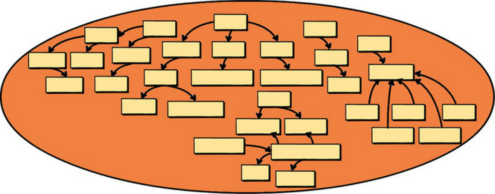


Unfortunately, but true all the same, some legacy systems are so counter to the DDD way of designing with _Bounded Contexts_ that you might even refer to them as _unbounded_ legacy systems. That’s because such a legacy system is what I’ve already referred to as a _Big Ball of Mud._ In reality the one system is full of multiple tangled models that should have been separately designed and implemented but were jumbled together into one very complex and intertwined mess. 


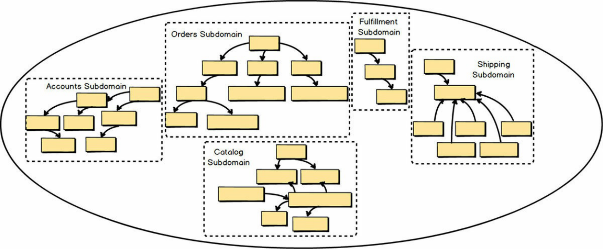


Stated another way, when we are discussing a legacy system there are probably some, even many, _logical_ domain models that exist inside that one legacy system. Think of each of those logical domain models as a _Subdomain._ In the diagram, each logical _Subdomain_ in the unbounded legacy monolithic _Big Ball of Mud_ is marked off by a dashed box. There are five logical models or _Subdomains._ Treating the logical _Subdomains_ as such helps us grapple with the complexity of large systems. This makes a lot of sense because it allows us to treat the _problem space_ as if it had been developed using DDD and multiple _Bounded Contexts._ 

The legacy system seems less monolithic and muddy if we imagine separate _Ubiquitous Languages_ , at least for the sake of understanding how we must integrate with it. Thinking about and discussing such legacy systems using _Subdomains_ helps us cope with the harsh realities of a large entangled model. And as we reason using this tool, we can determine the _Subdomains_ that are more 

valuable to the business and necessary for our project, and those that can be relegated to lesser status. With that in mind, you can even show the _Core Domain_ that you are working on, or are about to work on, right in the same simple diagram. This will help you understand the associations and dependencies between _Subdomains._ But I will save the details of that discussion for _Context Mapping._ 


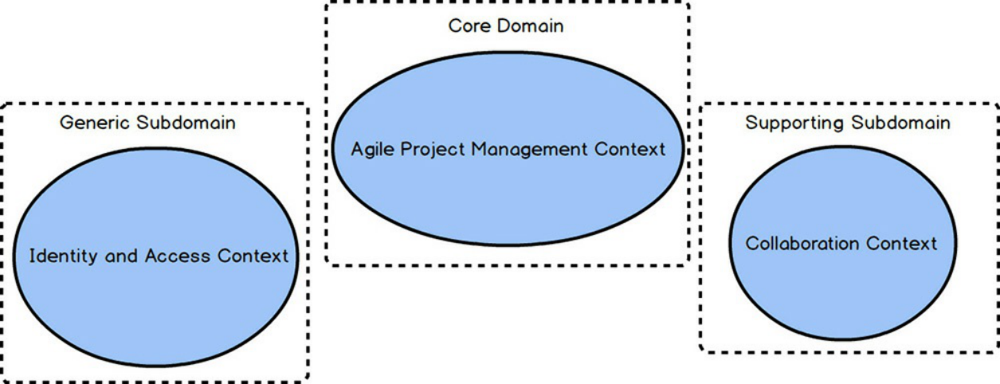


When using DDD, a _Bounded Context_ should align one-to-one (1:1) with a single _Subdomain._ That is, when using DDD, if there is one _Bounded Context_ , there is, as a goal, one _Subdomain_ model in that _Bounded Context._ It may not always be possible or practical to achieve, but where possible it is important to design in that way. This will keep your _Bounded Contexts_ clean and focused on the core strategic initiative. 

If you must create a second model in the same _Bounded Context_ (within your _Core Domain_ ), you should segregate the secondary model from your _Core Domain_ using a completely separate _Module_ <u>[IDDD]</u> . (A DDD _Module_ is basically a package in Scala and Java, and a namespace in F# and C#.) This makes a clear linguistic statement that one model is core and the other is merely supporting. This particular use of segregating a _Subdomain_ is one that you would employ in your _solution space._ 

### **Summary** 

In summary you have learned: 

   - What _Subdomains_ are and how they are used, both in the _problem space_ and in the _solution space_ 

   - The difference between a _Core Domain_ , a _Supporting Subdomain_ , and a _Generic Subdomain_ 

   - How you can make use of _Subdomains_ while reasoning about integration with a _Big Ball of Mud_ legacy system 

   - The importance of aligning your DDD _Bounded Context_ one-to-one with a single _Subdomain_ 

- How you should segregate a _Supporting Subdomain_ model from your _Core Domain_ model using a DDD _Module_ when it is impractical to separate the two in different _Bounded Contexts_ 

- For exhaustive coverage of _Subdomains_ , see Chapter 2 of _Implementing Domain-Driven Design_ <u>[IDDD]</u> . 

## **Chapter 4. Strategic Design with Context Mapping** 


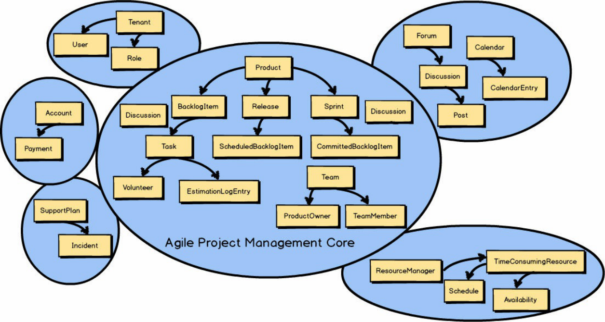


In previous chapters you learned that in addition to the _Core Domain_ , there are multiple _Bounded Contexts_ associated with every DDD project. All concepts that didn’t belong in the _Agile Project Management Context_ —the _Core Domain_ —were moved to one of several other _Bounded Contexts._ 


You also learned that the Agile Project Management _Core Domain_ would have to integrate with other _Bounded Contexts._ That integration is known in DDD as _Context Mapping._ You can see in the previous _Context Map_ that `Discussion` exists in both _Bounded Contexts._ Recall that this is because the _Collaboration Context_ is the source of the `Discussion` , and that the _Agile Project Management Context_ is the consumer of the `Discussion` . 


A _Context Mapping_ is highlighted in this diagram by the line inside the dashed box. (The dashed box is not part of the _Context Mapping_ but is used only to highlight the line.) It’s actually this line between the two _Bounded Contexts_ that represents a _Context Mapping._ In other words, the line indicates that the two _Bounded Contexts_ are mapped in some way. There will be some inter-team dynamic between the two _Bounded Contexts_ as well as some integration. 


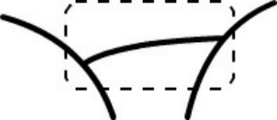


Considering that in two different _Bounded Contexts_ there are two _Ubiquitous Languages_ , this line represents the translation that exists between the two languages. By way of illustration, imagine that two teams need to work together, but they work across national boundaries and don’t speak the same language. Either the teams would need an interpreter, or one or both teams would have to learn a great deal about the other’s language. Finding an interpreter would be less work for both teams, but it could be expensive in various ways. For example, imagine the extra time needed for one team to talk to the interpreter, and then for the interpreter to relay the statements to the other team. It works fine for the first few moments but then becomes cumbersome. Still, the teams might find this a better solution than learning and embracing a foreign language and constantly switching between languages. And, of course, this describes the relationship only between two teams. What if there are a few other teams involved? Similarly, the same trade-offs would exist when translating one _Ubiquitous Language_ into another, or in some other way adapting to another _Ubiquitous Language._ 


When we talk about _Context Mapping_ , what is of interest to us is _what kind_ of inter-team relationship and integration is represented by the line between any two _Bounded Contexts._ Welldefined boundaries and contracts between them support controlled changes over time. There are several kinds of _Context Mappings_ , both team and technical, that can be represented by the line. In some cases both an inter-team relationship and an integration mapping will be blended. 

### **Kinds of Mappings** 

What relationships and integrations can be represented by the _Context Mapping_ line? I will introduce them to you now. 


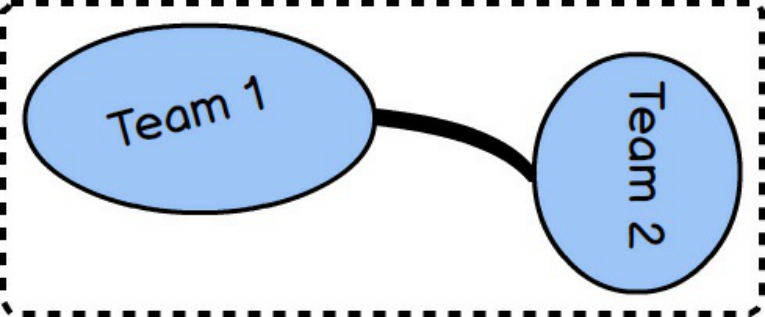


### **Partnership** 

A _Partnership_ relationship exists between two teams. Each team is responsible for one _Bounded Context._ They create a _Partnership_ to align the two teams with a dependent set of goals. It is said that the two teams will succeed or fail together. Since they are so closely aligned, they will meet frequently to synchronize schedules and dependent work, and they will have to use continuous integration to keep their integrations in harmony. The synchronization is represented by the thick mapping line between the two teams. The thick line indicates the level of commitment required, which is quite high. 

It can be challenging to maintain a _Partnership_ over the long term, so many teams that enter a _Partnership_ may do best to set limits on the term of the relationship. The _Partnership_ should last only as long as it provides an advantage, and it should be remapped to a different relationship when the advantage is trumped by the drain of commitment. 


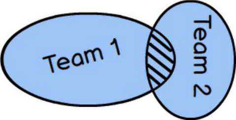


### **Shared Kernel** 

A _Shared Kernel_ , depicted on page <u>54</u> by the intersection of the two _Bounded Contexts_ , describes the relationship between two (or more) teams that share a small but common model. The teams must agree on what model elements they are to share. It’s possible that only one of the teams will maintain the code, build, and test for what is shared. A _Shared Kernel_ is often very difficult to conceive in the first place, and difficult to maintain, because you must have open communication between teams and constant agreement on what constitutes the model to be shared. Still, it is possible to be successful if all involved are committed to the idea that the kernel is better than going _Separate Ways_ (see the later section). 


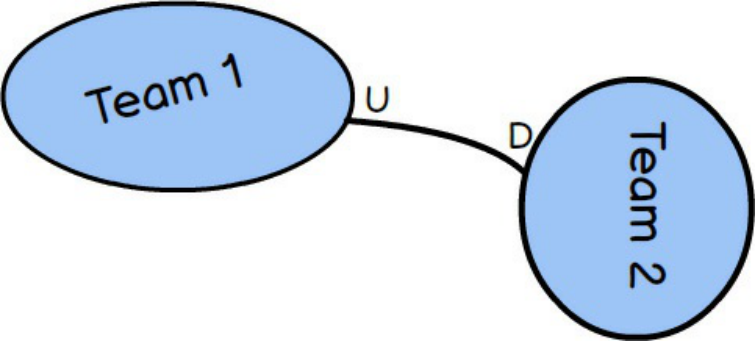


### **Customer-Supplier** 

A _Customer-Supplier_ describes a relationship between two _Bounded Contexts_ and respective teams, where the _Supplier_ is upstream (the U in the diagram) and the _Customer_ is downstream (the D in the diagram). The _Supplier_ holds sway in this relationship because it must provide what the _Customer_ needs. It’s up to the _Customer_ to plan with the _Supplier_ to meet various expectations, but in the end the _Supplier_ determines what the _Customer_ will get and when. This is a very typical and practical relationship between teams, even within the same organization, as long as corporate culture does not allow the _Supplier_ to be completely autonomous and unresponsive to the real needs of _Customers._ 


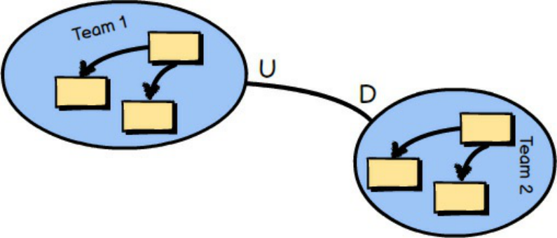


### **Conformist** 

A _Conformist_ relationship exists when there are upstream and downstream teams, and the upstream team has no motivation to support the specific needs of the downstream team. For various reasons the downstream team cannot sustain an effort to translate the _Ubiquitous Language_ of the upstream model to fit its specific needs, so the team conforms to the upstream model as is. A team will often become a _Conformist_ , for example, when integrating with a very large and complex model that is well established. Example: Consider the need to conform to the Amazon.com model when integrating as one of Amazon’s affiliate sellers. 


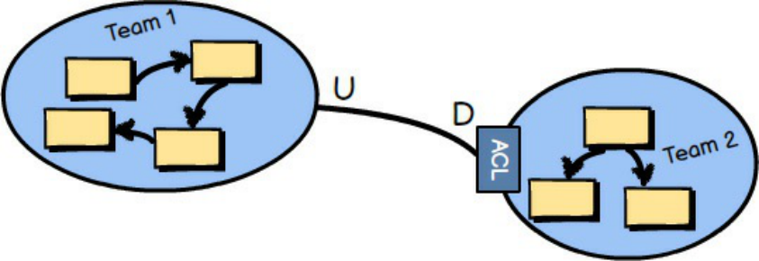


### **Anticorruption Layer** 

An _Anticorruption Layer_ is the most defensive _Context Mapping_ relationship, where the downstream team creates a translation layer between its _Ubiquitous Language_ (model) and the _Ubiquitous Language_ (model) that is upstream to it. The layer isolates the downstream model from the upstream model and translates between the two. Thus, this is also an approach to integration. 

Whenever possible, you should try to create an _Anticorruption Layer_ between your downstream model and an upstream integration model, so that you can produce model concepts on your side of the integration that specifically fit your business needs and that keep you completely isolated from foreign concepts. Yet, just like hiring a translator to act between two teams speaking different languages, the cost could be too high in various ways for some cases. 


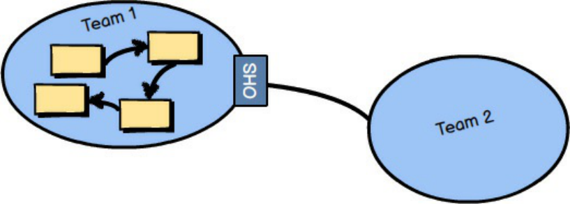


### **Open Host Service** 

An _Open Host Service_ defines a protocol or interface that gives access to your _Bounded Context_ as a set of services. The protocol is “open” so that all who need to integrate with your _Bounded Context_ can use it with relative ease. The services offered by the application programming interface (API) are well documented and a pleasure to use. Even if you were Team 2 in this diagram and could not take time to create an isolating _Anticorruption Layer_ for your side of the integration, it would be much more tolerable to be a _Conformist_ to this model than many legacy systems you may encounter. We might say that the language of the _Open Host Service_ is much easier to consume than that of other types of systems. 


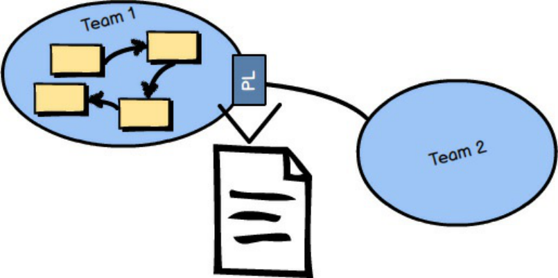


### **Published Language** 

A _Published Language_ , illustrated in the image at the bottom of page <u>57</u> , is a well-documented information exchange language enabling simple consumption and translation by any number of consuming _Bounded Contexts._ Consumers who both read and write can translate from and into the shared language with confidence that their integrations are correct. Such a _Published Language_ can be defined with XML Schema, JSON Schema, or a more optimal wire format, such as Protobuf or Avro. Often an _Open Host Service_ serves and consumes a _Published Language_ , which provides the best integration experience for third parties. This combination makes the translations between two _Ubiquitous Languages_ very convenient. 


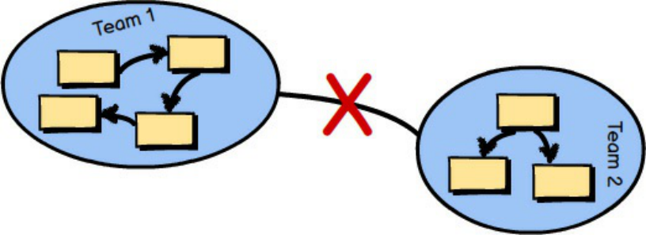


### **Separate Ways** 

_Separate Ways_ describes a situation where integration with one or more _Bounded Contexts_ will not produce significant payoff through the consumption of various _Ubiquitous Languages._ Perhaps the functionality that you seek is not fully provided by any one _Ubiquitous Language._ In this case produce your own specialized solution in your _Bounded Context_ and forget integrating for this special case. 


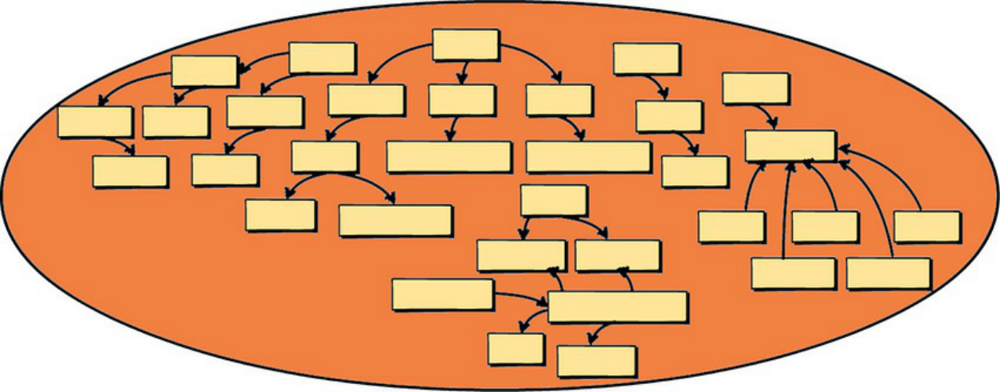


### **Big Ball of Mud** 

You already learned plenty about _Big Ball of Mud_ in the previous chapters, but I am going to reinforce the serious problems you will experience when you must work in or integrate with one. Creating your own _Big Ball of Mud_ should be avoided like the plague. 


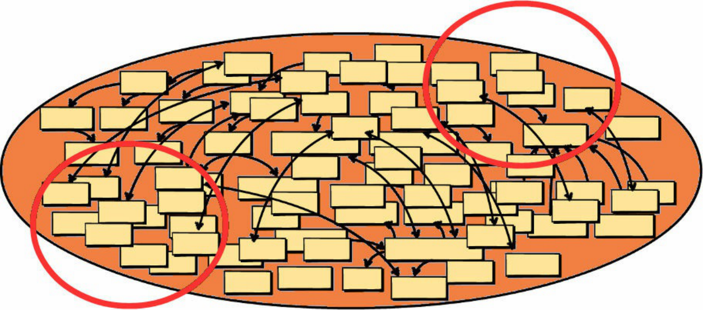


Just in case that’s not enough warning, here’s what happens over time when you are responsible for creating a _Big Ball of Mud:_ (1) A growing number of _Aggregates_ cross-contaminate because of unwarranted connections and dependencies. (2) Maintaining one part of the _Big Ball of Mud_ causes ripples across the model, which leads to “whack-a-mole” issues. (3) Only tribal knowledge and heroics—speaking all languages at once—save the system from complete collapse. 


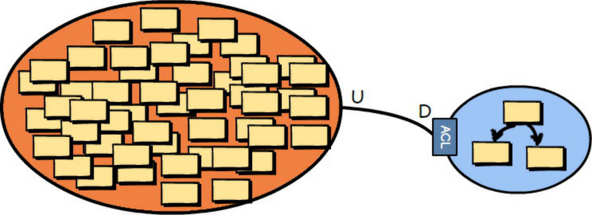


The problem is that there are already many _Big Balls of Mud_ out there in the wide world of software systems, and the number will no doubt grow every month. Even if you are able to avoid creating a _Big Ball of Mud_ by employing DDD techniques, you may still need to integrate with one or more. If you must integrate with one or more, try to create an _Anticorruption Layer_ against each legacy system in order to protect your own model from the cruft that would otherwise pollute your model with the incomprehensible morass. Whatever you do, _don’t speak that language!_ 


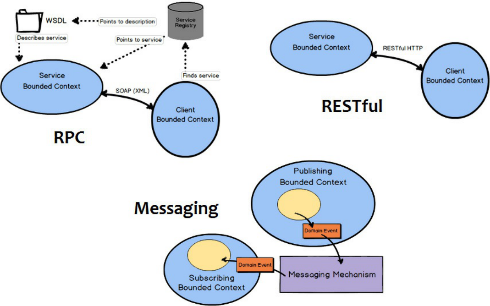


### **Making Good Use of Context Mapping** 

You may be wondering what specific kind of interface would be supplied to allow you to integrate with a given _Bounded Context._ That depends on what the team that owns the _Bounded Context_ provides. It could be RPC via SOAP, or RESTful interfaces with resources, or it could be a 

messaging interface using queues or Publish-Subscribe. In the least favorable of situations you may be forced to use database or file system integration, but let’s hope that doesn’t happen. Database integration really should be avoided, and if you are forced to integrate that way, you really should be sure to isolate your consuming model by means of an _Anticorruption Layer._ 

Let’s take a look at three of the more trustworthy integration types. We will move from the least robust to the most robust integration approaches. First we will look at RPC, followed by RESTful HTTP, and then messaging. 


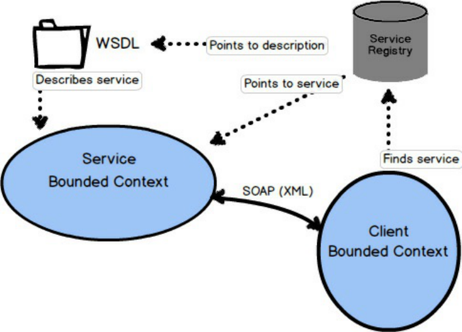


### **RPC with SOAP** 

Remote Procedure Calls, or RPC, can work in a number of ways. One popular way to use RPC is via the Simple Object Access Protocol, or SOAP. The idea behind RPC with SOAP is to make using services from another system look like a simple, local procedure or method invocation. Still, the SOAP request must travel over the network, reach the remote system, perform successfully, and return results over the network. This carries the potential for complete network failure, or at least latency that is unanticipated when first implementing the integration. Additionally, RPC over SOAP also implies strong coupling between a client _Bounded Context_ and the _Bounded Context_ providing the service. 


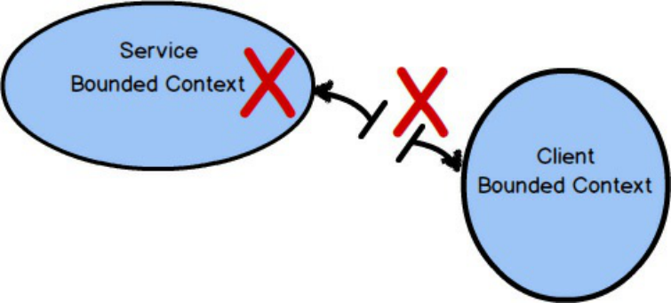


The main problem with RPC, using SOAP or another approach, is that it can lack robustness. If there is a problem with the network or a problem with the system hosting the SOAP API, your 

seemingly simple procedure call will fail entirely, giving only error results. Don’t be fooled by the seeming ease of use. 


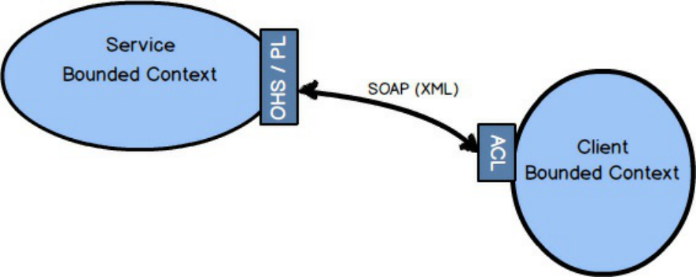


When RPC works—and it mostly works—it can be a very useful way to integrate. If you can influence the design of the service _Bounded Context_ , it would be in your best interests if there is a well-designed API that provides an _Open Host Service_ with a _Published Language._ Either way, your client _Bounded Context_ can be designed with an _Anticorruption Layer_ to isolate your model from unwanted outside influences. 


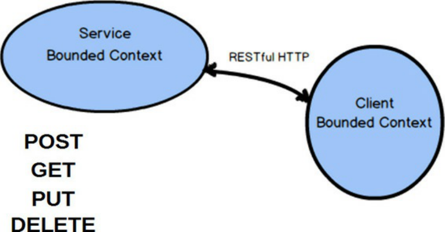


### **RESTful HTTP** 

Integration using RESTful HTTP focuses attention on the resources that are exchanged between _Bounded Contexts_ , as well as the four primary operations: POST, GET, PUT, and DELETE. Many find that the REST approach to integration works well because it helps them define good APIs for distributed computing. It’s difficult to argue against this claim given the success of the Internet and Web. 


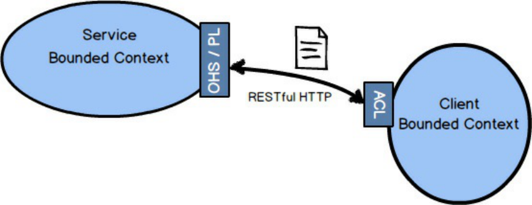


There is a very certain way of thinking when you use RESTful HTTP. I won’t get into the details in this book, but you should look into it before trying to employ REST. The book _REST in Practice_ <u>[RiP]</u> is a good place to start. 

A service _Bounded Context_ that sports a REST interface should provide an _Open Host Service_ and a _Published Language._ Resources deserve to be defined as a _Published Language_ , and combined with your REST URIs they will form a natural _Open Host Service._ 


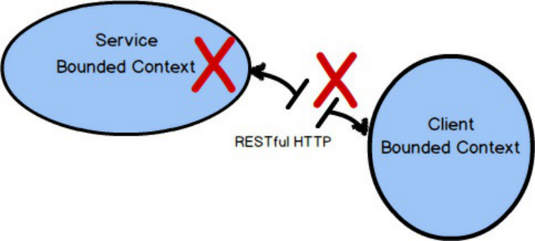


RESTful HTTP will tend to fail for many of the same reasons that RPC does—network and service provider failures, or unanticipated latency. However, RESTful HTTP is based on the premise of the Internet, and who can find fault with the track record of the Web when it comes to reliability, scalability, and overall success? 


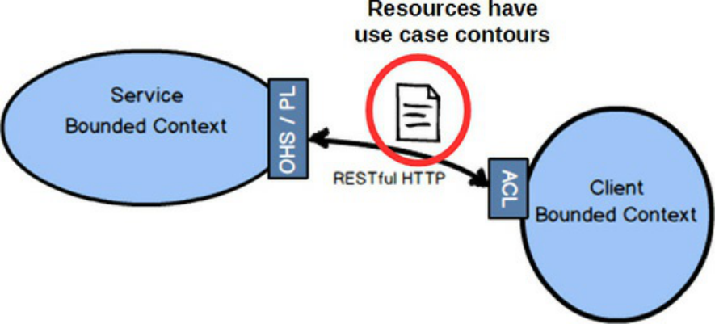


A common mistake made when using REST is to design resources that directly reflect the _Aggregates_ in the domain model. Doing this forces every client into a _Conformist_ relationship, where if the model changes shape the resources will also. So you don’t want to do that. Instead, resources should be designed synthetically to follow client-driven use cases. By “synthetic” I mean that to the 

client the resources provided must have the shape and composition of what they need, not what the actual domain model looks like. Sometimes the model will look just like what the client needs. But what the client needs is what drives the design of the resources, and not the model’s current composition. 


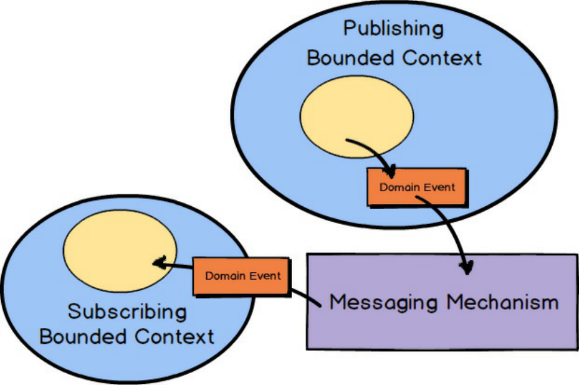


### **Messaging** 

When using asynchronous messaging to integrate, much can be accomplished by a client _Bounded Context_ subscribing to the _Domain Events_ published by your own or another _Bounded Context._ Using messaging is one of the most robust forms of integration because you remove much of the temporal coupling associated with blocking forms such as RPC and REST. Since you already anticipate the latency of message exchange, you tend to build more robust systems because you never expect immediate results. 

#### **Going Asynchronous with REST** 

It’s possible to accomplish asynchronous messaging using REST-based polling of a sequentially growing set of resources. Using background processing, a client would continuously poll for a service Atom feed resource that provides an ever-increasing set of _Domain Events._ This is a safe approach to maintaining asynchronous operations between a service and clients, while supplying up-to-date events that continue to occur in the service. If the service becomes unavailable for some reason, clients will simply retry on normal intervals, or back off with retry, until the feed resource is available again. 

This approach is discussed in detail in _Implementing Domain-Driven Design_ <u>[IDDD]</u> 

**Avoid Integration Train Wrecks** 

When a client _Bounded Context_ (C1) integrates with a service _Bounded Context_ (S1), C1 should usually not be making a synchronous, blocking request to S1 as a direct result of handling a request made to it. That is, while some other client (C0) makes a blocking request to C1, don’t allow C1 to make a blocking request to S1. Doing so has a very high potential for causing an integration train wreck between C0, C1, and S1. This can be avoided by using asynchronous messaging. 


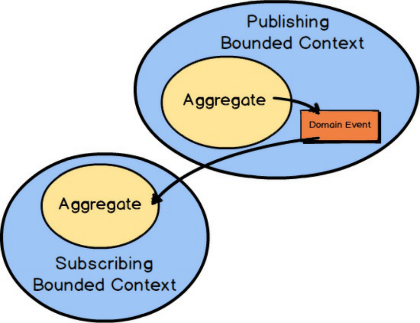


Typically an _Aggregate_ in one _Bounded Context_ publishes a _Domain Event_ , which could be consumed by any number of interested parties. When a subscribing _Bounded Context_ receives the _Domain Event_ , some action will be taken based on its type and value. Normally it will cause a new _Aggregate_ to be created or an existing _Aggregate_ to be modified in the consuming _Bounded Context._ 

#### **Are Domain Event Consumers Conformists?** 

You may be wondering how _Domain Events_ can be consumed by another _Bounded Context_ and not force that consuming _Bounded Context_ into a _Conformist_ relationship. As recommended in _Implementing Domain-Driven Design_ <u>[IDDD]</u> , and specifically in Chapter 13, “Integrating Bounded Contexts,” consumers should not use the event types (e.g., classes) of an event publisher. Rather, they should depend only on the schema of the events, that is, their _Published Language._ This generally means that if the events are published as JSON, or perhaps a more economical object format, the consumer should consume the events by parsing them to obtain their data attributes. 


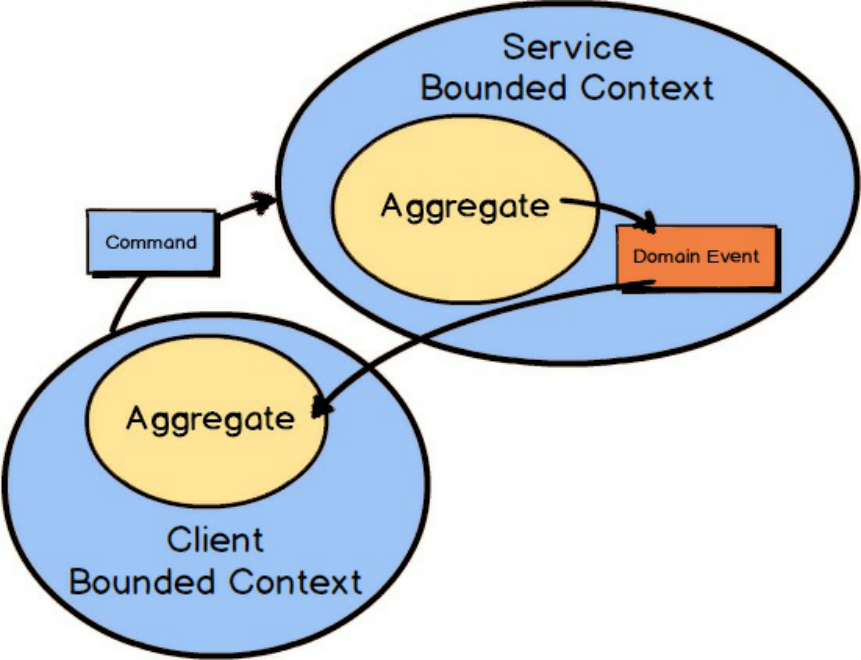


Of course, the foregoing assumes that a subscribing _Bounded Context_ can always benefit from unsolicited happenings in the publishing _Bounded Context._ Sometimes, however, a client _Bounded Context_ will need to proactively send a _Command Message_ to a service _Bounded Context_ to force some action. In such cases the client _Bounded Context_ will still receive any outcome as a published _Domain Event._ 


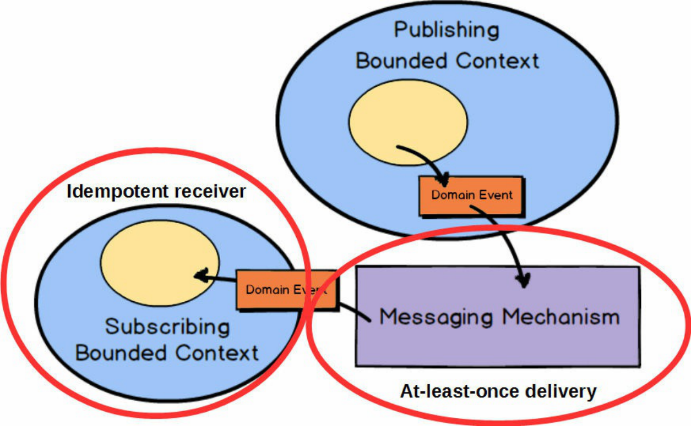


In all cases of using messaging for integration, the quality of the overall solution will depend heavily on the quality of the chosen messaging mechanism. The messaging mechanism should support _At-Least-Once Delivery_ <u>[Reactive]</u> to ensure that all messages will be received eventually. This also means that the subscribing _Bounded Context_ must be implemented as an _Idempotent Receiver_ <u>[Reactive]</u> . 


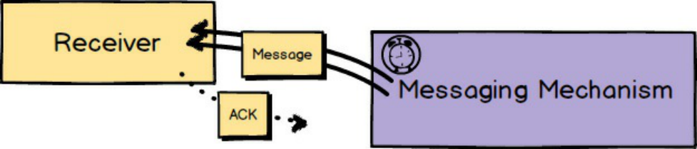


_At-Least-Once Delivery_ <u>[Reactive]</u> is a messaging pattern where the messaging mechanism will periodically redeliver a given message. This will be done in cases of message loss, slow-reacting or downed receivers, and receivers failing to acknowledge receipt. Because of this messaging mechanism design, it is possible for the message to be delivered more than once even though the sender sends it only once. Still, that needn’t be a problem when the receiver is designed to deal with this. 


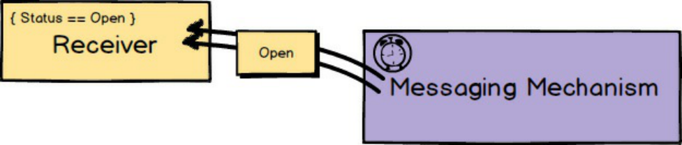


Whenever a message could be delivered more than once, the receiver should be designed to deal correctly with this situation. _Idempotent Receiver_ <u>[Reactive]</u> describes how the receiver of a request performs an operation in such a way that it produces the same result even if it is performed multiple times. Thus, if the same message is received multiple times, the receiver will deal with it in a safe manner. This can mean that the receiver uses de-duplication and ignores the repeated message, or safely reapplies the operation with the exact same results that the previous delivery caused. 

Due to the fact that messaging mechanisms always introduce asynchronous _Request-Response_ <u>[Reactive]</u> communications, some amount of latency is both common and expected. Requests for service should (almost) never block until the service is fulfilled. Thus, designing with messaging in mind means that you will always plan for at least some latency, which will make your overall solution much more robust from the outset. 


### **An Example in Context Mapping** 

Returning to an example discussed in <u>Chapter 2</u> , “Strategic Design with Bounded Contexts and the <u>Ubiquitous Language</u> ,” a question arises about the location of the official `Policy` type. Remember that there are three different `Policy` types in three different _Bounded Contexts._ So, where does the “policy of record” live in the insurance enterprise? It’s possible that it belongs to the underwriting division since that is where it originates. For the sake of this example, let’s say it does belong to the underwriting division. So how do the other _Bounded Contexts_ learn about its existence? 


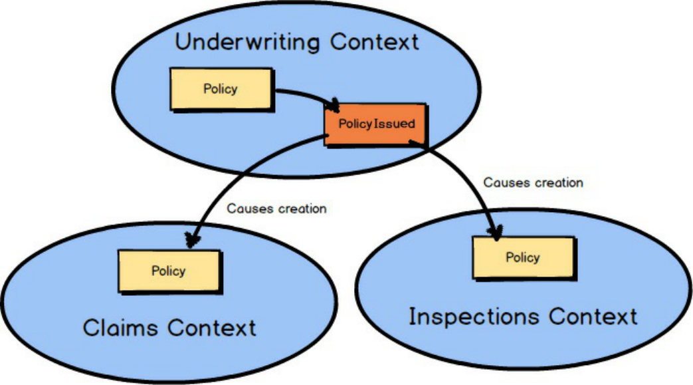


When a component of type `Policy` is issued in the _Underwriting Context_ , it could publish a _Domain Event_ named `PolicyIssued` . Provided through a messaging subscription, any other _Bounded Context_ may react to that _Domain Event_ , which could include creating a corresponding `Policy` component in the subscribing _Bounded Context._ 


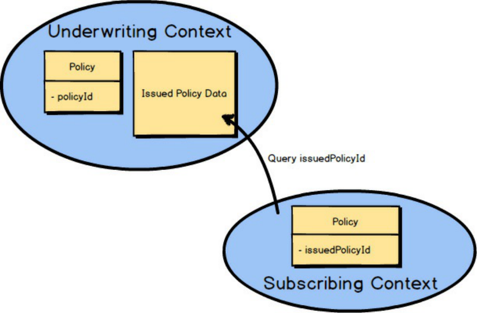


The `PolicyIssued` _Domain Event_ would contain the identity of the official `Policy` . Here it’s `policyId` . Any components created in a subscribing _Bounded Context_ would retain that identity for traceability back to the originating _Underwriting Context._ In this example the identity is saved as `issuedPolicyId` . If there is a need for more `Policy` data than the `PolicyIssued` _Domain Event_ provided, the subscribing _Bounded Context_ can always query back on the _Underwriting Context_ for more information. Here the subscribing _Bounded Context_ uses the `issuedPolicyId` to perform a query on the _Underwriting Context._ 

#### **Enrichment versus Query-Back Trade-offs** 

Sometimes there is an advantage to enriching _Domain Events_ with enough data to satisfy the needs of all consumers. Sometimes there is an advantage to keeping _Domain Events_ thin and allowing for querying back when consumers need more data. The first choice, enrichment, allows for greater autonomy of dependent consumers. If autonomy is your driving requirement, consider enrichment. 

On the other hand, it is difficult to predict every piece of data that all consumers will ever need in _Domain Events_ , and there may be too much enrichment if you provide it all. For example, it may be a poor security choice to greatly enrich _Domain Events._ If that is the case, designing thin _Domain Events_ and a rich query model with security for consumers to request from may be the choice you need. 

Sometimes circumstances will call for a balanced blend of both approaches. 


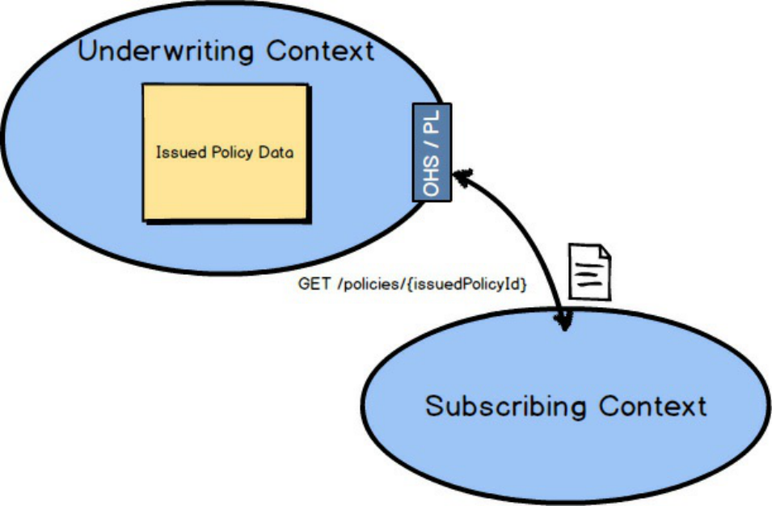


And how might the query back on the _Underwriting Context_ work? You could design a RESTful _Open Host Service_ and _Published Language_ on the _Underwriting Context._ A simple HTTP GET with the `issuedPolicyId` would retrieve the `IssuedPolicyData` . 


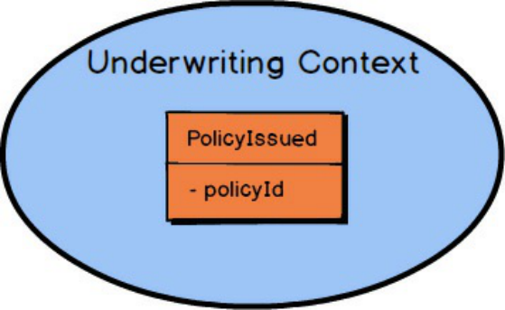


You’re probably wondering about the data details of the `Policy-Issued` _Domain Event._ I will provide _Domain Event_ design details in <u>Chapter 6</u> , “Tactical Design with Domain Events .” 


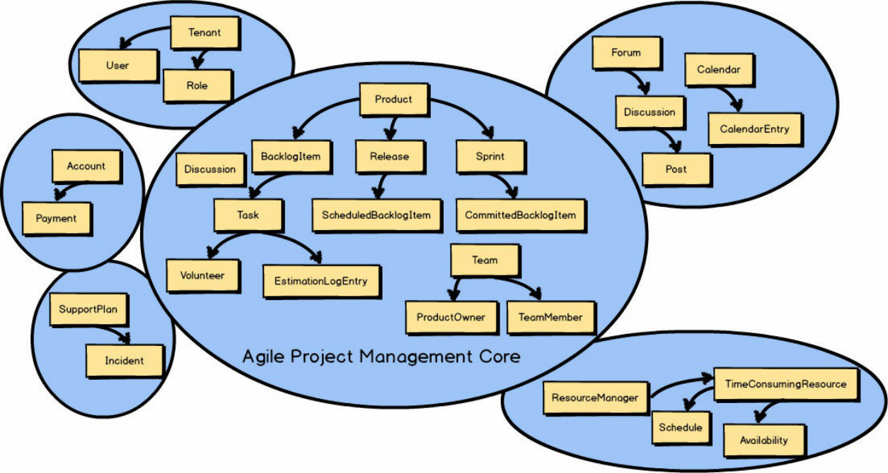


Are you curious about what happened to the _Agile Project Management Context_ example? Straying from that to the insurance business domain allowed you to examine DDD with multiple examples. That should have helped you grasp DDD even better. Don’t worry, we will return to the _Agile Project Management Context_ in the next chapter. 

### **Summary** 

In summary, you have learned: 

- About the various kinds of _Context Mapping_ relationships, such as _Partnership_ , _CustomerSupplier_ , and _Anticorruption Layer_ 

- How to use _Context Mapping_ integration with RPC, with RESTful HTTP, and with messaging 

- How _Domain Events_ work with messaging 

- A foundation on which you can build your _Context Mapping_ experience 

For thorough coverage of _Context Maps_ , see <u>Chapter 3</u> of _Implementing Domain-Driven Design_ <u>[IDDD]</u> . 

**Chapter 5. Tactical Design with Aggregates** 


So far I have discussed strategic design with _Bounded Contexts_ , _Subdomains_ , and _Context Maps._ Here you see two _Bounded Contexts_ , the _Core Domain_ named _Agile Project Management Context_ and a _Supporting Subdomain_ that provides collaboration tools through _Context Mapping_ integration. 


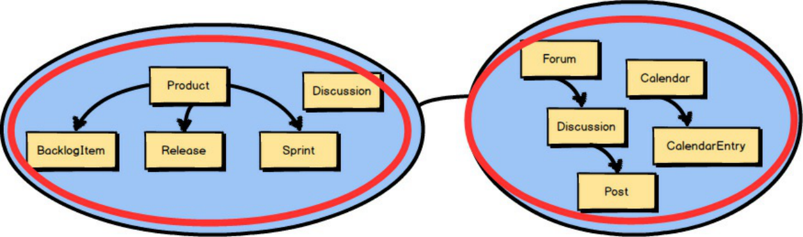


But what about the concepts that live inside a _Bounded Context_ ? I’ve touched on these, but I will next cover them in more detail. They are likely the _Aggregates_ in your model. 


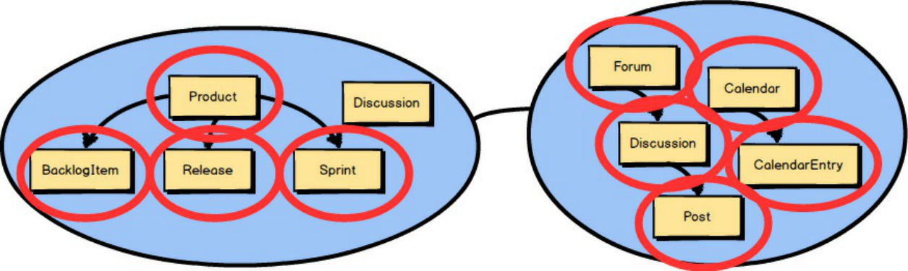


### **Why Used** 

Each of the circled concepts that you see inside these two _Bounded Contexts_ is an _Aggregate._ The one concept not circled— `Discussion` —is modeled as a _Value Object._ Even so, we are focused on _Aggregates_ in this chapter, and we will take a closer look at how to model `Product` , 

`BacklogItem` , `Release` , and `Sprint` . 

#### **What Is an Entity?** 

An _Entity_ models an individual thing. Each _Entity_ has a unique identity in that you can distinguish its individuality from among all other _Entities_ of the same or a different type. Many times, perhaps even most times, an _Entity_ will be mutable; that is, its state will change over time. Still, an _Entity_ is not of necessity mutable and may be immutable. The main thing that separates an _Entity_ from other modeling tools is its uniqueness—its individuality. 

See _Implementing Domain-Driven Design_ <u>[IDDD]</u> for an exhaustive treatment of _Entities._ 


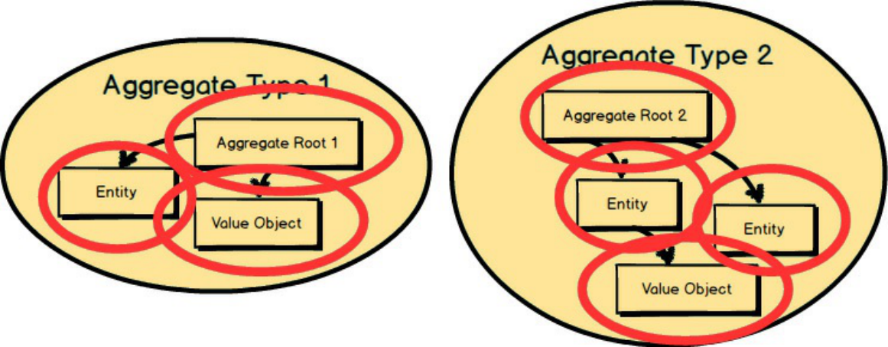


What is an _Aggregate_ ? Two are represented here. Each _Aggregate_ is composed of one or more _Entities_ , where one _Entity_ is called the _Aggregate Root. Aggregates_ may also have _Value Objects_ composed on them. As you see here, _Value Objects_ are used inside both _Aggregates_ . 

#### **What Is a Value Object?** 

A _Value Object_ , or simply a _Value_ , models an immutable conceptual whole. Within the model the _Value_ is just that, a value. Unlike an _Entity_ , it does not have a unique identity, and equivalence is determined by comparing the attributes encapsulated by the _Value_ type. Furthermore, a _Value Object_ is not a thing but is often used to describe, quantify, or measure an _Entity._ 

See _Implementing Domain-Driven Design_ <u>[IDDD]</u> for detailed coverage of _Value Objects._ 


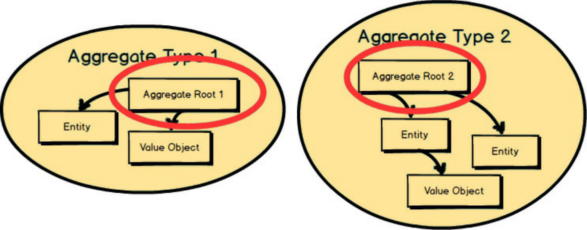


The _Root Entity_ of each _Aggregate_ owns all the other elements clustered inside it. The name of the _Root Entity_ is the _Aggregate_ ’s conceptual name. You should choose a name that properly describes the conceptual whole that the _Aggregate_ models. 


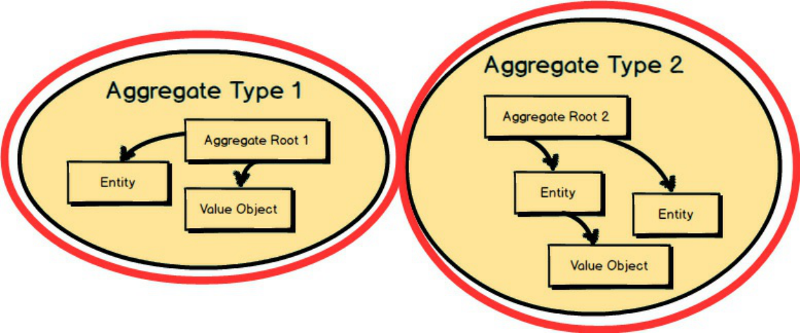


Each _Aggregate_ forms a transactional consistency boundary. This means that within a single _Aggregate_ , all composed parts must be consistent, according to business rules, when the controlling transaction is committed to the database. This doesn’t necessarily mean that you are not supposed to compose other elements within an _Aggregate_ that don’t need to be consistent after a transaction. After all, an _Aggregate_ also models a conceptual whole. But you should be first and foremost concerned with transactional consistency. The outer boundary drawn around `Aggregate Type 1` and `Aggregate Type 2` represents a separate transaction that will be in control of atomically persisting each object cluster. 

#### **Broader Meaning of Transaction** 

To some degree, the use of transactions in your application is an implementation detail. For example, a typical use would have an Application Service <u>[IDDD]</u> controlling the atomic database transaction on behalf of the domain model. Under a different architecture, such as the Actor model <u>[Reactive]</u> where each _Aggregate_ is implemented 

as an actor, transactions could be handled using _Event Sourcing_ (see the next chapter) with a database that doesn’t support atomic transactions. Either way, what I mean by “transaction” is how modifications to an _Aggregate_ are isolated and how business invariants—the rules to which the software must always adhere—are guaranteed to be consistent following each business operation. Whether this requirement is controlled by an atomic database transaction or by some other means, the _Aggregate_ ’s state, or its representation by means of _Event Sourcing_ , must be safely and correctly transitioned and maintained at all times. 

The reasons for the transactional boundary are business motivated, because it is the business that determines what a valid state of the cluster should be at any given time. In other words, if the _Aggregate_ was not stored in a whole and valid state, the business operation that was performed would be considered incorrect according to business rules. 


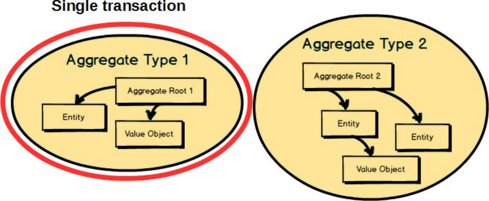


To think about this in a different way, consider this. Although two _Aggregates_ are represented here, only one of the two should be committed in a single transaction. That’s a general rule of _Aggregate_ design: modify and commit only one _Aggregate_ instance in one transaction. That’s why you see only the instance of `Aggregate Type 1` within a transaction. We will look at the other rules of _Aggregate_ design soon. 


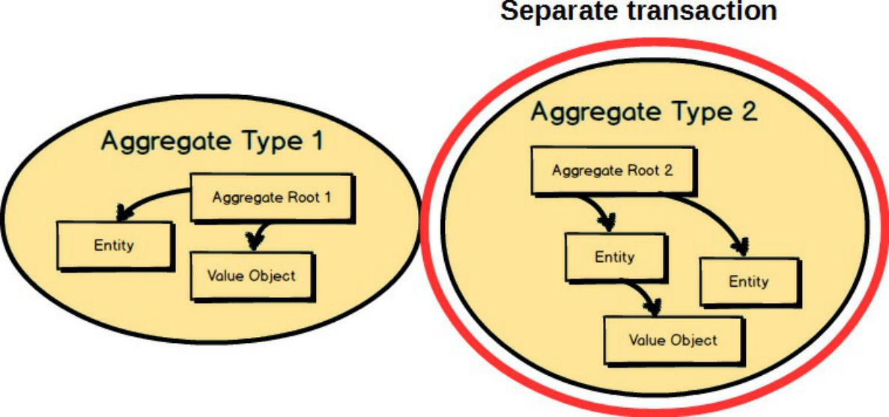


Any other _Aggregate_ will be modified and committed in a separate transaction. That’s why an _Aggregate_ is said to be a transactional consistency boundary. So, you design your _Aggregate_ compositions in a way that allows for transactional consistency and success. As seen here, an instance of `Aggregate Type 2` is controlled under a separate transaction from the instance of `Aggregate Type 1` . 


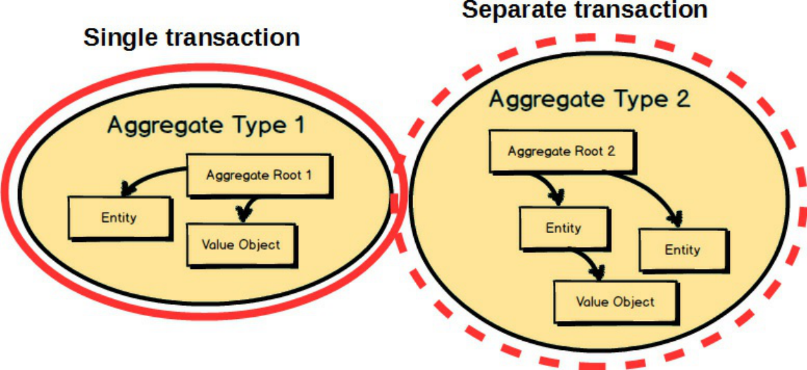


Since instances of these two _Aggregates_ are designed to be modified in separate transactions, how do we get the instance of `Aggregate Type 2` updated based on changes made to the instance of `Aggregate Type 1` , to which our domain model must react? That’s a good question; we will consider the answer to it a bit later in this chapter. 

The main point to remember from this section is that business rules are the drivers for determining what must be whole, complete, and consistent at the end of a single transaction. 

### **Aggregate Rules of Thumb** 

Let’s next consider the four basic rules of _Aggregate_ design: 

**1.** Protect business invariants inside _Aggregate_ boundaries. 

**2.** Design small _Aggregates._ 

**3.** Reference other _Aggregates_ by identity only. 

**4.** Update other _Aggregates_ using eventual consistency. 

Of course, these rules are not necessarily strictly enforced by any “DDD police.” They are meant as sound guidance such that when thoughtfully applied, they will help you design _Aggregates_ that work effectively. That being the case, we will now dig into each of these rules to see how they should be applied wherever possible. 


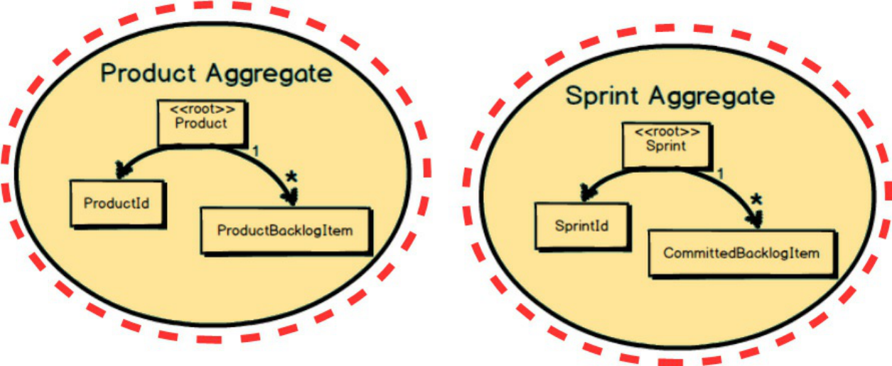


### **Rule 1: Protect Business Invariants inside Aggregate Boundaries** 

Rule 1 means that the business should ultimately determine _Aggregate_ compositions based on what must be consistent when a transaction is committed. In the example on page 81 , `Product` is designed such that at the end of a transaction all composed `ProductBacklogItem` instances must be accounted for and consistent with the `Product` root. Also, `Sprint` is designed such that at the end of a transaction all composed `CommittedBacklogItem` instances must be accounted for and consistent with the `Sprint` root. 


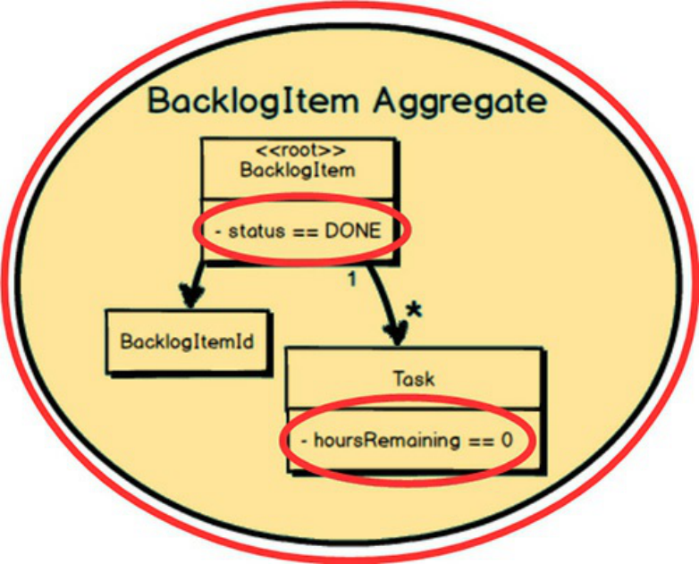


Rule 1 becomes clearer with another example. Here’s the `BacklogItem` _Aggregate._ There is a business rule that states, “When all `Task` instances have `hoursRemaining` of zero, the `BacklogItem` status must be set to `DONE` .” Thus, at the end of a transaction this very specific business invariant must be met. The business requires it. 


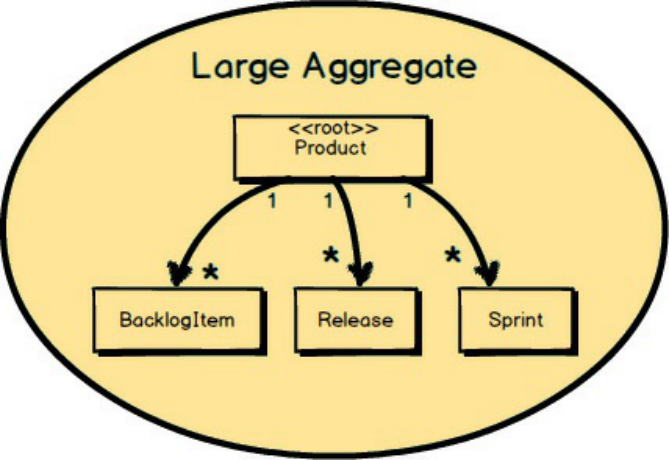


### **Rule 2: Design Small Aggregates** 

This rule highlights that the memory footprint and transactional scope of each _Aggregate_ should be relatively small. In the preceding diagram the _Aggregate_ that is represented is not small. Here, `Product` literally contains a potentially very large collection of `BacklogItem` instances, a large collection of `Release` instances, and a large collection of `Sprint` instances. Over time, these collections could grow to be quite large, with thousands of `BacklogItem` instances and probably hundreds of `Release` and `Sprint` instances. This design approach is generally a very poor choice. 


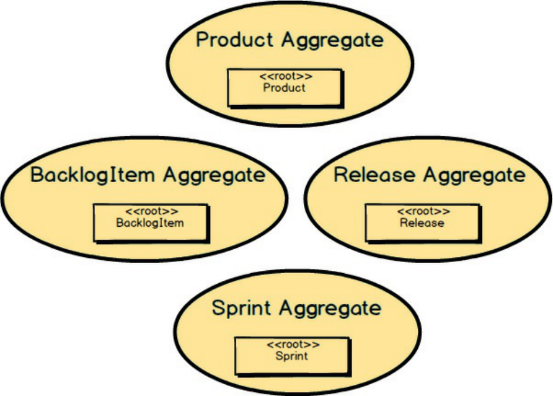


However, if we break up the `Product` _Aggregate_ to form four separate _Aggregates_ , this is what we get: a small `Product` _Aggregate_ , a small `BacklogItem` _Aggregate_ , a small `Release` _Aggregate_ , and a small `Sprint` _Aggregate._ These load quickly, take less memory, and are faster to garbage collect. Perhaps most importantly, these _Aggregates_ will have transactional success much more frequently than the previous large-cluster `Product` _Aggregate._ 

Following this rule has the added benefit that each _Aggregate_ will be easier to work on, because each associated task can be managed by a single developer. This also means that the _Aggregate_ will be easier to test. 

Another thing to keep in mind when designing _Aggregates_ is the _Single Responsibility Principle_ (SRP). If your _Aggregate_ is trying to do too many things, it is not following SRP, and this will likely be telling in its size. Ask yourself, for example, whether your `Product` is a very focused implementation of a Scrum product, or if it is also trying to be other things. What is the reason to change `Product` : to make it a better Scrum product, or to manage backlog items, releases, and sprints? You should change `Product` only in order to make it a better Scrum product. 


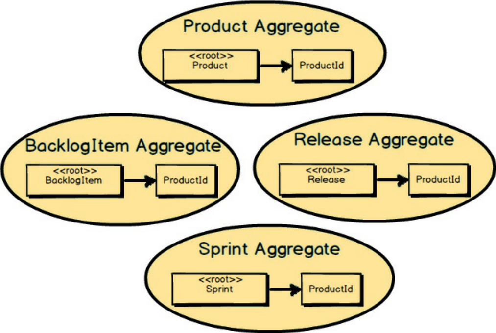


**Rule 3: Reference Other Aggregates by Identity Only** Now that we’ve broken up the large-cluster `Product` into four smaller _Aggregates_ , how should each reference the others where needed? Here we follow Rule 3, “Reference other _Aggregates_ by identity only.” In this example we see that `BacklogItem` , `Release` , and `Sprint` all reference `Product` by holding a `ProductId` . This helps keep _Aggregates_ small and prevents reaching out to modify multiple _Aggregates_ in the same transaction. 

This further helps keep the _Aggregate_ design small and efficient, making for lower memory requirements and quicker loading from a persistence store. It also helps enforce the rule not to modify other _Aggregate_ instances within the same transaction. With only identities of other _Aggregates_ , there is no easy way to obtain a direct object reference to them. 

Another benefit to using reference by identity only is that your _Aggregates_ can be easily stored in just about any kind of persistence mechanism, such as relational database, document database, keyvalue store, and data grids/fabrics. This means that you have options to use a MySQL relational table, a JSON-based store such as PostgreSQL or MongoDB, GemFire/Geode, Coherence, and GigaSpaces. 


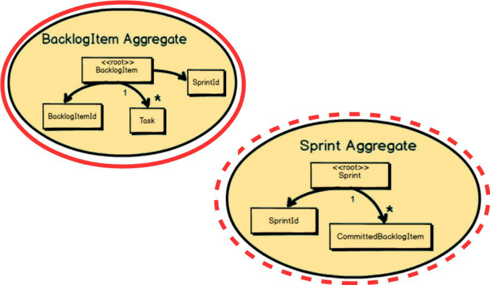


**Rule 4: Update Other Aggregates Using Eventual Consistency** Here a `BacklogItem` is committed to a `Sprint` . Both the `BacklogItem` and the `Sprint` must react to this. It is first the `BacklogItem` that knows it has been committed to a `Sprint` . This is managed in one transaction, when the state of the `BacklogItem` is modified to contain the `SprintId` of the `Sprint` to which it is committed. So, how do we ensure that the `Sprint` is also updated with the `BacklogItemId` of the newly committed `BacklogItem` ? 


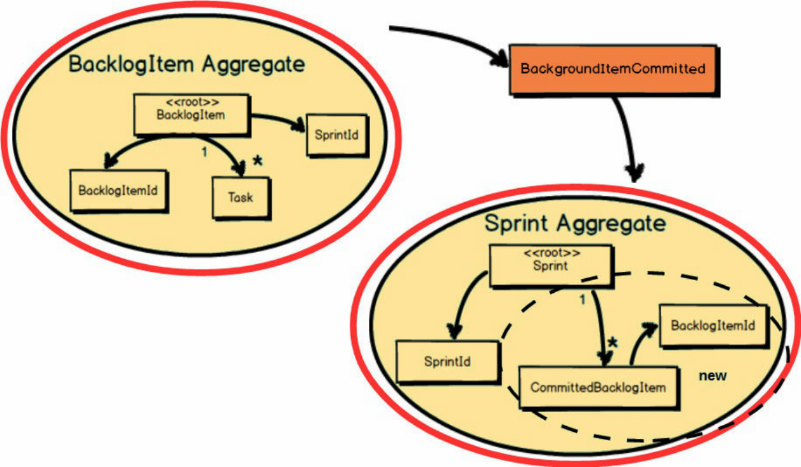


As part of the `BacklogItem` _Aggregate_ ’s transaction, it publishes a _Domain Event_ named `BacklogItemCommitted` . The `BacklogItem` transaction completes and its state is persisted along with the `Backlog-ItemCommitted` _Domain Event._ When the `BacklogItemCommitted` makes its way to a local subscriber, a transaction is started and the state of the `Sprint` is modified to hold the `BacklogItemId` of the committed `BacklogItem` . The `Sprint` holds the `BacklogItemId` inside a new `CommittedBacklogItem` _Entity._ 


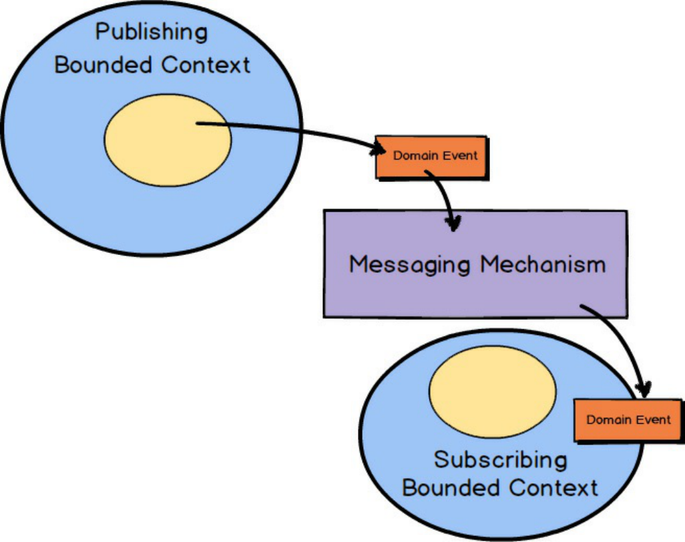


Recall now what you learned in Chapter 4 , “Strategic Design with Context Mapping .” _Domain Events_ are published by an _Aggregate_ and subscribed to by an interested _Bounded Context._ The messaging mechanism delivers the _Domain Events_ to interested parties by means of subscriptions. The interested _Bounded Context_ can be the same one from which the _Domain Event_ was published, or it could be different _Bounded Contexts._ 


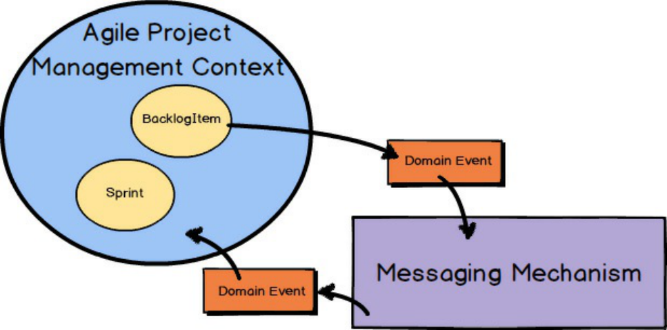


It’s just that in the case of the `BacklogItem` _Aggregate_ and the `Sprint` _Aggregate_ , the publisher and subscriber are in the same _Bounded Context._ You don’t absolutely need to use a fullblown messaging middleware product for this case, but it’s easy to do so since you already use it for 

publishing to other _Bounded Contexts._ 

#### **If Eventual Consistency Seems Scary** 

There is nothing incredibly difficult about using eventual consistency. Still, until you can gain some experience, you may be concerned about using it. If so, you should still partition your model into _Aggregates_ according to business-defined transactional boundaries. However, there is nothing preventing you from committing modifications to two or more _Aggregates_ in a single atomic database transaction. You might choose to use this approach in cases that you know will succeed but use eventual consistency for all others. This will allow you to get used to the techniques without taking too big an initial step. Just understand that this is not the primary way that _Aggregates_ are meant to be used, and you may experience transactional failures as a result. 


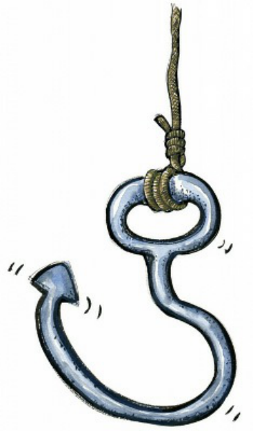


### **Modeling Aggregates** 

There are a few hooks waiting for you as you work on your domain model, implementing your _Aggregates._ One big, nasty hook is the _Anemic Domain Model_ <u>[IDDD]</u> . This is where you are using an object-oriented domain model, and all of your _Aggregates_ have only public accessors (getters and setters) but no real business behavior. This tends to happen when there is a technical rather than business focus during modeling. Designing an _Anemic Domain Model_ requires you to take on all the overhead of a domain model without realizing any of its benefits. Don’t take the bait! 

Also watch out for leaking business logic into the Application Services above your domain model. It can happen undetected, just like physical anemia. Delegating business logic from services to helper/utility classes isn’t going to work out well either. Service utilities always exhibit an identity crisis and can never keep their stories straight. Place your business logic in your domain model, or suffer bugs sponsored by an _Anemic Domain Model._ 

#### **What about Functional Programming?** 

When using functional programming, the rules change considerably. While an _Anemic Domain Model_ is a bad idea when using object-oriented programming, it is somewhat the norm when applying functional programming. That’s because functional programming promotes the separation of data and behavior. Your data is designed as immutable data structures or record types, and your behavior is implemented as pure functions that operate on the immutable records of specific types. Rather than modifying the data that functions receive as arguments, the functions return new values. These new values may be the new state of an _Aggregate_ or a _Domain Event_ that represents a transition in an _Aggregate_ ’s state. 

I have largely addressed the object-oriented approach in this chapter because it is still the most widely used and well understood. Yet if you are employing a functional language and approach to DDD, be aware that some of this guidance is not applicable or is at least subject to overriding rules. 


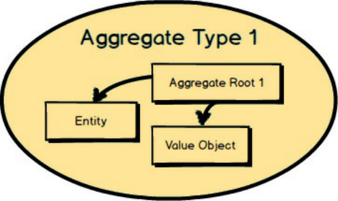


Next I’m going to show you some of the technical components you will need to implement a basic _Aggregate_ design. I assume you are using Scala, C#, Java, or another object-oriented programming language. The following examples are in C# but are very understandable by Scala, F#, Java, Ruby, Python, and other programmers alike. 


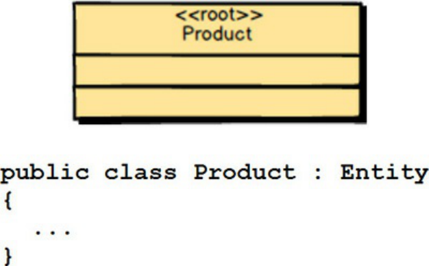


The first thing you must do is create a class for your _Aggregate Root Entity._ Here is a UML (Unified Modeling Language) representation of the `Product` _Root Entity._ Included is also the `Product` class in C#, which extends a base class named `Entity` . This base class just takes care of standard _Entity_ kinds of things. See _Implementing Domain-Driven Design_ <u>[IDDD]</u> for exhaustive 

discussions on both _Entity_ and _Aggregate_ design and implementation. 


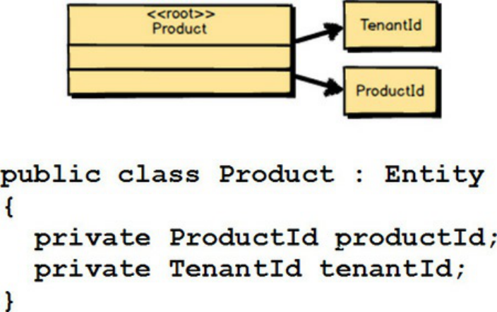


Every _Aggregate Root Entity_ must have a globally unique identity. A `Product` in the _Agile Project Management Context_ actually has two forms of globally unique identity. The `TenantId` scopes the _Root Entity_ inside a given subscriber organization. (Every organization that subscribes to the offered services is known as a tenant and thus has a unique identity for that.) The second identity, which is also globally unique, is the `ProductId` . This second identity sets the `Product` apart from all others within the same tenant. Also included is the C# code that declares the two identities inside `Product` . 

#### **Use of Value Objects** 

Here, both `TenantId` and `ProductId` are modeled as immutable _Value Objects._ 


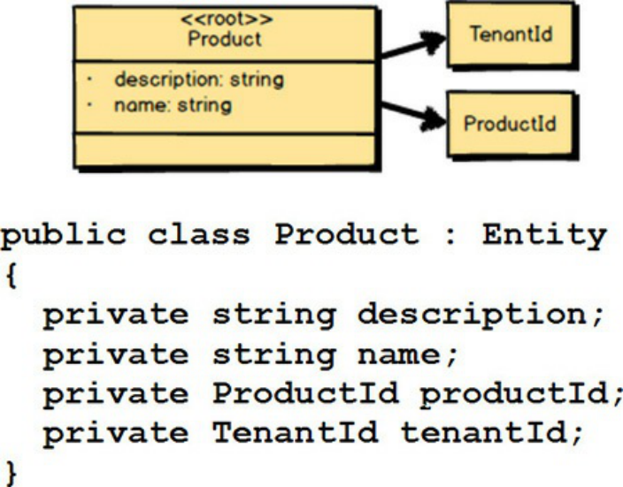


Next you capture any intrinsic attributes or fields that are necessary for finding the _Aggregate._ In the case of `Product` , there are both `description` and `name` . Users can search one or both of these to find each `Product` . I also provide the C# code that declares these two intrinsic attributes. 


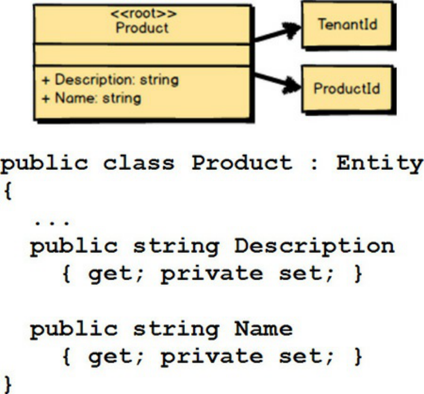


Of course, you can add simple behavior such as read accessors (getters) for intrinsic attributes. In C# this would probably be done using public property getters. However, you may not want to expose setters as public. Without public setters, how do property/attribute values change? When using an object-oriented approach (C#, Scala, and Java), you change internal state using behavioral methods. If using a functional approach (F#, Scala, and Clojure), the functions will return new values that are different from the values passed as arguments. 


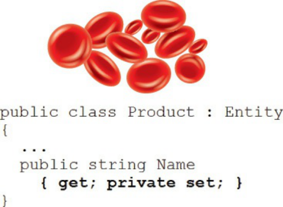


You should be on a mission to fight the _Anemic Domain Model_ <u>[IDDD]</u> . If you expose public setter methods, it could quickly lead to anemia, because the logic for setting values on `Product` would be implemented outside the model. Think hard before doing this, and keep this warning in mind. 


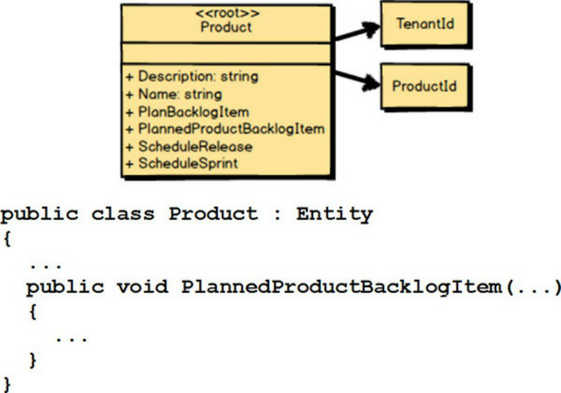


Finally, you add in any complex behavior. Here we’ve got four new methods: `PlanBacklogItem()` , `PlannedProductBacklogItem()` , `ScheduleRelease()` , and `ScheduleSprint()` . The C# code for each of these methods should be added to the class. 


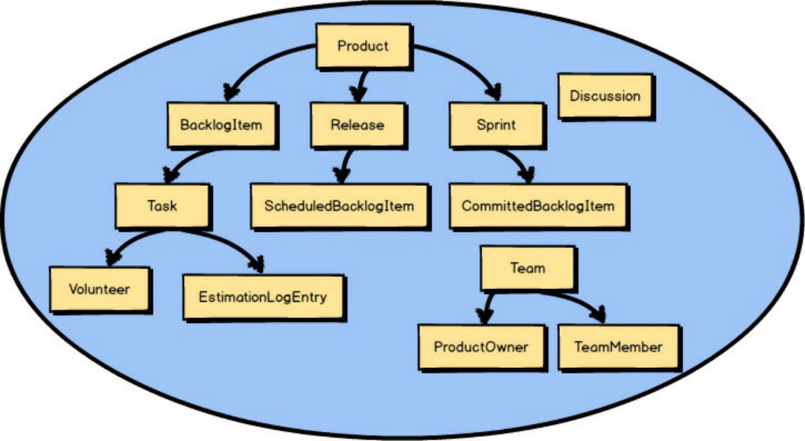


Remember, when using DDD, we are always modeling a _Ubiquitous Language_ inside a _Bounded Context._ Thus, all parts of the `Product` _Aggregate_ are modeled per the _Ubiquitous Language._ You don’t just make up these composed parts. Everything shows harmony between _Domain Experts_ and developers of your close-knit team. 

**Choose Your Abstractions Carefully** 

An effective software model is always based on a set of abstractions that address the business’s way of doing things. There is, however, the need to choose the appropriate level of abstraction for each concept being modeled. 

If you follow the direction of your _Ubiquitous Language_ , you will generally create the proper abstractions. It’s much easier to model the abstractions correctly because it is the _Domain Experts_ who convey at least the genesis of your modeling language. Still, sometimes software developers who are overzealous for solving the wrong problems will try to force in abstractions that are, well, too abstract. 

For example, in the _Agile Project Management Context_ we are dealing with Scrum. It makes sense to model `Product` , `BacklogItem` , `Release` , and `Sprint` concepts that we’ve been discussing. Even so, what if the software developers were less concerned about modeling the _Ubiquitous Language_ of Scrum, and more interested in modeling a solution to all current and future Scrum concepts? 

If this angle were pursued, the developers would probably come up with abstractions such as `ScrumElement` and `ScrumElementContainer` . A `ScrumElement` could fill the current need for `Product` and `Backlog-Item` , and `ScrumElementContainer` could represent the obviously more explicit concepts of `Release` and `Sprint` . The `ScrumElement` would have a `typeName` property, and it would be set to `"Product"` or `"BacklogItem"` in appropriate cases. We could design the same kind of `typeName` property for `ScrumElementContainer` and allow the values `"Release"` or `"Sprint"` to be set on it. 

Do you see the problems with this approach? There are more than a few, but consider the following: 

- The language of the software model does not match the mental model of the _Domain Experts._ 

- The level of abstraction is too high, and you will get into deep trouble when you start to model the details of each of the individual types. 

- This will lead to creating special cases in each of the classes and likely result in a complex class hierarchy with general approaches to explicit problems. 

- You will have much more code than you need, because you are trying to solve an unsolvable problem that should not matter in the first place. 

- Often the language of the wrong abstractions will find its way even into the user interface, which will cause confusion for users. 

- You will waste considerable time and money. 

- You will never be able to address all future needs up front, which means if new Scrum concepts are ever added in the future, your existing model will prove to be a failure in foreseeing those needs. 

Following such a path may seem strange to some, but this incorrect level of abstractions is used often in technically inspired implementations. 

Don’t get taken in by this alluring, highly abstract implementation trap. Model the _Ubiquitous Language_ explicitly according to the mental model of the _Domain Experts_ that is refined by your team. By modeling what the business needs today, you will save a considerable amount of time, budget, code, and embarrassment. More still, you will do the business a great service by modeling an accurate and useful _Bounded Context_ that reflects an effective design. 

### **Right-Sizing Aggregates** 

You may be wondering how you can determine the boundaries of _Aggregates_ and prevent the design of large clusters, while still maintaining consistency boundaries that will protect true business invariants. Here I have provided a worthy design approach. If you have already created large-cluster _Aggregates_ , you can use this approach to refactor into smaller ones, but I am not going to start from that perspective. 

Consider these design steps that will help you reach consistency boundary goals: 

**1.** Put your first focus on the second rule of _Aggregate_ design, “Design small _Aggregates._ ” Start by creating every _Aggregate_ with just one _Entity_ , which will serve as the _Aggregate Root._ Don’t even dare to place two _Entities_ in a single boundary. That opportunity will come soon enough. Populate each of the _Entities_ with the fields/attributes/properties that you believe are most closely associated with the single _Root Entity._ One big hint here is to define every field/attribute/property that is required to identify and find the _Aggregate_ , as well as any additional intrinsic fields/attributes/properties that are required for the _Aggregate_ to be constructed and left in a valid initial state. 

**2.** Now place your focus on the first rule of _Aggregate_ design, “Protect business invariants inside _Aggregate_ boundaries.” You have already asserted by the previous step that at a minimum all the intrinsic fields/attributes must be up-to-date when the single- _Entity Aggregate_ is persisted. But now you need to look at each of your _Aggregates_ one at a time. As you do so for _Aggregate_ A1, ask the _Domain Experts_ if any other _Aggregates_ you have defined must be updated in reaction to changes made to _Aggregate_ A1. Make a list of each of the _Aggregates_ and their consistency rules, which will indicate the time frames for all reaction-based updates. In other words, “ _Aggregate_ A1” would be the heading of one list, and other _Aggregate_ types would be listed under A1 if they will be updated in reaction to A1 updates. 

**3.** Now ask the _Domain Experts_ how much time may elapse until each of the reaction-based updates may take place. This will lead to two kinds of specifications: (a) immediately, and (b) within _N_ seconds/minutes/hours/days. One possible way to find the correct business threshold is by presenting an exaggerated time frame (such as weeks or months) that is obviously unacceptable. This will likely cause business experts to respond with an acceptable time frame. 

**4.** For each of the immediate time frames (3a), you should strongly consider composing those two _Entities_ within the same _Aggregate_ boundary. That means, for example, that _Aggregate_ A1 and _Aggregate_ A2 will actually be composed into a new _Aggregate_ A[1,2]. Now _Aggregates_ A1 and A2 as they were previously defined will no longer exist. There is only _Aggregate_ A[1,2]. 

**5.** For each of the reacting _Aggregates_ that can be updated following a given elapsed time (3b), you will update these using the fourth rule of _Aggregate_ design, “Update other _Aggregates_ using eventual consistency.” 


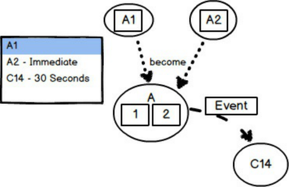


In this figure our focus is on modeling _Aggregate_ A1. Note from the A1 list of consistency rules that A2 has an immediate time frame, while C14 has an eventual (30 seconds) time frame. As a result, A1 and A2 are modeled into a single _Aggregate_ A[1,2]. During runtime _Aggregate_ A[1,2] publishes a _Domain Event_ that causes _Aggregate_ C14 to be updated eventually. 

Be careful that the business doesn’t insist that every _Aggregate_ fall within the 3a specification (immediate consistency). It can be an especially strong tendency when many in the design session are influenced by database design and data modeling. Those stakeholders will have a very transactioncentered point of view. However, it is very unlikely that the business really needs immediate consistency in every case. To change this thinking you will probably have to spend time proving how transactions will fail due to concurrent updates by multiple users across different composed parts of the (now) large-cluster _Aggregates._ Furthermore, you can point out how much memory overhead there is with such large-cluster designs. Obviously these kinds of problems are what we are trying to avoid in the first place. 

This exercise indicates that eventual consistency is business driven, not technically driven. Of course, you will have to find a way to technically cause eventual updates between multiple _Aggregates_ , as discussed in the previous chapter on _Context Mapping._ Even so, it is only the business that can determine the acceptable time frame for updates to occur between various _Entities._ Some are immediate, or transactional, which means they must be managed by the same _Aggregate._ Some are eventual, which means they may be managed through _Domain Events_ and messaging, for example. Considering what the business would have to do if it ran its operations only by means of paper systems can provide some worthwhile insights into how various domain-driven operations should work within a software model of the business operations. 

### **Testable Units** 

You should also design your _Aggregates_ to be a sound encapsulation for unit testing. Complex _Aggregates_ are hard to test. Following the previous design guidance will help you model testable _Aggregates._ 

Unit testing is different from validating business specifications (acceptance tests) as discussed in <u>Chapter 2</u> , “Strategic Design with Bounded Contexts and the Ubiquitous Language ,” and Chapter 7 , “Acceleration and Management Tools .” Development of the unit tests will follow the creation of scenario specification acceptance tests. What we are concerned with here is testing that the _Aggregate_ correctly does what it is supposed to do. You want to push on all the operations to ensure the correctness, quality, and stability of your _Aggregates._ You can use a unit testing framework for 

this, and there is much literature available on how to effectively unit test. These unit tests will be directly associated with your _Bounded Context_ and kept with its source code repository. 

### **Summary** 

In this chapter you learned: 

- What the _Aggregate_ pattern is and why you should use it 

- The importance of designing with a consistency boundary in mind 

- About the various parts of an _Aggregate_ 

- The four rules of thumb of effective _Aggregate_ design 

- How you can model an _Aggregate_ ’s unique identity 

- The importance of _Aggregate_ attributes and how to prevent creating an _Anemic Domain Model_ 

- How to model behavior on an _Aggregate_ 

- To always adhere to the _Ubiquitous Language_ within a _Bounded Context_ 

- The importance of selecting the proper level of abstraction for your designs 

- A technique for right-sizing your _Aggregate_ compositions, and how that includes designing for testability 

For a more in-depth treatment of _Entities_ , _Value Objects_ , and _Aggregates_ , see <u>Chapters 5</u> , <u>6</u> , and . 10 of _Implementing Domain-Driven Design_ <u>[IDDD]</u> 

**Chapter 6. Tactical Design with Domain Events** 


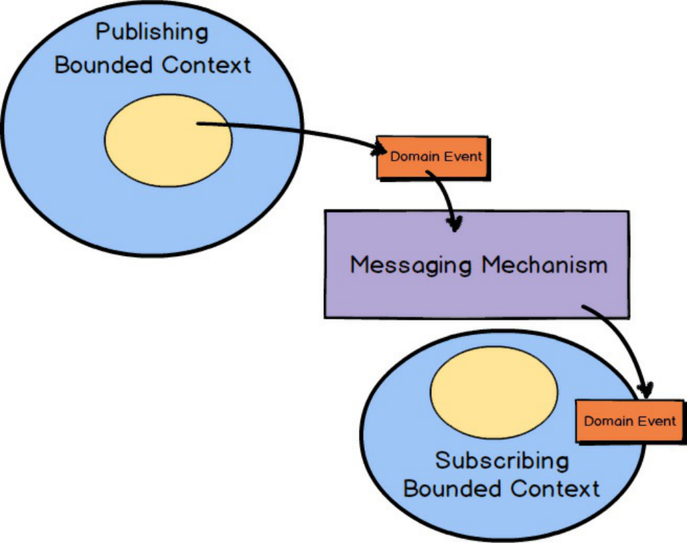


You’ve already seen a bit in previous chapters about how _Domain Events_ are used. A _Domain Event_ is a record of some business-significant occurrence in a _Bounded Context._ By now you know that _Domain Events_ are a very important tool for strategic design. Still, often during tactical design _Domain Events_ are conceptualized and become a part of your _Core Domain._ 

To see the full power that results from using _Domain Events_ , consider the concept of causal consistency. A business domain provides causal consistency if its operations that are causally related —one operation causes another—are seen by every dependent node of a distributed system in the same order [Causal] . This means that causally related operations must occur in a specific order, and thus one thing cannot happen unless another thing happens before it. Perhaps this means that one _Aggregate_ cannot be created or modified until it is clear that a specific operation occurred to another _Aggregate_ : 

**1.** Sue posts a message saying, “I lost my wallet!” 

**2.** Gary says in reply, “That’s terrible!” 

**3.** Sue posts a message saying, “Don’t worry, I found my wallet!” 

**4.** Gary replies, “That’s great!” 

If these messages were replicated on distributed nodes, but not in a causal order, it could appear that Gary said, “That’s great!” to the message “I lost my wallet!” The message “That’s great!” is not directly or causally related to “I lost my wallet!” and that’s definitely not what Gary wants Sue or 

anyone else to read. Thus, if causality is not achieved in the proper way, the overall domain would be wrong or at least misleading. This sort of causal, linearized system architecture can be readily achieved through the creation and publication of correctly ordered _Domain Events._ 

From tactical design efforts _Domain Events_ become a reality in your domain model and can as a result be published and consumed in your own _Bounded Context_ and by others. It’s a very powerful way to inform interested listeners of important occurrences that have taken place. Now you will learn how to model _Domain Events_ and use them in your _Bounded Contexts._ 

### **Designing, Implementing, and Using Domain Events** 

The following guides you through the steps needed to effectively design and implement _Domain Events_ in your _Bounded Context._ Following this, you will also see examples of how _Domain Events_ are used. 


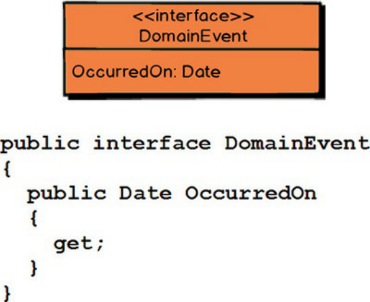


This C# code might be considered the minimum interface that every _Domain Event_ should support. You generally want to convey the date and time when your _Domain Event_ occurred, so that’s provided by the `OccurredOn` property. This detail is not an absolute necessity, but it is often useful. So your _Domain Event_ types would likely implement this interface. 

You must show care in how you name your _Domain Event_ types. The words you use should reflect your model’s _Ubiquitous Language._ These words will form a bridge between the happenings in your model and the outside world. It’s vital that you communicate your happenings well. 


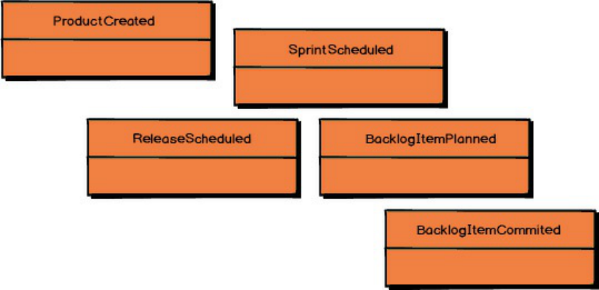


Your _Domain Event_ type names should be a statement of a past occurrence, that is, a verb in the past tense. Here are some examples from the _Agile Project Management Context_ : `ProductCreated` , for instance, states that a Scrum product was created at some past time. Other _Domain Events_ are `ReleaseScheduled` , `SprintScheduled` , `BacklogItemPlanned` , and `BacklogItemCommitted` . Each of the names clearly and concisely states what happened in your _Core Domain._ 


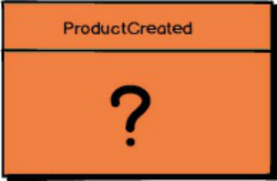


It’s a combination of the _Domain Event_ ’s name and its properties that fully conveys the record of what happened in the domain model. But what properties should a _Domain Event_ hold? 


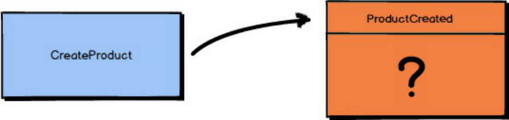


Ask yourself, “What is the application stimulus that causes the _Domain Event_ to be published?” In the case of `ProductCreated` there is a command that causes it (a command is just the object form of a method/action request). The command is named `CreateProduct` . So you can say that `ProductCreated` is the result of a `CreateProduct` command. 


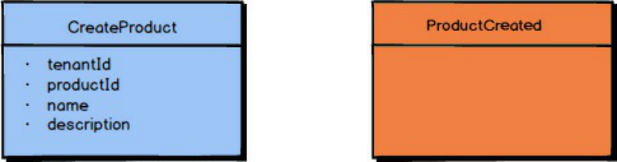


The `CreateProduct` command has a number of properties: (1) the `tenantId` that identifies the subscribing tenant, (2) the `productId` that identifies the unique `Product` being created, the (3) `Product name` , and (4) the `Product description` . Each of these properties is 

essential to creating a `Product` . 


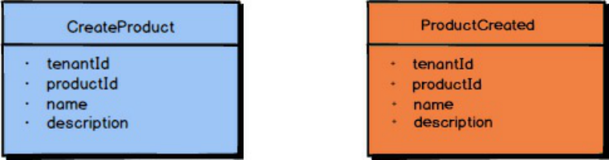


Therefore, the `ProductCreated` _Domain Event_ should hold all the properties that were provided with the command that caused it to be created: (1) `tenantId` , (2) `productId` , (3) `name` , and (4) `description` . This will fully and accurately inform all subscribers what happened in the model; that is, a `Product` was created, it was for the tenant identified with the `tenantId` , the `Product` was uniquely identified with `productId` , and the `Product` had the `name` and `description` assigned to it. 


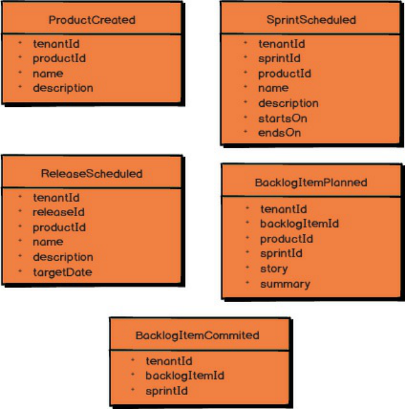


These five examples give you a good idea of the properties that should be included with the various _Domain Events_ published by the _Agile Project Management Context._ For instance, when a `BacklogItem` is committed to a `Sprint` , the `BacklogItemCommitted` _Domain Event_ is instantiated and published. This _Domain Event_ contains the `tenantId` , the `backlogItemId` of the `BacklogItem` that was committed, and the `sprintId` of the `Sprint` to which it was committed. 

As described in <u>Chapter 4</u> , “Strategic Design with Context Mapping ,” there are times when a _Domain Event_ can be enriched with additional data. This can be especially helpful to consumers that don’t want to query back on your _Bounded Context_ to obtain additional data that they need. Even so, you must be careful not to fill up a _Domain Event_ with so much data that it loses its meaning. For example, consider the problem with `BacklogItemCommitted` holding the entire state of the `BacklogItem` . According to this _Domain Event_ , what actually happened? All the extra data may make it unclear, unless you require the consumer to have a deep understanding of your 

`BacklogItem` element. Also, consider using `BacklogItemUpdated` with the full state of the `BacklogItem` , as opposed to providing `BacklogItemCommitted` . What happened to the `BacklogItem` is very unclear, because the consumer would have to compare the latest `BacklogItemUpdated` to the previous `BacklogItemUpdated` in order to understand what actually occurred to the `BacklogItem` . 


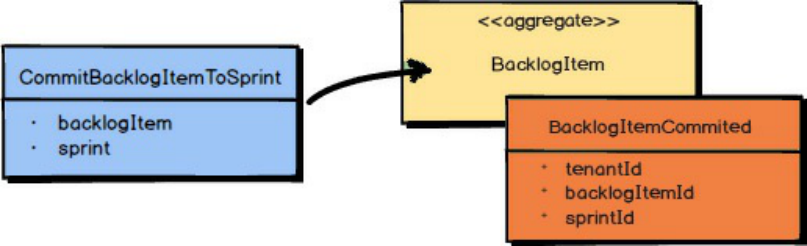


To make the proper use of _Domain Events_ clearer, let’s walk through one scenario. The product owner commits a `BacklogItem` to a `Sprint` . The command itself causes the `BacklogItem` and the `Sprint` to be loaded. Then the command is executed on the `BacklogItem` _Aggregate._ This causes the state of the `BacklogItem` to be modified, and then the `BacklogItemCommitted` _Domain Event_ is published as an outcome. 


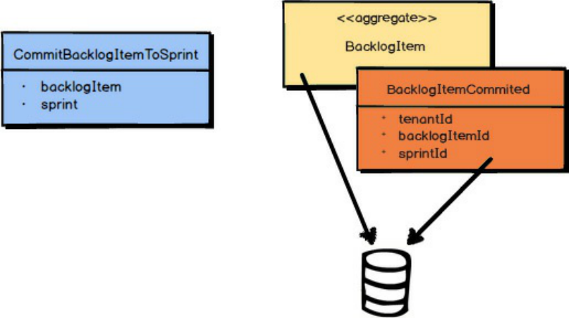


It’s important that the modified _Aggregate_ and the _Domain Event_ be saved together in the same transaction. If you are using an object-relational mapping tool, you would save the _Aggregate_ to one table and the _Domain Event_ to an event store table, and then commit the transaction. If you are using _Event Sourcing_ , the state of the _Aggregate_ is fully represented by the _Domain Events_ themselves. I discuss _Event Sourcing_ in the next section of this chapter. Either way, persisting the _Domain Event_ in the event store preserves its causal ordering relative to what has happened across the domain model. 


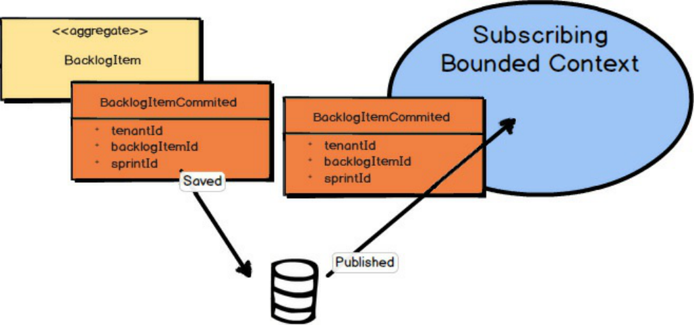


Once your _Domain Event_ is saved to the event store, it can be published to any interested parties. This might be within your own _Bounded Context_ and to external _Bounded Contexts._ This is your way of telling the world that something noteworthy has occurred in your _Core Domain._ 

Note that just saving the _Domain Event_ in its causal order doesn’t guarantee that it will arrive at other distributed nodes in the same order. Thus, it is also the responsibility of the consuming _Bounded Context_ to recognize proper causality. It might be the _Domain Event_ type itself that can indicate causality, or it may be metadata associated with the _Domain Event_ , such as a sequence or causal identifier. The sequence or causal identifier would indicate what caused this _Domain Event_ , and if the cause was not yet seen, the consumer must wait to apply the newly arrived event until its cause arrives. In some cases it is possible to ignore latent _Domain Events_ that have already been superseded by the actions associated with a later one; in this case causality has a dismissible impact. 


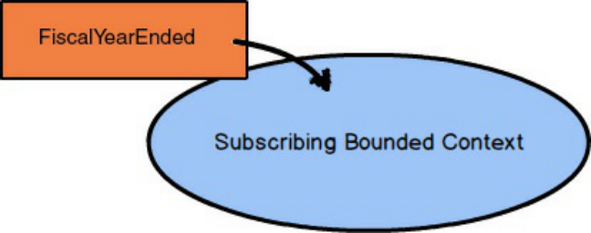


One more point about what can cause a _Domain Event_ is noteworthy. Although often it is a userbased command emitted by the user interface that causes an event to occur, sometimes _Domain Events_ can be caused by a different source. This might be from a timer that expires, such as at the end of the business day or the end of a week, month, or year. In cases like this it won’t be a command that causes the event, because the ending of some time period is a matter of fact. You can’t reject the fact that some time frame has expired, and if the business cares about this fact, the time expiration is modeled as a _Domain Event_ , and not as a command. 

What is more, such an expiring time frame will generally have a descriptive name that will become part of the _Ubiquitous Language._ For example, “Fiscal Year Ended” may be an important event that your business needs to react to. Furthermore, 4:00 p.m. (16:00) on Wall Street is known as “Markets Closed” and not just as 4:00 p.m. Therefore, you have a name for that particular time-based _Domain Event._ 

A command is different from a _Domain Event_ in that a command can be rejected as inappropriate in some cases, such as due to supply and availability of some resources (product, funds, etc.), or another kind of business-level validation. So, a command may be rejected, but a _Domain Event_ is a matter of history and cannot logically be denied. Even so, in response to a time-based _Domain Event_ it could be that the application will need to generate one or more commands in order to ask the application to carry out some set of actions. 


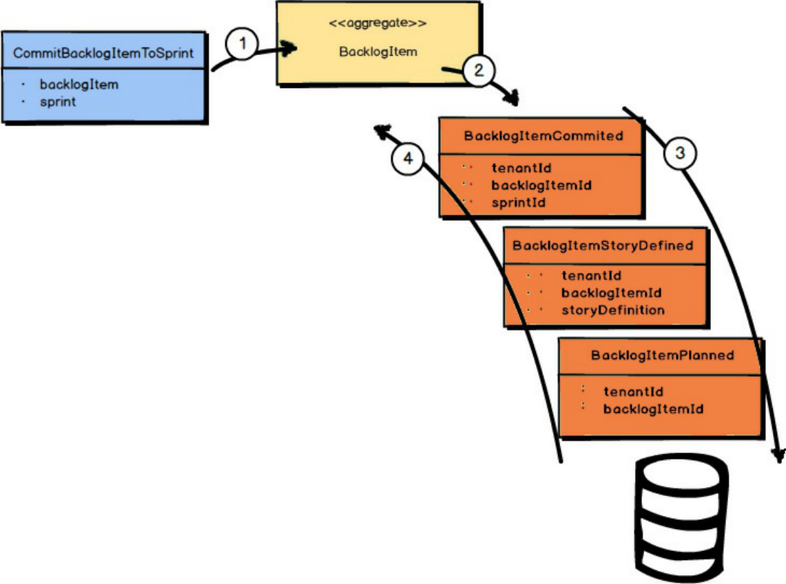


### **Event Sourcing** 

_Event Sourcing_ can be described as persisting all _Domain Events_ that have occurred for an _Aggregate_ instance as a record of what changed about that _Aggregate_ instance. Rather than persisting the _Aggregate_ state as a whole, you store all the individual _Domain Events_ that have happened to it. Let’s step through how this is supported. 

All of the _Domain Events_ that have occurred for one _Aggregate_ instance, ordered as they originally occurred, make up its event stream. The event stream begins with the first _Domain Event_ that ever occurred for the _Aggregate_ instance and continues until the last _Domain Event_ that occurred. As new _Domain Events_ occur for a given _Aggregate_ instance, they are appended to the end of its event stream. Reapplying the event stream to the _Aggregate_ allows its state to be reconstituted from persistence back into memory. In other words, when using _Event Sourcing_ , an _Aggregate_ that was removed from memory for any reason is reconstituted entirely from its event stream. 

In the preceding diagram, the first _Domain Event_ to occur was `BacklogItemPlanned` ; the 

next was `BacklogItemStoryDefined` ; and the event that just occurred is `BacklogItemCommitted` . The full event stream is currently composed of those three events, and they follow the order described and seen in the diagram. 

Each of the _Domain Events_ that occurs for a given _Aggregate_ instance is caused by a command, just as described previously. In the preceding diagram, it is the `CommitBacklogItemToSprint` command that has just been handled, and this has caused the `BacklogItemCommitted` _Domain Event_ to occur. 


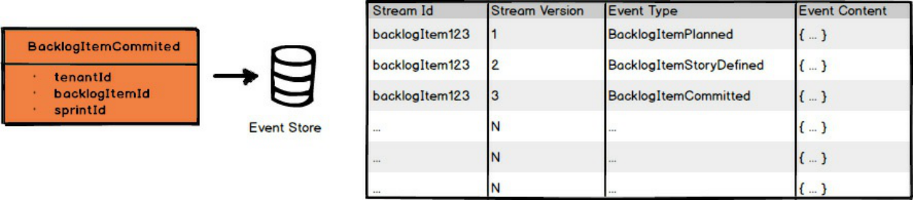


The event store is just a sequential storage collection or table where all _Domain Events_ are appended. Because the event store is append-only, it makes the storage mechanism extremely fast, so you can plan on a _Core Domain_ that uses _Event Sourcing_ to have very high throughput, low latency, and be capable of high scalability. 

#### **Performance Conscious** 

If one of your primary concerns is performance, you will appreciate knowing about caching and snapshots. First of all, your highest-performing _Aggregates_ will be those that are cached in memory, where there is no need to reconstitute them from storage each time they are used. Using the Actor model with actors as _Aggregates_ <u>[Reactive]</u> is one of the easier ways to keep your _Aggregates’_ state cached. 

Another tool at your disposal is snapshots, where the load time of your _Aggregates_ that have been evicted from memory can be reconstituted optimally without reloading every _Domain Event_ from an event stream. This translates to maintaining a snapshot of some incremental state of your _Aggregate_ (object, actor, or record) in the database. Snapshots are discussed in more detail in _Implementing Domain-Driven Design_ <u>[IDDD]</u> . and in _Reactive Messaging Patterns with the Actor Model_ <u>[Reactive]</u> 

One of the greatest advantages of using _Event Sourcing_ is that it saves a record of everything that has ever happened in your _Core Domain_ , at the individual occurrence level. This can be very helpful to your business for many reasons, ones that you can imagine today, such as compliance and analytics, and ones that you won’t realize until later. There are also technical advantages. For example, software developers can use event streams to examine usage trends and to debug their source code. 

You can find coverage of _Event Sourcing_ techniques in _Implementing Domain-Driven Design_ <u>[IDDD]</u> . Also, when you use _Event Sourcing_ you are almost certainly obligated to use CQRS. You . can also find discussions of this topic in _Implementing Domain-Driven Design_ <u>[IDDD]</u> 

### **Summary** 

In this chapter you learned: 

- How to create and name your _Domain Events_ 

- The importance of defining and implementing a standard _Domain Event_ interface 

- That naming your _Domain Events_ well is especially important 

- How to define the properties of your _Domain Events_ 

- That some _Domain Events_ may be caused by commands, while others may happen due to the detection of some other changing state, such as a date or time 

- How to save your _Domain Events_ to an event store 

- How to publish your _Domain Events_ after they are saved 

- About _Event Sourcing_ and how your _Domain Events_ can be stored and used to represent the state of your _Aggregates_ 

For a thorough treatment of _Domain Events_ and integration, see Chapters 8 and 13 of _Implementing_ . _Domain-Driven Design_ <u>[IDDD]</u> 

## **Chapter 7. Acceleration and Management Tools** 


When using DDD we are on a quest for deep learning about how the business works, and then to model software based on the extent of our learning. It’s really a process of learning, experimenting, challenging, learning more, and modeling again. We need to crunch and distill knowledge in great quantities and produce a design that is effective in meeting the strategic needs of an organization. The challenge is that we have to learn quickly. In a fast-paced industry we are usually working against time, because time matters, and time generally drives many of our decisions, possibly even more than it should. If we don’t deliver on time and within budget, no matter what we have achieved with the software, we seem to have failed. And everyone is counting on us to succeed in every way. 

Some have made efforts to convince management that most project time estimations are valueless and that they cannot be successfully used. I am not sure how those efforts are working out in the large, but every client with whom I work is still being pressured to deliver within very specific time frames, which forces timeboxing into the design/implementation process. At best it’s a constant struggle between software development and management. 

Unfortunately, one common response to this negative pressure is to try to economize and shorten timelines by eliminating design. Recall from the first chapter that design is inevitable, and that either you will do poorly as a result of bad design, or you will succeed by delivering with an effective design, and possibly even with a good design. So, what you should attempt to do is meet the demands of time squarely and design in an accelerated way, using approaches that will help you deliver the very best design possible within the limits of time that you face. 

To that end I provide some very useful design acceleration and project management tools in this chapter. First I discuss _Event Storming_ and then conclude with a way to leverage the artifacts produced by that collaboration process to create estimates that are meaningful and, best of all, attainable. 


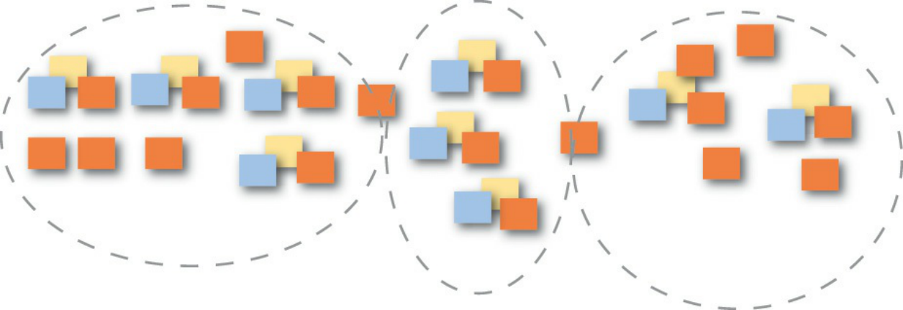


### **Event Storming** 

_Event Storming_ is a rapid design technique that is meant to engage both _Domain Experts_ and developers in a fast-paced learning process. It is focused on the business and business process rather than on nouns and data. 

Prior to learning _Event Storming_ I used a technique that I called event-driven modeling. It usually involved conversations, concrete scenarios, and event-centric modeling using very lightweight UML. The UML-specific steps could be achieved on a whiteboard alone and could also be captured in a tool. However, as you probably know, few business people are informed and proficient in even a minimalistic use of UML. So, this left most of the modeling part of the exercise to me or another developer who understood the basics of UML. It was a very useful approach, but there had to be a way to get business experts more directly involved in the process. That probably meant leaving out UML in favor of a more engaging tool. 

I first learned about _Event Storming_ years ago from Alberto Brandolini <u>[Ziobrando]</u> , who had also experimented with another form of event-driven modeling. On one occasion, being short on time, Alberto decided that he should ditch the UML and use sticky notes instead. This was the birth of an approach to rapid learning and software design that got everybody in the room very directly involved in the process. Here are some of its advantages: 

- It is a very tactile approach. Everyone gets a pad of sticky notes and a pen and is responsible for contributing to the learning and design sessions. Both business people and developers stand on equal ground as they learn together. Everyone provides input to the _Ubiquitous Language._ 

- It focuses everyone on events and the business process rather than on classes and the database. 

- It is a very visual approach, which dismisses code from the experimentation and puts everyone on a level footing with the design process. 

- It is very fast and very cheap to perform. You can literally storm out a new _Core Domain_ in rough format in a matter of hours rather than weeks. If you write something on a sticky note that you later decide doesn’t work, you wad up the sticky note and throw it away. It costs you only a penny or two for that mistake, and no one is going to resist the opportunity to refine due to effort already invested. 

- Your team will have breakthroughs in understanding. Period. It happens every time. Some will come to the session thinking that they have a pretty good understanding of the specific core 

business model, but no matter, they always leave with a greater understanding and even new insights about the business process. 

- Everybody learns something. Whether you are a _Domain Expert_ or a software developer, you will walk away from the sessions with a crisp, clear understanding of the model at hand. This is different from achieving breakthroughs and is important in its own right. In many projects, at least some project members, and possibly many, do not understand what they are working on until it is too late and the damage is already in the code. Storming out a model helps everyone clear up misunderstandings and move forward with a unified direction and purpose. 

- This implies that you are also identifying problems in both the model and in understanding as early and quickly as possible. Iron out misunderstandings and leverage the outcome as new insights. Everybody in the room benefits. 

- You can use _Event Storming_ for both _big-picture_ and _design-level_ modeling. Doing big-picture storming will be less precise, while design-level storming will lead you toward certain software artifacts. 

- It is unnecessary to limit the storming sessions to one. You can start off with a two-hour storming session, then take a break. Sleep on your accomplishments and return the next day to spend another hour or two to expand and refine. If you do this for two hours a day for three or four days, you will gain a deep understanding of your _Core Domain_ and integrations with your surrounding _Subdomains._ 

Here is a list of the people, mindset, and supplies you will need to storm out a model: 

- Having the right people is essential, which means the _Domain Expert(s)_ and developers who are to work on the model. Everyone is going to have some of the questions and some of the answers. In order to support each other, they all need to be in the same room during the modeling sessions. 

- Everyone should come with an open mind that is free of strict judgment. The biggest mistake I see during _Event Storming_ sessions is people trying to be too correct too soon. You should rather be fully determined to create far too many events. More events is better than fewer events, because that’s what will make you learn the most. There is time to refine later, and refinement is fast and cheap. 

- Have on hand an assortment of colors of sticky notes, and plenty of them. At a minimum you need these colors: orange, purple/red, light blue, pale yellow, lilac, and pink. You may find that other colors (such as green; see later examples) come in handy. The sticky note dimensions can be square (3 inches by 3 inches, or 7.62 cm by 7.62 cm) rather than the wider variety that are rectangular. You don’t need to write much on the sticky note; usually just a few words will do. Consider getting the extra-sticky variety. You don’t want your sticky notes falling on the floor. 

- Provide one black marker pen for each person, which will enable handwriting to show up bold and clear. Fine-tip markers are best. 

- Find a wide wall where you can model. Width is more important than height, but your modeling surface should be approximately one meter/yard high. Width should be practically unlimited, but something in the range of 10 meters/yards should be considered a minimum. In lieu of such a wall being available, you can always use a long conference table or the floor. The problem with a table is that it will ultimately limit your modeling space. The problem with the floor is that it might not be accessible to everyone on the team. A wall is best. 

- Obtain a long roll of paper, such as can often be found at art stores, teaching supply stores, and even at Ikea stores. The paper should be to the dimensions described previously, with at least 10 meters/yards in width and 1 meter/yard in height. Hang the paper on the wall using strong tape. Some may decide to forgo the paper and just work on whiteboards. This may work for a while, but the sticky notes tend to lose adhesion over time on whiteboards, especially if they are pulled up and restuck in different locations. Stickies adhere longer when they are applied to paper. If you intend to model for brief periods of time over three or four days, rather than in one long session, longevity of stickiness is important. 

Given the basic supplies and having the right people participating in the session, you are ready to begin. Consider each of the steps, one by one. 


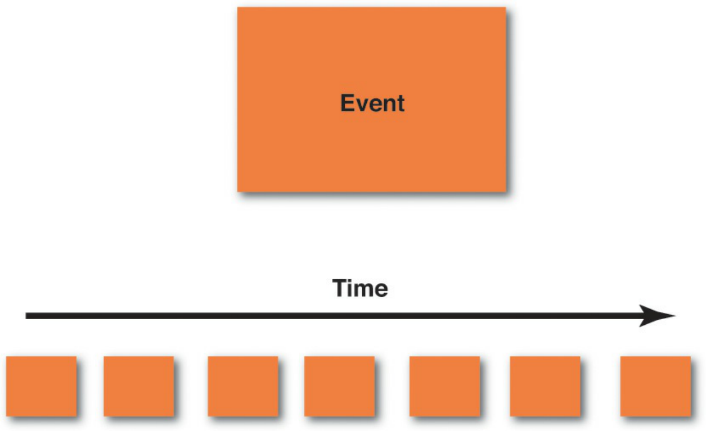


**1.** _Storm out the business process by creating a series of Domain Events on sticky notes. The most popular color to use for Domain Events is orange._ Using orange makes the _Domain Events_ stand out most prominently on the modeling surface. 

   - The following are some basic guidelines that should be employed as you create your _Domain Events:_ 

   - Creating _Domain Events_ first should emphasize that we have our first and primary focus on the business process, not on the data and its structure. It may take your team 10 to 15 minutes to warm up to this, but follow the steps just as I outline them here. Don’t be tempted to jump ahead. 

   - Write the name of each _Domain Event_ on a sticky note. The name, as you learned in the previous chapter, should be a verb stated in the past tense. For example, an event may be named `ProductCreated` , and another may be named `BacklogItemCommitted` . 

(You can certainly break these names into multiple lines on the sticky notes.) If you are doing big-picture storming and you think that these names are too precise for the participants, use other names. 

- Place the sticky notes on your modeling surface in time order, that is, from left to right in the order in which each event occurs in the domain. You start with the first _Domain Events_ to the far left of your modeling surface and then move gradually to the right. Sometimes you won’t have a good understanding of the time order, in which case you should just put the corresponding _Domain Events_ somewhere in the model. Figure out the “when” part, which will probably become obvious, later. 

- A _Domain Event_ that happens in parallel with another according to your business process can be located under the _Domain Event_ that happens at the same time. So, you use vertical space to represent parallel processing. 

- As you go through this part of the storming session, you are going to find trouble spots in your existing or new business process. Clearly mark these with a purple/red sticky note and some text that explains why it’s a problem. You need to invest time at such points to learn more. 

- Sometimes the outcome of a _Domain Event_ is a _Process_ that needs to run. This could be a single step or multiple complex steps. Each _Domain Event_ that causes a _Proces_ s to be executed should be captured and named on a lilac sticky note. Draw a line with an arrowhead from the _Domain Event_ to the named _Process_ (lilac sticky note). Model a fine-grained _Domain Event_ only if it is important to your _Core Domain._ Most likely a user registration process is a necessity but probably not considered a core feature of your application. Model the registration process as one single coarse-grained event, `UserRegistered` , and move on. Put your concentrated efforts into more important events. 

If you think you have exhausted all possible important _Domain Events_ , it may be time to take a break and come back to the modeling session later. Returning to the modeling surface a day later will no doubt cause you to find missing concepts and to refine or toss out superficial ones that you previously considered important. Even so, at some point you will have identified most of the _Domain Events_ that are of greatest importance. At that time you should move on to the next step. 


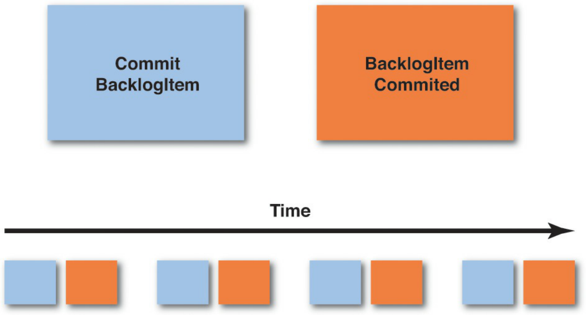


**2.** _Create the Commands that cause each Domain Event._ Sometimes a _Domain Event_ will be the outcome of a happening in another system, and it will flow into your system as a result. Still, often a _Command_ will be the outcome of some user gesture, and that _Command_ , when carried out, will cause a _Domain Event._ The _Command_ should be stated in the imperative, such as `CreateProduct` and `CommitBacklogItem` . These are some basic guidelines: 

   - On the light blue sticky notes, write the name of the _Command_ that causes each corresponding _Domain Event._ For example, if you have a _Domain Event_ named `BacklogItemCommitted` , the corresponding _Command_ that causes that event is named `CommitBacklogItem` . 

   - Place the light blue sticky note of the _Command_ just to the left of the _Domain Event_ that it causes. They are associated in pairs: _Command/Event_ , _Command/Event_ , _Command/Event_ , and so on. Remember that some _Domain Events_ will occur because of time limits being reached and so may not have a corresponding _Command_ that explicitly causes them. 

   - If there is a specific user role that performs an action, and it is important to specify, you can place a small, bright yellow sticky note on the lower left corner of the light blue _Command_ with a stick figure and the name of the role. In the above figure, “Product Owner” would be the role that performs the _Command._ 

   - Sometimes a _Command_ will cause a _Process_ to be run. This could be a single step or multiple complex steps. Each _Command_ that causes a _Process_ to be executed should be captured and named on a lilac sticky note. Draw a line with an arrowhead from the _Command_ to the named _Process_ (lilac sticky note). The _Process_ will actually cause one or more _Commands_ and subsequent _Domain Events_ , and if you know what those are now, create sticky notes for them and show them emitting from the _Process._ 

   - Continue to move from left to right in time order just as you did when first creating each of the _Domain Events._ 

- It is possible that creating _Commands_ will cause you to think about _Domain Events_ (as above when discovering lilac _Processes_ , or other ones) that you didn’t previously envision. Go ahead and address this discovery by placing the newly discovered _Domain Event_ on the modeling surface along with its corresponding _Command._ 

- You may also find that there is only one _Command_ that causes multiple _Domain Events._ That’s fine; model the one _Command_ and place it to the left of the multiple _Domain Events_ that it causes. 

Once you have all of the _Commands_ associated with the _Domain Events_ that they cause, you are ready to move on to the next step. 


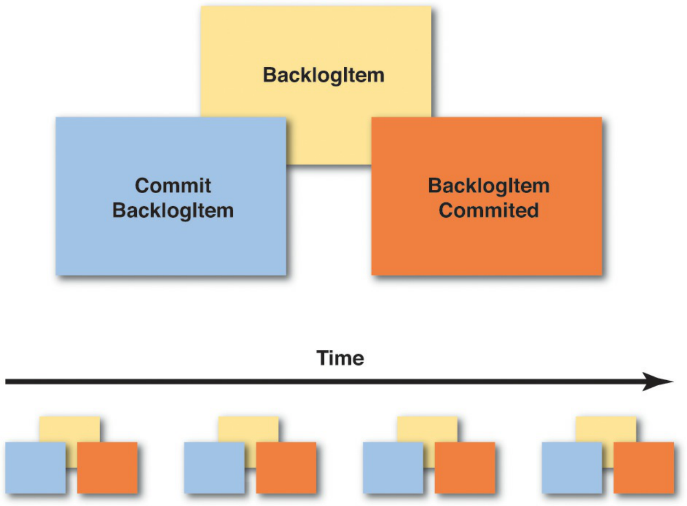


**3.** _Associate the Entity/Aggregate on which the Command is executed and that produces the Domain Event outcome._ This is the data holder where _Commands_ are executed and _Domain Events_ are emitted. _Entity_ relationship diagrams are often the first and most popular step in today’s IT world, but it is a big mistake to start here. Business people don’t understand them well, and they can shut down conversations quickly. In fact, this step has been relegated to third place in _Event Storming_ , because we are more focused on the business process than on the data. Even so, we do need to think about data at some point, and that point is now. At this stage, business experts will likely understand that the data comes into play. Here are some guidelines for modeling the _Aggregates_ : 

- If the business people don’t like the word _Aggregate_ , or if it confuses them in any way, you should use another name. Usually they can understand _Entity_ , or you could just call it _Data._ The important thing is that the sticky allows the team to communicate clearly about the concept that it represents. Use the pale yellow sticky notes for all _Aggregates_ and write the name of an _Aggregate_ on each sticky note. This is a noun, such as `Product` or `BacklogItem` . You will do this for each _Aggregate_ in your model. 

- Place the _Aggregate_ sticky note behind and slightly above the _Command_ and _Domain Event_ pairs. In other words, you should be able to read the noun written on the _Aggregate_ sticky note, but the _Command_ and _Domain Event_ pairs should adhere to the lower part of the _Aggregate_ sticky to indicate that they are associated. If you really want to put a little space between the stickies that’s fine, but just be clear which _Commands_ and _Domain Events_ belong to which _Aggregate._ 

- As you move across your business process timeline, you will probably find that _Aggregates_ are repeatedly used. Don’t rearrange your timeline in order to move all _Command/Event_ pairs under a single _Aggregate_ sticky note. Rather, create the same _Aggregate_ noun on multiple sticky notes and place them repeatedly on the timeline where the corresponding _Command/Event_ pairs occur. The main point is to model the business process; the business process occurs over time. 

- It’s possible that as you think about the data associated with various actions, you may discover new _Domain Events._ Don’t ignore these. Rather, place the newly discovered _Domain Events_ along with the corresponding _Commands_ and _Aggregates_ on the modeling surface. You may also discover that some of the _Aggregates_ are too complex, and you need to break these into a managed _Process_ (lilac sticky). Don’t ignore these opportunities. 

Once you have completed this part of the design stage, you are approaching some of the extra steps that you can perform if you choose to. Also understand that if you are using _Event Sourcing_ , as described in the previous chapter, you have already come a long way toward understanding your _Core Domain_ implementation, because there is a large overlap in _Event Storming_ and _Event Sourcing._ Of course, the closer your storming is to the big picture, the further it potentially is from actual implementation. Still, you can use this same technique to reach a design-level view. In my experience teams tend to move in and out of big-picture and design-level within the same sessions. In the end  your need to learn certain details will drive you beyond the big picture to reach a designlevel model where it is essential. 


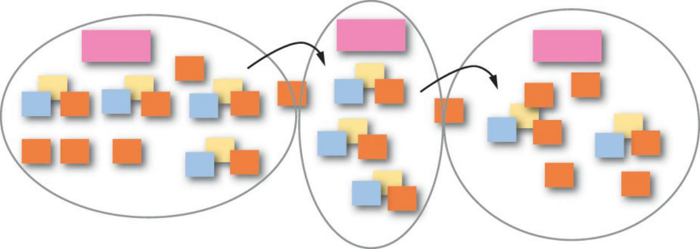


**4.** _Draw boundaries and lines with arrows to show flow on your modeling surface._ You have very likely discovered that there are multiple models in play, and _Domain Events_ that flow between models, in your _Event Storming_ sessions. Here’s how to deal with that: 

   - In summary, you will very likely find boundaries under the following conditions: departmental divisions, when different business people have conflicting definitions for the same term, or when a concept is important but not really part of the _Core Domain._ 

   - You can use your black marker pens to draw on the paper modeling surface. Show context and other boundaries. Use solid lines for _Bounded Contexts_ and dashed lines for _Subdomains. Obviously drawing boundaries on the paper is permanent, so be sure you understand this level of detail before wading in. If you want to start by bounding models with less permanence, use the pink stickies to mark general areas and withhold drawing boundaries with permanent markers until your confidence justifies it._ 

   - Place the pink sticky notes inside various boundaries and put the name that applies inside the boundary on those sticky notes. This names your _Bounded Contexts._ 

   - Draw lines with arrowheads to show the direction of _Domain Events_ flowing between _Bounded Contexts._ This is an easy way to communicate how some _Domain Events_ arrive in your system without being caused by a _Command_ in your _Bounded Context._ 

Any other details about these steps should be intuitively obvious. Just use boundaries and lines to communicate. 


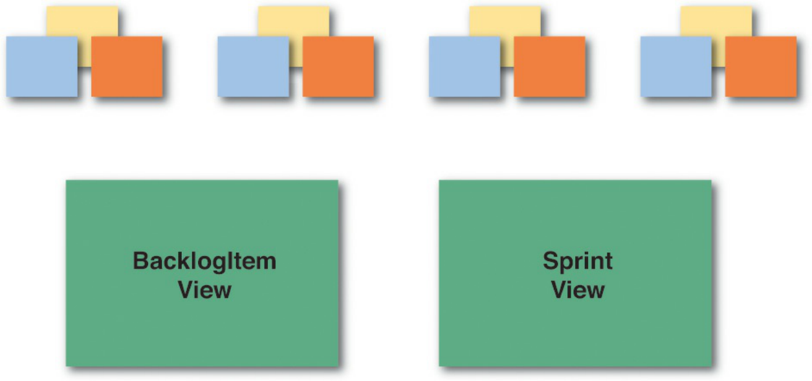


**5.** _Identify the various views that your users will need to carry out their actions, and important roles for various users._ 

   - You won’t necessarily need to show every view that your user interface will provide, or any at all for that matter. If you decide to show any views, they should be those that are significant and require some special care in creating. These view artifacts can be represented by green sticky notes on the modeling surface. If it helps, draw a quick mockup (or wireframe) of the user interface views that are most important. 

   - You can also use bright yellow sticky notes to represent various important user roles. Again, show these only if you need to communicate something of significance about the user’s interaction with the system, or something that the system does for a specific role of user. 

It could well be that the fourth and fifth steps are all the extras you will need to incorporate with your _Event Storming_ exercises. 

### **Other Tools** 

Of course this doesn’t prevent you from experimenting, such as placing other drawings on your modeling surface and trying other modeling steps in your _Event Storming_ session. Remember, this is about learning and communicating a design. Use whatever tools you need to model as a close-knit team. Just be careful to reject ceremony, because that’s going to cost a lot. Here are some other ideas: 

Introduce high-level executable specifications that follow the given/when/then approach. These are also known as acceptance tests. You can read more about this in the book _Specification by Example_ by Gojko Adzic [Specification] , and I provide an example in Chapter 2 , “Strategic Design with <u>Bounded Contexts and the Ubiquitous Language</u> .” Just be careful not to go overboard with these, where they become all-consuming and take precedence over the actual domain model. I estimate that it requires somewhere in the range of 15% to 25% more time and effort to use and maintain executable specifications instead of common unit-testing-based approaches (also demonstrated in <u>Chapter 2</u> ), and it is easy to get caught up in keeping the specifications relevant to the current business direction as the model changes over time. 

Try _Impact Mapping_ <u>[Impact Mapping]</u> to make sure the software you are designing is a _Core Domain_ and not some less important model. This is a technique also defined by Gojko Adzic. Look into _User Story Mapping_ by Jeff Patton [User Story Mapping] . This is used to place your focus on the _Core Domain_ and understand what software features you should be investing in. 

The previous three add-on tools have a large overlap with the DDD philosophy and would be quite suitable to introduce into any DDD project. All of them are meant to be used in a highly accelerated project, are low ceremony, and are very cheap to use. 

### **Managing DDD on an Agile Project** 

I previously mentioned that there has been a movement around what is called _No Estimates._ This is an approach that rejects typical estimation approaches such as story points or task hours. It focuses on delivering value over controlling cost, and not estimating any task that would likely require only a few months to complete. I don’t dismiss this approach. Yet, at the time of writing this, the clients I work with are still required to provide estimates and to timebox tasks, such as programming effort needed to implement even fine-grained features. If _No Estimates_ works for you and your project situation, use it. 

I am also aware that some in the DDD community have basically defined their own process or process execution framework for using DDD and performing with it on a project. This may work well and be effective when it is accepted by a given team, but it can be more difficult to get buy-in from organizations that have already invested in an agile execution framework, such as Scrum. 


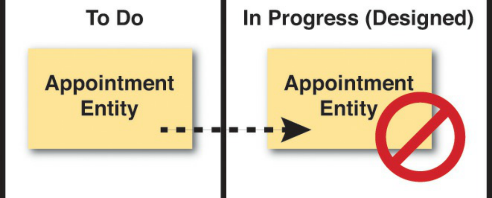


I have observed that recently Scrum has come under considerable criticism. While I don’t take sides in this criticism, I will openly state that often or even most times Scrum is being misused. I have already mentioned the tendency for teams to “design” using what I call “the task-board shuffle.” It’s just not the way Scrum was meant to be used on a software project. And, to repeat myself again, _knowledge acquisition_ is both a Scrum tenet and a major goal of DDD but is largely ignored in exchange for relentless delivery with Scrum. Even so, Scrum is still heavily used in our industry, and I doubt that it will be displaced anytime soon. 

Therefore, what I will do here is to show you how you can make DDD work in a Scrum-based project. The techniques I show you should be equally applicable with other agile project approaches, such as when using Kanban. There is nothing here that is exclusive to Scrum, although some of the guidance is stated in terms of Scrum. And since many of you will already be familiar with Scrum by putting it into practice in some form, most of my guidance here will be regarding the domain model 

and learning, experimenting, and designing with DDD. You will need to look elsewhere for general guidance on using Scrum, Kanban, or another agile approach. 

Where I use the term _task_ or _task board_ , this should be compatible with agile in general, and even Kanban. Where I use the term _sprint_ , I will also try to include the words _iteration_ for agile in general and _WIP_ (work in progress) as a reference to Kanban. It may not always be a perfect fit, as I am not trying to define an actual process here. I hope you will simply benefit from the ideas and find a way to apply them appropriately in your specific agile execution framework. 

### **First Things First** 

One of the most important means to successfully employing DDD on a project is to hire good people. There is simply no replacement for good people, and above-average developers for that matter. DDD is an advanced philosophy and technique for developing software, and it calls for above-average developers, even very good developers, to put it to use. Never underestimate the importance of hiring the right people with the right skills and self-motivation. 


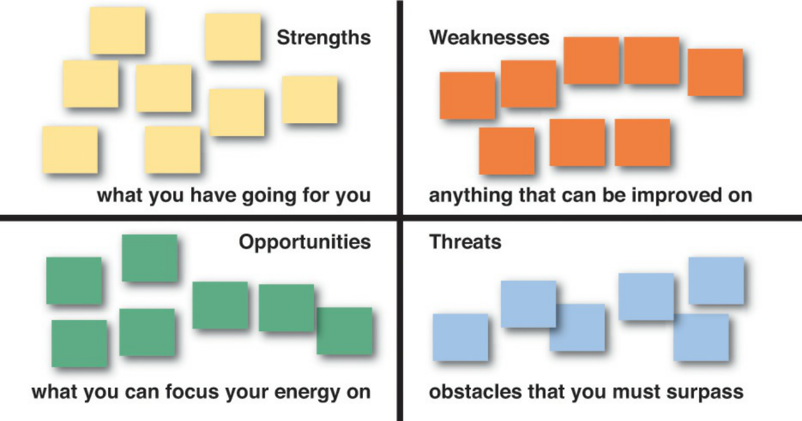


### **Use SWOT Analysis** 

In case you are unfamiliar with SWOT analysis [SWOT] , it stands for Strengths, Weaknesses, Opportunities, and Threats. SWOT analysis is a way for you to think about your project in very specific ways, gaining maximum knowledge as early as possible. Here are the basic ideas behind what you are looking to identify on a project: 

- _Strengths:_ characteristics of the business or project that give it an advantage over others 

- _Weaknesses:_ characteristics that place the business or project at a disadvantage relative to others 

- _Opportunities:_ elements that the project could exploit to its advantage 

- _Threats:_ elements in the environment that could cause trouble for the business or project 

At any time on any Scrum or other agile project you should feel free and inclined to use SWOT analysis to determine your project’s current situation: 

**1.** Draw a large matrix with four quadrants. 

**2.** Going back to the sticky notes, choose a different color for each of the four SWOT quadrants. 

**3.** Now, identity the Strengths of your project, the Weaknesses of your project, the Opportunities on your project, and the Threats to your project. 

**4.** Write these on the sticky notes and place them in the matrix within the appropriate quadrant. 

**5.** Use these SWOT characteristics of the project (we are particularly thinking domain model here) to plan what you are going to do about them. The next steps you take to promote the good areas and mitigate the troublesome areas could be critical to your success. 

You will have the opportunity to place these actions on the task board as you perform project planning, as discussed later. 


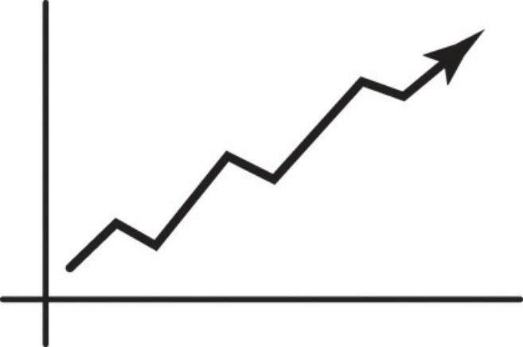


### **Modeling Spikes and Modeling Debt** 

Does it surprise you to learn that you can have modeling spikes and modeling debt to pay on a DDD project? 

One of the best things you can do at the inception of a project is to use _Event Storming_ . This and related modeling experiments would constitute a modeling spike. You will have to “buy” knowledge about your Scrum product, and sometimes the payment is a spike, and a spike during project inception is almost certain. Still, I have already shown you how using _Event Storming_ can greatly reduce the cost of necessary investment. 

For certain, you can’t expect to model your domain perfectly from the start, even if you think in terms of the inception of your project as having a valuable modeling spike. You won’t even be perfect as you use _Event Storming_ . For one thing, business and our understanding of it change over time, and so will your domain model. 

Furthermore, if you intend to timebox your modeling efforts as tasks on a task board, expect to incur some modeling debt during each sprint (or iteration, or WIP). You simply won’t have time to carry out every desired modeling task to perfection when you are timeboxed. For one thing, you will start a design and realize after experimentation that the design you have does not fit the business needs as well as you expected. Yet the time limit that you are under will require you to move on. 

The worst thing you could do now is to just forget everything that you learned from the modeling efforts that called out for a different, improved design. Rather, make a note that this needs to go into a later sprint (or iteration, WIP). This can be brought to your retrospective meeting<sup><u>1</u></sup> and turned in as a new task at your next sprint planning meeting (or iteration planning meeting, or added to the Kanban queue). 

**<u>1</u> .** In Kanban you can actually have retrospectives every day, so don’t wait for long to present the need to improve the model. 


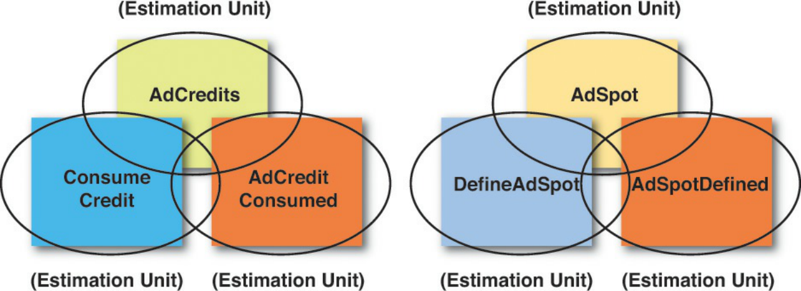


### **Identifying Tasks and Estimating Effort** 

_Event Storming_ is a tool that can be used at any time, not just during project inception. As you work in an _Event Storming_ session, you will naturally create a number of artifacts. Each of the _Domain Events_ , _Commands_ , and _Aggregates_ that you storm out in your paper model can be used as estimation units. How so? 


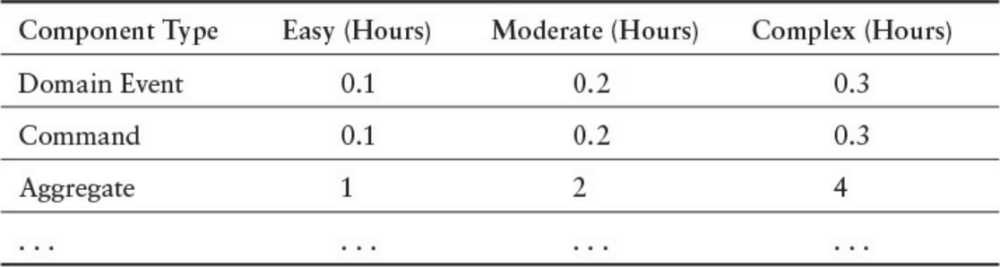


One of the easiest and most accurate ways to estimate is by using a metrics-based approach. As you see here, create a simple table with estimation units for each component type that you will need to implement. This will take the guesswork out of estimates and provide science around the process of creating estimations of effort. Here is how the table works: 

**1.** Create one column for _Component Type_ to describe the specific kind of component for which the estimation units are defined. 

**2.** Create three other columns, one each for _Easy_ , _Moderate_ , and _Complex._ These columns will reflect the estimation unit, which is in hours or fractions of hours, for the specific unit type. 

**3.** Now create one row for each component type in your architecture. Shown are _Domain Event_ , _Command_ , and _Aggregate_ types. However, don’t limit yourself to those. Create a row for the 

various user interface components, services, persistence, _Domain Event_ serializers and deserializers, and so on. Feel free to create a row for every single kind of artifact that you will create in source code. (If, for example, you normally create a _Domain Event_ serializer and deserializer along with each _Domain Event_ as a composite step, assign an estimation value to _Domain Events_ that reflects the creation of all of those components together in each column.) 

**4.** Now fill in the hours or fraction of an hour needed for each level of complexity: easy, moderate, and complex. These estimates not only include the time needed for implementation but may also include further design and testing efforts. Make these accurate, and be realistic. 

**5.** When you know the backlog item tasks (WIP) that you will work on, obtain a metric for each of the tasks and identify it clearly. You might use a spreadsheet for this. 

**6.** Add up all the estimation units for all components in the current sprint (iteration or WIP), and this becomes your total estimation. 

As you execute each sprint (iteration or WIP), tune your metrics to reflect the hours or fractions of hours that were actually required. 

If you are using Scrum and you have come to detest hour estimates, understand that this approach is much more forgiving and also much more accurate. As you learn your cadence, you will fine-tune your estimation metrics to be more accurate and realistic. It might require a few sprints to get it right. Also realize that as time and experience progress, you will probably either tune your numbers lower or use the _Easy_ or _Moderate_ columns more readily. 

If you are using Kanban and you think that estimates are completely fallacious and unnecessary, ask yourself a question: How do I know how to determine an accurate WIP in the first place in order to correctly limit our work queue? Regardless of what you may think, you are still estimating the effort involved and hoping that it is correct. Why not add a little science to the process and use this simple and accurate estimation approach? 

#### **A Comment on Accuracy** 

This approach works. On one large corporate program the organization demanded estimates for a large and complex project within the overall program. Two teams were assigned to this task. First there was a team of high-cost consultants who worked with Fortune 500 companies to estimate and manage projects. They were accountants and had doctorates and were outfitted with everything that would both intimidate and give them the clear advantage. The second team of architects and developers was empowered with this metrics-based estimation process. The project was in the $20 million range, and in the end when both estimates came in, they were within approximately $200,000 of each other (the technical team’s being the slightly lower estimate). Not bad for techies. 

You should be able to get within 20% accuracy on long-term estimates, and much better on shorter-term estimates, such as for sprints, iterations, and WIP queues. 


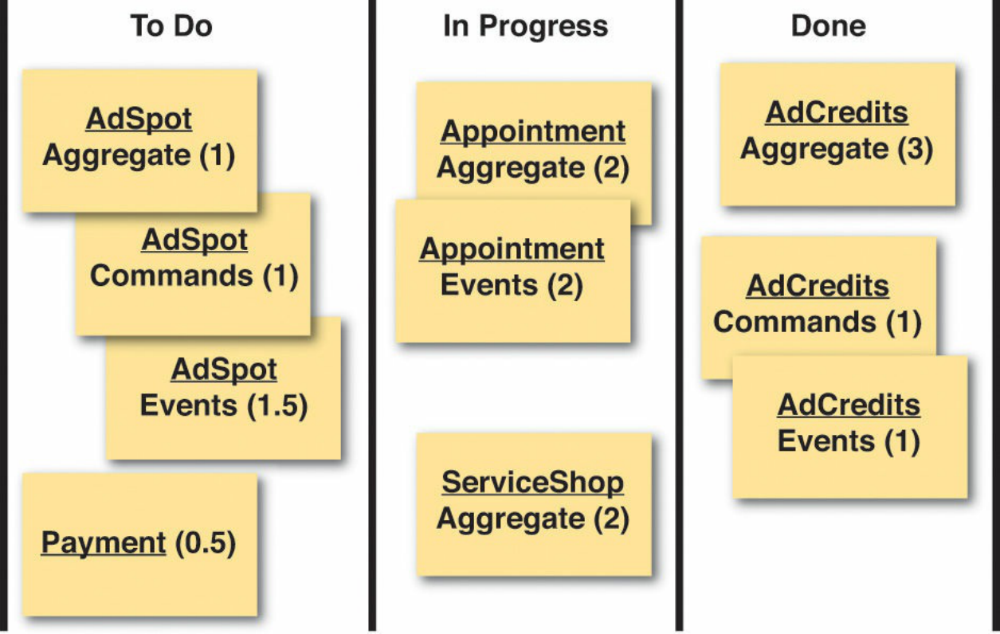


### **Timeboxed Modeling** 

Now that you have estimates for each component type, you can base your tasks directly off of those components. You might choose to keep each component as a single task with a number of hours or fraction thereof, or you might choose to break your tasks down a bit further. However, I suggest being careful with breaking tasks down to be too fine-grained, so as not to make the task board overly complex. As shown previously, it might even be best to combine all of the _Commands_ and all of the _Domain Events_ used by a single _Aggregate_ into a single task. 


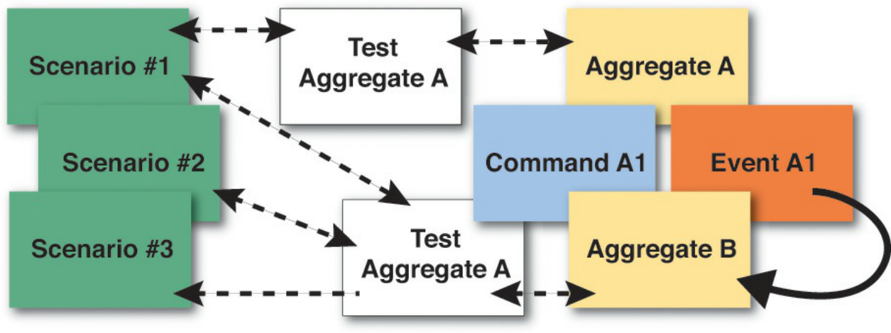


### **How to Implement** 

Even with artifacts identified by _Event Storming_ , you will not necessarily have all the knowledge you need to work on a specific domain scenario, story, and use case. If more is needed, be sure to include time for further knowledge acquisition in your estimates. But time for what? Recall that in <u>Chapter 2</u> I introduced you to creating concrete scenarios around your domain model. This can be one of the best ways to acquire knowledge about your _Core Domain_ , beyond what you can get out of _Event Storming._ Concrete scenarios and _Event Storming_ are two tools that should be used together. Here’s how it works: 

- Perform a quick session of _Event Storming_ , perhaps just for an hour or so. You will almost certainly discover that you need to develop more concrete scenarios around some of your quick modeling discoveries. 

- Partner with a _Domain Expert_ to discuss one or more concrete scenarios that need to be refined. This identifies how the software model will be used. Again, these are not just procedures but should be stated with the goal of identifying actual domain model elements (e.g., as 

- objects), how the elements collaborate, and how they interact with users. (Refer to Chapter 2 needed.) 

- Create a set of acceptance tests (or executable specifications) that exercise each of the scenarios. (Refer to <u>Chapter 2</u> as needed.) 

- Create the components to allow the tests/specifications to execute. Iterate (briefly and quickly) as you refine the tests/specifications and the components until they do what your _Domain Expert_ expects. 

• Very likely some of the iteration (brief and quick) will cause you to consider other scenarios, create additional tests/specifications, and refine existing and create new components. Continue this until you have acquired all the knowledge necessary to meet a limited business objective, or until your timebox expires. If you haven’t reached the desired point, make sure to incur modeling debt so that this can be addressed in the (ideally near) future. 

Yet how much time will you need from _Domain Experts_ ? 


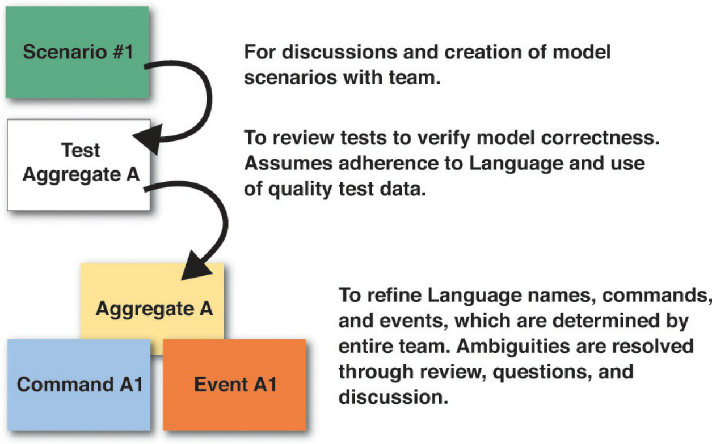


### **Interacting with Domain Experts** 

One of the major challenges of employing DDD is getting time with _Domain Experts_ , and without overdoing it. Many times those who are _Domain Experts_ on a project will have loads of other responsibilities, hours of meetings, and possibly travel. With such potential absences from the modeling environment, it can be difficult to find enough time with them. So, we had better make the time we use count and limit it to just what is necessary. Unless you make modeling sessions fun and efficient, you stand a good chance of losing their help at just the wrong time. If they find it valuable, enlightening, and rewarding, you will likely establish the strong partnership that you will need. 

So the first questions to answer are “When do we need time with _Domain Experts_ ? What tasks do they need to help us perform?” 

- Always include _Domain Experts_ in _Event Storming_ activities. Developers will always have a lot of questions, and _Domain Experts_ will have the answers. Make sure they are in the _Event Storming_ sessions together. 

- You will need _Domain Experts’_ input on discussions and the creation of model scenarios. See <u>Chapter 2</u> for examples. 

- _Domain Experts_ will be needed to review tests to verify model correctness. This assumes that the developers have already made a conscientious effort to adhere to the _Ubiquitous Language_ and to use quality, realistic test data. 

- You will need _Domain Experts_ to refine the _Ubiquitous Language_ and its _Aggregate_ names, _Commands_ , and _Domain Events_ , which are determined by the entire team. Ambiguities are resolved through review, questions, and discussion. Even so, _Event Storming_ sessions should 

have already resolved most of the questions about the _Ubiquitous Language._ 

So, now that you know what you will need from _Domain Experts_ , how much time should you require of them for each of these responsibilities? 

- _Event Storming_ sessions should be limited to a few hours (two or three) each. You may need to hold sessions on consecutive days, such as for three or four days. 

- Block out generous amounts of time for scenario discussion and refinement, but try to maximize the time for each scenario. You should be able to discuss and iterate on one scenario over perhaps 10 to 20 minutes of time. 

- For tests, you will need some time with _Domain Experts_ to review what you have written. But don’t expect them to sit there as you write the code. Maybe they will, and that’s a bonus, but don’t expect it. Accurate models require less time to review and verify. Don’t underestimate the ability of _Domain Experts_ to read through a test with your help. They can do it, especially if the test data is realistic. Your tests should allow the _Domain Expert_ to understand and verify around one test every one to two minutes, or thereabouts. 

- During test reviews, _Domain Experts_ can provide input on _Aggregates_ , _Commands_ , and _Domain Events_ , and perhaps other artifacts, as to how they adhere to the _Ubiquitous Language._ This can be accomplished in brief amounts of time. 

This guidance should help you use just the right amount of time with _Domain Experts_ , and to limit the amount of time that you need to spend with them. 

### **Summary** 

In summary, in this chapter you learned: 

- About _Event Storming_ , how it can be used, and how to perform sessions with your team, all with a view to accelerating your modeling efforts 

- About other tools that can be used along with _Event Storming_ 

- How to use DDD on a project and how to manage estimates and the time you need with _Domain Experts_ 

For an exhaustive reference covering the implementation of DDD on projects, see _Implementing_ . _Domain-Driven Design_ <u>[IDDD]</u> 

## **References** 

[BDD] North, Dan. “Behavior-Driven Development.” 2006. . <u>http://dannorth.net/introducing-bdd/</u> 

[Causal] Lloyd, Wyatt, Michael J. Freedman, Michael Kaminsky, and David G. Andersen. “Don’t Settle for Eventual Consistency: Stronger Properties for Low-Latency Geo-replicated Storage.” . <u>http://queue.acm.org/detail.cfm?id=2610533</u> 

[DDD] Evans, Eric. _Domain-Driven Design: Tackling Complexity in the Heart of Software._ Boston: Addison-Wesley, 2004. 

[Essential Scrum] Rubin, Kenneth S. _Essential Scrum: A Practical Guide to the Most Popular Agile Process._ Boston: Addison-Wesley, 2012. 

[IDDD] Vernon, Vaughn. _Implementing Domain-Driven Design._ Boston: Addison-Wesley, 2013. 

[Impact Mapping] Adzic, Gojko. _Impact Mapping: Making a Big Impact with Software Products and Projects._ Provoking Thoughts, 2012. 

[Microservices] Newman, Sam. _Building Microservices._ Sebastopol, CA: O’Reilly Media, 2015. 

[Reactive] Vernon, Vaughn. _Reactive Messaging Patterns with the Actor Model: Applications and Integration in Scala and Akka._ Boston: Addison-Wesley, 2015. 

[RiP] Webber, Jim, Savas Parastatidis, and Ian Robinson. _REST in Practice: Hypermedia and Systems Architecture._ Sebastopol, CA: O’Reilly Media, 2010. 

[Specification] Adzic, Gojko. _Specification by Example: How Successful Teams Deliver the Right Software._ Manning Publications, 2011. 

[SRP] Wikipedia. “Single Responsibility Principle.” 

. <u>http://en.wikipedia.org/wiki/Single_responsibility_principle</u> 

[SWOT] Wikipedia. “SWOT Analysis.” 

. <u>https://en.wikipedia.org/wiki/SWOT_analysis</u> 

[User Story Mapping] Patton, Jeff. _User Story Mapping: Discover the Whole Story, Build the Right Product._ Sebastopol, CA: O’Reilly Media, 2014. 

[WSJ] Andreessen, Marc. “Why Software Is Eating the World.” _Wall Street Journal_ , August 20, 2011. 

[Ziobrando] Brandolini, Alberto. “Introducing EventStorming.” . <u>https://leanpub.com/introducing_eventstorming</u> 

## **Index** 

### **A** 

Abstractions modeling Aggregates, 93 –95 software design problems, 5 Acceleration and management tools Event Storming, 112 –124 managing DDD projects. _See_ <u>Managing DDD on Agile Project</u> other tools, 124 overview of, 111 –112 summary, 136 Acceptance tests implementing DDD on Agile Project, 134 using with Event Storming, 124 validating domain model, 39 –40 Accuracy, managing in project, 130 –131 Actor model caching Aggregates' state, 109 handling transactions, 78 using with DDD, 43 Adapters, 41 –42 Aggregate Root, defined, 77 Aggregates associating with Commands, 120 –122 choosing abstractions carefully, 93 –95 creating Big Ball of Mud via, 59 designing as testable units, 97 –98 Domain Experts refining, 134 –136 Event Sourcing Domain Events for, 107 –109 identifying tasks/estimating effort, 129 –131 integrating using messaging, 65 –70 modeling, 88 –93 overview, 75 right-sizing, 95 –97 scenario using, 104 –105 summary, 98 in tactical design, 8 –9 transactions and, 78 –81 why they are used, 76 –78 Aggregates, design rules 

commit one instance in one transaction, <u>79</u> –81 protect business invariants within boundaries, <u>82</u> reference by identity only, <u>84</u> –85 small size, 83 –84 update with eventual consistency, <u>85</u> –88 Agile Project Management Context and Context Mapping, <u>52</u> modeling abstractions for Aggregates, <u>93</u> –5 moving concepts to other Bounded Contexts, <u>51</u> Anemic Domain Model, avoiding in Aggregates, <u>88</u> –89 , <u>92</u> Anticorruption Layer Context Mapping, <u>56</u> –57 integrating with Big Ball of Mud via, 60 in Open Host Service, 57 RPC with SOAP using, <u>62</u> Application Services Bounded Contexts architecture, <u>42</u> modeling Aggregates, <u>89</u> Architecture, Bounded Contexts, <u>41</u> –43 Arrowheads, in Event Storming, <u>123</u> Asynchronous messaging, <u>65</u> –70 At-Least-Once Delivery, messaging pattern, 68 –69 Atomic database transactions, <u>78</u> –79 

### **B** 

Bad design, in software development, <u>3</u> –7 Behavior-Driven Development (BDD), Ubiquitous Language, <u>39</u> Big Ball of Mud case study, 21 –24 Context Mapping and, <u>59</u> –60 turning new software into, <u>17</u> using business experts to avoid, 18 –20 using Subdomains for legacy systems, <u>48</u> –49 Big-picture Event Storming, 114 Black marker pens, for Event Storming, 115 , 122 –123 _Book Design: A Practical Introduction_ (Martin), <u>5</u> –6 Boundaries, Aggregate design steps for right-sizing, <u>95</u> –97 protecting business invariants within, 82 transactional consistency and, <u>78</u> –81 Bounded Contexts 

aligning with single Subdomain, <u>49</u> –50 architectural components of, <u>41</u> –43 case study, <u>21</u> –24 drawing boundaries in Event Storming, 122 –124 Context Mapping between. _See_ <u>Context Mapping</u> as fundamental strategic design tool, <u>25</u> –29 modeling business policies into separate, <u>20</u> showing flow on modeling surface in Event Storming, 122 –123 in strategic design, <u>7</u> –8 Subdomains in. _See_ <u>Subdomains</u> in tactical design, <u>9</u> teams and source code repositories for, <u>14</u> understanding, <u>11</u> –14 Brandolini, Alberto, <u>112</u> –113 Business Aggregate boundaries protecting invariants of, <u>82</u> , <u>95</u> –96 Domain Expert focus on, 17 –20 , <u>27</u> –29 Event Storming focus on, 113 Event Storming process via Domain Events, <u>116</u> –118 eventual consistency driven by, <u>97</u> focus on complexity of, 29 leaking logic when modeling Aggregates, <u>89</u> software design vs. purposes of, 4 –5 Subdomains within domains of, 46 unit testing vs. validating specifications for, <u>97</u> –98 

**C** Caching, Aggregate performance, <u>109</u> Causal consistency, Domain Events for, <u>99</u> –100 Challenge, <u>29</u> Claims, <u>19</u> –20 , 70 –73 Classes, <u>90</u> –94 Collaboration Context challenging/unifying mental models, <u>33</u> and Context Mapping, 52 Command Message, <u>67</u> Command Query Responsibility Segregation (CQRS), 43 , <u>109</u> Commands, Event Storming associate Entity/Aggregate to, 120 –122 causing Domain Events, <u>118</u> –120 Domain Events vs., 107 

identifying tasks/estimating effort, <u>129</u> –131 using Domain Experts to refine, <u>134</u> –136 Complex behavior, modeling Aggregates, <u>93</u> Complexity, Domain-Driven Design reducing, <u>2</u> –3 Conformist Context Mapping, <u>56</u> Domain Event consumers and, <u>67</u> in Open Host Service, 57 RESTful HTTP mistakes and, <u>64</u> Context Mapping defined, <u>52</u> example in, 70 –73 making good use of, 60 –61 overview of, 51 –53 in problem space, <u>12</u> strategic design with, <u>8</u> summary, <u>73</u> using messaging, <u>65</u> –70 using RESTful HTTP, <u>63</u> –65 using RPC with SOAP, <u>61</u> –63 Context Mapping, types of Anticorruption Layer, <u>56</u> –57 Big Ball of Mud, <u>59</u> –60 Conformist, 56 Customer-Supplier, 55 –56 Open Host Service, 57 Partnership, <u>54</u> Published Language, <u>58</u> Separate Ways, <u>58</u> Shared Kernel, <u>55</u> Core concepts Bounded Contexts for, <u>25</u> –26 case study, <u>21</u> –24 Core Domain challenging/unifying mental models to create, 29 –34 and Context Mapping, 52 dealing with complexity, 47 –50 defined, <u>12</u> developing Ubiquitous Language, <u>34</u> –41 Event Sourcing saving record of occurrences in, <u>109</u> Event Storming to understand, <u>113</u> –114 

solution space implementing, 12 as type of Subdomain within project, 46 –47 Ubiquitous Language maintenance vs., 41 understanding, 13 Cost Event Storming advantages, 113 false economy of no design, <u>5</u> software design vs. affordable, <u>4</u> –5 Could computing, using with DDD, 43 Coupled services, software design vs. strongly, <u>5</u> CQRS (Command Query Responsibility Segregation), <u>43</u> , 109 Customer-Supplier Context Mapping, 55 –56 **D** Database atomic transactions, <u>78</u> –79 software design and, 4 –5 DDD (Domain-Driven Design) complexity of, <u>2</u> –3 good, bad and effective design, 3 –7 learning process and refining knowledge, <u>9</u> –10 managing. _See_ <u>Managing DDD on Agile Project</u> overview of, <u>1</u> –2 strategic design, <u>7</u> –8 tactical design, 8 –9 DELETE operation, RESTful HTTP, 63 –65 Design-level modeling, Event Storming, <u>114</u> Diagrams, 36 Domain Events Context Mapping example, 70 –73 creating interface, <u>101</u> enriching with additional data, <u>104</u> Event Sourcing and, 107 –109 going asynchronous with REST, <u>65</u> in messaging, <u>65</u> –70 naming types of, <u>101</u> –102 properties, 103 –104 scenario using, 104 –107 summary, 109 –110 in tactical design, <u>9</u> , <u>99</u> –100 Domain Events, Event Storming 

associate Entity/Aggregate to Command, 120 –122 create Commands causing, 118 –120 creating for business process, <u>116</u> –118 identifying tasks/estimating effort, <u>129</u> –131 identifying views/roles for users, 123 –124 showing flow on modeling surface, <u>122</u> –123 using Domain Experts to refine, <u>134</u> –136 Domain Experts business drivers and, 17 –20 developing Ubiquitous Language as scenarios, <u>35</u> –41 focus on business complexity, 28 identifying core concepts, 26 –29 implementing DDD on Agile Project, 133 –134 interacting with, <u>134</u> –136 modeling abstractions for Aggregates, <u>93</u> –95 for one or more Subdomains, 46 in rapid design. _See_ <u>Event Storming</u> right-sizing Aggregates, 95 –96 Scrum, <u>27</u> in strategic design, 7 –8 

### **E** 

Effective design, <u>6</u> –7 Effort, estimating for Agile Project, 129 –131 Enrichment, Domain Event, 71 –72 Entities Aggregates composed of, 77 associating with Commands, 120 –122 defined, 76 implementing Aggregate design, <u>90</u> –91 right-sizing Aggregates, 95 Value Objects describing/quantifying, 77 Estimates managing tasks in Agile Project, 129 –131 timeboxed modeling of tasks via, 132 –134 Event-driven architecture, with DDD, <u>42</u> , 112 –113 Event Sourcing in atomic database transactions, 78 –79 overlap between Event Storming and, <u>121</u> –122 persisting Domain Events for Aggregates, <u>107</u> –109 Event Storming 

advantages of, <u>113</u> –114 associate Entity/Aggregate to Command, 120 –122 Commands causing Domain Events, <u>118</u> –120 concrete scenarios, 35 Domain Events for business process, 116 –118 Domain Experts for, 134 event-driven modeling vs., 112 –113 identify tasks/estimate effort, 129 –131 identify views/roles for users, <u>123</u> –124 implement DDD on Agile Project, 133 –134 modeling spikes on DDD projects via, <u>129</u> other tools used with, 124 show flow on modeling surface, 122 –123 supplies needed for, 115 –116 Events, in Event Storming, 113 , <u>115</u> Eventual consistency right-sizing Aggregates, <u>97</u> updating Aggregates, <u>85</u> –88 working with, <u>88</u> working with scenarios, <u>38</u> 

### **F** 

Functional programming, modeling Aggregates, 89 

**G** 

Generic Subdomain, 47 GET operation Context Mapping example, 72 integration using RESTful HTTP, <u>63</u> –65 Globally unique identity, Aggregate design, <u>90</u> –91 Good design, software development, <u>3</u> –7 

### **I** 

IDDD Workshop, 3 Idempotent Receiver, messaging, 68 Impact Mapping, <u>124</u> _Implementing Domain-Driven Design (_ IDDD), Vaughn, 1 , 3 Input Adapters, Bounded Contexts architecture, 42 Inspections policy, 19 –20 Iterations accuracy of long-term estimates for, 131 identifying tasks/estimating effort, <u>130</u> 

implementing DDD on Agile Project, 134 incurring modeling debt during, 128 –129 as sprints, 126 

### **K** 

Knowledge, 9 –10 Knowledge acquisition, 4 –5 , 6 

**L** 

Language evolution of terminology in human, 15 Ubiquitous. _See_ <u>Ubiquitous Language</u> Latency in message exchange, 65 RESTful HTTP failures due to, 64 Learning process, refining knowledge in, <u>9</u> –10 Legacy systems, using Subdomains with, 47 –50 

### **M** 

Maintenance phase, Ubiquitous Language, 40 –41 Managing DDD on Agile Project accuracy and, 130 –131 Event Storming, <u>112</u> –124 hiring good people, 126 how to implement, 133 –134 identifying tasks/estimating effort, 129 –131 interacting with Domain Experts, 134 –136 modeling spikes/debt, 128 –129 other tools, 124 overview of, 125 –126 summary, 136 timeboxed modeling, 132 –134 using SWOT analysis, 127 –128 Martin, Douglas, 5 –6 Memory footprint, designing small Aggregates, 83 Messaging, 65 –70 Metrics-based approach, identify tasks/estimate effort, 129 –131 Microservices, using with DDD, 43 Modeling 

debt and spikes on DDD projects, 128 –129 development of roads and, 6 

overview of, 1 Modules, segregating Subdomains into, 50 

### **N** 

Naming of Aggregates, 91 –92 of Domain Event types, 101 –102 Domain Experts refining Aggregate, 134 –136 Root Entity of Aggregate, 78 Network providers, RESTful HTTP failures due to, 64 No Design, false economy of, 5 No Estimates approach, 125 Nouns, in Ubiquitous Language, 34 –36 

### **O** 

Object-oriented programming, Aggregates, 88 –89 , 91 –92 Open Host Service consuming Published Language, 58 Context Mapping, 57 RESTful HTTP using, <u>63</u> RPC with SOAP using, 62 Opportunities, identifying Agile Project, <u>127</u> –128 Output Adapters, Bounded Contexts architecture, 42 

### **P** 

Paper, conducting Event Storming on, <u>115</u> –116 Parallel processing, Event Storming of business process, 117 Partnership Context Mapping, 54 Performance, caching and snapshots for, 109 Persistence operations, software design vs., 5 Persistence store, Aggregates by identity for, 85 Pictures, in domain model development, 36 Policies business group, 18 –20 Context Mapping example of, <u>70</u> –73 segregating into Bounded Contexts, 20 Ports, using with DDD, 41 –42 POST operation, RESTful HTTP, 63 –65 Problem space Bounded Contexts in, 12 Event Storming advantages for, 114 overview of, 12 

using Subdomains for discussing, 47 Process, Event Storming of business, 117 Product owner, Scrum, 27 , 119 Properties, Domain Event, <u>103</u> –104 Published Language in Context Mapping, 58 integrating bounded contexts via, 67 RESTful HTTP using, 63 RPC with SOAP using, 62 PUT operation, RESTful HTTP, 63 –65 

### **Q** 

Query-back trade-offs, Domain Events, 71 –72 

### **R** 

Rapid design. _See_ <u>Event Storming</u> Reactive Model, using with DDD, 43 Reference by identity only, Aggregates, 84 –85 References, used in this book, 137 –138 Remote Procedure Calls (RPC) with SOAP, 61 –63 Representational State Transfer (REST), 43 , 65 Request-Response communications, messaging, 69 –70 REST in Practice (RIP), 63 –65 REST (Representational State Transfer), 43 , 65 RESTful HTTP, 63 –65 , <u>72</u> Roads, modeling of, 6 Robustness, RPC lacking, 62 Roles, identifying for users in Event Storming, 123 –124 Root Entity, Aggregate defined, 78 implementing Aggregate design, 90 –91 right-sizing, 95 RPC (Remote Procedure Calls) with SOAP, 61 –63 

### **S** 

Scenarios 

developing Ubiquitous Language as, 35 –38 implementing DDD on Agile Project, 133 –134 include Domain Experts in, 134 –136 putting to work, 38 –40 Scrum 

criticisms of, 125 –126 DDD Domain Expert vs. product owner in, <u>27</u> good, bad and effective design in, 3 –7 managing project. _See_ <u>Managing DDD on Agile Project</u> Semantic contextual boundaries, Bounded Contexts, 12 Separate Ways Context Mapping, <u>58</u> Service-Oriented Architecture (SOA), 43 Services, Open Host Service, 57 Shared Kernel Context Mapping, 55 Simple Object Access Protocol (SOAP), using RPC with, 61 –63 Single Responsibility Principle (SRP), Aggregates, 84 Size. _See_ <u>Boundaries, Aggregate</u> Snapshots, of Aggregate performance, 109 SOA (Service-Oriented Architecture), 43 SOAP (Simple Object Access Protocol), using RPC with, 61 –63 Software developers developing Ubiquitous Language as scenarios, 35 –41 Domain Experts vs., <u>26</u> –29 finding good, 126 rapid design for. _See_ <u>Event Storming</u> Solution space Bounded Contexts used in, 12 overview of, 12 segregating Subdomain in, <u>50</u> Source code repositories, for Bounded Contexts, <u>14</u> _Specification_ (Adzic), 124 Specification by Example, refining Ubiquitous Language, 39 Sprints accuracy of long-term estimates for, 131 identifying tasks/estimating effort, 130 incurring modeling debt during, 128 –129 SRP (Single Responsibility Principle), Aggregates, 84 Stakeholders, software design vs., 4 –5 Sticky notes, Event Storming 

associate Entity/Aggregate to Command, 121 –122 create Commands causing Domain Events, 118 –120 defined, <u>113</u> Domain Events for business process, 116 –117 identifying roles for users, 124 overview of, 115 –116 showing flow on modeling surface, 123 

Storage, referencing Aggregates by identity for, 85 Strategic design architectural components, 41 –43 Bounded Contexts in, 11 –17 case study, 21 –24 challenging assumptions/unifying mental models, 29 –34 with Context Mapping. _See_ <u>Context Mapping</u> Domain Experts and business drivers in, 17 –20 focus on business complexity, 28 fundamental need for, <u>25</u> –29 with Subdomains. _See_ <u>Subdomains</u> summary, 43 Ubiquitous Language in, 11 –17 , 34 –41 understanding, 7 –8 Strengths, identifying Agile Project, 127 –128 Subdomains for complexity, <u>47</u> –50 overview of, 45 –46 showing flow in Event Storming, 122 –123 strategic design with, 7 –8 summary, 50 types of, 46 –47 understanding, 46 Supplies, for Event Storming, 115 –116 Supporting Domain, 47 , 50 SWOT (Strengths, Weaknesses, Opportunities, and Threats) analysis, Agile Projects, 127 –128 

**T** Tactical design with Aggregates. _See_ <u>Aggregates</u> with Domain Events. _See_ <u>Domain Events</u> understanding, 8 –9 Taskboard shuffle project estimates/use of, <u>5</u> software design vs., 3 –4 tendency to design using, 126 Tasks identifying/estimating in Agile Project, 129 –131 timeboxed modeling of, 132 –133 Teams 

assigning to each Bounded Context, 14 

Conformist relationship between, 56 Context Mapping integrating, 53 Customer-Supplier relationship between, 55 –56 Event Storming advantages for, 113 –114 Partnership relationship between, 54 Shared Kernel relationship between, 55 Ubiquitous Language spoken within, 13 –14 Technology Context Mapping integrating, 53 keeping domain model free of, <u>42</u> modeling Aggregates, <u>90</u> software design vs., 4 –5 Testing as benefit of Bounded Contexts, 25 designing Aggregrates for, 97 –98 implementing DDD on Agile Project, 134 using Domain Experts in, 136 validating domain model, 39 –40 Threats, identifying Agile Project, 127 –128 Timeline control, Scrum for, 4 –5 Transactional consistency boundary, Aggregates, 78 –81 Transactions, Aggregates, 78 –81 , 83 –84 

**U** Ubiquitous Language advantages of Event Storming, 113 in Anticorruption Layer Context Mapping relationship, <u>56</u> –57 challenging/unifying mental models to create, 29 –34 in Conformist Context Mapping relationship, 56 for Core Domain, 46 –47 developing, 34 –41 developing by collaborative feedback loop, 29 as fundamental strategic design tool, 25 –29 maintenance phase of, 40 –41 modeling abstractions for Aggregates, 93 –95 modeling Aggregates, <u>93</u> naming Domain Event types, 101 –102 in strategic design, 7 understanding, 11 , <u>13</u> –14 using Domain Experts to refine, 134 –136 Ubiquitous Languages 

integrating different, 53 Separate Ways Context Mapping and, 58 translating with Published Languages, 58 UML (Unified Modeling Language), 90 , <u>112</u> –113 Unbounded legacy systems, complexity of, 48 Underwriting, Context Mapping example, 70 –73 Underwriting policy, <u>19</u> –20 Unit testing, 40 , <u>97</u> –98 Updates, Aggregate, 85 –88 , 96 –97 User interface, abstractions for Aggregates, 94 User role, Event Storming, 119 User Story Mapping, Event Storming, 124 _User Story Mapping_ (Patton), 124 

### **V** 

Value Objects, and Aggregates, 77 , 91 Views, for users in Event Storming, 123 –124 

### **W** 

Wall, conducting Event Storming on, <u>115</u> Weaknesses, identifying Agile Project, 127 –128 Whack-a-mole issues, Big Ball of Mud, 59 Who? in Ubiquitous Language development, 36 –38 Work in progress (WIP) 

accuracy of long-term estimates for, 131 identifying tasks/estimating effort, 130 incurring modeling debt during, 128 –129 sprints as, 126 

**Code Snippets** 


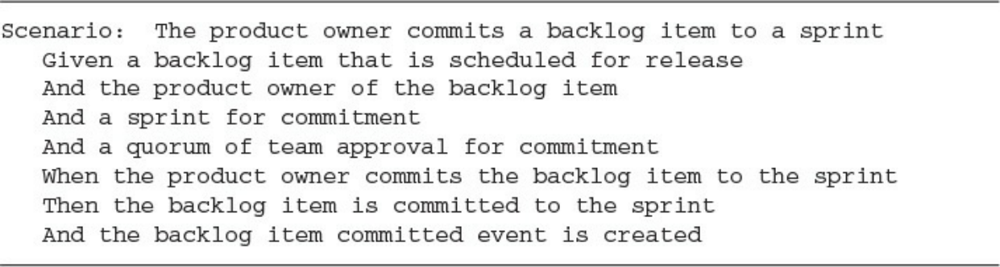


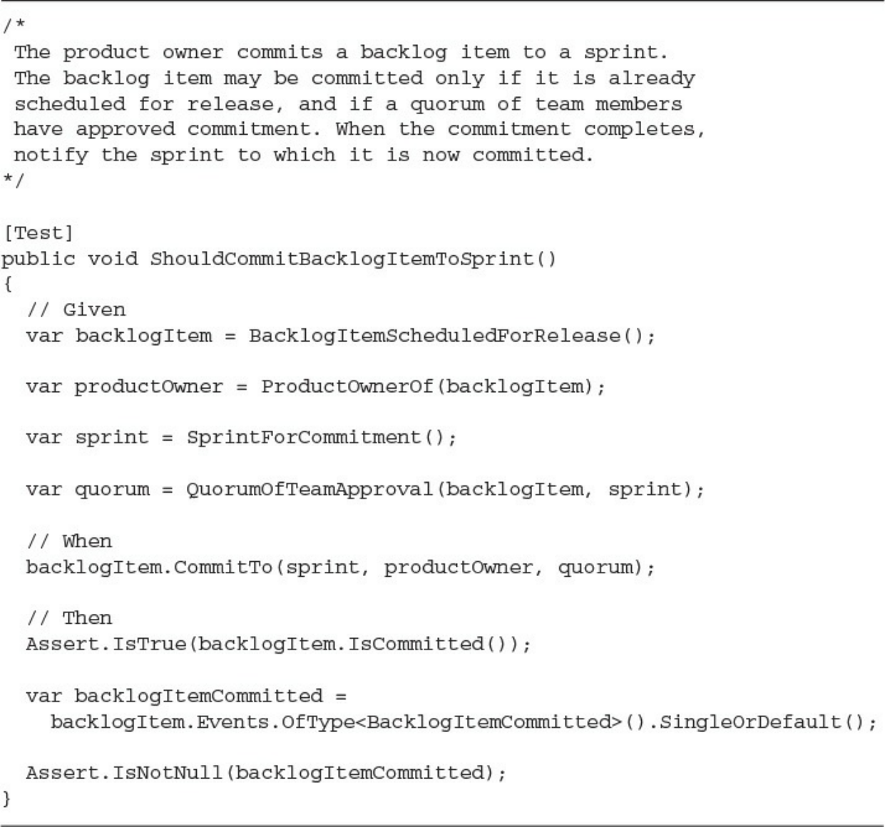


