# GUÍA DEL CUERPO DE CONOCIMIENTO DE SCRUM (GUÍA SBOK®)
## Quinta Edición (SBOK® Guide 5th Edition - Spanish)
### SCRUMstudy™ — A Brand of VMEdu, Inc.

---

> [!NOTE]
> **Edición Digital Completa en Markdown**  
> Extraída y estructurada directamente de la publicación oficial.  
> Incluye Principios de Scrum, Aspectos (Organización, Justificación del Negocio, Calidad, Cambio, Riesgo) y Fases (Inicio, Planificación y Estimación, Implementación, Revisión y Retrospectiva, Lanzamiento), además de Scrum para Proyectos Grandes y para la Empresa.

---

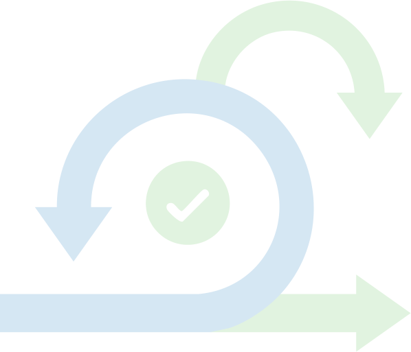

Una guía para el (Guía SBOK®) **CUERPO DE CONOCIMIENTO DE SCRUM** Quinta Edición 

**Una guía completa para implementar y escalar Scrum, con ejemplos prácticos** (Incluye información sobre cómo la Inteligencia Artificial puede mejorar los procesos de Scrum) 

**Una Guía del Cuerpo de Conocimientos de Scrum (Guía SBOK****®** **)** 

# **Quinta edición** 

(Incluye información sobre cómo la Inteligencia Artificial puede mejorar los procesos de Scrum) 

© 2025 SCRUMstudy™, una marca de VMEdu, Inc. Todos los derechos reservados. 

Información del catálogo de publicación de la Biblioteca del Congreso 

_Guía de los fundamentos de Scrum (Guía del SBOK__®_ _)_ – Quinta edición Título original en inglés _: A Guide to the Scrum Body of Knowledge (SBOK__®_ _Guide)_ – Quinta edición 

Incluye referencia bibliográfica e índice. ISBN: 978-098992520-4 

1. Scrum Framework. I. SCRUMstudy™. II. _SBOK__®_ _Guide_ 

2013950625 

ISBN: 978-0-9899252-0-4 

Publicado por: SCRUMstudy™, una marca de VMEdu, Inc. 12725 W. Indian School Road, Suite F-112 Avondale, Arizona 85392 USA Correo electrónico: sbok@scrumstudy.com; sbok@scrumstudy.com Sitio web: www.scrumstudy.com 

“SBOK”, el logotipo de SCRUMstudy, “SFC” “SDC”, “SMC”, “SAMC”, “SPOC”, “SSMC”, “SSPOC” y “ESMC” son marcas registradas de SCRUMstudy™ (una marca de VMEdu, Inc.) Para obtener una lista completa de las marcas SCRUMstudy™, póngase en contacto con el Departamento Jurídico de SCRUMstudy™. 

La _Guía de los fundamentos de Scrum (Guía del SBOK__®_ _)_ se ofrece para fines educativos. SCRUMstudy™ o VMEdu, Inc. no garantizan que sea adecuada para cualquier otro propósito; no se brinda una garantía expresa o implícita de ningún tipo, ni se asume responsabilidad por errores u omisiones. No se asume responsabilidad por daños incidentales o consecuentes en conexión que deriven de su uso o que surjan del uso de la información contenida en la guía. 

SCRUMstudy™ acepta correcciones y comentarios sobre sus libros. Envíe por favor sus comentarios sobre errores tipográficos, de formato o de otro tipo. Puede fotocopiar la página indicada, señalar el error y enviarla al domicilio antes mencionado o por correo electrónico a: support@scrumstudy.com. 

Se prohíbe la reproducción o transmisión parcial de cualquier tipo o por cualquier medio, ya sea electrónico, manual, de fotocopiado, grabación o cualquier sistema de almacenamiento y recuperación, sin la autorización previa por escrito de la editorial. 

10 9 8 7 6 5 4 3 2 

## **PREFACIO** 

A Guide to the Scrum Body of Knowledge (SBOK® Guide) proporciona pautas para la implementación exitosa de Scrum, el enfoque más popular de desarrollo de productos y entrega de proyectos Agile. Scrum, tal y como se define en la Guía SBOK® , es un marco de trabajo aplicable a carteras, programas o proyectos de cualquier tamaño o complejidad; y puede aplicarse de manera efectiva en cualquier industria para crear un producto, servicio o cualquier otro resultado. 

La Guía SBOK® se basa en el conocimiento y la visión combinados obtenidos de miles de proyectos en una variedad de organizaciones e industrias. Esta Quinta Edición se suma a las contribuciones colectivas de expertos en Scrum y entrega de proyectos. En particular, los comentarios de la comunidad global de Scrum jugaron un papel clave en la identificación de mejoras y adiciones a la Guía SBOK® . Su desarrollo ha sido realmente un esfuerzo de colaboración de un gran número de expertos y profesionales en una variedad de disciplinas. 

A diferencia de otros cuerpos de conocimiento o libros relacionados con Scrum, la Guía SBOK® es completamente gratuita y está respaldada por Scrumstudy.com, ofreciendo certificaciones, seminarios web, videos y guías de estudio gratuitos, ideales para cualquier profesional que busque una comprensión fundamental del Análisis de Negocios o explore una carrera en el campo. Además, la Guía SBOK® se centra en cuestiones de la vida real y problemas prácticos a los que se enfrentan los profesionales de Scrum y en cómo pueden abordarse utilizando herramientas modernas y Inteligencia Artificial (IA). 

La Guía SBOK® está bien organizada y es agradable de leer. A diferencia de la mayoría de los libros de Scrum, que tienden a ser demasiado simplistas o excesivamente detallados, lo que requiere que los lectores revisen todo el contenido para comprender los conceptos clave, la Guía SBOK® sigue la regla 80-20: el 80% de los conceptos básicos se pueden entender leyendo solo el 20% del libro. El contenido restante se puede consultar según sea necesario cuando se trata de tareas Scrum más complejas. 

La Guía SBOK® está destinada a ser utilizada como referencia y guía de conocimientos tanto por profesionales experimentados en Scrum como por otros profesionales del desarrollo de productos o servicios, así como por personas sin experiencia o conocimiento previo de Scrum o cualquier otro método de entrega de proyectos. 

Aunque la Guía SBOK® es una guía completa y un marco para la entrega de proyectos utilizando Scrum, sus contenidos están organizados para una fácil referencia, independientemente de los conocimientos previos del lector sobre el tema. Espero que cada lector aprenda de él y lo disfrute tanto como los muchos autores y revisores aprendieron y disfrutaron del proceso de recopilación del conocimiento colectivo y la sabiduría contenidos en él. 

<mark>Tridibesh Satpathy Autor principal de la</mark> _<mark>Guía del SBOK</mark>__®_ 

**TABLA DE CONTENIDO** 

##### **TABLA DE CONTENIDO** 

|1. INTRODUCCIÓN ...................................................................................................................................... 1|
|---|
|1.1 Visión general de Scrum................................................................................................................... 2|
|1.1.1 Breve historia de Scrum ........................................................................................................... 3|
|1.2 ¿Por qué usar Scrum? ...................................................................................................................... 4|
|1.2.1 Escalabilidad de Scrum ............................................................................................................ 5|
|1.3 Finalidad de la_Guía SBOK__®_............................................................................................................. 6|
|1.4 SBOK®vs. otros Scrum Libros o Cuerpos de Conocimiento ........................................................... 7|
|1.4.1 Descarga gratuita de SBOK®................................................................................................... 7|
|1.4.2 Certificaciones gratuitas, seminarios web, videos, guías de estudio....................................... 7|
|1.4.3 Práctico, contemporáneo y compatible con la IA ..................................................................... 7|
|1.4.4 Practica Scrum en la vida real con Vabro.ai ............................................................................ 7|
|1.4.5 Regla 80-20: (20% de SBOK®es suficiente) ........................................................................... 7|
|1.4.6 Fácil de organizar y divertido de leer ....................................................................................... 8|
|1.4.7 Aplicable a Organizaciones de Todos los Tamaños e Industrias ............................................ 8|
|1.4.8 Se alinea con otros marcos, incluido Kanban, OKR, DevOps, Análisis de Negocios ............. 8|
|1.4.9 Certificaciones Avanzadas para Senior Scrum Profesionales ................................................. 9|
|1.4.10 Disponible en 6 idiomas ........................................................................................................... 9|
|1.4.11 +2,500 socios en +50 países, +300,000 en grupo de LinkedIn ............................................... 9|
|1.5 En el marco de la_Guía SBOK__®_...................................................................................................... 10|
|1.5.1 Cómo usar el_Guía SBOK__®_? .................................................................................................. 11|
|1.5.2 Principios de Scrum ............................................................................................................... 11|
|1.5.3 Aspectos de Scrum ................................................................................................................ 13|
|1.5.4 Procesos Scrum ..................................................................................................................... 17|
|1.5.5 Scrum para grandes proyectos .............................................................................................. 21|
|1.5.6 Scrum para la empresa .......................................................................................................... 22|
|1.6 Scrum vs. Gestión de Proyectos Tradicional.................................................................................. 23|
|2. PRINCIPIOS ............................................................................................................................................ 25|
|2.1 Introducción .................................................................................................................................... 25|
|2.1.1 Guía de roles .......................................................................................................................... 26|
|2.2 Control de proceso empírico........................................................................................................... 27|
|2.2.1 Transparencia ........................................................................................................................ 27|

© 2025 SCRUMstudy™. _Una guía para el cuerpo de conocimiento de Scrum (Guía SBOK®)_ 

**I** 

**TABLA DE CONTENIDO** 

|2.2.|2 Inspección .............................................................................................................................. 29|
|---|---|
|2.2.|3 Adaptación ............................................................................................................................. 31|
|2.3|Autoorganización ............................................................................................................................ 34|
|2.3.|1 Beneficios de la autoorganización ......................................................................................... 34|
|2.4|Colaboración ................................................................................................................................... 37|
|2.4.|1 Beneficios de la colaboración en los proyectos de Scrum .................................................... 37|
|2.4.|2 La importancia de la coubicaciؚón en la colaboración ............................................................ 40|
|2.4.|3 Colaboración en equipos dispersos ....................................................................................... 40|
|2.4.|4 Herramienta de proyecto Scrum impulsada por IA ................................................................ 42|
|2.5|Priorización basada en valor .......................................................................................................... 47|
|2.6|Time-boxing .................................................................................................................................... 50|
|2.6.|1 Time-boxes de Scrum ............................................................................................................ 50|
|2.7|Desarrollo iterativo .......................................................................................................................... 54|
|2.8|Scrum vs. Gestión tradicional de proyectos ................................................................................... 56|
|3. OR|GANIZACIÓN..................................................................................................................................... 57|
|3.1|Introducción .................................................................................................................................... 57|
|3.1.|1 Guía de roles .......................................................................................................................... 58|
|3.2|Roles en un proyecto Scrum .......................................................................................................... 58|
|3.2.|1 Roles principales .................................................................................................................... 59|
|3.2.|2 Roles secundarios .................................................................................................................. 60|
|3.3|Product Owner ................................................................................................................................ 62|
|3.3.|1 La voz del cliente .................................................................................................................... 63|
|3.4|Scrum Master.................................................................................................................................. 64|
|3.5|Equipo Scrum ................................................................................................................................. 65|
|3.5.|1 Selección de personal ............................................................................................................ 66|
|3.5.|2 Tamaño del Equipo Scrum ..................................................................................................... 66|
|3.6|Scrum en proyectos, programas y portafolios ................................................................................ 67|
|3.6.|1 El funcionamiento de Scrum en un proyecto grande ............................................................. 67|
|3.6.|2 Roles principales adicionales en proyectos grandes ............................................................. 68|
|3.6.|3 El funcionamiento de Scrum en una empresa ....................................................................... 70|
|3.6.|4 Roles principales adicionales en una empresa ...................................................................... 71|
|3.6.|5 Ejemplos de proyectos, programas y portafolios ................................................................... 73|

**II** © 2025 SCRUMstudy™. _Una guía para el cuerpo de conocimiento de Scrum (Guía SBOK®_ 

**TABLA DE CONTENIDO** 

|3.7|Resumen de responsabilidades ..................................................................................................... 75|
|---|---|
|3.8|Scrum vs. Gestión tradicional de proyectos ................................................................................... 76|
|3.9|Teorías populares de recursos humanos y su relevancia en Scrum ............................................. 77|
|3.9.1|Modelo de dinámica de grupo de Tuckman ........................................................................... 77|
|3.9.2|Gestión de conflictos .............................................................................................................. 78|
|3.9.3|Técnicas de gestión de conflictos .......................................................................................... 78|
|3.9.4|Estilos de liderazgo ................................................................................................................ 79|
|3.9.5|Teoría de jerarquía de necesidades de Maslow .................................................................... 81|
|3.9.6|Teoría X, Teoría Y, Teoría Z .................................................................................................. 81|
|4. JUS|TIFICACIÓN DEL NEGOCIO ........................................................................................................... 83|
|4.1|Introducción .................................................................................................................................... 83|
|4.1.1|Guía de roles .......................................................................................................................... 84|
|4.2|Entrega basada en valor................................................................................................................. 85|
|4.2.1|Responsabilidades del Product Owner en la justificación del negocio .................................. 86|
|4.2.2|Responsabilidades de otros roles de Scrum en la justificación del negocio ......................... 87|
|4.3|La importancia de la justificación del negocio ................................................................................ 88|
|4.3.1|Factores para determinar la justificación del negocio ............................................................ 88|
|4.3.2|La justificación del negocio y el ciclo de vida del proyecto .................................................... 89|
|4.4|Técnicas de justificación del negocio ............................................................................................. 91|
|4.4.1|Estimación del valor del proyecto .......................................................................................... 91|
|4.4.2|Planificar según el valor ......................................................................................................... 92|
|4.4.3|Clasificación de priorización relativa ...................................................................................... 95|
|4.4.4|Mapeo de historias ................................................................................................................. 96|
|4.5|Justificación continua de valor ........................................................................................................ 97|
|4.5.1|Análisis del valor ganado (EVA) ............................................................................................. 97|
|4.5.2|Diagrama de flujo acumulado (CFD).................................................................................... 100|
|4.6|Confirmar la realización de beneficios .......................................................................................... 101|
|4.6.1|Prototipos, simulaciones y demostraciones ......................................................................... 101|
|4.7|Resumen de responsabilidades ................................................................................................... 102|
|4.8|Scrum vs. Gestión tradicional de proyectos ................................................................................. 103|
|5. CAL|IDAD ............................................................................................................................................... 105|
|5.1|Introducción .................................................................................................................................. 105|

© 2025 SCRUMstudy™. _Una guía para el cuerpo de conocimiento de Scrum (Guía SBOK®)_ 

**III** 

**TABLA DE CONTENIDO** 

|5.1.|1 Guía de roles ........................................................................................................................ 106|
|---|---|
|5.2|Definición de calidad ..................................................................................................................... 107|
|5.2.|1 Calidad y alcance ................................................................................................................. 107|
|5.2.|2 Calidad y valor del negocio .................................................................................................. 108|
|5.3|Criterios de aceptación y backlog priorizado del producto ........................................................... 109|
|5.3.|1 Redacción de criterios de aceptación .................................................................................. 110|
|5.3.|2 Definición de listo................................................................................................................. 111|
|5.3.|3 Definición de terminado (o criterios de terminado).............................................................. 112|
|5.3.|4 Criterios mínimos de terminado ........................................................................................... 114|
|5.3.|5 Aceptación o rechazo de elementos del backlog priorizado del producto ........................... 114|
|5.4|Gestión de calidad en Scrum ....................................................................................................... 116|
|5.4.|1 Planificación de calidad ........................................................................................................ 116|
|5.4.|2 Garantía de calidad y control de calidad .............................................................................. 118|
|5.4.|3 Ciclo de planificar, hacer, verificar y actuar (PDCA) ............................................................ 118|
|5.5|Resumen de responsabilidades ................................................................................................... 120|
|5.6|Scrum vs. Gestión tradicional de proyectos ................................................................................. 121|
|6. CA|MBIO ................................................................................................................................................ 123|
|6.1|Introducción .................................................................................................................................. 123|
|6.1.|1 Guía de roles ........................................................................................................................ 124|
|6.2|Información general ...................................................................................................................... 125|
|6.2.|1 Solicitudes de cambio aprobadas y no aprobadas .............................................................. 125|
|6.3|Cómo entender el cambio en Scrum ............................................................................................ 128|
|6.3.|1 El equilibrio entre la flexibilidad y la estabilidad ................................................................... 128|
|6.3.|2 Cómo incorporar la flexibilidad ............................................................................................. 128|
|6.4|Integración del cambio .................................................................................................................. 134|
|6.4.|1 Cambios a un sprint ............................................................................................................. 134|
|6.5|Cambio en portafolios y programas .............................................................................................. 139|
|6.5.|1 En programas ....................................................................................................................... 139|
|6.5.|2 En portafolios ....................................................................................................................... 139|
|6.6|Resumen de responsabilidades ................................................................................................... 141|
|6.7|Scrum vs. Gestión tradicional de proyectos ................................................................................. 142|
|7. RIE|SGO ................................................................................................................................................ 143|

**IV** © 2025 SCRUMstudy™. _Una guía para el cuerpo de conocimiento de Scrum (Guía SBOK®_ 

**TABLA DE CONTENIDO** 

|7.1 Introducción .................................................................................................................................. 143|
|---|
|7.1.1 Guía de roles ........................................................................................................................ 144|
|7.2 ¿Qué es un riesgo? ...................................................................................................................... 145|
|7.2.1 Diferencia entre riesgos y problemas................................................................................... 145|
|7.2.2 Actitud de riesgo ................................................................................................................... 145|
|7.3 Procedimiento de gestión de riesgos ........................................................................................... 147|
|7.3.1 Identificación de riesgos ....................................................................................................... 147|
|7.3.2 Evaluación de riesgos .......................................................................................................... 148|
|7.3.3 Priorización de riesgos ......................................................................................................... 151|
|7.3.4 Mitigación de riesgos............................................................................................................ 152|
|7.3.5 Comunicación de riesgos ..................................................................................................... 153|
|7.4 Minimizar riesgos por medio de Scrum ........................................................................................ 155|
|7.5 Riesgos en portafolios y programas ............................................................................................. 156|
|7.5.1 En el portafolio ..................................................................................................................... 156|
|7.5.2 En los programas ................................................................................................................. 156|
|7.6 Resumen de responsabilidades ................................................................................................... 158|
|7.7 Scrum vs. Gestión tradicional de proyectos ................................................................................. 159|
|8. INICIO ................................................................................................................................................... 161|
|8.1 Crear la visión del proyecto .......................................................................................................... 165|
|8.1.1 Entradas ............................................................................................................................... 167|
|8.1.2 Herramientas ........................................................................................................................ 168|
|8.1.3 Salidas .................................................................................................................................. 170|
|8.2 Identificar al Scrum Master y a los interesados del negocio ........................................................ 174|
|8.2.1 Entradas ............................................................................................................................... 176|
|8.2.2 Herramientas ........................................................................................................................ 177|
|8.2.3 Salidas .................................................................................................................................. 178|
|8.3 Formar el Equipo Scrum ............................................................................................................... 179|
|8.3.1 Entradas ............................................................................................................................... 180|
|8.3.2 Herramientas ........................................................................................................................ 182|
|8.3.3 Salidas .................................................................................................................................. 184|
|8.4 Desarrollar épicas ......................................................................................................................... 186|
|8.4.1 Entradas ............................................................................................................................... 187|

© 2025 SCRUMstudy™. _Una guía para el cuerpo de conocimiento de Scrum (Guía SBOK®)_ 

**V** 

**TABLA DE CONTENIDO** 

|8.4.2 Herramientas ........................................................................................................................ 189|
|---|
|8.4.3 Salidas .................................................................................................................................. 193|
|8.5 Crear el backlog priorizado del producto ...................................................................................... 195|
|8.5.1 Entradas ............................................................................................................................... 196|
|8.5.2 Herramientas ........................................................................................................................ 197|
|8.5.3 Salidas .................................................................................................................................. 201|
|8.6 Realizar la planificación de la liberación....................................................................................... 204|
|8.6.1 Entradas ............................................................................................................................... 205|
|8.6.2 Herramientas ........................................................................................................................ 206|
|8.6.3 Salidas .................................................................................................................................. 208|
|8.7 Diagrama de flujo de la fase de inicio ........................................................................................... 210|
|9. PLANIFICACIÓN Y ESTIMACIÓN ........................................................................................................ 211|
|9.1 Crear historias de usuario............................................................................................................. 215|
|9.1.1 Entradas ............................................................................................................................... 216|
|9.1.2 Herramientas ........................................................................................................................ 218|
|9.1.3 Salidas .................................................................................................................................. 220|
|9.2 Estimar historias de usuarios........................................................................................................ 222|
|9.2.1 Entradas ............................................................................................................................... 223|
|9.2.2 Herramientas ........................................................................................................................ 224|
|9.2.3 Salidas .................................................................................................................................. 228|
|9.3 Comprometer historias de usuario ............................................................................................... 229|
|9.3.1 Entradas ............................................................................................................................... 230|
|9.3.2 Herramientas ........................................................................................................................ 231|
|9.3.3 Salidas .................................................................................................................................. 232|
|9.4 Identificar tareas ........................................................................................................................... 234|
|9.4.1 Entradas ............................................................................................................................... 235|
|9.4.2 Herramientas ........................................................................................................................ 236|
|9.4.3 Salidas .................................................................................................................................. 238|
|9.5 Estimar tareas ............................................................................................................................... 240|
|9.5.1 Entradas ............................................................................................................................... 241|
|9.5.2 Herramientas ........................................................................................................................ 242|
|9.5.3 Salidas .................................................................................................................................. 244|

**VI** © 2025 SCRUMstudy™. _Una guía para el cuerpo de conocimiento de Scrum (Guía SBOK®_ 

**TABLA DE CONTENIDO** 

|9.6 Actualizar el backlog del sprint ..................................................................................................... 245|
|---|
|9.6.1 Entradas ............................................................................................................................... 246|
|9.6.2 Herramientas ........................................................................................................................ 247|
|9.6.3 Salidas .................................................................................................................................. 249|
|9.7 Diagrama de flujo de la fase de planificación y estimación .......................................................... 252|
|10. IMPLEMENTACIÓN .......................................................................................................................... 253|
|10.1 Crear entregables ......................................................................................................................... 257|
|10.1.1 Entradas ............................................................................................................................... 258|
|10.1.2 Herramientas ........................................................................................................................ 261|
|10.1.3 Salidas .................................................................................................................................. 262|
|10.2 Realizar el Daily Standup ............................................................................................................. 264|
|10.2.1 Entradas ............................................................................................................................... 265|
|10.2.2 Herramientas ........................................................................................................................ 266|
|10.2.3 Salidas .................................................................................................................................. 268|
|10.3 Refinar el backlog priorizado del producto ................................................................................... 271|
|10.3.1 Entradas ............................................................................................................................... 272|
|10.3.2 Herramientas ........................................................................................................................ 274|
|10.3.3 Salidas .................................................................................................................................. 275|
|10.4 Diagrama de flujo de la fase de implementación ......................................................................... 276|
|11. REVISIÓN Y RETROSPECTIVA ...................................................................................................... 277|
|11.1 Demostrar y validar el sprint ......................................................................................................... 280|
|11.1.1 Entradas ............................................................................................................................... 281|
|11.1.2 Herramientas ........................................................................................................................ 283|
|11.1.3 Salidas .................................................................................................................................. 284|
|11.2 Retrospectiva del sprint ................................................................................................................ 286|
|11.2.1 Entradas ............................................................................................................................... 287|
|11.2.2 Herramientas ........................................................................................................................ 288|
|11.2.3 Salidas .................................................................................................................................. 290|
|11.3 Diagrama de flujo de la fase de revisión y retrospectiva .............................................................. 292|
|12. LIBERACIÓN .................................................................................................................................... 293|
|12.1 Enviar entregables ........................................................................................................................ 296|
|12.1.1 Entradas ............................................................................................................................... 297|

© 2025 SCRUMstudy™. _Una guía para el cuerpo de conocimiento de Scrum (Guía SBOK®)_ 

**VII** 

**TABLA DE CONTENIDO** 

|12.1.2|Herramientas ........................................................................................................................ 298|
|---|---|
|12.1.3|Salidas .................................................................................................................................. 300|
|12.2 Ret|rospectiva de la liberación ...................................................................................................... 302|
|12.2.1|Entradas ............................................................................................................................... 303|
|12.2.2|Herramientas ........................................................................................................................ 304|
|12.2.3|Salidas .................................................................................................................................. 305|
|12.3 Dia|grama de flujo de la fase de liberación ................................................................................... 306|
|13. ESCA|LAMIENTO DE SCRUM EN GRANDES PROYECTOS ......................................................... 307|
|13.1 El i|mpacto de los grandes proyectos en los procesos fundamentales de Scrum ........................ 310|
|13.1.1|Inicio ..................................................................................................................................... 310|
|13.1.2|Planificación y estimación .................................................................................................... 317|
|13.1.3|Implementación .................................................................................................................... 320|
|13.1.4|Revisión y retrospectiva ....................................................................................................... 322|
|13.1.5|Liberación ............................................................................................................................. 325|
|13.2 Ent|radas y salidas adicionales para los grandes proyectos......................................................... 326|
|13.2.1|Organización de Scrum en los grandes proyectos .............................................................. 326|
|13.2.2|Plan de colaboración los Product Owners* .......................................................................... 326|
|13.2.3|Plan de colaboración de los Scrum Masters y los Equipos Scrum...................................... 326|
|13.2.4|Recursos compartidos* ........................................................................................................ 327|
|13.2.5|Especialización del equipo ................................................................................................... 327|
|13.2.6|Ambiente y cronograma de ambiente* ................................................................................. 328|
|13.2.7|Plan de preparación para la liberación* ............................................................................... 328|
|13.3 Her|ramientas adicionales para los grandes proyectos ................................................................ 329|
|13.3.1|Plan de comunicación para grandes proyectos ................................................................... 329|
|13.3.2|Planificación de recursos para grandes proyectos* ............................................................. 329|
|13.3.3|Identificación del ambiente* ................................................................................................. 330|
|13.3.4|Asignación del backlog priorizado del producto* ................................................................. 330|
|13.3.5|Reunión de Scrum de Scrums (SoS)*.................................................................................. 331|
|13.3.6|Métodos de preparación para la liberación* ........................................................................ 332|
|13.3.7|Sprint de preparación para la liberación .............................................................................. 332|
|13.3.8|Herramienta de proyecto Scrum impulsada por IA .............................................................. 332|
|14. ESCA|LAMIENTO DE SCRUM PARA LA EMPRESA....................................................................... 335|

**VIII** © 2025 SCRUMstudy™. _Una guía para el cuerpo de conocimiento de Scrum (Guía SBOK®_ 

**TABLA DE CONTENIDO** 

|14.1 El|impacto de programas o portafolios en los procesos fundamentales a nivel del proyecto...... 338|
|---|---|
|14.1.1|Inicio ..................................................................................................................................... 338|
|14.1.2|Planificación y estimación .................................................................................................... 341|
|14.1.3|Implementación .................................................................................................................... 341|
|14.1.4|Revisión y retrospectiva ....................................................................................................... 342|
|14.1.5|Liberación ............................................................................................................................. 343|
|14.2 Pr|ocesos adicionales para escalar Scrum en la empresa (programa o portafolio) ..................... 344|
|14.3 Cr|ear o actualizar los equipos del programa o portafolio ............................................................. 347|
|14.3.1|Entradas ............................................................................................................................... 348|
|14.3.2|Herramientas ........................................................................................................................ 349|
|14.3.3|Salidas .................................................................................................................................. 349|
|14.4 Cr|ear o actualizar los componentes del programa o portafolio .................................................... 351|
|14.4.1|Entradas ............................................................................................................................... 352|
|14.4.2|Herramientas ........................................................................................................................ 354|
|14.4.3|Salidas .................................................................................................................................. 356|
|14.5 Re|visar y actualizar el Scrum Guidance Body ............................................................................. 359|
|14.5.1|Entradas ............................................................................................................................... 359|
|14.5.2|Herramientas ........................................................................................................................ 360|
|14.5.3|Salidas .................................................................................................................................. 361|
|14.6 Cr|ear o refinar el backlog priorizado del programa o portafolio ................................................... 362|
|14.6.1|Entradas ............................................................................................................................... 363|
|14.6.2|Herramientas ........................................................................................................................ 365|
|14.6.3|Salidas .................................................................................................................................. 366|
|14.7 Cr|ear o actualizar las liberaciones del programa o portafolio ...................................................... 368|
|14.7.1|Entradas ............................................................................................................................... 369|
|14.7.2|Herramientas ........................................................................................................................ 370|
|14.7.3|Salidas .................................................................................................................................. 371|
|14.8 Re|trospectiva de las liberaciones del programa o portafolio........................................................ 372|
|14.8.1|Entradas ............................................................................................................................... 372|
|14.8.2|Herramientas ........................................................................................................................ 373|
|14.8.3|Salidas .................................................................................................................................. 374|
|APÉNDICE A|. INFORMACIÓN GENERAL SOBRE LA AGILIDAD .............................................................. 375|

© 2025 SCRUMstudy™. _Una guía para el cuerpo de conocimiento de Scrum (Guía SBOK®)_ 

**IX** 

**TABLA DE CONTENIDO** 

|APÉNDICE B. ACTUALIZACIONES EN LA QUINTA EDICIÓN ................................................................... 385|
|---|
|REFERENCIAS ............................................................................................................................................. 387|
|GLOSARIO .................................................................................................................................................... 389|
|ÍNDICE ........................................................................................................................................................... 427|

**X** © 2025 SCRUMstudy™. _Una guía para el cuerpo de conocimiento de Scrum (Guía SBOK®_ 

**LISTA DE FIGURAS** 

## **LISTA DE FIGURAS** 

**Figure 2-10: Facilitar la autoorganización a través del Scrumboard en una herramienta de proyecto Scrum** 

|**impulsada por IA (Fuente: Vabro) ................................................................................................................................... 36**|
|---|
|**Figure 2-13: Centro de mensajes en una herramienta de proyecto Scrum impulsada por IA (Fuente: Vabro) ............. 39**|
|**Figure 2-14: Vista de detalles de tareas para mejorar la colaboración (Fuente: Vabro) ................................................... 39**|
|**Figura 2-21: Scrum vs Cascada tradicional ............................................................................................................................. 55**|
|**Figura 3-1: Configuración de la organización (fuente: Vabro) .............................................................................................. 58**|
|**Figura 3-2: Composición del equipo (fuente: Airtable) .......................................................................................................... 59**|
|**Figura 4-1: Entrega de valor en Scrum vs. Proyectos tradicionales .................................................................................... 86**|
|**Figura 4-2: Jerarquía de responsabilidades en la justificación del negocio ...................................................................... 87**|
|**Figura 4-3: Justificación del negocio y el ciclo de vida del proyecto .................................................................................. 90**|
|**Figura 5-1: Diagrama de flujo del incremento del proyecto ................................................................................................ 110**|
|**Figura 5-2: Ejemplo de DoR presentado en una herramienta de proyecto Scrum impulsada por IA (Fuente: Vabro)**|

|**............................................................................................................................................................................................ 112** **Figura 5-3: : Ejemplo de DoD presentado en una herramienta de proyecto Scrum impulsada por IA (Fuente: Vabro)** **............................................................................................................................................................................................ 113**|
|---|
|**Figura 5-4: Proceso de aprobación de historias de usuario en una herramienta de proyecto Scrum impulsada por IA** **(Fuente: Vabro) ................................................................................................................................................................ 115**|
|**Figura 6-1: Ejemplo del proceso de aprobación de cambios .............................................................................................. 126**|
|**Figura 6-2: Actualización del backlog priorizado del producto con los cambios aprobados ........................................ 127**|
|**Figura 6-3: Características de Scrum para lograr flexibilidad............................................................................................. 129**|
|**Figura 6-4: Motivos de los interesados del negocio para la solicitud de cambios .......................................................... 130**|
|**Figura 6-5: Motivos del equipo principal de Scrum para la solicitud de cambios ........................................................... 131**|
|**Figura 6-6: Integración del cambio en Scrum ........................................................................................................................ 135**|
|**Figura 6-7: Impacto del cambio esperado en la duración del sprint .................................................................................. 136**|
|**Figura 6-8: Incorporación de cambios en portafolios y programas ................................................................................... 140**|
|**Figura 7-1: Ejemplo de árbol de probabilidad........................................................................................................................ 149**|
|**Figura 7-2: Ejemplo de un diagrama de Pareto ..................................................................................................................... 149**|
|**Figura 7-3: Ejemplo de matriz de probabilidad e impacto ................................................................................................... 150**|
|**Figura 7-4: Proceso de priorización de riesgos .................................................................................................................... 152**|
|**Figura 7-5: Ejemplo de un****_Risk Burndown Chart_ (gráfica de disminución de riesgos) .................................................. 154**|
|**Figura 8-1: Información general de la fase de inicio............................................................................................................. 163**|
|**Figura 8-2: Información general de la fase de inicio (fundamentales) ............................................................................... 164**|
|**Figura 8-3: Crear la visión del proyecto: entradas, herramientas y salidas ..................................................................... 165**|
|**Figura 8-4: Crear la visión del proyecto - Diagrama del flujo .............................................................................................. 166**|
|**Figura 8-5: El proceso del análisis de brecha........................................................................................................................ 169**|
|**Figura 8-6: Herramientas de proyecto Scrum – Vabro ......................................................................................................... 172**|
|**Figura 8-7: Herramientas de proyecto Scrum - Jira .............................................................................................................. 173**|
|**Figura 8-8: Identificar al Scrum Master y a los interesados del negocio: entradas, herramientas y salidas .............. 174**|
|**Figura 8-9: Identificar al Scrum Master y a los interesados del negocio: Diagrama de flujo ......................................... 175**|
|**Figura 8-10: Formar el Equipo Scrum: entradas, herramientas y salidas ......................................................................... 179**|
|**Figura 8-11: Formar el Equipo Scrum: Diagrama de flujo ................................................................................................... 180**|
|**Figura 8-12: Creación de un equipo (Fuente: Vabro)............................................................................................................ 183**|
|**Figura 8-13: Configuración del equipo (Fuente: Jira) ........................................................................................................... 184**|
|**Figura 8-14: Desarrollar épicas: entradas, herramientas y salidas .................................................................................... 186**|
|**Figura 8-15: Desarrollar épicas: Diagrama de flujo .............................................................................................................. 187**|
|**Figura 8-16: Ejemplo de herramienta de proyecto Scrum – Vabro..................................................................................... 192**|

**XII** © 2025 SCRUMstudy™. _Una guía para el cuerpo de conocimiento de Scrum (Guía SBOK®_ 

**LISTA DE FIGURAS** 

|**Figura 8-17: Ejemplo de herramienta de proyecto Scrum – Jira ........................................................................................ 192**|
|---|
|**Figura 8-18: Crear el backlog priorizado del producto: entradas, herramientas y salidas............................................. 195**|
|**Figura 8-20: Creación de un backlog de productos priorizados (fuente: Vabro) ............................................................. 200**|
|**Figura 8-21: Uso de la cartera de productos priorizada (fuente: Jira) ............................................................................... 201**|
|**Figura 8-24: Planificación de lanzamientos en Scrum (Fuente: Vabro) ............................................................................. 207**|
|**Figura 9-1: Información general de la fase de planificación y estimación ........................................................................ 213**|
|**Figura 9-2: Información general de la fase de planificación y estimación (fundamentales) .......................................... 214**|
|**Figura 9-3: Crear historias de usuario: entradas, herramientas y salidas ........................................................................ 215**|
|**Figura 9-4: Crear historias de usuario: diagrama de flujo ................................................................................................... 216**|
|**Figura 9-5: Adición de historias de usuario en el backlog de productos priorizados (fuente: Vabro) ......................... 219**|
|**Figura 9-6: Adición de historias de usuario en el backlog del producto (fuente: Jira) ................................................... 220**|
|**Figura 9-17: Creación de tareas en la herramienta de proyecto Scrum (fuente: Jira) ..................................................... 237**|
|**Figura 9-21: Estimación de tareas en Scrum (fuente: Vabro) ............................................................................................. 243**|
|**Figura 9-22: Uso de la herramienta Scrum para la estimación de tareas (fuente: Jira) .................................................. 244**|
|**Figura 9-25: Configuración del Sprint Backlog en Scrum (Fuente: Vabro) ....................................................................... 248**|
|**Figura 9-26: Uso del backlog de sprint en la herramienta de proyecto Scrum (fuente: Jira) ......................................... 249**|
|**Figura 10-1: Información general de la fase de implementación ........................................................................................ 255**|
|**Figura 10-2: Información general de la fase de implementación (fundamentales) .......................................................... 256**|
|**Figura 10-3: Crear entregables: entradas, herramientas y salidas..................................................................................... 257**|
|**Figura 10-4: Crear entregables: diagrama de flujo ............................................................................................................... 258**|
|**Figura 10-5: Scrumboard con tareas “Por hacer”, “En proceso” y “Terminada” ............................................................ 259**|
|**Figura 10-6: Realizar el Daily Standup: entradas, herramientas y salidas ........................................................................ 264**|
|**Figura 10-7: Realizar el Daily Standup: diagrama de flujo ................................................................................................... 265**|
|**Figura 10-8: Uso de Scrumboard (fuente: Vabro) ................................................................................................................. 268**|
|**Figura 10-9: Papel de Scrumboard en Scrum (Fuente: Jira) ............................................................................................... 269**|
|**Figura 10-12: Refinamiento del backlog de productos en Scrum (fuente: Vabro) ........................................................... 275**|
|**Figura 10-13: Refinamiento del backlog del producto en Scrum (fuente: Jira) ................................................................ 275**|
|**Figura 11-1: Información general de la fase de revisión y retrospectiva .......................................................................... 278**|
|**Figura 11-2: Información general de la fase de revisión y retrospectiva (fundamentales)............................................. 279**|
|**Figura 11-3: Demostrar y validar el sprint: entradas, herramientas y salidas .................................................................. 280**|
|**Figura 11-4: Demostrar y validar el sprint: diagrama de flujo ............................................................................................. 281**|
|**Figura 11-5: Revisión y aprobación de la historia de usuario (fuente: Vabro) ................................................................. 284**|
|**Figura 12-1: Información general de la fase de liberación ................................................................................................... 294**|
|**Figura 12-2: Información general de la fase de liberación (fundamentales) ..................................................................... 295**|
|**Figura 12-3: Enviar entregables: entradas, herramientas y salidas ................................................................................... 296**|
|**Figura 12-4: Enviar entregables: diagrama de flujo .............................................................................................................. 297**|
|**Figura 12-5: Gestión de lanzamientos en Scrum (fuente: Vabro) ....................................................................................... 299**|
|**Figura 12-6: Gestión de lanzamientos en Scrum (fuente: Jira) ........................................................................................... 300**|
|**Figura 13-1: Configuración de un proyecto grande (Fuente: Vabro) ................................................................................. 309**|
|**Figura 13-2: Inicio de un proyecto de gran envergadura (fuente: Vabro) ......................................................................... 310**|
|**Figura 13-3: Creación de una historia de usuario en la fase de planificación y estimación (fuente: Vabro)............... 317**|
|**Figura 13-4: Priorización de historias de usuario en la fase de implementación (fuente: Vabro) ................................. 320**|
|**Figura 14-1: Creación de una versión durante la iniciación (Fuente: Vabro) ................................................................... 341**|
|**Figura 14-2: Program Release Dashboard (Source: Vabro) ................................................................................................ 343**|

© 2025 SCRUMstudy™. _Una guía para el cuerpo de conocimiento de Scrum (Guía SBOK®)_ 

**XI** 

**LISTA DE TABLAS** 

## **LISTA DE TABLAS** 

|**Tabla 1-1: Resumen de los Procesos Fundamentales de Scrum ...........................................................................................18**|
|---|
|**Tabla 1-2: Reuniones y Procesos Scrum ...................................................................................................................................21**|
|**Tabla 1-3: Scrum vs. Gestión de Proyectos Tradicional ..........................................................................................................23**|
|**Tabla 2-1: Herramientas de IA comúnmente utilizadas en proyectos Scrum .......................................................................46**|
|**Tabla 3-1: Responsabilidades del Product Owner en los procesos de Scrum ....................................................................63**|
|**Tabla 3-2: Responsabilidades del Scrum Master en los procesos de Scrum ......................................................................65**|
|**Tabla 3-3: Responsabilidades del Equipo Scrum en los procesos de Scrum ......................................................................66**|
|**Tabla 3-4: Resumen de las responsabilidades pertinentes a la organización .....................................................................75**|
|**Tabla 4-1: Fórmulas del valor ganado.........................................................................................................................................98**|
|**Tabla 4-2: Resumen de las responsabilidades pertinentes a la justificación del negocio ...............................................102**|
|**Tabla 6-1: Resumen de responsabilidades pertinentes al cambio .......................................................................................141**|
|**Tabla 7-1: Resumen de las responsabilidades pertinentes a los riesgos ...........................................................................158**|
|**Tabla 13-1: El impacto de los grandes proyectos en los procesos fundamentales de Scrum: Fase de inicio .............316**|
|**Tabla 14-1: Impacto de un programa o portafolio en los procesos fundamentales de Scrum: Fase de inicio .............340**|

©2025 SCRUMstudy™. _Una guía para el cuerpo de conocimiento de Scrum (Guía SBOK®)_ 

**XIII** 

1 – INTRODUCCIÓN 

**1** 

## **1. INTRODUCCIÓN** 

_Una guía para el cuerpo de conocimiento de Scrum (_ _<mark>Guía SBOK</mark>__®_ _<mark>)</mark>_ proporciona pautas para la implementación exitosa de Scrum, el enfoque más popular de entrega de proyectos ágiles y desarrollo de productos. Proporciona un marco integral que incluye los principios, aspectos y procesos de Scrum. 

<mark>Scrum, tal y como se define en el</mark> _<mark>Guía SBOK</mark>__®_ <mark>, es aplicable a lo siguiente:</mark> 

- <mark>CarterasProgramasy/o proyectos en</mark> _<mark>cualquier</mark>_ <mark>industria</mark> 

- <mark>Productos, servicios o cualquier otro resultado que se entregue a las partes interesadas del negocio</mark> 

- <mark>Proyectos de cualquier tamaño o complejidad</mark> 

<mark>El término "producto"" en el</mark> _<mark>Guía SBOK</mark>__®_ <mark>puede referirse a un producto, servicio u otro entregable. Scrum se puede aplicar de manera efectiva a cualquier proyecto en cualquier industria, desde proyectos pequeños o equipos con tan solo seis miembros hasta proyectos grandes y complejos con hasta varios cientos de miembros en varios equipos.</mark> 

En este primer capítulo se describe el propósito y el marco de la _Guía SBOK__®_ e introduce los conceptos clave de Scrum. Contiene un resumen de los principios de Scrum, Aspectos de Scrum y procesos Scrum. El capítulo 2 amplía los seis principios de Scrum que son la base sobre la que se basa el marco de trabajo de Scrum. Los capítulos 3 a 7 profundizan en los cinco aspectos de Scrum que deben abordarse a lo largo de cualquier proyecto: organización, justificación del negocio, calidad, cambio y riesgo. Los capítulos 8 a 12 cubren los 19 procesos de Scrum involucrados en la realización de un proyecto Scrum. Estos procesos forman parte de las cinco fases de Scrum: Inicio; Planificar y estimar; Instrumento; Revisión y Retrospectiva; y Liberación. Estas fases describen en detalle las entradas y salidas asociadas a cada proceso, así como las diversas herramientas que se pueden utilizar en cada proceso. Algunas entradas, herramientas y salidas son obligatorias y se indican como tales; otros son opcionales y se pueden utilizar en función del proyecto específico, los requisitos de la organización y/o las directrices establecidas por el Cuerpo de Orientación de Scrum de la organización (SGB). Capítulos 13 y 14 <mark>proporcionar orientación sobre cómo escalar Scrum para proyectos grandes y a nivel de la empresa (que implica programas y carteras).</mark> 

Este capítulo se divide en las siguientes secciones: 

##### **1.1 Descripción general de Scrum** 

##### **1.2 ¿Por qué usar Scrum?** 

- **1.3 Finalidad de la** **_Guía SBOK_****_®_** 

- **1.4 Marco de la** **_Guía SBOK_****_®_** 

- **1.5 Scrum vs. Gestión de proyectos tradicional** 

©2025 SCRUMstudy. _Una guía para el cuerpo de conocimiento de Scrum (Guía SBOK®)_ 

**1** 

1 – INTRODUCCIÓN 

### **1.1 Visión general de Scrum** 

Un proyecto Scrum implica un esfuerzo colaborativo para crear un nuevo producto, servicio u otro resultado según se define en la Declaración de Visión del Proyecto. Proyectos se ven afectados por restricciones de tiempo, costo, alcance, calidad, recursos, capacidades organizativas y otras limitaciones que dificultan la planificación, ejecución, administración y éxito. Sin embargo, la implementación exitosa de los resultados de un proyecto terminado proporciona importantes beneficios comerciales a una organización. Por lo tanto, es importante que las organizaciones seleccionen y practiquen un enfoque de gestión de proyectos adecuado. 

Scrum es uno de los frameworks ágiles más populares. Es un marco adaptativo, iterativo, rápido, flexible y eficaz diseñado para ofrecer un valor significativo rápidamente y a lo largo de un proyecto. <mark>A pesar de que el marco de trabajo de Scrum, tal como se define en el</mark> _<mark>Guía SBOK</mark>__®_ <mark>se utiliza principalmente para entregar proyectos y crear productos, Scrum también se puede utilizar para gestionar el mantenimiento continuo d</mark> e productos y servicios, para realizar un seguimiento de los problemas y gestionar los cambios. 

Scrum garantiza la transparencia en la comunicación y crea un entorno de responsabilidad colectiva y progreso continuo. El marco de trabajo de Scrum, tal como se define en el _Guía SBOK__®_ , está estructurado de tal manera que apoya el desarrollo de productos y servicios en todo tipo de industrias y en cualquier tipo de proyecto, independientemente de su complejidad. 

Una fortaleza clave de Scrum radica en el uso de equipos multifuncionales, autoorganizados y empoderados que dividen su trabajo en ciclos de trabajo cortos y concentrados llamados Sprints. 

<mark>La Figura 1-1 muestra el Flujo de Scrum para un Sprint. Describe la secuencia de eventos, roles y artefactos de Scrum desde el trabajo pendiente del producto hasta el incremento del producto, lo que refleja la naturaleza iterativa de Scrum.</mark> 

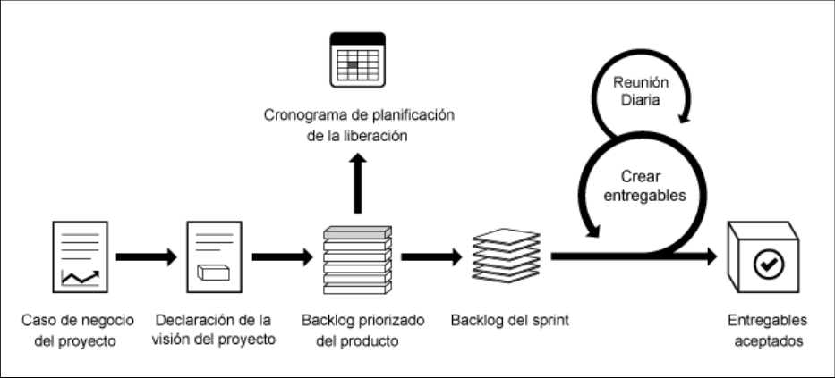

**Figura 1-1: Flujo de Scrum para un Sprint** 

**2                                   © 2025 SCRUMstudy™.  Una guía para el cuerpo de conocimiento de Scrum (Guía SBOK)** 

1 – INTRODUCCIÓN 

**1** 

<mark>El ciclo Scrum comienza con una reunión de partes interesadas, durante el cual la Visión del Proyecto se crea. A continuación, el propietario del producto desarrolla un backlog de productos priorizado que contiene una lista priorizada de requisitos comerciales y de proyectos escrita en forma de historias de usuario. Cada Sprint comienza con una Reunión de Planificación de Sprints durante la cual las Historias de Usuario de alta prioridad se consideran para su inclusión en el Sprint. Un Sprint dura entre una y cuatro semanas e implica que el equipo de Scrum trabaje para crear entregables potencialmente entregables o incrementos de productos. Durante el Sprint, Reuniones Diarias de Standup cortas y altamente enfocadas se llevan a cabo donde los miembros del equipo discuten el progreso diario. El Propietario del Producto puede evaluar los entregables completados durante el Sprint y puede aceptar los entregables que cumplan con los Criterios de Aceptación predefinidos. Hacia el final del Sprint, se lleva a cabo una Reunión de Revisión del Sprint durante la cual el Propietario del Producto y las partes interesadas relevantes del negocio se les proporciona una demostración de los entregables. El ciclo de Sprint termina con un Sprint de Retrospect Reunión en la que los miembros del equipo discuten las formas en que pueden mejorar la forma en que trabajan y su rendimiento a medida que avanzan hacia el Sprint siguiente.</mark> 

#### **1.1.1 Breve historia de Scrum** 

<mark>A mediados de los años 80, Hirotaka Takeuchi e Ikujiro Nonaka definieron una estrategia de desarrollo de productos flexible e inclusiva en la que el equipo de desarrollo trabaja como una unidad para alcanzar un objetivo común. Describieron un enfoque innovador para el desarrollo de productos que llamaron un enfoque holístico o de "rugby", "donde un equipo intenta recorrer la distancia como una unidad, pasando la pelota de un lado a otro". Los autores basaron su enfoque en estudios de casos de fabricación de diversas industrias. Takeuchi y Nonaka propusieron que el desarrollo de productos no debería ser como una carrera de relevos secuencial, sino que debería ser análogo al juego de rugby donde el equipo trabaja en conjunto, pasando la pelota de un lado a otro a medida que se mueven como una unidad por el campo. El concepto de rugby de un "Scrum" (donde un grupo de jugadores se forman juntos para reiniciar el juego) se introdujo en este artículo para describir la propuesta de los autores de que el desarrollo de productos debería implicar "mover el Scrum campo abajo".</mark> 

<mark>Desde entonces, varios profesionales, expertos y autores de Scrum han seguido perfeccionando la conceptualización y el marco de Scrum basándose en las mejores prácticas. Un hito importante en el viaje de Scrum fue la creación de la versión original de la</mark> _<mark>Guía SBOK</mark>__®_ <mark>en 2013. Con el tiempo, el</mark> _<mark>Guía SBOK</mark>__®_ <mark>se ha mejorado continuamente en función de las revisiones y comentarios proporcionados por varios miles de profesionales de Scrum y Agile, incluidos 5000+ profesores en 110+ países que enseñan prácticas de Scrum y Agile utilizando el</mark> _<mark>Guía SBOK</mark>__®_ <mark>Marco de referencia. Esta Quinta edición es el producto de un refinamiento adicional que garantiza la</mark> _<mark>Guía SBOK</mark>__®_ <mark>sigue siendo válida y relevante en un mundo en constante cambio. El</mark> _<mark>Guía SBOK</mark>__®_ <mark>es ahora el estándar de la industria para empresas y profesionales interesados en implementar prácticas Scrum o Agile. En los últimos años, Scrum ha aumentado en popularidad y ahora es el enfoque de desarrollo de proyectos preferido por muchas organizaciones a nivel mundial. Para facilitar su aplicación en entornos multinacionales, el</mark> _<mark>Guía SBOK</mark>__®_ <mark>ha sido traducido a varios idiomas, incluidos español, portugués, francés, italiano, árabe, chino y japonés. Para obtener más información sobre cómo acceder a las versiones traducidas, visite www.scrumstudy.com.</mark> 

©2025 SCRUMstudy. _Una guía para el cuerpo de conocimiento de Scrum (Guía SBOK®)_ 

**3** 

1 – INTRODUCCIÓN 

### **1.2 ¿Por qué usar Scrum?** 

Algunos de los beneficios clave de usar Scrum en cualquier proyecto son: 

1. **Adaptabilidad** —El control empírico de procesos y la entrega iterativa hacen que los proyectos Adaptable y abierto a incorporar cambios. 

2. **Transparencia** —Todos los radiadores de información, como el Scrumboard y el Sprint Burndown Chart, se comparten, lo que da lugar a un entorno de trabajo abierto. 

3. **Retroalimentación continua** —Se proporciona retroalimentación continua a través de la _Realizar una reunión diaria_ y _Demostrar y validar el sprint_ Procesos. 

4. **Mejora Continua** —Los entregables se mejoran progresivamente Sprint a Sprint, a través de la _Refinar el backlog de productos priorizados_ proceso. 

5. **Entrega Continua de Valor** —Los procesos iterativos permiten la entrega continua de valor a través de la _Entregables del barco_ procesa con la frecuencia que el cliente requiera. 

6. **Ritmo sostenible** —Procesos de Scrum están diseñados de tal manera que las personas involucradas puedan trabajar a un ritmo sostenible que, en teoría, puedan continuar indefinidamente. 

7. **Entrega Temprana de Alto Valor** —El _Crear un backlog de productos priorizado_ El proceso garantiza que los requisitos de mayor valor del cliente se satisfagan primero. 

8. **Proceso de desarrollo eficiente** —El ahorro de tiempo y la minimización del trabajo no esencial conducen a mayores niveles de eficiencia. 

9. **Motivación** —El _Realizar una reunión diaria_ y _Retrospect Sprint_ Los procesos conducen a mayores niveles de motivación entre los empleados. 

10. **Resolución de problemas más rápida** —La colaboración y la colocación de equipos multifuncionales conducen a una resolución de problemas más rápida. 

11. **Entregables efectivos** —El _Crear un backlog de productos priorizado_ El proceso y las revisiones periódicas después de crear los entregables garantizan la eficacia de los entregables al cliente. 

12. **Centrado en el cliente** —Énfasis en el valor comercial y tener un enfoque colaborativo para involucrar a las partes interesadas del negocio Garantiza un marco orientado al cliente. 

13. **Entorno de alta confianza** — _Realizar una reunión diaria_ y _Retrospect Sprint_ Los procesos promueven la transparencia y la colaboración, lo que conduce a un entorno de trabajo de alta confianza que garantiza una baja fricción entre los empleados. 

14. **Propiedad Colectiva** —El _Confirmar historias de usuario_ El proceso permite a los miembros del equipo hacerse cargo del proyecto y de su trabajo, lo que conduce a una mejor calidad. 

15. **Alta velocidad** —Un marco colaborativo permite que los equipos multifuncionales altamente calificados alcancen su máximo potencial y alta velocidad. 

16. **<mark>Entorno innovador</mark>** —El _<mark>Retrospect Sprint</mark>_ <mark>y</mark> _<mark>Versión de Retrospect</mark>_ <mark>Los procesos crean un entorno de introspección, aprendizaje y adaptabilidad que conduce a un entorno de trabajo innovador y creativo.</mark> 

**4                                   © 2025 SCRUMstudy™.  Una guía para el cuerpo de conocimiento de Scrum (Guía SBOK)** 

1 – INTRODUCCIÓN 

**1** 

#### **1.2.1 Escalabilidad de Scrum** 

Para ser efectivos, los equipos Scrum Lo ideal es que tenga de seis a diez miembros. Esta práctica puede ser la razón de la idea errónea de que el marco Scrum solo se puede aplicar a proyectos pequeños. Sin embargo, el marco se puede escalar fácilmente para un uso efectivo en grandes proyectos, programasy carteras. En situaciones en las que el tamaño del equipo Scrum supera las diez personas, se pueden formar varios equipos Scrum para trabajar en el proyecto. El enfoque lógico de las directrices y principios de este marco se puede utilizar para gestionar proyectos de cualquier tamaño, que abarquen geografías y organizaciones. Los proyectos grandes pueden tener varios equipos Scrum trabajando en paralelo, lo que hace necesario sincronizar y facilitar el flujo de información y mejorar la comunicación. Los proyectos grandes o complejos a menudo se implementan como parte de un programa o cartera. 

Detalles sobre el escalado de Scrum para proyectos grandes se proporcionan en el capítulo 13. Orientación sobre el escalado de Scrum para la empresa se trata en el capítulo 14. 

©2025 SCRUMstudy. _Una guía para el cuerpo de conocimiento de Scrum (Guía SBOK®)_ 

**5** 

1 – INTRODUCCIÓN 

### **1.3 Finalidad de la** **_Guía SBOK_****_®_** 

El marco Scrum ha demostrado ser el marco de entrega de proyectos preferido para ofrecer constantemente un alto valor empresarial y mejorar el retorno de la inversión. El enfoque de Scrum en la entrega basada en el valor ayuda a los equipos de Scrum a entregar resultados lo más temprano posible en el proyecto. 

El _Guía SBOK__®_ se desarrolló como un medio para crear una guía necesaria para las organizaciones y los profesionales de la gestión de proyectos que desean implementar Scrum, así como para aquellos que ya lo están haciendo y desean realizar las mejoras necesarias en sus procesos. Se basa en la experiencia extraída de miles de proyectos en una variedad de organizaciones e industrias. En su desarrollo se han tenido en cuenta las contribuciones de muchos expertos en Scrum y profesionales de la gestión de proyectos. 

El _Guía SBOK__®_ es especialmente valioso: 

- al equipo central de Scrum Entre los miembros, se encuentran: 

   - Propietarios de productos que desean comprender completamente el marco de trabajo de Scrum y, en particular, las preocupaciones relacionadas con el cliente o las partes interesadas que involucran la justificación comercial, la calidad, el cambio y los aspectos de riesgo asociados con los proyectos de Scrum; 

   - Maestros de Scrum que desean aprender su papel específico en la supervisión de la aplicación del marco Scrum a los proyectos Scrum; 

   - Equipo Scrum miembros que quieran comprender mejor los procesos de Scrum y el asociado utilizado para crear el producto o servicio del proyecto. 

- como una guía completa para todos los profesionales de Scrum que trabajan en proyectos de Scrum en cualquier organización o industria. 

- como fuente de referencia para cualquier persona que interactúe con el equipo central de Scrum, incluido, entre otros, el propietario del producto del portafolio, Portafolio Scrum Master, Propietario del producto del programa, Programa Scrum Master, Organismo de Orientación de Scrumy las partes interesadas de la empresa (es decir, patrocinadoresclientelay los usuarios); 

- como un manual para cualquier persona que no tenga experiencia o conocimiento previo del marco Scrum pero quiera aprender más sobre el tema. 

El contenido de la _Guía SBOK__®_ también es útil para las personas que se preparan para realizar los siguientes exámenes de certificación SCRUMstudy™: 

- Desarrollador Scrum con certificación de IA (SDC®) 

- Scrum Maestro con certificación de IA (SMC®) 

- Scrum Master a escala con certificación de IA (SSMC)™ 

- SCRUMstudy Agile Master con certificación de IA (SAMC)™ 

- Propietario de producto de Scrum con certificación de IA (SPOC)® 

- Propietario de producto de Scrum a escala con certificación de IA (SSPOC™) 

- Experto Scrum Master con certificación de IA (ESMC)™ 

**6                                   © 2025 SCRUMstudy™.  Una guía para el cuerpo de conocimiento de Scrum (Guía SBOK)** 

1 – INTRODUCCIÓN 

**1** 

### **1.4 SBOK****_®_** **vs. otros Scrum Libros o Cuerpos de Conocimiento** 

#### **1.4.1 Descarga gratuita de SBOK****_®_** 

Para apoyar el crecimiento y la estandarización en los marcos y el conocimiento de Scrum, Scrumstudy.com ha hecho el Scrum Guía de referencia (SBOK®) Disponible de forma gratuita en su página web. Cualquier practicante de Scrum o cualquier persona interesada en el campo de Scrum puede descargar y utilizar fácilmente la guía como una referencia conveniente para el estudio personal o el trabajo profesional. 

No estoy seguro de la calidad de SBOK®? Simplemente descárgalo y compruébalo por ti mismo: **_Es gratis_** ! 

#### **1.4.2 Certificaciones gratuitas, seminarios web, videos, guías de estudio** 

El SBOK® es compatible con Scrumstudy.com con certificaciones, seminarios web, videos y guías de estudio gratuitos, ideales para cualquier profesional que busque una comprensión fundamental de Scrum o explore una carrera en el campo. La certificación gratuita también le dará una ventaja y reconocimiento en el campo de Scrum. 

Visite <u>Scrumstudy.com para más detalles.</u> 

#### **1.4.3 Práctico, contemporáneo y compatible con la IA** 

La mayoría de Scrum Los libros y los Cuerpos de Conocimiento son demasiado teóricos, extensos y carecen de ejemplos prácticos o explicaciones de conceptos contemporáneos, como cómo la Inteligencia Artificial (IA) o las herramientas de automatización pueden ser utilizadas por los profesionales de Scrum para trabajar de manera más efectiva. Sin embargo, SBOK® está escrito con un enfoque en problemas de la vida real y problemas prácticos que enfrentan los profesionales de Scrum, y cómo estos se pueden abordar utilizando herramientas modernas e IA. 

#### **1.4.4 Practica Scrum en la vida real con Vabro.ai** 

Scrumstudy se ha asociado con Vabro.ai, una IA-plataforma SaaS habilitada— para demostrar de manera práctica cómo los conceptos teóricos enseñados en SBOK® se aplican utilizando una herramienta habilitada para IA. 

Para obtener más detalles, visite Scrumstudy.com. 

#### **1.4.5 Regla 80-20: (20% de SBOK® es suficiente)** 

La mayoría de los libros de Scrum son demasiado completos y esperan que los lectores revisen todo el contenido para comprender los conceptos clave. Sin embargo, SBOK® sigue la regla del 80-20, lo que significa que el 80% de los conceptos básicos se pueden entender leyendo solo el 20% del libro. 

©2025 SCRUMstudy. _Una guía para el cuerpo de conocimiento de Scrum (Guía SBOK®)_ 

**7** 

1 – INTRODUCCIÓN 

El contenido restante se puede denominar según sea necesario cuando se trata de Scrum más complejo Tareas. 

Los cinco capítulos del proceso: _Iniciar, Planificar y estimar, Implementar, Revisión y Retrospectiva,_ y _Lanzamiento_ —incluyen entradas, herramientas y salidas obligatorias, y son ideales para aquellos que buscan una comprensión de alto nivel de Scrum. Estas secciones esenciales representan solo el 20% del contenido del libro. Los conceptos más detallados están diseñados para profesionales experimentados y se puede acceder fácilmente según sea necesario mientras se realiza un Scrum específico Actividades. 

#### **1.4.6 Fácil de organizar y divertido de leer** 

A diferencia de otros Scrum libros o Cuerpos de Conocimiento (BOK), el SBOK® Está bien organizado y es atractivo para leer. En el capítulo 2 se analizan los seis principios de Scrum, mientras que en los capítulos 3 a 7 se centran en los cinco aspectos de Scrum: organización, justificación empresarial, calidad, cambio y riesgo. El trabajo real realizado por los profesionales de Scrum está estructurado en cinco capítulos que cubren los procesos de Scrum— Iniciar, planificar y estimar, implementar, revisar y retroalimentarse, y publicar. Estos capítulos incluyen diecinueve procesos que proporcionan una guía paso a paso para ayudar a los profesionales de Scrum llevar a cabo su trabajo de manera efectiva. 

#### **1.4.7 Aplicable a Organizaciones de Todos los Tamaños e Industrias** 

<mark>Los conceptos en el Scrum Guía de referencia (SBOK®) son aplicables a lo siguiente:</mark> 

- <mark>Iniciativas de Scrum en cualquier industria</mark> 

- <mark>Productosservicios, o cualquier otro resultado entregado a las partes interesadas</mark> 

- <mark>Scrum Iniciativas de cualquier tamaño o complejidad</mark> 

<mark>Los conceptos de Scrum en SBOK® Se puede aplicar de manera efectiva a iniciativas en cualquier industria, desde pequeños esfuerzos o equipos con tan solo seis miembros hasta iniciativas grandes y complejas que involucran a miles de miembros de equipo en varios equipos.</mark> 

#### **1.4.8 Se alinea con otros marcos, incluido Kanban, OKR, DevOps, Análisis de Negocios** 

A diferencia de otros Scrum libros, que normalmente no muestran cómo la función Scrum puede interactuar con otros marcos populares como Kanban, OKR, DevOps y Análisis de Negocio. <mark>SBOK® incluye un apéndice para ilustrar cómo los conceptos de Scrum se alinean con otros marcos líderes utilizados por profesionales de la industria.</mark> 

**8                                   © 2025 SCRUMstudy™.  Una guía para el cuerpo de conocimiento de Scrum (Guía SBOK)** 

1 – INTRODUCCIÓN 

**1** 

#### **1.4.9 Certificaciones Avanzadas para Senior Scrum Profesionales** 

Múltiples certificaciones avanzadas están disponibles para Scrum senior profesionales, basados en la Guía de Referencia de Scrum (SBOK®). 

<mark>Para obtener más detalles, visite Scrumstudy.com</mark> 

#### **1.4.10 Disponible en 6 idiomas** 

El Scrum Guía de referencia (SBOK®), junto con sus cursos y certificaciones, está disponible en seis idiomas: inglés, francés, alemán, italiano, español y portugués. 

Para obtener más detalles, visite <u><mark>Scrumstudy.com</mark></u> 

#### **1.4.11 +2,500 socios en +50 países, +300,000 en grupo de LinkedIn** 

Scrumstudy.com se ha asociado con VMEdu Inc.—Una empresa de aprendizaje y certificación profesional de renombre que también colabora con marcas conocidas como KanbanStudy.com, OKRStudy.com, BALearning.com, 6SigmaStudy.comy mucho más. VMEdu cuenta con más de 2.500 socios de formación autorizados en 50+ países, un grupo de LinkedIn con más de 300.000 miembros y más de 2.000.000 de estudiantes certificados. Esto nos posiciona como líder mundial en el campo de la educación profesional. 

<mark>Para obtener más detalles, visite V</mark> <u>MEdu.com</u> o <u>Scrumstudy.com</u> 

©2025 SCRUMstudy. _Una guía para el cuerpo de conocimiento de Scrum (Guía SBOK®)_ 

**9** 

1 – INTRODUCCIÓN 

### **1.5 En el marco de la** **_Guía SBOK®_** 

El _Guía SBOK®_ se divide a grandes rasgos en las tres áreas siguientes: 

1. **Principios** Cubierto en el Capítulo 2, amplíe los seis principios que forman la base en la que se basa Scrum: Control Empírico de Procesos, Autoorganización, Colaboración, Priorización Basada en Valores, Time-boxing y Desarrollo Iterativo. 

2. **Aspectos** cubiertos en los capítulos 3 a 7, describen los cinco aspectos que son consideraciones importantes para todos los proyectos de Scrum—Organización, Justificación del Negocio, Calidad, Cambio y Riesgo. 

3. **Procesos** cubiertos en los capítulos 8 a 12 incluyen los diecinueve procesos fundamentales de Scrum y sus entradas, herramientas y salidas asociadas. El capítulo 13 cubre las entradas, herramientas y salidas adicionales necesarias para escalar Scrum para proyectos grandes, mientras que el capítulo 14 cubre los procesos adicionales necesarios para escalar Scrum para la empresa. 

La Figura 1-2 ilustra el Marco de la Guía SBOK®, mostrando la relación estructurada entre los principios, aspectos y procesos de Scrum, ofreciendo un marco integral para la aplicación de Scrum. 

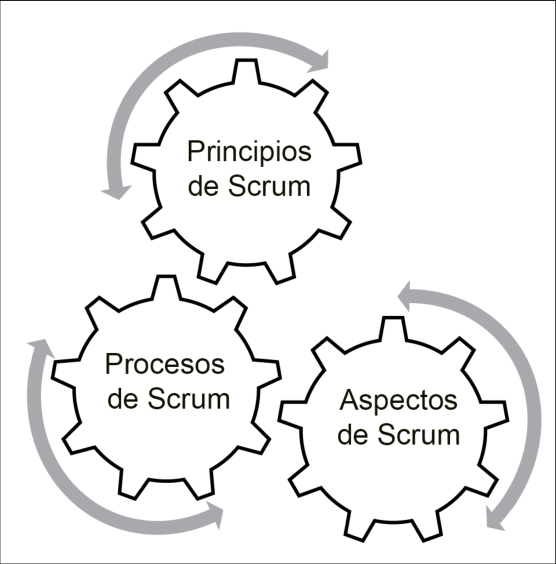

**Figura 1-2: Guía SBOK® Marco de referencia** 

**10                                   © 2025 SCRUMstudy™.  Una guía para el cuerpo de conocimiento de Scrum (Guía SBOK)** 

1 – INTRODUCCIÓN 

**1** 

#### **1.5.1 Cómo usar el** **_Guía SBOK®_ ?** 

El _Guía SBOK®_ puede ser utilizada como referencia y guía de conocimientos tanto por profesionales experimentados en Scrum como por otros profesionales del desarrollo de productos y servicios, así como por personas sin experiencia o conocimiento previo de Scrum o enfoque de gestión de proyectos. Los contenidos están organizados para facilitar la referencia por los tres roles del equipo central de Scrum: Product Owner, Scrum Mastery Scrum Team. 

Los capítulos que cubren los seis principios de Scrum (capítulo 2) y cinco aspectos de Scrum (capítulos 3 a 7) incluyen una Guía de Roles. Esta guía proporciona orientación sobre la relevancia de cada sección del capítulo para los roles del equipo central de Scrum. 

Con el fin de facilitar la mejor aplicación del marco de trabajo de Scrum, el _Guía SBOK®_ ha diferenciado claramente las entradas, herramientas y salidas obligatorias de las no obligatorias u opcionales. Las entradas, herramientas y salidas marcadas con asteriscos (*) son obligatorias o se consideran críticas para el éxito del proyecto, mientras que otras sin asteriscos son opcionales. Se recomienda que aquellos que se introducen en Scrum se centren principalmente en las entradas, herramientas y salidas obligatorias; Mientras que los profesionales más experimentados deben leer todos los capítulos del proceso para beneficiarse de los insumos, herramientas y resultados opcionales de mejores prácticas sugeridos. 

Scrum es un marco que no pretende ser prescriptivo, lo que significa que hay espacio para la flexibilidad en su aplicación. Todos los procesos fundamentales de Scrum se detalla en el _<mark>Guía SBOK®</mark>_ (capítulos 8 a 12) son necesarios para cada proyecto Scrum pero debe aplicarse en función de las necesidades específicas de la organización, proyecto, producto y/o equipo. Se aplicarían entradas, herramientas y salidas adicionales al escalar Scrum para proyectos grandes (capítulo 13) y se aplicarían procesos adicionales al escalar Scrum para la empresa (Capítulo 14). 

#### **1.5.2 Principios de Scrum** 

Principios de Scrum son las directrices básicas para la aplicación del marco Scrum y deben utilizarse obligatoriamente en todos los proyectos Scrum. Los seis principios de Scrum presentados en el capítulo 2 son: 

1. Control Empírico de Procesos 

2. Autoorganización 

3. Colaboración 

4. Priorización basada en el valor 

5. Caja de tiempo 

6. Desarrollo iterativo 

©2025 SCRUMstudy. _Una guía para el cuerpo de conocimiento de Scrum (Guía SBOK®)_ 

**11** 

1 – INTRODUCCIÓN 

La figura 1-3 representa los principios clave de Scrum, como el control empírico de procesos, la autoorganización, la colaboración y el desarrollo iterativo, que forman la filosofía fundamental de Scrum. 

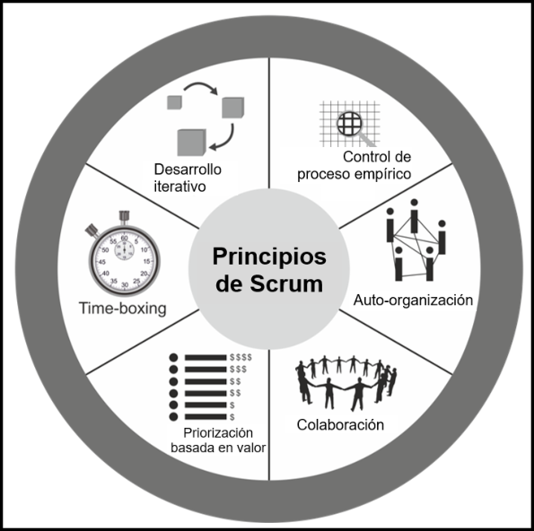

**Figura 1-3: Principios de Scrum** 

Principios de Scrum se puede aplicar a cualquier tipo de proyecto en cualquier organización y debe cumplirse para garantizar la implementación efectiva del marco Scrum. Los Principios de Scrum no son negociables y deben aplicarse como se especifica en el _Guía SBOK®_ . Mantener los principios intactos y utilizarlos adecuadamente infunde confianza en el marco Scrum con respecto a la consecución de los objetivos del proyecto. Los aspectos de Scrum y los procesos, sin embargo, pueden modificarse para cumplir con los requisitos del proyecto o de la organización. 

1. **Control Empírico de Procesos** —Este principio enfatiza la filosofía central de Scrum basada en las tres ideas principales de transparencia, inspección y adaptación. El control empírico de procesos ayuda al aprendizaje a través de la experimentación, especialmente cuando el problema no está bien definido o cuando no hay soluciones claras. 

2. **Autoorganización** —Este principio se centra en los trabajadores de hoy en día, que ofrecen un valor significativamente mayor cuando se autoorganizan, y esto se traduce en una mejor aceptación del equipo y en la propiedad compartida; y un entorno innovador y creativo más propicio para el crecimiento. 

3. **Colaboración** —Este principio se centra en las tres dimensiones centrales relacionadas con el trabajo colaborativo: conciencia, articulación y apropiación. También aboga por la entrega de proyectos como un proceso de creación de valor compartido con equipos que trabajan e interactúan juntos, así como con el cliente y otras partes interesadas del negocio, para ofrecer el mayor valor. 

**12                                   © 2025 SCRUMstudy™.  Una guía para el cuerpo de conocimiento de Scrum (Guía SBOK)** 

1 – INTRODUCCIÓN 

**1** 

4. **Priorización basada en el valor** —Este principio destaca el enfoque de Scrum para ofrecer el máximo valor empresarial, desde el principio del proyecto y continuando durante todo el proceso. 

5. **Caja de tiempo** —Este principio describe cómo el tiempo se considera una restricción limitante en Scrum y se utiliza para ayudar a gestionar eficazmente la planificación y ejecución de proyectos. Los elementos con límite de tiempo en Scrum incluyen Sprints, Reuniones Diarias de Pie, Reuniones de Planificación de Sprints, Reuniones de revisión de sprintsy Retrospect Sprint Reuniones. 

6. **Desarrollo iterativo** —Este principio define el desarrollo iterativo y hace hincapié en cómo gestionar mejor los cambios y crear productos que satisfagan las necesidades de los clientes. También delinea las responsabilidades del propietario del producto y de la organización en relación con el desarrollo iterativo. 

#### **1.5.3 Aspectos de Scrum** 

Los aspectos de Scrum debe abordarse y gestionarse a lo largo de un proyecto Scrum. Los cinco aspectos de Scrum presentados en los capítulos 3 a 7 son: 

##### **1.5.3.1 Organización** 

Comprender los roles y responsabilidades definidos en un proyecto Scrum es importante para garantizar el éxito de la implementación de Scrum. Los roles de Scrum se dividen en dos grandes categorías: 

**1. Funciones principales** —Los roles principales son aquellos roles que se requieren obligatoriamente para producir el producto o servicio del proyecto. Las personas a las que se les asignan roles principales están totalmente comprometidas con el proyecto y son responsables del éxito de cada sprint y del proyecto en su conjunto. 

Los roles principales comprenden a los miembros del equipo central de Scrum, que incluyen: 

   - El **Propietario del producto** Es la persona responsable de lograr el máximo valor comercial para el proyecto. También es responsable de articular los requisitos del cliente y mantener la justificación comercial para el proyecto. El Propietario del Producto representa la Voz del Cliente. 

   - El **Scrum Maestro** es un facilitador que se asegura de que el equipo Scrum cuente con un entorno propicio para completar el proyecto con éxito. El Scrum Master guía, facilita y enseña prácticas de Scrum a todos los involucrados en el proyecto; elimina los impedimentos para el equipo; y garantiza que los procesos de Scrum se están siguiendo. 

   - El **Equipo Scrum** es el grupo o equipo de personas que se encargan de comprender los requisitos especificados por el Product Owner y de crear los entregables del proyecto. 

**2. Roles no esenciales** —Los roles no esenciales son aquellos roles que no son obligatorios para el proyecto Scrum. Pueden incluir miembros del equipo que estén interesados en el proyecto, pero que no tengan un papel formal en el equipo del proyecto. 

©2025 SCRUMstudy. _Una guía para el cuerpo de conocimiento de Scrum (Guía SBOK®)_ 

**13** 

1 – INTRODUCCIÓN 

Estas personas pueden interactuar con el equipo, pero pueden no ser responsables del éxito del proyecto. Los roles no esenciales deben tenerse en cuenta en cualquier proyecto de Scrum. Entre las funciones no esenciales se incluyen las siguientes: 

- **Parte interesada (s) del negocio,** que es un término colectivo que incluye a los clientesUsuariosy patrocinadores que interactúan frecuentemente con el equipo central de Scrum y también influyen en el proyecto a lo largo del desarrollo del proyecto. Lo más importante es que es para las partes interesadas del negocio que el proyecto produzca beneficios colaborativos. 

Las partes interesadas del negocio son un subconjunto de todas las partes interesadas en un proyecto Scrum - Las partes interesadas incluyen a todas las personas y grupos afectados por el proyecto Scrum, tanto dentro como fuera de la organización (por ejemplo, todos los roles principales y no esenciales, proveedores, grupos internos, expertos, etc.). 

- **Cuerpo de Guía de Scrum** (SGB) es un rol opcional, que generalmente consta de un conjunto de documentos y/o un grupo de expertos que normalmente participan en la definición de objetivos relacionados con la calidad, las regulaciones gubernamentales, la seguridad y otros parámetros organizacionales clave. El SGB guía el trabajo realizado por el Product Owner, Scrum Mastery Scrum Team. 

- **Proveedores** , incluyen a personas u organizaciones externas que proporcionan productos y/o servicios que no están dentro de las competencias básicas de la organización del proyecto. 

La Figura 1-4 muestra la estructura organizativa de Scrum, destacando roles como el Propietario del Producto, el Scrum Master y el Equipo de Scrum dentro de una jerarquía plana y colaborativa. 

**14                                   © 2025 SCRUMstudy™.  Una guía para el cuerpo de conocimiento de Scrum (Guía SBOK)** 

1 – INTRODUCCIÓN 

**1** 

**Figura 1-4: Organización en Scrum** 

El aspecto organizativo de Scrum también aborda los requisitos de la estructura del equipo para implementar Scrum en proyectos grandesProgramasy carteras. 

##### **1.5.3.2 Justificación del negocio** 

<mark>Es importante que una organización realice una evaluación empresarial adecuada antes de iniciar cualquier proyecto. Esto ayuda a los principales responsables de la toma de decisiones a comprender la necesidad empresarial de un cambio o de un nuevo producto o servicio, la justificación para seguir adelante con un proyecto y su viabilidad.</mark> 

La justificación empresarial en Scrum se basa en el concepto de entrega basada en el valor. Una de las características clave de cualquier proyecto es la incertidumbre de los resultados o desenlaces. Es imposible garantizar el éxito del proyecto al finalizarlo, independientemente del tamaño o la complejidad del proyecto. Teniendo en cuenta esta incertidumbre de lograr el éxito, Scrum intenta comenzar a entregar resultados lo más temprano posible en el proyecto. 

Esta rápida entrega de resultados y, por lo tanto, de valor, brinda una oportunidad para la reinversión y demuestra el valor del proyecto a las partes interesadas del negocio. <mark>La adaptabilidad de Scrum permite que los objetivos y procesos del proyecto cambien si cambia su justificación de negocio. Es importante tener en cuenta que, aunque el Product Owner es el principal responsable de la justificación del negocio, otros miembros del equipo contribuyen significativamente.</mark> 

©2025 SCRUMstudy. _Una guía para el cuerpo de conocimiento de Scrum (Guía SBOK®)_ 

**15** 

1 – INTRODUCCIÓN 

##### **1.5.3.3 Calidad** 

<mark>En Scrum, la calidad se define como la capacidad del producto o entregables terminados para cumplir con los Criterios de Aceptación y lograr el valor comercial esperado por el cliente.</mark> 

<mark>Para garantizar que un proyecto cumpla con los requisitos de calidad, Scrum adopta un enfoque de mejora continua donde el equipo aprende de la experiencia y el compromiso de las partes interesadas para mantener constantemente el Backlog de Productos Priorizados actualizado con cualquier cambio en los requisitos. El Backlog de Productos Priorizados simplemente nunca está completo hasta el cierre o terminación del proyecto. Cualquier cambio en los requisitos refleja los cambios en el entorno empresarial interno y externo y permite que el equipo trabaje y se adapte continuamente para lograr esos requisitos.</mark> 

<mark>Dado que Scrum requiere que el trabajo se complete en incrementos durante los Sprints, esto significa que los errores o defectos se notan antes a través de pruebas de calidad repetitivas, en lugar de cuando el producto o servicio final está a punto de completarse. Además, las tareas importantes relacionadas con la calidad (por ejemplo, desarrollo, pruebas y documentación) se completan como parte del mismo Sprint por el mismo equipo, lo que garantiza que la calidad sea inherente a cualquier entregable creado como parte de un Sprint. Dichos entregables de los proyectos Scrum, que son potencialmente enviables, se denominan 'Hecho'. Así, la mejora continua con pruebas repetitivas optimiza la probabilidad de alcanzar los niveles de calidad esperados en un proyecto Scrum. Discusiones constantes entre el equipo central de Scrum y las partes interesadas del negocio (incluidos los clientes y usuarios) con incrementos reales del producto que se entregan al final de cada Sprint, garantiza que la brecha entre las expectativas del cliente del proyecto y los entregables reales producidos se reduzca constantemente.</mark> 

<mark>El Cuerpo de Guía de Scrum también puede proporcionar pautas sobre la calidad que pueden ser relevantes para todos los proyectos de Scrum en la organización.</mark> 

##### **1.5.3.4 Cambio** 

<mark>Todo proyecto, independientemente de su método o marco utilizado, está expuesto al cambio. Es imperativo que los miembros del equipo del proyecto entiendan que los procesos de desarrollo de Scrum están diseñados para aceptar el cambio. Las organizaciones deben tratar de maximizar los beneficios que surgen del cambio y minimizar cualquier impacto negativo a través de procesos diligentes de gestión del cambio de acuerdo con los principios de Scrum.</mark> 

<mark>Un principio fundamental de Scrum es el reconocimiento de que: a) las partes interesadas del negocio (p. ej., clientesUsuariosy patrocinadores) cambian de opinión sobre lo que quieren y necesitan a lo largo de un proyecto (a veces denominado "rotación de requisitos"") y b) es muy difícil, si no imposible, para las partes interesadas en la empresa definir todos los requisitos durante el inicio del proyecto.</mark> 

<mark>Proyectos Scrum dar la bienvenida al cambio mediante el uso de Sprints cortos e iterativos que incorporen los comentarios de los clientes sobre los entregables de cada Sprint. Esto permite al cliente interactuar regularmente con los miembros del equipo Scrum, ver los entregables a medida que están listos y cambiar los requisitos si es necesario antes en el Sprint. Además, los equipos de gestión de carteras o programas pueden responder a las solicitudes de cambio relacionados con los proyectos Scrum aplicables a su nivel.</mark> 

**16                                   © 2025 SCRUMstudy™.  Una guía para el cuerpo de conocimiento de Scrum (Guía SBOK)** 

1 – INTRODUCCIÓN 

**1** 

##### **1.5.3.5 Riesgo** 

El riesgo se define como un evento o conjunto de eventos inciertos que pueden afectar los objetivos de un proyecto y pueden contribuir a su éxito o fracaso. Los riesgos que pueden tener un impacto positivo en el proyecto se denominan oportunidades, mientras que las amenazas son riesgos que podrían afectar al proyecto de manera negativa. La gestión del riesgo debe realizarse de forma proactiva, y es un proceso iterativo que debe comenzar al inicio del proyecto y continuar durante todo el ciclo de vida del proyecto. El proceso de gestión de riesgos debe seguir algunos pasos estandarizados para garantizar que los riesgos se identifiquen, evalúen y se determine un curso de acción adecuado y se actúe en consecuencia. 

Los riesgos deben identificarse, evaluarse y responderse sobre la base de dos factores: la probabilidad de que ocurra cada riesgo y el posible impacto en caso de que ocurra. Los riesgos con un alto valor de probabilidad e impacto (determinado multiplicando ambos factores), deben abordarse antes que aquellos con un valor menor. En general, una vez que se identifica un riesgo, es importante comprender el riesgo con respecto a las causas probables y los efectos potenciales si se produce el riesgo. 

#### **1.5.4 Procesos Scrum** 

Procesos Scrum abordar las actividades específicas y el flujo de un proyecto Scrum. Sin embargo <mark>Los procesos de Scrum no son secuenciales, sino que son de naturaleza iterativa y pueden superponerse entre</mark> sí. En total son diecinueve procesos fundamentales de Scrum que se aplican a todos los proyectos. Estos diecinueve procesos se agrupan en cinco fases, como se muestra en la Tabla 1-1. Los detalles de cada fase y sus procesos correspondientes se presentan en los capítulos 8 a 12 de la _Guía SBOK®_ . 

|**Capítulo**|**Fase**|**Procesos fundamentales de Scrum**|
|---|---|---|
|8|Iniciar|1. Crear la visión del proyecto 2. Identificar a Scrum Master y Parte Interesada (s) del negocio 3. Formar un equipo Scrum 4. Desarrollar épica(s)) 5. Crear un backlog de productos priorizado 6. Llevar a cabo la planificación de lanzamientos|
|9|Planificar y estimar|7. Crear historias de usuario 8. Estimar casos de usuario 9. Confirmar historias de usuario 10. Identificar tareas 11. Tareas de estimación 12. Actualizar el backlog del sprint|
|10|Instrumento|13. Crear entregables 14. Realizar una reunión diaria 15. Refinar el backlog de productos priorizados|
|11|Revisión y retrospectiva|16. Demostrar y validar el sprint|

©2025 SCRUMstudy. _Una guía para el cuerpo de conocimiento de Scrum (Guía SBOK®)_ 

**17** 

1 – INTRODUCCIÓN 

||17.|Retrospect Sprint|
|---|---|---|
|12|Lanzamiento 18.  19.|Entregables del barco  Versión de Retrospect|

**Tabla 1-1: Resumen de los Procesos Fundamentales de Scrum** 

Los capítulos que se centran en cada fase describen cada proceso en detalle, incluidas sus entradas, herramientas y salidas asociadas. En cada proceso, algunas entradas, herramientas y salidas son obligatorias (las que tienen un asterisco [*] después de sus nombres), mientras que otras son opcionales. La inclusión de las entradas, herramientas y/o salidas opcionales depende del proyecto, la organización o la industria en particular. Las entradas, herramientas y salidas marcadas con un asterisco se consideran obligatorias o críticas para la implementación exitosa de Scrum en cualquier organización. 

Para proyectos Scrum a gran escala que requieren coordinación entre varios equipos, se necesitan entradas, herramientas y salidas adicionales. Estos se definen en el Capítulo 13—Escalado de Scrum para proyectos grandes. 

Además, hay procesos adicionales definidos al implementar Scrum a nivel empresarial. Estos se tratan en el Capítulo 14—Escalado de Scrum para la empresa. 

##### **1.5.4.1 Fase de inicio** 

Los procesos relevantes para la fase de inicio son los siguientes: 

1. _Crear la visión del proyecto_ —En este proceso, se revisa el caso de negocio del proyecto para crear una Declaración de Visión del Proyecto que servirá de inspiración y proporcionará enfoque para todo el proyecto. En este proceso se identifica al propietario del producto. La empresa también puede optar por evaluar y seleccionar una herramienta de proyecto Scrum impulsada por IA que pueda reducir significativamente la complejidad de la configuración de la iniciativa Scrum y aumentar la productividad de los proyectos Scrum dentro de la organización. 

2. _Identificar a Scrum Master y Parte Interesada (s) del negocio_ —En este proceso, el Scrum Master y las partes interesadas del negocio se identifican mediante criterios de selección específicos. 

3. _Formar un equipo Scrum_ —En este proceso, se identifica a los miembros del Equipo Scrum. Normalmente, el Product Owner tiene la responsabilidad principal de seleccionar a los miembros del equipo, pero a menudo lo hace en colaboración con el Scrum Master. 

4. _Desarrollar épica(s))_ —En este proceso, la Declaración de la Visión del Proyecto sirve como base para desarrollar Epopeyas. Se pueden llevar a cabo reuniones de grupos de usuarios para discutir las epopeyas apropiadas. 

5. _Crear un backlog de productos priorizado_ —En este proceso, las epopeyas se refinan, elaboran y luego se priorizan para crear un backlog de productos priorizado para el proyecto. En este punto también se establece el Criterio de Finalización. 

**18                                   © 2025 SCRUMstudy™.  Una guía para el cuerpo de conocimiento de Scrum (Guía SBOK)** 

1 – INTRODUCCIÓN 

**1** 

6. _Llevar a cabo la planificación de lanzamientos_ —En este proceso, el Product Owner con el apoyo del Equipo Scrum desarrolla un Cronograma de Planificación de Lanzamientos, que es esencialmente un cronograma de implementación por fases que se puede compartir con las partes interesadas del negocio del proyecto. La longitud del Sprint también se determina en este proceso. 

##### **1.5.4.2 Planificar y estimar Fase** 

Los procesos relevantes para la fase de Planificación y Estimación son los siguientes: 

7. _Crear historias de usuario_ —En este proceso, las historias de usuario y sus Criterios de Aceptación relacionados son creados por el Propietario del Producto e incorporados al Trabajo Pendiente de Productos Priorizados. Las historias de usuario están diseñadas para garantizar que los requisitos del cliente se representen claramente y puedan ser completamente entendidos por todas las partes interesadas del negocio. 

8. _Estimar casos de usuario_ — <mark>En este proceso, el Equipo Scrum, apoyado por el Scrum Master, estima las Historias de Usuario e identifica el esfuerzo requerido para desarrollar la funcionalidad descrita en cada Historia de Usuario.</mark> 

9. _Confirmar historias de usuario_ —En este proceso, el equipo Scrum se compromete a entregar historias de usuario aprobadas por el propietario del producto para un Sprint. Los resultados de este proceso son las Historias de Usuario comprometidas y el Backlog del Sprint. 

_10. Identificar tareas_ —En este proceso, las Historias de Usuario comprometidas se desglosan en tareas específicas y se compilan en una lista de tareas. 

11. _Tareas de estimación—_ En este proceso opcional, el Equipo Central de Scrum estima el esfuerzo requerido para realizar cada tarea en la Lista de Tareas. 

12. _Actualizar el backlog del sprint_ —En este proceso, el Equipo Central de Scrum actualiza el Backlog del Sprint con más detalles sobre las tareas como parte de la Reunión de Planificación del Sprint. 

##### **1.5.4.3 Fase de implementación** 

Los procesos relevantes para la fase de implementación son los siguientes: 

13. _Crear entregables_ —En este proceso, el Scrum Team trabaja en las tareas del Sprint Backlog para crear Sprint Deliverables. Un Scrumboard se utiliza a menudo para realizar un seguimiento del trabajo y las actividades que se llevan a cabo. Los problemas o problemas a los que se enfrenta el equipo Scrum deben actualizarse en un registro de impedimentos. 

14. _Realizar una reunión diaria_ —En este proceso, todos los días se lleva a cabo una reunión altamente enfocada y con tiempo limitado, conocida como la Reunión Diaria de Pie. Este es el foro para que el equipo Scrum se actualice mutuamente sobre su progreso individual y cualquier impedimento que puedan estar enfrentando. 

©2025 SCRUMstudy. _Una guía para el cuerpo de conocimiento de Scrum (Guía SBOK®)_ 

**19** 

1 – INTRODUCCIÓN 

15. _Refinar el backlog de productos priorizados_ —En este proceso, el Backlog de Productos Priorizados se actualiza y mantiene continuamente. Se lleva a cabo una reunión de revisión del backlog de productos priorizados, en la que se discuten los cambios o actualizaciones del backlog y se incorporan al backlog de productos priorizados, según corresponda. 

##### **1.5.4.4 Fase de revisión y retrospectiva** 

Los procesos relevantes para la fase de revisión y retrospectiva son los siguientes: 

16. _Demostrar y validar el sprint_ —En este proceso, el Equipo Scrum demuestra los entregables del Sprint al Product Owner y a las partes interesadas relevantes del negocio en una Reunión de Revisión de Sprint. El propósito de esta reunión es asegurar la aprobación y aceptación de las Historias de Usuario de Sprint por parte del Propietario del Producto. 

17. _Retrospect Sprint_ —En este proceso, el Scrum Master y el Equipo Scrum se reúnen para discutir las lecciones aprendidas a lo largo del Sprint. Esta información está documentada y debe aplicarse a futuros Sprints. A menudo, como resultado de esta discusión, puede haber mejoras accionables acordadas o un Cuerpo de Guía de Scrum actualizado Recomendaciones. 

##### **1.5.4.5 Fase de lanzamiento** 

Los procesos relevantes para la fase de lanzamiento son los siguientes: 

18. _Entregables del barco_ —En este proceso, todos los entregables de las Historias de Usuario aceptadas de los Sprints completados previamente se entregan o transfieren a las partes interesadas del negocio relevantes. Un acuerdo formal de entregables de trabajo documenta la finalización exitosa de la versión. 

19. _Versión de Retrospect_ —En este proceso que completa una versión, las partes interesadas del negocio y los miembros del equipo central de Scrum se reúnen para reflexionar sobre el lanzamiento e identificar, documentar e internalizar las lecciones aprendidas. A menudo, estas lecciones conducen a la documentación de mejoras accionables acordadas para ser implementadas en proyectos futuros. 

##### **1.5.4.6 Reuniones o Ceremonias de Scrum** 

Las reuniones o ceremonias de Scrum desempeñan un papel fundamental en la implementación efectiva del marco de trabajo de Scrum y son un medio clave a través del cual los principios de Scrum se implementan. Las reuniones importantes de Scrum y los procesos asociados en los que se llevan a cabo estas reuniones se resumen en la Tabla 1-2. 

**20                                   © 2025 SCRUMstudy™.  Una guía para el cuerpo de conocimiento de Scrum (Guía SBOK)** 

1 – INTRODUCCIÓN 

**1** 

|**Reuniones Scrum**|**Procesos Scrum**|
|---|---|
|Reunión de Visión del Proyecto|• Crear la visión del proyecto|
|Reunión del grupo de usuarios|• Desarrollar épica(s) • Crear historias de usuario|
|Reunión de Grupos Focales|• Desarrollar epopeyas • Crear historias de usuario|
|Sesión o reunión de planificación de lanzamientos|• Llevar a cabo la planificación de lanzamientos|
|Reunión de revisión del backlog del producto|• Estimar casos de usuario • Refinar el backlog de productos priorizados|
|Reunión de Planificación de Sprint|• Estimar casos de usuario • Confirmar historias de usuario • Identificar tareas • Tareas de estimación • Actualizar el backlog del sprint|
|Reunión diaria de pie|• Realizar una reunión diaria|
|Reunión de revisión del Sprint|• Demostrar y validar el sprint|
|Retrospect Sprint Reunión|• Retrospect Sprint|
|Versión de Retrospect Reunión|• Versión de Retrospect|

**Tabla 1-2: Reuniones y Procesos Scrum** 

#### **1.5.5 Scrum para grandes proyectos** 

<mark>Cuando se trata de proyectos de gran envergadura Los procesos fundamentales definidos en los capítulos 8 a 12, que requieren los esfuerzos de múltiples (cuatro o más) equipos de Scrum con múltiples Product Owners y múltiples Scrum Masters, siguen siendo válidos, pero es posible que se requieran algunas consideraciones adicionales y actualizaciones de las entradas, herramientas y salidas. Esto puede incluir necesidades adicionales de coordinación y sincronización. Los impactos en los procesos fundamentales de Scrum cuando se escala Scrum a proyectos grandes se describen en el capítulo 13.</mark> 

©2025 SCRUMstudy. _Una guía para el cuerpo de conocimiento de Scrum (Guía SBOK®)_ 

**21** 

1 – INTRODUCCIÓN 

<mark>La definición de lo que constituye un proyecto de gran envergadura suele depender de la organización y/o de la complejidad de los mismos que se está llevando a cabo. Un criterio clave para determinar si un proyecto se considera pequeño o grande es si el proyecto requiere varios Scrum Masters y/o varios Product Owners. Si el proyecto requiere un solo Scrum Master y un propietario del producto, entonces estas personas normalmente pueden manejar cualquier esfuerzo adicional de comunicación y sincronización requerido por el proyecto.</mark> 

#### **1.5.6 Scrum para la empresa** 

Al aplicar Scrum a nivel empresarial (como a un programa o cartera), puede haber varios cientos de equipos Scrum, con varios miles de personas trabajando en múltiples proyectos Dentro de los programas y/o portafolios en toda la organización. La aplicación de Scrum a nivel de programa o cartera tendrá ciertos impactos en los proyectos subyacentes. En general, los proyectos de Scrum deben ejecutarse utilizando los procesos fundamentales de Scrum Se analiza en los capítulos 8 a 12 para proyectos pequeños típicos, mientras se incorporan las consideraciones adicionales descritas en el capítulo 13 para proyectos grandes (que tienen varios Product Owners y/o Scrum Masters). 

Algunos de los desafíos que surgen a nivel de programa o portafolio son similares a los que surgen al aplicar Scrum a un proyecto grande. La sincronización entre equipos y la colaboración general suelen ser los mayores desafíos con un proyecto Scrum grande—esto también es un reto a la hora de aplicar Scrum a nivel de programa o portafolio. Sin embargo, los mayores desafíos al aplicar Scrum a nivel de programa o portafolio generalmente ocurren en el lado del negocio debido a las prioridades comerciales de los diferentes proyectos entran en conflicto entre sí y también pueden entrar en conflicto con los objetivos generales del programa o portafolio. Estas prioridades y objetivos deben estar alineados. 

Al implementar Scrum a nivel empresarial, no solo hay entradas, herramientas y salidas adicionales, como en un proyecto Scrum grande, también hay procesos adicionales específicos que se requieren para abordar los esfuerzos adicionales de priorización, alineación y coordinación. Estas consideraciones adicionales se analizan en el capítulo 14. 

**22                                   © 2025 SCRUMstudy™.  Una guía para el cuerpo de conocimiento de Scrum (Guía SBOK)** 

1 – INTRODUCCIÓN 

**1** 

### **1.6 Scrum vs. Gestión de Proyectos Tradicional** 

La Tabla 1-3 resume muchas de las diferencias entre Scrum y los modelos tradicionales de gestión de proyectos. 

||**Scrum**|**Gestión deproyectos tradicional**|
|---|---|---|
|El énfasis está en|Gente|Procesos|
|Documentación|Mínimo, solo cuando sea necesario|Comprensivo|
|Estilo de proceso|Iterativo|Lineal|
|Planificación inicial|Bajo|Alto|
|Priorización de requisitos|Basado en el valor del negocio y actualizado regularmente|Fijo en el plan del proyecto|
|Garantía de calidad|Centrado en el cliente|Centrado en el proceso|
|Organización|Auto-organizado|Administrado|
|Estilo de gestión|Descentralizado|Centralizado|
|Cambio|Actualizaciones de la cartera de productos priorizados|Sistema formal de gestión del cambio|
|Liderazgo|Apoyo|Mando y control|
|Medición del rendimiento|Valor de negocio|Conformidad del plan|
|Retorno de la inversión (ROI)|Inicio/durante todo el ciclo de vida del proyecto|Fin del ciclo de vida del proyecto|
|Participación del cliente|Alto en todo el proyecto|Varía en función del ciclo de vida del proyecto|

**Tabla 1-3: Scrum vs. Gestión de Proyectos Tradicional** 

©2025 SCRUMstudy. _Una guía para el cuerpo de conocimiento de Scrum (Guía SBOK®)_ 

**23** 

**Esta página se ha dejado en blanco intencionadamente.** 

**24                                   © 2025 SCRUMstudy™.  Una guía para el cuerpo de conocimiento de Scrum (Guía SBOK)** 

2 – PRINCIPIOS 

**2** 

## **2. PRINCIPIOS** 

### **2.1 Introducción** 

Los principios de Scrum son la base en la que se funda el marco de trabajo de Scrum. Estos principios pueden aplicarse a cualquier tipo de proyecto u organización y deben respetarse a fin de garantizar la aplicación adecuada de Scrum. Los aspectos y procesos de Scrum pueden modificase para cumplir con los requerimientos del proyecto _,_ o la organización que lo usa, pero sus principios no están abiertos a discusión ni pueden modificarse, y deben aplicarse como se describe en el marco de trabajo presentado en _Guía de los fundamentos de Scrum (Guía del SBOK__®_ _)._ Al mantener los principios intactos y usarlos apropiadamente se infunde confianza en el usuario del marco de trabajo de Scrum respecto al cumplimiento de los objetivos del proyecto. Los principios se consideran los lineamientos básicos para la aplicación del marco de trabajo de Scrum. 

<mark>Los principios</mark> _<mark>,</mark>_ <mark>tal como se definen en la</mark> _<mark>Guía del SBOK</mark>__®_ _<mark>,</mark>_ <mark>son aplicables a lo siguiente:</mark> 

- <mark>Portafolios, programas, o proyectos de</mark> _<mark>cualquier</mark>_ <mark>industria;</mark> 

- <mark>Productos, servicios, o cualquier otro resultado que se entregue a los</mark> interesados el negocio; 

- <mark>Proyectos de cualquier tamaño y complejidad.</mark> 

<mark>El término “producto” en la</mark> _<mark>Guía del SBOK</mark>__®_ <mark>puede ser un producto, servicio, o cualquier otro entregable. Scrum puede aplicarse de manera efectiva a cualquier proyecto en cualquier industria: desde proyectos pequeños o equipos con tan solo seis miembros, hasta proyectos grandes y complejos con hasta varios cientos de miembros. E</mark> ste capítulo se divide en las siguientes secciones: 

**2.1.1 Guía de roles:** Esta sección describe la sección o subsección más relevante para cada uno de los roles principales de Scrum tales como el Product Owner, Scrum Master y Equipo Scrum. 

**2.2 Control de proceso empírico:** Esta sección describe el primer principio de Scrum y las tres ideas principales de transparencia, inspección y adaptación. 

**2.3 Autoorganización** : Esta sección destaca el segundo principio de Scrum que se enfoca en los trabajadores de hoy en día, quienes entregan un valor considerablemente mayor cuando se autoorganizan. Esto se traduce en un mejor sentido de compromiso del equipo y responsabilidad compartida; esto, a su vez, genera un ambiente de trabajo innovador y creativo más adecuado para el crecimiento. 

**2.4 Colaboración:** Esta sección hace énfasis en el tercer principio de Scrum donde el desarrollo de los productos es un proceso de creación de valor compartido que necesita que todos los interesados del negocio trabajen e interactúen en conjunto para ofrecer el mayor valor. También se centra en las dimensiones básicas de trabajo colaborativo: conocimiento, articulación y apropiación. 

**2.5 Priorización basada en el valor:** Esta sección presenta el cuarto principio de Scrum, que pone de relieve la unidad del marco de trabajo de Scrum para entregar el máximo valor de negocio en un período. 

- **2.6 Time-boxing:** Esta sección explica el quinto principio de Scrum que aborda el tiempo como un factor limitante. También aborda el sprint, el Daily Standup y otros sprints relacionados con las reuniones, tales como la reunión de planificación del sprint, la reunión de revisión del sprint y la reunión de retrospectiva del sprint, las cuales están bajo un time-box asignado. 

©2025 SCRUMstudy™. _Una guía para el cuerpo de conocimiento de Scrum (Guía SBOK®)_ **25** 

2 – PRINCIPIOS 

**2.7 Desarrollo iterativo:** En esta sección se aborda el sexto principio de Scrum, que hace énfasis en el desarrollo iterativo, mismo que ayuda a gestionar mejor los cambios y crear productos que satisfagan las necesidades del cliente _._ 

**2.8 Scrum vs. Gestión tradicional de proyectos:** Esta sección destaca las principales diferencias entre los principios de Scrum y los principios de gestión tradicional de proyectos (modelo en cascada) y explica cómo Scrum funciona mejor en el mundo tan cambiante de hoy en día. 

#### **2.1.1 Guía de roles** 

Todas las secciones de este capítulo son importantes para todos los roles del equipo principal de Scrum: Product Owner, Scrum Master y Equipo Scrum. Es esencial que exista una comprensión clara de los principios de Scrum por parte de todos interesados del negocio para que el marco de trabajo de Scrum sea exitoso en cualquier organización. 

**26** © 2025 SCRUMstudy™. _Una guía para el cuerpo de conocimiento de Scrum (Guía SBOK)_ 

2 – PRINCIPIOS 

**2** 

### **2.2 Control de proceso empírico** 

En Scrum, las decisiones se basan en la observación y la experimentación en vez de la planificación inicial detallada. El control del proceso empírico ayuda al aprendizaje por medio de la experimentación cuando el problema no está bien definido o cuando no hay soluciones claras. El control del proceso empírico se basa en las tres ideas principales de la transparencia, inspección y adaptación. 

#### **2.2.1 Transparencia** 

La transparencia permite que todos puedan observar las facetas de cualquier proceso de Scrum. Esto promueve un flujo de información fácil y transparente en toda la organización y crea una cultura de trabajo abierta. En Scrum, la transparencia se representa mediante lo siguiente: 

- Una declaración de la visión del proyecto que pueden ver todos los interesados del negocio y el Equipo Scrum. 

- Un backlog priorizado del producto abierto con historias de usuario priorizadas que todos pueden ver tanto dentro como fuera del Equipo Scrum. 

- Un cronograma de planificación de la liberación que se puede usar para coordinar el trabajo de múltiples equipos Scrum y demás interesados del negocio. 

- Una clara visibilidad sobre el progreso del equipo a través del uso de Scrumboard, Burndown Chart y otros radiadores de información 

- Reuniones de planificación del sprint donde el Equipo Scrum estima el esfuerzo necesario para entregar las historias de usuario de mayor prioridad y se compromete a trabajar en un conjunto de historias de usuario que deberán terminarse en el sprint. 

- Daily Standups que se llevan a cabo durante el proceso de _Realizar el Dialy Standup_ en las que todos los miembros del equipo informan sobre lo que hicieron el día anterior, lo que van a hacer hoy y cualquier problema que les impida completar sus tareas en el sprint actual. 

- Las reuniones de revisión del sprint se llevan a cabo durante el proceso de _Demostrar y validar el sprint_ , donde el Equipo Scrum muestra los entregables del sprint que potencialmente se pueden enviar a los Product Owners y a los interesados del negocio. 

- Reuniones de retrospectiva del sprint que se llevan a cabo después de las reuniones de revisión del sprint el último día del sprint, donde el Equipo Scrum dialoga sobre las oportunidades para mejorar en futuros sprints. 

©2025 SCRUMstudy™. _Una guía para el cuerpo de conocimiento de Scrum (Guía SBOK®)_ **27** 

2 – PRINCIPIOS 

La figura 2-1 resume el concepto de transparencia en Scrum. 

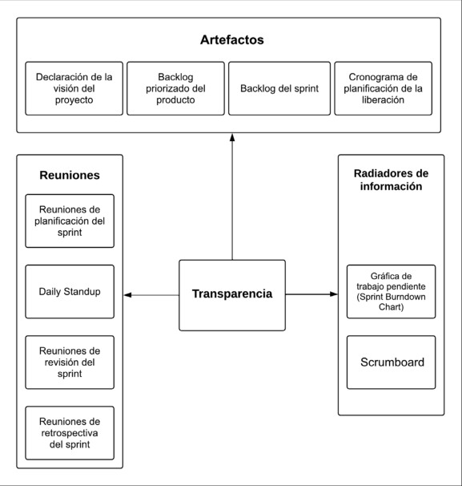

**Figura 2-1: Transparencia en Scrum** 

La Figura 2-2 es una interfaz de Vabro, que muestra un backlog de productos priorizados. Promueve la transparencia al permitir que los miembros del equipo accedan y administren los elementos del trabajo pendiente de forma abierta. 

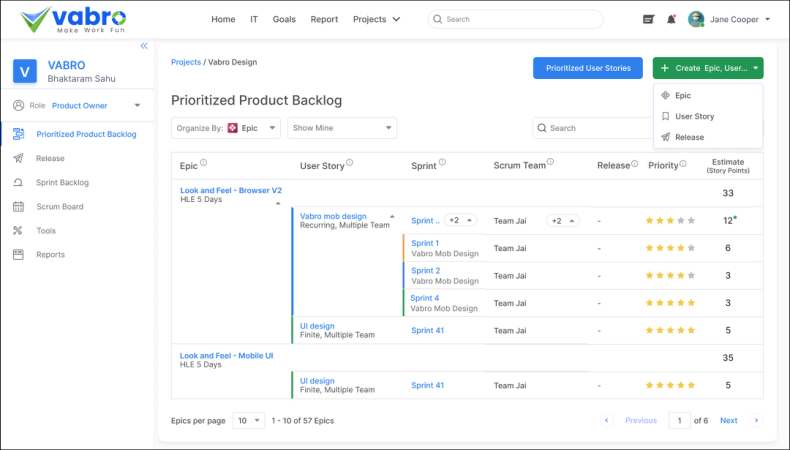

**Figura 2-2: Transparencia facilitada a través de la cartera de productos (Fuente: Vabro)** 

**28** © 2025 SCRUMstudy™. _Una guía para el cuerpo de conocimiento de Scrum (Guía SBOK)_ 

2 – PRINCIPIOS 

**2** 

La figura 2-3 muestra una interfaz de Jira que muestra un Product Backlog abierto. Apoya la transparencia de Scrum al hacer que las prioridades y los estados de las tareas sean accesibles para todo el equipo. 

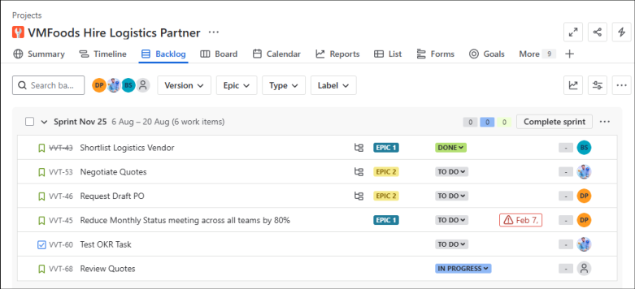

**Figura 2-3: Cartera de productos abierta utilizada para la transparencia (Fuente: Jira)** 

#### **2.2.2 Inspección** 

La inspección en Scrum se representa por medio de lo siguiente: 

- El uso de un Scrumboard en común y otros radiadores de información que muestran el progreso del Equipo Scrum en completar las tareas del sprint actual. 

- Obtener la retroalimentación del cliente y otros interesados del negocio durante los procesos de _Desarrollar épicas_ , _Crear el backlog priorizado del producto_ y _Realizar la planificación de la liberación_ . 

- La inspección y aprobación de los entregables por parte del Product Owner y el cliente en el proceso de _Demostrar y validar el sprint._ 

La Figura 2-4 ilustra el concepto de inspección en Scrum, destacando cómo las revisiones periódicas durante los Scrums Diarios y las Revisiones de Sprint apoyan la mejora continua. 

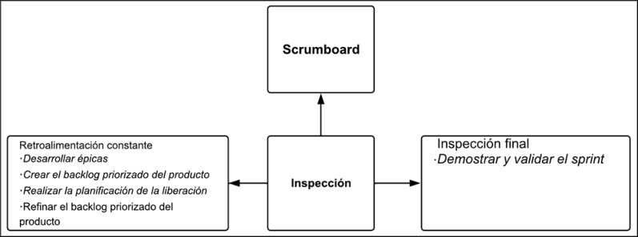

• • 

**Figura 2-4: Inspección en Scrum** 

©2025 SCRUMstudy™. _Una guía para el cuerpo de conocimiento de Scrum (Guía SBOK®)_ **29** 

2 – PRINCIPIOS 

La Figura 2-5 es una interfaz de Vabro, que muestra cómo las herramientas impulsadas por IA respaldan la transparencia a través del seguimiento en tiempo real, las actualizaciones visuales y la visibilidad de las tareas. 

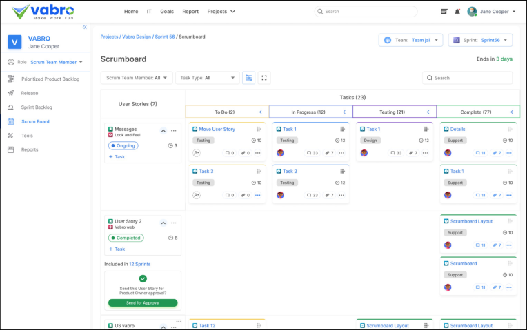

**Figura 2-5: Transparencia en Scrum mediante el uso de la herramienta de proyectos Scrum impulsada por IA (Fuente: Vabro)** 

La figura 2-6 es una interfaz de Jira, que muestra cómo las herramientas de IA permiten la transparencia al mostrar los estados de las tareas, los comentarios y las actualizaciones en tiempo real en todo el tablero del proyecto. 

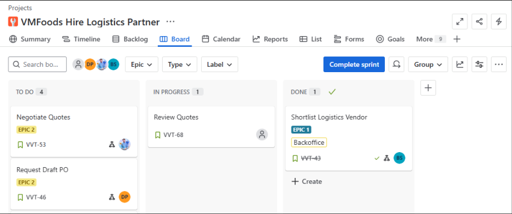

**Figura 2-6: Transparencia en Scrum mediante el uso de la herramienta de proyectos Scrum impulsada por IA (Fuente: Jira)** 

**30** © 2025 SCRUMstudy™. _Una guía para el cuerpo de conocimiento de Scrum (Guía SBOK)_ 

2 – PRINCIPIOS 

**2** 

#### **2.2.3 Adaptación** 

La adaptación se da cuando el equipo principal de Scrum y los interesados del negocio aprenden mediante la transparencia y la inspección, y después se adaptan al hacer mejoras en el trabajo que llevan a cabo. Algunos ejemplos de oportunidades para la adaptación en el marco de trabajo de Scrum son: 

- En el Daily Standup, los miembros del Equipo Scrum hablan abiertamente sobre los impedimentos para completar sus tareas y buscan la ayuda de otros miembros del equipo. Los miembros con más experiencia en el Equipo Scrum también ayudan a quienes tienen relativamente menos experiencia en el conocimiento del proyecto o de la tecnología. 

- Se lleva a cabo la identificación del riesgo y se repite a lo largo del proyecto. Los riegos que se identifican se convierten en entradas para varios procesos de Scrum, incluyendo: _Crear el backlog priorizado del producto_ , _Refinar el backlog priorizado del producto_ y _Demostrar y validar el sprint_ . 

- Las mejoras pueden resultar en solicitudes de cambios que se discuten y aprueban durante los procesos de _Desarrollar_ épicas, _Crear el backlog priorizado del producto_ y _Refinar el backlog priorizado del producto._ 

- El Scrum Guidance Body interactúa con los miembros del Equipo Scrum durante los procesos de _Crear historias de usuario_ , _Estimar tareas_ , _Crear entregables_ y _Refinar el backlog priorizado del producto_ para ofrecer orientación y también proporcionar conocimientos según sea necesario. 

- En el proceso de _Retrospectiva del sprint_ se determinan las mejoras aceptadas con base en las salidas del proceso de _Demostrar y validar el sprint_ . 

- En la reunión de retrospectiva de la liberación, los participantes documentan las lecciones aprendidas y realizan revisiones en busca de oportunidades para mejorar los procesos y atender ineficiencias. 

©2025 SCRUMstudy™. _Una guía para el cuerpo de conocimiento de Scrum (Guía SBOK®)_ **31** 

2 – PRINCIPIOS 

La figura 2-7 resume el concepto de adaptación en Scrum. 

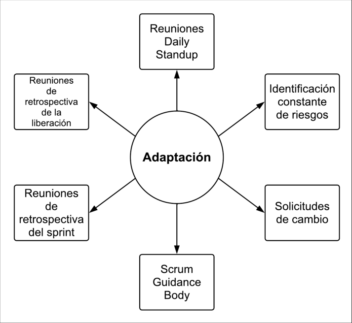

**Figura 2-7: Adaptación en Scrum** 

Con otros métodos, como el modelo tradicional en cascada, se requiere de una planificación considerable que debe hacerse por adelantado, y el cliente generalmente no revisa los componentes del producto hasta casi el final de una fase o del proyecto. Con frecuencia este método presenta enormes riesgos al éxito del proyecto, ya que tiene más potencial para impactar considerablemente la entrega de proyectos y la aceptación del cliente. La interpretación y comprensión del cliente sobre el producto final puede ser muy diferente de lo que realmente se entendió a lo producido por el equipo y esto puede no ser conocido hasta muy tarde en el desarrollo del proyecto. 

**32** © 2025 SCRUMstudy™. _Una guía para el cuerpo de conocimiento de Scrum (Guía SBOK)_ 

2 – PRINCIPIOS 

**2** 

La figura 2-8 muestra un ejemplo de estos retos. 

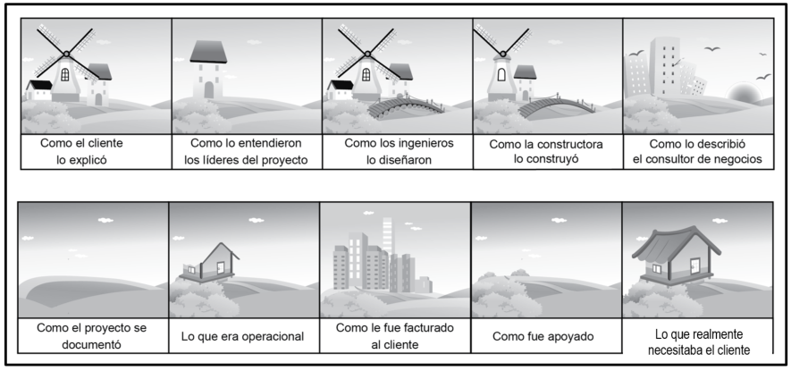

**Figura 2-8: Retos en la gestión tradicional de proyectos** 

©2025 SCRUMstudy™. _Una guía para el cuerpo de conocimiento de Scrum (Guía SBOK®)_ **33** 

2 – PRINCIPIOS 

### **2.3 Autoorganización** 

Scrum sostiene que los empleados son automotivados y que buscan aceptar mayores responsabilidades. Por tanto, ofrecen mucho más valor cuando se autoorganizan. 

El estilo de liderazgo preferente en Scrum es el “liderazgo colaborativo”, el cual enfatiza el logro de resultados, centrándose en las necesidades del Equipo Scrum. Véase la sección 3.10.3, donde se describen varios estilos de liderazgo y de gestión. 

La autoorganización no significa que a los miembros del equipo se les permita actuar como quieran. Solo significa que una vez que la visión del producto se define en el proceso de _Crear la visión del proyecto_ , se identifica al Product Owner, al Scrum Master y al Equipo Scrum. Asimismo, el equipo principal de Scrum trabaja estrechamente con los interesados del negocio para perfeccionar los requisitos a medida que avanzan a través de los procesos de _Desarrollar épicas_ y _Crear historias de usuario_ . La experiencia del equipo se utiliza para evaluar las entradas necesarias para realizar la obra prevista del proyecto. Este juicio y experiencia se aplican a todos los aspectos técnicos y de gestión de proyectos durante el proceso de la _Crear entregables_ . 

Aunque la priorización la hace principalmente el Product Owner, quien representa la voz del cliente, el Equipo Scrum autoorganizado participa en la distribución y estimación de tareas durante los procesos de _Identificar de tareas_ y _Estimar de tareas_ . Durante estos procesos, cada miembro del equipo tiene la responsabilidad de determinar qué tipo de trabajo hará. El Equipo Scrum también le ayuda al Product Owner a identificar riesgos y dependencias. Durante la ejecución de un sprint, los miembros del equipo tal vez necesiten ayuda para completar sus tareas. Scrum aborda esto mediante de la interacción constante obligatoria en las reuniones Daily Standup. El propio Equipo Scrum interactúa con otros equipos mediante las reuniones de Scrum de Scrums y, de ser necesario, puede buscar orientación adicional del Scrum Guidance Body. 

Por último, el Equipo Scrum y el Scrum Master trabajan de cerca para demostrar el incremento del producto creado durante el sprint en el proceso de _Demostrar y validar el sprint_ , donde se aceptan los entregables debidamente completados. Dado que los entregables son potencialmente enviables (y el backlog priorizado del producto se prioriza por historias de usuario en el orden del valor creado por ellas), el Product Owner y el cliente pueden visualizar y articular claramente el valor creado después de cada sprint; y el Equipo Scrum a su vez tiene la satisfacción de ver que su arduo trabajo es aceptado por parte del cliente y los interesados del negocio. 

#### **2.3.1 Beneficios de la autoorganización** 

La autoorganización, como un principio fundamental en Scrum, conduce a: 

- Un sentido de compromiso del equipo y de responsabilidad compartida; 

- Motivación, lo cual conduce a un mejor nivel de rendimiento del equipo; 

- Un ambiente de trabajo innovador y creativo que conduzca al crecimiento; 

- La selección del mejor y más sencillo método para cumplir con requisitos establecidos. 

Los principales objetivos de los equipos autoorganizados son los siguientes: 

- Entender la visión del proyecto y por qué el proyecto aporta valor a la organización 

**34** © 2025 SCRUMstudy™. _Una guía para el cuerpo de conocimiento de Scrum (Guía SBOK)_ 

2 – PRINCIPIOS 

**2** 

- Estimar historias de usuario durante el proceso de _Estimar historias de usuario_ y asignarse tareas durante el proceso de _Actualizar el backlog del sprint_ . 

- Identificar tareas en forma independiente durante el proceso de _Identificación de tareas_ 

- Aplicar y aprovechar la experiencia de ser un equipo interdisciplinario al trabajar en las tareas durante el proceso de _Crear entregables_ 

- Entregar resultados tangibles que sean aceptados por el cliente y otros interesados del negocio durante el proceso de _Demostrar y validar el sprint_ 

- Resolver problemas individuales analizándolos durante el Daily Standup 

- Aclarar cualquier discrepancia o duda y tener la disposición de aprender cosas nuevas 

- Actualizar los conocimientos y habilidades de manera continua a través de constantes interacciones dentro del equipo 

- Mantener la estabilidad de los miembros del equipo durante la duración del proyecto al no cambiar los miembros, a menos que sea inevitable 

La figura 2-9 ilustra los objetivos de un equipo autoorganizado. 

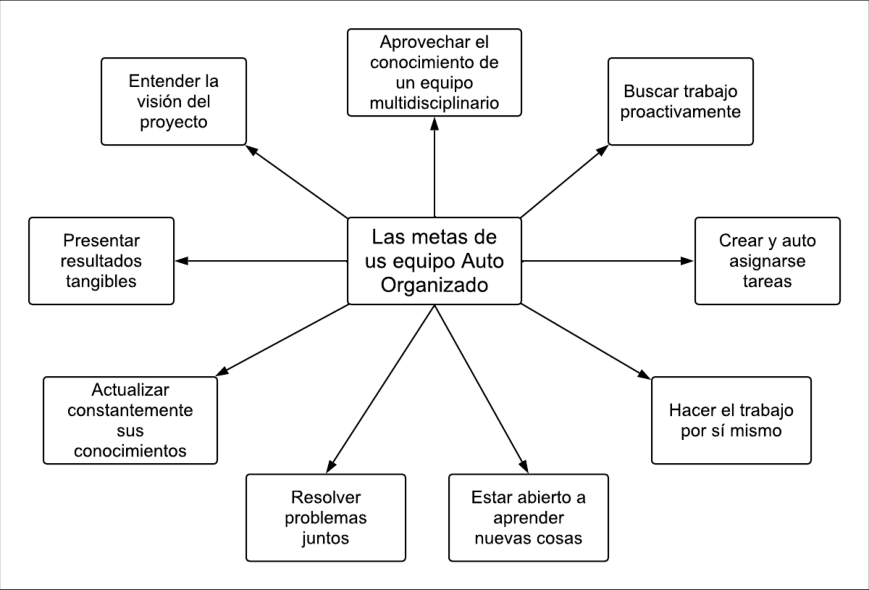

**Figura 2-9: Objetivos de un equipo autoorganizado** 

©2025 SCRUMstudy™. _Una guía para el cuerpo de conocimiento de Scrum (Guía SBOK®)_ **35** 

2 – PRINCIPIOS 

La Figura 2-10 es una interfaz de Vabro, que muestra un Scrumboard que facilita la autoorganización al permitir la asignación de tareas, el seguimiento y las actualizaciones de estado en tiempo real. 

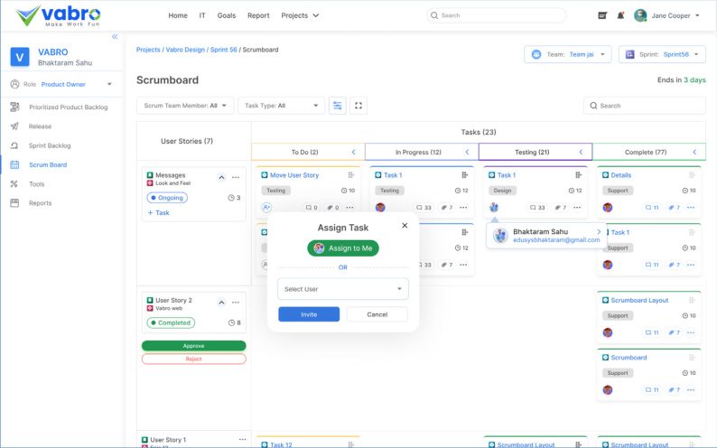

**Figure 2-10: Facilitar la autoorganización a través del Scrumboard en una herramienta de proyecto Scrum impulsada por IA (Fuente: Vabro)** 

La Figura 2-11 es una interfaz de Jira, que representa un Scrumboard que permite la autoorganización a través de la gestión visual de tareas, promoviendo la autonomía y la colaboración. 

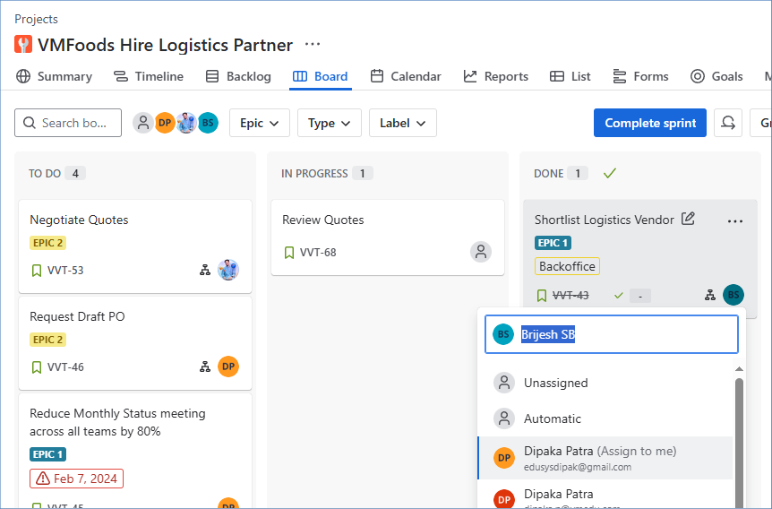

**Figure 2-11: Autoorganización habilitada para Scrumboard en la herramienta Scrum impulsada por IA (Fuente: Jira)** 

**36** © 2025 SCRUMstudy™. _Una guía para el cuerpo de conocimiento de Scrum (Guía SBOK)_ 

2 – PRINCIPIOS 

**2** 

### **2.4 Colaboración** 

La colaboración en Scrum se refiere a que el equipo principal de Scrum trabaja e interactúa con los interesados del negocio para crear y validar los resultados del proyecto a fin de cumplir con los objetivos que se plantean en la visión del proyecto. Es importante tener en cuenta la diferencia entre cooperación y colaboración. La cooperación se da cuando el trabajo que se produce consiste en la suma de los esfuerzos del trabajo de varias personas en un equipo. La colaboración, en cambio, se produce cuando un equipo trabaja en conjunto para contraponer los aportes del otro a fin de producir algo más grande. Para lograr una colaboración total, es importante establecer confianza entre todos los miembros del equipo y entre el equipo y los interesados del negocio. 

Las dimensiones básicas de trabajo en la colaboración son las siguientes: 

- **Conciencia:** Las personas que trabajan juntas deben de conocer el trabajo de los demás. 

- **Articulación:** Los colaboradores deben distribuir el trabajo en unidades; dividir las unidades entre los miembros del equipo y después reintegrarlo cuando el trabajo esté hecho. 

- **Apropiación:** Adaptar la tecnología a la situación individual; la tecnología se puede utilizar de forma completamente distinta a lo esperado por los diseñadores. 

#### **2.4.1 Beneficios de la colaboración en los proyectos de Scrum** 

El _Manifiesto Ágil_ (Fowler y Highsmith, 2001) hace énfasis en la “colaboración con el cliente sobre negociación contractual”. Por lo tanto, el marco de trabajo de Scrum adopta un enfoque donde los miembros del equipo principal de Scrum (Product Owner, Scrum Master y Equipo Scrum) colaboran entre sí y con los interesados del negocio para crear los entregables que proporcionan el mayor valor posible para el cliente. Esta colaboración se produce durante todo el proyecto. 

La colaboración asegura que los siguientes beneficios del proyecto se realicen: 

- **Se reducen las solicitudes de cambio** 

La necesidad de cambios debido a requisitos mal clarificados se reduce al mínimo. Por ejemplo, durante los procesos de _Crear la visión del proyecto_ , _Desarrollar épicas_ y _Crear el backlog priorizado del producto_ , el Product Owner colabora con los interesados del negocio para crear la visión del proyecto, las épicas y el backlog priorizado del producto, respectivamente. Esto asegurará que haya claridad entre los miembros principales del Equipo Scrum sobre el trabajo que se requiere para completar el proyecto. El Equipo Scrum colabora continuamente con el Product Owner y los interesados del negocio a través de un backlog priorizado del producto transparente para crear los entregables del proyecto. Los procesos de _Realizar Dialy Standup_ , _Refinar el backlog priorizado del producto_ y la _Retrospectiva del sprint_ dan margen a los miembros del equipo principal de Scrum para discutir lo que se ha hecho y colaborar en lo que hay que hacer. De esta manera se minimiza el número de solicitudes de cambio por parte del cliente. 

©2025 SCRUMstudy™. _Una guía para el cuerpo de conocimiento de Scrum (Guía SBOK®)_ **37** 

2 – PRINCIPIOS 

- **Los riesgos se identifican y se mitigan con eficiencia** 

Los riesgos se identifican y se atienden con eficiencia. Por ejemplo, los riesgos del proyecto se identifican y evalúan en los procesos del _Desarrollar épicas_ , _Crear entregables_ y _Realizar el Daily Standup_ por parte de los miembros del equipo principal de Scrum. Las herramientas de la reunión de revisión de Scrum, tales como el Daily Standup, la reunión de planificación del Sprint, la reunión de revisión del backlog priorizado del producto, entre otras, brindan oportunidades para el equipo no solo identifique y evalúe los riesgos, sino que implemente también respuestas (tales como mitigación de riesgos) para atender riesgos de alta prioridad. 

- **Aumenta la eficiencia** 

Se logra el verdadero potencial del equipo. Por ejemplo, el proceso de _Realizar el Daily Standup_ ofrece un margen para que el Equipo Scrum colabore y entienda las fortalezas y debilidades de sus miembros. Si un miembro del equipo excedió el plazo para completar una tarea, los miembros del Equipo Scrum trabajan juntos para terminarla y cumplir con los objetivos acordados para completar el sprint. 

- **Se incorpora la mejora continua** 

Se garantiza la mejora continua a través de las lecciones aprendidas. Por ejemplo, el Equipo Scrum utiliza el proceso de _Retrospectiva del sprint_ para identificar lo que salió bien y lo que no salió bien en el sprint anterior. Esto proporciona una oportunidad para que el Scrum Master trabaje con el equipo y esté más preparado para el próximo sprint. Esto también garantiza que la colaboración sea aún más eficaz en el siguiente sprint. 

La figura 2-12 ilustra los beneficios de la colaboración en los proyectos de Scrum. 

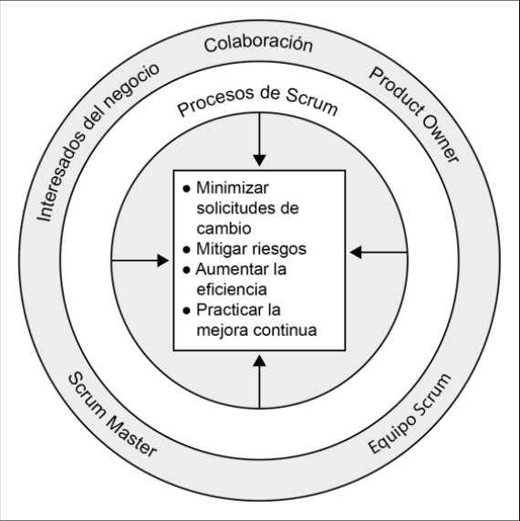

**Figura 2-12: Beneficios de la colaboración en proyectos de Scrum** 

**38** © 2025 SCRUMstudy™. _Una guía para el cuerpo de conocimiento de Scrum (Guía SBOK)_ 

2 – PRINCIPIOS 

**2** 

La Figura 2-13 es una interfaz de Vabro, que muestra un Centro de Mensajes en una herramienta Scrum impulsada por IA. Admite la comunicación y la colaboración en tiempo real entre los miembros del equipo. 

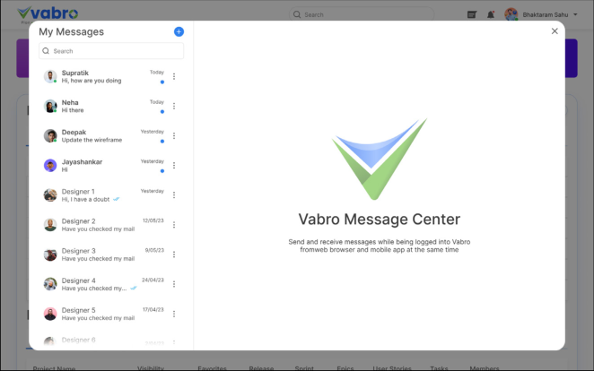

**Figure 2-12: Centro de mensajes en una herramienta de proyecto Scrum impulsada por IA (Fuente: Vabro)** 

La Figura 2-14 es una interfaz de Vabro, que muestra una vista detallada de tareas diseñada para mejorar la colaboración, con comentarios, asignaciones e historial de tareas. 

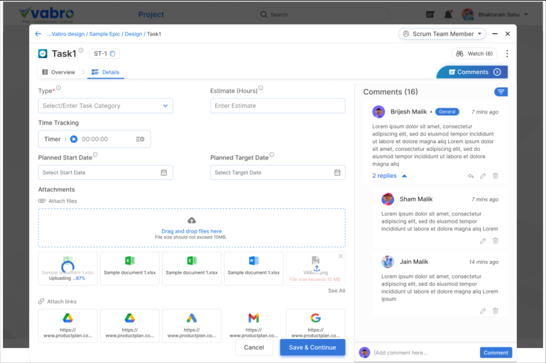

**Figure 2-13: Vista de detalles de tareas para mejorar la colaboración (Fuente: Vabro)** 

©2025 SCRUMstudy™. _Una guía para el cuerpo de conocimiento de Scrum (Guía SBOK®)_ **39** 

2 – PRINCIPIOS 

#### **2.4.2 La importancia de la coubicaciؚón en la colaboración** 

En muchas de las prácticas de Scrum se requiere una comunicación de banda ancha. Por tanto, es preferible que los miembros del equipo estén coubicados. La coubicación permite la interacción formal e informal entre los miembros del equipo. Esto brinda la ventaja de contar con miembros del equipo siempre a la mano para facilitar la coordinación, la resolución de problemas y el aprendizaje. Algunos de los beneficios de la coubicación son los siguientes: 

- Las preguntas se contestan rápidamente. 

- Los problemas se solucionan en el momento. 

- Hay menos fricción entre las interacciones. 

- La confianza se gana con mucha más rapidez. 

#### **2.4.3 Colaboración en equipos dispersos** 

Aunque es preferible contar con equipos coubicados, en ocasiones el Equipo Scrum puede estar disperso. Varios equipos pueden estar trabajando desde distintas ubicaciones (incluso en distintos países) o incluso desde casa. Aun cuando los equipos están coubicados, deben estar siempre preparados para tener la flexibilidad de trabajar desde casa o a distancia debido a circunstancias atenuantes que pudieran afectar la capacidad del equipo para trabajar en un entorno coubicado. En tales situaciones, pudiera ser necesario asegurar que Scrum funcione con equipos dispersos. 

##### **2.4.3.1 Herramienta para un proyecto de Scrum** 

Se recomienda que las compañías busquen herramientas para un proyecto Scrum a fin de asegurar el trabajo disperso y garantizar que los equipos pueden trabajar productivamente, incluso cuando todos los miembros del equipo estén coubicados en el mismo centro de trabajo. Las herramientas deben tener la capacidad para: 

- Definir bien todos los roles de Scrum y contar con la función de mensajería o colaboración a fin de que todos los miembros del equipo puedan interactuar entre sí; 

- Crear y hacer uso de artefactos importantes de Scrum tales como el backlog priorizado del producto, el backlog del sprint, el Scrumboard, etc. 

- Hacer que el flujo de trabajo avance por todos los procesos de Scrum que forman parte de las fases de inicio, planificación, implementación y liberación. 

- Escalar hacia niveles de la organización o de la empresa (en caso de que Scrum se implemente dentro de grandes organizaciones o empresas). 

- Programar reuniones de Scrum tales como las reuniones de planificación de la liberación, el Daily Standup, las reuniones de planificación del sprint, las reuniones de retrospectiva del sprint, las reuniones de revisión del backlog priorizado del producto, etc. Sin embargo, la reunión en sí se puede llevar a cabo por medio de una herramienta para videoconferencias. 

**40** © 2025 SCRUMstudy™. _Una guía para el cuerpo de conocimiento de Scrum (Guía SBOK)_ 

2 – PRINCIPIOS 

**2** 

- Ayudar a que los miembros del Equipo Scrum se comuniquen fácilmente entre sí en línea, ya sea uno a uno por medio de grupos dispersos o grupos de discusión (debido a que los equipos eficazmente distribuidos se comunican entre sí constantemente). Sin embargo, a diferencia de los equipos coubicados, los miembros de los equipos dispersos deben entender que otros integrantes pudieran no estar disponibles al mismo tiempo en los medios de comunicación instantánea. 

- Anotar las lecciones aprendidas (de las retrospectivas, etc.) con informes apropiados que se generan en el momento. 

- Incorporar la automatización a fin de que cualquier plantilla o guía del Scrum Guidance Body esté a disposición de todos los equipos en la organización (por ejemplo: la definición de listo o la definición de terminado). 

- Ayudar a que el SGB evalúe el comportamiento relacionado a Scrum (como el número máximo de integrantes, la duración del sprint, etc.). 

- Ofrecer la capacidad para clonar proyectos similares, épicas e historias de usuario. Esto permitirá que los integrantes del Equipo Scrum dediquen menos tiempo en documentación innecesaria y puedan aprender de experiencias de trabajo previamente realizado. Esto resulta especialmente útil cuando los Equipo Scrum utilizan procesos similares de implementación para crear categorías idénticas de productos. Por ejemplo: compañías de publicidad que desarrollan anuncios impresos para distintos clientes; empresas constructoras que elaboran planos para carreteras similares, etc. 

Los beneficios de utilizar una herramienta para un proyecto de Scrum en un equipo disperso son: 

- Facilita el trabajo de los integrantes del equipo en cualquier momento y en cualquier lugar. 

- Automatiza los informes, los diagramas, los calendarios, los flujos de trabajo, etc. 

- Aplicación de lineamientos similares en la organización mediante la automatización de las recomendaciones del SGB. 

- Aumenta la eficiencia debido a la disminución de documentación innecesaria y repetitiva al hacer clonaciones de proyectos similares (por ejemplo: clonación de épicas e historias de usuario). 

- Se trabaja con un equipo más diverso (en ocasiones se trabaja desde distintos países) que ofrece su perspectiva regional y su experiencia. 

- Menos retos logísticos en comparación a la necesidad de asegurar que todas las personas trabajen desde una sola ubicación. Se ahorran tiempos y costos en los gastos de viajes, centros de trabajo costosos, etc. 

En los equipos dispersos es importante prestar especial atención a los principios de Scrum a fin de asegurar de que se implementen en los equipos dispersos. Debe haber énfasis en la capacidad de trabajar en forma colaborativa y transparente en un ambiente de confianza. 

©2025 SCRUMstudy™. _Una guía para el cuerpo de conocimiento de Scrum (Guía SBOK®)_ **41** 

2 – PRINCIPIOS 

#### **2.4.4 Herramienta de proyecto Scrum impulsada por IA** 

Se recomienda encarecidamente el uso de una herramienta de proyecto Scrum colaborativa impulsada por Inteligencia Artificial (IA) para garantizar que los miembros del equipo puedan trabajar de manera productiva. Las empresas han informado de un aumento de hasta el 70% en la productividad y un aumento del 60% en el retorno de la inversión mediante el uso de una herramienta de proyecto Scrum adecuada impulsada por IA. 

Lo ideal es que la herramienta tenga la capacidad de: 

- Defina de manera eficiente todos los roles de Scrum y proporcione funcionalidad de mensajería/colaboración para que todos los miembros del equipo interactúen entre sí. 

- Cree y trabaje a través de artefactos importantes de Scrum, como el trabajo pendiente de productos priorizados, el trabajo pendiente de sprint, Scrumboard, etc. 

- Proporcione el flujo de trabajo para trabajar a través de diferentes procesos de Scrum involucrados en las fases de inicio, planificación, implementación, retrospectiva y lanzamiento. 

- Escalar a niveles de organización o empresa (si Scrum se está implementando dentro de una gran organización/empresa). 

- Programe reuniones relacionadas con Scrum, como reuniones de planificación de lanzamientos, reuniones de pie diarias, reuniones de planificación de sprints, reuniones de revisión de sprints, reuniones de sprint retrospectivas, reuniones de revisión de backlog de productos, etc. Sin embargo, las reuniones reales pueden llevarse a cabo en una herramienta de videoconferencia separada. 

- Permitir que los miembros del equipo Scrum se comuniquen fácilmente entre sí en línea, ya sea uno a uno o a través de grupos distribuidos y/o foros de discusión (ya que los equipos Scrum ubicados de manera efectiva se comunican entre sí regularmente); (Sin embargo, tenga en cuenta que, a diferencia de los equipos colocados, los miembros del equipo en equipos distribuidos deben comprender que es posible que otros miembros del equipo no estén disponibles al mismo tiempo para la comunicación instantánea). 

- Capture las lecciones aprendidas (de retrospectivas, etc.) con informes apropiados generados sobre la marcha. 

- Incorpore la automatización para que las plantillas o directrices del Cuerpo de Orientación de Scrum estén disponibles para todos los equipos de Scrum de la organización (por ejemplo, la Definición de Listo o la Definición de Hecho). 

- Permitir que el SGB evalúe el comportamiento relacionado con Scrum (como el número máximo de miembros del equipo, la duración de los Sprints, etc.). 

- Clonar de proyectos similares, epopeyas e historias de usuario: esto permitirá a los miembros del equipo de Scrum dedicar menos tiempo a crear documentación innecesaria o duplicada y aprender de las experiencias de trabajos similares completados. 

**42** © 2025 SCRUMstudy™. _Una guía para el cuerpo de conocimiento de Scrum (Guía SBOK)_ 

2 – PRINCIPIOS 

**2** 

(Esto es especialmente beneficioso cuando los equipos de Scrum utilizan procesos de implementación similares para crear categorías idénticas de productos, por ejemplo, una empresa de publicidad que crea anuncios impresos para diferentes Clientes; una empresa constructora que crea dibujos para actividades similares de construcción de carreteras, y así sucesivamente). 

##### **2.4.4.1 Uso de una herramienta de proyecto Scrum impulsada por IA para equipos distribuidos:** 

Entre las ventajas de utilizar una herramienta de proyectos Scrum impulsada por IA para equipos distribuidos se incluyen las siguientes: 

- Facilitar a los miembros del equipo Scrum trabajar en cualquier momento y desde cualquier lugar 

- Automatización de informes, chats, calendario, flujos de trabajo, etc. 

- Aplicación de directrices estándar en toda la organización mediante la automatización de las recomendaciones de SGB 

- Aumento de la eficiencia debido a la disminución del tiempo dedicado a la creación de documentación repetitiva o innecesaria al clonar de proyectos similares (por ejemplo, clonar epopeyas e historias de usuario) 

- Trabajar con un equipo más diverso (a veces trabajando desde diferentes países) a menudo incorpora perspectivas y experiencias locales 

- Menos desafíos logísticos en comparación con los desafíos que pueden surgir al garantizar que todos los miembros del equipo trabajen desde un solo lugar. Esto también puede ahorrar tiempo y costos por gastos relacionados con viajes, lugares de trabajo costosos, etc 

- Es importante que los equipos distribuidos presten especial atención a los principios de Scrum para asegurarse de que se cumplen. Se debe hacer hincapié en permitir un entorno de trabajo transparente y colaborativo de confianza. 

##### **2.4.4.2 Cómo la IA mejora los proyectos de Scrum: detallados por componente** 

##### **1. Gestión de la cartera de productos** 

**Desafíos:** Desglosar proyectos, epopeyas o historias de usuario, priorizar elementos, mantener la claridad y alinearse con los objetivos empresariales. 

##### **Soluciones de IA:** 

Desglose impulsado por IA: herramientas como Vabro Genie AI, Jira plugins, etc., pueden dividir los proyectos en epopeyas, historias de usuario y tareas, e incluso proporcionar estimaciones de muestra, prioridades, categorías y otras características asociadas con los artefactos del Product Backlog. 

©2025 SCRUMstudy™. _Una guía para el cuerpo de conocimiento de Scrum (Guía SBOK®)_ **43** 

2 – PRINCIPIOS 

Esto puede basarse en la experiencia de proyectos similares, ya sea dentro de la empresa o de otras organizaciones. Los equipos de proyecto pueden ahorrar hasta un 70% de su esfuerzo en la definición de proyectos, epopeyas, historias de usuario y tareas mediante el uso de una herramienta Scrum adecuada habilitada para IA. 

- Priorización impulsada por IA: Herramientas como Aha! o los plugins de Jira pueden analizar el valor empresarial, el coste y los comentarios de los clientes para priorizar automáticamente los elementos del backlog. 

- Intelligent Classification: AI-powered Scrum Tools can tag, and group backlog items based on type (bug, feature, enhancement). 

- NLP for User Story Generation: AI can convert emails, support tickets, or user feedback into structured backlog items. 

- Duplicate Detection: AI can automatically detect and merge duplicate user stories. 

- Backlog Refining Assistant: AI chatbots or assistants (like Vabro Genie AI, ChatGPT etc.) can suggest improvements, clarify acceptance criteria, or identify missing details. 

##### **2. Planificación de sprints** 

**Desafíos:** Estimación precisa y definición del alcance. 

##### **Soluciones de IA:** 

- Estimación del esfuerzo: Los modelos de IA entrenados con datos históricos de sprint pueden predecir el tiempo/esfuerzo necesario para las nuevas historias de usuario. 

- Análisis de la capacidad del equipo: los informes impulsados por IA pueden ayudar a evaluar la velocidad histórica, la disponibilidad y las habilidades para recomendar objetivos de sprint realistas. 

- Optimización del alcance del sprint: La IA puede ayudar a sugerir la mejor combinación de historias para el sprint en función del esfuerzo y el valor empresarial. 

##### **3. Scrum diario (reuniones de pie)** 

**Desafíos:** Coordinación en equipos remotos/distribuidos, standups improductivos. 

##### **Soluciones de IA:** 

- Actualizaciones de estado automatizadas: Los bots pueden resumir el progreso y los problemas de herramientas como Vabro, Jira, Git, Slack, etc. 

- Speech-to-Text + Sentiment Analysis: Las herramientas de IA como Microsoft Copilot, IBM Watsonx, Claude, etc. pueden transcribir las reuniones diarias y evaluar la moral del equipo. 

- Alertas proactivas de problemas: la IA puede detectar bloqueadores o riesgos de las discusiones y notificar automáticamente a las partes interesadas. 

**44** © 2025 SCRUMstudy™. _Una guía para el cuerpo de conocimiento de Scrum (Guía SBOK)_ 

2 – PRINCIPIOS 

**2** 

##### **4. Revisión del sprint** 

**Desafíos:** Preparación que requiere mucho tiempo, desalineación en el valor entregado. 

##### **Soluciones de IA:** 

- Asistencia en la preparación de demostraciones: La IA puede generar informes adecuados, guiones de demostración o resúmenes basados en el trabajo realizado, por ejemplo, informes de IA de Vabro Genie. 

- Análisis de comentarios de las partes interesadas: Los modelos de NLP pueden analizar y categorizar los comentarios de las partes interesadas para actualizar el backlog del producto. 

- Visualización del progreso: la IA puede generar automáticamente informes visuales y paneles que muestran los logros de los sprints. 

##### **5. Retrospectiva del Sprint** 

**Desafíos:** Comentarios vagos, falta de información procesable. 

##### **Soluciones de IA:** 

- Análisis de sentimientos y temas: Herramientas como Retrium con IA pueden analizar el tono de retroalimentación e identificar los temas dominantes. 

- Reconocimiento de patrones: La IA puede detectar problemas recurrentes (por ejemplo, corrupción del alcance, retrasos) en múltiples sprints mediante el uso de potentes informes impulsados por IA. 

- Sugerencia de elemento de acción: La IA puede proponer mejoras concretas basadas en el rendimiento de los sprints anteriores y las mejores prácticas comunes. 

##### **Herramientas de IA comúnmente utilizadas en proyectos Scrum** 

|**Herramienta de IA**|**Caso de uso**|
|---|---|
|**Vabro.ai**|Completa herramienta Scrum impulsada por IA para todo el proyecto Scrum|
|**ChatGPT**|Refinamiento de historias de usuario, perspectivas retrospectivas, resúmenes de reuniones|
|**Plugins de Jira AI**|Limpieza inteligente del backlog, detección de riesgos e informes|
|**IA de ClickUp**|Resumen de tareas, seguimiento de objetivos y generación de contenido|
|**Retrio + IA**|Retrospectivas mejoradas con análisis de patrones/sentimientos|
|**Codacy/DeepCode**|Revisiones de código asistidas por IA y seguimiento de calidad|

©2025 SCRUMstudy™. _Una guía para el cuerpo de conocimiento de Scrum (Guía SBOK®)_ **45** 

2 – PRINCIPIOS 

|**Herramienta de IA**|**Caso de uso**|
|---|---|
|**Forecast.ai**|Gestión de recursos y estimación de esfuerzos|

**Tabla 2-1: Herramientas de IA comúnmente utilizadas en proyectos Scrum** 

##### **Beneficios de usar IA en Scrum** 

- Hasta un 70% de aumento de la productividad. 

- Desgloses y replicación más fáciles de proyectos, Epics, User Stories o Tasks. 

- Gestión eficiente de todos los roles de Scrum. 

- Informes completos y análisis de datos. 

- Mayor precisión en la estimación y predicción de riesgos. 

- Toma de decisiones más rápida con análisis de datos en tiempo real. 

- Aumento de la productividad del equipo a través de la automatización y reducción del esfuerzo manual. 

- Mejora de la satisfacción de las partes interesadas a través de una priorización más inteligente y una entrega más rápida. 

- Retrospectivas más sólidas al detectar patrones que los humanos pueden pasar por alto. 

##### **Desafíos y consideraciones** 

- Privacidad de datos: Las herramientas de IA deben cumplir con los estándares de gobernanza de datos (GDPR, etc.). 

- Sesgo en la IA: Los datos de entrenamiento pueden sesgar las recomendaciones de la IA: la supervisión humana es crucial. 

- Adopción por equipos: La IA debería ayudar, no reemplazar, la toma de decisiones humanas en Scrum. 

**46** © 2025 SCRUMstudy™. _Una guía para el cuerpo de conocimiento de Scrum (Guía SBOK)_ 

2 – PRINCIPIOS 

**2** 

### **2.5 Priorización basada en valor** 

El marco de trabajo de Scrum se guía por la finalidad de ofrecer el máximo valor de negocio en un mínimo período de tiempo. Una de las herramientas más eficaces para entregar el mayor valor en el menor tiempo posible es la priorización. 

La priorización se puede definir como la determinación del orden y la separación de lo que debe hacerse ahora, de lo que debe hacerse después. El concepto de priorización no es nuevo para la gestión de proyectos. El modelo tradicional de gestión de proyectos llamado cascada o _waterfall_ propone el uso de múltiples herramientas de priorización _._ Desde el punto de vista del director del proyecto, la priorización es integral debido a que ciertas tareas deben llevarse a cabo primero a fin de acelerar el proceso de desarrollo y el cumplimiento de los objetivos del proyecto. Algunas de las técnicas tradicionales de la priorización de tareas incluyen el establecer fechas límite para las tareas delegadas y el uso de matrices de priorización. 

Sin embargo, Scrum utiliza la priorización basada en valor como uno de los principios básicos que impulsa la estructura y funcionalidad de todo el marco de trabajo de Scrum; ayuda a que los proyectos se beneficien mediante la capacidad de adaptación y el desarrollo iterativo del producto o servicio. Y lo más importante: Scrum tiene como finalidad entregar un producto o servicio valioso para el cliente en forma oportuna y continua. La priorización se lleva a cabo por el Product Owner cuando prioriza las historias de usuario en el backlog priorizado del producto. Este contiene una lista de todos los requisitos necesarios para llevar el proyecto a buen término. 

Una vez que el Product Owner recibe los requerimientos del negocio del cliente, estos se escriben en forma de épicas e historias de usuario (un formato específico para anotar los requisitos). El Producto Owner trabaja con el cliente y otros interesados del negocio para establecer cuáles requisitos del negocio ofrecen el mayor valor de negocio. En ocasiones, un cliente puede ordenar que todas las historias de usuario sean de alta prioridad. Aunque este pudiera ser el caso, incluso una lista de alta prioridad de historias de usuario también debe ser priorizada dentro de la lista misma. El Product Owner debe entender lo que el cliente quiere y valora a fin de ordenar las historias de usuario en una lista de mayor a menor prioridad. A esta lista se le llama backlog priorizado del producto y debe incluir todos los requisitos del proyecto. Para priorizar un backlog es necesario establecer la importancia de cada historia de usuario. Los requisitos de alto valor se identifican y trasladan al principio del backlog priorizado del producto. Los procesos por los cuales el principio de la priorización basada en valor se pone en práctica son la _Crear el backlog priorizado del producto_ y _Refinar el backlog priorizado del producto._ 

Al mismo tiempo, el Product Owner debe trabajar con el Equipo Scrum para entender los riesgos y la incertidumbre del proyecto, ya que estos pueden tener consecuencias negativas. Esto riesgos se deben de tener en cuenta al priorizar las historias de usuario con enfoque basado en el valor (véase el capítulo sobre riesgos para leer más información al respecto). El Equipo Scrum también alerta al Product Owner sobre las dependencias que surgen de la implementación. Estas dependencias deben tenerse en cuenta durante la priorización. Esta puede basarse en una estimación subjetiva del valor proyectado del negocio o la rentabilidad, o puede basarse en los resultados y análisis del mercado utilizando herramientas, incluyendo, pero sin limitarse a, entrevistas del cliente, encuestas y modelos financieros y técnicas analíticas. 

©2025 SCRUMstudy™. _Una guía para el cuerpo de conocimiento de Scrum (Guía SBOK®)_ **47** 

2 – PRINCIPIOS 

El Product Owner debe interpretar las entradas y las necesidades de los proyectos de los interesados del negocio para crear el backlog priorizado del producto. Por lo tanto, mientras se priorizan las historias de usuario en el backlog priorizado del producto, se consideran los siguientes tres factores (vér la figura 2-15): 

1. Valor 

2. Riesgo o incertidumbre 

3. Dependencias 

De esta forma, la priorización resulta en entregables que satisfacen los requisitos del cliente con el objetivo de ofrecer el máximo valor de negocio en el menor tiempo posible. 

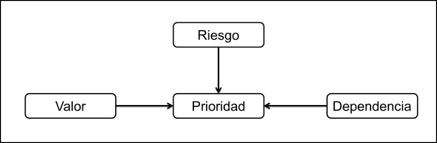

**Figura 2-15: Priorización basada en valor** 

La Figura 2-16 es una interfaz de Vabro, que muestra la priorización basada en el valor en la que las tareas se clasifican por importancia e impacto empresarial en una herramienta Scrum impulsada por IA. 

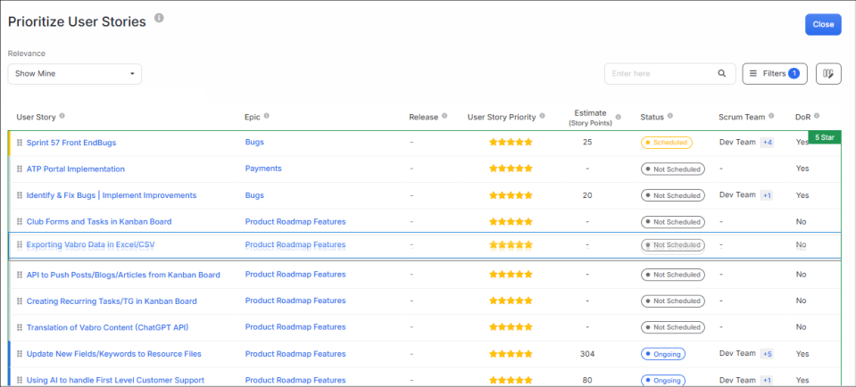

**Figura 2-16: Priorización basada en el valor en la herramienta de proyectos Scrum impulsada por IA (Fuente: Vabro)** 

**48** © 2025 SCRUMstudy™. _Una guía para el cuerpo de conocimiento de Scrum (Guía SBOK)_ 

2 – PRINCIPIOS 

**2** 

Figure 2-17 is an interface from Jira, showing value-based prioritization with numeric values assigned to tasks for prioritization based on business needs. 

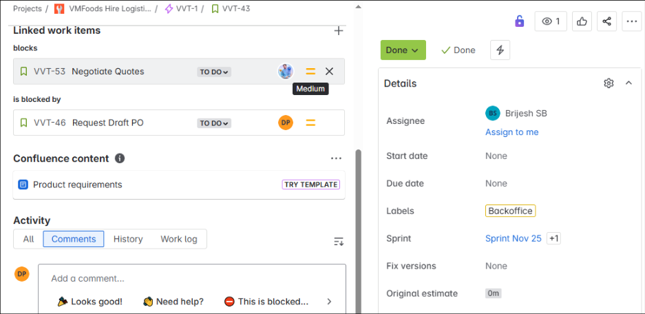

**Figura 2-17: Priorización basada en el valor en la herramienta de proyecto Scrum impulsada por IA (Fuente: Jira)** 

©2025 SCRUMstudy™. _Una guía para el cuerpo de conocimiento de Scrum (Guía SBOK®)_ **49** 

2 – PRINCIPIOS 

### **2.6 Time-boxing** 

Scrum trata al tiempo como uno de los limitantes más importantes en la gestión de un proyecto. Para hacer frente a los límites de tiempo, Scrum introduce un concepto de _Time-boxing_ (asignación de un bloque de tiempo), que propone fijar una cierta cantidad de tiempo a cada proceso y actividad en un proyecto de Scrum. Esto garantiza que los miembros del Equipo Scrum no dediquen mucho o poco tiempo a un trabajo determinado, y que no desperdicien su tiempo y energía en un trabajo que no entienden claramente. 

Algunas de las ventajas del Time-boxing son las siguientes: 

- Eficiencia en el proceso de desarrollo 

- Menos gastos generales 

- Alta velocidad para los equipos 

- Equipos más enfocados 

- Equipos mejor preparados 

El Time-boxing puede utilizarse en muchos procesos de Scrum, por ejemplo, en el proceso de _Realizar el Daily Standup_ , la duración de dicha reunión tiene un time-box asignado. A veces, el Time-boxing puede utilizarse para evitar la mejora excesiva de un elemento ( _gold-plating_ ). 

El Time-boxing es una práctica muy importante en Scrum y debe aplicarse con cuidado. Un time-box arbitrario puede llevar a la desmotivación del equipo y tener como consecuencia la creación de un ambiente tenso, por lo que se debe utilizar de manera apropiada. 

#### **2.6.1 Time-boxes de Scrum** 

- **Sprint:** Un sprint es una iteración con un time-box de una a cuatro semanas de duración durante el cual el Scrum Master guía, facilita y protege al Equipo Scrum de impedimentos tanto internos como externos durante el proceso de _Crear entregables_ . Esto ayuda a evitar una expansión de la visión más allá de su objetivo original, lo que podría afectar la meta del sprint. Durante este tiempo, el equipo trabaja para convertir las necesidades del backlog priorizado del producto en funcionalidades de productos fáciles de enviar. Para obtener los máximos beneficios de un proyecto Scrum, y para brindar mayor flexibilidad al cambio, la duración del sprint debe ser lo más corta posible. 

El sprint debe ser también lo suficientemente extenso para que el equipo pueda crear un producto liberable que pueda ser revisado y aprobado por el Product Owner. 

- **Reunión de planificación del sprint:** Esta reunión se lleva a cabo antes de cada sprint como parte de los procesos de _Comprometer historias de usuario_ , _Identificar tareas_ , _Estimar tareas_ y _Actualizar el backlog del sprint_ . Tiene un time-box de dos horas por cada semana de duración del sprint. Por ejemplo, en un sprint de un mes (cuatro semanas), el time-box de la reunión de planificación del sprint debe ser de ocho horas. 

La reunión de planificación del sprint tiene dos objetivos: 

**50** © 2025 SCRUMstudy™. _Una guía para el cuerpo de conocimiento de Scrum (Guía SBOK)_ 

2 – PRINCIPIOS 

**2** 

   1. Definición del objetivo: Durante la primera parte de la reunión, el Product Owner explica las historias de usuario de más alta prioridad o los requerimientos en el backlog priorizado del producto al Equipo Scrum. Después, el Equipo Scrum en colaboración con el Product Owner se compromete con las historias de usuario, las cuales definen la meta del sprint. 

   2. Identificación y estimación de tareas: El Equipo Scrum decide “cómo” completar los elementos seleccionados en el backlog priorizado del producto seleccionados para cumplir con la meta del sprint. Las historias de usuario comprometidas y las tareas con esfuerzo estimado se incluyen en el backlog priorizado del producto al que se le dará seguimiento. 

- **Daily Standup:** El Daily Standup es una breve reunión diaria con un time-box de 15 minutos. Los miembros del equipo se reúnen para informar sobre cómo avanza el proyecto, respondiendo a las siguientes tres preguntas: 

      1. ¿Qué he hecho desde la última reunión? 

      2. ¿Qué tengo planeado hacer antes de la siguiente reunión? 

      3. ¿Qué impedimentos u obstáculos (si los hubiera) estoy enfrentando actualmente? 

Esta reunión la lleva a cabo el equipo como parte del proceso de _Realizar el Daily Standup._ 

- **Reunión de revisión del sprint:** La reunión de revisión del sprint tiene un time-box de una hora por cada semana de duración del sprint. Por ejemplo, en un sprint de cuatro semanas, el time-box de la reunión de revisión del sprint debe ser de cuatro horas. Durante esta reunión, que se lleva a cabo en el proceso de _Demostrar y validar el sprint_ , el Equipo Scrum presenta los entregables del sprint actual al Product Owner. Este revisa el producto (o incremento del producto) para compararlo con los criterios de aceptación acordados y acepta o rechaza las historias de usuario completadas. 

- **Reunión de retrospectiva del sprint:** La reunión de retrospectiva del sprint tiene un time-box de una hora por cada semana de duración del sprint. Por ejemplo, en un sprint de cuatro semanas, el time-box de la reunión de retrospectiva del sprint debe ser de cuatro horas y se lleva a cabo como parte del proceso _Retrospectiva del sprint_ . Durante esta reunión, el Equipo Scrum se reúne para revisar y reflexionar sobre el sprint anterior con relación a los procesos que se siguieron, las herramientas empleadas, la colaboración y los mecanismos de comunicación, así como otros aspectos de interés para el proyecto. El equipo discute lo que salió bien durante el sprint anterior y lo que no salió bien, con el objetivo de aprender y mejorar sprints futuros. Algunas oportunidades de mejora o las mejores prácticas de esta reunión también podrían actualizarse como parte de los documentos del Scrum Guidance Body. 

©2025 SCRUMstudy™. _Una guía para el cuerpo de conocimiento de Scrum (Guía SBOK®)_ **51** 

2 – PRINCIPIOS 

La figura 2-18 ilustra las duraciones de los time-box en las reuniones relacionadas con Scrum. 

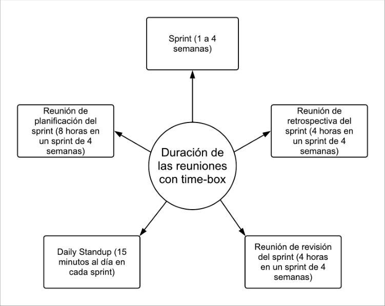

**Figura 2-18: Duración del Time-Box para las reuniones de Scrum** 

La Figura 2-19 es una interfaz de Vabro, que muestra la planificación de sprints con Vabro Genie, lo que permite a los equipos asignar bloques de tiempo, definir tareas y establecer prioridades. 

**52** © 2025 SCRUMstudy™. _Una guía para el cuerpo de conocimiento de Scrum (Guía SBOK)_ 

2 – PRINCIPIOS 

**2** 

**Figura 2-19: Planificación de sprints con Vabro Genie (Fuente: Vabro)** 

La figura 2-20 es una interfaz de Jira, que ilustra la planificación de sprints con cuadro de tiempo con sesiones de planificación de duración fija y desgloses claros de tareas. 

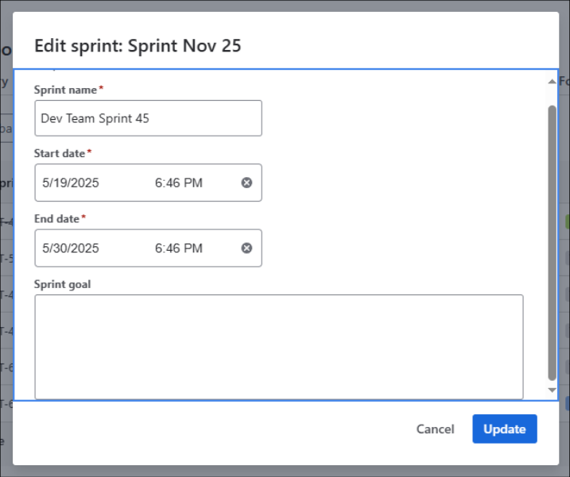

**Figura 2-20: Planificación de sprints con límite de tiempo (fuente: Jira)** 

©2025 SCRUMstudy™. _Una guía para el cuerpo de conocimiento de Scrum (Guía SBOK®)_ **53** 

2 – PRINCIPIOS 

### **2.7 Desarrollo iterativo** 

El marco de trabajo de Scrum está guiado por el objetivo de ofrecer el máximo valor de negocio en un mínimo período de tiempo. Para lograr esto en forma práctica, Scrum cree en el desarrollo iterativo de entregables. 

En la mayoría de los proyectos complejos, es posible que el cliente no pueda definir requisitos muy concretos o no esté seguro de cómo se verá el producto final. El modelo iterativo es más flexible para asegurar que cualquier cambio que solicite el cliente se pueda incluir como parte del proyecto. Las historias de usuario tal vez tengan que ser escritas constantemente durante la duración del proyecto. En las etapas iniciales de redacción, la mayoría de las historias son las funcionalidades de alto nivel. Estas historias de usuario se conocen como épicas. Las épicas generalmente son muy grandes como para que los equipos las completen en un solo sprint, y por lo tanto se dividen en pequeñas historias de usuario. 

Cada aspecto complejo del proyecto se divide mediante la elaboración progresiva durante el proceso _Refinar el backlog priorizado del producto_ . Los procesos de _Crear historias de usuario_ y de _Estimar historias de usuario y Comprometer historias de usuario_ se utilizan para agregar nuevos requisitos al backlog priorizado del producto. La tarea del Product Owner es asegurar un mayor retorno de la inversión, centrándose en el valor y en la entrega continua con cada sprint. El Product Owner debe entender bien la justificación del negocio y el valor que el proyecto debe entregar al redactar el backlog priorizado del producto, y por lo tanto decidir qué entregables contractuales y con qué valor serán entregados en cada sprint. Posteriormente, los procesos de _Identificar tareas_ , _Estimar tareas_ y _Actualizar el backlog del sprint_ producen el backlog del sprint, que utiliza el equipo para crear los entregables. 

En cada sprint, el proceso de _Crear entregables_ se utiliza para desarrollar las salidas del sprint. El Scrum Master tiene que garantizar que se sigan los procesos de Scrum y facilitar al equipo el trabajo de la manera más productiva. El Equipo Scrum se autoorganiza, teniendo como objetivo el crear entregables del sprint a partir de las historias de usuario que están en el backlog del sprint. En grandes proyectos, varios equipos multidisciplinarios trabajan en paralelo a través de los sprints, proporcionando soluciones potencialmente entregables al final de cada sprint. Después de completar cada sprint, el Product Owner acepta o rechaza los entregables con base a los criterios de aceptación del proceso de _Demostrar y validar el sprint_ . 

El beneficio del desarrollo iterativo es la posibilidad de corregir el rumbo, ya que todas las personas involucradas entienden mejor lo que se debe desarrollar como parte del proyecto e incorporan este aprendizaje en forma iterativa. De esta forma, el tiempo y el esfuerzo necesarios para llegar al punto final se reducen considerablemente y el equipo produce entregables más adecuados el ambiente de negocio final. 

Como se ilustra en la figura 2-21, los proyectos Scrum se completan de manera iterativa, entregando valor a lo largo del ciclo de vida del proyecto. 

**54** © 2025 SCRUMstudy™. _Una guía para el cuerpo de conocimiento de Scrum (Guía SBOK)_ 

2 – PRINCIPIOS 

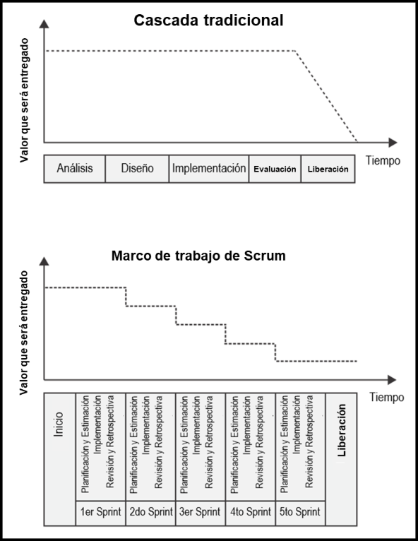

**2** 

**Figura 2-24: Scrum vs Cascada tradicional** 

©2025 SCRUMstudy™. _Una guía para el cuerpo de conocimiento de Scrum (Guía SBOK®)_ **55** 

2 – PRINCIPIOS 

### **2.8 Scrum vs. Gestión tradicional de proyectos** 

El enfoque de la gestión tradicional de proyectos está en llevar a cabo la planificación detallada del proyecto por adelantado haciendo énfasis en fijar el alcance, el costo y el tiempo gestionar esos parámetros. En ocasiones, la gestión tradicional de proyectos puede llevar a situaciones en las que el cliente no esté satisfecho a pesar del éxito del proyecto. 

El marco de trabajo de Scrum se basa en la creencia de que el conocimiento de los trabajadores de hoy en día puede ofrecer mucho más que solo su experiencia técnica, y que intentar mapear completamente y planificar en un entorno cambiante no resulta suficiente. Por lo tanto, Scrum fomenta la toma de decisiones iterativa basada en datos. En Scrum, el enfoque principal es la entrega de productos que satisfagan los requisitos del cliente en pequeños incrementos iterativos que se puedan entregar. 

Para entregar la mayor cantidad de valor en el menor tiempo posible, Scrum promueve la priorización y el Timeboxing en vez de fijar el alcance, el costo y el cronograma de un proyecto. Una característica importante de Scrum es la autoorganización, la cual permite a las personas que hacen el trabajo estimar y asumir la propiedad de las tareas. 

**56** © 2025 SCRUMstudy™. _Una guía para el cuerpo de conocimiento de Scrum (Guía SBOK)_ 

3 – ORGANIZACIÓN 

**3** 

## **3. ORGANIZACIÓN** 

### **3.1 Introducción** 

En esta sección veremos las diversas facetas de la organización de un proyecto Scrum, así como los roles principales y los roles no centrales, y cómo formar equipos Scrum de alto rendimiento. 

<mark>La organización, tal como se define en</mark> _Guía de los fundamentos de Scrum_ _<mark>(Guía del SBOK</mark>__®_ _<mark>)</mark>_ <mark>, se aplica a lo siguiente:</mark> 

- <mark>Portafolios, programas o proyectos de cualquier sector;</mark> 

- <mark>Productos, servicios o cualquier otro resultado que se entregue a los</mark> interesados del negocio; 

- <mark>Proyectos de cualquier tamaño y complejidad.</mark> 

<mark>En la</mark> _<mark>Guía del SBOK</mark>__®_ <mark>, el término “producto"” puede referirse a un producto, servicio, o cualquier otro entregable. Scrum puede aplicarse de manera efectiva a cualquier proyecto en cualquier industria, desde pequeños proyectos o equipos con tan solo seis miembros por equipo, hasta proyectos grandes y complejos con cientos de miembros.</mark> 

<mark>Este capítulo está dividido en las siguientes secciones:</mark> 

**3.2 Guía de roles:** Esta sección identifica las secciones o subsecciones importantes para un Product Owner, un Scrum Master y un Equipo Scrum. 

**3.3 Roles de un proyecto Scrum:** Esta sección aborda los roles principales y no centrales claves con un proyecto Scrum. 

**3.4 Product Owner:** Esta sección presenta las principales responsabilidades del Product Owner con relación a un proyecto de Scrum. 

**3.5 Scrum Master:** Esta sección se centra en las principales responsabilidades del Scrum Master en el contexto de un proyecto Scrum, programa o portafolio. 

**3.6 Equipo Scrum:** Esta sección hace énfasis en las principales responsabilidades del Equipo Scrum en el contexto de un proyecto de Scrum, programa o portafolio. 

**3.7 Scrum en proyectos, programas y portafolios:** Esta sección se centra en cómo se puede adaptar y utilizar el marco de trabajo de Scrum en los diferentes contextos de los programas y los portafolios. También se destacan las responsabilidades específicas de los miembros del Equipo Scrum en relación con la comunicación, la integración y el trabajo con los equipos de negocio y con la gestión de programas. 

**3.8 Responsabilidades:** <mark>Esta sección describe las responsabilidades pertinentes al tema de la organización, para todos quienes trabajan en un proyecto, en función de sus roles.</mark> 

**3.9 Scrum vs. Gestión tradicional de proyectos:** Esta sección explica las principales diferencias y ventajas del modelo Scrum en relación con el modelo tradicional en Cascada de gestión de proyectos. 

- **3.10 Teorías populares de recursos humanos y su relevancia en Scrum:** Esta sección contiene algunas de las teorías de recursos humanos más populares de utilidad para todos los miembros del equipo principal de Scrum. 

©2025 SCRUMstudy™. _Una guía para el cuerpo de conocimiento de Scrum (Guía SBOK®)_ **57** 

3 – ORGANIZACIÓN 

#### **3.1.1 Guía de roles** 

**1.** Product Owner: Es importante que el Product Owner lea todo el capítulo. 

**2.** Scrum Master: El Scrum Master también debe familiarizarse con todo este capítulo con enfoque principal en las secciones 3.3, 3.5, 3.6, 3.8 y 3.10.4. 

**3.** Equipo Scrum: El Equipo Scrum debe enfocarse principalmente en las secciones 3.3, 3.6 y 3.8. 

### **3.2 Roles en un proyecto Scrum** 

Es muy importante entender los roles y las responsabilidades de Scrum a fin de garantizar la implementación exitosa de los proyectos Scrum. 

Los roles de Scrum se dividen en dos categorías: 

1. **Roles principales:** Los roles principales ( _core roles_ ) son aquellos que se requieren obligadamente para crear el producto del proyecto, están comprometidos con el proyecto, y por último son los responsables del éxito de cada sprint del proyecto y del proyecto en su totalidad. 

2. **Roles secundarios:** Los roles secundarios ( _non-core roles_ ) no son necesariamente obligatorios para el proyecto Scrum, y pueden incluir miembros de los equipos que tengan interés en el proyecto, pero que no tienen ninguna función formal en el equipo del proyecto. Pueden interactuar con el equipo, pero no son responsables del éxito del proyecto. Los roles secundarios también deben tenerse en cuenta en cualquier proyecto de Scrum. 

La Figura 3-1 muestra el formulario de la interfaz de usuario de Vabro titulado "Crear organización (empresa)", que requiere entradas como el nombre de la organización, el correo electrónico, el dominio, el sitio web, el número de empleados y la industria, con un botón "Crear organización". 

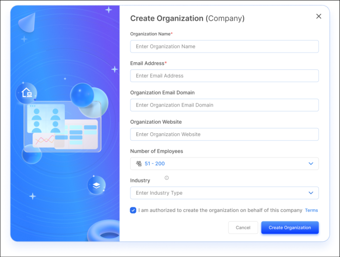

**Figura 3-1: Configuración de la organización (fuente: Vabro)** 

**58** © 2025 SCRUMstudy™. _Una guía para el cuerpo de conocimiento de Scrum (Guía SBOK)_ 

3 – ORGANIZACIÓN 

**3** 

#### **3.2.1 Roles principales** 

En Scrum hay tres roles principales que, en última instancia, tienen la responsabilidad de cumplir con los objetivos del proyecto. Los roles principales son el Product Owner, el Scrum Master y el Equipo Scrum. En conjunto se les conoce como el equipo principal de Scrum. Es importante tener en cuenta que, de estos tres roles, ningún rol tiene autoridad sobre los demás. 

**1. Product Owner:** El Product Owner es la persona responsable de maximizar el valor del negocio en el proyecto. Este rol es responsable de articular los requisitos del cliente y de mantener la justificación del negocio del proyecto. El Product Owner representa la voz del cliente. 

**2. Scrum Master:** El Scrum Master es un facilitador que asegura que el Equipo Scrum esté dotado de un ambiente propicio para completar con éxito el desarrollo del producto. El Scrum Master guía, facilita y enseña las prácticas de Scrum a todos los participantes en el proyecto; elimina los impedimentos que enfrenta el equipo y se asegura de que se estén siguiendo los procesos de Scrum. 

Debe tenerse en cuenta que el rol de Scrum Master es muy diferente a la función que desempeña el director del proyecto en un modelo tradicional de cascada en la gestión de proyectos, en el que el director trabaja como gerente o líder del mismo. El Scrum Master solo trabaja como un facilitador y está en el mismo nivel jerárquico que cualquier otra persona en el Equipo Scrum. Cualquier persona del Equipo Scrum que aprenda a facilitar proyectos Scrum puede convertirse en el Scrum Master de un proyecto o sprint. 

**3. Equipo Scrum:** El Equipo Scrum es un grupo o equipo de personas responsables de entender los requerimientos del negocio especificados por el Product Owner, de estimar las historias de usuarios y de la creación final de los entregables del proyecto. 

La figura 3-2 muestra un espacio de trabajo de Airtable para "Incorporación de empleados" en la pestaña "Miembros del equipo". Enumera a los empleados con detalles como nombre, foto, cargo, equipo, correo electrónico y tareas de la lista de verificación de incorporación. 

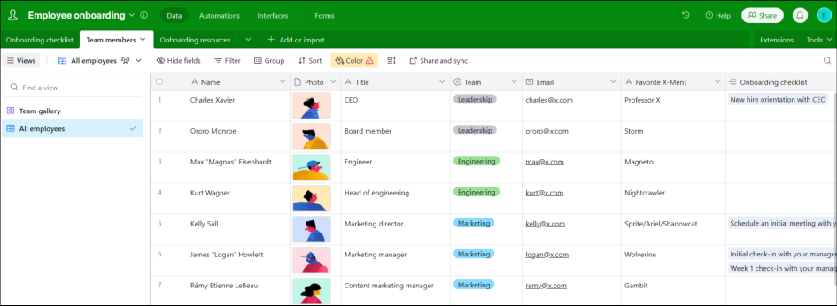

**Figura 3-2: Composición del equipo (fuente: Airtable)** 

©2025 SCRUMstudy™. _Una guía para el cuerpo de conocimiento de Scrum (Guía SBOK®)_ **59** 

3 – ORGANIZACIÓN 

La figura 3-3 presenta una descripción general de los roles principales del Equipo Scrum. 

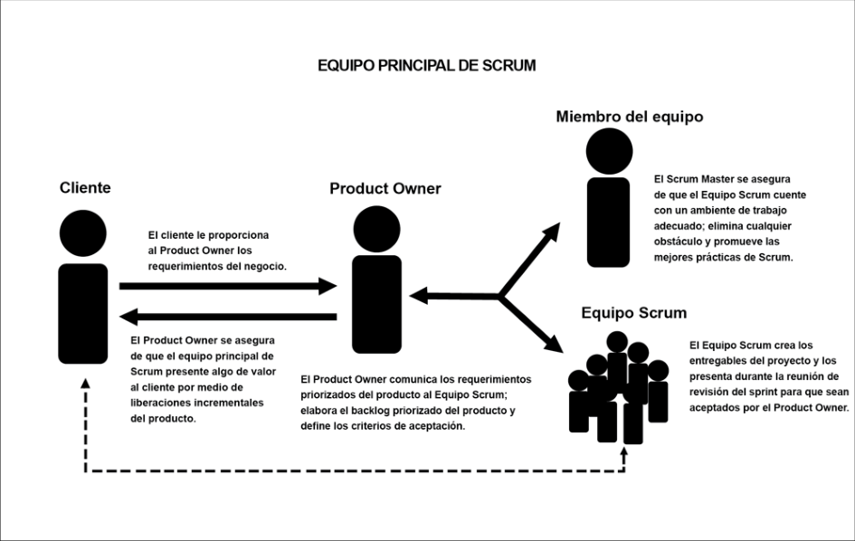

**Figura 3-3: Roles de Scrum: Resumen** 

#### **3.2.2 Roles secundarios** 

Los roles secundarios no son obligatorios para el proyecto Scrum y pueden no participar en el proceso de Scrum. Sin embargo, es importante tener conocimiento sobre estos roles secundarios, ya que podrían desempeñar un rol importante en algunos proyectos de Scrum. 

Los roles secundarios pueden ser los siguientes: 

**1. Interesados del negocio:** Interesados del negocio ( _business stakeholders_ ) es un término colectivo que incluye a clientes, usuarios y patrocinadores que generalmente interactúan con el Product Owner, el Scrum Master y el Equipo Scrum para proporcionarles información y facilitar la creación del producto del proyecto, servicio, o cualquier otro resultado. Los interesados del negocio influyen en el proyecto a lo largo del desarrollo del mismo. Los interesados del negocio también pueden desempeñar un rol en los procesos importantes de Scrum tales como _Desarrollar épicas_ , _Crear el backlog priorizado del producto_ , _Realizar la planificación de la liberación_ y _Retrospectiva del sprint_ y otros procesos importantes en Scrum. En Scrum se necesaria el apoyo total de los interesados del negocio en el proyecto. 

El Product Owner tiene la responsabilidad de mantener involucrados a los interesados del negocio. Para conservar el apoyo de los interesados y mantenerlos involucrados se recomienda lo siguiente: 

- Asegurar la participación y la colaboración eficaz de los interesados del negocio; 

- Evaluar constantemente el impacto del negocio; 

**60** © 2025 SCRUMstudy™. _Una guía para el cuerpo de conocimiento de Scrum (Guía SBOK)_ 

3 – ORGANIZACIÓN 

**3** 

- Mantener una comunicación constante con los interesados del negocio; 

- Gestionar las expectativas de los interesados del negocio. 

En ocasiones, una misma persona u organización tendrán múltiples roles de interesados del negocio. Por ejemplo: el patrocinador y el cliente pudieran ser la misma persona. 

A continuación, se definen los roles de los interesados del negocio relevantes en un proyecto de Scrum: 

- **Cliente:** El cliente es la persona o la organización que adquiere el producto, servicio o cualquier otro resultado del proyecto. Para cualquier organización, dependiendo del proyecto, puede haber clientes internos (dentro de la misma organización) como clientes externos (fuera de la organización). 

- **Usuarios:** El usuario es el individuo o la organización que utiliza directamente el producto, servicio o cualquier otro resultado del proyecto. Al igual que los clientes, para cualquier organización, puede haber usuarios internos y externos. En algunas industrias los clientes y los usuarios pueden ser los mismos. 

- **Patrocinador:** El patrocinador es la persona o la organización que provee recursos y apoyo para el proyecto. El patrocinador es también el interesado del negocio, a quien todos le deben rendir cuentas al final. 

Los patrocinadores buscan entender el balance final relacionado al producto o servicio y generalmente les preocupa más el resultado y no las tareas individuales. Es importante que los patrocinadores que financian el proyecto entienden claramente lo siguiente: 

   - Los beneficios de la implementación de Scrum; 

   - Las fechas límites y los costos estimados de los proyectos de Scrum; 

   - Los riesgos generales de los proyectos de Scrum y los pasos para mitigarlos; 

   - Las fechas esperadas de liberación y entregables finales. 

**2. Servicios de apoyo:** Los servicios de apoyo son grupos internos y externos que apoyan o se vean afectados por el proyecto de Scrum. Por ejemplo: capacitación, logística, publicidad, finanzas, infraestructura, etc. 

**3. Proveedores:** Los proveedores son personas u organizaciones externas que ofrecen productos y servicios que no están dentro de las competencias básicas de la organización del proyecto. 

**4. Scrum Guidance Body:** El Scrum Guidance Body (SGB) es un rol opcional, aunque altamente recomendado para formalizar las prácticas organizacionales relacionadas a Scrum. Por lo general, se compone de un grupo de documentos o un grupo de expertos que normalmente están involucrados en definir los objetivos relacionados a la calidad, regulaciones gubernamentales, seguridad y otros parámetros clave de la organización. Estos objetivos guían el trabajo que lleva a cabo el Product Owner, el Scrum Master y el Equipo Scrum. El Scrum Guidance Body también ayuda a captar las mejores prácticas que deben utilizarse en todos los proyectos de Scrum en la organización. 

El Scrum Guidance Body no toma decisiones relacionadas al proyecto. En cambio, actúa como una estructura de consultoría u orientación para todos los niveles de la jerarquía en el proyecto de organización del portafolio, programa y proyecto. Los equipos Scrum tienen la opción de solicitar ayuda al Scrum Guidance Body sobre cualquier recomendación que requieran. 

©2025 SCRUMstudy™. _Una guía para el cuerpo de conocimiento de Scrum (Guía SBOK®)_ **61** 

3 – ORGANIZACIÓN 

### **3.3 Product Owner** 

El Product Owner representa los intereses de la comunidad de interesados del negocio para el Equipo Scrum. El Product Owner es responsable de asegurar una comunicación clara sobre el producto y los requisitos de funcionalidad del servicio con el Equipo Scrum, definir los criterios de aceptación y asegurar que se cumplan dichos criterios. En otras palabras, el Product Owner es responsable de asegurar que el Equipo Scrum entregue valor. Este rol central siempre debe mantener una visión dual. Debe entender y apoyar las necesidades e intereses de todos los interesados del negocio, al tiempo que comprende las necesidades y el funcionamiento del Equipo Scrum. Puesto que el Product Owner debe entender las necesidades y prioridades de los interesados del negocio, incluyendo los clientes y los usuarios, a este rol se le conoce comúnmente como la voz del cliente. 

La tabla 3-1 resume las responsabilidades del Product Owner en los diferentes procesos de Scrum. 

|**Proceso**|**Responsabilidades del Product Owner**|
|---|---|
|8.1 Crear la visión del proyecto|• Define la visión del proyecto • Ayuda a crear el acta de constitución delproyectoysupresupuesto|
|8.2 Identificar al Scrum Master y a los interesados del negocio|• Ayuda a finalizar la elección del Scrum Master para el proyecto • Identifica a los interesados del negocio|
|8.3 Formar el Equipo Scrum|• Ayuda a determinar quiénes serán los miembros del Equipo Scrum • Ayuda a desarrollar un plan de colaboración • Ayuda a desarrollar elplan del equipo con los Scrum Masters|
|8.4 Desarrollar épicas|• Crea épicas y personajes|
|8.5 Crear el backlog priorizado del producto|• Prioriza los elementos en el backlog priorizado del producto • Define los criterios de terminadoycumple la definición de listo|
|8.6 Realizar la planificación de la liberación|• Elabora el cronograma de planificación de la liberación • Ayuda a determinar la duración del sprint|
|9.1 Crear historias de usuario|• Responsable de crear historias de usuario • Define los criterios de aceptación de cada historia de usuario|
|9.2 Estimar historias de usuario|• Explica las historias de usuario|
|9.3 Comprometer historias de usuario|• Trabaja con el Equipo Scrum para que comprometa a las historias de usuario|
|9.4 Identificar tareas|• Explica las historias de usuario al Equipo Scrum mientras elabora la lista de tareas|
|9.5 Estimar tareas|• Brinda orientación y aclaraciones al Equipo Scrum en la estimación de los esfuerzospara las tareas|
|9.6 Actualizar el backlog del sprint|• Explica los requerimientos al Equipo Scrum mientras el equipo elabora el backlogdel sprint.|
|10.1 Crear entregables|• Aclara los requerimientos del negocio al Equipo Scrum.|
|10.3 Refinar el backlog priorizado delproducto|• Refina el backlog priorizado del producto.|

**62** © 2025 SCRUMstudy™. _Una guía para el cuerpo de conocimiento de Scrum (Guía SBOK)_ 

3 – ORGANIZACIÓN 

**3** 

|11.1 Demostrar y validar el sprint|• Acepta o rechaza los entregables • Proporciona la retroalimentación necesaria al Scrum Master y a los equipos Scrum|
|---|---|
||• Actualiza elplan de liberaciónyel backlog priorizado delproducto|
|12.1 Enviar entregables|• Ayuda a enviar las liberaciones del producto y se coordina con el cliente|
|12.2 Retrospectiva de la liberación|• Participa en las reuniones de retrospectiva del sprint|

**Tabla 3-1: Responsabilidades del Product Owner en los procesos de Scrum** 

Otras responsabilidades de un Product Owner son: 

- Establecer los requisitos generales iniciales del proyecto y dar inicio a las actividades del mismo; esto puede implicar una interacción con el Program Product Owner y el Portfolio Product Owner, a fin de asegurar que el proyecto se alinee con la dirección que proporciona la alta gerencia. 

- Representar a los usuarios del producto o servicio con un conocimiento integral de la comunidad de usuarios. 

- Asegurar los recursos financieros del proyecto al inicio y durante su transcurso 

- Enfocarse en la creación de valor y el retorno de la inversión en general. 

- Evaluar la viabilidad y garantizar la entrega del producto o servicio. 

El Product Owner no siempre representa a un negocio o cliente externo. Por ejemplo, en un proyecto de informática, los requisitos no funcionales, tales como mejorar el desempeño, la escalabilidad, la capacidad de prueba, la confiabilidad, la seguridad de la información y el cumplimiento, también pueden ser propiedad de grupos de tecnología al interior de la compañía. En tales casos, el Product Owner pudiera ser un arquitecto técnico, el líder técnico, etc. 

#### **3.3.1 La voz del cliente** 

Como representante del cliente y de otros interesados del negocio, al Product Owner se le conoce como “la voz del cliente”, ya que asegura de que las necesidades explícitas e implícitas del cliente se reflejen en las historias de usuario en el backlog priorizado del producto y que más adelante se utilicen para crear los entregables del proyecto para el cliente. 

©2025 SCRUMstudy™. _Una guía para el cuerpo de conocimiento de Scrum (Guía SBOK®)_ **63** 

3 – ORGANIZACIÓN 

### **3.4 Scrum Master** 

El Scrum Master es el “líder de apoyo” del Equipo Scrum que modera y facilita las interacciones del equipo como su _coach_ y motivador. Este rol es responsable de asegurar que el equipo tenga un ambiente de trabajo productivo protegiéndolo de influencias externas, eliminando todos los obstáculos y haciendo que se cumplan los principios, aspectos y procesos de Scrum. La tabla 3-2 resume las responsabilidades del Scrum Master en los diferentes procesos de Scrum. 

|**Procesos**|**Responsabilidades del Scrum Master**|
|---|---|
|8.2 Identificar al Scrum Master y a los interesados del negocio|• Ayuda a identificar a los interesados del negocio en el proyecto|
|8.3 Formar el Equipo Scrum|• Facilita la selección del Equipo Scrum • Facilita la creación del plan de colaboración y el plan de desarrollo del equipo • Garantiza que los recursos de respaldo estén disponibles para el funcionamiento del proyecto sin problemas|
|8.4 Desarrollar épicas|• Facilita la creación de épicas y personajes|
|8.5 Crear el backlog priorizado del producto|• Ayuda al Product Owner a crear backlog priorizado del producto; a definir de los criterios de terminado y a cumplir la definición de listo.|
|8.6 Realizar la planificación de la liberación|• Coordina la creación del cronograma de planificación de la liberación • Ayuda al Product Owneryal Equipo Scrum a establecer la duración del sprint|
|9.1 Crear historias de usuario|• Facilita la creación de historias de usuario y sus criterios de aceptación|
|9.2 Estimar historias de usuario|• Facilita las reuniones del Equipo Scrum para estimar historias de usuario|
|9.3 Comprometer historias de usuario|• Facilita las reuniones del Equipo Scrum para comprometer historias de usuario|
|9.4 Identificar tareas|• Ayuda al Equipo Scrum a crear la lista de tareas para el siguiente sprint|
|9.5 Estimar tareas|• Ayuda al Equipo Scrum a estimar el esfuerzo necesario para completar las tareas acordadaspara el sprint|
|9.6 Actualizar el backlog del sprint|• Ayuda al Equipo Scrum a desarrollar el backlog del sprint y el Sprint Burndown Chart|
|10.1 Crear entregables|• Ayuda al Equipo Scrum a crear los entregables acordados para el sprint • Ayuda a actualizar el Scrumboardyla lista de impedimentos|
|10.2 Realizar el Daily Standup|• Se asegura de que el Scrumboard y la lista de impedimentos estén actualizados|
|10.3 Refinar el backlog priorizado delproducto|• Organiza las reuniones de revisión del backlog priorizado del producto|
|11.1 Demostrar y validar sprints|• Facilita la presentación de los entregables completados por el Equipo Scrum para la aprobación del Product Owner|
|11.2 Retrospectiva del|• Garantizaque exista un ambiente idealpara el Equipo Scrum delproyecto en|

**64** © 2025 SCRUMstudy™. _Una guía para el cuerpo de conocimiento de Scrum (Guía SBOK)_ 

3 – ORGANIZACIÓN 

**3** 

|sprint|los sucesivos sprints|
|---|---|
|12.2 Retrospectiva de la|• Representa al equipo principal de Scrum para proporcionar lecciones del|
|liberación|proyecto actual en caso de ser necesario|

**Tabla 3-2: Responsabilidades del Scrum Master en los procesos de Scrum** 

### **3.5 Equipo Scrum** 

Al Equipo Scrum en ocasiones se le conoce como equipo de desarrollo, ya que es responsable del desarrollo del producto, servicio o de cualquier otro resultado. Consiste en un grupo de personas autoorganizadas que trabajan en las historias de usuario en el backlog del sprint para crear los entregables del proyecto. La tabla 3-3 resume las responsabilidades del Equipo Scrum en los diversos procesos de Scrum. 

|**Procesos**|**Responsabilidades del Equipo Scrum**|
|---|---|
|8.3 Formar el Equipo Scrum|• Proporciona aportes para la creación del plan de colaboración y del plan de desarrollo del equipo.|
|8.4 Desarrollar épicas|• Asegura una comprensión clara de la épicas y personajes.|
|8.5 Crear el backlog priorizado del producto|• Entiende las historias de usuario en el backlog priorizado del producto.|
|8.6 Realizar la planificación de la liberación|• Acuerda con los demás miembros del equipo principal de Scrum sobre la duración del sprint. • Busca clarificación sobre los nuevos productos o cambios, si los hay, en los productos existentes en el backlog priorizado del producto.|
|9.1 Crear historias de usuario|• Proporciona información al Product Owner en la creación de historias de usuario|
|9.2 Estimar historias de usuario|• Estima las historias de los usuarios aprobadas por el Product Owner|
|9.3 Comprometer historias de usuario|• Compromete las historias de usuario a realizarse en un sprint|
|9.4 Identificar tareas|• Desarrolla una lista de tareas con base en las historias de usuario y dependencias acordadas|
|9.5 Estimar tareas|• Estima el esfuerzo de las tareas identificadas y, de ser necesario, actualiza la lista de tareas.|
|9.6 Actualizar el backlog del sprint|• Define las historias de usuario y las tareas que serán incluías en el backlog del sprint y a las que se les da seguimiento en el Sprint Burndown Chart|
|10.1 Crear entregables|• Elabora los entregables • Identifica riesgos y ejecuta acciones de mitigación de riesgos • Identifica los impedimentos a los que se les dará seguimiento en la lista de impedimentos|
|10.2 Realizar el Daily Standup|• Actualiza el Scrumboard durante cada sprint • Discute los problemas que enfrenta cada miembro y busca soluciones para motivar al equipo|
|10.3 Refinar el backlog priorizado del producto|• Participa en las reuniones de revisión del backlog priorizado del producto|
|11.1 Demostrar y validar sprints|• Muestra los entregables terminados al Product Owner para su aprobación|

©2025 SCRUMstudy™. _Una guía para el cuerpo de conocimiento de Scrum (Guía SBOK®)_ **65** 

3 – ORGANIZACIÓN 

|11.2 Retrospectiva del sprint|• Identifica oportunidades de mejora en el sprint actual y decide si está de acuerdo sobre las posibles mejoras viables para el próximo sprint|
|---|---|
|12.2 Retrospectiva de la liberación|• Participa en la reunión de retrospectiva de la liberación|

**Tabla 3-3: Responsabilidades del Equipo Scrum en los procesos de Scrum** 

#### **3.5.1 Selección de personal** 

La figura 3-4 enumera las características deseables para los roles principales de Scrum. 

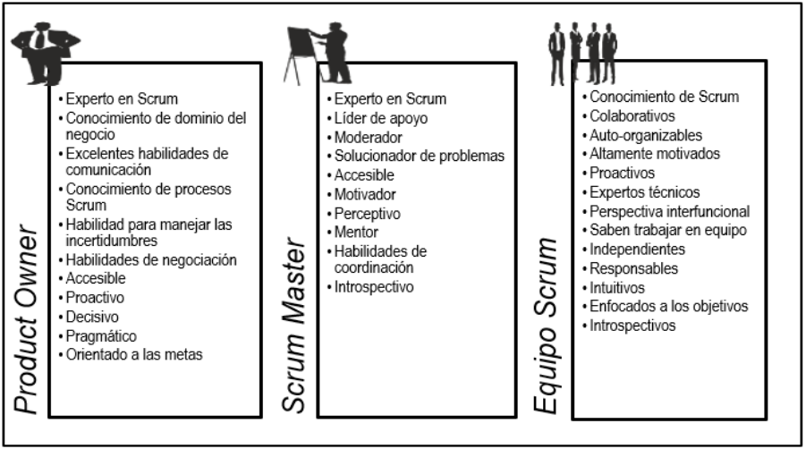

**Figura 3-4: Características deseadas de los roles principales de Scrum** 

#### **3.5.2 Tamaño del Equipo Scrum** 

Es importante que el Equipo Scrum cuente con todas las habilidades esenciales necesarias para llevar a cabo el trabajo del proyecto. También es necesario contar con un alto nivel de colaboración para maximizar la productividad, de modo que se requiera una mínima coordinación para llevar a cabo el trabajo. El tamaño óptimo de un Equipo Scrum es de seis a diez miembros, lo suficientemente grande para asegurar habilidades adecuadas, pero lo suficientemente pequeño como para facilitar la colaboración. La meta es contar con suficientes personas en un equipo para hacer el trabajo, pero que siga siendo suficientemente pequeño para lograr una eficaz comunicación y colaboración dentro del equipo. Los equipos más pequeños pudieran enfrentar desventajas. Una posible desventaja es que los equipos más pequeños se ven considerablemente más afectados por la pérdida de un miembro del equipo, en comparación a los equipos más grandes, aunque sea por un corto tiempo. Este problema se puede solucionar si los miembros del equipo tienen conocimientos especializados y habilidades fuera de su rol específico. Sin embargo, esto puede ser difícil y depende del tipo de proyecto, la industria y el tamaño de la organización. También se recomienda tener suplentes para reemplazar a cualquier persona que tenga que abandonar el Equipo Scrum. 

**66** © 2025 SCRUMstudy™. _Una guía para el cuerpo de conocimiento de Scrum (Guía SBOK)_ 

3 – ORGANIZACIÓN 

**3** 

### **3.6 Scrum en proyectos, programas y portafolios** 

#### **3.6.1 El funcionamiento de Scrum en un proyecto grande** 

Los procesos fundamentales de Scrum descritos en los capítulos del 8 al 12 son válidos para los proyectos de Scrum que cuentan con un Product Owner, un Scrum Master y un Equipo Scrum. Estos generalmente se consideran proyectos de Scrum pequeños. 

Al trabajar en grandes proyectos que requieren del esfuerzo de cuatro o más equipos de Scrum con múltiples Product Owners y múltiples Scrum Masters, los procesos fundamentales de Scrum definidos en los capítulos del 8 al 12 siguen siendo válidos, aunque tal vez sean necesarias consideraciones adicionales y actualizaciones a las entradas, herramientas y salidas. Esto puede incluir necesidades adicionales de coordinación y sincronización. El impacto de los procesos fundamentales de Scrum al escalar Scrum en grandes proyectos se describe en el capítulo 13. 

La definición de lo que constituye un proyecto grande generalmente depende de la organización o de la complejidad de los proyectos emprendidos. Un criterio clave para saber si un proyecto se considera pequeño en vez de grande es si requiere de múltiples Scrum Masters o múltiples Product Owners. Si el proyecto requiere solo un Scrum Master y un Product Owner, generalmente estos pueden manejar cualquier actividad adicional de comunicación y sincronización que requiera el proyecto. 

Algunos de los motivos tras la necesidad de utilizar entradas, herramientas y salidas adicionales para grandes proyectos son: 

###### **Product Owners** 

- La necesidad de colaborar entre Product Owners al trabajar con interesados del negocio; al refinar el backlog priorizado del producto y al trabajar con múltiples Equipo Scrum. 

También es importante destacar que, al escalar Scrum en los grandes proyectos, tal vez sean necesarios servicios adicionales de apoyo, tales como arquitectos, directores de producto, cumplimiento, seguridad de la información, gobernabilidad, etc. 

###### **Scrum Masters** 

- La necesidad de colaboración entre Scrum Masters al atender impedimentos y sincronizar el trabajo de múltiples Equipo Scrum. 

###### **Equipos Scrum** 

- Mayor interacción y dependencias entre los equipos Scrum, ya que la complejidad aumenta en los grandes proyectos. 

- La necesidad de gestionar conflictos, resolver problemas y establecer prioridades entre los equipos Scrum. 

- • La necesidad de la especialización, ya que algunos equipos Scrum pueden requerir de recursos especializados para realizar tareas específicas en un proyecto grande, y tal vez no todos los equipos Scrum cuenten con tales habilidades. 

- La necesidad de definir ciertas normas y estándares que deben cumplir todos los equipos Scrum (ejemplo: estándares de seguridad dentro de una empresa o normas legales o gubernamentales en industrias específicas). Estas tal vez tengan que ser definidas en el Scrum Guidance Body. 

©2025 SCRUMstudy™. _Una guía para el cuerpo de conocimiento de Scrum (Guía SBOK®)_ **67** 

3 – ORGANIZACIÓN 

- La necesidad de establecer un ambiente o área de trabajo en un proyecto grande que después utilizarán todos los equipos Scrum. 

- La necesidad de coordinar los resultados de varios equipos Scrum a fin de crear la liberación en un proyecto grande. 

#### **3.6.2 Roles principales adicionales en proyectos grandes** 

Al escalar Scrum en grandes proyectos, se necesitan los siguientes roles principales: 

##### **3.6.2.1 Chief Product Owner** 

<mark>En el caso de grandes proyectos con varios equipos Scrum y múltiples Product Owners, sigue siendo necesario contar con una sola persona que tome las decisiones diarias del negocio. Esta persona o rol es el Chief Product Owner. Este rol es responsable de coordinar el trabajo de múltiples Product Owners. Con la ayuda de los Product Owners, el Chief Product Owner prepara y mantiene el backlog priorizado del producto en general para el proyecto grande utilizándolo para coordinar el trabajo a través de los Product Owners de los equipos Scrum. El Chief Product Owner será el responsable del entregable final del proyecto, mientras que los Product Owners de los equipos individuales serán responsables solo de aquellos componentes y características que desarrollan sus respectivos equipos Scrum.</mark> 

<mark>Un proyecto grande, el Chief Product Owner tendrá la tarea de priorizar los requerimientos que compiten, presentados por los Product Owners con base en su interacción los interesados del negocio. La complejidad de esta tarea aumenta en gran medida con cada aumento en la cantidad de equipos Scrum y el número de Product Owners. Una parte importante de la complejidad de esta tarea es asegurarse de que los varios componentes estén adecuadamente integrados en los momentos apropiados. Por lo tanto, es importante desarrollar una lista de componentes y recursos necesarios en común para todos los equipos durante el proyecto. Aunque el Chief Product Owner toma las decisiones finales del negocio, él/ella colabora con el Chief Scrum Master, con otros Product Owners y Scrum Masters para desarrollar dicha lista.</mark> 

<mark>El Chief Product Owner también interactúa con el Program Product Owner para asegurar que los grandes proyectos coincidan con las metas y objetivos del programa.</mark> 

<mark>Los Chief Product Owners deben consular las secciones de la</mark> _<mark>Guía del SBOK</mark>__®_ <mark>definidas en la Guía de Roles para el Product Owner, así como el capítulo 13 que describe lo relacionado a escalar Scrum para grandes proyectos.</mark> 

##### **3.6.2.2** **<mark>Chief Scrum Master</mark>** 

Los grandes proyectos requieren que varios equipos Scrum trabajen en paralelo. La información obtenida de un equipo pudiera ser comunicada apropiadamente a otros equipos. El Chief Scrum Master es responsable de dicha actividad. El rol de un Chief Scrum Master es necesario para garantizar una colaboración apropiada entre los equipos Scrum. La coordinación entre los varios equipos Scrum que trabajan en un proyecto generalmente se da mediante la reunión de Scrum de Scrums (véase la sección 13.3.5). 

**68** © 2025 SCRUMstudy™. _Una guía para el cuerpo de conocimiento de Scrum (Guía SBOK)_ 

3 – ORGANIZACIÓN 

**3** 

No existe una jerarquía entre los Scrum Masters: todos son compañeros. El Chief Scrum Master solo trabaja en un nivel de múltiples equipos, mientras que los Scrum Masters trabajan al nivel de un solo equipo. 

La figura 3-5 proporciona las preguntas que se hacen durante una reunión de Scrum de Scrums. 

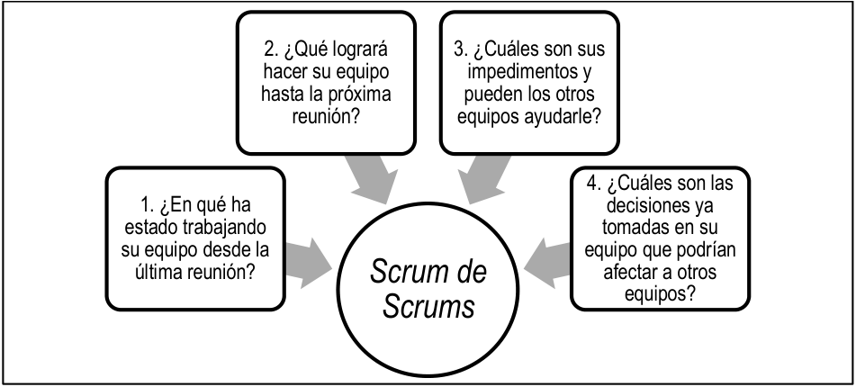

<!-- Start of picture text -->
2. ¿Qué logrará  3. ¿Cuáles son sus hacer su equipo  impedimentos y hasta la próxima  pueden los otros reunión? equipos ayudarle? 4. ¿Cuáles son las 1. ¿En qué ha  decisiones ya estado trabajando  tomadas en su su equipo desde la  equipo que podrían última reunión? Scrum de  afectar a otros equipos? Scrums <!-- End of picture text -->

**Figura 3-5: Preguntas durante la reunión de Scrum de Scrums** 

Por lo general, cualquier problema dentro de los equipos lo atienden las partes interesadas en una sesión celebrada inmediatamente después de la reunión de Scrum de Scrum. El Chief Scrum Master organiza esta sesión. 

El Chief Scrum Master puede ser seleccionado de entre los Scrum Masters de un proyecto grande o puede ser alguien más. Para proyectos muy grandes, se recomienda contar con un Chief Scrum Master que tampoco sea un Scrum Master, ya que el esfuerzo requerido para el rol de Chief Scrum Master evitará que este pueda dedicar suficiente tiempo al trabajo con su Equipo Scrum. En cualquiera de los casos, el Chief Scrum Master debe contar con la suficiente experiencia en Scrum para poder fomentar la colaboración y ayudar a entrenar a los demás en la implementación de Scrum para lograr una entrega sin contratiempos de los productos del proyecto. 

Además de eliminar impedimentos y asegurar un entorno propicio en el proyecto para los equipos Scrum, el Chief Scrum Master también colabora con el Chief Product Owner, con otros Scrum Masters y Product Owners en actividades tales como el desarrollo de lista de componentes y recursos necesarios y comunes entre todos los equipos durante todo el proyecto. Facilita todo lo necesario que está por encima del alcance de un solo Equipo Scrum. 

El Chief Scrum Master también interactúa con el Program Scrum Master a fin de garantizar que un proyecto grande coincida con las metas y objetivos del programa. 

Los Chief Scrum Masters deben <mark>consular las secciones de la</mark> _<mark>Guía del SBOK</mark>__®_ <mark>definidas en la Guía de Roles para el Scrum Master, así como el capítulo 13 que describe lo relacionado a escalar Scrum para grandes proyectos.</mark> 

©2025 SCRUMstudy™. _Una guía para el cuerpo de conocimiento de Scrum (Guía SBOK®)_ **69** 

3 – ORGANIZACIÓN 

#### **3.6.3 El funcionamiento de Scrum en una empresa** 

Para aplicar las prácticas de Scrum en proyectos que forman parte de un modelo empresarial es necesario entender la configuración y la forma de gobierno de la empresa. Esto generalmente se puede manejar por medio de programas y portafolios. 

**Programa:** Un programa es un grupo de proyectos relacionados con la finalidad de entregar resultados de negocio definidos en la declaración de la visión del programa. El backlog priorizado del programa incorpora al backlog priorizado del producto de todos los proyectos del programa. 

La Figura 3-6 muestra una interfaz "Crear programa" en Vabro. Incluye campos para el nombre del programa, la descripción, la visibilidad (privada/pública), el propietario del producto del programa, Scrum Master y roles adicionales opcionales, con un botón "Guardar y continuar". 

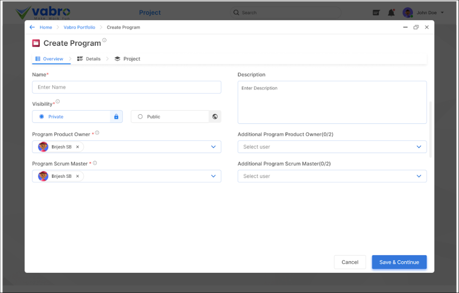

**Figura 3-6: Creación de la interfaz del programa (Fuente: Vabro)** 

**Portafolio:** Un portafolio es un grupo de programas o proyectos relacionados con la finalidad de entregar resultados de negocio tal como se define en la declaración de la visión del portafolio. El backlog priorizado del portafolio incorpora el backlog priorizado del producto de todos los programas en el portafolio. El backlog priorizado del producto de proyectos independientes también forma parte del portafolio. 

Los problemas y asuntos que se enfrentan al utilizar Scrum al interior de un programa o portafolio involucran principalmente la coordinación entre muchos equipos. Esto puede llevar al fracaso si no se maneja cuidadosamente. Las herramientas utilizadas para la comunicación deben extrapolarse a fin de que coincidan con los requerimientos de los muchos equipos involucrados en un programa o portafolio. 

© 2025 SCRUMstudy™. _Una guía para el cuerpo de conocimiento de Scrum (Guía SBOK)_ 

**70** 

3 – ORGANIZACIÓN 

**3** 

Cada Equipo de Scrum debe abordar no solo la comunicación interna, sino también la comunicación externa con otros equipos y con los interesados del negocio relevantes para el programa o portafolio. 

Al aplicar Scrum en la gestión de proyectos en el contexto de un programa o portafolio, es altamente recomendado que se cumplan los principios generales de Scrum descritos en esta publicación. Se entiende que, con el fin de adaptar las interdependencias y actividades generales del programa o portafolio, tal vez sea necesario hacer pequeños ajustes a las herramientas y a la estructura organizacional. Si existe un Scrum Guidance Body, este puede ser responsable de analizar la organización en sus distintos niveles a fin de entender y definir la aplicación apropiada de Scrum y de actuar como órgano de consulta para quienes trabajan en un proyecto, programa o portafolio. 

Los portafolios y programas cuentan con equipos independientes con distintos objetivos. Los equipos de gestión de programas buscan entregar capacidades y alcanzar ciertas metas que contribuyan al cumplimiento de objetivos específicos del programa. En contraste, el equipo del portafolio debe equilibrar los objetivos de varios programas a fin de lograr las metas estratégicas de la organización en su conjunto. 

Es importante destacar que, al escalar Scrum en una empresa, tal vez sean necesarios servicios adicionales de apoyo, tales como arquitectos, cumplimiento, seguridad de la información, gobernabilidad, etc. 

El capítulo 14 incluye información detallada sobre el escalamiento de Scrum en las empresas. 

#### **3.6.4 Roles principales adicionales en una empresa** 

##### **3.6.4.1 Program Product Owner** 

El rol del Program Product Owner es similar al rol del Product Owner, a diferencia de que busca cumplir las necesidades del programa o de la unidad de negocios en vez de las necesidades de un solo Equipo Scrum. 

El Program Product Owner define los objetivos estratégicos y las prioridades del programa. Es responsable de maximizar el valor de negocio en un programa articulando claramente de los requisitos del cliente y manteniendo la justificación del negocio en el programa. El Program Product Owner también gestiona el Backlog del Producto del Programa. Es responsable de impulsar la creación y refinamiento de los entregables al nivel del programa y requiere la coordinación entre los proyectos subyacentes en el programa. También es responsable de coordinarse con otros programas con dependencias o planes de liberación compartidos. El Program Product Owner también se coordina con el Portfolio Product Owner para garantizar que el programa esté en sintonía con el portafolio. 

El Program Product Owner también se coordina con el Portfolio Product Owner que corresponda a fin de garantizar que el programa esté en sintonía con el portafolio correspondiente. El Program Product Owner interactúa con el Portfolio Product Owner para asegurar que el programa coincida con los objetivos del portafolio. También participa en el nombramiento de Product Owners en proyectos individuales y se asegura de que la visión, los objetivos, los resultados y las liberaciones de proyectos individuales coincidan con los del programa. 

La Figura 3-7 muestra una interfaz de "Crear Portafolio" en la plataforma Vabro. Incluye campos de entrada para el nombre del portafolio, la descripción, la visibilidad (privada/pública), el propietario del producto del portafolio, el Scrum Master y los usuarios adicionales opcionales, con un botón "Guardar y continuar". 

©2025 SCRUMstudy™. _Una guía para el cuerpo de conocimiento de Scrum (Guía SBOK®)_ **71** 

3 – ORGANIZACIÓN 

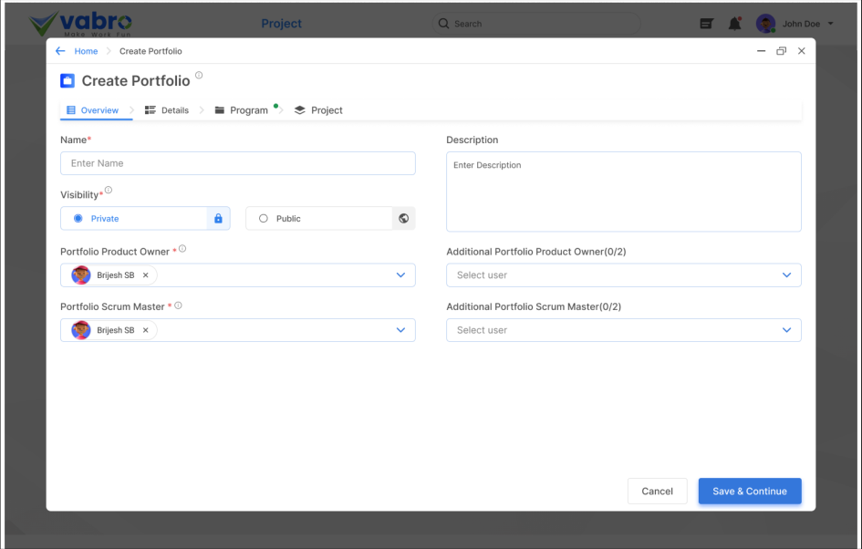

**Figura 3-7: Creación de la interfaz de portafolio (Fuente: Vabro)** 

Los Program Product Owners <mark>deben consular las secciones de la</mark> _<mark>Guía del SBOK</mark>__®_ <mark>definidas en la Guía de Roles para el Product Owner, así como el capítulo 14 que describe lo relacionado a escalar Scrum para la empresa.</mark> 

##### **3.6.4.2** **<mark>Portfolio Product Owner</mark>** 

El rol del Portfolio Product Owner es similar al rol del Product Owner y al rol del Program Product Owner, a diferencia de que busca cumplir las necesidades del portafolio o de la unidad de negocios en vez de las necesidades de un solo Equipo Scrum o las necesidades de un programa. 

El Portfolio Product Owner toma las decisiones a nivel de portafolio. Tiene una mejor perspectiva para decidir cómo organizar la empresa para cumplir con la visión. El Portfolio Product Owner es responsable de la creación y refinación del Backlog del Producto del Portafolio. 

Los Portfolio Product Owners <mark>deben consular las secciones de la</mark> _<mark>Guía del SBOK</mark>__®_ <mark>definidas en la Guía de Roles para el Product Owner, así como el capítulo 14 que describe lo relacionado a escalar Scrum para la empresa.</mark> 

##### **3.6.4.3** **<mark>Program Scrum Master</mark>** 

El rol del Program Scrum Master es similar al rol del Scrum Master, a diferencia de que busca cumplir las necesidades del programa o de la unidad de negocios en vez de las necesidades de un solo Equipo Scrum. 

**72** © 2025 SCRUMstudy™. _Una guía para el cuerpo de conocimiento de Scrum (Guía SBOK)_ 

3 – ORGANIZACIÓN 

**3** 

El Program Scrum Master es un facilitador que se asegura de que todos los equipos del proyecto cuenten con un ambiente adecuado para concluir con éxito sus proyectos. El Program Scrum Master guía, organiza y enseña las prácticas de Scrum a todos los involucrados en el programa; brinda orientación a los Scrum Masters de proyectos individuales; elimina impedimentos que enfrenten los distintos equipos del proyecto; se coordina con el Scrum Guidance Body para definir los objetivos relacionados a la calidad, regulaciones gubernamentales, seguridad y demás parámetros organizacionales clave; y se asegura de que los procesos de Scrum se sigan eficazmente en todo el programa. Es un facilitador; resuelve problemas y elimina impedimentos al nivel del programa. También es responsable de la coordinación entre todos los proyectos en el programa y de coordinarse con otros programas con planes de liberación o dependencias compartidas. 

El Program Scrum Master interactúa con el Portfolio Scrum Master para asegurar que programa coincida con las metas y objetivos del portafolio. También participa en el nombramiento de Scrum Masters en proyectos individuales y se asegura de que la visión, los objetivos, los resultados y las liberaciones de proyectos individuales en el programa coincidan con los del programa. 

Los Program Scrum Masters <mark>deben consular las secciones de la</mark> _<mark>Guía del SBOK</mark>__®_ <mark>definidas en la Guía de Roles para el Scrum Master, así como el capítulo 14 que describe lo relacionado a escalar Scrum para la empresa.</mark> 

##### **3.6.4.4 Portfolio Scrum Master** 

El rol del Portfolio Scrum Master es similar al rol del Scrum Master, a diferencia de que busca cumplir las necesidades del portafolio o de la unidad de negocios en vez de las necesidades de un solo Equipo Scrum. 

Los Portfolio Scrum Masters <mark>deben consular las secciones de la</mark> _<mark>Guía del SBOK</mark>__®_ <mark>definidas en la Guía de Roles para el Scrum Master, así como el capítulo 14 que describe lo relacionado a escalar Scrum para la empresa.</mark> 

#### **3.6.5 Ejemplos de proyectos, programas y portafolios** 

Ejemplos de proyectos, programas y portafolios en diferentes industrias y sectores: 

_Ejemplo 1_ : Empresa constructora 

- Proyecto: Construcción de una casa 

- Programa: Construcción de un complejo habitacional 

- • Portafolio: Todos los proyectos de vivienda de la empresa 

_Ejemplo 2_ : Organización aeroespacial 

- Proyecto: Construcción del vehículo de lanzamiento 

- Programa: Lanzamiento exitoso de un satélite 

- Portafolio: Todos los programas de satélites activos 

©2025 SCRUMstudy™. _Una guía para el cuerpo de conocimiento de Scrum (Guía SBOK®)_ **73** 

3 – ORGANIZACIÓN 

###### _Ejemplo 3_ : Empresa de informática 

- Proyecto: Desarrollo del módulo del carrito de compras 

- Programa: Desarrollo de un sitio web de comercio electrónico completamente funcional 

- Portafolio: Todos los sitios web desarrollados por la empresa hasta ahora 

La figura 3-8 ilustra la forma en la que Scrum se puede utilizar para portafolios, programas o proyectos en la organización. 

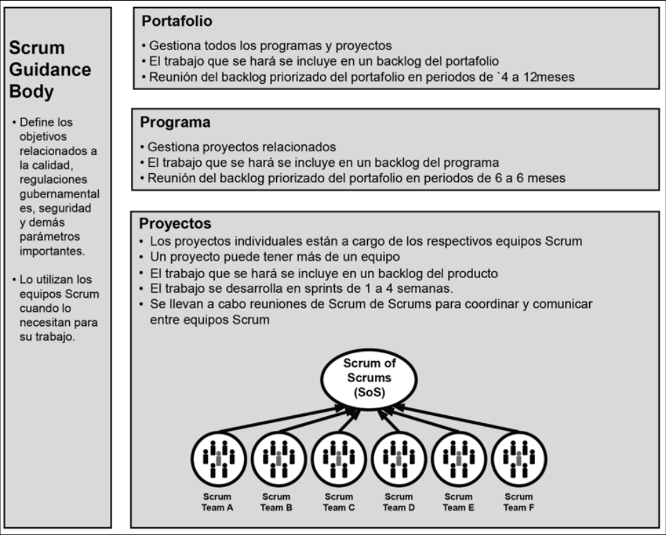

**Figura 3-8: Scrum para proyectos, programas y portafolios en la organización** 

**74** © 2025 SCRUMstudy™. _Una guía para el cuerpo de conocimiento de Scrum (Guía SBOK)_ 

3 – ORGANIZACIÓN 

### **3.7 Resumen de responsabilidades** 

|**Rol**|**Responsabilidades**|
|---|---|
|Equipo Scrum|**3** • Asume la responsabilidad colectiva y garantiza que los entregables del proyecto sean elaborados según los requerimientos • Asegura al Product Owner y el Scrum Master que el trabajo asignado se está llevando a cabo según el plan • Acuerda con el Product Owner la duración del sprint|
||• Elabora los requerimientos generales iniciales del proyecto y arranca el proyecto • Ayuda a nombrar a personas apropiadas en los roles de Scrum Master y Equipo Scrum • Ayuda a asegurar los recursos económicos iníciales y constantes para el proyecto • Establece la visión del producto|
|Product Owner/ Chief Product Owner|• Evalúa la viabilidad y asegura la entrega del producto o servicio • Asegura la transparencia y claridad de los elementos del backlog priorizado del producto • Decide el contenido comercial mínimo que se puede presentar • Proporciona los criterios de aceptación de las historias de usuario a ser desarrolladas en un sprint • Inspecciona los entregables • Acuerda con el Equipo Scrum la duración del sprint|
|Scrum Master/ Chief Scrum Master|• Se asegura de que todos los miembros del equipo, incluyendo el Product Owner estén cumpliendo correctamente los procesos de Scrum • Se asegura de que el desarrollo del producto o servicio avance sin contratiempos y que los integrantes del Equipo Scrum cuenten con todas las herramientas necesarias para realizar el trabajo • Supervisa la reunión de planificación de la liberaciónyprograma otras reuniones|
|Program Product Owner|• Define los objetivos estratégicos y las prioridades de los programas|
|Program Scrum Master|• Resuelve problemas y coordina las reuniones de los programas|
|Portfolio Product Owner|• Define los objetivos estratégicos y las prioridades de los portafolios|
|Portfolio Scrum Master|• Resuelve problemas y coordina las reuniones de los portafolios|
|Interesados del negocio|• Término colectivo que incluye a clientes, usuarios y patrocinadores • Interactúa frecuentemente con el Product Owner, el Scrum Master y el Equipo Scrum para brindarles aportes y facilitar la creación de los entregables del proyecto|
|Scrum Guidance Body|• Establece los lineamientos generales y las métricas para desarrollar la descripción de roles para los integrantes del Equipo Scrum • Actúa como consultor de proyectos en toda la organización en distintos niveles • Entiende y define los niveles apropiados de agrupación, roles y reuniones para el proyecto Scrum|

**Tabla 3-4: Resumen de las responsabilidades pertinentes a la organización** 

©2025 SCRUMstudy™. _Una guía para el cuerpo de conocimiento de Scrum (Guía SBOK®)_ **75** 

3 – ORGANIZACIÓN 

### **3.8 Scrum vs. Gestión tradicional de proyectos** 

La estructura organizativa y la definición de roles y responsabilidades correspondientes son algunas de las áreas en las que Scrum difiere de manera importante de los métodos tradicionales de gestión de proyectos. 

En los métodos tradicionales de gestión de proyectos, la estructura de la organización es jerárquica y la autoridad para todos los aspectos del proyecto se delega desde el nivel superior al inferior (por ejemplo, el patrocinador del proyecto delega autoridad al director del proyecto, y este, a su vez, la delega a los miembros del equipo). Los métodos tradicionales de gestión de proyectos hacen énfasis en la responsabilidad individual respecto a las responsabilidades del proyecto, en vez de la responsabilidad propiedad colectiva. Cualquier desviación de la autoridad delegada se considera como una señal de problemas y puede ser llevada a un nivel más alto en la jerarquía de la organización. Por lo general, es el director del proyecto, quien es responsable de la finalización con éxito del proyecto, así como de la toma de decisiones sobre diversos aspectos del proyecto, incluyendo el inicio, planificación, estimación, ejecución, seguimiento y control y cierre. 

El énfasis en Scrum está en la autoorganización y la automotivación, donde el equipo asume una mayor responsabilidad en lograr el éxito de un proyecto. Esto también garantiza la existencia de un sentido de compromiso del equipo y responsabilidad compartida. Esto, a su vez, da lugar a la motivación del equipo que lleva a una optimización de su eficiencia. El Product Owner, el Scrum Master y el Equipo Scrum trabajan de cerca con los interesados del negocio relevantes para ajustar los requisitos a medida que avanzan a través de los procesos de _Desarrollar épicas_ , _Crear el backlog priorizado del producto_ y _Crear historias de usuario_ . Esto asegura que no haya margen para la planificación aislada en Scrum. El conocimiento y las experiencias del equipo sobre el desarrollo de productos se utilizan para evaluar las entradas necesarias para planificar, calcular y ejecutar el trabajo del proyecto. La colaboración entre los miembros del equipo principal de Scrum asegura que el proyecto se lleve a cabo en un ambiente innovador y creativo propicio para el crecimiento y la armonía del equipo. 

**76** © 2025 SCRUMstudy™. _Una guía para el cuerpo de conocimiento de Scrum (Guía SBOK)_ 

3 – ORGANIZACIÓN 

**3** 

### **3.9 Teorías populares de recursos humanos y su relevancia en Scrum** 

#### **3.9.1 Modelo de dinámica de grupo de Tuckman** 

El enfoque y el marco de trabajo de Scrum pueden parecer al principio muy diferentes y difíciles para un nuevo Equipo Scrum. Al igual que cualquier otro equipo nuevo, un nuevo Equipo Scrum se desarrolla, por lo general, a través de un proceso de cuatro etapas durante su primer proyecto de Scrum. Este proceso se conoce como Modelo de dinámica de grupo de Tuckman (Tuckman, 1965). La idea principal es que las cuatro etapas: formación, enfrentamiento, normalización y desempeño, son imprescindibles para que un equipo se desarrolle y mitigue los problemas y desafíos, encuentre soluciones, planifique el trabajo y entregue resultados. El Scrum Master debe de saber en qué etapa se encuentra el equipo y ayudarle a lograr un mejor desempeño. 

Las cuatro etapas del modelo son las siguientes: 

1. **Formación:** Generalmente es una etapa divertida, ya que todo es nuevo y el equipo aún no ha encontrado ninguna dificultad con el proyecto. 

2. **Enfrentamiento:** Durante esta etapa, el equipo trata de cumplir con el trabajo; sin embargo, puede encontrar conflictos de poder y, con frecuencia, existe un caos o confusión entre los miembros del equipo. 

3. **Normalización:** Es cuando el equipo empieza a madurar, a resolver sus diferencias internas, y a encontrar soluciones para trabajar juntos. Se considera un período de ajuste. 

4. **Desempeño:** Durante esta etapa, el equipo está unido y opera en su nivel más alto en términos de rendimiento. Los miembros se han convertido en un equipo eficiente de profesionales consistentemente productivos. 

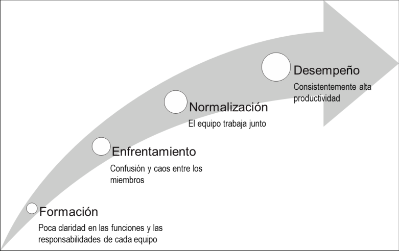

**Figura 3-9: Etapas de Tuckman de desarrollo de grupos** 

©2025 SCRUMstudy™. _Una guía para el cuerpo de conocimiento de Scrum (Guía SBOK®)_ **77** 

3 – ORGANIZACIÓN 

#### **3.9.2 Gestión de conflictos** 

Las organizaciones que aplican el marco de trabajo de Scrum fomentan un ambiente abierto y el diálogo entre los empleados. Los conflictos entre los integrantes del Equipo Scrum generalmente se resuelven en forma independiente, con poca o ninguna participación de la gerencia o de personas ajenas al equipo. El conflicto puede ser sano cuando promueve las discusiones en equipo y fomenta al debate, ya que por lo general esto se traduce en beneficios para el proyecto y para los respectivos miembros de los equipos. Por lo tanto, es importante que se fomente la resolución de los conflictos, promoviendo un entorno abierto donde los miembros del equipo se sientan alentados a expresar sus inquietudes y opiniones con los demás sobre el proyecto, y por último que estén de acuerdo en lo que habrá de entregarse y cómo se realizará el trabajo en cada sprint. Los miembros del equipo utilizan técnicas de gestión de conflictos para atender los conflictos que surjan durante un proyecto Scrum. Los orígenes de los conflictos evolucionan principalmente debido a los horarios, prioridades, recursos, informes de jerarquía, cuestiones técnicas, procedimientos, personalidad y costos. 

#### **3.9.3 Técnicas de gestión de conflictos** 

Hay generalmente cuatro métodos para gestionar conflictos en una organización que aplica los procesos de Scrum: 

1. Ganar-Ganar 

2. Perder-Ganar 

3. Perder-Perder 

4. Ganar-Perder 

##### **3.9.3.1 Ganar-Ganar** 

Por lo general es mejor que los miembros del equipo enfrenten los problemas directamente con una actitud de cooperación y abiertos al diálogo a fin de abordar cualquier desacuerdo y lograr un consenso. Este enfoque se denomina ganar-ganar. Las organizaciones que implementan Scrum deben promover un ambiente donde los empleados se sientan cómodos para dialogar y enfrentarse a los problemas y atenderlos para lograr resultados de ganar-ganar. 

##### **3.9.3.2 Perder-Ganar** 

Algunos miembros del equipo a veces pueden sentir que sus aportaciones no son reconocidas ni valoradas por los demás, o que no se les trata igual. Esto puede conducir a que no contribuyan de manera efectiva al proyecto y a que estén de acuerdo con todo lo que se les pida, incluso si están en desacuerdo. Este enfoque se llama perder-ganar. Esta situación puede darse si hay miembros en el equipo (inclusive los administradores) que utilizan un estilo autoritario o directivo para dar órdenes o no tratan a todos los miembros del equipo con igualdad. Este enfoque no es una técnica preferencial para la gestión de conflictos en los proyectos Scrum, ya que el aporte colectivo de todos los miembros del equipo es obligatorio para completar con éxito cada uno de los sprints. El Scrum Master debe fomentar la participación de los miembros del equipo que busquen alejarse de las situaciones de conflicto. Por ejemplo, es importante que todos los miembros del equipo hablen y contribuyan en cada Daily Standup para dar a conocer y manejar eficazmente cualquier problema o impedimento. 

**78** © 2025 SCRUMstudy™. _Una guía para el cuerpo de conocimiento de Scrum (Guía SBOK)_ 

3 – ORGANIZACIÓN 

**3** 

##### **3.9.3.3 Perder-Perder** 

En situaciones de conflicto, los miembros del equipo pueden intentar negociar o buscar soluciones que aporten solo un grado parcial o medida temporal de satisfacción a las partes en una disputa. Esta situación podría presentarse en equipos Scrum si los integrantes intentan negociar soluciones sub-óptimas para resolver un problema. Este enfoque suele implicar un poco de “dar para recibir” a fin de satisfacer a cada miembro del equipo, en vez de intentar resolver el verdadero problema. En general, esto se traduce en un resultado de perder-perder para los individuos involucrados y, en consecuencia, para el proyecto. El Equipo Scrum debe tener cuidado de que sus integrantes no lleguen a una mentalidad de perder-perder. Los Daily Standups y otras reuniones de Scrum se llevan a cabo para asegurar que los problemas reales se resuelvan mediante de discusiones mutuas. 

##### **3.9.3.4 Ganar-Perder** 

En ocasiones, un Scrum Master u otro miembro influyente del equipo, pueden creer ser un líder _de facto_ o manager y tratar de imponer su punto de vista sin tomar en cuenta los puntos de vista de los demás. Esta técnica de gestión de conflictos a menudo se caracteriza por la competitividad y por lo general resulta en ganarperder. Este enfoque no es recomendable cuando se trabaja en proyectos Scrum, ya que los equipos Scrum son por naturaleza autoorganizados y empoderados, donde nadie tiene una verdadera autoridad sobre otro integrante del equipo. Aunque el Equipo Scrum puede incluir personas con diferentes niveles de experiencia y conocimientos, cada miembro se trata por igual y nadie tiene la autoridad de ser el principal tomador de decisiones. 

#### **3.9.4 Estilos de liderazgo** 

Los estilos de liderazgo varían dependiendo de la organización, la situación, e incluso en los individuos y los objetivos específicos del proyecto Scrum. Algunos estilos de liderazgo comunes son los siguientes: 

- **Líder de apoyo:** Los líderes saben escuchar, tienen empatía, compromiso y conocimiento, y comparten el poder y la autoridad con los miembros del equipo. Los líderes de apoyo son auxiliares que logran resultados centrándose en las necesidades del equipo. Este estilo es la personificación del rol del Scrum Master. 

- **Líder que delega:** Los líderes que delegan están involucrados en la mayoría de la toma de decisiones; sin embargo, delegan parte de las responsabilidades de planificación y decisiones a los miembros del equipo, particularmente si son competentes para manejar las tareas asignadas. Este estilo de liderazgo es apropiado en situaciones en las que el líder está en sintonía con los detalles específicos del proyecto y cuando el tiempo es limitado. 

- **Líder autocrático:** Los líderes autocráticos toman decisiones por su cuenta, dándoles poco o nada de tiempo a los miembros del equipo antes de tomar una decisión. Este estilo de liderazgo debe utilizarse solamente en raras ocasiones. 

- **Líder directivo:** Los líderes directivos instruyen a los miembros del equipo sobre las tareas que se requieren y sobre cómo y cuándo deben llevarse a cabo. 

- **Líder** **_Laissez Faire:_** Es un estilo de liderazgo en el que el equipo se queda sin supervisión y donde el líder no interfiere con las actividades laborales diarias. Esto a menudo conduce a un estado de anarquía. 

©2025 SCRUMstudy™. _Una guía para el cuerpo de conocimiento de Scrum (Guía SBOK®)_ **79** 

3 – ORGANIZACIÓN 

- **Líder de entrenamiento:** Los líderes de entrenamiento dan instrucciones; después apoyan y monitorean a los miembros del equipo escuchando, ayudando, alentando y presentando una perspectiva positiva en tiempos de incertidumbre. 

- **Líder enfocado en las tareas:** Los líderes que se enfocan en las tareas se encargan de que se hagan las tareas con apego a los plazos. 

- **Líder asertivo:** Los líderes asertivos confrontan los problemas y demuestran confianza para establecer autoridad con respeto. 

##### **3.9.4.1 Liderazgo de apoyo** 

El estilo de liderazgo preferido en los proyectos Scrum es el liderazgo de apoyo. Larry Spears identifica diez rasgos que debe tener cada líder eficaz: 

1. **Escucha:** Se busca que los líderes escuchen con atención y sean receptivos a lo que se dice o no se dice. Estos son capaces de ponerse en contacto con su voz interior para comprender y reflexionar sobre sus propios sentimientos. 

2. **Empatía:** Los buenos líderes buenos aceptan y reconocen a los individuos por sus destrezas únicas y habilidades especiales. Asumen que los trabajadores tienen buenas intenciones y los aceptan como individuos, incluso cuando existen problemas de comportamiento o rendimiento. 

3. **Resiliencia:** La motivación y la capacidad de recuperarse a sí mismo y la relación con los demás es un fuerte rasgo de los líderes. Reconocen y se dan la oportunidad de ayudar a sus colegas que están pasando por dolor emocional. 

4. **Conciencia:** Ser consciente, especialmente ser autoconsciente, es un rasgo de los líderes. Esto les permite entender mejor e integrar los problemas, tales como los relacionados con la ética, el poder y los valores. 

5. **Persuasión:** Los líderes usan la persuasión, en vez de su posición de autoridad para obtener el consenso colectivo y tomar decisiones. En vez de forzar el cumplimiento y la coerción como es costumbre en algunos estilos autoritarios de gestión, los líderes practican la persuasión. 

6. **Conceptualización:** Una habilidad especial de los buenos líderes es ver y analizar los problemas (en una organización) desde una perspectiva conceptual y visionaria más amplia, en vez de centrarse en los objetivos inmediatos a corto plazo. 

7. **Previsión:** Su mente intuitiva les permite a los líderes utilizar y aplicar las lecciones del pasado y la realidad actual para prever el resultado de situaciones y decisiones actuales. 

8. **Administración:** La administración exige un compromiso de servir a los demás. Los líderes prefieren la persuasión por encima del control para obtener la confianza de los demás en la organización. 

9. **Compromiso con el crecimiento de los demás:** Los líderes tienen un profundo compromiso con el crecimiento de las personas dentro de su organización. Asumen la responsabilidad de nutrir el crecimiento personal, profesional y espiritual de los demás (por ejemplo, facilitando el acceso a recursos para el desarrollo personal y profesional, alentando a los trabajadores a participar en la toma de decisiones). 

10. **Desarrollo de una comunidad:** Los líderes están interesados en el desarrollo de comunidades dentro de un ambiente de trabajo. Esto es de gran importancia, en especial dado al cambio en muchas sociedades que dejan de ser comunidades pequeñas para convertirse en grandes instituciones que dan forma y que controlan las vidas humanas. 

**80** © 2025 SCRUMstudy™. _Una guía para el cuerpo de conocimiento de Scrum (Guía SBOK)_ 

3 – ORGANIZACIÓN 

**3** 

Scrum cree que todos los líderes de proyectos Scrum (incluyendo al Scrum Master y el Product Owner) deben ser líderes de apoyo que tengan las características mencionadas anteriormente. 

#### **3.9.5 Teoría de jerarquía de necesidades de Maslow** 

Maslow (1943) presenta una jerarquía de necesidades la cual reconoce que diferentes personas se encuentran en diferentes niveles en sus necesidades. Por lo general, la gente se preocupa de las necesidades fisiológicas y después se desplaza progresivamente hacia las necesidades jerárquicas. 

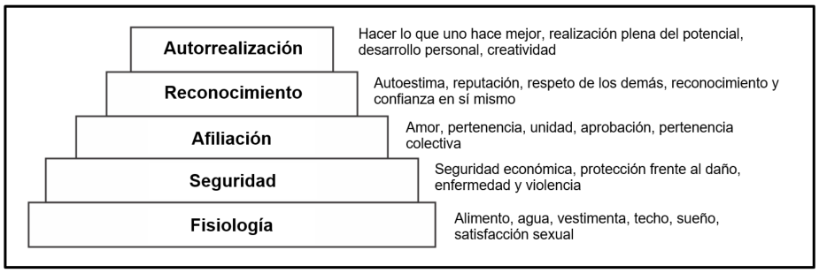

**Figura 3-10: Teoría de jerarquía de necesidades de Maslow** 

Para lograr el éxito, un Equipo Scrum necesita miembros principales y secundarios que hayan alcanzado los niveles de reconocimiento y autorrealización. El concepto de equipos autoorganizados, lo cual es un principio clave en Scrum, requiere que los miembros del equipo sean automotivados, que participen y contribuyan plenamente en el cumplimiento de los objetivos del proyecto. 

Como líder, el Scrum Master debe entender dónde se encuentra cada persona del equipo con relación a la pirámide. Este entendimiento le ayudará a determinar el mejor enfoque para motivar a cada individuo. 

Asimismo, todas las personas fluctúan de arriba a abajo en los niveles de jerarquía de necesidades a lo largo de la vida. Esto se debe a su propia motivación y esfuerzos para avanzar en la jerarquía o, a veces debido a factores fuera de su control. El objetivo del Scrum Master es trabajar con personas en el equipo para mejorar sus habilidades y conocimientos y ayudarle a ascender en la jerarquía de necesidades. Este apoyo resulta en un equipo que está formado por individuos motivados y que son fuertes colaboradores al proyecto y a la organización. 

#### **3.9.6 Teoría X, Teoría Y, Teoría Z** 

Douglas McGregor (1960) propuso dos teorías de gestión: 

- **Teoría X:** En la Teoría X, los líderes asumen que los empleados están inherentemente desmotivados y evitarán el trabajo si es posible, lo cual justifica un estilo autoritario de gestión. 

©2025 SCRUMstudy™. _Una guía para el cuerpo de conocimiento de Scrum (Guía SBOK®)_ **81** 

3 – ORGANIZACIÓN 

- **Teoría Y:** En la Teoría Y, los líderes asumen que los empleados son auto motivados y buscan aceptar una mayor responsabilidad. La Teoría Y implica un estilo más participativo de gestión. 

Abraham H. Maslow (1960) propuse la Teoría Z y William Ouchi (1980) presentó otra versión de la Teoría Z, que abunda sobre la Teoría X y la Teoría Y: 

- **Teoría Z:** En la versión de Maslow, los líderes de la Teoría Z suponen que los empleados pueden ser motivados aprovechando su deseo de trascender sin ignorar sus motivaciones relacionadas a la jerarquía de necesidades. En la versión de Ouchi, los líderes de la Teoría Z pueden ser motivados promoviendo la estabilidad mediante la seguridad laboral, alta moral y la satisfacción dentro y fuera del trabajo. 

Es improbable que los proyectos Scrum tengan éxito si el Scrum Master o el Product Owner son líderes de la Teoría X. Todos los líderes de proyectos Scrum deben apegarse a la Teoría Y la Teoría Z, a fin de que puedan ver a las personas como importantes activos y trabajen para desarrollar las habilidades del equipo y empoderar a sus integrantes, expresando su aprecio por el trabajo realizado para alcanzar los objetivos del proyecto. 

**82** © 2025 SCRUMstudy™. _Una guía para el cuerpo de conocimiento de Scrum (Guía SBOK)_ 

4 – JUSTIFICACIÓN DEL NEGOCIO 

**4** 

## **4. JUSTIFICACIÓN DEL NEGOCIO** 

### **4.1 Introducción** 

<mark>El objetivo de este capítulo es entender el concepto y el propósito de la justificación del negocio en su relación a proyectos Scrum. Es importante que una organización lleve a cabo una adecuada justificación del negocio</mark> y <mark>elabore una declaración de la visión del proyecto viable antes de iniciar cualquier proyecto. Esto ayudará a las personas claves que toman decisiones a entender la necesidad de negocio de cambio o de un nuevo producto o servicio, así como la justificación para seguir adelante con un proyecto. Esto también ayuda a que el</mark> Product Owne <mark>r elabore un backlog priorizado del producto tomando en cuenta las expectativas de negocio de la alta gerencia y de los i</mark> nteresados del negocio. 

<mark>La</mark> _<mark>justificación del negocio</mark>_ <mark>, según se define en la</mark> _<mark>Guía de los fundamentos de Scrum</mark>_ <mark>(</mark> _<mark>Guía del SBOK</mark>__®_ <mark>), aplica a lo siguiente:</mark> 

- Portafolios <mark>, programas o proyectos en cualquier industria;</mark> 

- <mark>Productos, servicios o cualquier otro resultado que se le entregue a los i</mark> nteresados del negocio; 

- <mark>Proyectos de cualquier tamaño o complejidad.</mark> 

<mark>El término “producto” en la</mark> _<mark>Guía del SBOK</mark>__®_ <mark>puede referirse a un producto, servicio, o cualquier otro entregable.</mark> 

<mark>Scrum se puede aplicar de manera efectiva a cualquier proyecto en cualquier industria, desde proyectos o equipos pequeños con tan solo seis miembros, hasta proyectos grandes y complejos con cientos de miembros.</mark> 

<mark>Este capítulo se divide en las siguientes secciones:</mark> 

**<mark>4.2 Guía de roles:</mark>** <mark>Esta sección ofrece información sobre las secciones relevantes para cada uno de los roles principales de Scrum: P</mark> roduct Owne <mark>r, Scrum Master y Equipo Scrum.</mark> 

**<mark>4.3 Entrega basada en el valor:</mark>** <mark>Esta sección describe el concepto del valor del negocio y su importancia en cualquier proyecto</mark> _<mark>.</mark>_ <mark>Brinda también información sobre las responsabilidades de los distintos individuos, incluyendo el</mark> Product Owner, <mark>quien participa en el logro del valor para el negocio.</mark> 

**<mark>4.4 Importancia de la justificación del negocio:</mark>** <mark>Esta sección describe la importancia de la justificación del negocio, los factores que la determinan y cómo se mantiene y se verifica durante todo el proyecto.</mark> 

**<mark>4.5 Técnicas de justificación del negocio:</mark>** <mark>Esta sección describe a detalle cómo se evalúa y se verifica la justificación del negocio utilizando diversas herramientas.</mark> 

**<mark>4.6 Justificación continua de valor:</mark>** <mark>Esta sección describe la importancia de la justificación continua de valor</mark> y <mark>abunda sobre la forma en la que esta se logra.</mark> 

**<mark>4.7 Confirmar la realización de beneficios:</mark>** <mark>Esta sección describe la forma en la que se logran los beneficios durante el proyecto.</mark> 

**<mark>4.8 Resumen de responsabilidades:</mark>** <mark>Esta sección define las responsabilidades pertinentes a la justificación del negocio para los miembros del equipo del proyecto en función de sus roles.</mark> 

**<mark>4.9 Scrum vs. Gestión tradicional de proyectos</mark>** <mark>: Esta sección destaca los beneficios de negocio del marco de trabajo de Scrum en comparación a los modelos tradicionales de gestión de proyectos.</mark> 

©2025 SCRUMstudy™. _Una guía para el cuerpo de conocimiento de Scrum (Guía SBOK®)_ **83** 

4 – JUSTIFICACIÓN DEL NEGOCIO 

#### **4.1.1 Guía de roles** 

1. Product Owner: La justificación del negocio la realiza principalmente el Product Owner; por lo tanto, todo este capítulo aplica más a este rol. 

2. Scrum Master: El Scrum Master debe estar familiarizado con todo este capítulo, con un enfoque principal en las secciones 4.3, 4.4, 4.6, 4.7 y 4.8. 

3. Equipo Scrum: El Equipo Scrum debe enfocarse principalmente en las secciones 4.3, 4.7 y 4.8. 

**84** © 2025 SCRUMstudy™. _Una guía para el cuerpo de conocimiento de Scrum (Guía SBOK®)_ 

4 – JUSTIFICACIÓN DEL NEGOCIO 

**4** 

### **4.2 Entrega basada en valor** 

Un proyecto es un emprendimiento colaborativo para crear nuevos productos o servicios, o para obtener resultados tal como los que se definen en la declaración de la visión del proyecto. Los proyectos por lo general se ven afectados por restricciones de tiempo, costo, alcance, calidad, personal y la capacidad de la organización. Por lo general, se busca que los resultados que generen los proyectos resulten en algún tipo de valor de negocio o servicio. 

Dado a que el valor es una razón principal de cualquier organización para seguir adelante con un proyecto, la entrega basada en valor debe ser el principal enfoque. El ofrecer valor es algo que está arraigado en el marco de trabajo de Scrum. Scrum facilita la entrega anticipada de valor en el proyecto y lo sigue haciendo a lo largo de su del ciclo de vida. 

Una de las características claves de cualquier proyecto es la incertidumbre de los resultados. Es imposible garantizar el éxito del proyecto, independientemente de su tamaño o complejidad. Por lo tanto, tomando en cuenta esta incertidumbre de alcanzar el éxito, es importante empezar a entregar resultados durante el proyecto tan pronto como sea posible. Esta entrega temprana de buenos resultados, y por lo tanto de valor, brinda una oportunidad para la reinversión, demostrando el valor del proyecto a los interesados del negocio. 

A fin de ofrecer una entrega basada en valor ( _Value-driven Delivery_ ), es importante: 

1. Entender lo que agrega valor a los clientes y usuarios y dar prioridad a los requerimientos de alto valor que encabezan el backlog priorizado del producto. 

2. Disminuir la incertidumbre y atender constantemente de los riesgos que potencialmente pudieran reducir el valor en caso de materializarse. También es importante trabajar en estrecha colaboración con los interesados del negocio del proyecto mostrándoles incrementos del producto al final de cada sprint, lo cual permite una gestión efectiva de cambios. 

3. Crear entregables basados en las prioridades determinadas por la producción de incrementos del producto potencialmente entregables durante cada sprint _._ De esta forma, los clientes empiezan a ver el valor desde el principio del proyecto _._ 

En Scrum, el concepto de la entrega basada en valor hace que el marco de trabajo de Scrum sea muy atractivo para los interesados del negocio y para la alta gerencia. Este concepto es muy diferente en comparación a los modelos tradicionales de gestión de proyectos, donde: 

1. A los requerimientos no se les da prioridad con base al valor del negocio; 

2. Los cambios en los requerimientos después del inicio del proyecto resultan difíciles y solo se pueden hacer mediante un tardado proceso de gestión; 

3. El valor se logra solo al final del proyecto, al entregarse el producto o servicio final. 

©2025 SCRUMstudy™. _Una guía para el cuerpo de conocimiento de Scrum (Guía SBOK®)_ **85** 

4 – JUSTIFICACIÓN DEL NEGOCIO 

La figura 4-1 contrasta la entrega basada en valor en Scrum en comparación a los proyectos tradicionales. 

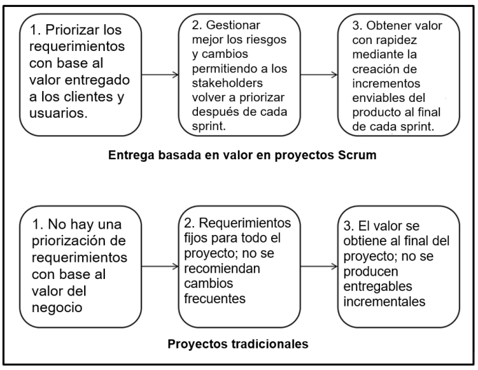

**Figura 4-1: Entrega de valor en Scrum vs. Proyectos tradicionales** 

#### **4.2.1 Responsabilidades del Product Owner en la justificación del negocio** 

La responsabilidad de priorizar y entregar valor de negocio para los proyectos en una organización le corresponde principalmente al Product Owner. Para los programas y portafolios, la responsabilidad recae en el Program Product Owner y en el Portfolio Product Owner, respectivamente. Su función es la de actuar como representantes efectivos del cliente o del patrocinador. Los lineamientos para la evaluación y medición del valor de negocio típicamente pueden ser establecidos por un Scrum Guidance Body. 

La figura 4-2 ilustra las responsabilidades de la justificación del negocio en orden jerárquico. 

- Entrega el valor para los portafolios 

- • Crea la justificación del negocio para los portafolios 

- Portfolio Product Owner • Proporciona una guía de valor para los programas • Aprueba la justificación del negocio para los programas • Entrega el valor de los programas • Crea la justificación del negocio para los programas 

- Program Product Owner • Proporciona una guía de valor para los proyectos • Aprueba la justificación del negocio para los proyectos 

**86** © 2025 SCRUMstudy™. _Una guía para el cuerpo de conocimiento de Scrum (Guía SBOK®)_ 

4 – JUSTIFICACIÓN DEL NEGOCIO 

**4** 

- Entrega el valor de los proyectos 

- • Crea la justificación del negocio para los proyectos 

- Product Owner • Le confirma el logro de beneficios a los interesados del negocio 

**Figura 4-2: Jerarquía de responsabilidades en la justificación del negocio** 

#### **4.2.2 Responsabilidades de otros roles de Scrum en la justificación del negocio** 

Es importante señalar que, aunque el Product Owner es el responsable principal de la justificación del negocio, hay otras personas en proyectos de Scrum que también contribuyen considerablemente de la siguiente forma: 

1. El **patrocinador** proporciona los fondos para el proyecto y supervisa constantemente el proyecto para confirmar el logro de los beneficios. 

2. Los **clientes** y **usuarios** participan en la definición de la lista priorizada de los requisitos y de las historias de usuario en backlog priorizado del producto; en la revisión de los entregables después de cada sprint o liberación y en la confirmación de los beneficios. 

3. El **Scrum Guidance Body** puede proporcionar directrices y recomendaciones relacionadas a las técnicas de justificación del negocio y confirmar la realización de beneficios, etc. Tales lineamientos y recomendaciones pueden después remitirse los equipos centrales de Scrum y a los interesados del negocio. 

4. El **Scrum Master** facilita la creación de entregables del proyecto; está a cargo de la gestión de riesgos, de cambios e impedimentos durante los procesos de _Realizar el Daily Standup_ y de la _Retrospectiva del sprint_ , entre otros. El Scrum Master se coordina con el Equipo Scrum para crear los entregables y con el Product Owner y otros interesados del negocio para asegurar que los beneficios del proyecto se materialicen. 

5. El **Equipo Scrum** trabaja en la creación de entregables del proyecto y contribuye a la creación de valor del negocio para todos los interesados del negocio y en el proyecto. El Equipo Scrum también participa en los procesos de _Desarrollar épicas_ , _Crear el backlog priorizado del producto_ , _Crear historias de usuario_ , _Estimar historias de usuario_ , _Comprometer historias de usuario,_ así como en procesos asociados donde se definen y se priorizan los requerimientos del negocio. El Equipo Scrum también ayuda en la identificación de riesgos y presenta solicitudes de cambio para las mejoras durante las reuniones de retrospectiva del sprint y otras reuniones. 

©2025 SCRUMstudy™. _Una guía para el cuerpo de conocimiento de Scrum (Guía SBOK®)_ **87** 

4 – JUSTIFICACIÓN DEL NEGOCIO 

### **4.3 La importancia de la justificación del negocio** 

La justificación del negocio demuestra las razones para emprender un proyecto. Responde a la pregunta: “¿Por qué es necesario este proyecto?” La justificación del negocio es lo que impulsa todas las decisiones relacionadas a un proyecto. Por lo tanto, es importante evaluar la viabilidad de un proyecto, no solo antes de comprometerse a gastos o inversiones considerables en las etapas iniciales, sino también a lo largo del ciclo de vida del proyecto. Un proyecto debe cancelarse si se considera que no es viable; la decisión debe ser escalada a los interesados del negocio pertinentes y a la alta gerencia. La justificación del negocio de un proyecto debe ser evaluada al inicio de este, en intervalos predefinidos durante todo el proyecto y en cualquier momento cuando surgen grandes problemas o riesgos que amenacen su viabilidad. 

#### **4.3.1 Factores para determinar la justificación del negocio** 

Existen numerosos factores que un Product Owner debe tomar en cuenta para determinar la justificación del negocio de un proyecto. Los siguientes son algunos de los factores más importantes: 

###### **1. Razonamiento del proyecto** 

El razonamiento del proyecto incluye todos los factores que este requiere, ya sean positivos, negativos, elegidos o no (por ejemplo: capacidad inadecuada para cumplir con la demanda actual y la demanda prevista, la disminución en la satisfacción del cliente, baja utilidad, requerimientos legales, etc.). 

###### **2. Necesidades del negocio** 

Las necesidades del negocio son aquellos resultados del negocio que se espera que cumpla el proyecto, tal como se documenta en la declaración de visión del proyecto. 

###### **3. Beneficios del proyecto** 

Los beneficios del proyecto incluyen todas las mejoras cuantificables de un producto, servicio o resultado que se pudieran obtener durante la conclusión satisfactoria de un proyecto. 

###### **4. Costo de oportunidad** 

El costo de oportunidad es el valor de la siguiente mejor opción de negocio o proyecto que fue descartado en favor del proyecto seleccionado. 

###### **5. Riesgos mayores** 

Los riesgos incluyen eventos inciertos o no planeados que pudieran afectar la viabilidad y el posible éxito del proyecto. 

###### 6. **Plazos del proyecto** 

Las escalas de tiempo reflejan la duración de un proyecto y el tiempo durante el cual se obtendrán sus los beneficios. 

###### **7. Costos del proyecto** 

Los costos del proyecto son las inversiones y demás costos de desarrollo en un proyecto. 

**88** © 2025 SCRUMstudy™. _Una guía para el cuerpo de conocimiento de Scrum (Guía SBOK®)_ 

4 – JUSTIFICACIÓN DEL NEGOCIO 

**4** 

#### **4.3.2 La justificación del negocio y el ciclo de vida del proyecto** 

Antes de iniciar un proyecto, primero se evalúa la justificación del negocio y se verifica constantemente durante todo su ciclo de vida. Los siguientes pasos captan la forma en la que se determina la justificación del negocio: 

###### **1. Evaluar y presentar un caso de negocio** 

La justificación del negocio para un proyecto normalmente la analiza y la confirma el Product Owner. Se documenta y se presenta en forma de caso de negocio del proyecto antes de la fase de inicio y consiste en tomar en cuenta los diversos factores especificados en la sección 4.4.1. Una vez documentado, el Product Owner debe crear una declaración de la visión del proyecto y obtener la aprobación de aquellos que toman las decisiones claves en la organización. Generalmente, son los ejecutivos o algún consejo administrativo del proyecto o del programa. 

###### **2. Justificación continua de valor** 

Una vez que los tomadores de decisiones aprueban la declaración de la visión del proyecto, esta se utiliza como base de referencia y forma la justificación del negocio. La justificación del negocio se valida durante toda la ejecución del proyecto _,_ por lo general en intervalos predefinidos, como en reuniones del portafolio, del programa o del backlog priorizado del producto y cuando se identifican los principales problemas y riesgos que amenazan la viabilidad del proyecto. Esto puede darse en varios procesos de Scrum, incluyendo el proceso de _Realizar el Daily Standup_ y en el _Refinar el backlog priorizado del producto_ . A lo largo del proyecto, el Product Owner debe mantener actualizada la justificación del negocio en la declaración de la visión del proyecto con información relevante del proyecto para que los que toman decisiones importantes continúen tomando decisiones informadas. 

###### **3. Confirmar la realización de beneficios** 

El Product Owner confirma el logro de los beneficios organizacionales durante el proyecto y al completar las historias de usuario en el backlog priorizado del producto. Los beneficios de los proyectos Scrum se materializan durante los procesos de _Demostrar y validar el sprint_ , _Retrospectiva del sprint_ , _Enviar entregables_ y _Retrospectiva de la liberación_ . 

©2025 SCRUMstudy™. _Una guía para el cuerpo de conocimiento de Scrum (Guía SBOK®)_ **89** 

4 – JUSTIFICACIÓN DEL NEGOCIO 

La figura 4-3 resume los pasos para determinar justificación del negocio. 

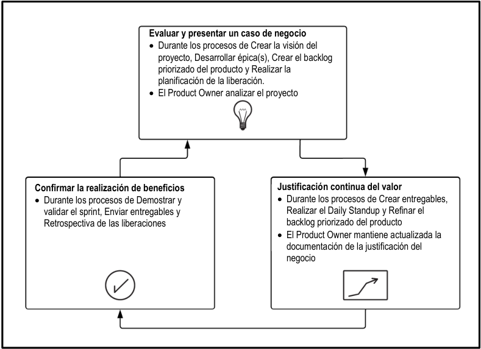

<!-- Start of picture text -->
Evaluar y presentar un caso de negocio • Durante los procesos de Crear la visión del proyecto, Desarrollar épica(s), Crear el backlog priorizado del producto y Realizar la planificación de la liberación. • El Product Owner analizar el proyecto Confirmar la realización de beneficios  Justificación continua del valor • Durante los procesos de Demostrar y  • Durante los procesos de Crear entregables, validar el sprint, Enviar entregables y  Realizar el Daily Standup y Refinar el Retrospectiva de las liberaciones backlog priorizado del producto • El Product Owner mantiene actualizada la documentación de la justificación del negocio <!-- End of picture text -->

**Figura 4-3: Justificación del negocio y el ciclo de vida del proyecto** 

**90** © 2025 SCRUMstudy™. _Una guía para el cuerpo de conocimiento de Scrum (Guía SBOK®)_ 

4 – JUSTIFICACIÓN DEL NEGOCIO 

**4** 

### **4.4 Técnicas de justificación del negocio** 

Las siguientes secciones abordan algunas de las herramientas que se utilizan para valorar y evaluar la justificación del negocio, así como otros aspectos relacionados a la justificación y selección del proyecto. No es necesario, ni se recomienda utilizar todas las técnicas disponibles para cada proyecto. Algunas técnicas no son apropiadas dependiendo del proyecto específico y algunas se pueden utilizar para evaluar los proyectos en forma individual o para comparar el valor esperado de múltiples proyectos. 

El Scrum Guidance Body (SGB), que puede consistir en un grupo de expertos o en un conjunto de documentos sobre normas y procedimientos de la organización, define los lineamientos y parámetros que se utilizarán para evaluar el valor del negocio. Sin embargo, cada Product Owner es responsable de llevar a cabo las actividades para verificar y dar seguimiento al valor de negocio para sus respectivos proyectos, programas o portafolios. 

#### **4.4.1 Estimación del valor del proyecto** 

El valor que se obtendrá por medio de los proyectos del negocio puede calcularse con diversos métodos, tales como el retorno de la inversión (ROI), el valor presente neto (NPV) y la tasa interna de retorno (IRR). 

###### **1. Retorno de la inversión (ROI)** 

Al utilizar el retorno de la inversión (ROI) para la justificación del proyecto, se evalúan los ingresos netos esperados que se buscan obtener a partir de un proyecto. Se calcula deduciendo los costos esperados o la inversión en un proyecto de su ingreso previsto; después se divide (la utilidad neta) por los costos previstos a fin de obtener la tasa de retorno. Otros factores, tales como la inflación y las tasas de interés sobre el dinero prestado pudieran incluirse en los cálculos del ROI. 

Fórmula del retorno de la inversión: 

ROI = (Ingresos del proyecto – Costo del proyecto) / Costo del proyecto 

_Ejemplo:_ El ROI para un proyecto que tendrá un costo de $125,000 en desarrollarse y con beneficios económicos estimados en $300,000, se calcula de la siguiente forma: 

RSI = ($300,000 – $125,000) / $125,000 = 1.4 

Por lo tanto, el ROI es 1.4 veces la inversión (o 140 %). 

Los incrementos frecuentes del servicio o producto son una base fundamental de Scrum que permiten la verificación temprana del ROI. Esto ayuda en la evaluación de la justificación continua de valor. 

###### **2. Valor presente neto (NPV)** 

El valor presente neto (NPV) es un método que se utiliza para determinar el valor neto actual de un futuro beneficio económico, dada una inflación o tasa de interés prevista. 

©2025 SCRUMstudy™. _Una guía para el cuerpo de conocimiento de Scrum (Guía SBOK®)_ **91** 

4 – JUSTIFICACIÓN DEL NEGOCIO 

En otras palabras, el NPV es el ingreso total esperado o los ingresos de un proyecto, restando el costo total previsto del proyecto y tomando en cuenta el valor actual de la divisa. 

_Ejemplo:_ ¿Cuál de los siguientes dos proyectos es la mejor opción si se utiliza el NPV como criterio de selección? 

- El proyecto A tiene un NPV de $1,500 y se completará en 5 años. 

- El proyecto B tiene un NPV de $1,000 y se completará en 1 año. 

_Solución:_ El proyecto A, ya que su NPV es más elevado. Aquí no se toma en cuenta el hecho de que el proyecto B tiene una duración más corta que el proyecto A, pues el tiempo ya está representado en los cálculos del NPV (debido a que es el valor actual y no el valor futuro que se considera en el cálculo). 

###### **3. Tasa interna de retorno (IRR)** 

La tasa interna de retorno (IRR), es una tasa de descuento sobre una inversión en la cual el valor actual de los flujos de efectivo se iguala al valor actual del flujo de salidas de efectivo a fin de evaluar la tasa de retorno del proyecto. Al hacer un comparativo de los proyectos, generalmente resulta mejor aquel que cuenta con una tasa interna de retorno más elevada. 

Aunque no se utiliza para justificar proyectos con tanta frecuencia como con algunas otras técnicas, tales como el NPV, la IRR es un concepto importante que hay que conocer. 

_Ejemplo:_ Basado en el IRR, ¿cuál proyecto es más conveniente? 

- Proyecto A, que tiene una IRR del 15 % y se completará en 5 años. 

- Proyecto B, que tiene una IRR del 10 % y se completará en 1 año. 

_Solución:_ El proyecto A, ya que su IRR es mayor. Aquí no se toma en cuenta el hecho de que el proyecto B tiene una duración más corta que el proyecto A, pues el tiempo ya está representado en los cálculos del IRR (tal como en el NPV, es el valor actual y no el valor futuro el que se utiliza para determinar la IRR). 

#### **4.4.2 Planificar según el valor** 

Después de justificar y confirmar el valor de un proyecto, el Product Owner debe considerar las políticas de la organización, los procedimientos, las plantillas y las normas generales dictadas por el Scrum Guidance Body (o el puesto similar o una junta organizacional del proyecto) en la planificación de un proyecto; y a la vez, maximizar la entrega basada en valor. 

**92** © 2025 SCRUMstudy™. _Una guía para el cuerpo de conocimiento de Scrum (Guía SBOK®)_ 

4 – JUSTIFICACIÓN DEL NEGOCIO 

**4** 

La planificación para el valor es la justificación y confirmación del valor del proyecto. La responsabilidad de determinar cómo se crea valor recae en los interesados del negocio (patrocinadores, clientes o usuarios), mientras que el Equipo Scrum se concentra en lo que se habrá de desarrollar. Algunas de las herramientas comunes recomendadas por un SGB pudieran ser las siguientes: 

###### **1. Mapeo de flujo de valor** 

El mapeo de flujo de valor ( _Value Stream Mapping_ ) utiliza diagramas de flujo para ilustrar el flujo de los pasos necesarios para completar un proceso. Esta técnica pudiera utilizarse para racionalizar un proceso ayudando a identificar y a eliminar elementos que no agregan valor, así como para aumentar la eficiencia. El mapeo de flujo de valor también se puede utilizar para mejorar los procesos de Scrum, por ejemplo, para mejorar la velocidad del sprint. 

La figura 4-4 muestra cómo la identificación de los tiempos de proceso y los tiempos de espera pueden ayudar a mejorar el sistema mediante la disminución de tiempos de espera y a mejorar la eficiencia de los procesos. 

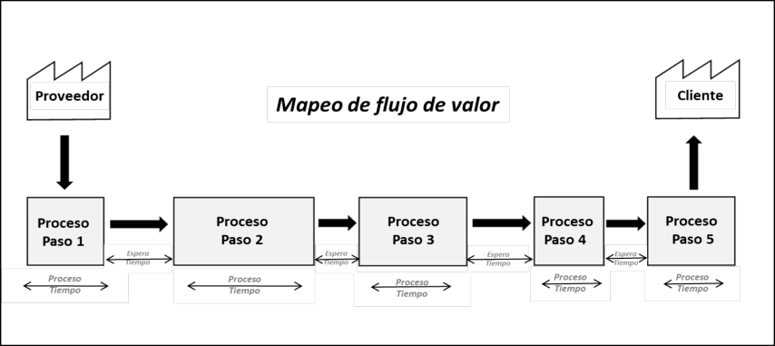

**Figura 4-4: Mapeo del flujo de valor** 

###### **_2._ Priorización basada en el valor para el cliente** 

La priorización basada en el valor para el cliente ( _Customer Value-based Prioritization_ ) le da importancia primordial al cliente y se esfuerza primero en implementar las historias de usuario con más alto valor. Dichas historias de usuario de alto valor se identifican y se colocan en la parte superior del backlog priorizado del producto. 

El equipo puede utilizar una variedad de esquemas de priorización para determinar las características de alto valor. 

- **Esquemas simples:** Los esquemas simples implican etiquetar elementos como prioridad “1”, “2”, “3” o “alta”, “media” y “baja”, etc. Aunque se trata de un método sencillo y directo, puede llegar a ser problemático, ya que a menudo hay una tendencia en etiquetar todo como prioridad “1” o “alta”. Incluso los métodos de priorización tales como “alta”, “media” y “baja” pueden encontrarse con dificultades similares. 

©2025 SCRUMstudy™. _Una guía para el cuerpo de conocimiento de Scrum (Guía SBOK®)_ **93** 

4 – JUSTIFICACIÓN DEL NEGOCIO 

- **Priorización MoSCoW:** El esquema de priorización MoSCoW obtiene su nombre de la versión en inglés de las frases: “Debe tener” ( _Must have_ ), “Debería tener” ( _Should have_ ), “Podría tener” ( _Could have_ ) y “No tendrá” ( _Won’t have_ ). Las etiquetas están en orden de prioridad decreciente con historias de usuario con características de “debería tener”, siendo aquellas sin las que el producto no tendrá valor, e historias de usuarios con características de “gustaría que tuviera” siendo aquellas que, a pesar de que sería bueno tener, no se es necesario incluir. 

- **Dinero de Monopoly:** El dinero de Monopoly es una técnica que consiste en darle al cliente dinero del juego Monopoly, o “dinero falso”, equivalente a la cantidad del presupuesto del proyecto, solicitando que lo distribuyan entre las historias de usuario que están a consideración. De esta forma, el cliente prioriza con base en lo que está dispuesto a pagar por cada historia de usuario. 

- **Método de los 100 puntos:** El método de los 100 puntos fue desarrollado por Dean Leffingwell y Don Widrig (2003). Implica otorgar 100 puntos al cliente a fin de que los pueda utilizar para votar por las características que consideren más importantes. 

- **Análisis de Kano:** El análisis de Kano fue desarrollado en 1984 por Noriaki Kano y consiste en clasificar las características o requisitos en cuatro categorías con base en las preferencias del cliente: 

   1. Calidad atractiva _(Exciters/Delighters):_ Características que son nuevas o de gran valor para el cliente 

   2. Calidad unidimensional _(Satisfiers)_ : Características que le ofrecen valor al cliente 

   3. Calidad requerida _(Dissatisfiers)_ : Características que, si no están presentes, pudieran causar la insatisfacción del cliente respecto al producto, pero que no afectan el nivel de satisfacción si se cuenta con ellas. 

   4. Calidad indiferente _(Indifferent)_ : Características que no afectarán al consumidor de ninguna manera y deben ser eliminadas. 

La figura 4-5 muestra una ilustración del Análisis de Kano. La presencia o ausencia de atributos en un producto o servicio puede afectar la satisfacción del cliente. Esta información puede ayudar a definir las prioridades relativas de las funcionalidades que ofrecen el mayor valor al cliente. 

**94** © 2025 SCRUMstudy™. _Una guía para el cuerpo de conocimiento de Scrum (Guía SBOK®)_ 

4 – JUSTIFICACIÓN DEL NEGOCIO 

**4** 

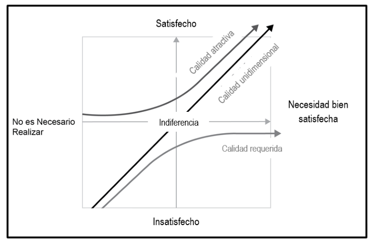

**Figura 4-5: Análisis de Kano** 

Curiosamente, con el tiempo, las características por lo general se desplazan hacia abajo en la lista de clasificación; los clientes esperan ciertas características (por ejemplo, las cámaras en los teléfonos) y dichas funciones dejaron de ser una calidad atractiva para convertirse, eventualmente, en calidad requerida. 

#### **4.4.3 Clasificación de priorización relativa** 

La clasificación de priorización relativa ( _Relative Prioritization Ranking_ ) es una simple enumeración de historias de usuario por orden de prioridad. Es un método eficaz para determinar las historias deseadas para cada iteración o liberación del producto o servicio. El objetivo es crear una lista simple, con el único objetivo de dar prioridad a las características, en vez de distraerse con múltiples esquemas de priorización. Esta sencilla lista también brinda una base para incorporar los cambios y los riesgos identificados cuando sea necesario. Cada cambio o riesgo identificado se puede incluir en la lista con base en su prioridad relativa a las demás historias de usuario en la lista. Típicamente, los nuevos cambios se incluirán a expensas de las características que se han asignado como con prioridad más baja. 

Definir las características mínimas de mercado ( _Minimum Marketable Features - MMF_ ) es de suma importancia durante este proceso, de modo que la primera versión o iteración ocurra tan pronto como sea posible, lo cual lleva a un aumento en el retorno de la inversión. Normalmente, estas historias de usuario se clasifican como alta prioridad. 

©2025 SCRUMstudy™. _Una guía para el cuerpo de conocimiento de Scrum (Guía SBOK®)_ **95** 

4 – JUSTIFICACIÓN DEL NEGOCIO 

#### **4.4.4 Mapeo de historias** 

El mapeo de historias ( _Story Mapping_ ), es una técnica para proporcionar un esquema visual del producto y sus componentes clave. El mapeo de historias, formulado por primera vez por Jeff Patton (2005), se utiliza comúnmente para ilustrar la ruta del producto. Los mapeos de historia representan la secuencia de las iteraciones de desarrollo del producto y trazan las características que serán incluidas en el primer, segundo, tercero y subsecuentes liberaciones. Al implementar Scrum, se entiende perfectamente que esto es solo una imagen del momento y se espera que sean revisados o modificados con frecuencia. 

El mapeo de historia de la figura 4-6 muestra cómo el Equipo Scrum planea las distintas liberaciones y les asigna una mayor prioridad a las liberaciones a corto plazo. Se espera que el equipo entienda mejor las historias de usuario en la siguiente liberación, y entre más separadas estén las liberaciones, más probabilidades hay de que cambien las futuras liberaciones. 

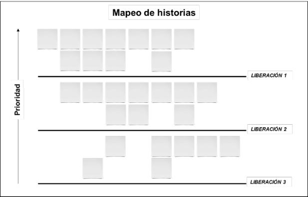

**Figura 4-6: Mapeo de historias** 

**96** © 2025 SCRUMstudy™. _Una guía para el cuerpo de conocimiento de Scrum (Guía SBOK®)_ 

4 – JUSTIFICACIÓN DEL NEGOCIO 

**4** 

### **4.5 Justificación continua de valor** 

El valor del negocio debe ser evaluado con frecuencia a fin de establecer si el proyecto aún tiene justificación o viabilidad. La evaluación frecuente de la inversión en el proyecto, con relación al valor del negocio que se está creando, sirve para calificar la viabilidad de un proyecto. Los requisitos esperados del proyecto pueden cambiar con frecuencia, lo que puede afectar la inversión del proyecto y la creación de valor. Un aspecto clave de Scrum es su capacidad para adaptarse rápidamente al caos creado por un modelo de negocio que cambia rápidamente. En los proyectos donde los requerimientos del usuario son ambiguos y los cambios son frecuentes, Scrum ofrece considerables ventajas sobre otros modelos de desarrollo. 

Un requisito importante en los proyectos Scrum es monitorear los índices de entrega. El seguimiento constante y los reportes sobre la creación de valor ayudan a evaluar el estado del proyecto y ofrecen información importante para el cliente y otros interesados del negocio. 

#### **4.5.1 Análisis del valor ganado (EVA)** 

Aunque se utilizan comúnmente, las herramientas tales como las gráficas de barras y diagramas de Gantt tienen sus limitaciones en el seguimiento y presentación de informes de progreso cuando se trata de rendimiento del proyecto. El análisis del valor ganado ( _Earned Value Analysis_ ) se utiliza para tales efectos. 

El análisis del valor ganado (EVA) analiza el verdadero rendimiento del proyecto en comparación al rendimiento planeado en un punto previsto. Para que las técnicas de rastreo sean eficaces, el plan de base del proyecto debe ser precio. El EVA generalmente utiliza gráficas y demás elementos visuales (Curva S) como forma de representar la información sobre el estado del proyecto. 

El análisis del valor ganado mide las variaciones actuales en el cronograma del proyecto, así como el costo de funcionamiento y prevé del costo final con base en el rendimiento actual determinado. El AVG generalmente se lleva a cabo al final de cada sprint una vez que se han concluido las historias de usuario y el backlog del sprint. 

©2025 SCRUMstudy™. _Una guía para el cuerpo de conocimiento de Scrum (Guía SBOK®)_ **97** 

4 – JUSTIFICACIÓN DEL NEGOCIO 

La tabla 4-1 es un resumen de las fórmulas que se utilizan en el análisis del valor ganado. 

|**Definición de término**|**Siglas**(inglés)|**Fórmula**|
|---|---|---|
|Valor planeado|PV||
|Valor ganado|EV||
|Costo actual|AC||
|Presupuesto al finalizar|BAC||
|Variación del cronograma|SV|EV – PV|
|Variación del costo|CV|EV – AC|
|Índice de desempeño del programa|SPI|EV / PV|
|Índice de desempeño de costo|CPI|EV / AC|
|Porcentaje completado|% Completado|(EV / BAC) x 100|
|Estimado al completar|||
|1. Las suposiciones de estimación no válidas 2. Las diferencias actuales son atípicas 3. Las variaciones actuales son típicas|EAC|1. AC + ETC 2. AC + BAC – EV 3. BAC / CPI|
|Estimado para completar|ETC|EAC – AC|
|Variancia al completar|VAC|BAC – EAC|

**Tabla 4-1: Fórmulas del valor ganado** 

**98** © 2025 SCRUMstudy™. _Una guía para el cuerpo de conocimiento de Scrum (Guía SBOK®)_ 

4 – JUSTIFICACIÓN DEL NEGOCIO 

**4** 

_Ejemplo:_ Hay un proyecto para desarrollar un sitio web con 4,000 páginas. Suponemos que cada página web tarda igual en completarse, y que cada página representa una historia de usuario única de igual prioridad en el backlog priorizado del producto. El costo estimado para completar el proyecto es de $400,000 y su límite de tiempo para es de 12 meses. Después de 6 meses, se han gastado $300,000 y el trabajo realizado es 1,000 páginas web. 

¿Qué información se nos ha proporcionado? 

- Presupuesto al finalizar (BAC) = $400,000 (Costo base del proyecto) 

- Valor planeado (PV) = $200,000 (ya que habíamos planeado completar 2,000 páginas web) 

- Valor ganado (EV) = $100,000 (el valor de 1,000 páginas web que se han completado) 

- Costo actual (AC) = $300,000 (lo que se ha gastado hasta el momento) 

**Curva S** para los datos: 

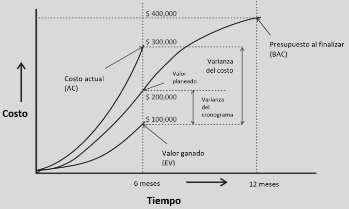

###### **Fórmulas:** 

- Variación del cronograma (SV) = EV – PV = $100,000 – $200,000 = –$100,000 

- Variación del costo (CV) = EV – AC = $100,000 – $300,000 = –$200,000 

   - Las variaciones negativas en nuestro proyecto indican que estamos atrasados en el programa y por encima del presupuesto. 

- Índice de desempeño del programa (SPI) = EV / PV = $100,000 / $200,000 = 0.5 

   - El SPI < 1 indica que el trabajo realizado hasta el momento es solo el 50 % de lo que habíamos planeado terminar en 6 meses. 

- Índice de desempeño de costo (CPI) = EV / AC = $100,000 / $300,000 = 0.33 

   - El CPI < 1 indica que solo termina el 33 % del trabajo por la cantidad de dinero que se gasta. 

- Porcentaje completado = EV / BAC x 100 = $100,000 / $400,000 x 100 = 25 % 

   - Por lo tanto, hasta el momento se ha completado el 25 % del trabajo en el proyecto. 

©2025 SCRUMstudy™. _Una guía para el cuerpo de conocimiento de Scrum (Guía SBOK®)_ **99** 

4 – JUSTIFICACIÓN DEL NEGOCIO 

#### **4.5.2 Diagrama de flujo acumulado (CFD)** 

El diagrama de flujo acumulado (CFD, por sus siglas en inglés) es una herramienta útil para la elaboración de informes y para el seguimiento de los resultados del proyecto. Proporciona una representación sencilla y visual del avance del proyecto en un punto de tiempo determinado. Se utiliza generalmente para brindar un estado de mayor nivel de la totalidad del proyecto y no para actualizaciones individuales diarias de sprints. 

La figura 4-7 muestra un ejemplo de un CFD en un proyecto grande. Muestra cuántas historias de usuario están por crearse, las que están en proceso de creación y las que ya se han creado. A medida que cambian los requisitos de los clientes, se produce un cambio en las historias de usuario acumuladas que serán entregadas. Los puntos de cambio 1 y 2 son donde el Product Owner ha eliminado las historias de usuario existentes en el backlog priorizado del producto ajustado al riesgo, mientras que los puntos de cambio 3 y 4 son donde el Product Owner agregó nuevas historias de usuario en dicha lista. 

Este tipo de diagrama puede ser una gran herramienta para la identificación de obstáculos y embotellamiento en los procesos. Por ejemplo, si el diagrama muestra una banda cada vez más estrecha, mientras la banda anterior con el tiempo está cada vez más amplia, pudiera haber un embotellamiento, por lo que pudieran ser necesarios cambios para aumentar la eficiencia o mejorar el desempeño del proyecto. 

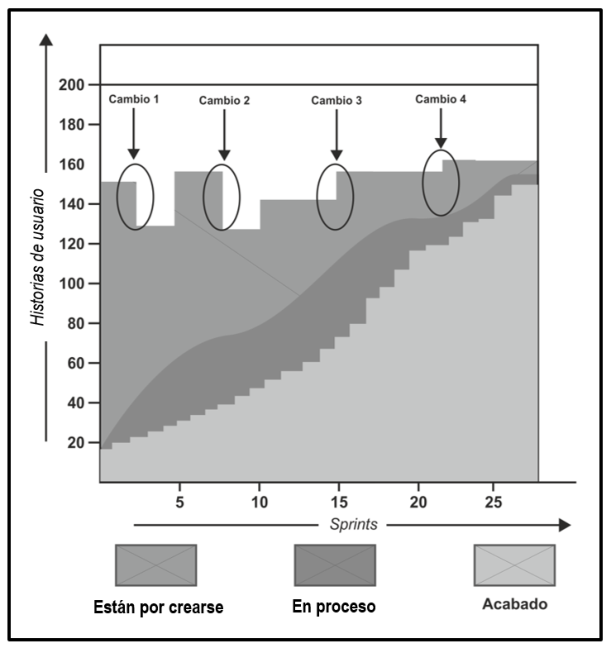

**Figura 4-7: Ejemplo de diagrama de flujo acumulado (CFD)** 

**100** © 2025 SCRUMstudy™. _Una guía para el cuerpo de conocimiento de Scrum (Guía SBOK®)_ 

4 – JUSTIFICACIÓN DEL NEGOCIO 

**4** 

### **4.6 Confirmar la realización de beneficios** 

A lo largo del proyecto es importante verificar si se están logrando los beneficios. Ya sea si los productos de un proyecto Scrum son tangibles o intangibles, se requieren técnicas adecuadas de verificación para confirmar que el equipo esté creando los entregables que lograrán los beneficios y el valor definido al inicio del proyecto _._ 

#### **4.6.1 Prototipos, simulaciones y demostraciones** 

La demostración de los prototipos a los clientes y simular su funcionalidad, son técnicas comúnmente utilizadas para confirmar el valor generado. 

Generalmente, después de usar las características o después de haberlas visto, los clientes pueden determinar con mayor claridad si son aptas y adecuadas para sus necesidades. Pueden percatarse de la necesidad de características adicionales, o pueden decidir modificar los requisitos de características previamente definidos. En el desarrollo de productos, esta experiencia del cliente ha llegado a ser conocida como IKIWISI, por sus siglas en inglés _(I’ll know it when I see it)_ o “Lo sabré cuando lo vea”. 

Por medio de las demostraciones o del acceso a las iteraciones anticipadas, los clientes pueden también evaluar a qué grado el equipo ha sabido interpretar sus necesidades y cumplir con sus expectativas. 

©2025 SCRUMstudy™. _Una guía para el cuerpo de conocimiento de Scrum (Guía SBOK®)_ **101** 

4 – JUSTIFICACIÓN DEL NEGOCIO 

### **4.7 Resumen de responsabilidades** 

|**Rol**||**Responsabilidades**|
|---|---|---|
|Equipo Scrum|• •|Se asegura de que los entregables del proyecto se completen de acuerdo con los criterios de aceptación acordados Lleva a cabo la justificación continua de valor en los proyectos|
|Product Owner/ Chief Product Owner|• • •|Asegura la entrega de valor en los proyectos Mantiene la justificación del negocio para los proyectos Confirma y comunica los beneficios del proyecto a los interesados del negocio|
|Scrum Master/ Chief Scrum Master|• •|Garantiza que los resultados esperados del proyecto sean comunicados al Equipo Scrum y que los entiendan Lleva a cabo la justificación continua de valor para los proyectos|
|Program Product Owner|• • • •|Garantiza la entrega de valor en los programas Crea la justificación del negocio en los programas Proporciona una guía de valor para los programas en los programas Aprueba la justificación del negocio de los programas en un programa|
|Program Scrum Master|• •|Garantiza que los resultados esperados del programa se comuniquen y se entiendan Lleva a cabo la justificación continua de valor para los programas|
|Portfolio Product Owner|• • • •|Garantiza la entrega de valor en los portafolios Crea la justificación del negocio en los portafolios Proporciona una guía de valor para los programas en los portafolios Aprueba la justificación del negocio de los programas en un portafolio|
|Portfolio Scrum Master|• •|Garantiza que se logren los resultados deseados del portafolio Lleva a cabo la justificación continua de valor para los portafolios|
|Interesados del negocio|• •|Ayuda a priorizar las historias de usuario y los requerimientos del backlog priorizado del producto. Se comunica con el Equipo Scrum y confirma la realización del valor al final de cada sprint, de cada liberación y del proyecto.|
|Scrum Guidance Body|• •|Establece las directrices generales y las métricas para evaluar el valor Actúa en forma consultiva y brinda asesoría en proyectos, programas y portafolios según sea necesario|

**Tabla 4-2: Resumen de las responsabilidades pertinentes a la justificación del negocio** 

**102** © 2025 SCRUMstudy™. _Una guía para el cuerpo de conocimiento de Scrum (Guía SBOK®)_ 

4 – JUSTIFICACIÓN DEL NEGOCIO 

**4** 

### **4.8 Scrum vs. Gestión tradicional de proyectos** 

Los proyectos tradicionales hacen énfasis en una amplia planificación y en el apego al plan de proyecto creado por el director del proyecto. Por lo general, los cambios se administran mediante un sistema formal de gestión de cambio y el valor se crea al final del proyecto cuando se entrega el producto final. 

En los proyectos Scrum no se realiza una planificación extensa de largo plazo antes de su ejecución. La planificación se realiza de manera iterativa antes de cada sprint. Esto permite una respuesta rápida y eficaz a los cambios, lo cual se traduce en menores costos y, en última instancia, aumenta la rentabilidad y el retorno de la inversión (ROI). Además, la entrega basada en valor (sección 4.3) es un beneficio clave del marco de trabajo de Scrum y brinda una mejor priorización y una más rápida entrega de valor para el negocio. Debido a la naturaleza iterativa del desarrollo Scrum, siempre hay al menos una versión disponible del producto con las características mínimas de mercado (MMF, por sus siglas en inglés). Incluso si un proyecto se cancela antes de completarse, por lo general hay algunos beneficios o valor generado antes de su interrupción. 

©2025 SCRUMstudy™. _Una guía para el cuerpo de conocimiento de Scrum (Guía SBOK®)_ **103** 

##### **Esta página ha sido dejada en blanco intencionalmente.** 

**104** © 2025 SCRUMstudy™. _Una guía para el cuerpo de conocimiento de Scrum (Guía SBOK®)_ 

5 – CALIDAD 

**5** 

## **5. CALIDAD** 

### **5.1 Introducción** 

<mark>El propósito de este capítulo es definir la calidad en lo que respecta a los proyectos y presentar el enfoque de Scrum para alcanzar los niveles de calidad requeridos.</mark> 

<mark>La calidad, tal como se define en la</mark> _<mark>Guía de los fundamentos de Scrum (Guía del SBOK</mark>__®_ _<mark>),</mark>_ <mark>es aplicable a los siguientes:</mark> 

- Portafolios <mark>, programas o proyectos en cualquier industria;</mark> 

- <mark>Productos, servicios o cualquier otro resultado que se entregará a los</mark> interesados del negocio; 

- <mark>Proyectos de cualquier tamaño o complejidad.</mark> 

<mark>El término “producto” en la</mark> _<mark>Guía del SBOK</mark>__®_ <mark>puede referirse a un producto, servicio, o cualquier otro entregable. Scrum se puede aplicar de manera efectiva a cualquier proyecto en cualquier industria: desde proyectos o equipos pequeños con tan solo seis miembros, hasta proyectos grandes y complejos con cientos de miembros.</mark> 

<mark>Este capítulo se divide en las siguientes secciones:</mark> 

**<mark>5.2 Guía de roles:</mark>** <mark>Esta sección presenta información sobre las secciones relevantes para cada uno de los roles principales de Scrum: P</mark> roduct Owne <mark>r, Scrum Master y el Equipo Scrum.</mark> 

**<mark>5.3 Definición de calidad:</mark>** <mark>Esta sección presenta la definición de Scrum sobre calidad, con una clara distinción de alcance y describe la relación entre la calidad y el valor del negocio.</mark> 

**<mark>5.4 Criterios de aceptación y el backlog priorizado del producto:</mark>** <mark>Esta sección hace énfasis en la importancia de los criterios de aceptación,</mark> el backlog priorizado del producto <mark>y la relación entre estos ambos. También se explica la definición de terminado en el contexto de Scrum.</mark> 

**<mark>5.5 Gestión de calidad en Scrum:</mark>** <mark>Esta sección proporciona detalles sobre planificación de calidad, control de calidad y garantía de calidad en el contexto de Scrum.</mark> 

**<mark>5.6 Resumen de responsabilidades:</mark>** <mark>Esta sección describe las responsabilidades pertinentes a la calidad para cada persona o rol en un proyecto.</mark> 

**<mark>5.7 Scrum vs. Gestión tradicional de proyectos:</mark>** <mark>Esta sección destaca los beneficios de la gestión de calidad en el método Scrum en comparación a los modelos tradicionales de gestión de proyectos.</mark> 

©2025 SCRUMstudy™. _Una guía para el cuerpo de conocimiento de Scrum (Guía SBOK®)_ **105** 

5 – CALIDAD 

#### **5.1.1 Guía de roles** 

1. Product Owner: Es importante que cualquier persona que asuma el rol de Product Owner en proyectos Scrum, lea completamente este capítulo. 

2. Scrum Master: El Scrum Master debe estar familiarizado con todo este capítulo, con un enfoque principal en las secciones 5.3, 5.4, 5.5.3 y 5.6. 

3. Equipo Scrum: El Equipo Scrum debe enfocarse principalmente en las secciones 5.3, 5.4 y 5.6. 

**106** ©2025 SCRUMstudy™. _Una guía para el cuerpo de conocimiento de Scrum (Guía SBOK®)_ 

5 – CALIDAD 

**5** 

### **5.2 Definición de calidad** 

<mark>Hay muchas formas de definir la calidad.</mark> 

<mark>En Scrum, la calidad se define como la capacidad con la que cuenta un producto terminado o los entregables para cumplir con los criterios de aceptación y lograr el valor del negocio que espera el cliente.</mark> 

<mark>Para asegurar que un proyecto cumpla con los requisitos de calidad, Scrum adopta un enfoque de mejora continua donde el equipo aprende de sus experiencias y de la participación de los</mark> interesados del negoci <mark>o para mantener constantemente actualizado el</mark> backlog priorizado del product <mark>o con cualquier cambio en los requerimientos. Dicho backlog se finaliza únicamente hasta el cierre o la conclusión del proyecto. Cualquier cambio en los requisitos refleja los cambios en el entorno de negocio interno y externo, y permite que el equipo funcione continuamente y se adapte para alcanzar esos requisitos. Scrum requiere que el trabajo se realice en incrementos durante los sprints, lo cual significa que los errores o defectos se detectan durante las pruebas de calidad repetitivas y no cuando el producto final o servicio está casi terminado. Asimismo, las tareas importantes relacionadas a la calidad (por ejemplo: desarrollo, pruebas y documentación) se completan como parte del mismo sprint por el mismo equipo; esto asegura que la calidad sea inherente a cualquier entregable terminado creado como parte de un sprint. Por lo tanto, la mejora continua con sus repetitivas pruebas optimiza la probabilidad de alcanzar los niveles esperados de calidad en un proyecto Scrum. El diálogo constante entre el equipo principal de Scrum y lo</mark> interesados del negocio <mark>(incluyendo clientes y usuarios) con incrementos reales del producto que se entregan al final de cada sprint, aseguran que se reduzca constantemente la brecha entre las expectativas de los clientes sobre el proyecto y los entregables producidos.</mark> 

#### **5.2.1 Calidad y alcance** 

<mark>Los requerimientos de alcance y calidad para un proyecto se determinan al tomarse en cuenta varios factores tales como los siguientes:</mark> 

- <mark>La necesidad del negocio que habrá de cumplir el proyecto</mark> 

- <mark>La capacidad y la disposición de la organización para cumplir con las necesidades del negocio</mark> 

- <mark>Las necesidades futuras y actuales del público meta</mark> 

<mark>El alcance (</mark> _<mark>scope</mark>_ <mark>) de un proyecto es la suma total de todos los incrementos del producto, así como el trabajo necesario para el desarrollo del producto final. La calidad es la capacidad que tienen los entregables para cumplir con los requisitos de calidad del producto y satisfacer las necesidades del cliente. En Scrum, el alcance y la calidad del proyecto se capturan en b</mark> acklog priorizado del product <mark>o, mientras que el alcance de cada sprint se determina por la refinación de los amplios elementos del b</mark> acklog priorizado del product <mark>o (PBIs, por sus siglas en inglés) en un conjunto de pequeñas, pero detalladas historias de usuario que pueden ser planeadas, desarrolladas y verificadas en un sprint.</mark> 

El Product Owne <mark>r refina constantemente el backlog priorizado del producto. El</mark> Product Owne <mark>r se asegura de que cualquier historia de usuario que debe desarrollar el Equipo Scrum en un sprint sea refinada antes de iniciar el sprint.</mark> 

©2025 SCRUMstudy™. _Una guía para el cuerpo de conocimiento de Scrum (Guía SBOK®)_ **107** 

5 – CALIDAD 

<mark>En general, los requerimientos más importantes en la resolución de los problemas del cliente o en el cumplimiento de sus necesidades, se consideran de alta prioridad, mientras que al resto se les da menor prioridad. Las historias de usuario de menor importancia se desarrollan en posteriores sprints o se pueden dejar de lado por completo según los requerimientos del cliente. A lo largo del proyecto, el Product Owner, el cliente y el Equipo Scrum analizan y cambian la lista de funcionalidades del producto a fin de cumplir con las necesidades cambiantes de los clientes.</mark> 

#### **5.2.2 Calidad y valor del negocio** 

<mark>La calidad y el valor del negocio están estrechamente vinculados. Por lo tanto, es fundamental entender la calidad y el alcance de un proyecto a fin de trazar correctamente los resultados y beneficios que debe lograr tanto el proyecto como su producto para ofrecer valor de negocio. Para determinar el valor de negocio de un producto, es importante entender la necesidad del negocio que impulsa los requisitos del mismo</mark> _<mark>.</mark>_ <mark>Por lo tanto, la necesidad del negocio determina cuál es el producto requerido, y este</mark> _<mark>,</mark>_ <mark>a su vez, proporciona el valor de negocio esperado.</mark> 

<mark>La calidad es una variable compleja. Aumentar el alcance sin incrementar el tiempo o los recursos tiende a reducir la calidad. De igual forma, una reducción de tiempo o de recursos sin disminuir el alcance generalmente resulta en una disminución de la calidad. En Scrum se cree en el trabajo a “ritmo sostenible”, lo cual ayuda a mejorar la calidad durante cierto periodo.</mark> 

El Scrum Guidance Body <mark>puede definir los requisitos mínimos de calidad y estándares que se deben cumplir en todos los proyectos de la organización. Todos los equipos de Scrum en la empresa deben apegarse a dichos estándares.</mark> 

**108** ©2025 SCRUMstudy™. _Una guía para el cuerpo de conocimiento de Scrum (Guía SBOK®)_ 

5 – CALIDAD 

**5** 

### **5.3 Criterios de aceptación y backlog priorizado del producto** 

El backlog priorizado del producto <mark>es un solo documento de requisitos que define el alcance del proyecto, proporcionando una lista de prioridades de las características del producto o servicio a ser entregado por el proyecto. Las características necesarias se describen en forma de historias de usuario. Dichas historias son requisitos específicos señalados por varios</mark> interesados del negocio <mark>que se relacionan con el producto o servicio propuesto. Cada historia de usuario contará con sus criterios de aceptación de historia de usuario (también conocidos como “criterios de aceptación”), que son los componentes objetivos mediante los cuales se juzga la funcionalidad de una historia de usuario. Los criterios de aceptación los desarrolla el</mark> Product Owne <mark>r según su experiencia en los requerimientos del cliente. El</mark> Product Owne <mark>r después comunica las historias de usuario que están en el b</mark> acklog priorizado del product <mark>o a los miembros del Equipo Scrum, buscando un común acuerdo. Los criterios de aceptación deben delinear explícitamente las condiciones que deben satisfacer las historias de usuario. Los criterios de aceptación claramente definidos son de suma importancia para la entrega eficaz y oportuna de la funcionalidad definida en las historias de usuario, lo cual, en última instancia, determinan el éxito del proyecto.</mark> 

<mark>Al final de cada sprint, el</mark> Product Owne <mark>r utiliza estos criterios para verificar los entregables completados y puede aceptar o rechazar entregables individuales, así como sus respectivas historias de usuario. Si los entregables son aceptados por el</mark> Product Owne <mark>r, la historia de usuario se considera entontes como terminada. Es importante contar con una clara definición de “terminado”, ya que ayuda a poner en claro los requerimientos y permite que el equipo se apegue a las normas de calidad. Ayuda también a que el equipo piense desde la perspectiva del usuario al momento de trabajar con historias de usuario.</mark> 

<mark>Las historias de usuario que corresponden a los entregables rechazados se agregan de nuevo al</mark> backlog priorizado del product <mark>o para ser desarrollados en futuros sprints. El rechazo de unos cuantos entregables individuales y sus correspondientes historias de usuario no significa el rechazo del producto final o del incremento del producto. El producto o el incremento del producto pudiera ser potencialmente enviable incluso si se rechazan algunas historias de usuario.</mark> 

©2025 SCRUMstudy™. _Una guía para el cuerpo de conocimiento de Scrum (Guía SBOK®)_ **109** 

5 – CALIDAD 

<mark>La figura 5-1 ilustra el concepto de los criterios de aceptación y el flujo de incremento del producto.</mark> 

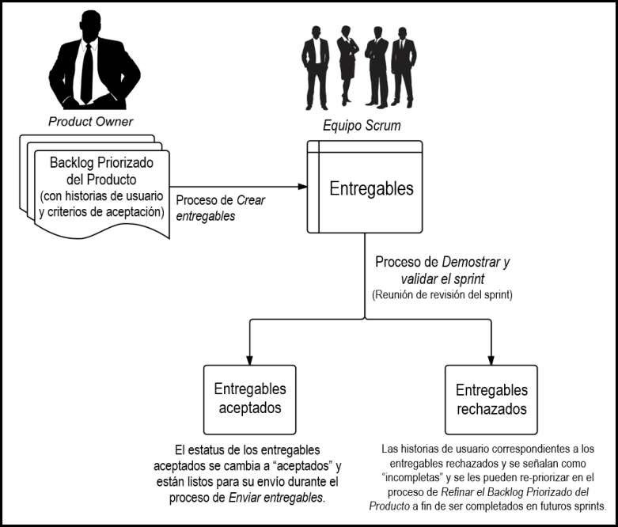

**Figura 5-1: Diagrama de flujo del incremento del proyecto** 

#### **5.3.1 Redacción de criterios de aceptación** 

<mark>Cada historia de usuario tiene sus propios criterios de aceptación y no sustituyen la lista de requerimientos. A continuación, se incluye un ejemplo de cómo se escriben los criterios de aceptación.</mark> 

_Ejemplo_ : 

**Personaje:** Janine es una profesional de 36 años; está casada y tiene tres hijos. Es una mujer ocupada y exitosa que equilibra su vida profesional y personal. Se siente cómoda con la tecnología y le gusta adoptar productos y servicios innovadores. Siempre está en línea a través de múltiples dispositivos y regularmente hace compras en portales de comercio electrónico. **Historia de usuario:** “Como compradora en línea, quiero la posibilidad de guardar y ver mi orden desde cualquiera de mis dispositivos para poder completar el pedido cuando mejor me convenga”. 

###### **Criterios de aceptación:** 

- Todas las órdenes en progreso deben guardarse como pendiente cada 5 segundos en la cuenta del usuario que haya iniciado una sesión. 

- Las nuevas órdenes pendientes deben mostraste como notificaciones en cualquier dispositivo de donde el usuario inicie sesión. 

**110** ©2025 SCRUMstudy™. _Una guía para el cuerpo de conocimiento de Scrum (Guía SBOK®)_ 

5 – CALIDAD 

**5** 

<mark>Es importante que el</mark> Product Owne <mark>r entienda que las historias de usuario que no cumplan con todos los criterios de aceptación no pueden aceptarse como terminadas, aun cuando cumplan con la mayoría. Los proyectos Scrum operan en sprints con un límite de tiempo (time-box) y con un backlog del sprint asignado a cada sprint. Generalmente, la última parte del trabajo pudiera ser la más complicada de la historia de usuario y pudiera tardar más de lo esperado. Si se les dio crédito a historias de usuario incompletas como si estuvieran terminadas —y si se llevaron al siguiente sprint—, el progreso de posteriores sprints pudiera verse interrumpido. Por lo tanto, el estado de “terminado” solo tiene dos opciones. Una historia de usuario únicamente puede clasificase como terminada o como no terminada.</mark> 

#### **5.3.2** **<mark>Definición de listo</mark>** 

<mark>La definición de listo</mark> _<mark>(Definition of Ready)</mark>_ <mark>es una serie de reglas o criterios aplicables a cada historia de usuario en el backlog priorizado del producto. Las historias de usuario deben satisfacer la definición de listo antes de ser estimadas e incluidas en un sprint. El Product Owner tiene la responsabilidad de definir adecuadamente la definición de listo en la historia de usuario, ya que, de lo contrario, será imposible obtener estimaciones confiables y el Equipo Scrum no podrá trabajar en los requerimientos de la historia.</mark> 

<mark>De preferencia, la definición de listo debe ser definida por el Scrum Guidance Body. Sin embargo, el Product Owner tal vez deba agregar o actualizar criterios específicos que ya existan un proyecto o una organización. El Equipo Scrum también puede agregar o actualizar la definición de listo.</mark> 

<mark>El Equipo Scrum se compromenterá a desarrollar aquellas historias de usuario que satisfagan los criterios de la definición de listo. La revisión de los elementos del backlog del producto en comparación los criterios de la definición de listo es una actividad constante en el proceso de</mark> _<mark>Refinar el backlog priorizado del producto</mark>_ <mark>.</mark> 

<mark>Algunos de los criterios en la definición de listo pudieran ser los siguientes:</mark> 

- <mark>Las historias de usuario se escriben con suficiente detalle a fin de que los Equipos Scrum las puedan entender y puedan ser utilizadas en las estimaciones;</mark> 

- <mark>Todas las historias de usuario cuentan con criterios de aceptación bien definidos;</mark> 

- <mark>Incluyen cualquier documentación relacionada que pudiera explicar mejor la historia de usuario;</mark> 

- <mark>Las historias de usuario se deben desglosar para que sean suficientemente pequeñas y puedan ser desarrolladas en un solo sprint.</mark> 

©2025 SCRUMstudy™. _Una guía para el cuerpo de conocimiento de Scrum (Guía SBOK®)_ **111** 

5 – CALIDAD 

<mark>La Figura 5-2 es una interfaz de Vabro, que muestra un ejemplo de definición de Listo (DoR) con criterios que garantizan que los elementos del backlog estén completamente preparados para la planificación de sprints.</mark> 

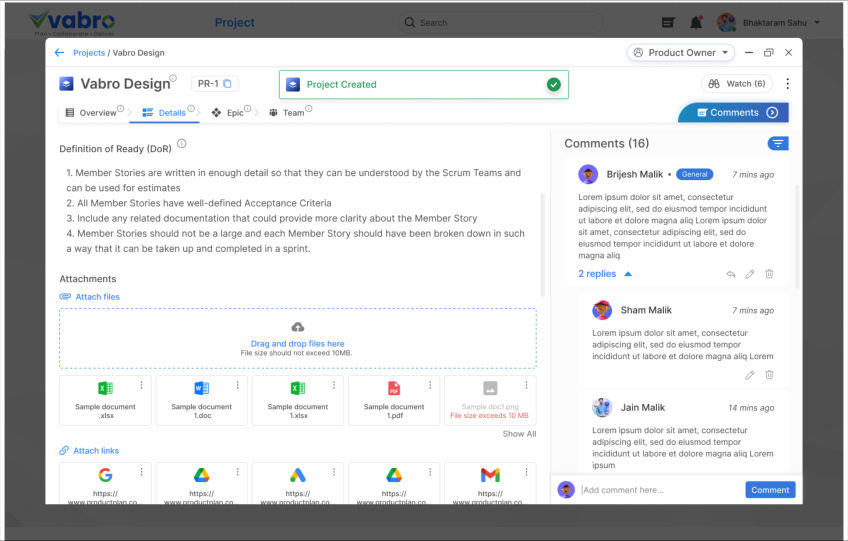

**Figura 5-2: Ejemplo de DoR presentado en una herramienta de proyecto Scrum impulsada por IA (Fuente: Vabro)** 

#### **5.3.3** **<mark>Definición de terminado (o criterios de terminado)</mark>** 

<mark>Hay una diferencia clave entre los “criterios de terminado” (</mark> _<mark>Done Criteria</mark>_ <mark>) y los “criterios de aceptación” (</mark> _<mark>Acceptance Criteria</mark>_ <mark>) Mientras que los criterios de aceptación aplican solo a historias de usuario individuales, los criterios de terminado son una serie de reglas aplicables a todas las historias de usuario en un determinado sprint. Los criterios de terminado pueden incluir cualquiera de los siguientes:</mark> 

- <mark>Fueron revisados por otros miembros del equipo;</mark> 

- <mark>Completaron la prueba de unidad de la historia de usuario;</mark> 

- <mark>Conclusión de las pruebas de garantía de calidad;</mark> 

- <mark>Conclusión de toda la documentación relacionada a la historia de usuario;</mark> 

- <mark>Se corrigieron todos los problemas;</mark> 

- <mark>Demostración satisfactoria a los</mark> interesados del negoci <mark>o o representantes del negocio.</mark> 

**112** ©2025 SCRUMstudy™. _Una guía para el cuerpo de conocimiento de Scrum (Guía SBOK®)_ 

5 – CALIDAD 

**5** 

<mark>La Figura 5-3 es una interfaz de Vabro, que muestra un ejemplo de Definición de Hecho (DoD), que incluye elementos de lista de verificación para garantizar la finalización de la tarea, las pruebas y la revisión.</mark> 

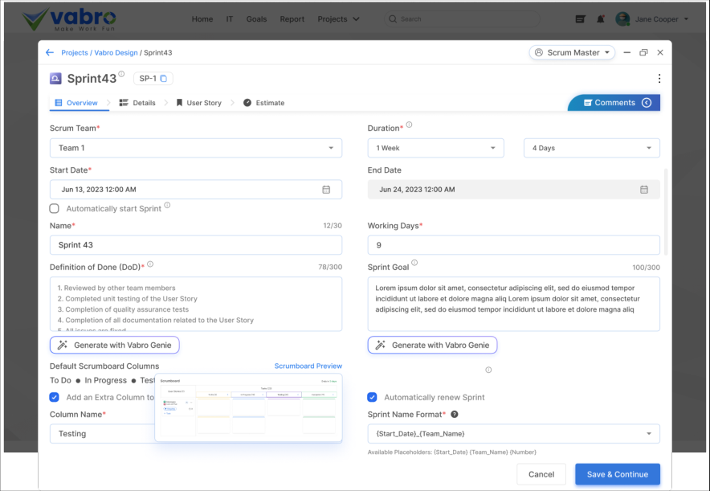

**Figura 5-3: : Ejemplo de DoD presentado en una herramienta de proyecto Scrum impulsada por IA (Fuente: Vabro)** 

<mark>Al igual que con los criterios de aceptación, se deben de cumplir todas las condiciones de los criterios de terminado para que la historia de usuario se considere terminada. El Equipo Scrum debe de utilizar una lista de verificación de los criterios de terminado en general para garantizar que una tarea está terminada y de que el resultado cumpla con la con la definición de terminado (DoD). Es importante contar con una clara definición de terminado, ya que ayuda a eliminar la ambigüedad y permite al equipo apegarse a las normas de calidad requeridas.</mark> 

<mark>Generalmente, el Scrum Guidance Body establece y documenta la definición de terminado (o los criterios de terminado). Sin embargo, tal vez existan criterios de terminado específicos en un proyecto u organización que deban se agregados o actualizados. El Equipo Scrum también puede agregar o actualizar los criterios de terminado.</mark> 

<mark>Los registros y datos necesarios para cumplir con los requisitos de documentación del proyecto se pueden generar a medida que el equipo procede avanza en los sprints y liberaciones. Incluir actividades tales como reuniones de revisión y redacción de documentos de diseño pueden ayudar a asegurar el cumplimiento de las normas de calidad internas y externas. Los principios básicos de Scrum, tales como iteraciones cortas, la construcción gradual, la participación del cliente, la adaptación a las nuevas necesidades y el constante ajuste de tiempo y costo en el proyecto seguirán siendo aplicables.</mark> 

©2025 SCRUMstudy™. _Una guía para el cuerpo de conocimiento de Scrum (Guía SBOK®)_ **113** 

5 – CALIDAD 

#### **5.3.4 Criterios mínimos de terminado** 

Una unidad de negocio de más alto nivel puede anunciar criterios mínimos de terminado obligatorios, los cuales después formarán parte de los criterios de aceptación de cualquier historia de usuario en esa unidad de negocio. Cualquier funcionalidad definida por la unidad de negocio debe satisfacer dichos criterios mínimos de aceptación si se busca la aceptación del respectivo Product Owner. La introducción a estos criterios de aceptación puede llevar a una serie en cascada de criterios de aceptación para el portafolio, el programa y el proyecto (véase la tabla 5-2). Por lo tanto, los criterios de aceptación de una historia de usuario en un proyecto habrán de incluir implícitamente todos los criterios mínimos de aceptación de los niveles más elevados, según corresponda. 

|Portfolio Product Owner|• Establece los criterios mínimos de terminado de todo el portafolio. • Revisa los entregables del portafolio.|
|---|---|
|Program Product Owner|• Establece los criterios mínimos de terminado de todo el programa, los cuales incluyen los criterios de terminado del portafolio. • Revisa los entregables del programa|
|Chief Product Owner o Product Owner|• Establece los criterios mínimos de terminado del proyecto, los cuales incluyen los criterios de terminado del programa. • Revisa los entregables del proyecto|

**Tabla 5-2: Criterios de terminado en cascada** 

Una vez que los criterios mínimos de terminado están definidos, se pueden incluir en los documentos del Scrum Guidance Body y presentarse a los equipos Scrum cuando sea necesario. 

#### **5.3.5 Aceptación o rechazo de elementos del backlog priorizado del producto** 

Hacia el final de cualquier iteración, los interesados del negocio y la unidad de negocio correspondiente participan en una reunión de revisión del sprint en la cual se demuestran los incrementos del producto al Product Owner, al patrocinador, al cliente y al usuario. Aunque se recoge la opinión de todos los interesados del negocio, únicamente el Product Owner tiene la autoridad para rechazar o aceptar como terminada una historia de usuario en particular, según los criterios de aceptación que fueron acordados. Por lo tanto, el rol de los criterios de aceptación en conservar la calidad es de suma importancia y debe entenderse claramente por el equipo. Es responsabilidad del Scrum Master asegurase de que los criterios de aceptación de una historia de usuario no sean modificados por el Product Owner a mitad de un sprint. Las historias de usuario parcialmente completadas son rechazadas como “no terminadas” y se devuelven al backlog priorizado del producto. 

**114** ©2025 SCRUMstudy™. _Una guía para el cuerpo de conocimiento de Scrum (Guía SBOK®)_ 

5 – CALIDAD 

**5** 

La Figura 5-4 es una interfaz de Vabro, que muestra el proceso de aprobación de historias de usuario, detallando los pasos para aceptar o rechazar historias en función de la validación de las partes interesadas. 

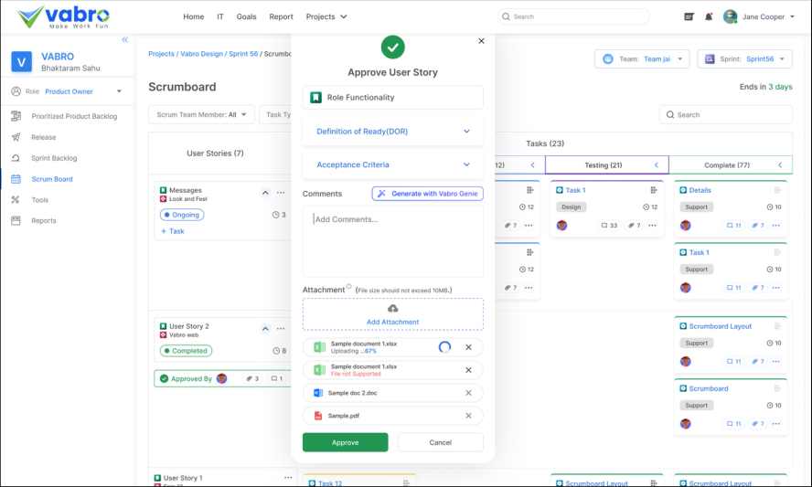

**Figura 5-4: Proceso de aprobación de historias de usuario en una herramienta de proyecto Scrum impulsada por IA (Fuente: Vabro)** 

©2025 SCRUMstudy™. _Una guía para el cuerpo de conocimiento de Scrum (Guía SBOK®)_ **115** 

5 – CALIDAD 

### **5.4 Gestión de calidad en Scrum** 

<mark>El cliente es el</mark> interesado <mark>más importante en cualquier proyecto; por lo tanto, es importante entender sus necesidades y requerimientos. La voz del cliente puede describirse como los requerimientos explícitos e implícitos del cliente, los cuales deben entenderse antes del diseño de un producto o servicio. Generalmente, en un entorno de Scrum, el</mark> Product Owne <mark>r se enfoca en los requerimientos y objetivos del negocio, los cuales, juntos, representan la voz del cliente. El</mark> Product Owne <mark>r se puede beneficiar considerablemente con la orientación del Scrum Guidance Body (ya sea a través de documentos, estándares de calidad o de expertos en calidad). Estos especialistas deben trabajar con el</mark> Product Owne <mark>r y con el cliente a fin de garantizar el nivel apropiado de detalle e información en las historias de usuario, ya que estas son la base del éxito de cualquier proyecto de Scrum.</mark> 

<mark>Cabe señalar que los</mark> interesados del negocio <mark>externos no participan directamente al nivel del Equipo Scrum</mark> y, <mark>en cambio, interactúan principalmente con el</mark> Product Owne <mark>r. Para cualquier proyecto Scrum, el cliente puede ser cualquiera de los siguientes:</mark> 

- <mark>Interno (dentro de la misma organización)</mark> 

- <mark>Externo (fuera de la organización)</mark> 

<mark>En Scrum, la gestión de calidad les permite a los clientes conocer cualquier problema en el proyecto en forma anticipada, ayudándoles a reconocer si el proyecto habrá o no de funcionarles. En Scrum, la calidad gira en torno a la satisfacción del cliente y de un producto funcional y no necesariamente en cumplir con parámetros arbitrarios. Dicha distinción resulta muy importante desde el punto de vista del cliente, ya que es quien invierte tiempo y dinero en el proyecto.</mark> 

<mark>En Scrum, la gestión de calidad se facilita mediante tres actividades interrelacionadas:</mark> 

1. <mark>Planificación de calidad</mark> 

2. <mark>Control de calidad</mark> 

3. <mark>Garantía de calidad</mark> 

#### **5.4.1 Planificación de calidad** 

<mark>Uno de los principios rectores de Scrum es desarrollar primero la funcionalidad de más alta prioridad para el cliente. Las características de menor importancia se desarrollan en posteriores sprints o pueden dejarse de lado completamente según los requerimientos del cliente. Este enfoque le brinda al Equipo Scrum el tiempo para centrarse en la calidad de la funcionalidad esencial. Un beneficio clave de la planificación de calidad es la reducción de la deuda técnica. La deuda técnica, conocida también como deuda de diseño o deuda de código,</mark> es el trabajo al que los equipos dan menor prioridad; el trabajo que omiten o que no terminan a medida que trabajan en la creación de los principales entregables asociados al producto del proyecto. La deuda técnica se acumula y se debe saldar a futuro. 

Algunas de las causas de la deuda técnica pueden ser: 

- Rápida solución y elaboración de entregables que no cumplan con los estándares de calidad, seguridad, metas de arquitectura a largo plazo, etc. 

**116** ©2025 SCRUMstudy™. _Una guía para el cuerpo de conocimiento de Scrum (Guía SBOK®)_ 

5 – CALIDAD 

**5** 

- Evaluación inadecuada o incompleta; 

- Documentación inadecuada o incompleta; 

- Falta de coordinación entre los distintos miembros del equipo, o si hay diferentes equipos de Scrum que empiezan a trabajar en forma aislada con menor enfoque en la integración final de los componentes requeridos para realizar un proyecto o programa exitoso. 

- Intercambio deficiente del conocimiento sobre el negocio y de procesos entre los interesados del negocio y los equipos del proyecto. 

- Demasiado énfasis en los objetivos del proyecto a corto plazo en vez de objetivos a largo plazo en la empresa. Esta supervisión puede resultar en una baja calidad de los entregables funcionales que pudiera incurrir en considerables costos de mantenimiento y actualización. 

<mark>En los proyectos Scrum, cualquier deuda técnica no debe llevarse más allá de un sprint, ya que debe de haber criterios de aceptación y de terminado debidamente definidos. La funcionalidad debe satisfacer dichos criterios para considerarlos terminados. Conforme se refina el</mark> backlog priorizado del product <mark>o y se da prioridad a las historias de usuario, el equipo elabora regularmente entregables funcionales, previniendo con ello la acumulación de una deuda técnica considerable. El Scrum Guidance Body pudiera también incluir documentación y definición de los procesos que ayudan a disminuir dicha deuda.</mark> 

<mark>Para conservar una cantidad mínima de deuda técnica, es importante definir el producto requerido en un sprint y del proyecto, así como los criterios de terminado, cualquier método de desarrollo a seguir y las responsabilidades clave de los miembros del Equipo Scrum respecto a la calidad. Definir los criterios de calidad es una parte importante de la planificación de calidad y permite que se lleve a cabo un control eficaz de la misma durante el proyecto.</mark> 

<mark>La deuda técnica es un gran reto con algunas técnicas de gestión tradicional de proyectos donde el desarrollo, la evaluación, la documentación, etc., se realizan en forma subsecuente y por lo general por distintas personas, donde ninguna es responsable de cualquier entregable funcional en particular. Como resultado, la deuda técnica se acumula, llevando a un mantenimiento considerablemente más elevado, integración y costos de liberación del producto en las etapas finales su liberación. Asimismo, el costo de los cambios es muy elevado en tales circunstancias, ya que los problemas surgen en etapas posteriores del proyecto. El</mark> marco de trabaj <mark>o de Scrum evita los problemas relacionados a la deuda técnica, garantizando que se definan los entregables terminados con criterios de aceptación como parte del backlog del sprint y que las tareas clave, incluyendo el desarrollo, la evaluación y la documentación, se lleven a cabo como parte del mismo sprint y por el mismo Equipo Scrum.</mark> 

##### **5.4.1.1 Integración continua y ritmo sostenible** 

<mark>Mantener un ritmo sostenible es uno de los principios más importantes de Scrum. El ritmo sostenible se traduce en una mayor satisfacción del empleado, en estabilidad y una mayor precisión en la estimación. Todo esto conlleva, en última instancia, a un aumento en la satisfacción del cliente. Para desarrollar un producto verdaderamente de alta calidad y conservar un sano ambiente laboral, es importante realizar periódicamente actividades de integración, en vez de retrasar el trabajo de integración hasta el final en tales circunstancias. Para brindar valor en intervalos frecuentes, el equipo debe continuamente desarrollar, evaluar e integrar las funcionalidades de cada elemento en el</mark> backlog priorizado del product <mark>o en cada sprint con el uso de técnicas, tales como la integración continua y la evaluación automática del producto. También es importante, desde la perspectiva del equipo, garantizar que el esfuerzo realizado en el actual sprint sea similar al esfuerzo realizado en el sprint anterior a fin de sostener un ritmo constante durante los sprints en el proyecto.</mark> 

©2025 SCRUMstudy™. _Una guía para el cuerpo de conocimiento de Scrum (Guía SBOK®)_ **117** 

5 – CALIDAD 

<mark>Esto ayuda al equipo a evitar fases de intensos periodos de trabajo, garantizando que puedan siempre presentar el esfuerzo requerido para lograr el trabajo que debe realizarse. Uno de los preceptos más importantes de Scrum y de otras prácticas ágiles como DevOps es mantener un ritmo sostenible.</mark> 

#### **5.4.2 Garantía de calidad y control de calidad** 

La calidad es necesaria no solo en los productos, sino también en los procesos. La garantía de calidad es la evaluación de procesos y estándares que rigen la gestión de calidad en un proyecto a fin de garantizar que continúen siendo relevantes. Las actividades relacionadas a la garantía de calidad se llevan a cabo como parte del trabajo. De hecho, la garantía de calidad es un factor considerable en la definición de terminado. El entregable no se considera completo si no se ha realizado una garantía adecuada de calidad. Generalmente, la garantía de calidad se demuestra durante la reunión de revisión del sprint. 

El Product Owner de los proyectos respectivos, programas y portafolios, puede monitorear y evaluar las actividades de garantía de calidad para asegurarse de que cada equipo sigua de acuerdo y cumpla con los estándares de calidad que se han establecido. La garantía de calidad de un extremo al otro puede abordarse durante la evaluación final del producto, de una <mark>liberación</mark> de un sprint. Se puede realizar una comparación de la cantidad de problemas que se encontraron con relación a la cantidad de historias de usuario completadas. Los componentes del producto que tienen defectos se pueden incorporar como elementos del backlog priorizado del producto, mismos que se pueden abordar ya sea por el equipo o por una persona durante ciertos periodos durante el sprint, dependiendo del número de defectos. 

El control de calidad es la ejecución de las actividades de calidad planeadas por el Equipo Scrum en el proceso de creación de entregables con la potencialidad de enviarse. Incluye también el aprendizaje de cada serie de actividades realizadas a fin de lograr una mejora continua. Dentro del equipo multidisciplinario, es importante contar con las habilidades necesarias para llevar a cabo actividades de control de calidad. Durante la reunión de retrospectiva del sprint, los miembros del equipo analizan las lecciones aprendidas. Dichas lecciones sirven para la mejora continua y contribuyen al mejoramiento del constante control de calidad. 

En ocasiones, el Scrum Guidance Body puede definir los procesos y documentos que pueden remitirse a los equipos al momento de hacer sus proyectos a fin de asegurase de que se les dé seguimiento a las normas uniformes de calidad en todos los proyectos al interior de la empresa. 

#### **5.4.3 Ciclo de planificar, hacer, verificar y actuar (PDCA)** 

El ciclo de planificar, hacer, verificar y actuar (PDCA, por sus siglas en inglés), conocido también como Ciclo Deming o Shewhart, fue desarrollado por el doctor W. Edwards Deming, considerado como el padre del control de calidad moderno, y por el doctor Walter A. Shewhart. Estas son algunos de los puntos más importantes de la filosofía de Deming: 

Los lineamientos de la gerencia definen la calidad. Cuando la gerencia puede ofrecer un ambiente propicio y motivar a sus empleados para que mejore la calidad en forma continua, cada empleado podrá contribuir hacia una calidad superior en el producto. 

**118** ©2025 SCRUMstudy™. _Una guía para el cuerpo de conocimiento de Scrum (Guía SBOK®)_ 

5 – CALIDAD 

**5** 

La “Teoría del conocimiento profundo” de Deming aboga por lo que debe hacer la gerencia a fin de crear un ambiente en el cual cada empleado puede realizar contribuciones considerables para mejorar la calidad. 

Deming modificó después el nombre de “planificar, hacer, verificar y actuar” a “planificar, hacer, estudiar y actuar” (PDSA), ya que consideraba que el término “estudiar” hacía énfasis en el análisis en vez de simplemente la inspección, como lo implica el término “verificar”. 

Tanto Scrum como el Ciclo Deming/Shewhart/PDCA son métodos iterativos enfocados en la mejora continua. 

La figura 5-5 ilustra las etapas del ciclo PDCA y su correlación con los diversos procesos de Scrum. 

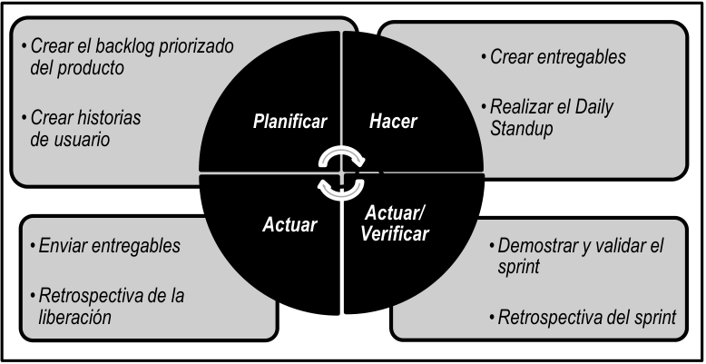

<!-- Start of picture text -->
• Crear el backlog priorizado • Crear entregables del producto • Realizar el Daily • Crear historias  Planificar Hacer Standup de usuario Actuar/ Actuar Verificar • Enviar entregables • Demostrar y validar el sprint • Retrospectiva de la liberación • Retrospectiva del sprint <!-- End of picture text -->

**Figura 5-5: Ciclo PDCA en Scrum** 

©2025 SCRUMstudy™. _Una guía para el cuerpo de conocimiento de Scrum (Guía SBOK®)_ **119** 

5 – CALIDAD 

### **5.5 Resumen de responsabilidades** 

|**Rol**|**Responsabilidades**|
|---|---|
|Equipo Scrum|• Desarrolla y da mantenimiento todos los entregables durante los sprints hasta que pasen a manos de los usuarios finales. • Pone en práctica y fomenta la buena comunicación a fin de que los requerimientos queden clarificados y completamente entendidos. • Comparte conocimiento para garantizar que los miembros se familiaricen con la serie de características y con ello se beneficien de la experiencia de otros. • Hace cambios adecuados con rapidez a los entregables. • Cumple con los criterios de la definición de terminado de cada entregable|
|Product Owner/ Chief Product Owner|• Presenta los requerimientos del negocio en el producto y define con claridad los requerimientos en el backlog priorizado del producto. • Evalúa la viabilidad y se asegura de que los entregables cumplan con los requisitos de calidad. • Establece los criterios mínimos de terminado en todo el proyecto, incluyendo los criterios de aceptación del programa respectivo. • Facilita la creación de los criterios de aceptación para las historias de usuario. • Revisa y valida los entregables durante el proceso de_Demostrar y validar el sprint_.|
||• Fomenta la mentalidad de “primero el equipo” cuando se trata de calidad. • Elimina obstáculos ambientales que pudieran afectar la calidad de los entregables y procesos.|
|Scrum Master/ Chief Scrum Master|• Se asegura de que se mantenga un ritmo sostenible cuyo enfoque sea calidad de las características en vez de estrictamente en la velocidad. • Se asegura de que todos los integrantes del equipo, incluyendo el Product Owner, sigan correctamente los procesos de Scrum.|
|Program Product Owner|• Establece criterios mínimos de aceptación para todo el programa. • Revisa los entregables del programa.|
|Program Scrum Master|• Se asegura de que se mantenga un ritmo sostenible cuyo enfoque sea la calidad de las características y no estrictamente en la velocidad.|
|Portfolio Product Owner|• Establece criterios mínimos de aceptación para todo el portafolio. • Revisa los entregables del portafolio.|
|Portfolio Scrum Master|• Se asegura de que se mantenga un ritmo sostenible cuyo enfoque sea la calidad de las características y no estrictamente en la velocidad.|
|Interesados del negocio|• Revisan y opinan sobre los entregables del producto. • Trabajan en colaboración con el Product Owner y con el Equipo Scrum|
||• Proporciona la definición de terminado.|
|Scrum Guidance Body|• Proporciona unmarco de trabajo y una guía para desarrollar los criterios de aceptación. • Define la gama de herramientas que puede utilizar el Equipo Scrum para desarrollar y verificar el producto.|

**Tabla 5-2: Resumen de las responsabilidades pertinentes a la calidad** 

**120** ©2025 SCRUMstudy™. _Una guía para el cuerpo de conocimiento de Scrum (Guía SBOK®)_ 

5 – CALIDAD 

**5** 

### **5.6 Scrum vs. Gestión tradicional de proyectos** 

Aunque hay similitudes entre Scrum y los métodos tradicionales de gestión de proyectos con relación a la definición de “calidad” (la capacidad con la que cuenta el producto para cumplir con los criterios de aceptación acordados y lograr el valor de negocio que espera el cliente), existen diferencias en términos de cómo los métodos abordan la implementación y logro de los niveles exigidos de calidad. 

En los métodos tradicionales de gestión de proyectos, los usuarios aclaran sus expectativas; el director del proyecto define dichas expectativas en términos cuantificarles y obtiene la aprobación de los usuarios. Después de una planificación detallada, el equipo del proyecto desarrolla el producto durante un período acordado. Si hay necesidad de cambiar alguno de los criterios acordados, los cambios se pueden realizar solo a través de un sistema formal de gestión de cambio, en el cual se estima el impacto de los cambios y el director del proyecto consigue la aprobación de todos los interesados del negocio relevantes. 

Sin embargo, en Scrum, el Product Owner colabora con el Equipo Scrum y define los criterios de aceptación de las historias de usuario relacionadas al producto que se debe entregar. El Equipo Scrum, después desarrolla el producto a partir de una serie de iteraciones cortas denominadas sprints. El Product Owner puede realizar cambios en los requisitos para mantenerse al ritmo de las necesidades del usuario y estos cambios pueden ser abordados por el Equipo Scrum, ya sea al concluir el actual sprint, o al incluir los requisitos ajustados en el próximo sprint, ya que cada uno es de muy corta duración (de una a cuatro semanas). 

<mark>Una de las principales ventajas de Scrum es el énfasis en la creación de entregables potencialmente liberables para ser enviados al final de cada ciclo de sprint, en vez de esperar al final de todo el proyecto. Así, el</mark> Product Owne <mark>r y los clientes constantemente inspeccionan, aprueban y aceptan entregables después de cada sprint. Incluso, si un proyecto Scrum se cancela antes de tiempo, siempre existe algo de valor que fue creado antes de la terminación como resultado de los entregables creados en sprints</mark> individuales. 

©2025 SCRUMstudy™. _Una guía para el cuerpo de conocimiento de Scrum (Guía SBOK®)_ **121** 

**<mark>Esta página ha sido dejada en blanco intencionalmente.</mark>** 

**122** ©2025 SCRUMstudy™. _Una guía para el cuerpo de conocimiento de Scrum (Guía SBOK®)_ 

6 – CAMBIO 

**6** 

## **6. CAMBIO** 

### **6.1 Introducción** 

<mark>Cada proyecto, independientemente de su método o m</mark> arco de trabaj <mark>o, está expuesto al cambio. Es importante que los miembros del equipo del proyecto entiendan que los procesos de desarrollo de Scrum están diseñados para aceptar el cambio. Las organizaciones deben tratar de maximizar los beneficios que se derivan de los cambios y disminuir los impactos negativos a través de los procesos de gestión de cambio diligente según los principios de Scrum.</mark> 

<mark>El cambio</mark> _<mark>,</mark>_ <mark>tal como se define en</mark> _<mark>Guía de los fundamentos de Scrum (Guía del SBOK</mark>__®_ _<mark>),</mark>_ <mark>es aplicable a los siguientes:</mark> 

- <mark>Portafolios, programas o proyectos en cualquier industria</mark> 

- <mark>Productos, servicios o cualquier otro resultado que se entregará a los</mark> interesados del negocio 

- <mark>Proyectos de cualquier tamaño y complejidad</mark> 

<mark>El término “producto” en la</mark> _<mark>Guía del SBOK</mark>__®_ <mark>puede referirse a un producto, servicio, o cualquier otro entregable. Scrum puede aplicarse de manera efectiva a cualquier proyecto en cualquier industria, desde proyectos o equipos pequeños con tan solo seis miembros, hasta proyectos grandes y complejos con cientos de miembros.</mark> 

<mark>Este capítulo está dividido en las siguientes secciones:</mark> 

**<mark>6.2 Guía de roles:</mark>** <mark>Esta sección presenta información sobre las secciones relevantes para cada uno de los roles principales de Scrum:</mark> Product Owne <mark>r, Scrum Master y Equipo Scrum.</mark> 

**<mark>6.3 Información general:</mark>** <mark>Esta sección define el concepto del cambio, específicamente dentro del contexto de los procesos de Scrum. También ilustra la forma en la que las solicitudes de cambios se manejan en los procesos de Scrum.</mark> 

**<mark>6.4 Cambio en Scrum:</mark>** <mark>Esta sección describe la importancia de gestionar con eficacia el cambio en un proyecto Scrum. También se habla de cómo se pueden lograr la flexibilidad y la estabilidad a través del manejo adecuado de las solicitudes de cambio que surgen a lo largo de un proyecto.</mark> 

**<mark>6.5 Integración del cambio:</mark>** <mark>Esta sección describe cómo se evalúan y aprueban (o se rechazan) las solicitudes de cambio en la aplicación del</mark> marco de trabaj <mark>o de Scrum.</mark> 

**<mark>6.6 Cambio en programas y portafolios:</mark>** <mark>Esta sección describe el impacto de los cambios en los programas y portafolios.</mark> 

**<mark>6.7 Resumen de responsabilidades:</mark>** <mark>Esta sección define las responsabilidades de los miembros de un equipo de proyecto al gestionar cambios.</mark> 

**<mark>6.8 Scrum vs. Gestión tradicional de proyecto:</mark>** <mark>Esta sección analiza los beneficios de gestionar cambios utilizando Scrum en comparación a los modelos tradicionales de gestión de proyectos.</mark> 

©2025 SCRUMstudy™. _Una guía para el cuerpo de conocimiento de Scrum (Guía SBOK®)_ **123** 

6 – CAMBIO 

#### **6.1.1 Guía de roles** 

1. Product Owner: La responsabilidad de iniciar el cambio en un proyecto recae principalmente en el Product Owner, por lo tanto, todo este capítulo es aplicable a este rol. 

2. Scrum Master: El Scrum Master también debe familiarizarse con todo este capítulo, con un enfoque principal en las secciones 6.3, 6.4, 6.5 y 6.7. 

3. Equipo Scrum: El Equipo Scrum debe enfocarse principalmente en las secciones 6.3, 6.4.2, 6.5 y 6.7. 

**124** ©2025 SCRUMstudy™. _Una guía para el cuerpo de conocimiento de Scrum (Guía SBOK®)_ 

6 – CAMBIO 

**6** 

### **6.2 Información general** 

<mark>El cambio es inevitable en todos los proyectos</mark> _<mark>.</mark>_ <mark>En el mundo altamente competitivo de hoy en día, donde la tecnología, las condiciones del mercado y los patrones de negocio están cambiando de forma continua, el cambio es la única constante.</mark> 

<mark>Un principio fundamental de Scrum es su reconocimiento de que los interesados del negocio</mark> ( <mark>clientes, usuarios y patrocinadores) cambian de opinión acerca de lo que quieren y necesitan durante un proyecto (a esto se le conoce en ocasiones como: “requisitos volátiles” o</mark> _<mark>requirements churn</mark>_ <mark>); y que es muy difícil, si no es que imposible, que los interesados del negocio definan todos los requisitos al inicio del proyecto.</mark> 

<mark>Los proyectos de Scrum aceptan los cambios mediante el uso de sprints breves e iterativos que incorporan la retroalimentación del cliente sobre los entregables del proyecto después de cada sprint. Esto permite que el cliente interactúe regularmente con los miembros del Equipo Scrum,</mark> que <mark>vea los entregables a medida que están listos y que cambie los requisitos tempranamente en el ciclo de desarrollo. Asimismo, los equipos de administración del portafolio o el programa pueden responder a las solicitudes de cambio relacionadas a proyectos de Scrum que apliquen en su nivel.</mark> 

<mark>Scrum personifica un principio primordial del Manifiesto Ágil (Fowler</mark> y Highsmith, 2001): <mark>“Responder al cambio, en vez de seguir un plan”. El uso de Scrum se basa en la aceptación del cambio y de convertirlo en una ventaja competitiva. Por lo tanto, es más importante ser flexible que seguir un plan estricto y predefinido. Esto significa que es fundamental abordar la gestión de proyectos de una manera adaptativa que permita el cambio</mark> a lo largo de ciclos rápidos de desarrollo de productos o servicios. 

La adaptación al cambio es una ventaja clave del marco de trabajo de Scrum. Aunque Scrum funciona bien en todo tipo de proyectos e industrias, puede ser muy eficaz cuando el producto o los requisitos del proyecto no se identificaron o no están bien definidos desde el principio. Scrum también es eficaz cuando el mercado del producto es volátil o cuando la atención se centra en hacer que el equipo sea lo suficientemente flexible para incorporar los requisitos cambiantes. Scrum es especialmente útil para proyectos complejos con mucha incertidumbre. La planificación y previsión a largo plazo suele ser ineficaz para este tipo de proyectos e implican grandes cantidades de riesgo. Scrum lleva al equipo a obtener resultados valiosos de negocio utilizando la _transparencia_ , la _inspección_ y la _adaptación_ . 

#### **6.2.1 Solicitudes de cambio aprobadas y no aprobadas** 

Las solicitudes para hacer cambios se presentan por lo general como solicitudes de cambio ( _change requests_ ). Las solicitudes de cambio permanecen como no aprobadas hasta que se obtiene una aprobación formal. El Scrum Guidance Body por lo general define el proceso de decisión y gestión de cambios en la organización. En ausencia de un proceso formal, se recomienda que los pequeños cambios que no tienen un impacto considerable en el proyecto sean aprobados directamente por el Product Owner. La tolerancia de estos pequeños cambios podría definirse a nivel organizacional o por el patrocinador de un proyecto en particular. En la mayoría de los proyectos, el 90 % de las solicitudes de cambio podrían clasificarse como pequeños cambios que deben aprobarse por el Product Owner. 

©2025 SCRUMstudy™. _Una guía para el cuerpo de conocimiento de Scrum (Guía SBOK®)_ **125** 

6 – CAMBIO 

Por lo tanto, el Product Owner juega un papel muy importante en la gestión de los cambios en un proyecto de Scrum. Los cambios que están por encima del nivel del Product Owner tal vez deban ser aprobados por los interesados del negocio relevantes que trabajan con el Product Owner. 

Los cambios que están por encima del nivel de tolerancia del Product Owner tal vez requieran de la aprobación de los interesados del negocio que trabajan con él/ella. 

En ocasiones, si un cambio solicitado pudiera tener un impacto sustancial en el proyecto u organización, tal vez sea necesaria la autorización de la alta gerencia (por ejemplo, el patrocinador ejecutivo, el Portfolio Product Owner, el Program Product Owner o el Chief Product Owner). 

Las solicitudes de cambio para el proyecto se discuten y aprueban durante los siguientes procesos: _Desarrollar épicas_ , _Crear el backlog priorizado del producto_ y _Refinar el backlog priorizado del producto_ . Posteriormente, las solicitudes de cambio aprobadas se priorizan junto con otros requisitos del producto y sus respectivas historias de usuario y se incorporan después en el backlog priorizado del producto. 

La figura 6-1 resume el proceso de aprobación de cambio y la figura 6-2 explica cómo se actualiza el backlog priorizado del producto con los cambios aprobados. 

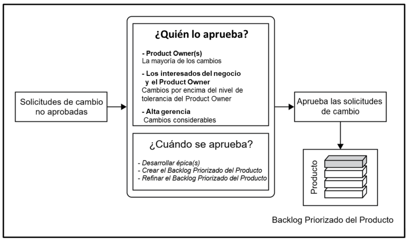

**Figura 6-1: Ejemplo del proceso de aprobación de cambios** 

**126** ©2025 SCRUMstudy™. _Una guía para el cuerpo de conocimiento de Scrum (Guía SBOK®)_ 

6 – CAMBIO 

**6** 

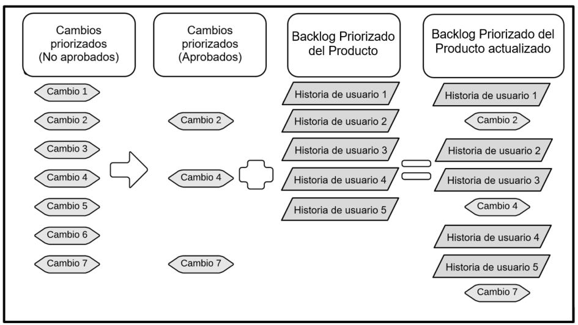

**Figura 6-2: Actualización del backlog priorizado del producto con los cambios aprobados** 

©2025 SCRUMstudy™. _Una guía para el cuerpo de conocimiento de Scrum (Guía SBOK®)_ **127** 

6 – CAMBIO 

### **6.3 Cómo entender el cambio en Scrum** 

#### **6.3.1 El equilibrio entre la flexibilidad y la estabilidad** 

Scrum ayuda a las organizaciones a ser más flexibles y receptivas al cambio. Sin embargo, es importante entender que, aunque el marco de trabajo de Scrum hace énfasis en la flexibilidad, también es importante mantener la estabilidad durante todo el proceso de cambio. De la misma manera que la rigidez extrema es ineficaz, la flexibilidad extrema también es improductiva. La clave es encontrar el equilibrio adecuado entre la flexibilidad y la estabilidad, ya que la estabilidad se necesita a fin de realizar el trabajo. Por lo tanto, Scrum utiliza el desarrollo iterativo y sus demás características y principios para lograr dicho equilibrio. Scrum mantiene la flexibilidad de que las solicitudes de cambio se pueden crear y aprobar en cualquier momento durante el proyecto; sin embargo, estas se priorizan cuando se crea o se actualiza el backlog priorizado del producto. Al mismo tiempo, Scrum asegura que la estabilidad permanezca al refinar el <mark>backlog del sprint</mark> y al no permitir la interferencia con el Equipo Scrum durante un sprint. 

En Scrum, todos los requisitos relacionados con el sprint en curso se suspenden durante el sprint. Ningún cambio se introduce hasta que se termina el sprint, a menos que un cambio se considere lo suficientemente importante como para detener el sprint. En el caso de un cambio urgente, el sprint se termina y el equipo se reúne para planificar uno nuevo. Es así como Scrum acepta los cambios sin crear problemas de cambio en las fechas de <mark>liberación</mark> o inestabilidad. 

#### **6.3.2 Cómo incorporar la flexibilidad** 

Debido a su naturaleza iterativa y a los conceptos de control del proceso empírico como la transparencia, la inspección y la adaptación, en la implementación de Scrum se debe de incorporar la flexibilidad. Scrum proporciona un mecanismo de adaptación para la gestión de proyectos en el que un cambio en los requisitos se puede acomodar sin afectar significativamente el progreso general del proyecto. Por ello resulta posible (y necesario) adaptarse a las realidades emergentes de negocio como parte del ciclo de desarrollo. 

La flexibilidad en Scrum se logra a través de cinco características claves: el desarrollo de productos iterativos, la asignación de un time-box, los equipos multidisciplinarios, la priorización basada en el cliente y la integración continua (véase la figura 6-3). 

**128** ©2025 SCRUMstudy™. _Una guía para el cuerpo de conocimiento de Scrum (Guía SBOK®)_ 

6 – CAMBIO 

**6** 

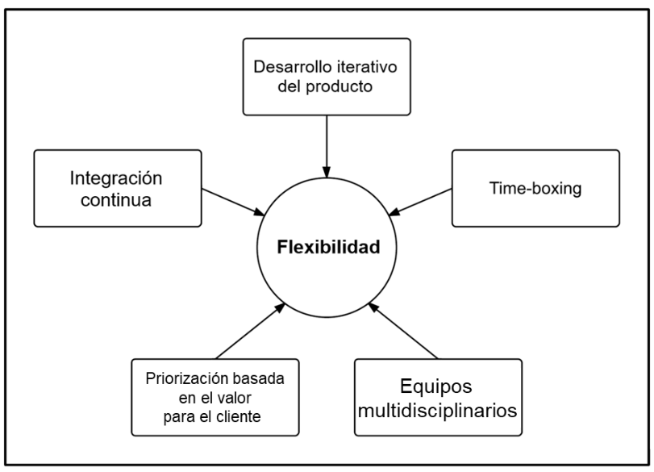

**Figura 6-3: Características de Scrum para lograr flexibilidad** 

##### **6.3.2.1 La flexibilidad mediante el desarrollo iterativo del producto** 

En Scrum se implementa un enfoque iterativo e incremental para el desarrollo de productos y servicios, por lo que es posible incorporar cambios en cualquier paso durante el proceso de desarrollo. A medida que se desarrolla el producto, la solicitud de cambio en el proyecto puede provenir de múltiples fuentes de la siguiente manera: 

**1. Interesados del negocio** 

Los interesados del negocio, particularmente los patrocinadores, los clientes y los usuarios, pueden presentar solicitudes de cambio en cualquier momento durante todo el proyecto. Las solicitudes podrían deberse a cambios en las condiciones del mercado, a la dirección de la organización, a asuntos legales o reglamentarios, o a varias otras razones. Por otra parte, los interesados del negocio pueden presentar dichas solicitudes a medida que van revisando los entregables durante los procesos de _Demostrar y validar el sprint_ , _Retrospectiva del sprint_ o _Retrospectiva de la liberación_ . Después de ser aprobadas, todas las solicitudes de cambio se añaden backlog priorizado del product <mark>o del proyecto</mark> (también denominado backlog priorizado del producto). 

La figura 6-4 muestra algunas de las razones por las que los interesados del negocio inician el proceso de solicitud de cambio. 

©2025 SCRUMstudy™. _Una guía para el cuerpo de conocimiento de Scrum (Guía SBOK®)_ **129** 

6 – CAMBIO 

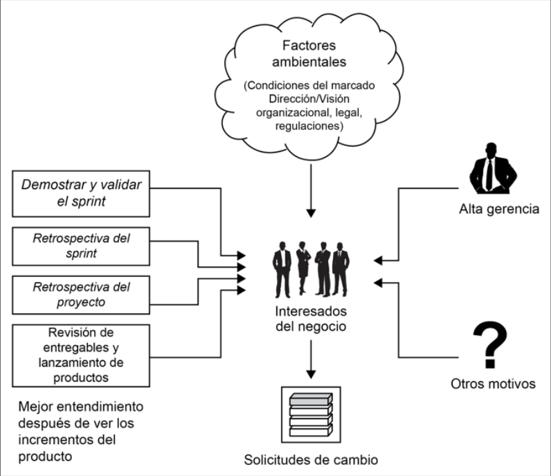

**Figura 6-4: Motivos de los interesados del negocio para la solicitud de cambios** 

##### **2. El equipo principal de Scrum** 

El equipo principal de Scrum (Product Owner, Scrum Master y Equipo Scrum) participa en la creación de los entregables del producto. La interacción continua entre los miembros principales de un Equipo Scrum y otros (como otros equipos Scrum del proyecto, y los interesados del negocio internos y externos del proyecto) puede motivarlos a sugerir cambios o mejoras en el producto, servicio, o cualquier otro aspecto del proyecto. Normalmente, estos cambios, al igual que otros, se incluyen en las solicitudes de cambio y el Product Owner toma una decisión final acerca de qué sugerencias de cambio por parte del Equipo Scrum o Scrum Master se deben considerar como solicitudes de cambio formales. 

En ocasiones puede haber retos con la creación de ciertos entregables, lo que puede resultar en solicitudes de cambio. Por ejemplo, el equipo puede añadir o modificar una funcionalidad para mejorar el rendimiento del producto. En la mayoría de los proyectos de Scrum, las recomendaciones de cambios por parte del equipo principal de Scrum suceden durante el proceso de _Crear entregables_ , o cuando participa en los Daily Standups o las reuniones de retrospectiva del sprint. 

La figura 6-5 muestra algunas de las razones por las que el equipo principal de Scrum puede iniciar solicitudes de cambio. 

**130** ©2025 SCRUMstudy™. _Una guía para el cuerpo de conocimiento de Scrum (Guía SBOK®)_ 

6 – CAMBIO 

**6** 

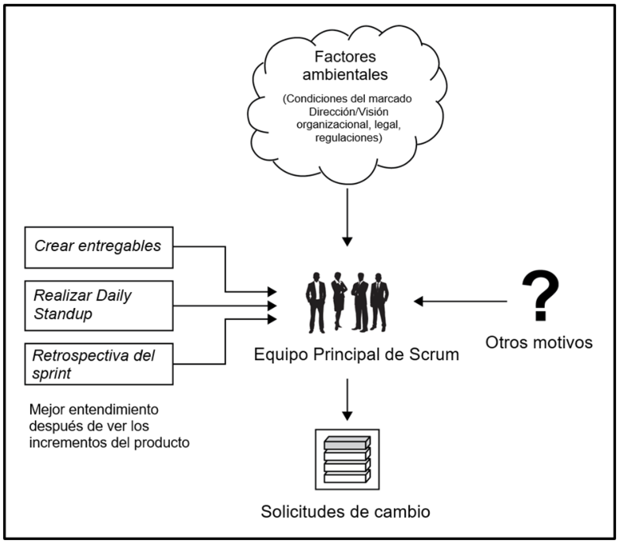

**Figura 6-5: Motivos del equipo principal de Scrum para la solicitud de cambios** 

**3. La alta gerencia** 

La alta gerencia, incluyendo a los directores del portafolio y del programa, puede recomendar cambios que afecten el proyecto. Esto puede deberse a cambios estratégicos en la dirección de la empresa, a un entorno competitivo, a problemas financieros, etc. Es importante tener en cuenta que estos cambios se añaden al backlog priorizado del producto y tienen que pasar por el proceso normal de gestión del cambio. Si algunos de estos cambios son urgentes, es posible que cualquier sprint afectado necesite terminarse (véase la sección 6.6 para conocer más detalles). 

###### **4. Scrum Guidance Body** 

El Scrum Guidance Body puede presentar solicitudes de cambio que afecten a todos los proyectos debido a alguno de los siguientes ejemplos: 

- Cambios en las regulaciones gubernamentales (por ejemplo, la privacidad, las normas de seguridad o nuevas leyes) 

- Directivas corporativas de calidad, seguridad u otras iniciativas de la organización que deban ponerse en práctica en toda la compañía 

- Puntos de referencia ( _benchmarking_ ) o mejores prácticas para alcanzar cierto nivel 

©2025 SCRUMstudy™. _Una guía para el cuerpo de conocimiento de Scrum (Guía SBOK®)_ **131** 

6 – CAMBIO 

- Lecciones aprendidas de proyectos anteriores que se puedan implementar por otros equipos Scrum 

El sello distintivo de Scrum es su tolerancia y adaptación al cambio. Scrum no promueve la configuración firme de planes anticipados, ya que opera bajo la premisa de que el desarrollo del proyecto es muy propenso al cambio y al riesgo. El resultado es un alto grado de flexibilidad y tolerancia al cambio. El proyecto se lleva a cabo y se gestiona de forma incremental, por lo que generalmente es fácil incorporar cambios a lo largo del proyecto. 

##### **6.3.2.2 La flexibilidad mediante el Time-boxing** 

El Time-boxing es la asignación de periodos cortos para realizar el trabajo. Si el trabajo realizado queda incompleto al final del time-box, este se asigna a un nuevo bloque de tiempo. Algunos ejemplos de Time-boxing incluyen limitar el Daily Standup a 15 minutos y establecer la duración del sprint de una a cuatro semanas. Los sprints con un time-box contribuyen en gran medida al cumplimiento de los plazos, así como al logro de altos niveles de productividad. Los errores o problemas pueden identificarse en una etapa temprana y rectificarse rápidamente, lo cual facilita la flexibilidad en los proyectos de Scrum. Los sprints promueven el orden y la consistencia en un ambiente de trabajo volátil y proporcionan una plataforma para medir resultados, así como para obtener información en un corto espacio de tiempo. Los sprints también permiten una evaluación frecuente de los progresos y los métodos que se utilizan para gestionar el proyecto, incluyendo la gestión del cambio eficaz. Los errores o problemas pueden ser identificados anticipadamente y se pueden corregir con rapidez. 

Mediante el Time-boxing en los sprints, el equipo repasa con frecuencia el proceso de estimación del trabajo que se va a realizar, por lo que la proyección de tiempo y esfuerzo que se requieren es más precisa con cada sprint subsecuente a medida que el proyecto avanza. Estos ciclos iterativos también motivan a los miembros del equipo a lograr los objetivos previstos y las metas incrementales, a fin de alcanzar el objetivo mayor. 

##### **6.3.2.3 La flexibilidad a través de equipos multidisciplinarios y autoorganizados** 

La autoorganización asegura que los miembros del Equipo Scrum cuenten con la flexibilidad para definir todas las tareas que desarrollarán en un sprint; mantiene a los equipos automotivados para completar las tareas autoasignadas; elimina cuellos de botella y fomenta el intercambio de conocimiento con otros integrantes del equipo. Las estructuras multidisciplinarias y autoorganizadas del Equipo Scrum les permiten a los miembros del equipo enfocarse en los resultados deseados del sprint. El equipo tiene un conjunto definido de objetivos durante cada sprint, así como la flexibilidad para dar cuenta de un cambio en los objetivos antes de comenzar el siguiente sprint. 

El uso de equipos multidisciplinarios garantiza también de que el equipo cuente con todas las habilidades y conocimientos necesarios para llevar a cabo el trabajo del proyecto. Esto proporciona un modelo de trabajo eficiente que da lugar a la creación de entregables listos para mostrarlos al Product Owner u otros interesados del negocio. 

La autoorganización garantiza que los miembros del Equipo Scrum decidan por sí mismos la forma de hacer el trabajo del proyecto sin la micro gestión de las tareas por un alto directivo. 

**132** ©2025 SCRUMstudy™. _Una guía para el cuerpo de conocimiento de Scrum (Guía SBOK®)_ 

6 – CAMBIO 

**6** 

Tener equipos multidisciplinarios y autoorganizados permite al grupo adaptarse y administrar los trabajos en curso y algunos problemas menores o cambios sin tener que obtener el apoyo o la experiencia de personas ajenas al equipo, y en el proceso, crear entregables listos para enviarse en caso de ser necesario. 

##### **6.3.2.4 La flexibilidad a través de la priorización basada en el valor para el cliente** 

La priorización de las necesidades y del trabajo en un proyecto Scrum siempre se determina con base al valor proporcionado al cliente. Primero, al inicio de un proyecto, los requisitos iniciales se priorizan en función del valor que cada proveerá requisito; esto se documenta en el backlog priorizado del producto. Cuando se presenta una solicitud de un requisito nuevo o un cambio a uno ya existente, esto se evalúa durante el proceso de _Refinar el backlog priorizado del producto_ . Si se considera que el cambio proporcionará más valor que otros requisitos existentes, se añadirá y priorizará de acuerdo con la versión actualizada del backlog priorizado del producto. Así, dicho backlog ofrece la posibilidad de incorporar cambios y agregar nuevos requisitos cuando sea necesario. 

Es importante tener en cuenta que los nuevos requisitos y cambios añadidos al backlog priorizado del producto puede disminuir la prioridad de otras historias de usuarios existentes en el backlog; por tanto, estas historias de usuario de menos prioridad se pueden implementar más adelante dependiendo de su nueva priorización. Debido a que los clientes están íntimamente involucrados en la priorización de las necesidades y de sus historias de usuario correspondientes en el backlog priorizado del producto, esta práctica asegura que los requisitos que los clientes consideran de “alto valor” se completen lo antes posible, y que el proyecto inicie la entrega de valor con mayor anticipación. 

##### **6.3.2.5 La flexibilidad a través de la integración continua** 

Utilizando técnicas de integración continua, los miembros del Equipo Scrum pueden incorporar características nuevas y modificadas en las entregas siempre que sea posible. Esto reduce el riesgo de que varios miembros del equipo hagan cambios en componentes redundantes (por ejemplo, código obsoleto en los productos de software, o diseños antiguos para la fabricación de piezas). Esto asegura que se esté trabajando solamente en la última función de la versión y en evitar problemas de compatibilidad. 

©2025 SCRUMstudy™. _Una guía para el cuerpo de conocimiento de Scrum (Guía SBOK®)_ **133** 

6 – CAMBIO 

### **6.4 Integración del cambio** 

Dependiendo de la industria y del tipo de proyecto, la prioridad de las características y los requisitos en un proyecto pueden permanecer fijos durante periodos considerables de tiempo, o bien, pueden cambiar con frecuencia. Si los requisitos del proyecto son en general estables, normalmente hay pequeños cambios realizados en el backlog priorizado del producto en todo el desarrollo, y los equipos Scrum pueden trabajar secuencialmente en completar los requisitos que le proporcionan el valor máximo al cliente como se priorizó en el backlog priorizado del producto. En entornos estables, la duración del sprint generalmente es más larga: de 4 a 6 semanas. 

Si los requisitos del proyecto cambian durante su desarrollo (por ejemplo, debido a modificaciones de los requerimientos de negocio), el mismo método sigue siendo eficaz. Antes de comenzar un sprint, durante los procesos de _Crear el backlog priorizado del producto_ o _Refinar el backlog priorizado del producto_ , los requisitos de mayor prioridad en el backlog priorizado del producto se seleccionan normalmente para completarse en ese sprint. Dado a que los cambios se han tenido en cuenta en el backlog priorizado del producto, el equipo solo tiene que determinar el número de tareas que se pueden realizar en el sprint, basado en el tiempo y los recursos proporcionados. La gestión del cambio se lleva a cabo en los procesos de priorización actuales, y se le agregan tareas al backlog priorizado del producto. 

#### **6.4.1 Cambios a un sprint** 

Si hay una solicitud de cambio que puede tener un impacto considerable sobre un sprint en curso, el Product Owner, después de consultar con interesados del negocio relevantes, decide si el cambio puede esperar hasta el próximo sprint o si representa una situación urgente que pueda requerir finalizar el sprint actual y comenzar uno nuevo. 

El marco de trabajo de Scrum especifica claramente que el alcance de un sprint no puede cambiar una vez iniciado. Si el cambio requerido es de tal importancia que los resultados del sprint no tendrían ningún valor sin él, entonces el sprint debe terminarse. De lo contrario, el cambio se incorpora en un sprint posterior (como se muestra en la figura 6-6). 

**134** ©2025 SCRUMstudy™. _Una guía para el cuerpo de conocimiento de Scrum (Guía SBOK®)_ 

6 – CAMBIO 

**6** 

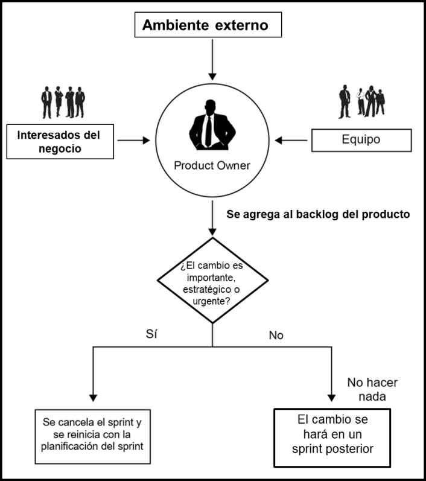

**Figura 6-6: Integración del cambio en Scrum** 

Solo hay una excepción a la regla de no modificar el alcance de un sprint una vez que ha comenzado. Si el Equipo Scrum considera que se ha sobrestimado en gran manera el esfuerzo durante el sprint, y cuenta con capacidad de reserva para implementar historias de usuario adicionales, el equipo puede preguntarle al Product Owner cuáles historias de usuario deben incorporarse al sprint actual. 

Al dejar fijo el alcance de cada sprint, el equipo podrá optimizar y administrar con eficiencia su trabajo y esfuerzo. Un beneficio adicional es que el equipo no tiene que preocuparse por la gestión de los cambios una vez que empieza a trabajar en un sprint. Esta es una gran ventaja del marco de trabajo de Scrum en comparación a la gestión tradicional de proyectos. 

En la gestión tradicional de proyectos, los cambios pueden solicitarse y aprobarse en cualquier momento durante el ciclo de vida del proyecto. Esto a menudo causa confusión entre los miembros del equipo del proyecto, disminuye la motivación del equipo debido a la discontinuidad, da lugar a una falta de concentración y el equipo tiene la sensación de que “nunca se termina nada”. En cambio, en los proyectos de Scrum, no se permiten los cambios una vez que se inicia un sprint. 

©2025 SCRUMstudy™. _Una guía para el cuerpo de conocimiento de Scrum (Guía SBOK®)_ **135** 

6 – CAMBIO 

Esto garantiza que en cada sprint el equipo complete entregables y se hagan las tareas. Por otra parte, el negocio reconoce los beneficios tangibles de los entregables que están potencialmente listos para la entrega al final de cada sprint. Además, debido a que el Product Owner y los interesados del negocio están conscientes de que no se permiten los cambios una vez que inicia el sprint, y de que un sprint dura entre una y cuatro semanas; definen y priorizan las necesidades durante los procesos adecuados de _Desarrollar épicas_ , _Crear el backlog priorizado del producto_ y el _Refinar el backlog priorizado del producto_ . 

##### **6.4.1.1 El impacto del cambio esperado en la duración del sprint** 

Dado que los cambios no están permitidos durante un sprint, el impacto y la frecuencia de los cambios previstos pueden tener un impacto en la decisión relacionada a la duración del sprint cuando esta se determina durante el proceso de _Realizar la planificación de la liberación_ . 

La figura 6-7 muestra el impacto de la probabilidad del cambio en la duración del sprint. 

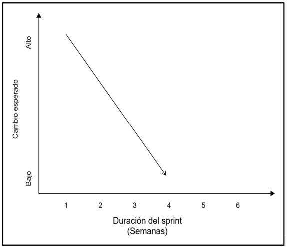

**Figura 6-7: Impacto del cambio esperado en la duración del sprint** 

Un sprint puede tener un Time-box de una a cuatro semanas. La mayoría de los proyectos de Scrum generalmente usan sprints con Time-box de dos a tres semanas. Si los requisitos del proyecto no están muy bien definidos, o si se esperan cambios considerables en un futuro inmediato, la duración del sprint generalmente es de una a tres semanas. Esto les brinda estabilidad a los miembros del Equipo Scrum para trabajar en sprints más cortos y entregar resultados, los que se pueden evaluar por el Product Owner y los interesados del negocio al final del sprint. Esto también proporciona la flexibilidad suficiente para que puedan aclarar los requisitos y realizar cambios en el backlog priorizado del producto al final de cada sprint. Sin embargo, si los requisitos del proyecto son generalmente estables y no se esperan grandes cambios en un futuro próximo, la duración de un sprint se puede ajustar para que sea más larga, de cuatro a seis semanas. 

**136** ©2025 SCRUMstudy™. _Una guía para el cuerpo de conocimiento de Scrum (Guía SBOK®)_ 

6 – CAMBIO 

**6** 

Esto les proporciona estabilidad a los miembros del Equipo Scrum para trabajar en los requisitos del backlog priorizado del producto durante largos periodos sin tener que pasar por los procesos de _Crear historias de usuario_ , _Estimar historias de usuario_ y _Comprometer historias de usuario_ , _Identificar tareas_ , _Estimar tareas_ y otros procesos relacionados que se llevan a cabo para cada sprint. Es importante tener en cuenta que el cambio esperado no es el único factor que se utiliza para determinar la duración del sprint. Otros factores que también deben tomarse en cuenta son: 

- El tiempo real para realizar su trabajo (si el proyecto o entorno corporativo necesita un tiempo específico para realizar las tareas, eso podría determinar la duración del sprint). 

- La fecha prevista para su <mark>liberación</mark> (la duración del sprint debe tener en cuenta las fechas de <mark>liberación</mark> para el producto o el servicio en general). 

- Cualquier otro factor que determine el Product Owner o el Scrum Master que deben tenerse en cuenta al determinar la duración del sprint. 

El cambio en la duración del sprint no debe decidirse a la ligera o de manera periódica. Por ejemplo, no es recomendable tener un sprint de tres semanas, luego uno de dos semanas y el siguiente de cuatro semanas, etc. De preferencia, la duración del sprint debe ser consistente. Uno de los mayores impactos del cambio de la duración del sprint es que causa un restablecimiento en todo el seguimiento a nivel de proyecto. Las velocidades anteriores pueden llegar a ser inútiles para la previsión y la planificación de los futuros sprints. Sin una velocidad precisa (que es una medida primaria en cualquier proyecto Scrum), el Equipo Scrum no puede medir la eficacia o elegir adecuadamente el número de historias para asumir la planificación del próximo sprint. Por lo tanto, una vez que la duración del sprint se decide, de preferencia debe permanecer constante durante toda la duración del proyecto o a través de múltiples ciclos de sprint. 

##### **6.4.1.2 La gestión de cambios al refinar el backlog priorizado del producto** 

Un típico backlog priorizado del producto incluye todas las historias de usuarios, sus estimaciones de tiempo (incluyendo las estimaciones revisadas) y el estatus de los requerimientos de mayor prioridad. También se incorporan historias de usuario nuevas o revisadas que resultaron de cambios en los requerimientos de negocio, pedidos de los clientes, condiciones externas del mercado o lecciones aprendidas en sprints anteriores. 

Una de las responsabilidades principales del Product Owner es refinar el backlog priorizado del producto para garantizar que los requisitos priorizados en dicho backlog se incluyan en los próximos dos o tres sprints y se refinen en acuerdo con las historias de usuario. Se recomienda que el Product Owner dedique una cantidad considerable de tiempo en cada sprint para refinar el backlog. El Product Owner es responsable de añadir y modificar elementos a dicho backlog en respuesta a los cambios, así como de proporcionar historias de usuario más detalladas que se utilizarán en el próximo sprint. 

Este refinamiento ayuda a asegurar que la refinación de los requisitos y sus historias de usuario se hagan mucho antes de la reunión de planificación del sprint, a fin de que el equipo tenga un conjunto de historias muy bien analizadas y claramente definidas que puedan dividirse fácilmente en tareas y, posteriormente estimadas. Con base en las lecciones aprendidas del sprint actual, puede haber cambios en los requisitos, o bien una priorización nueva que pueda incorporarse fácilmente en sprints posteriores. Este refinamiento apoya y mejora la flexibilidad del modelo Scrum mediante la incorporación de los últimos avances técnicos y de negocio en futuros sprints. 

©2025 SCRUMstudy™. _Una guía para el cuerpo de conocimiento de Scrum (Guía SBOK®)_ **137** 

6 – CAMBIO 

La reunión de revisión del backlog priorizado del producto (conocida también como sesión de refinamiento del backlog priorizado del producto) es una reunión formal durante el proceso de refinar de dicho backlog, que ayuda al Equipo Scrum a repasar y lograr el consenso sobre el refinamiento del backlog priorizado del producto. Sin embargo, además de la reunión de revisión del backlog priorizado del producto, su refinamiento debe darse durante todo el proyecto y puede incluir situaciones en las que el Product Owner escriba nuevas historias de usuarios o vuelva a priorizar las historias de usuario en el backlog priorizado del producto vigente, y los miembros del Equipo Scrum o interesados del negocio ofrezcan sugerencias sobre las nuevas historias al Product Owner, y así sucesivamente. Es importante tener en cuenta que cualquier elemento del backlog priorizado del producto está siempre abierto para la reestimación hasta que el <mark>backlog del sprint</mark> sea finalizado en el proceso de _Actualizar el_ _<mark>backlog del sprint</mark>_ <mark>.</mark> Después de ello, los cambios se podrán seguir haciendo inclusive hasta momentos antes de la reunión de planificación del sprint, si es necesario. 

##### **6.4.1.2.1 Reunión eficaz de revisión del backlog priorizado del producto (o sesión de refinamiento el backlog priorizado del producto)** 

El Product Owner es quien está encargado de que se lleve a cabo una reunión de revisión del backlog priorizado del producto durante el proceso de _Refinar el backlog priorizado del producto_ . Es importante que el Product Owner establezca los objetivos y que de preferencia desarrolle una agenda antes de iniciar la reunión. Sin esto, la sesión no tendría estructura y podría resultar improductiva. También es importante limitar el número de interesados del negocio que participan en la reunión. El tener demasiados participantes tiende a disminuir la eficiencia general de la reunión. El Product Owner debe invitar solo a los interesados del negocio cuyas votaciones se requieren para la sesión de la preparación. Se deben incluir todos los miembros del Equipo Scrum debido a que su opinión es valiosa para el trabajo que se realiza y los problemas que se encontraron. Si los resultados de la sesión de refinamiento resultan en nueva priorización o cambio en el backlog priorizado del producto, es importante que el equipo esté de acuerdo con esos cambios. Una sesión eficaz de refinamiento debe resultar en elementos claramente definidos en el backlog priorizado del producto para que el Equipo Scrum entienda los requisitos del cliente. Esto también ayuda a que el equipo se familiarice con todas las historias de usuario en caso de que una o más de ellas sean incluidas en un sprint a corto plazo. También pueden tratarse los criterios de aceptación y de terminado durante las sesiones de refinación. En Scrum los ejercicios de refinación no tienen a un límite de tiempo (Time-box). La refinación del backlog priorizado del producto es una actividad continua del Product Owner. 

##### **6.4.1.3 Gestión de cambios durante la demostración y validación del sprint** 

Aunque el Product Owner tiene la última palabra sobre los elementos del backlog priorizado del producto y decide si se aceptan o rechazan las historias de usuario (correspondientes a las solicitudes de cambio aprobadas) presentadas durante el proceso de _Demostrar y validar el sprint_ , es responsabilidad del Scrum Master garantizar que los requisitos y criterios de aceptación no se modifiquen durante la reunión de revisión del sprint de las historias de usuario completadas en el sprint actual. Esto evita que las futuras historias de usuario sean rechazadas por no cumplir con los requisitos recién cambiados. Si los requisitos se debieran cambiar, cualquier elemento del backlog priorizado del producto correspondiente debe revisarse para adaptarse a los requisitos modificados en un sprint futuro. 

**138** ©2025 SCRUMstudy™. _Una guía para el cuerpo de conocimiento de Scrum (Guía SBOK®)_ 

6 – CAMBIO 

**6** 

### **6.5 Cambio en portafolios y programas** 

Cualquier cambio que surja, ya sea en los programas o portafolios, puede tener un efecto en cascada en todos los proyectos dependientes y sprints. Por lo tanto, se recomienda minimizar los cambios en estos niveles más altos. Si se requiere un cambio, y todos los interesados del negocio están de acuerdo en hacerlo a estos niveles, se debe tomar en cuenta lo siguiente: 

#### **6.5.1 En programas** 

1. No se recomienda hacer cambios entre dos reuniones del backlog del programa. 

2. Si el cambio es menor, el Program Product Owner debe contar con la aprobación de los interesados del negocio correspondientes (por ejemplo, el patrocinador, el cliente y el usuario meta) y después añadir los requisitos al backlog del programa. Los Product Owners y del programa y del proyecto analizarán los requisitos para su inclusión en futuros sprints. 

3. Si el cambio es importante, las actividades del programa, así como los proyectos y sprints relacionados deben detenerse y se debe llevar a cabo una reunión del backlog del programa para determinar cuáles serán los siguientes pasos. 

4. Las reuniones del backlog priorizado del producto del programa (también conocidas como reuniones del backlog del programa), deben llevarse a cabo, de preferencia, en intervalos de dos a seis meses. La frecuencia y el impacto de los cambios en un programa determinan en gran medida la duración de tiempo entre dos reuniones del backlog del programa. Si hay varios cambios previstos en el programa, es preferible llevar a cabo este tipo de reuniones en intervalos más regulares (por ejemplo, de dos a tres meses); pero si hay menos cambios esperados y si los requisitos son estables, la duración entre dos reuniones podría aumentarse (por ejemplo, de cinco a seis meses). 

#### **6.5.2 En portafolios** 

1. No se recomienda hacer cambios entre dos reuniones del backlog del portafolio. 

2. Si el cambio es menor, el Portfolio Product Owner debe contar con la aprobación de los interesados del negocio correspondientes (por ejemplo, el patrocinador, el cliente y el usuario final) y después añadir los requisitos al backlog del portafolio. Los Product Owners del nivel del programa y del proyecto analizarán los requisitos para ser incluidos en futuros sprints. 

3. Si el cambio es importante, los esfuerzos del portafolio, junto con los programas, proyectos y sprints asociados tienen que detenerse y se debe llevar a cabo una reunión a nivel del portafolio de proyectos para definir cuáles serán los siguientes pasos. 

4. Las reuniones del backlog priorizado del producto del portafolio (también conocidas como reuniones del backlog del portafolio), deben llevarse a cabo en intervalos de cuatro a doce meses. La frecuencia y el impacto de los cambios en un portafolio determinan en gran medida la duración de tiempo entre dos reuniones del backlog del portafolio. Si son varios los cambios esperados en el portafolio, es preferible llevar a cabo este tipo de reuniones en intervalos más frecuentes (por ejemplo, de cuatro a seis meses); pero si hay menos cambios esperados, y si los requisitos son estables, la duración entre dos reuniones podría aumentarse (por ejemplo, de nueve a doce meses). 

©2025 SCRUMstudy™. _Una guía para el cuerpo de conocimiento de Scrum (Guía SBOK®)_ **139** 

6 – CAMBIO 

La figura 6-8 muestra cómo se pueden gestionar los cambios dentro del flujo de Scrum tanto para los portafolios como para los programas. 

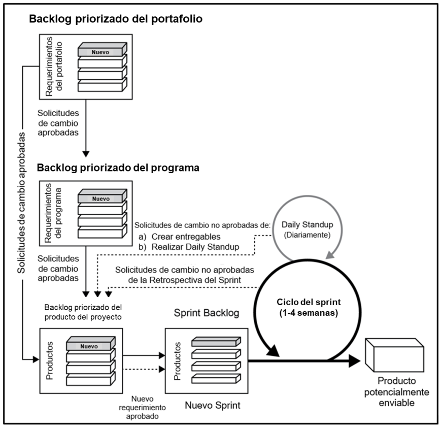

**Figura 6-8: Incorporación de cambios en portafolios y programas** 

**140** ©2025 SCRUMstudy™. _Una guía para el cuerpo de conocimiento de Scrum (Guía SBOK®)_ 

6 – CAMBIO 

**6** 

### **6.6 Resumen de responsabilidades** 

|**Rol**|**Responsabilidades**|
|---|---|
|Equipo Scrum|• Sugiere mejoras o cambios durante los procesos de_Crear entregables_y _Realizar el Daily Standup_.|
|Product Owner/ Chief Product Owner|• Proporciona solicitudes de cambio de un proyecto • Evalúa el impacto de las solicitudes de cambio planteadas por el portafolio, el programa o el proyecto • Prioriza las historias de usuario en el backlog priorizado del producto del proyecto • Evalúa el impacto de los problemas sobre los objetivos del proyecto identificados por el Equipo Scrum • Proporciona una comunicación clara a losinteresados del negocio sobre los elementos del backlog del productoque se han vuelto a priorizar|
|Scrum Master/ Chief Scrum Master|• Facilita la identificación y evaluación de los problemas y solicitudes de cambio por el Equipo Scrum|
|Program Product Owner|• Proporciona solicitudes de cambio en los programas • Aprueba los productos que son modificados, eliminados o agregados de acuerdo con los requisitos del programa|
|Program Scrum Master|• Facilita la identificación, evaluación y gestión de las solicitudes de cambioen los programas|
|Portfolio Product Owner|• Proporciona solicitudes de cambio para los portafolios • Aprueba los productos que son modificados, eliminados o agregados de acuerdo con los requisitos del portafolio|
|PortfolioScrum Master|• Facilita la identificación, evaluación y gestión de las solicitudes de cambioen los portafolios|
|Interesados del negocio|• Proporcionan solicitudes de cambios • Participan en la aprobación y priorización de las solicitudes de cambio|
|Scrum Guidance Body|• Proporciona una guía general para los procedimientos de gestión de cambios que deben seguirse durante todo el proyecto|

**Tabla 6-1: Resumen de responsabilidades pertinentes al cambio** 

©2025 SCRUMstudy™. _Una guía para el cuerpo de conocimiento de Scrum (Guía SBOK®)_ **141** 

6 – CAMBIO 

### **6.7 Scrum vs. Gestión tradicional de proyectos** 

La gestión de cambios en los proyectos que se gestionan en forma tradicional está estrechamente relacionada con la gestión de la configuración. Todos los cambios se consideran con base en su magnitud de variación desde un valor base. El director del proyecto opera dentro de ciertos límites para gestionar las actividades diarias y tomar decisiones en el proyecto. Cuando una solicitud de cambio supera las tolerancias definidas, el director del proyecto debe llevar la propuesta de cambio a niveles superiores de gestión y esperar la decisión antes de hacerla efectiva. El director del proyecto registra primero la solicitud de cambio en una lista de problemas o cambios y después presenta el cambio a las autoridades superiores. Estas pueden ser el patrocinador del proyecto, así como a otros interesados del negocio relevantes y a aquellos que toman decisiones sobre el caso. En algún momento se debe llevar a cabo una evaluación del impacto. Con base al impacto estimado del cambio, se debe decidir si el cambio debe aplicarse o no. El director del proyecto también podrá proponer posibles soluciones a los problemas planteados por el cambio. Si las autoridades superiores deciden proceder con el cambio, el director del proyecto es responsable de asegurar que el cambio se implemente correctamente. 

El cambio en Scrum funciona de manera muy diferente en comparación a la gestión tradicional de proyectos. El marco de trabajo de Scrum se enfoca en la gestión de cambios de manera eficaz y eficiente. Cada vez que el Product Owner o el Equipo Scrum reconocen un problema o defecto, o cuando identifican un elemento del backlog priorizado del producto que deba modificarse, sustituirse o añadirse, el cambio se realiza en el backlog priorizado del producto. Del mismo modo, la alta gerencia, el Product Owner o los interesados del negocio pueden añadir solicitudes de cambio a dicho backlog. El Product Owner y los interesados del negocio aprueban las solicitudes de cambio y las nuevas prioridades del portafolio según corresponda. Siempre que hay un problema o una nueva exigencia que se deba atender, la cual resulta en cambios inmediatos que afectan el sprint actual, el Product Owner debe cancelar el sprint con la aprobación de los interesados del negocio relevantes. Una vez terminado, el sprint se vuelve a planificar y a reiniciar para incorporar los nuevos requisitos. 

Sin embargo, si el problema o cambio no es importante y no garantiza un cambio dentro del sprint actual, el cambio se añadirá al backlog priorizado del producto y se incorporará en la planificación para un futuro sprint. Esto les da a los interesados del negocio la capacidad para responder a los cambios en el ambiente externo, mientras se mantiene un cierto nivel de control sobre las actividades en curso dentro del proyecto. Además, al final de cada sprint el Equipo Scrum muestra los entregables clasificados como terminados. Estos entregables potencialmente enviables pueden revisarse por el Product Owner y otros interesados del negocio. 

**142** ©2025 SCRUMstudy™. _Una guía para el cuerpo de conocimiento de Scrum (Guía SBOK®)_ 

7 – RIESGO 

**7** 

## **7. RIESGO** 

### **7.1 Introducción** 

El propósito de este capítulo es definir los riesgos, analizar la gestión de riesgos en un entorno de Scrum y considerar las herramientas que facilitan la gestión de los riesgos. Para garantizar la viabilidad del negocio, reducir la probabilidad de fracaso de los proyectos y tomar decisiones de negocio más informadas, es importante que los riesgos se gestionen con eficacia mediante un enfoque metódico y bien organizado. 

En un entorno de Scrum, los riesgos generalmente se minimizan, en gran parte debido al trabajo que se realiza en los sprints, donde se produce una serie continua de entregables en ciclos muy cortos. Los entregables se comparan con las expectativas y el Product Owner participa activamente en el proyecto _._ Sin embargo, hasta en el más simple de los proyectos _,_ las cosas pueden salir mal, por lo que es importante contar con una estrategia para identificar y atender los riesgos. 

<mark>El riesgo, tal como se define en la</mark> _<mark>Guía de los fundamentos de Scrum (Guía del SBOK</mark>__®_ _<mark>),</mark>_ <mark>es aplicable a los siguientes:</mark> 

- <mark>Portafolios, programas o proyectos en cualquier industria;</mark> 

- <mark>Productos, servicios o cualquier otro resultado que se entregará a los</mark> interesados del negocio; 

- <mark>Proyectos de cualquier tamaño o complejidad.</mark> 

<mark>El término “producto” en la</mark> _<mark>Guía del SBOK</mark>__®_ <mark>puede referirse a un producto, servicio, o cualquier otro entregable. Scrum se puede aplicar de manera efectiva a cualquier proyecto en cualquier industria: desde proyectos o equipos pequeños con tan solo seis miembros, hasta proyectos grandes y complejos con cientos de miembros.</mark> 

<mark>Este capítulo se divide en las siguientes secciones:</mark> 

**<mark>7.2 Guía de roles:</mark>** <mark>Esta sección ofrece información sobre las secciones relevantes para cada uno de los roles principales de Scrum: P</mark> roduct Owne <mark>r, Scrum Master y Equipo Scrum.</mark> 

**<mark>7.3 ¿Qué es un riesgo?:</mark>** <mark>Esta sección define el riesgo y explica cómo puede afectar los objetivos de un proyecto y contribuir a su éxito o fracaso.</mark> 

**<mark>7.4 Procedimiento de gestión de riesgos:</mark>** <mark>Esta sección presenta las principales técnicas de la gestión de riesgos y profundiza en el desarrollo de estrategias para identificar, evaluar y gestionar riesgos.</mark> 

**<mark>7.5 Minimizar el riesgo mediante el uso de Scrum:</mark>** <mark>Esta sección explica los aspectos claves de Scrum que lo convierten en un m</mark> arco de trabaj <mark>o de gestión ideal para manejar con eficacia los riesgos en varios niveles: portafolio, programa y proyecto.</mark> 

**<mark>7.6 Resumen de responsabilidades:</mark>** <mark>Esta sección describe las responsabilidades pertinentes a la calidad para cada persona o rol en un proyecto.</mark> 

- **<mark>7.7 Scrum vs. Gestión tradicional de proyectos:</mark>** <mark>Esta sección destaca los beneficios de la gestión de riesgos en el marco de trabajo de Scrum en comparación a modelos tradicionales de gestión de proyectos.</mark> 

©2025 SCRUMstudy™. _Una guía para el cuerpo de conocimiento de Scrum (Guía SBOK®)_ **143** 

7 – RIESGO 

#### **7.1.1 Guía de roles** 

1. Product Owner: La principal responsabilidad en la gestión de riesgos en un proyecto recae sobre el Product Owner, por ello, todo este capítulo aplica principalmente a este rol. 

2. Scrum Master: El Scrum Master debe estar familiarizado con todo este capítulo, con un enfoque principal en las secciones 7.3, 7.4 y 7.7. 

3. Equipo Scrum: El Equipo Scrum debe enfocarse principalmente en las secciones 7.3 y 7.7. 

**144** ©2025 SCRUMstudy™. _Una guía para el cuerpo de conocimiento de Scrum (Guía SBOK®)_ 

7 – RIESGO 

**7** 

### **7.2 ¿Qué es un riesgo?** 

El riesgo se define como un evento incierto o una serie de eventos que pueden afectar los objetivos de un proyecto y pudieran contribuir a su éxito o fracaso. Los riesgos con un potencial de impacto positivo en el proyecto se denominan “oportunidades”, mientras que las “amenazas” son riesgos que pudieran afectar negativamente a un proyecto. La gestión de riesgos debe hacerse proactivamente y es un proceso iterativo que debe empezar al inicio del proyecto y continuar durante toda vida. El proceso de gestión de riesgos debe seguir algunos pasos estandarizados para garantizar que los riesgos sean identificados, evaluados y se establezcan las medidas para actuar en consecuencia. 

Es necesario identificar, evaluar y responder a los riesgos basándose principalmente en dos factores: la probabilidad de ocurrencia y el impacto probable en caso de que ocurra. Los riesgos de alta probabilidad y con un alto índice de impacto deben ser abordados antes de aquellos con una calificación más baja. En general, una vez que se detecta un riesgo, es importante comprender los aspectos básicos del riesgo respecto a las posibles causas, el área de la incertidumbre y los efectos potenciales si se produce el riesgo. 

#### **7.2.1 Diferencia entre riesgos y problemas** 

Los riesgos son las incertidumbres relacionadas a un proyecto que podrían alterar considerablemente el resultado del proyecto de manera positiva o negativa. Debido a que los riesgos son incertidumbres a futuro, no tienen ningún impacto actual en el proyecto, pero podrían tener un impacto potencial a futuro. Algunos ejemplos de riesgos son: 

- Incluso después de una amplia capacitación, es posible que los representantes de servicio al cliente no estén listos para tomar pedidos el día oficial. 

- Es posible que una cuadrilla de pintores se retrase debido a las fuertes lluvias, lo cual pudiera influir negativamente en el cronograma del proyecto. 

Los problemas generalmente son certezas que se están suscitando en el proyecto, por lo que no es necesario hacer una evaluación de probabilidad como se hace con los riesgos. Los problemas deben atenderse. Algunos ejemplos de problemas son: 

- No se autoriza el financiamiento. 

- Los requisitos no se entienden. 

Si los riesgos no se atienden a tiempo pueden convertirse en problemas. El objetivo de la gestión de riesgos es estar preparados con planes para poder abordar cualquier riesgo que pudiera presentarse. 

#### **7.2.2 Actitud de riesgo** 

Entre los interesados del negocio se incluyen a todas aquellas personas u organizaciones afectadas por el proyecto, así como aquellas que cuentan con la capacidad para afectarlo. Es importante entender la actitud de riesgo de los interesados del negocio. Los siguientes tres factores influyen en la actitud de riesgo: 

1. **Apetito de riesgo:** Es la cantidad de incertidumbre que está dispuesta a asumir el interesado o la organización. 

©2025 SCRUMstudy™. _Una guía para el cuerpo de conocimiento de Scrum (Guía SBOK®)_ **145** 

7 – RIESGO 

2. **Tolerancia al riesgo:** Indica el grado, cantidad o volumen de riesgo que resistirán los interesados del negocio 

3. **Umbral de riesgo:** Es el nivel de riesgo aceptable para la organización interesada. Un riesgo caerá por encima o por debajo del umbral de riesgo. Si está por debajo, es más probable que el interesado o la organización lo acepte. 

Fundamentalmente, la actitud de riesgo de los interesados del negocio determina cuánto riesgo consideran aceptable. Es un factor determinante cuando deciden tomar acciones para mitigar los posibles impactos adversos de los riesgos. Por lo tanto, es importante entender los niveles de tolerancia de los interesados del negocio con relación a diversos factores como el costo, la calidad, el alcance y los plazos. 

La función de utilidad ( _Utility Function_ ) es un modelo utilizado para medir la preferencia del interesado por el riesgo o su actitud hacia el riesgo. Esto define el nivel de los interesados del negocio para aceptar riesgos. Las tres categorías de la función de utilidad son: 

1. **Aversión al riesgo:** El interesado no está dispuesto a aceptar un riesgo sin importar el beneficio o la oportunidad anticipada. 

2. **Neutral al riesgo:** El interesado no tiene aversión al riesgo, ni lo busca. Cualquier decisión que no se ve afectada por el nivel de incertidumbre de los resultados. Cuando dos posibles escenarios llevan el mismo nivel de beneficio, el interesado neutral al riesgo no se preocupará si uno de dichos casos es más riesgoso que el otro. 

3. **Búsqueda de riesgos:** El interesado está dispuesto a aceptar el riesgo, incluso si ofrece un aumento marginal de retorno o beneficio al proyecto. 

**146** ©2025 SCRUMstudy™. _Una guía para el cuerpo de conocimiento de Scrum (Guía SBOK®)_ 

7 – RIESGO 

**7** 

### **7.3 Procedimiento de gestión de riesgos** 

La gestión de riesgos se compone de los siguientes cinco pasos que deben llevarse a cabo en forma iterativa durante el proyecto: 

1. Identificación de riesgos: Utilizar diversas técnicas para identificar todos los riesgos potenciales. 

2. Evaluación de riesgos: Evaluar y estimar los riesgos identificados. 

3. Priorización de riesgos: Priorizar el riesgo que habrá de incluirse en el backlog priorizado del producto. 

4. Mitigación de riesgos: Desarrollar una estrategia adecuada para hacer frente a un riesgo. 

5. Comunicación de riesgos: Comunicar a los interesados del negocio apropiados los resultados de los primeros cuatros pasos de la gestión de riesgos y determinar su percepción respecto a eventos inciertos. 

#### **7.3.1 Identificación de riesgos** 

Los miembros del Equipo Scrum deben hacer un intento por identificar todos los riesgos que pudieran afectar el proyecto. Esto se puede lograr con tal solo observar el proyecto desde una perspectiva diferente, y con el uso de una variedad de técnicas. La identificación de riesgos se lleva a cabo a lo largo del proyecto y los riesgos identificados se convierten en entradas en varios procesos de Scrum, incluyendo: _Crear el backlog priorizado del producto_ , _Refinar el backlog priorizado del producto_ y _Demostrar y validar el sprint_ . 

Las siguientes técnicas se utilizan comúnmente para identificar riesgos: 

Técnicas de identificación de riesgos 

**1. Revisar las lecciones aprendidas de los procesos de retrospectiva del sprint o retrospectiva de la liberación** 

Aprender de proyectos similares y de sprints anteriores en el mismo proyecto, al igual que explorar las incertidumbres que afectan a dichos proyectos y sprints, puede ser una forma útil de identificar riesgos. 

**2. Listas de verificación de riesgos** 

Las listas de verificación de riesgos pueden incluir puntos clave a considerarse cuando se identifican los riesgos, riesgos comunes encontrados en un proyecto Scrum, o incluso categorías de riesgo que el equipo debe atender. Las listas de verificación son una valiosa herramienta que ayuda a garantizar una identificación integral del riesgo. 

**3. Lista corta de riesgos** 

Estas listas se utilizan para estimular el pensamiento respecto al origen que pudieran tener los riesgos. Las listas cortas de riesgos para distintas industrias y los tipos de proyectos están disponibles al público. 

**4. Tormenta de ideas** 

Son sesiones donde los interesados del negocio y los miembros del equipo principal de Scrum comparten abiertamente ideas por medio de diálogo y sesiones de intercambio de conocimientos, generalmente dirigidas por un facilitador. 

©2025 SCRUMstudy™. _Una guía para el cuerpo de conocimiento de Scrum (Guía SBOK®)_ **147** 

7 – RIESGO 

###### **5. Estructura de desglose de riesgos** 

Una de las herramientas clave que se utiliza para identificar riesgos es la estructura de desglose de riesgos ( _Risk Breakdown Structure_ ). En esta estructura se agrupan los riesgos con base en sus categorías o modalidades. Por ejemplo, los riesgos se pueden clasificar como financieros, técnicos o en materia de seguridad. 

###### **6. Entrevistas** 

Las entrevistas y las reuniones informales con los interesados del negocio, tales como la alta gerencia, los integrantes del Equipo Scrum, expertos técnicos, clientes y usuarios finales, pueden ayudar a identificar los riesgos del proyecto. 

#### **7.3.2 Evaluación de riesgos** 

La evaluación de riesgos ayuda a entender el impacto potencial de un riesgo; a ver qué posibilidades hay de que suceda y cuándo pudiera materializarse. Se debe estimar el efecto generalizado en el valor del negocio. Si dicho impacto es lo suficientemente considerable como para superar la justificación del negocio, se debe decidir si se le da continuidad al proyecto. 

La evaluación de riesgos se lleva a cabo con relación a la probabilidad, proximidad e impacto. La probabilidad de riesgo es la probabilidad de su ocurrencia, mientras que la proximidad se refiere a cuándo pudiera suscitarse un riesgo. El impacto es el efecto probable del riesgo en un proyecto u organización. 

Además de la probabilidad, en la evaluación de riesgos se evalúa también el efecto potencial neto de los riesgos sobre el proyecto o la organización. Dichos efectos se pueden estimar utilizando técnicas tales como modelos de riesgo y valor monetario esperado. 

Técnicas de evaluación de riesgos: 

###### **1. Reunión de riesgos** 

Los riesgos de pueden priorizar con facilidad por el Product Owner convocando a una reunión del equipo principal de Scrum con la opción de invitar a los interesados del negocio relevantes. El equipo pudiera reunirse y dar prioridad a distintos riesgos con base a su evaluación subjetiva del impacto del riesgo sobre los objetivos del proyecto. 

**2. Árboles de probabilidad** 

Los eventos potenciales se representan en un diagrama (árbol) con una rama para cada resultado posible de un evento de riesgo. La probabilidad de cada resultado se indica en la rama correspondiente y después se multiplica por su impacto evaluado para obtener un valor esperado para cada posibilidad de resultado. Los valores resultantes se suman para calcular el impacto general esperado de un riesgo para un proyecto (véase la figura 7-1). 

**148** ©2025 SCRUMstudy™. _Una guía para el cuerpo de conocimiento de Scrum (Guía SBOK®)_ 

7 – RIESGO 

**7** 

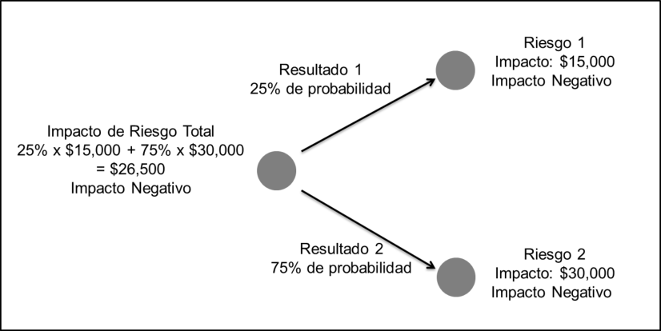

**Figura 7-1: Ejemplo de árbol de probabilidad** 

###### **3. Análisis de Pareto** 

En esta técnica, los riesgos se evalúan por su magnitud, lo cual ayuda al Equipo Scrum a abordar los riesgos en orden de su impacto potencial en el proyecto. Por ejemplo, en la figura 7-2, el riesgo 1 tiene el mayor impacto y, preferiblemente, debe atenderse primero. 

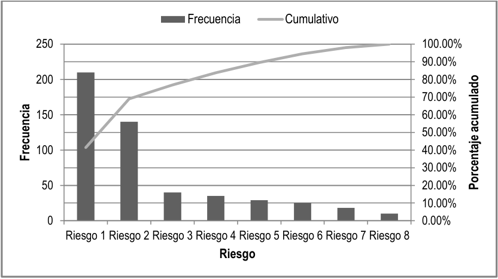

<!-- Start of picture text -->
Frecuencia Cumulativo 250 100.00% 90.00% 200 80.00% 70.00% 150 60.00% 50.00% 100 40.00% 30.00% 50 20.00% 10.00% 0 0.00% Riesgo 1 Riesgo 2 Riesgo 3 Riesgo 4 Riesgo 5 Riesgo 6 Riesgo 7 Riesgo 8 Riesgo Frecuencia Porcentaje acumulado <!-- End of picture text -->

**Figura 7-2: Ejemplo de un diagrama de Pareto** 

©2025 SCRUMstudy™. _Una guía para el cuerpo de conocimiento de Scrum (Guía SBOK®)_ **149** 

7 – RIESGO 

4. **Matriz de probabilidad e impacto** _(Probabiliy Impact Grid)_ 

Cada riesgo se evalúa según su probabilidad de ocurrencia y su impacto potencial en los objetivos del proyecto. Generalmente, se asigna una clasificación numérica a la probabilidad y al impacto en forma independiente. Ambos valores se multiplican para obtener una puntuación de la gravedad del riesgo, lo cual se puede utilizar para calificar los riesgos y después priorizarlos. 

Por ejemplo, la puntuación de gravedad en un riesgo con una probabilidad del 50 % y un índice de impacto de 0.6 se calcularía de la siguiente forma: 

###### 0.5 (Probabilidad) x 0.6 (Impacto) = 0.3 

Los esquemas de calificación implementados se determinan dentro de la organización o para el proyecto. Por lo general, se utiliza una escala decimal, del cero al uno, donde un índice de probabilidad de 0.5 indicaría un 50 % de posibilidad. Otras opciones incluyen una escala del uno al diez, o alta (3), mediana (2) y baja (1). 

La figura 7-3 muestra el uso de la escala decimal. Cada riesgo se califica con base a su probabilidad de ocurrencia e impacto en una escala objetiva. 

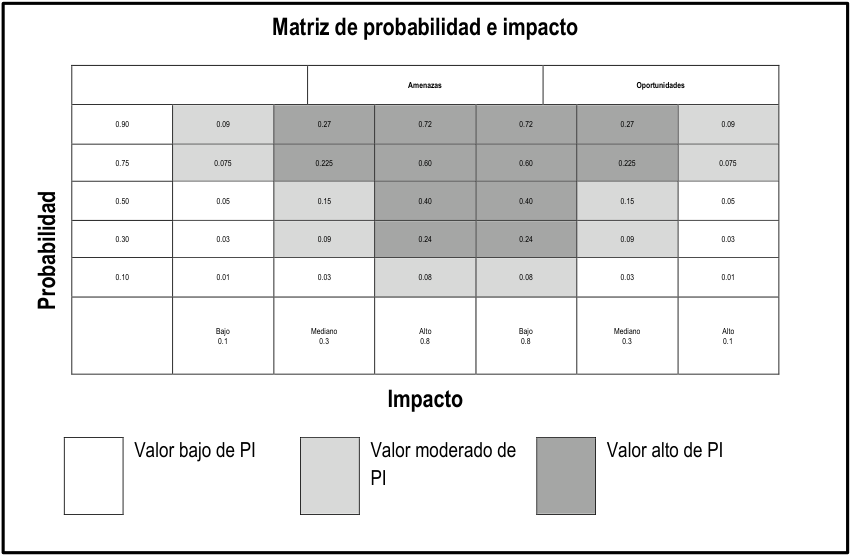

<!-- Start of picture text -->
Matriz de probabilidad e impacto Amenazas  Oportunidades 0.90  0.09  0.27  0.72  0.72  0.27  0.09 0.75  0.075  0.225  0.60  0.60  0.225  0.075 0.50  0.05  0.15  0.40  0.40  0.15  0.05 0.30  0.03  0.09  0.24  0.24  0.09  0.03 0.10  0.01  0.03  0.08  0.08  0.03  0.01 Bajo  Mediano  Alto  Bajo  Mediano  Alto 0.1  0.3  0.8  0.8  0.3  0.1 Impacto Valor bajo de PI  Valor moderado de  Valor alto de PI PI Probabilidad <!-- End of picture text -->

**Figura 7-3: Ejemplo de matriz de probabilidad e impacto** 

El método de asignar valores de probabilidad e impacto a los riesgos varía dependiendo del proyecto y de la cantidad de riesgos que se evalúen, así como los procesos y procedimientos organizacionales existentes. Sin embargo, si se aplica la sencilla fórmula: P x I, la gravedad del riesgo se puede calcular en una escala numérica o categórica. 

**150** ©2025 SCRUMstudy™. _Una guía para el cuerpo de conocimiento de Scrum (Guía SBOK®)_ 

7 – RIESGO 

**7** 

**5. Valor monetario esperado (EMV)** 

El valor monetario del riesgo se basa en su valor monetario esperado (EMV, por sus siglas en inglés). Dicho valor se calcula multiplicando el impacto monetario por la probabilidad de riesgo, según la aproximación del cliente. 

Valor monetario esperado = Impacto del riesgo (en divisas) x Probabilidad del riesgo (porcentaje) 

Por ejemplo, un riesgo con un impacto negativo estimado de 1,000 dólares y un 50 % de probabilidad de ocurrencia resultaría en el siguiente valor monetario esperado: 

Valor monetario esperado = $1,000 x 0.50 = $500 

#### **7.3.3 Priorización de riesgos** 

Scrum permite una rápida identificación y evaluación de riesgos. Los riesgos identificados se toman en cuenta en el proceso de _Crear el backlog priorizado del producto_ , o bien, cuando se actualiza dicho backlog en el proceso de su refinamiento; de tal forma que un backlog priorizado del producto pudiera también conocerse como backlog priorizado del producto ajustado al riesgo. 

Los riesgos se pueden identificar y evaluar con base en cualquier técnica de identificación y evaluación de riesgos que se mencionan anteriormente. 

En los procesos de _Crear el backlog priorizado del producto_ y _Refinar el backlog priorizado del producto_ , las historias de usuario priorizadas del backlog priorizado del producto existente y la lista priorizada de riesgos se combinan para crear un backlog actualizado que incluya los riesgos identificados: 

Pasos para actualizar el backlog priorizado del producto con riesgos identificados: 

1. Crear una lista de riesgos priorizados (por ejemplo: los riesgos se pueden priorizar por valor utilizando la técnica de valor monetario esperado). 

2. Seleccionar los riesgos identificados que pudieran mitigarse; y para los cuales el equipo decide tomar acción específica de riesgos durante el sprint a fin de mitigar tales riesgos. 

3. Agregar los riesgos identificados que puedan ser mitigados en el paso 2 al backlog priorizado del producto (en forma de historias de usuario) y después priorizarlas para tener un backlog priorizado del producto actualizado. 

©2025 SCRUMstudy™. _Una guía para el cuerpo de conocimiento de Scrum (Guía SBOK®)_ **151** 

7 – RIESGO 

La figura 7-4 muestra el proceso de priorización de riesgos: 

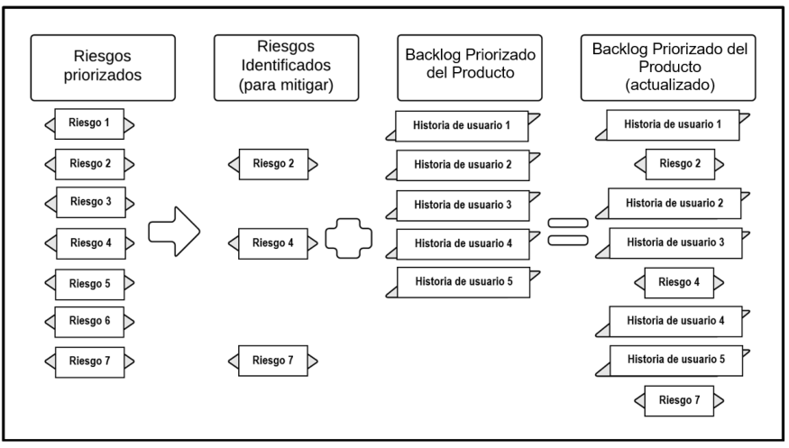

**Figura 7-4: Proceso de priorización de riesgos** 

#### **7.3.4 Mitigación de riesgos** 

La respuesta a cada riesgo dependerá de la probabilidad y de su impacto _._ Sin embargo, la naturaleza iterativa de Scrum, con sus ciclos rápidos de respuesta y retroalimentación, permite que las fallas se detecten a tiempo; por lo tanto, en términos prácticos, tiene una función de mitigación natural integrada. 

Un riesgo puede ser mitigado implementando una serie de medidas. En la mayoría de los casos, las respuestas son proactivas o reactivas. En el caso de un riesgo, se puede formular un plan B que se puede utilizar como alternativa en caso de que el riesgo se materialice; en este caso, el plan B es una respuesta reactiva. En ocasiones, los riesgos se aceptan y son un ejemplo de una respuesta al riesgo que no es ni preventiva ni reactiva. Los riesgos se aceptan por varias razones, como en situaciones donde la probabilidad o el impacto de riesgo son muy bajos para una respuesta. La aceptación también se puede atribuir a situaciones donde la aprehensión de riesgos secundarios puede disuadir al Product Owner de tomar cualquier acción. El esfuerzo realizado por el Product Owner para reducir la probabilidad del riesgo o del impacto (o ambos), es un ejemplo de una respuesta proactiva a la mitigación de riesgos. 

Una vez que los riesgos identificados se incluyen como parte del backlog priorizado del producto (véase la figura 7-4), varios riesgos se mitigan durante el proceso de _Crear entregables_ cuando se completan las tareas relacionadas a las historias de usuario definidas en el proceso de _Crear el backlog priorizado del producto_ . 

**152** ©2025 SCRUMstudy™. _Una guía para el cuerpo de conocimiento de Scrum (Guía SBOK®)_ 

7 – RIESGO 

**7** 

En Scrum, el Product Owner es claramente el dueño del riesgo y está a cargo de la gestión de riesgos relacionados a los aspectos del negocio; y Equipo Scrum tiene la responsabilidad de implementar respuestas al riesgo durante un sprint. Se puede consultar al Scrum Guidance Body para pedir orientación sobre la forma de implementar la respuesta a los riesgos y ver si las acciones coinciden con los lineamientos de la organización en su conjunto. El Scrum Master mantiene una estrecha vigilancia sobre los riesgos potenciales que pudieran afectar el proyecto y mantiene informado al Product Owner y al Equipo Scrum. 

###### **Spike basado en riesgo** 

Un _spike_ basado en riesgo es un concepto que puede ser útil para identificar riesgos. Es un experimento que implica hacer una investigación o hacer un prototipo para entender mejor los riesgos potenciales. En un _spike_ , se lleva a cabo un intenso ejercicio de dos a tres días (de preferencia al inicio de un proyecto, antes del proceso de _Desarrollar épicas_ o _Crear el backlog priorizado del producto_ ) para ayudar al equipo a determinar las incertidumbres que pudieran afectar al proyecto. Los _spikes_ basados en riesgos son útiles cuando el equipo Scrum está trabajando y acostumbrándose a nuevas tecnologías o herramientas, o cuando las historias de usuario son extensas. También ayudan a estimar el tiempo y el esfuerzo con mayor precisión. 

Los _spikes_ basados en riesgos pueden ser constantes a lo largo de un proyecto y se pueden incorporar durante cualquier sprint. Estos _spikes_ deben ser agregados al backlog priorizado del producto. La exploración de estos _spikes_ se utiliza para mitigar cualquier amenaza potencial a futuro. 

#### **7.3.5 Comunicación de riesgos** 

Debido a que los interesados del negocio tienen interés en el proyecto, es importante comunicarles los asuntos relacionados a los riesgos _._ La información proporcionada a los interesados del negocio sobre los riesgos debe incluir el impacto potencial, así como los planes para hacerle frente a cada riesgo. Esta comunicación siempre es constante y debe presentarse junto con los cuatro pasos descritos hasta el momento: identificación, evaluación, priorización y mitigación de riesgos. El Equipo Scrum pudiera también discutir con el Scrum Master los riesgos específicos relacionados a sus tareas durante los Daily Standups. El Product Owner es responsable de priorizar los riesgos y de comunicar la lista priorizada al Equipo Scrum. 

Una herramienta importante que se puede utilizar para comunicar la información relacionada a los riesgos es el _Risk Burndown Chart_ (gráfica de disminución de riesgos) 

###### **Risk Burndown Chart:** 

La gestión de riesgos es fundamental para garantizar la creación de valor; por lo tanto, las actividades de gestión de riesgos se llevan a cabo durante todo el ciclo de vida del proyecto y no solo durante su inicio. 

Cada riesgo se pude evaluar usando diferentes herramientas de evaluación de riesgos. Sin embargo, la herramienta preferida para evaluar riesgos y crear la gráfica _Risk Burndown Chart_ es el valor monetario esperado (EMV), tal como se describe en la sección 7.4.2. 

<mark>La información obtenida durante la evaluación de riesgos se puede utilizar para crear un</mark> _<mark>Risk Burndown Chart.</mark>_ Esta gráfica de disminución de riesgos representa la severidad del riesgo acumulado del proyecto en el tiempo. <mark>Las probabilidades de los diversos riesgos se trazan una sobre otra para mostrar el riesgo acumulado en el eje vertical. La identificación y evaluación inicial de los riesgos en el proyecto, así como la creación del Risk Burndown Chart se realizan al inicio.</mark> 

©2025 SCRUMstudy™. _Una guía para el cuerpo de conocimiento de Scrum (Guía SBOK®)_ **153** 

7 – RIESGO 

<mark>Después, en periodos predeterminados, los nuevos riesgos pueden ser identificados y evaluados mientras que los riesgos restantes deben ser reevaluados en la gráfica según sea el caso. Un momento apropiado para hacerlo es durante la reunión de planificación del sprint. El seguimiento de los riesgos de esta forma le permite al equipo reconocer tendencias en exposición de riesgo y tomar las medidas adecuadas según sea necesario.</mark> 

La figura 7-5 muestra un ejemplo de un <mark>Risk Burndown Chart.</mark> 

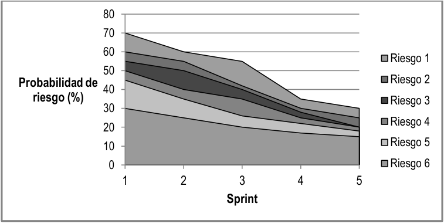

<!-- Start of picture text -->
80 70 60 Riesgo 1 50 Probabilidad de  Riesgo 2 40 riesgo (%) Riesgo 3 30 20 Riesgo 4 10 Riesgo 5 0 Riesgo 6 1 2 3 4 5 Sprint <!-- End of picture text -->

**Figura 7-5: Ejemplo de un** **_Risk Burndown Chart_ (gráfica de disminución de riesgos)** 

**154** ©2025 SCRUMstudy™. _Una guía para el cuerpo de conocimiento de Scrum (Guía SBOK®)_ 

7 – RIESGO 

**7** 

### **7.4 Minimizar riesgos por medio de Scrum** 

Al ser un proceso ágil e iterativo, el marco de trabajo de Scrum minimiza inherentemente el riesgo. Las siguientes prácticas de Scrum facilitan la gestión efectiva del riesgo: 

**1. La flexibilidad reduce el riesgo relacionado al entorno del negocio** 

En Scrum el riesgo se reduce considerablemente debido a la flexibilidad al agregar o modificar los requisitos en cualquier momento del ciclo de vida del proyecto. Esto le permite a la organización responder a las amenazas u oportunidades en el entorno del negocio, así como a las necesidades imprevistas cada vez que surjan, por lo general con un bajo costo de la gestión de tales riesgos. 

**2. La retroalimentación constante reduce el riesgo relacionado a las expectativas** 

Al ser iterativo, el marco de trabajo de Scrum proporciona amplias oportunidades para obtener información y establecer expectativas en todo el ciclo de vida del proyecto. Esto asegura que los interesados del negocio del proyecto _,_ así como el equipo, no sean tomados por sorpresa debido a requisitos mal comunicados. 

**3. La propiedad del equipo reduce la estimación de riesgo** 

El Equipo Scrum hace estimaciones y se hace responsable de los elementos del <mark>backlog del sprint</mark> _<mark>,</mark>_ lo cual conduce a una estimación más precisa y a la entrega oportuna de los incrementos del producto. 

**4. La transparencia reduce el riesgo de no detección** 

El principio de la transparencia en Scrum, en el cual se basa el marco de trabajo, asegura que los riesgos se detecten y se comuniquen oportunamente, lo cual conduce a un mejor manejo y mitigación de riesgos. Por otra parte, al llevar a cabo reuniones de Scrum de Scrums, los impedimentos que un equipo enfrenta en la actualidad pueden considerarse como riesgos para otros equipos Scrum a futuro. Esto debe reconocerse en la lista de impedimentos actualizada. 

**5. La entrega iterativa reduce el riesgo de inversión** 

<mark>La entrega continua de valor a lo largo del ciclo de vida del proyecto Scrum, como entregables potencialmente enviables creados después de cada sprint, reduce el riesgo de la inversión para el cliente.</mark> 

©2025 SCRUMstudy™. _Una guía para el cuerpo de conocimiento de Scrum (Guía SBOK®)_ **155** 

7 – RIESGO 

### **7.5 Riesgos en portafolios y programas** 

Mientras que algunos riesgos están específicamente relacionados con proyectos individuales, otros pueden tener su origen en los programas y portafolios, y generalmente serán administrados ahí mismo. Sin embargo, los riesgos relacionados a un portafolio o programa también tendrán un impacto en los proyectos que forman parte del respectivo portafolio o programa. Durante la evaluación de riesgos en portafolios y programas, si se determina que el riesgo puede afectar un proyecto individual, la información relevante sobre el riesgo debe ser comunicada al Product Owner y al Equipo Scrum. 

Dependiendo de la gravedad o de la prioridad, cuando el equipo del programa o el portafolio comunica el riesgo que tendrá un impacto en un proyecto individual, el Equipo Scrum tal vez tenga que detenerse y volver a planificar el actual sprint para atender el riesgo. Para los riesgos de menor urgencia, el equipo puede continuar con el actual sprint y atender el riesgo en un sprint a futuro. 

#### **7.5.1 En el portafolio** 

1. Cuando se identifican los riesgos en el portafolio, el Portfolio Product Owner tendrá que capturarlos y evaluar la proximidad, probabilidad e impacto de cada riesgo identificado a fin de priorizarlo y determinar la respuesta adecuada para el portafolio. 

2. El Portfolio Product Owner tendrá también que comunicar los riesgos a los interesados del negocio relevantes, a los equipos del programa y del proyecto. En algunos casos, el equipo del portafolio pudiera tener que asumir la responsabilidad de riesgos específicos. 

#### **7.5.2 En los programas** 

1. Cuando se identifican los riesgos en el programa, el Product Owner del programa debe ingresarlo en el backlog priorizado del producto ajustado al riesgo, evaluar la proximidad, probabilidad e impacto de cada riesgo identificado a fin de priorizarlo y determinar la respuesta adecuada para los programas. 

2. El Program Product Owner tendrá también que comunicar los riesgos a los interesados del negocio relevantes y a los equipos del proyecto. En algunos casos, el equipo del portafolio pudiera tener que asumir la responsabilidad de riesgos específicos. 

**156** ©2025 SCRUMstudy™. _Una guía para el cuerpo de conocimiento de Scrum (Guía SBOK®)_ 

7 – RIESGO 

**7** 

La figura 7-6 muestra cómo se pueden gestionar los riesgos dentro del flujo de Scrum tanto en los portafolios como en los programas. 

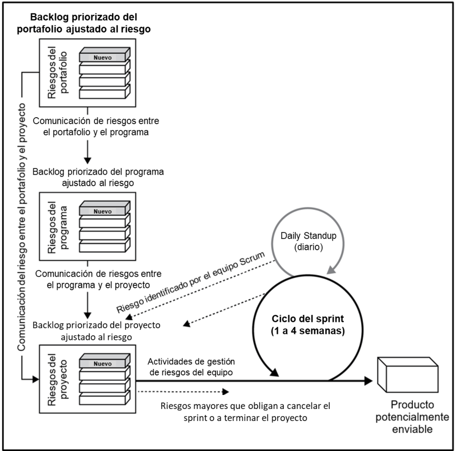

**Figura 7-6: Gestión de riesgos en portafolios y programas** 

©2025 SCRUMstudy™. _Una guía para el cuerpo de conocimiento de Scrum (Guía SBOK®)_ **157** 

7 – RIESGO 

### **7.6 Resumen de responsabilidades** 

En Scrum, las actividades de gestión de riesgos se dividen entre distintos roles. Algunas de las responsabilidades recaen sobre todos los integrantes del Equipo Scrum y el Scrum Master facilita el proceso. 

|**Rol**|**Responsabilidades**|
|---|---|
|Equipo Scrum|• Identifica los riesgos durante el desarrollo del producto durante el proceso de_Crear entregables_. • Implementa actividades de gestión de riesgos según lo recomiende el Product Owner.|
|Product Owner/ Chief Product Owner|• Captura y evalúa riesgos del proyecto • Prioriza y comunica los riesgos a losinteresados del negocio relevantes, así como a los equipos del programa y del portafolio • Se asegura de que los niveles de riesgo del proyecto estén dentro de los límites aceptables.|
|Scrum Master/ Chief Scrum Master|• Facilita al Equipo Scrum la identificación y escalamiento de riesgos.|
|Program Product Owner|• Captura y evalúa los riesgos de los programas • Priorizar y comunica los riesgos a losinteresados del negocio relevantes y equipos del proyecto.|
|Program Scrum Master|• Facilita la identificación, evaluación y comunicación de los riesgos de los programas|
|Portfolio Product Owner|• Captura y evalúa los riesgos del portafolio • Prioriza y comunica los riesgos a losinteresados del negocio relevantes, así como a los equipos del programa y del proyecto.|
|Portfolio Scrum Master|• Facilita la identificación, evaluación y comunicación de los riesgos del portafolio|
|Interesados del negocio|• Interactúan con el equipo principal de Scrum para brindarle información sobre la gestión de riesgos que afectan el logro de los resultados esperados, así como los beneficios del proyecto.|
|Scrum Guidance Body|• Brinda una guía general para el procedimiento de gestión de riesgos para que se siga durante todo el proyecto.|

**Tabla 7-1: Resumen de las responsabilidades pertinentes a los riesgos** 

**158** ©2025 SCRUMstudy™. _Una guía para el cuerpo de conocimiento de Scrum (Guía SBOK®)_ 

7 – RIESGO 

**7** 

### **7.7 Scrum vs. Gestión tradicional de proyectos** 

<mark>Scrum y la mayoría de los métodos tradicionales de gestión de proyectos definen los “riesgos” como “eventos inciertos que pudieran afectar de forma positiva o negativa los logros de los objetivos del proyecto”. Asimismo, los riesgos se identifican, se atienden, se planifican y se comunican continuamente.</mark> 

<mark>En los modelos tradicionales de gestión de proyectos, se</mark> hace énfasis en la planificación inicial detallada para identificar, evaluar y determinar las respuestas de riesgo para todos los riesgos del <mark>proyecto. Durante la ejecución del proyecto,</mark> cualquier miembro del equipo del <mark>proyecto</mark> puede identificar los riesgos y el director del proyecto o la dependencia encargada de gestión de <mark>proyectos</mark> o el personal de apoyo a los <mark>proyectos</mark> puede actualizarlos en la lista de riesgos o en el registro de riesgos. El director del proyecto monitorea y controla con frecuencia todos los riesgos y por lo general identifica a individuos específicos en el equipo para que se hagan cargo de diferentes aspectos del riesgo. 

<mark>En Scrum, cualquier miembro del equipo puede identificar riesgos y el</mark> Product Owne <mark>r puede actualizar los riesgos identificados en el backlog priorizado del producto ajustado al riesgo. Los principios de Scrum sobre el control de proceso empírico y el desarrollo iterativo le permiten al Equipo Scrum identificar constantemente los riesgos y sumarlos al b</mark> acklog priorizado del product <mark>o donde se pueden priorizar con otras historias de usuarios existentes en el backlog antes mencionado, a fin de mitigarlos en futuros sprints. El Equipo Scrum tiene responsabilidades colectivas para la gestión de todos los riesgos en el sprint.</mark> 

©2025 SCRUMstudy™. _Una guía para el cuerpo de conocimiento de Scrum (Guía SBOK®)_ **159** 

**Esta página ha sido dejada en blanco intencionalmente.** 

©2025 SCRUMstudy™. _Una guía para el cuerpo de conocimiento de Scrum (Guía SBOK®)_ 

8 – INICIO 

**8** 

## **8. INICIO** 

Este capítulo incluye los procesos relacionados con el inicio de un proyecto: _Crear la visión del proyecto, Identificar al Scrum Master y a los interesados del negocio_ , _Formar el Equipo Scrum_ , _Desarrollar épicas_ , _Crear el backlog priorizado del producto_ y _Realizar la planificación de la liberación_ . 

<mark>El inicio, tal como se define en la</mark> _<mark>Guía de los fundamentos de Scrum (Guía del SBOK</mark>__®_ _<mark>)</mark>_ <mark>es aplicable a los siguientes:</mark> 

- <mark>Portafolios, programas o proyectos de cualquier industria;</mark> 

- <mark>Productos, servicios o cualquier otro resultado que se entregará a los</mark> interesados del negocio; 

- <mark>Proyectos de cualquier tamaño y complejidad.</mark> 

<mark>El término “producto” en la</mark> _<mark>Guía del SBOK</mark>__®_ <mark>puede referirse a un producto</mark> _<mark>,</mark>_ <mark>servicio, o cualquier otro entregable. Scrum puede aplicarse de manera efectiva a cualquier proyecto en cualquier industria, desde pequeños proyectos o equipos con tan solo seis miembros del equipo, hasta proyectos grandes y complejos que cuentan con cientos de miembros.</mark> 

A fin de facilitar la mejor aplicación del marco de trabajo de Scrum, en este capítulo se identifican las entradas, herramientas y salidas de cada proceso, ya sea como “obligatorias” u “opcionales”. Las entradas, herramientas y salidas indicadas por asteriscos (*) son obligatorias o se consideran importantes para el éxito, mientras que las que no tienen asteriscos son opcionales. 

Se recomienda que el Equipo Scrum y aquellas personas que empiezan a aprender sobre el marco de trabajo y los procesos de Scrum, se enfoquen principalmente en las entradas, herramientas y salidas obligatorias; mientras que los Product Owners, Scrum Masters y demás practicantes con experiencia en Scrum, se deben esforzar por alcanzar un conocimiento más a fondo sobre la información ofrecida en este capítulo. 

<mark>Este capítulo está escrito desde la perspectiva de un Equipo Scrum que trabaja en un sprint para producir entregables que pudieran ser parte de un proyecto más grande, de un programa o portafolio. La información sobre cómo escalar Scrum en grandes proyectos está disponible en el capítulo 13 y lo relacionado a escalar Scrum para la empresa se puede encontrar en el capítulo 14.</mark> 

La fase de inicio se desarrolla al principio de un proyecto de Scrum. En esta fase se identifica al equipo principal de Scrum y a los interesados del negocio, iniciando con el Product Owner, quien elabora la visión del proyecto para guiar su desarrollo. 

El conjunto inicial de requerimientos y documentos en forma de épicas se logra con base en la visión del proyecto. 

Estos requerimientos iniciales se priorizan y se utilizan para crear un primer backlog priorizado del producto (el documento con los requisitos en un proyecto de Scrum). El último paso en la fase de inicio es elaborar un cronograma de liberación. La fase de inicio no genera un plan integral y detallado para todo el proyecto. No hay necesidad de ello, ya que se espera que haya cambios y que se puedan incorporar fácilmente al proyecto debido a la naturaleza iterativa de Scrum. En vez de ello, la meta es presentar un buen plan inicial del proyecto, asegurando que todo se haga en consonancia con el negocio o con las regulaciones de alta prioridad. La fase de inicio debe ser breve a fin de iniciar rápidamente con la creación de valor. 

©2025 SCRUMstudy™. _Una guía para el cuerpo de conocimiento de Scrum (Guía SBOK®)_ **161** 

8 – INICIO 

También es importante destacar que, aunque todos los procesos se definen de forma única en la _<mark>Guía del SBOK</mark>__®_ _<mark>,</mark>_ no necesariamente se llevan a cabo de forma secuencial o por separado. En ocasiones, puede ser más apropiado combinar algunos procesos, dependiendo de los requisitos específicos de cada proyecto. 

<mark>La figura 8-1 proporciona un resumen de los procesos de la fase de inicio, que son los siguientes:</mark> 

**8.1 Crear la visión del proyecto:** En este proceso se identifica al Product Owner. El Product Owner, con base en el caso de negocio del proyecto, desarrolla la declaración de visión del proyecto. Esta visión incluye la guía general, la inspiración y el enfoque del proyecto. 

**8.2 Identificar al Scrum Master y a los interesados del negocio:** En este proceso se identifica al Scrum Master utilizando criterios específicos de selección que se enfocan en las habilidades interpersonales y en el conocimiento de Scrum para este importante rol. También se identifican a los interesados del negocio. 

**8.3 Formar el Equipo Scrum:** En este proceso se seleccionan a los miembros del Equipo Scrum con base en las habilidades necesarias para desarrollar los entregables del proyecto, así como en las consideraciones de disponibilidad, costos y habilidades interpersonales importantes para los miembros del equipo. Normalmente, el Product Owner es el responsable principal de la selección de los miembros del equipo, pero a menudo lo hace en colaboración con el Scrum Master. 

**8.4 Desarrollar épicas:** En este proceso, la declaración de la visión del proyecto sirve como base para el desarrollo de épicas, las cuales definen los requerimientos de alto nivel del proyecto. El Product Owner puede utilizar reuniones de grupos de usuarios y otras herramientas para obtener los requerimientos de los interesados del negocio. 

**8.5 Crear el backlog priorizado del producto:** En este proceso, las épicas se refinan, se desarrollan, y lo más importante: se priorizan según su respectivo valor de negocio a fin de crear el backlog priorizado del producto del proyecto. También, con base en las recomendaciones del Scrum Guidance Body, el Product Owner y el Equipo Scrum establecen los criterios de terminado del proyecto. 

**8.6 Realizar la planificación de liberación:** En este proceso, el Product Owner, con la opinión de los interesados del negocio y los miembros del Equipo Scrum, desarrolla el cronograma inicial de liberación, el cual se comunica y se comparte a los interesados del negocio. Se entiende que, debido a la naturaleza iterativa de Scrum, tal vez sea necesario hacer ajustes posteriores al cronograma de liberación. En este proceso también se establece la duración del sprint. 

**162** © 2025 SCRUMstudy™. _Una guía para el cuerpo de conocimiento de Scrum (Guía SBOK®)_ 

8 – INICIO 

**8** 

###### **8.1 Crear la visión del proyecto** 

###### **ENTRADAS** 

1. Caso de negocio del proyecto* 

2. Proyecto piloto 

3. Prueba de concepto 

   - Visión de la compañía 

4. 

5. Misión de la compañía 

6. Estudio de mercado 

7. Recomendaciones del Scrum Guidance Body 

###### **HERRAMIENTAS** 

1. Reunión de la visión del proyecto* 

2. Sesiones JAD 

3. Análisis FODA 

4. Análisis de brecha **SALIDAS** 

1. Product Owner identificado* 

2. Declaración de la visión del proyecto* 

3. Acta de constitución del proyecto 

4. Presupuesto del proyecto 5. Herramienta de Proyecto Scrum impulsada por IA 

###### **8.2 Identificar al Scrum Master y a los interesados del negocio** 

###### **ENTRADAS** 

1. Product Owner * 

2. Declaración de la visión del proyecto* 

3. Requerimientos de las personas 4. Disponibilidad y compromiso de las personas 

5. Matriz de recursos organizacionales 

6. Matriz de las destrezas requeridas 7. Recomendaciones del Scrum Guidance Body 

###### **HERRAMIENTAS** 

1. Criterios de selección* 

2. Asesoramiento de expertos en recursos humanos 

3. Capacitación 

4. Costos de recursos **SALIDAS** 

1. Scrum Master identificado* 

2. Interesados del negocio identificados* 

###### **8.3 Formar el Equipo Scrum** 

###### **ENTRADAS** 

1. Product Owner* 

2. Scrum Master* 

3. Declaración de la visión del proyecto* 

4. Requisitos de las personas 

5. Disponibilidad y compromiso de las personas 

6. Matriz de recurso organizacional 

7. Matriz de las destrezas requeridas 

8. Requerimientos de recursos 9. Recomendaciones del Scrum Guidance Body 

###### **HERRAMIENTAS** 

1. Criterios de selección del Equipo Scrum* 2. Asesoramiento de expertos en recursos humanos 

3. Costos del personal 4. Capacitación 5. Costos de recursos 6. Herramienta de Proyecto Scrum impulsada por IA 

###### **SALIDAS** 

1. Equipo Scrum identificado* 2. Substitutos 3. Plan de colaboración 4. Plan de desarrollo del equipo 

###### **8.4 Desarrollar épicas** 

###### **ENTRADAS** 

1. Equipo Principal de Scrum* 2. Declaración de la visión del proyecto* 

3. Interesados del negocio 

4. Solicitudes de cambios aprobadas 

5. Solicitudes de cambios no aprobadas 

6. Leyes y regulaciones 

7. Contratos aplicables 

8. Información de proyectos previos 

9. Recomendaciones del Scrum Guidance Body 

###### **HERRAMIENTAS** 

1. Reuniones con grupos de usuarios* 

2. Talleres de historias de usuario 

3. Reuniones de grupos de enfoque 

4. Entrevistas con clientes o usuarios 

5. Cuestionarios 

6. Técnicas de identificación de riesgos 7. Experiencia del Scrum Guidance Body 

8. Herramienta de Proyecto Scrum impulsada por IA 

**SALIDAS** 1. Épicas* 2. Personajes* 3. Cambios aprobados 4. Riesgos identificados 

###### **8.5 Crear el Backlog Priorizado del Producto** 

###### **ENTRADAS** 

1. Equipo principal de Scrum* 2. Épicas* 3. Personajes* 

4. Interesados del negocio 

5. Declaración de la visión del proyecto 

6. Requerimientos del negocio 

7. Solicitudes de cambios aprobadas 

8. Riesgos identificados 

9. Contratos Aplicables 10. Recomendaciones del Scrum Guidance Body 

**HERRAMIENTAS** 1. Métodos de priorización* 2. Talleres de historias de usuario 3. Técnicas de evaluación del riesgo 4. Estimación del valor del proyecto 5. Métodos de estimación de épicas 6. Determinación de dependencias 7. Experiencia del Scrum Guidance Body 8. Herramienta de Proyecto Scrum impulsada por IA 

**SALIDAS** 

1. Backlog priorizado del producto* 

2. Criterios de terminado* 3. Definición de listo* 4. Estimaciones de alto nivel de las épicas 

5. Dependencias 

###### **8.6 Realizar la planificación de la liberación** 

###### **ENTRADAS** 

1. Equipo principal de Scrum* 2. Interesados del negocio* 3. Declaración de la visión del proyecto* 4. Backlog priorizado del producto* 5. Criterios de terminado* 

6. Requerimientos del negocio 

7. Calendario de días festivos 

8. Recomendaciones del Scrum Guidance Body 

9. Estimaciones de alto nivel de las épicas 

###### **HERRAMIENTAS** 

1. Sesiones de planificación de la liberación* 

2. Métodos de priorización de la liberación* 

3. Herramienta de Proyecto Scrum impulsada por IA 

**SALIDAS** 1. Cronograma de planificación de la liberación* 

2. Duración del sprint* 3. Clientes meta para la liberación 4. Backlog priorizado del producto refinado 

**Figura 8-1: Información general de la fase de inicio** 

©2025 SCRUMstudy™. _Una guía para el cuerpo de conocimiento de Scrum (Guía SBOK®)_ **163** 

8 – INICIO 

La figura 8-2 muestra las entradas obligatorias, herramientas y salidas para los procesos en la fase de inicio. 

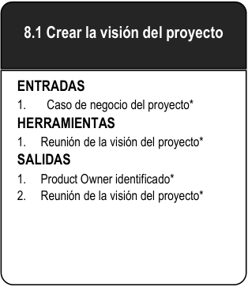

<!-- Start of picture text -->
8.1 Crear la visión del proyecto ENTRADAS 1. Caso de negocio del proyecto* HERRAMIENTAS 1. Reunión de la visión del proyecto* SALIDAS 1. Product Owner identificado* 2. Reunión de la visión del proyecto* <!-- End of picture text -->

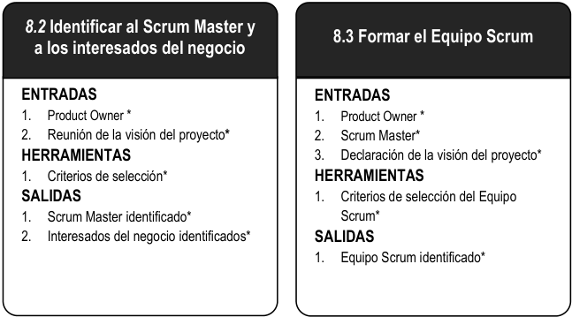

<!-- Start of picture text -->
8.2  Identificar al Scrum Master y 8.3 Formar el Equipo Scrum a los interesados del negocio ENTRADAS ENTRADAS 1. Product Owner *  1. Product Owner * 2. Reunión de la visión del proyecto * 2. Scrum Master* HERRAMIENTAS  3. Declaración de la visión del proyecto* 1. Criterios de selección*  HERRAMIENTAS SALIDAS  1. Criterios de selección del Equipo 1. Scrum Master identificado*  Scrum* 2. Interesados del negocio identificados*  SALIDAS 1. Equipo Scrum identificado* <!-- End of picture text -->

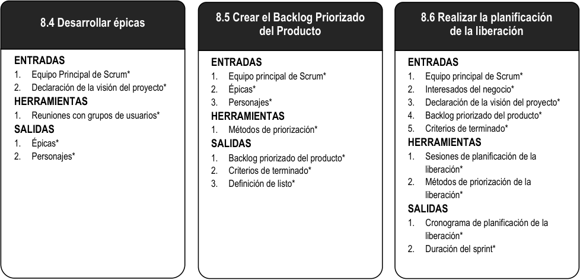

<!-- Start of picture text -->
8.5 Crear el Backlog Priorizado  8.6 Realizar la planificación 8.4 Desarrollar épicas del Producto  de la liberación ENTRADAS ENTRADAS ENTRADAS 1. Equipo Principal de Scrum*  1. Equipo principal de Scrum*  1. Equipo principal de Scrum* 2. Declaración de la visión del proyecto*  2. Épicas*  2. Interesados del negocio* HERRAMIENTAS  3. Personajes*  3. Declaración de la visión del proyecto* 1. Reuniones con grupos de usuarios*  HERRAMIENTAS  4. Backlog priorizado del producto* SALIDAS  1. Métodos de priorización*  5. Criterios de terminado* 1. Épicas*  SALIDAS  HERRAMIENTAS 2. Personajes*  1. Backlog priorizado del producto*  1. Sesiones de planificación de la 2. Criterios de terminado*  liberación* 3. Definición de listo*  2. Métodos de priorización de la liberación* SALIDAS 1. Cronograma de planificación de la liberación* 2. Duración del sprint* <!-- End of picture text -->

**Figura 8-2: Información general de la fase de inicio (fundamentales)** 

_Nota: Los asteriscos (*) indican una entrada, herramientas o salida “obligatoria” para el proceso correspondiente._ 

**164** © 2025 SCRUMstudy™. _Una guía para el cuerpo de conocimiento de Scrum (Guía SBOK®)_ 

8 – INICIO 

**8** 

### **8.1 Crear la visión del proyecto** 

En este proceso se identifica al Product Owner. El Product Owner, con base en el caso de negocio del proyecto, desarrolla la declaración de visión del proyecto. Esta visión incluye la guía general, la inspiración y el enfoque del proyecto. 

La figura 8-3 muestra todas las entradas, herramientas y salidas para el proceso de _Crear la visión del proyecto._ 

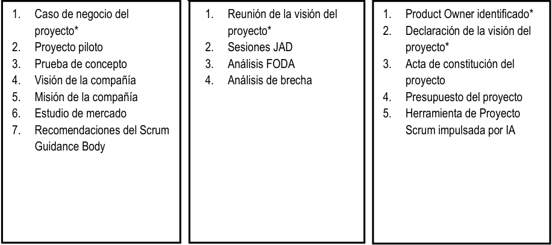

<!-- Start of picture text -->
1. Caso de negocio del  1. Reunión de la visión del  1. Product Owner identificado* proyecto*  proyecto*  2. Declaración de la visión del 2. Proyecto piloto  2. Sesiones JAD  proyecto* 3. Prueba de concepto  3. Análisis FODA   3. Acta de constitución del 4. Visión de la compañía  4. Análisis de brecha  proyecto 5. Misión de la compañía  4. Presupuesto del proyecto 6. Estudio de mercado  5. Herramienta de Proyecto 7. Recomendaciones del Scrum  Scrum impulsada por IA Guidance Body <!-- End of picture text -->

**Figura 8-3: Crear la visión del proyecto: entradas, herramientas y salidas** 

_Nota: Los asteriscos (*) indican una entrada, herramientas o salida “obligatoria” para el proceso correspondiente._ 

©2025 SCRUMstudy™. _Una guía para el cuerpo de conocimiento de Scrum (Guía SBOK®)_ **165** 

8 – INICIO 

La figura 8-4 muestra el diagrama de flujo de este proceso. 

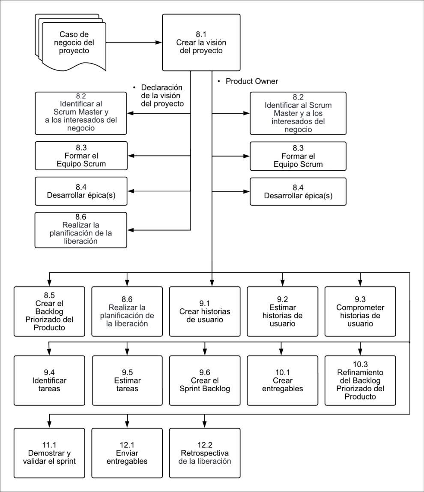

**Figura 8-4: Crear la visión del proyecto - Diagrama del flujo** 

**166** © 2025 SCRUMstudy™. _Una guía para el cuerpo de conocimiento de Scrum (Guía SBOK®)_ 

8 – INICIO 

**8** 

#### **8.1.1 Entradas** 

##### **8.1.1.1 Caso de negocio del proyecto*** 

El proyecto inicia con la presentación del caso de negocio ( _business case_ ) a los interesados del negocio y a los patrocinadores. Es necesario que los interesados del negocio entiendan los beneficios de negocio que se esperan del proyecto, y los patrocinadores deben confirmar que aportarán los recursos económicos para el proyecto. Un caso de negocio puede ser un documento bien estructurado o simplemente una declaración verbal que expresa la justificación para iniciar un proyecto. Puede ser formal y detallado, o informal y breve. El caso de negocio generalmente incluye información sustancial sobre los antecedentes del proyecto, los objetivos del negocio y los resultados deseados, un reporte de análisis FODA y de brecha, una lista de los riesgos identificados y las estimaciones de tiempo, esfuerzo y costo. En el caso de negocio del proyecto se deben de tomar en cuenta factores externos tales como las regulaciones jurídicas, requisitos gubernamentales, problemas sobre privacidad de la información, etc. 

##### **8.1.1.2 Proyecto piloto** 

Si es posible, se puede llevar a cabo una demostración a pequeña escala o un proyecto piloto en forma de experimento a fin de pronosticar y evaluar la viabilidad, el tiempo y el costo, los riesgos, así como los posibles efectos del proyecto real. Esto ayuda a evaluar el entorno práctico del proyecto y a orientar el diseño real del proyecto antes de iniciarlo a escala completa. 

##### **8.1.1.3 Prueba de concepto** 

Una prueba de concepto demuestra y verifica que la idea detrás del proyecto actual es potencialmente viable en un entorno real. Generalmente se hace en forma de prototipo y se diseña para definir la viabilidad técnica y financiera; ayuda a tender los requerimientos y ayuda a evaluar las decisiones sobre el diseño a principios del proyecto. Sin embargo, la prueba de concepto no necesariamente debe representar los entregables reales del proyecto. 

##### **8.1.1.4 Visión de la compañía** 

Entender la visión de la compañía ayuda a mantener al proyecto enfocado en los objetivos de la organización y en el futuro potencial de la compañía. El Product Owner puede guiarse por la visión de la compañía para crear la declaración de la visión del proyecto. 

##### **8.1.1.5 Misión de la compañía** 

La misión de la compañía ofrece un marco de trabajo para formular las estrategias de la empresa y guía la toma de decisiones generales en la compañía. Dicha misión debe enmarcarse de tal manera que su cumplimiento ayude a la organización a llevar a cabo su misión. 

©2025 SCRUMstudy™. _Una guía para el cuerpo de conocimiento de Scrum (Guía SBOK®)_ **167** 

8 – INICIO 

##### **8.1.1.6 Estudio de mercado** 

El estudio de mercado es la investigación organizada, la recopilación, la comparación y el análisis de datos relacionados con las preferencias de los clientes sobre los productos. Generalmente incluye numerosos datos sobre las tendencias y la segmentación del mercado, así como los procesos de comercialización. El estudio de mercado podría incluir también un estudio analítico de los competidores, lo que proporciona una mejor comprensión de las fortalezas y debilidades de los competidores y puede ayudar a quienes toman decisiones a formular productos mejor posicionados. 

##### **8.1.1.7 Recomendaciones del Scrum Guidance Body** 

El Scrum Guidance Body (SGB) es un rol opcional. Por lo general, se compone de un grupo de documentos o de un grupo de expertos que normalmente están involucrados en la definición de objetivos relacionados con la calidad, las regulaciones gubernamentales, la seguridad y demás parámetros claves de la organización. Estos objetivos guían el trabajo del Product Owner, del Scrum Master y del Equipo Scrum. El Scrum Guidance Body ayuda también a captar las mejores prácticas que deben utilizarse en todos los proyectos Scrum en la organización. El Scrum Guidance Body no toma decisiones relacionadas con el proyecto. En cambio, actúa como estructura consultiva o asesora para todos los niveles jerárquicos la organización del proyecto: el portafolio, el programa y el proyecto. Los equipos Scrum tienen la opción de pedir recomendaciones al Scrum según sea necesario. Es importante asegurarse de que la visión del proyecto esté en línea con las recomendaciones proporcionadas por el Scrum Guidance Body y que los procesos cumplan con las normas y directrices establecidas por dicho organismo. 

#### **8.1.2 Herramientas** 

##### **8.1.2.1 Reunión de la visión del proyecto*** 

La reunión de la visión del proyecto es una reunión con los interesados del negocio, el Program Product Owner, el Program Scrum Master y el Chief Product Owner. Esta ayuda a identificar el contexto del negocio, los requerimientos de negocio y las expectativas de los interesados del negocio a fin de desarrollar una declaración de la visión del proyecto eficaz. Scrum cree en la participación y colaboración cercana con todos los representantes de las empresas para obtener su sentido de compromiso con el proyecto y para ofrecer un valor más significativo. 

##### **8.1.2.2 Sesiones JAD** 

La sesión _Joint Application Design_ (JAD), o sesión de diseño de aplicación conjunta, es una técnica de recopilación de requisitos. Es un taller impartido y altamente estructurado que acelera el proceso de _Crear la visión del proyecto_ , ya que permite a los interesados del negocio y a otras personas que toman decisiones llegar a un consenso sobre el alcance, los objetivos y otras especificaciones del proyecto. 

**168** © 2025 SCRUMstudy™. _Una guía para el cuerpo de conocimiento de Scrum (Guía SBOK®)_ 

8 – INICIO 

**8** 

Esta técnica consiste en métodos para aumentar la participación del usuario, lo que acelera el desarrollo y la mejora de las especificaciones. Los interesados del negocio relevantes en el programa, el Program Product Owner, el Program Scrum Master pueden reunirse para delinear y analizar los resultados de negocio deseados y visualizar su visión para el proyecto Scrum. 

##### **8.1.2.3 Análisis FODA** 

El análisis FODA es un enfoque estructurado para la planificación que ayuda a evaluar las fortalezas, oportunidades, debilidades y amenazas relacionadas con un proyecto. Este tipo de análisis ayuda a identificar los factores internos y externos que podrían afectar el proyecto. Las fortalezas y debilidades son factores internos, mientras que las oportunidades y amenazas son factores externos. La identificación de estos factores ayuda a los interesados del negocio y a quienes toman decisiones a finalizar los procesos, las herramientas y las técnicas que se utilizarán para lograr los objetivos del proyecto. El análisis FODA permite la identificación temprana de las prioridades, los cambios potenciales y riesgos. 

##### **8.1.2.4 Análisis de brecha** 

El análisis de brecha ( _gap analysis_ ) es una técnica que se utiliza para comparar el estado actual con el estado deseado. En una organización, esto implica establecer y documentar la diferencia entre las capacidades actuales del negocio y el conjunto final de capacidades deseado. Normalmente se inicia un proyecto para que una organización alcance una situación deseada, por lo que llevar a cabo un análisis de brecha ayudaría a quienes toman decisiones a determinar la necesidad de un proyecto. 

Los principales pasos en el análisis de brecha se presentan en la figura 8-5. 

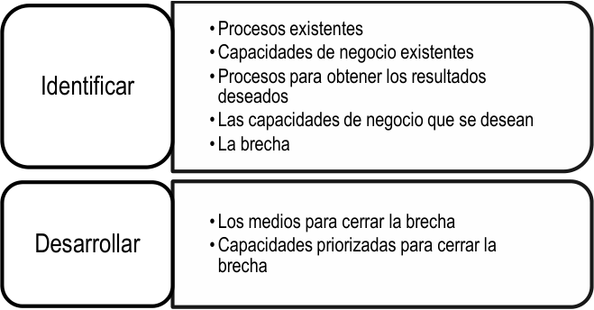

<!-- Start of picture text -->
•Procesos existentes •Capacidades de negocio existentes •Procesos para obtener los resultados Identificar deseados •Las capacidades de negocio que se desean •La brecha •Los medios para cerrar la brecha Desarrollar •Capacidades priorizadas para cerrar la brecha <!-- End of picture text -->

**Figura 8-5: El proceso del análisis de brecha** 

©2025 SCRUMstudy™. _Una guía para el cuerpo de conocimiento de Scrum (Guía SBOK®)_ **169** 

8 – INICIO 

#### **8.1.3 Salidas** 

##### **8.1.3.1 Product Owner identificado*** 

Uno de los resultados de este proceso es la identificación del Product Owner. El Product Owner es la persona responsable de lograr el máximo valor de negocio para el proyecto. También está a cargo de la articulación de requerimientos por parte de los clientes y de mantener la justificación del negocio en el proyecto. El Product Owner representa la voz del cliente. 

El rol del Product Owner se describe en más detalle en la sección 3.4. 

##### **8.1.3.2 Declaración de la visión del proyecto*** 

El principal resultado del proceso de _Crear la visión del proyecto_ es una declaración bien estructurada de la visión del proyecto. Una buena visión del proyecto explica las necesidades del negocio que el proyecto busca cumplir y no la forma en la que se cumplirá. 

La declaración de la visión del proyecto ( _Project Vision Statement_ ) no debe ser demasiado específica y debe dejar espacio a la flexibilidad. Es posible que el conocimiento actual sobre el proyecto esté basado en suposiciones que cambien conforme avanza el proyecto, por lo que es importante que la visión del proyecto sea lo suficientemente flexible como para adaptarse a estos cambios. La visión del proyecto debe centrarse en el problema y no en la solución. 

##### **8.1.3.3 Acta de constitución del proyecto** 

El acta de constitución del proyecto ( _project charter_ ) es una declaración oficial de los objetivos y resultados deseados del proyecto. En varias organizaciones, el acta de constitución del proyecto es el documento que autoriza el proyecto oficial y formalmente, dándole al equipo la autoridad por escrito para iniciar el proyecto. 

##### **8.1.3.4 Presupuesto del proyecto** 

El presupuesto del proyecto es un documento financiero que incluye el costo del personal, materiales y otros gastos relacionados en un proyecto. Por lo general, dicho presupuesto es autorizado por los patrocinadores para asegurar que haya suficientes fondos disponibles. Una vez que se autoriza, el Product Owner y el Scrum Master estarán constantemente involucrados en la gestión del presupuesto del proyecto para garantizar que exista la disponibilidad necesaria de personal y recursos para el proyecto. 

##### **8.1.3.5 Herramienta de proyecto Scrum impulsada por IA** 

La selección de una herramienta de Scrum impulsada por IA debe basarse en una comprensión profunda tanto de las metodologías ágiles como de las capacidades de la inteligencia artificial. Un proceso de selección bien ejecutado no solo mejora la eficacia de Scrum, sino que también fomenta una cultura de 

**170** © 2025 SCRUMstudy™. _Una guía para el cuerpo de conocimiento de Scrum (Guía SBOK®)_ 

8 – INICIO 

**8** 

toma de decisiones basada en datos y mejora continua. La selección de una herramienta de proyecto Scrum impulsada por IA es una decisión estratégica que debe alinearse con la madurez ágil, las necesidades operativas y los objetivos a largo plazo de la organización. El siguiente enfoque estructurado proporciona un marco formal para evaluar y seleccionar una herramienta adecuada. 

##### **1. Evaluar los requisitos de la organización** 

- Comience por realizar una evaluación integral de las necesidades de gestión de proyectos de la organización, con un enfoque particular en cómo se implementa Scrum actualmente. Esto incluye: 

- La escala de la adopción de Scrum en todos los equipos. 

- Retos actuales en la gestión del backlog, la planificación de sprints o las retrospectivas. 

- La sofisticación técnica de los equipos y su disposición para adoptar procesos impulsados por IA. 

- El nivel deseado de automatización, análisis y capacidades predictivas. 

##### **2. Definir criterios de selección** 

- Es esencial contar con criterios claramente definidos para una comparación objetiva de las herramientas disponibles. Los criterios deben incluir requisitos funcionales y no funcionales: 

- Criterios funcionales 

- Soporte para todos los componentes principales de Scrum (Epics, User Stories, Tasks, Sprint Backlogs, Retrospectives). 

- Funciones impulsadas por IA como: 

- Refinamiento automatizado del backlog 

- Desglose y clasificaciones recomendadas para proyectos, epopeyas, historias de usuario 

- Informes y análisis de datos impulsados por IA 

- Priorización inteligente 

- Identificación predictiva de riesgos 

- Análisis de sentimientos en retrospectivas 

##### **Criterios no funcionales** 

- Capacidad de integración con equipos utilizando otras metodologías como flujos de trabajo Kanban, DevOps, OKR, etc. 

- Facilidad de integración con las herramientas existentes (por ejemplo, Vabro, Git, Jira, Slack, canalizaciones de CI/CD). 

- Escalabilidad para acomodar múltiples equipos o departamentos. 

- Cumplimiento de los estándares de seguridad y privacidad de datos (por ejemplo, GDPR, SOC 2). 

- Usabilidad y curva de aprendizaje para los usuarios finales. 

##### **3. Investigación de mercado y preselección de herramientas** 

Realice una investigación exhaustiva sobre las herramientas de Scrum impulsadas por IA disponibles en el mercado. Considere los puntos de referencia de la industria, los informes de analistas y las revisiones de pares. 

©2025 SCRUMstudy™. _Una guía para el cuerpo de conocimiento de Scrum (Guía SBOK®)_ **171** 

8 – INICIO 

Sobre la base de la evaluación inicial y los criterios, haga una lista de 3 a 5 herramientas para una evaluación más profunda. Ejemplos de herramientas destacadas en este espacio incluyen: 

- Vabro con Vabro Genie AI 

- Jira con Atlassian Intelligence 

- IA de ClickUp 

- Forecast.ai 

- Monday.com (integraciones de IA) 

La figura 8-6 muestra una captura de pantalla de la herramienta Vabro utilizada en proyectos de Scrum. Destaca funcionalidades como el seguimiento del backlog, la colaboración en equipo y la planificación de proyectos. 

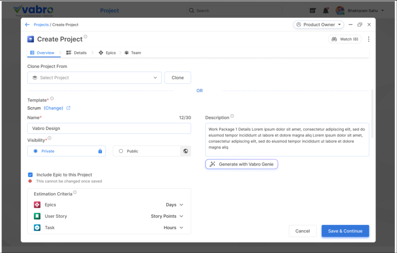

**Figura 8-6: Herramientas de proyecto Scrum – Vabro** 

En la figura 8-7 se muestra la interfaz de Scrum de Jira para la gestión de proyectos. Incluye herramientas para la planificación de sprints, la preparación del backlog y el seguimiento del progreso a través de flujos de trabajo ágiles. 

**172** © 2025 SCRUMstudy™. _Una guía para el cuerpo de conocimiento de Scrum (Guía SBOK®)_ 

8 – INICIO 

**8** 

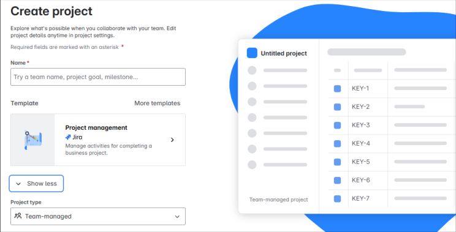

**Figura 8-7: Herramientas de proyecto Scrum - Jira** 

##### **4. Realizar evaluaciones piloto** 

Organice programas piloto para cada herramienta preseleccionada utilizando datos reales del proyecto y flujos de trabajo del equipo. Durante la fase piloto, mida lo siguiente: 

- Precisión y pertinencia de las recomendaciones de IA. 

- Mejora de la productividad del equipo y eficiencia en la planificación. 

- Adopción y satisfacción del usuario. 

- Rendimiento técnico y fiabilidad. 

- Los comentarios deben recopilarse de todos los roles clave de Scrum: propietarios de productos, Scrum Masters y miembros del equipo de desarrollo. 

##### **5. Analice el retorno de la inversión y el costo total de propiedad** 

Evalúe el costo total de propiedad (TCO), incluidas las tarifas de licencia, la capacitación, el soporte y el tiempo de implementación. Calcule el retorno de la inversión (ROI) en función de las ganancias proyectadas en productividad, la reducción de los tiempos de ciclo y la mejora de la precisión de las entregas gracias a la toma de decisiones mejorada por la IA. 

##### **6. Selección final y planificación de la implementación** 

En función de los resultados de la evaluación, seleccione la herramienta que mejor cumpla con los objetivos de la organización. Desarrollar un plan de implementación por fases que incluya: 

- Sesiones de formación para equipos Scrum 

- Integración con sistemas existentes 

- Estrategias de gobernanza y gestión del cambio 

- Supervisión continua del rendimiento y bucles de retroalimentación 

©2025 SCRUMstudy™. _Una guía para el cuerpo de conocimiento de Scrum (Guía SBOK®)_ **173** 

8 – INICIO 

### **8.2 Identificar al Scrum Master y a los interesados del negocio** 

En este proceso se identifica al Scrum Master utilizando criterios específicos de selección que se enfocan en las habilidades interpersonales y en el conocimiento de Scrum para este importante rol. También se identifican a los interesados del negocio. 

La figura 8-8 muestra todas las entradas, las herramientas y las salidas para el proceso de _Identificar al Scrum Master y a los interesados del negocio._ 

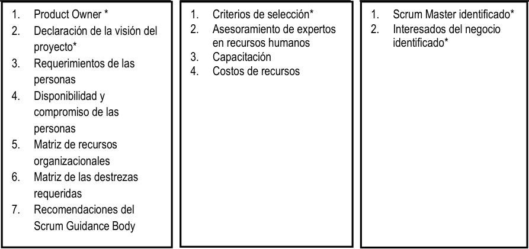

<!-- Start of picture text -->
1. Product Owner *  1. Criterios de selección*  1. Scrum Master identificado* 2. Declaración de la visión del  2. Asesoramiento de expertos  2. Interesados del negocio en recursos humanos  identificado* proyecto* 3. Capacitación 3. Requerimientos de las 4. Costos de recursos personas 4. Disponibilidad y compromiso de las personas 5. Matriz de recursos organizacionales 6. Matriz de las destrezas requeridas 7. Recomendaciones del Scrum Guidance Body <!-- End of picture text -->

**Figura 8-8: Identificar al Scrum Master y a los interesados del negocio: entradas, herramientas y salidas** 

_Nota: Los asteriscos (*) indican una entrada, herramientas o salida “obligatoria” para el proceso correspondiente._ 

**174** © 2025 SCRUMstudy™. _Una guía para el cuerpo de conocimiento de Scrum (Guía SBOK®)_ 

8 – INICIO 

**8** 

La figura 8-9 muestra el diagrama de flujo en este proceso. 

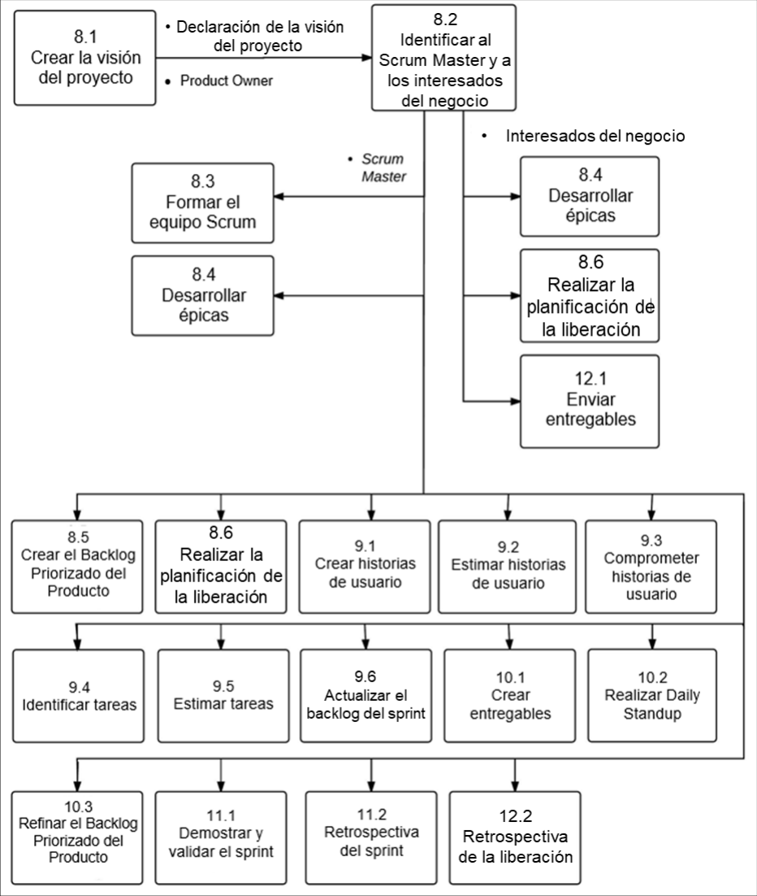

**Figura 8-9: Identificar al Scrum Master y a los interesados del negocio: Diagrama de flujo** 

©2025 SCRUMstudy™. _Una guía para el cuerpo de conocimiento de Scrum (Guía SBOK®)_ **175** 

8 – INICIO 

#### **8.2.1 Entradas** 

##### **8.2.1.1 Product Owner*** 

Descrito en la sección 8.1.3.1. 

##### **8.2.1.2 Declaración de la visión del proyecto*** 

Descrito en la sección 8.1.3.2. 

##### **8.2.1.3 Requerimientos de personas** 

Uno de los primeros pasos antes de conformar en su totalidad el Equipo Scrum es identificar las habilidades necesarias de un Scrum Master (véase el proceso 8.3). Es importante documentar los roles y responsabilidades del puesto del Scrum Master, así como los conocimientos y las habilidades necesarias a fin de asegurar el éxito del proyecto. Por lo general, el Product Owner o el Scrum Master colabora con el departamento de recursos humanos de la compañía para determinar y decidir los requerimientos de personal de un proyecto. 

También se identifican a los principales interesados del negocio y su rol en el proyecto. 

##### **8.2.1.4 Disponibilidad y compromiso de las personas** 

Antes de seleccionar al Scrum Master y a los interesados del negocio es necesario confirmar su disponibilidad. Solamente deben tomar en cuenta a los miembros del equipo que estarán disponibles y que puedan comprometerse plenamente con el proyecto. La disponibilidad y el compromiso de las personas se representa comúnmente en forma de un calendario que muestre cuándo estarán disponibles los recursos humanos para trabajar durante todo el proyecto. El compromiso se puede lograr una vez que se confirma la disponibilidad del Scrum Master deseado (y los interesados del negocio). El departamento de recursos humanos puede ayudarle al Product Owner a seleccionar a los candidatos apropiados. 

##### **8.2.1.5 Matriz de recursos organizacionales** 

La matriz de recursos organizacionales es una representación jerárquica de una combinación de una estructura de organización funcional y una estructura organizativa proyectada. En los proyectos, las organizaciones matriciales reúnen a integrantes de varios equipos de distintas áreas tales como informática, finanzas, publicidad, ventas, manufactura y otros departamentos a fin de crear equipos multidisciplinarios. Los miembros del equipo en una organización matriz cumplen con dos objetivos: funcionales y de proyecto. El Product Owner dirige las actividades de los integrantes del equipo en los proyectos, mientras que los directores funcionales realizan actividades de gestión relacionadas con sus departamentos, como las evaluaciones de desempeño y la aprobación para ausentarse del trabajo. 

**176** © 2025 SCRUMstudy™. _Una guía para el cuerpo de conocimiento de Scrum (Guía SBOK®)_ 

8 – INICIO 

**8** 

##### **8.2.1.6 Matriz de requerimientos de habilidades** 

La matriz de requerimientos de habilidades ( _Skills Requirement Matrix_ ), conocida también marco de competencia, se utiliza para evaluar la falta de habilidades y los requisitos de formación de los miembros del equipo. Una matriz de habilidades mapea las habilidades, las capacidades y el nivel de interés de los miembros del equipo en el uso de dichas habilidades y capacidades en un proyecto. Al utilizar esta matriz, la organización puede evaluar la ausencia de conocimientos de los miembros del equipo e identificar a los empleados que necesitan más formación en una área o competencia particular. 

##### **8.2.1.7 Recomendaciones del Scrum Guidance Body** 

Descrito en la sección 8.1.1.7. 

#### **8.2.2 Herramientas** 

##### **8.2.2.1 Criterios de selección*** 

La selección adecuada de Scrum Master y la identificación de los interesados del negocio relevantes es fundamental para el éxito de cualquier proyecto. En algunos proyectos puede haber condiciones previas que estipulen a determinados miembros del equipo y sus roles. Cuando hay flexibilidad en la selección del Scrum Master se deben considerar los siguientes criterios de selección: 

1. **Habilidades para resolver problemas:** Es uno de los principales criterios a considerar al seleccionar al Scrum Master. Debe tener las habilidades y la experiencia necesarias para ayudar a eliminar cualquier impedimento que enfrente el Equipo Scrum. 

2. **Disponibilidad:** El Scrum Master debe estar disponible para programar, supervisar y organizar varias reuniones, incluyendo la reunión de planificación de la liberación, el Daily Standup y otras reuniones relacionadas al sprint. 

3. **Compromiso:** El Scrum Master debe estar muy comprometido a fin de asegurar que el Equipo Scrum cuente con un ambiente laboral propicio para garantizar la entrega exitosa de proyectos Scrum. 

4. **Estilo de liderazgo de apoyo:** Para más detalles, consulte la sección 3.10.4.1. 

Al identificar a los interesados del negocio es importante recordar que se trata de todos los clientes, los usuarios y los patrocinadores, quienes a menudo interactúan con el Product Owner, el Scrum Master y el Equipo Scrum para ofrecer información y facilitar la creación de los productos del proyecto. Los interesados del negocio influyen en el proyecto a lo largo de su ciclo de vida. 

##### **8.2.2.2 Asesoramiento de expertos en recursos humanos** 

El asesoramiento de expertos en recursos humanos puede ser útil para identificar al Scrum Master y a los interesados del negocio. El departamento de recursos humanos posee un conocimiento específico sobre los empleados de una organización y de las diversas técnicas que pueden ayudar a identificar a un Scrum Master y a los interesados del negocio. 

©2025 SCRUMstudy™. _Una guía para el cuerpo de conocimiento de Scrum (Guía SBOK®)_ **177** 

8 – INICIO 

##### **8.2.2.3 Capacitación** 

Scrum es un marco de trabajo radicalmente distinto a los métodos tradicionales de gestión de proyectos. Los miembros del equipo no siempre cuentan con los conocimientos o habilidades necesarias para trabajar en el ambiente de Scrum. El Product Owner debe evaluar las necesidades de capacitación de los miembros potenciales del equipo y facilitar la capacitación para eliminar brechas de conocimiento del equipo. El Product Owner generalmente es el responsable de la evaluación y la selección de los miembros del equipo, pero a menudo lo hace en consulta con el Scrum Master, quien puede tener un conocimiento adicional de los recursos tras haber trabajado con ellos en otros proyectos. 

El Equipo Scrum debe recibir una capacitación adecuada antes de iniciar el trabajo y a medida que trabajan en su proyecto. Los miembros del Equipo Scrum también deben estar dispuestos a aprender de los demás y de quienes tienen más experiencia en el equipo. 

##### **8.2.2.4 Costo de los recursos** 

Una de las principales consideraciones en la selección de las personas tiene que ver con las ventajas y desventajas relacionadas con el nivel de experiencia en comparación al salario. Hay otros factores relacionados a las personas que influyen en el costo que también se deben considerar. Idealmente, el Scrum Master, los miembros del equipo y los interesados del negocio deben estar coubicados para que puedan comunicarse con frecuencia y facilidad. Si la coubicación no es posible y hay equipos dispersos, se deberán destinar recursos adicionales para facilitar la comunicación, entender las diferencias culturales, sincronizar el trabajo y fomentar el intercambio de conocimientos. 

#### **8.2.3 Salidas** 

##### **8.2.3.1 Scrum Master identificado*** 

El Scrum Master es un facilitador y un líder de apoyo que se asegura de que el Equipo Scrum cuente con un ambiente propicio para terminar con éxito el proyecto. El Scrum Master guía, facilita y les enseña prácticas de Scrum a todos los involucrados en el proyecto; elimina los impedimentos que enfrenta el equipo y se asegura de que se estén siguiendo los procesos de Scrum. Es Product Owner tiene la responsabilidad de identificar al Scrum Master en un proyecto Scrum. El rol de Scrum Master se describe con más detalle en la sección 3.5. 

##### **8.2.3.2 Interesados del negocio identificados*** 

“Interesados del negocio” que es un término colectivo que incluye a clientes, usuarios y patrocinadores que con frecuencia interactúan con el equipo principal de Scrum e influyen en el proyecto durante todo el proceso de desarrollo de productos. Los interesados del negocio son quienes reciben los beneficios colectivos que se generan en el proyecto. El rol de los interesados del negocio se describe en la sección 3.3.2. 

**178** © 2025 SCRUMstudy™. _Una guía para el cuerpo de conocimiento de Scrum (Guía SBOK®)_ 

8 – INICIO 

**8** 

### **8.3 Formar el Equipo Scrum** 

En este proceso se seleccionan a los miembros del Equipo Scrum con base en las habilidades necesarias para desarrollar los entregables del proyecto, así como en las consideraciones de disponibilidad, costos y habilidades interpersonales importantes para los miembros del equipo. Normalmente, el Product Owner es el responsable principal de la selección de los miembros del equipo, pero a menudo lo hace en colaboración con el Scrum Master. 

La figura 8-10 muestra todas las entradas, las herramientas y las salidas para el proceso de _Formar el Equipo Scrum_ . 

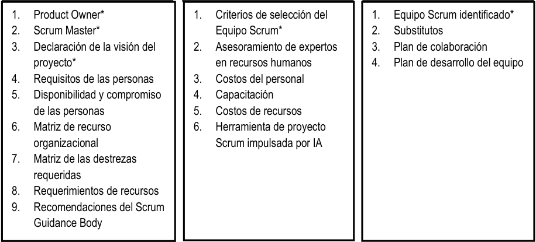

<!-- Start of picture text -->
1. Product Owner*  1. Criterios de selección del  1. Equipo Scrum identificado* 2. Scrum Master*  Equipo Scrum*  2. Substitutos 3. Declaración de la visión del  2. Asesoramiento de expertos  3. Plan de colaboración proyecto*  en recursos humanos  4. Plan de desarrollo del equipo 4. Requisitos de las personas  3. Costos del personal 5. Disponibilidad y compromiso  4. Capacitación de las personas  5. Costos de recursos 6. Matriz de recurso  6. Herramienta de proyecto organizacional  Scrum impulsada por IA 7. Matriz de las destrezas requeridas 8. Requerimientos de recursos 9. Recomendaciones del Scrum Guidance Body <!-- End of picture text -->

**Figura 8-10: Formar el Equipo Scrum: entradas, herramientas y salidas** 

_Nota: Los asteriscos (*) indican una entrada, herramientas o salida “obligatoria” para el proceso correspondiente._ 

©2025 SCRUMstudy™. _Una guía para el cuerpo de conocimiento de Scrum (Guía SBOK®)_ **179** 

8 – INICIO 

La figura 8-11 muestra el diagrama de flujo de datos de este proceso. 

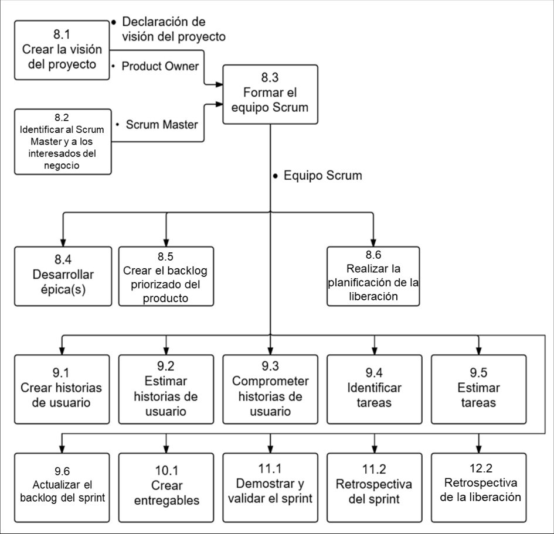

**Figura 8-11: Formar el Equipo Scrum: Diagrama de flujo** 

#### **8.3.1 Entradas** 

##### **8.3.1.1 Product Owner*** 

Descrito en la sección 8.1.3.1. 

##### **8.3.1.2 Scrum Master*** 

Descrito en la sección 8.2.3.1. 

**180** © 2025 SCRUMstudy™. _Una guía para el cuerpo de conocimiento de Scrum (Guía SBOK®)_ 

8 – INICIO 

**8** 

##### **8.3.1.3 Declaración de la visión del proyecto*** 

Descrito en la sección 8.1.3.2. 

##### **8.3.1.4 Requerimientos de las personas** 

Es importante identificar y documentar los roles y responsabilidades de los miembros del Equipo Scrum, así como los conocimientos y las habilidades necesarias a fin de asegurar el éxito del proyecto. Por lo general, el Product Owner colabora con el departamento de recursos humanos u otras personas relevantes en la compañía para determinar y decidir los roles y responsabilidades de los integrantes del Equipo Scrum. 

##### **8.3.1.5 Disponibilidad y compromiso de las personas** 

Antes de seleccionar a los integrantes del Equipo Scrum, es necesario confirmar su disponibilidad y compromiso. La disponibilidad generalmente se representa comúnmente en forma de un calendario que muestre cuándo estarán disponibles los recursos humanos para trabajar durante todo el proyecto. El compromiso se puede lograr una vez que se confirma la disponibilidad de los miembros deseados. Solamente se deben seleccionar a personas que estén disponibles y se puedan comprometer completamente con el proyecto. El departamento de recursos humanos puede ayudarle al Product Owner a seleccionar a los candidatos apropiados. 

Para eficientes, lo ideal es tener un Equipo Scrum de seis a diez integrantes. No se recomienda cambiar a los miembros del equipo en los equipos principales de Scrum. 

##### **8.3.1.6 Matriz de recursos organizacionales** 

Descrito en la sección 8.2.1.5. 

##### **8.3.1.7 Matriz de requerimientos de habilidades** 

Descrito en la sección 8.2.1.6. 

##### **8.3.1.8 Requisitos de recursos** 

Estos requisitos incluyen todos los recursos (no humanos) necesarios para que el Equipo Scrum trabaje eficazmente. Algunos ejemplos de estos recursos son la infraestructura para oficinas, espacio para reuniones, equipo de trabajo y las herramientas apropiadas y necesarias para aplicar bien el marco de trabajo de Scrum (por ejemplo: Scrumboard, Burndown Chart, fichas, tarjetas de estimación). En el caso de los equipos virtuales deben de ponerse a consideración recursos adicionales, tales como herramientas de colaboración, videoconferencia, repositorios de documentos compartidos, servicios de traducción, etc. 

©2025 SCRUMstudy™. _Una guía para el cuerpo de conocimiento de Scrum (Guía SBOK®)_ **181** 

8 – INICIO 

##### **8.3.1.9 Recomendaciones del Scrum Guidance Body** 

Descrito en la sección 8.1.1.7. 

#### **8.3.2 Herramientas** 

##### **8.3.2.1 Criterios de selección del Equipo Scrum*** 

El Equipo Scrum es la base de cualquier proyecto de Scrum y contar con los miembros adecuados es vital para la entrega exitosa de los proyectos Scrum. Los miembros del Equipo Scrum son generalistas o especialistas, ya que cuentan con conocimiento en diversas áreas y son expertos en al menos una. Más allá de la experiencia en la materia, son las habilidades interpersonales de cada miembro lo que determinará el éxito de los equipos autoorganizados. Los miembros del Equipo Scrum son independientes, automotivados, se enfocan en el cliente y tienen un alto sentido de responsabilidad y colaboración. El equipo debe ser capaz de fomentar un ambiente de reflexión independiente y de toma de decisiones con el fin de extraer los mayores beneficios de la estructura. 

##### **8.3.2.2 Asesoramiento de expertos en recursos humanos** 

El asesoramiento de expertos de gerentes de recursos humanos puede ser valioso al formar un Equipo Scrum. Este departamento posee un conocimiento especializado sobre los empleados de una organización y de las numerosas técnicas que pueden ayudar a los Product Owners, Scrum Masters y a los patrocinadores a identificar a los mejores miembros del equipo. 

##### **8.3.2.3 Costos del personal** 

Todos los costos asociados a los requisitos del personal deben evaluarse, analizarse, aprobarse y presupuestarse. 

##### **8.3.2.4 Capacitación** 

Es probable que los integrantes del Equipo Scrum no cuenten con las habilidades o conocimientos necesarios para llevar a cabo tareas especializadas. El Product Owner o el Scrum Master deben evaluar las necesidades de capacitación de los miembros potenciales del equipo y proporcionarles capacitación cuando se determine que faltan habilidades o conocimiento. Para que la implementación de Scrum sea realmente eficaz, debe haber un alto nivel de conocimiento dentro de la organización sobre los principios y valores de Scrum. Este conocimiento ayudará a la ejecución exitosa de Scrum. El Equipo Scrum debe estar capacitado en las prácticas de Scrum y el Scrum Master debe desempeñar el rol de capacitador de este tema para el equipo. Dado a que la planificación de los sprints es un factor muy importante para el éxito, la capacitación ayudará a los miembros del equipo a entender cómo discutir e identificar metas alcanzables en un sprint. El Scrum Master tiene que aprovechar lo mejor del Equipo Scrum motivándolo y facilitando el proceso de desarrollo. Con la capacitación correcta, el Scrum Master puede ayudar al equipo a articular los problemas y desafíos que pueda enfrentar. 

**182** © 2025 SCRUMstudy™. _Una guía para el cuerpo de conocimiento de Scrum (Guía SBOK®)_ 

8 – INICIO 

**8** 

Normalmente, cualquier problema o conflicto en el equipo lo resuelve el mismo equipo con la enseñanza y la ayuda del Scrum Master, según sea necesario. El Scrum Master debe atender problemas como la baja moral o la falta de coordinación dentro del equipo. Es responsable de eliminar los impedimentos del equipo. Cuando sea necesario, el Scrum Master puede presentarle estos problemas externos e impedimentos a la gerencia para eliminarlos o resolverlos. 

Los costos de formación y capacitación se abordan en el proceso _Identificar al Scrum Master y los interesados del negocio_ en la sección 8.2.2.3. 

##### **8.3.2.5 Costos de los recursos** 

Los costos asociados a los requisitos no relacionados con las personas deben ser evaluados, analizados, autorizados y presupuestados. Un recurso, en el ambiente del proyecto, es todo aquello que se usa para realizar una tarea o actividad, incluyendo, pero sin limitarse a, equipos, materiales, servicios externos y el espacio físico. 

###### **8.3.2.6 Herramienta de proyecto Scrum impulsada por IA** 

Descrito en la sección 2.4.4. 

La figura 8-12 muestra la interfaz Vabro utilizada para crear equipos de Scrum. Cuenta con roles, permisos y herramientas de colaboración dentro de un entorno de proyecto Scrum. 

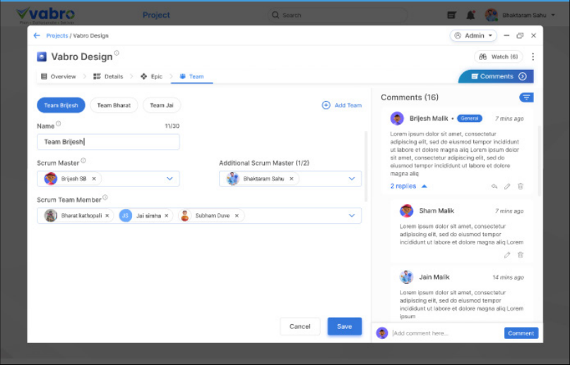

**Figura 8-12: Creación de un equipo (Fuente: Vabro)** 

La figura 8-13 muestra la pantalla de configuración del equipo en Jira. Permite la configuración de los miembros del equipo, la asignación de permisos y la integración en los flujos de trabajo de Scrum en curso. 

©2025 SCRUMstudy™. _Una guía para el cuerpo de conocimiento de Scrum (Guía SBOK®)_ **183** 

8 – INICIO 

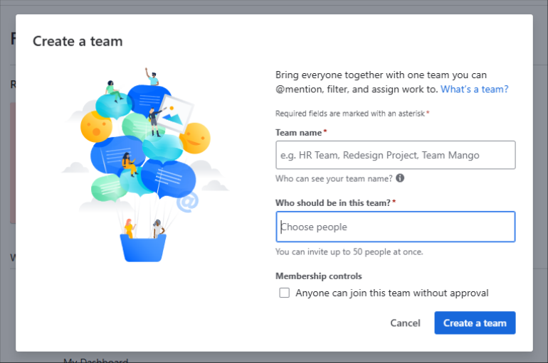

**Figura 8-13: Configuración del equipo (Fuente: Jira)** 

#### **8.3.3 Salidas** 

##### **8.3.3.1 Equipo Scrum identificado*** 

El Equipo Scrum, conocido también como equipo de desarrollo, es un grupo o equipo de personas responsables de entender los requerimientos especificados por el Product Owner, la estimación de historias de usuario y la creación definitiva de los entregables del proyecto. Los equipos Scrum están integrados por personas multidisciplinarias que llevan a cabo todo el trabajo necesario para crear entregables potencialmente enviables, incluyendo el trabajo relacionado a cumplir con todos los parámetros de garantía de calidad y control de calidad de cada entregable. Los equipos Scrum son multidisciplinarios y autoorganizados. El equipo decide la cantidad de trabajo al que se comprometerá en un sprint y determina la mejor manera de realizar el trabajo. 

La identificación del Equipo Scrum es responsabilidad del Product Owner, por lo general en consulta con el Scrum Master. El rol del Equipo Scrum se describe con más detalle en la sección 3.6. 

##### **8.3.3.2 Substitutos** 

Al seleccionar a los equipos, otro aspecto importante es identificar substitutos con habilidades fundamentales, de preferencia al interior del mismo equipo. Aunque la disponibilidad y compromiso por los miembros del equipo se confirman por adelantado, pueden surgir problemas tales como una enfermedad, emergencia familiar o simplemente el hecho de que un miembro deje de ser parte de la organización. Los equipos Scrum trabajan en pequeños grupos de seis a diez personas. El contar personas de respaldo asegura que no haya una disminución importante en la productividad debido a la falta de un miembro del equipo. 

**184** © 2025 SCRUMstudy™. _Una guía para el cuerpo de conocimiento de Scrum (Guía SBOK®)_ 

8 – INICIO 

**8** 

##### **8.3.3.3 Plan de colaboración** 

<mark>La colaboración es un elemento muy importante en Scrum. La planificación de cómo interactúan y colaboran los tomadores de decisiones, los interesados del negocio y los miembros del equipo es de suma importancia. El plan de colaboración es una salida opcional que puede ser formal o informal. En ocasiones puede ser simplemente un acuerdo verbal entre los diversos</mark> interesados del negocio, <mark>ya en que Scrum se evita toda la documentación innecesaria. Sin embargo, para proyectos más grandes y complejos, especialmente aquellos con equipos en diferentes áreas geográficas, puede ser necesario poner en marcha un acuerdo más formal. El plan puede abordar la forma en la que los miembros de equipo principal de Scrum, los interesados del negocio y otras personas involucradas en el proyecto Scrum, se comunican y colaboran durante todo el proyecto y puede también definir las herramientas o técnicas específicas que se utilizarán para este fin. Por ejemplo, en el caso de equipos dispersos, tal vez sea necesario un acuerdo sobre cuándo y cómo se llevarán a cabo las reuniones, sobre qué tipo de herramientas de comunicación se utilizarán y quién debe participar en las diversas reuniones.</mark> 

##### **8.3.3.4 Plan de desarrollo del equipo** 

Debido a que el Equipo Scrum es multidisciplinario, cada integrante debe participar activamente en todos los aspectos del proyecto. El Scrum Master debe identificar los problemas con los miembros del equipo y hacer frente a estos a fin de mantener un equipo eficaz. 

Para lograr cohesión en el equipo, el Scrum Master debe asegurarse de que las relaciones entre los miembros del equipo sean positivas y que estén unificados en el cumplimiento de la totalidad del proyecto y de los objetivos de la organización, lo cual conduce a una mayor eficiencia y una mayor productividad. 

La sección 3.10 aborda las teorías populares de recursos humanos y su relevancia en Scrum. 

©2025 SCRUMstudy™. _Una guía para el cuerpo de conocimiento de Scrum (Guía SBOK®)_ **185** 

8 – INICIO 

### **8.4 Desarrollar épicas** 

En este proceso, la declaración de la visión del proyecto sirve como base para el desarrollo de épicas, las cuales definen los requerimientos de alto nivel del proyecto. El Product Owner puede utilizar reuniones de grupos de usuarios y otras herramientas para obtener los requerimientos de los interesados del negocio. 

La figura 8-14 muestra todas las entradas, herramientas y salidas para el proceso de _Desarrollar épicas_ . 

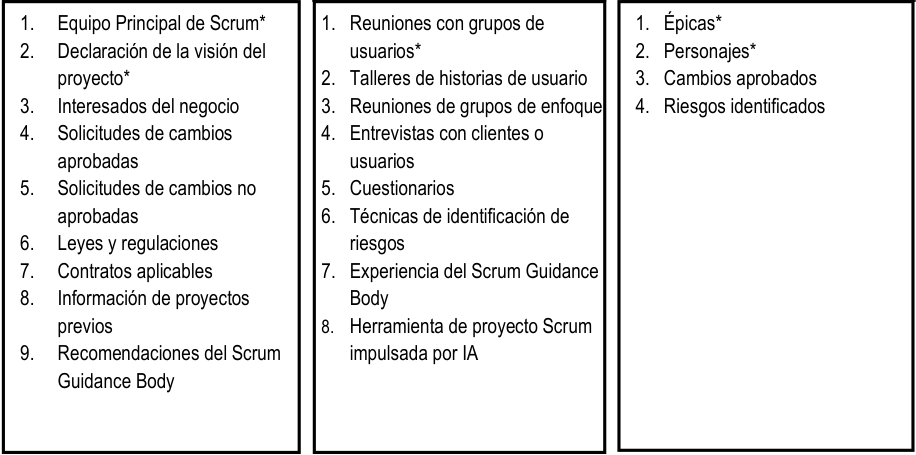

<!-- Start of picture text -->
1. Equipo Principal de Scrum*  1. Reuniones con grupos de  1. Épicas* 2. Declaración de la visión del  usuarios*  2. Personajes* proyecto*  2. Talleres de historias de usuario   3. Cambios aprobados 3. Interesados del negocio    3. Reuniones de grupos de enfoque  4. Riesgos identificados 4. Solicitudes de cambios  4. Entrevistas con clientes o aprobadas  usuarios 5. Solicitudes de cambios no  5. Cuestionarios aprobadas  6. Técnicas de identificación de 6. Leyes y regulaciones  riesgos 7. Contratos aplicables  7. Experiencia del Scrum Guidance 8. Información de proyectos  Body previos  8. Herramienta de proyecto Scrum 9. Recomendaciones del Scrum  impulsada por IA Guidance Body <!-- End of picture text -->

**Figura 8-14: Desarrollar épicas: entradas, herramientas y salidas** 

_Nota: Los asteriscos (*) indican una entrada, herramientas o salida “obligatoria” para el proceso correspondiente._ 

**186** © 2025 SCRUMstudy™. _Una guía para el cuerpo de conocimiento de Scrum (Guía SBOK®)_ 

8 – INICIO 

**8** 

La figura 8-15 muestra el diagrama de flujo de datos en este proceso. 

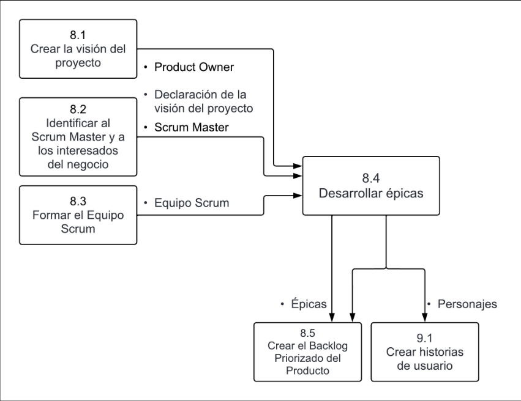

**Figura 8-155: Desarrollar épicas: Diagrama de flujo** 

#### **8.4.1 Entradas** 

##### **8.4.1.1 Equipo principal de Scrum *** 

El equipo principal de Scrum está conformado por el Equipo Scrum, el Scrum Master y el Product Owner, tal como se describe en la sección 3.3.1. 

##### **8.4.1.2 Declaración de la visión del proyecto*** 

Descrito en la sección 8.1.3.2. 

##### **8.4.1.3 Interesados del negocio** 

Descrito en la sección 8.2.3.2. 

©2025 SCRUMstudy™. _Una guía para el cuerpo de conocimiento de Scrum (Guía SBOK®)_ **187** 

8 – INICIO 

##### **8.4.1.4 Solicitudes de cambio aprobadas** 

Las solicitudes de cambio aprobadas que se originan en programa o el portafolio son entradas que se añadirán a la lista de cambios aprobados de proyecto para su ejecución en sprints futuros. Cada cambio puede requerir su propia épica o historia de usuario y pudiera convertirse en una entrada al proceso de _Desarrollar épicas_ . En este proceso, las solicitudes de cambio aprobadas también pudieran ser el resultado de otros procesos de Scrum. 

Las solicitudes de cambio y las solicitudes de cambio aprobadas se describen en las secciones 6.3.1, 6.4.2.1 y 6.6. 

##### **8.4.1.5 Solicitudes de cambio no aprobadas** 

Las peticiones para hacer cambios se presentan por lo general como solicitudes de cambio. Las solicitudes de cambio permanecen como no aprobadas hasta que se obtiene una aprobación formal. Las solicitudes de cambio no aprobadas en el proceso de _Desarrollar épicas_ pudiera provenir de los procesos de _Crear entregables_ , _Realizar el Daily Standup_ y otros procesos. 

Las solicitudes de cambio y las solicitudes de cambio no aprobadas se describen en las secciones 6.3.1 y 6.4.2.1. 

##### **8.4.1.6 Leyes y regulaciones** 

Dependiendo del proyecto, existen leyes y regulaciones impuestas por órganos públicos que afectan la planificación y la ejecución. Las leyes son ajenas a la organización y las impone una entidad gubernamental. Las regulaciones pueden ser internas o externas. Las regulaciones internas son aquellas que aplican dentro de la empresa, por lo general basadas en sus políticas. Dichas regulaciones pueden estar relacionadas a los sistemas de gestión de la calidad, a regulaciones financieras, reglamentos de personal, etc. Las regulaciones externas son aquellas relacionadas a los estándares, normas y requisitos establecidos por el gobierno. 

Las leyes y regulaciones se deben tomar en cuenta al momento de desarrollar épicas. Las épicas se basan en los requerimientos de negocio. Para cumplir con estos requerimientos, el equipo del proyecto tiene que cumplir con leyes y regulaciones internas y externas. A veces, algunas de las leyes y regulaciones que afectan a múltiples proyectos Scrum pueden incluirse como parte de las recomendaciones del Scrum Guidance Body, como se analiza en la sección 8.1.1.7. 

##### **8.4.1.7 Contratos aplicables** 

Si el proyecto se ejecuta total o parcialmente bajo contrato, dicho instrumento legal debe definir el alcance del trabajo y sus condiciones específicas. El tipo de contrato influye en el riesgo del proyecto. 

Algunos de los contratos más comunes que se utilizan en proyectos de Scrum son los siguientes: 

- **Contrato de entrega incremental:** Incluye puntos de inspección en intervalos frecuentes. Ayuda a que el cliente o los interesados del negocio tomen decisiones periódicas sobre el desarrollo a lo largo de un 

**188** © 2025 SCRUMstudy™. _Una guía para el cuerpo de conocimiento de Scrum (Guía SBOK®)_ 

8 – INICIO 

**8** 

proyecto en cada punto de inspección. El cliente puede aceptar el desarrollo del producto, optar por detener su desarrollo o solicitar modificaciones al mismo. 

- **Contrato** **_Joint Venture_ :** Se utiliza generalmente cuando dos o más partes se asocian para realizar el trabajo de un proyecto. Ambas partes involucradas en el proyecto lograrán algún retorno de la inversión, ya que ambas partes compartirán los ingresos o beneficios generados. 

- **Contrato de desarrollo en fases:** Facilita la disponibilidad de fondos cada mes o cada trimestre después de concluir satisfactoriamente una liberación. Incentiva tanto al cliente como al proveedor y garantiza que el riesgo monetario del cliente esté limitado a un periodo específico, ya que las liberaciones fracasadas no reciben financiamiento. 

- **Contrato de incentivos y sanciones:** Se basa en el acuerdo de que el proveedor será recompensado con un incentivo económico si los productos del proyecto se entregan a tiempo, pero incurrirá en sanciones económicas si la entrega se realiza tarde. 

Otros tipos de contratos más populares incluyen el pago por las características del contrato, el tiempo y los materiales del contrato; contrato de precio fijo y contrato fijo, y el contrato de beneficio fijo. Las épicas deben desarrollarse tomando en cuenta los términos y condiciones del tipo de contrato que se utilice. 

##### **8.4.1.8 Información de proyectos previos** 

La información y los conocimientos adquiridos en proyectos anteriores similares dentro de la organización son entradas valiosas para el desarrollo de épicas y la evaluación de riesgos. La información de proyectos previos podría incluir notas del director del proyecto, registros del proyecto y comentarios hechos por los <mark>interesados del negocio.</mark> Algunos detalles y las mejores prácticas relacionadas con información de proyectos anteriores pueden estar disponibles a través de las recomendaciones Scrum Guidance Body. 

##### **8.4.1.9 Recomendaciones del Scrum Guidance Body** 

Las recomendaciones del Scrum Guidance Body pueden incluir información sobre reglas, regulaciones, estándares y mejores prácticas para el desarrollo de épicas. Para conocer más detalles sobre las recomendaciones del Scrum Guidance Body, véase la sección 8.1.1.7. 

#### **8.4.2 Herramientas** 

##### **8.4.2.1 Reuniones con grupos de usuarios*** 

Las reuniones con grupos de usuarios le brindan al Product Owner información de primera mano sobre las expectativas del usuario desde el punto de vista de interesados del negocio relevantes (principalmente usuarios o clientes). En estas reuniones también pueden estar presentes los miembros relevantes del equipo principal de Scrum. Las reuniones con grupos de usuarios ayudan a formular los criterios de aceptación del producto y aportan información valiosa para el desarrollo de épicas. Estas reuniones también promueven la aceptación del proyecto y generan un entendimiento común entre el Product Owner, el equipo principal de Scrum y los interesados del proyecto relevantes. Las reuniones con grupos de usuarios son de vital importancia para evitar la costosa reelaboración que pudiera resultar de la falta de claridad sobre las expectativas y los requerimientos. 

©2025 SCRUMstudy™. _Una guía para el cuerpo de conocimiento de Scrum (Guía SBOK®)_ **189** 

8 – INICIO 

##### **8.4.2.2 Talleres de historias de usuario** 

Los talleres de historias de usuarios se llevan a cabo como parte del proceso de _Desarrollar épicas_ . El Scrum Master facilita estas sesiones, donde el equipo principal Scrum interviene y, en ocasiones, se recomienda incluir a otros <mark>interesados del negocio</mark> . Estos talleres ayudan al Product Owner a priorizar los requerimientos y permiten que el equipo principal de Scrum tenga una perspectiva compartida de los criterios de aceptación. Estos aseguran de que las épicas e historias de usuario describan la funcionalidad desde el punto de vista de los usuarios, que sean fáciles de entender y que se puedan calcular de forma segura. Dichos talleres son útiles para entender las expectativas del usuario sobre los entregables y son excelentes para la formación de equipos. También facilitan la preparación para la planificación del próximo sprint. Un taller de historias de usuario es una buena plataforma para discutir y aclarar todos los elementos de un producto y generalmente profundizan en detalles más pequeños para garantizar la claridad. 

##### **8.4.2.3 Reuniones de grupos de enfoque** 

En las reuniones de grupos de enfoque ( _focus groups_ ) las personas se reúnen en una sesión guiada para ofrecer sus opiniones, percepciones o valoraciones sobre un producto, servicio o resultado deseado. Los miembros del grupo de enfoque tienen la libertad de hacerse preguntas de obtener aclaraciones sobre temas o conceptos específicos. Mediante el cuestionamiento, la crítica constructiva y la retroalimentación, los grupos de enfoque conducen a un producto de mejor calidad y con ello contribuyen a la satisfacción de las expectativas de los usuarios. En estas reuniones, los miembros del grupo de enfoque a veces llegan a un consenso en ciertas áreas, mientras que en otras áreas las opiniones pueden ser diferentes. Cuando los miembros del grupo tienen diferentes opiniones o puntos de vista, se hace el mayor esfuerzo para resolver las diferencias con el fin de llegar a un consenso. 

Las sesiones de grupos de enfoque pueden ayudar a los equipos a crear ideas innovadoras, resolver problemas y dar sugerencias para mejorar. Estas reuniones generan ideas y retroalimentación de los usuarios potenciales y desarrolladores de productos. Estas reuniones se realizan normalmente para la planificación, evaluación o mejora de un producto o servicio. El conocimiento obtenido a partir de estas reuniones también puede ayudar con el desarrollo de épicas e historias de usuario. En ocasiones, se hacen grupos de enfoque para resolver problemas que puedan surgir durante el desarrollo de las épicas. 

##### **8.4.2.4 Entrevistas con clientes o usuarios** 

Es importante incorporar a los interesados del negocio, incluyendo al patrocinador, a usuarios y a clientes del producto a fin de obtener el contexto y la visión necesarios para desarrollar épicas. El tiempo de calidad que se invierta en entrevistar a los usuarios y clientes ayudará a entender mejor los requisitos en las épicas con la visión general del proyecto, ofreciendo así un mayor valor. 

Estas entrevistas ayudan a: 

- Identificar y entender las necesidades y expectativas de los interesados 

- Obtener opiniones y hechos 

- Comprender la perspectiva de los interesados del negocio sobre el producto final 

- Obtener retroalimentación sobre el producto iterado o parcialmente desarrollado 

- Obtener la aceptación y el compromiso de los clientes y usuarios finales 

**190** © 2025 SCRUMstudy™. _Una guía para el cuerpo de conocimiento de Scrum (Guía SBOK®)_ 

8 – INICIO 

**8** 

##### **8.4.2.5 Cuestionarios** 

Una forma económica de obtener una perspectiva estadística cuantitativa y cualitativa de un gran número de usuarios o clientes es el uso de encuestas o cuestionarios. Un cuestionario es un instrumento de investigación con el fin de obtener información sobre un asunto o tema específico. Los cuestionarios pueden ser autoadministrados o administrados por un entrevistador. 

Se debe tener mucho cuidado en el diseño de cuestionarios, la selección adecuada del público y en la determinación de un método apropiado de implementación de encuestas para evitar errores y prejuicios. Durante el desarrollo de épicas, el Product Owner o el Scrum Master podrían llevar a cabo una encuesta para recopilar la información pertinente de los interesados del negocio o el Equipo Scrum. 

##### **8.4.2.6 Técnicas de identificación de riesgos** 

Descrito en la sección 7.4.1.1 

##### **8.4.2.7 Experiencia del Scrum Guidance Body** 

Al crear las épicas, la experiencia del Scrum Guidance Body pudiera incluir las normas y regulaciones o los estándares y mejores prácticas para crear épicas. Es posible que exista también un equipo de expertos en la materia que pudiera ayudar al Product Owner a crear épicas. Este equipo podría incluir a analistas de negocios, arquitectos líderes, Senior Developers, expertos de Scrum o demás personas con experiencia. Por lo general, este grupo de expertos no es el mismo equipo que permanecerá y trabajará en un proyecto en particular, ya que tienden a pasar de un proyecto a otro durante la “fase de venta” o “fase cero” con los clientes o usuarios. Para conocer más información sobre el Scrum Guidance Body véase la sección 3.3.2. 

##### **8.4.2.8 Herramienta de proyecto Scrum impulsada por IA** 

Descrito en la sección 2.4.4 

La Figura 8-16 muestra la interfaz de Vabro para el desarrollo épico. Incluye funciones para crear, administrar y organizar epopeyas alineadas con los objetivos del proyecto Scrum. 

©2025 SCRUMstudy™. _Una guía para el cuerpo de conocimiento de Scrum (Guía SBOK®)_ **191** 

8 – INICIO 

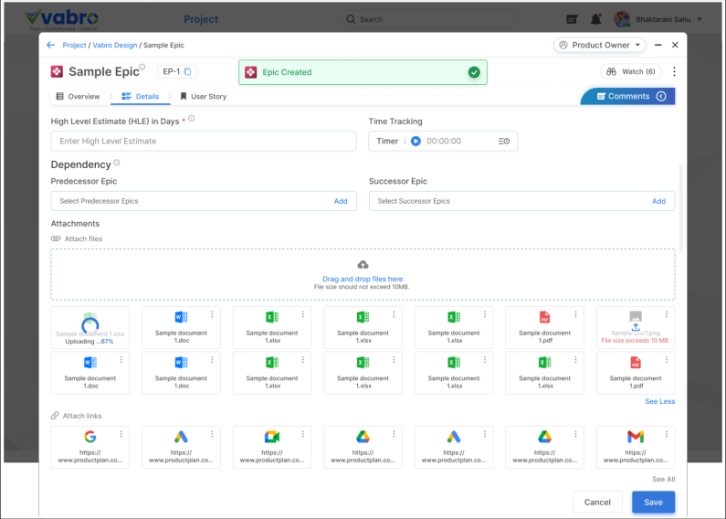

**Figura 8-16: Ejemplo de herramienta de proyecto Scrum – Vabro** 

En la figura 8-17 se muestra la herramienta Jira utilizada para administrar epopeyas. Admite la priorización del trabajo pendiente, la vinculación de historias de usuario y el seguimiento del progreso dentro de Scrum. 

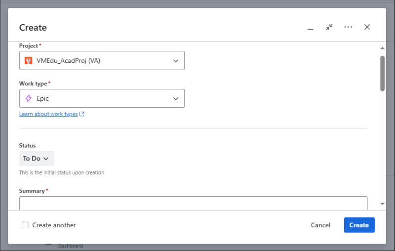

**Figura 8-17: Ejemplo de herramienta de proyecto Scrum – Jira** 

**192** © 2025 SCRUMstudy™. _Una guía para el cuerpo de conocimiento de Scrum (Guía SBOK®)_ 

8 – INICIO 

**8** 

#### **8.4.3 Salidas** 

##### **8.4.3.1 Épicas*** 

Las épicas se escriben en las etapas iniciales del proyecto, cuando la mayoría de las historias de usuario son funcionalidades de alto nivel o descripciones de productos que están ampliamente definidas. Las épicas son historias de usuario grandes sin refinar en el backlog priorizado del producto. Ayudan al Product Owner y a los interesados relevantes del proyecto en la planificación de las liberaciones, a priorizar los requerimientos de alto nivel y a tener una idea general del proyecto. 

A medida que el Product Owner entiende mejor los requisitos del usuario, estas épicas se desglosan en historias de usuario más pequeñas y granulares. De esta forma, las épicas se conforman de una o más historias de usuario. Estas historias más pequeñas son generalmente funcionalidades simples, cortas y fáciles de implementar, o bloques de tareas que deben completarse en un sprint. El Product Owner debe definir las historias de usuario que satisfagan la definición de listo y deben ser estimadas antes de que aparezcan en el backlog priorizado del producto para agregarse en un futuro sprint. 

##### **8.4.3.2 Personajes*** 

Son personajes ficticios muy detallados que representan a la mayoría de los usuarios y demás interesados del negocio que pudieran no utilizar directamente el producto final. Los personajes se crean para identificar las necesidades de los usuarios. La creación de personajes específicos puede ayudar al equipo a entender mejor a los usuarios y sus necesidades y metas. Basado en un personaje, el Product Owner puede priorizar de manera más efectiva las funciones para crear el backlog priorizado del producto. 

**Creación de personajes:** Se asigna un nombre ficticio y de preferencia una foto para el personaje (puede ser una fotografía de stock). El personaje incluye atributos muy específicos como edad, sexo, nivel académico, ambiente, intereses y metas. También se puede incluir una cita que ilustre las necesidades del personaje. A continuación, se muestra un ejemplo de un personaje para un sitio web de viajes. 

_Ejemplo:_ 

Vanessa tiene 39 años y es residente de San Francisco. Le apasionan los viajes y después de haber tenido una exitosa carrera como abogada, ha decidido disfrutar de dicha pasión. Le gusta tener opciones disponibles al seleccionar sus viajes por avión y servicios de alojamiento para poder elegir el mejor a un precio accesible. Se frustra con los sitios web lentos y desordenados. 

##### **8.4.3.3 Cambios aprobados** 

Las solicitudes de cambio no aprobadas pueden ser aprobadas por el Product Owner durante el proceso de _Desarrollar épicas_ , a veces con sugerencias que proporcionan los interesados del negocio relevantes. Tales cambios se clasifican como cambios aprobados y pueden ser priorizados e implementadas en los futuros sprints. Las solicitudes de cambio y las solicitudes de cambio aprobadas se abordan en las secciones 6.3.1 y 6.4.2.1. 

©2025 SCRUMstudy™. _Una guía para el cuerpo de conocimiento de Scrum (Guía SBOK®)_ **193** 

8 – INICIO 

##### **8.4.3.4 Riesgos identificados** 

Al crear épicas se pueden identificar nuevos riesgos, los cuales constituyen una salida importante de esta etapa. Estos riesgos contribuyen al desarrollo del backlog priorizado del producto (conocido también como backlog del producto ajustado al riesgo). La identificación de riesgos se describe en la sección 7.4.1. 

**194** © 2025 SCRUMstudy™. _Una guía para el cuerpo de conocimiento de Scrum (Guía SBOK®)_ 

8 – INICIO 

**8** 

### **8.5 Crear el backlog priorizado del producto** 

En este proceso, las épicas se refinan, se desarrollan, y lo más importante: se priorizan según su respectivo valor de negocio a fin de crear el backlog priorizado del producto del proyecto. También, con base en las recomendaciones del Scrum Guidance Body, el Product Owner y el Equipo Scrum establecen los criterios de terminado del proyecto. 

La figura 8-18 muestra todas las entradas, las herramientas y salidas para el proceso de _Crear el backlog priorizado del producto_ . 

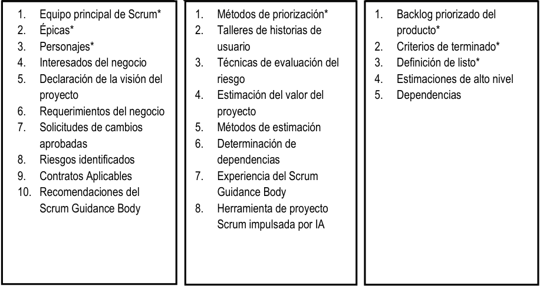

<!-- Start of picture text -->
1. Equipo principal de Scrum*  1. Métodos de priorización*  1. Backlog priorizado del 2. Épicas*  2. Talleres de historias de  producto* 3. Personajes*  usuario  2. Criterios de terminado* 4. Interesados del negocio  3. Técnicas de evaluación del  3. Definición de listo* 5. Declaración de la visión del  riesgo  4. Estimaciones de alto nivel proyecto   4. Estimación del valor del  5. Dependencias 6. Requerimientos del negocio   proyecto 7. Solicitudes de cambios  5. Métodos de estimación aprobadas   6. Determinación de 8. Riesgos identificados  dependencias 9. Contratos Aplicables  7. Experiencia del Scrum 10. Recomendaciones del  Guidance Body Scrum Guidance Body  8. Herramienta de proyecto Scrum impulsada por IA <!-- End of picture text -->

**Figura 8-18: Crear el backlog priorizado del producto: entradas, herramientas y salidas** 

_Nota: Los asteriscos (*) indican una entrada, herramientas o salida “obligatoria” para el proceso correspondiente._ 

©2025 SCRUMstudy™. _Una guía para el cuerpo de conocimiento de Scrum (Guía SBOK®)_ **195** 

8 – INICIO 

La figura 8-19 muestra el diagrama de flujo de este proceso. 

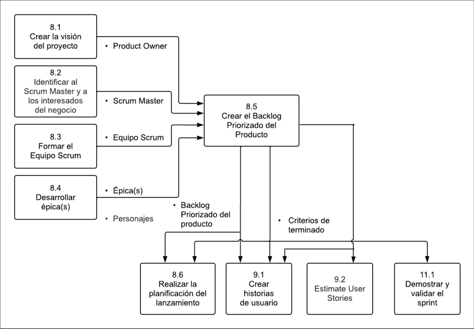

**Figura 8-19: Crear el backlog priorizado del producto: Diagrama de flujo de datos** 

#### **8.5.1 Entradas** 

##### **8.5.1.1 Equipo principal de Scrum*** 

Descrito en la sección 3.3.1. 

##### **8.5.1.2 Épicas*** 

Descrito en la sección 8.4.3.1. 

##### **8.5.1.3 Personajes*** 

Descrito en la sección 8.4.3.2. 

##### **8.5.1.4 Interesados del negocio** 

Descrito en la sección 8.2.3.2. 

**196** © 2025 SCRUMstudy™. _Una guía para el cuerpo de conocimiento de Scrum (Guía SBOK®)_ 

8 – INICIO 

**8** 

##### **8.5.1.5 Declaración de la visión del proyecto** 

Descrito en la sección 8.1.3.2. 

##### **8.5.1.6 Requerimientos del negocio** 

La suma de todos los conocimientos adquiridos mediante las diversas herramientas tales como las entrevistas a los clientes o usuarios o los cuestionarios, las sesiones JAD, el análisis de brecha, el análisis FODA y otras reuniones, ayudan a desarrollar una mejor perspectiva sobre los requerimientos y ayuda en la creación del backlog priorizado del producto. 

##### **8.5.1.7 Solicitudes de cambio aprobadas** 

Descrito en la sección 8.4.3.3. 

##### **8.5.1.8 Riesgos identificados** 

Descrito en la sección 8.4.3.4. 

##### **8.5.1.9 Contratos aplicables** 

Descrito en la sección 8.4.1.7. 

##### **8.5.1.10 Recomendaciones del Scrum Guidance Body** 

Al crear el backlog priorizado del producto, las recomendaciones del Scrum Guidance Body pueden incluir información sobre las normas, reglamentos, procedimientos y las mejores prácticas para el desarrollo del backlog. El Scrum Guidance Body también puede ofrecer recomendaciones para la definición de listo (los criterios que debe satisfacer una historia de usuario antes de ser puesta a consideración para ser estimada o incluida en un sprint) y la definición de terminado (las reglas aplicables a las historias de usuario en un determiado sprint). Para conocer más detalles sobre las recomedaciones del Scrum Guidance Body, véase la sección 8.1.1.7. 

#### **8.5.2 Herramientas** 

##### **8.5.2.1 Métodos de priorización*** 

A continuación, se presentan algunas de las técnicas que se utilizan para priorizar las historias de usuarios o requerimientos en el backlog priorizado del producto con base en el valor de negocio: 

©2025 SCRUMstudy™. _Una guía para el cuerpo de conocimiento de Scrum (Guía SBOK®)_ **197** 

8 – INICIO 

- **Esquema de priorización MoSCoW:** El esquema de priorización MoSCoW obtiene su nombre de la versión en inglés de las frases: “Debe tener” ( _Must have_ ), “Debería tener” ( _Should have_ ), “Podría tener” ( _Could have_ ) y “No tendrá” ( _Won’t have_ ). 

Las etiquetas están en orden de prioridad decreciente con historias de usuario con características de “debería tener”, siendo aquellas sin las que el producto no tendrá valor, e historias de usuarios con características de “gustaría que tuviera” siendo aquellas que, a pesar de que sería bueno tener, no se es necesario incluir. 

- **Comparación por pares:** <mark>La comparación por pares (</mark> _<mark>paired comparison</mark>_ <mark>) es una técnica donde se prepara una lista de todas las historias de usuario en el backlog priorizado del producto. Después, cada historia de usuario se tomará en forma individual con otras historias en la lista, una a la vez. Cada vez que se comparan dos historias de usuario, se decide cuál es más importante. Por medio de este proceso, se puede generar una lista priorizada de historias de usuario.</mark> 

- **<mark>El método de los 100 puntos:</mark>** <mark>El método de los 100 puntos (</mark> _100-Point Method_ ) <mark>fue desarrollado por Dean Leffingwell y Don Widrig (2003). Dicho método implica otorgar 100 puntos al cliente para votar por las características que consideren más importantes.</mark> El objetivo es dar más peso a las historias de usuarios de mayor prioridad en comparación con las otras historias de usuario. Cada miembro del grupo asigna puntos a las diversas historias de usuarios, dando más puntos a las que opinan son más importantes. Al finalizar el proceso de votación, la priorización se determina calculando el total de puntos asignados a cada historia de usuario. 

- **Análisis de Kano:** Descrito en la sección 4.5.2 

##### **8.5.2.2 Talleres de historias de usuarios** 

Descrito en la sección 8.4.2.2. 

##### **8.5.2.3 Técnicas de evaluación de riesgos** 

Descrito en la sección 7.4.2.1. 

##### **8.5.2.4 Estimación del valor del proyecto** 

Descrito en la sección 4.5.1 

##### **8.5.2.5 Métodos de estimación** 

Tal vez resulte útil formular estimaciones de tiempo de muy elevadas para las épicas, ya que estas estimaciones pueden ayudarle al Producto Owner a planificar apropiadamente las liberaciones, así como al proceso de priorización. Sin embargo, debido a que las épicas planificadas en esta etapa generalmente no están aún desglosadas en historias de usuario bien definidas y existe también la posibilidad de que algunas de las épicas desarrolladas al inicio no sean implementadas, el equipo no debe dedicar demasiado tiempo a la estimación de estas épicas. Esta herramienta es muy distinta al proceso de _Estimar historias de usuario_ (sección 9.2.2.1), donde el Equipo Scrum se involucra en la estimación de historias de usuario bien definidas. 

**198** © 2025 SCRUMstudy™. _Una guía para el cuerpo de conocimiento de Scrum (Guía SBOK®)_ 

8 – INICIO 

**8** 

Asimismo, el Product Owner, el Scrum Master y los interesados del negocio relevantes deben entender que las estimaciones de alto nivel proporcionadas en este proceso son solo para efectos de orientación y que pudiera haber una desviación considerable de las estimaciones del Equipo Scrum después de que las historias de usuario son debidamente definidas y estimadas. 

Algunas de las herramientas importantes son: 

- **Estimaciones preexistentes de las épicas:** Si anteriormente se desarrollaron épicas en el mismo proyecto o en proyectos relacionados, estas estimaciones previas pueden ser utilizadas para obtener estimaciones detalladas en este proceso. 

- **Opinión de expertos:** Los expertos que anteriormente han implementado funcionalidades de proyectos similares pudieran ofrecer estimaciones de alto nivel de las épicas. 

- **Estimaciones de 5 a 10 minutos:** Los miembros relevantes del equipo pueden recibir información general de los requerimientos de la épica y se les pide que hagan una estimación aproximada (expresada en horas, días o semanas) en 5 a 10 minutos. Este método de estimación debe ser una opción solo cuando se estima una pequeña cantidad de épicas, de lo contrario, el proceso resultaría muy tardado. 

- **Estimación por afinidad:** La estimación por afinidad, conocida también como tamaños de camisetas ( _T-shirt sizing_ ), es una técnica que se utiliza para estimar rápidamente un amplio número de épicas o historias de usuario. Esto se describe en la sección 9.2.2.1. 

##### **8.5.2.6 Determinación de dependencias** 

Documentar adecuadamente las dependencias ayuda a los equipos Scrum a determinar el orden relativo en el cual deben ejecutarse las épicas (e historias de usuario) para crear los entregables del sprint. Las dependencias destacan la relación e interacción entre épicas (e historias de usuario) dentro del Equipo Scrum en un determinado sprint y con otros equipos que trabajan en el proyecto. A medida que se elabora el backlog priorizado del producto, el Product Owner identifica cualquier dependencia y relación entre las épicas (y entre las historias de usuario), incluyendo cualquier dependencia técnica y dependencias relacionadas a la disponibilidad de personal, ya que estas dependencias tendrán un efecto en el orden de prioridad del trabajo a realizar en el proyecto. Las dependencias pueden ser obligatorias y discrecionales; internas y externas, o alguna combinación de estas. Por ejemplo, una dependencia puede ser obligatoria y externa. 

- **Dependencias obligatorias:** Dictan la secuencia de trabajo que se debe realizar en el proyecto, por lo tanto, es importante tomarlas en cuenta al crear el primer backlog priorizado del producto. Estas dependencias pueden ser obligatorias, ya que la naturaleza del trabajo (como la limitación física en la secuencia del trabajo) tal vez se deba a obligaciones contractuales o a requerimientos legales. A las dependencias obligatorias también se les llama comúnmente como “lógica dura”. 

- **Dependencias discrecionales:** Se colocan en el flujo de trabajo con base en experiencias pasadas o en las mejores prácticas de un área o campo específico. Por ejemplo, el equipo puede optar por terminar una épica (o historia de usuario) antes de otra, ya que este flujo en el trabajo funcionó bien en proyectos anteriores. 

- **Dependencias externas:** Están relacionadas a las actividades o factores ajenos al alcance del trabajo desarrollado por el Equipo Scrum, pero son necesarias para concluir una tarea en el proyecto o crear un entregable del proyecto. 

©2025 SCRUMstudy™. _Una guía para el cuerpo de conocimiento de Scrum (Guía SBOK®)_ **199** 

8 – INICIO 

Las dependencias externas generalmente están fuera del alcance del control del Equipo Scrum, por lo que pueden generar un mayor riesgo en el proyecto. 

- **Dependencias internas:** Son los factores dentro del proyecto que afectan la secuencia del trabajo a desarrollar. Estos factores generalmente están bajo el control del Equipo Scrum. 

Hay diferentes formas de identificar, definir y presentar las tareas del proyecto y sus dependencias. 

##### **8.5.2.7 Experiencia del Scrum Guidance Body** 

Durante la creación del backlog priorizado del producto, la experiencia del Scrum Guidance Body podría estar relacionada a reglamentos y regulaciones documentadas o con normas y mejores prácticas para la creación de épicas. También puede haber un equipo de expertos en la materia que puede ayudar al Product Owner en este proceso. Este equipo podría incluir a analistas de negocios, arquitectos líderes, Senior Developers, expertos de Scrum o demás personas con experiencia. Por lo general, este grupo de expertos no es el mismo equipo que permanecerá y trabajará en un proyecto en particular, ya que tiende a pasar de un proyecto a otro durante la “fase de venta” o “fase cero” con los clientes o usuarios. Para conocer más detalles sobre el Scrum Guidance Body, véase la sección 8.4.2.7. 

###### **8.5.2.8 Herramienta de proyecto Scrum impulsada por IA** 

Descrito en la sección 2.4.4. 

La Figura 8-20 muestra la interfaz de la herramienta Vabro utilizada para crear un backlog de producto priorizado. Admite la jerarquía de tareas, la limpieza del trabajo pendiente y el seguimiento de estimaciones. 

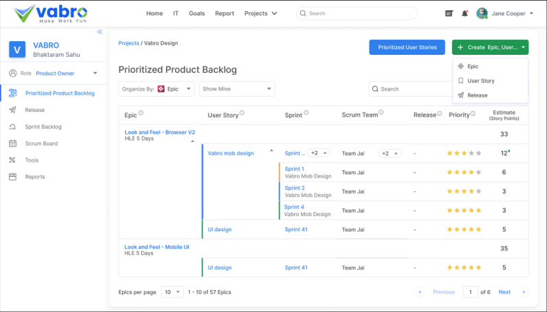

**Figura 8-2019: Creación de un backlog de productos priorizados (fuente: Vabro)** 

**200** © 2025 SCRUMstudy™. _Una guía para el cuerpo de conocimiento de Scrum (Guía SBOK®)_ 

8 – INICIO 

**8** 

En la figura 8-21 se muestra cómo Jira gestiona el backlog de productos priorizados. Permite a los usuarios organizar, priorizar y visualizar historias de usuario y epopeyas para el desarrollo. 

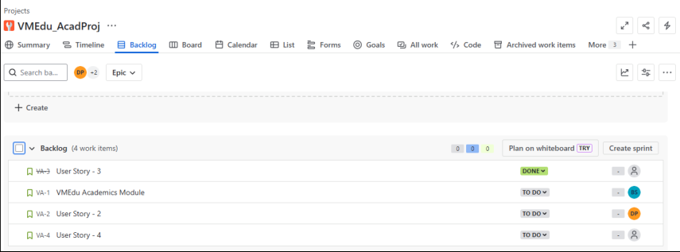

**Figura 8-201: Uso de la cartera de productos priorizada (fuente: Jira)** 

#### **8.5.3 Salidas** 

##### **8.5.3.1 Backlog priorizado del producto*** 

El Product Owner desarrolla un backlog priorizado del producto que contiene una lista priorizada de los requerimientos del negocio y de los proyectos en forma de épicas (historias de usuario de alto nivel). El backlog priorizado del producto se basa en tres factores principales: valor, riesgo o incertidumbre y dependencias. También se le conoce como backlog priorizado del producto ajustado al riesgo, ya que incluye riesgos identificados y evaluados relacionados al proyecto. También incluye cambios aprobados que pueden ser priorizados adecuadamente en el backlog priorizado del producto (como se describe en la sección 6.3.1). 

A continuación, se describen los factores importantes que se toman en cuenta al priorizar los elementos del backlog priorizado del producto. 

- **Valor:** El Product Owner tiene la responsabilidad de asegurar que se entreguen primero los productos que ofrecen el mayor nivel de valor al negocio. Incluso un producto de gran valor no puede ser parte de la primera liberación si hay otros de mayor valor que son suficientes para una primera liberación. 

- **Riesgo e incertidumbre:** Entre mayor incertidumbre exista, más riesgoso es el proyecto. Por lo tanto, es importante que se les dé mayor prioridad los productos de mayor riesgo en el backlog priorizado del producto. Los productos que llevan un mayor nivel de riesgo también requerirán acciones de mitigación de riesgos. Cuando estas acciones se priorizan en comparación al backlog, el resultado es un backlog priorizado del producto ajustado al riesgo. Tratar con riesgos al principio del proyecto no garantiza que el proyecto tenga éxito, pero sí mejorará la capacidad del equipo para hacer frente a los riesgos. Esto se describe en la sección 7.4.3. 

- **Dependencias:** La mayoría de los proyectos cuentan con dependencias inherentes entre algunas épicas o historias de usuario. Estas dependencias deben ser tomadas en cuenta al crear el backlog priorizado del producto. 

©2025 SCRUMstudy™. _Una guía para el cuerpo de conocimiento de Scrum (Guía SBOK®)_ **201** 

8 – INICIO 

Los requerimientos funcionales generalmente dependen de otros requerimientos funcionales y nofuncionales. Estas dependencias pueden afectar la forma en que se priorizan las épicas (e historias de usuario) en el backlog priorizado del producto. Dos de las formas más comunes para resolver las dependencias son dividir una sola épica (o historia de usuario) en múltiples épicas o historias o comibinar las porciones interdependientes. 

- **Estimaciones:** Las estimaciones de alto nivel de las épicas también están disponibles en el backlog priorizado del producto. 

Es importante destacar que la priorización de épicas pudiera ser distinta a la de sus historias de usuario. Por ejemplo, incluso si una épica se considera de alta prioridad, algunas historias de usuario que se desprenden de esa épica pudieran ser clasificadas como de baja prioridad, mientras que otras historias en la misma épica se pueden considerar como de alta prioridad. 

##### **8.5.3.2 Criterios de terminado*** 

Los criterios de terminado son un conjunto de reglas que se aplican a todas las historias de usuarios. Es importante contar con una definición clara de terminado, ya que elimina la ambigüedad de los requisitos y ayuda a que el equipo se apegue a las normas obligatorias de calidad. Esta definición se utiliza para crear los criterios de terminado acordados que se utilizarán para establecer si una historia de usuario se considera terminada. Una historia de usuario se considera terminada cuando se demuestra al Product Owner y la aprueba con base en los respectivos criterios de terminado y criterios de aceptación. 

Al principio, los criterios de terminado tal vez deban ser definidos y documentados por el Scrum Guidance Body; sin embargo, generalmente hay proyectos con criterios de terminado específicos que deben ser incorporados durante este proceso. Para conocer más detalles sobre los criterios de terminado, véase la sección 5.4.3. 

##### **8.5.3.3 Definición de listo*** 

<mark>La definición de listo define los criterios que deberá satisfacer una historia de usuario antes de ser estimada o incluida en un sprint. El Product Owner tiene la responsabilidad de definir adecuadamente la definición de listo en la historia de usuario, ya que, de lo contrario, será imposible obtener estimaciones confiables y el Equipo Scrum no podrá terminar eficazmente el trabajo necesario en un proyecto.</mark> 

Al principio, la definición de listo tal vez deba ser definida y documentada por el Scrum Guidance Body; sin embargo, generalmente hay proyectos con criterios de terminado específicos que deben ser incorporados durante este proceso. Para conocer más detalles sobre la definición de listo, véase la sección 5.4.2. 

##### **8.5.3.4 Estimaciones de alto nivel** 

El Product Owner puede hacer estimaciones de alto nivel de las épicas por medio de distintos métodos de estimación (tal como se describe en la sección 8.5.2.5). Estas estimaciones ayudarán al Product Owner a tener una idea aproximada de cuánto tiempo y esfuerzo es necesario para completar las épicas en el backlog priorizado del producto y planear las liberaciones del proyecto. 

**202** © 2025 SCRUMstudy™. _Una guía para el cuerpo de conocimiento de Scrum (Guía SBOK®)_ 

8 – INICIO 

**8** 

##### **8.5.3.5 Dependencias** 

Las dependencias describen la relación e interacción entre distintas las distintas épicas o historias de usuario en un proyecto y se pueden clasificar como obligatorias o discrecionales, o internas y externas, tal como se describe en la sección 8.5.2.6. Las dependencias tendrán un efecto en el orden relativo en el que se desarrollan las épicas e historias de usuario para crear los entregables del sprint, y por lo tanto afectarán su prioridad, tal como se documenta en el backlog priorizado del producto. 

©2025 SCRUMstudy™. _Una guía para el cuerpo de conocimiento de Scrum (Guía SBOK®)_ **203** 

8 – INICIO 

### **8.6 Realizar la planificación de la liberación** 

En este proceso, el Product Owner, con la opinión de los interesados del negocio y los miembros del Equipo Scrum, desarrolla el cronograma inicial de liberación, el cual se comunica y se comparte a los interesados del negocio. Se entiende que, debido a la naturaleza iterativa de Scrum, tal vez sea necesario hacer ajustes posteriores al cronograma de liberación. En este proceso también se establece la duración del sprint. 

La figura 8-22 muestra todas las entradas, herramientas y salidas para el proceso de _Realizar la planificación de la liberación._ 

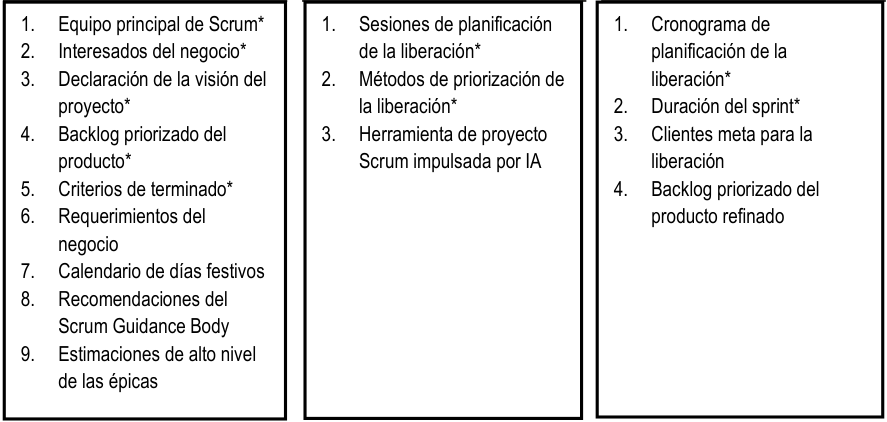

<!-- Start of picture text -->
1. Equipo principal de Scrum*  1. Sesiones de planificación  1. Cronograma de 2. Interesados del negocio*  de la liberación*  planificación de la 3. Declaración de la visión del  2. Métodos de priorización de  liberación* proyecto*  la liberación*  2. Duración del sprint* 4. Backlog priorizado del  3. Herramienta de proyecto  3. Clientes meta para la producto*  Scrum impulsada por IA  liberación 5. Criterios de terminado*  4. Backlog priorizado del 6. Requerimientos del  producto refinado negocio 7. Calendario de días festivos 8. Recomendaciones del Scrum Guidance Body 9. Estimaciones de alto nivel de las épicas <!-- End of picture text -->

**Figura 8-22: Realizar la planificación de la liberación: entradas, herramientas y salidas** 

_Nota: Los asteriscos (*) indican una entrada, herramientas o salida “obligatoria” para el proceso correspondiente._ 

**204** © 2025 SCRUMstudy™. _Una guía para el cuerpo de conocimiento de Scrum (Guía SBOK®)_ 

8 – INICIO 

**8** 

La figura 8-23 muestra el diagrama de flujo de este proceso. 

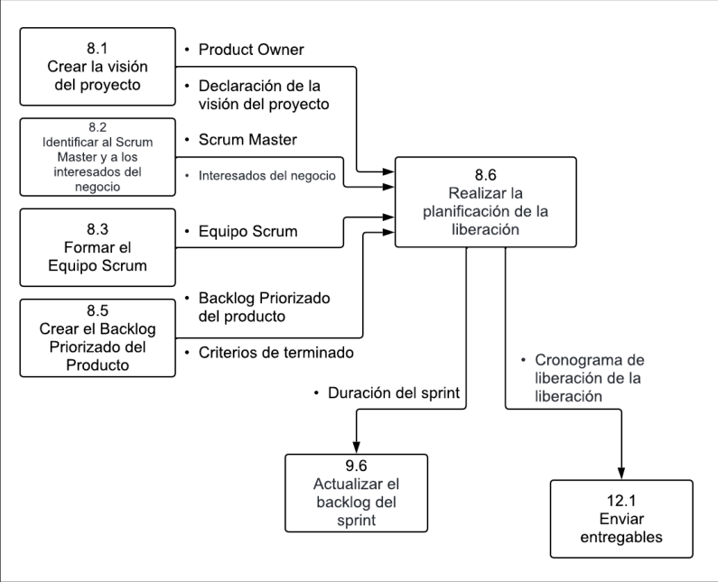

**Figura 8-23: Realizar la planificación de la liberación: Diagrama de flujo** 

#### **8.6.1 Entradas** 

##### **8.6.1.1 Equipo principal de Scrum*** 

Descrito en la sección 3.3.1. 

##### **8.6.1.2 Interesados del negocio*** 

Descrito en la sección 8.2.3.2. 

##### **8.6.1.3 Declaración la visión del proyecto*** 

Descrito en la sección 8.1.3.2. 

##### **8.6.1.4 Backlog priorizado del producto*** 

Descrito en la sección 8.5.3.1. 

©2025 SCRUMstudy™. _Una guía para el cuerpo de conocimiento de Scrum (Guía SBOK®)_ **205** 

8 – INICIO 

##### **8.6.1.5 Criterios de terminado*** 

Descrito en la sección 8.5.3.2. 

##### **8.6.1.6 Requerimientos del negocio** 

Descrito en la sección 8.5.1.6. 

##### **8.6.1.7 Calendario de días festivos** 

Es importante que el Equipo Scrum esté al tanto de las fechas importantes y de la disponibilidad de todos los integrantes del equipo. Esto se puede lograr mediante el uso de un calendario compartido que proporcione información sobre los días feriados, ausencias, ausencias, planes de viaje, eventos, etc. Este calendario ayudará al equipo en la planificación y ejecución de los sprints. 

##### **8.6.1.8 Recomendaciones del Scrum Guidance Body** 

En el proceso de _Realizar la planificación de la liberación, las_ recomendaciones de Scrum Guidance Body pueden estar relacionadas a las normas, reglamentos, estándares y mejores prácticas para el desarrollo del plan de liberación. Dicho órgano puede ser la mejor autoridad para definir las directrices relacionadas al valor del negocio, las expectativas de liberación, estrategias de implementación, calidad y seguridad. Para conocer más detalles sobre el Scrum Guidance Body, véase la sección 3.3.2. 

##### **8.6.1.9 Estimaciones de alto nivel para las épicas** 

En las sesiones de planificación de la liberación para las épicas se utilizan para planificar las liberaciones ya sea mediante un cronograma o con un método guiado por funcionalidades. Para conocer más información sobre estas estimaciones, véanse las secciones 8.5.2.5 y 8.5.3.4. 

#### **8.6.2 Herramientas** 

##### **8.6.2.1 Sesiones de planificación de la liberación*** 

Las sesiones de planificación de la liberación se llevan a cabo para desarrollar un plan de liberación en el proyecto. Este cronograma define cuándo se entregarán al cliente las distintas series de funcionalidades útiles _._ Uno de los principales objetivos de la reunión de planificación de la liberación es brindarle al Equipo Scrum una visión general de las liberaciones y del calendario de entrega del producto que están desarrollando. Esto debe estar en armonía con las expectativas del Product Owner y de los interesados del negocio relevantes (principalmente el patrocinador del proyecto). 

**206** © 2025 SCRUMstudy™. _Una guía para el cuerpo de conocimiento de Scrum (Guía SBOK®)_ 

8 – INICIO 

**8** 

Muchas organizaciones cuentan con estrategias para liberar los productos. Algunas organizaciones prefieren un despliegue continuo donde hay liberaciones después de crear la funcionalidad útil especificada. Otras organizaciones prefieren un despliegue por etapas, donde las liberaciones se hacen en intervalos predefinidos. Dependiendo de la estrategia de la organización, la sesión de planificación de la liberación en los proyectos puede estar guiada por la funcionalidad, donde el objetivo es presentar entregables funcionales (de incrementos del producto) una vez que se haya desarrollado una serie de funcionalidades predeterminadas, o por fecha, donde las liberaciones se hacen en fechas predefinidas. Dado a que el marco de trabajo de Scrum promueve la toma de decisiones iterativa basada en información en vez de una planificación anticipada y detallada como en el estilo tradicional de gestión de proyectos en cascada, las sesiones de planificación de la liberación no necesitan producir un plan detallado de liberación para todo el proyecto. El plan de liberación puede actualizarse constantemente a medida que la información relevante está disponible. 

##### **8.6.2.2 Métodos de priorización de la liberación*** 

Los métodos de priorización de la liberación se utilizan para desarrollar un plan de la liberación. Estos métodos son específicos a la industria y organización, y generalmente son determinados por la alta gerencia de la organización. 

###### **8.6.2.3 Herramienta de proyecto Scrum impulsada por IA** 

Descrito en la sección 2.4.4. 

La figura 8-24 muestra la planificación de lanzamientos en Vabro. Proporciona herramientas visuales para programar, realizar un seguimiento de las dependencias y alinear las versiones con las prioridades empresariales. 

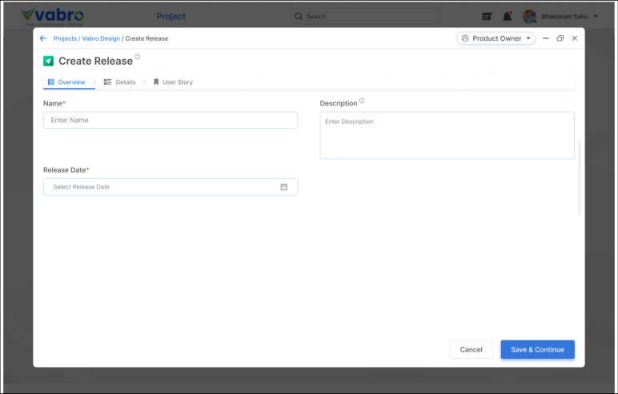

**Figura 8-214: Planificación de lanzamientos en Scrum (Fuente: Vabro)** 

©2025 SCRUMstudy™. _Una guía para el cuerpo de conocimiento de Scrum (Guía SBOK®)_ **207** 

8 – INICIO 

En la figura 8-25 se muestra la gestión de versiones y configuraciones en Jira. Destaca las funciones para administrar las versiones de software, la preparación para la versión y el seguimiento de la implementación. 

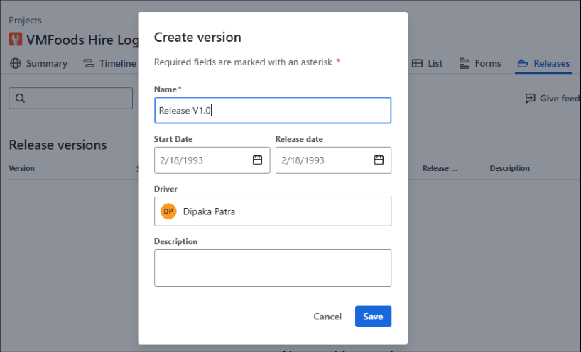

**Figura 8-25: Gestión de versiones y configuraciones en Scrum (fuente: Jira)** 

#### **8.6.3 Salidas** 

##### **8.6.3.1 Cronograma de planificación de la liberación*** 

Un cronograma de planificación de la liberación es una de las salidas más importantes del proceso de _Realizar la planificación de la liberación_ . Un cronograma de planificación de la liberación indica cuáles entregables serán entregados al cliente, así como los intervalos planificados y fechas de liberación. Una liberación ( _release_ ) típicamente incluye un grupo de historias de usuario en el backlog priorizado del producto que debe ser completado y enviado en forma conjunta como parte de la liberación. Es importante destacar que algunas historias de usuario en una liberación no siempre ofrecen la funcionalidad completa descrita en las épicas. Algunas épicas pudieran estar solo completadas parcialmente debido a que no todas las historias de usuario que la conforman son necesariamente prioritarias como para formar parte de esta liberación específica. 

Es posible que no exista una liberación programada al final de cada iteración del sprint. En ocasiones se puede planificar una liberación después de completar un grupo de iteraciones del sprint. Dependiendo de la estrategia de la organización, las sesiones de la planificación de liberación en los proyectos pueden estar guiadas por la funcionalidad, donde el objetivo es hacer la entrega después de haber desarrollado un conjunto predeterminado de funcionalidades, o bien, la planificación puede estar impulsada por la fecha, donde la liberación se hace en una fecha predefinida. Cada entregable se debe entrega solo cuando ofrezca suficiente valor de negocio al cliente. 

**208** © 2025 SCRUMstudy™. _Una guía para el cuerpo de conocimiento de Scrum (Guía SBOK®)_ 

8 – INICIO 

**8** 

Durante el proceso de _Realizar la planificación de la liberación_ , puede ser útil tomar en cuenta la duración del sprint y las suposiciones de velocidad del equipo a fin de presentar un mejor cronograma de planificación de la liberación. 

##### **8.6.3.2 Duración del sprint*** 

El Product Owner y el Equipo Scrum deciden la duración del sprint en el proyecto con base en las diversas entradas, incluyendo los requerimientos del negocio y el cronograma de planificación de la liberación. Una vez determinada, la duración del sprint generalmente permanece igual durante el proyecto. 

Sin embargo, la duración del sprint puede cambiar si lo consideran apropiado el Product Owner y el Equipo Scrum. Por ejemplo, a principios del proyecto se puede seguir dando la experimentación para encontrar la mejor duración del sprint. Si más adelante en el proyecto hay un cambio en la duración del sprint, normalmente significa que se puede reducir debido a mejoras en el entorno del proyecto. 

Un sprint puede tener a un time-box de una a cuatro semanas. La mayoría de los proyectos de Scrum generalmente utilizan sprints con un time-box de dos a tres semanas o menos. Sin embargo, si el proyecto cuenta con requerimientos muy estables, los sprints pueden extenderse hasta seis semanas. 

Debido a que no se permiten cambios durante un sprint, el impacto y la frecuencia de cualquier cambio esperado pudiera afectar la decisión relacionada a la duración del sprint. El impacto de un cambio esperado en la duración del sprint se describe en la sección 6.5.1 

##### **8.6.3.3 Clientes meta para la liberación** 

No todas las liberaciones van dirigidas a todos los interesados del negocio o usuarios. Los <mark>interesados del negocio</mark> pueden optar por limitar ciertas liberaciones a un subconjunto de clientes o usuarios. El plan de liberación debe especificar a qué clientes va dirigida la liberación. 

##### **8.6.3.4 Backlog priorizado del producto refinado** 

En este proceso se puede refinar el backlog priorizado del producto, desarrollado en el proceso de _Crear el backlog priorizado del producto_ . Es posible que se entiendan mejor las historias de usuarios en el backlog priorizado del producto después de que el equipo principal de Scrum lleve a cabo las sesiones de planificación de la liberación con los <mark>interesados del negocio.</mark> 

©2025 SCRUMstudy™. _Una guía para el cuerpo de conocimiento de Scrum (Guía SBOK®)_ **209** 

8 – INICIO 

### **8.7 Diagrama de flujo de la fase de inicio** 

La figura 8-26 muestra el diagrama de flujo de la fase de inicio. 

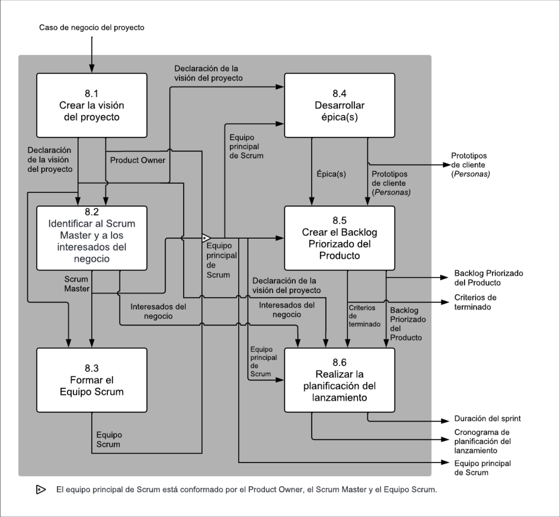

**Figura 8-26: Fase de inicio: Diagrama del flujo** 

**210** © 2025 SCRUMstudy™. _Una guía para el cuerpo de conocimiento de Scrum (Guía SBOK®)_ 

9 – PLANIFICACIÓN Y ESTIMACIÓN 

**9** 

## **9. PLANIFICACIÓN Y ESTIMACIÓN** 

La fase de planificación y estimación consiste en procesos relacionados a la planificación y estimación de tareas, los cuales incluyen: _Crear historias de usuario_ , _Estimar historias de usuario_ , _Comprometer historias de usuario_ , _Identificar tareas_ , _Estimar tareas_ y _Actualizar el_ _<mark>backlog del sprint</mark>_ <mark>.</mark> 

<mark>La planificación y estimación, tal como se define en la</mark> _<mark>Guía de los fundamentos de Scrum (Guía del SBOK</mark>__®_ _<mark>)</mark>_ <mark>,</mark> es <mark>aplicable a los siguientes:</mark> 

- <mark>Portafolios, programas o proyectos en cualquier industria;</mark> 

- <mark>Productos, servicios o cualquier otro resultado que se entregará a los</mark> interesados del negocio; 

- <mark>Proyectos de cualquier tamaño o complejidad.</mark> 

<mark>El término “producto” en la</mark> _<mark>Guía del SBOK</mark>__®_ <mark>puede referirse a un producto, servicio, o cualquier otro entregable. Scrum se puede aplicar de manera efectiva a cualquier proyecto en cualquier industria: desde proyectos o equipos pequeños con tan solo seis miembros, hasta proyectos grandes y complejos con cientos de miembros.</mark> 

A fin de facilitar la mejor aplicación del marco de trabajo de Scrum, en este capítulo se identifican las entradas, herramientas y salidas de cada proceso, ya sea como “obligatorias” u “opcionales”. Las entradas, herramientas y salidas indicadas por asteriscos (*) son obligatorias o se consideran importantes para el éxito, mientras que las que no tienen asteriscos son opcionales. 

Se recomienda que el Equipo Scrum y aquellas personas que empiezan a aprender sobre el marco de trabajo y los procesos de Scrum, se enfoquen principalmente en las entradas, herramientas y salidas obligatorias; mientras que los Product Owners, Scrum Masters y demás practicantes con experiencia en Scrum, se deben esforzar por alcanzar un conocimiento más a fondo sobre la información ofrecida en este capítulo. 

<mark>Este capítulo está escrito desde la perspectiva de un Equipo Scrum que trabaja en un sprint para producir entregables que pudieran ser parte de un proyecto más grande, de un programa o portafolio. La información sobre cómo escalar Scrum en grandes proyectos está disponible en el capítulo 13 y lo relacionado a escalar Scrum para la empresa se puede encontrar en el capítulo 14.</mark> 

<mark>Después de terminar la fase de inicio pueden iniciar los ciclos iterativos del sprint. La fase de planificación e implementación es la primera de tres fases que se hacen repetidamente en cada ciclo del sprint.</mark> 

<mark>Al inicio del sprint, el Product Owner y el Equipo Scrum, con el apoyo del Scrum Master, planifican el sprint. El Product Owner refina las épicas de mayor prioridad y las convierte una serie de historias de usuario estimadas y bien escritas a las cuales el Equipo Scrum se compromete a completar en el próximo sprint con base en sus estimaciones de velocidad. El Scrum Master o el Equipo Scrum crean o actualizan el backlog del sprint con la lista de historias de usuario comprometidas que se harán como parte del sprint.</mark> 

<mark>El Equipo Scrum después planifica su trabajo con más detalle e identifica, con la opción de estimar, las tareas que debe completar a fin de entregar las historias de usuario del sprint. Como último paso en el sprint, el equipo actualiza el backlog del sprint con detalles de las tareas y con las estimaciones en caso de tenerlas. El backlog del sprint actualizado se utilizará en la fase de implementación para darle seguimiento al avance del equipo durante el sprint.</mark> 

©2025 SCRUMstudy™. _Una guía para el cuerpo de conocimiento de Scrum (Guía SBOK®)_ **211** 

9 – PLANIFICACIÓN Y ESTIMACIÓN 

También es importante destacar que, aunque todos los procesos se definen de forma única en la _<mark>Guía del SBOK</mark>__®_ _<mark>,</mark>_ no necesariamente se llevan a cabo de forma secuencial o por separado. En ocasiones, puede ser más apropiado combinar algunos procesos, dependiendo de los requisitos específicos de cada proyecto. 

<mark>La figura 9-1 brinda una descripción general de los procesos en la fase de planificación y estimación, que son los siguientes:</mark> 

**9.1 Crear historias de usuario:** En este proceso, el Product Owner escribe las historias de usuario y sus respectivos criterios de aceptación a partir de las épicas previamente definidas y se incorporan al backlog priorizado del producto. Las historias de usuario se diseñan para garantizar que los requerimientos del cliente estén claramente representados y que todos los interesados del negocio las pueden entender completamente. Estas historias de usuario deben ser lo suficientemente tangibles y deben satisfacer la definición de listo a fin de que el Equipo Scrum las pueda estimar. 

**9.2 Estimar historias de usuario:** En este proceso el Equipo Scrum, con el apoyo del Scrum Master, estima las historias de usuario e identifica el esfuerzo necesario para desarrollar la funcionalidad descrita en cada historia de usuario. El equipo solamente estima las historias de usuario que satisfacen la definición de listo y hayan sido debidamente definidas por el Product Owner. 

**9.3 Comprometer historias de usuario:** En este proceso, el Equipo Scrum se compromete a entregar una serie de historias de usuario en el sprint. Se compromete a desarrollar las historias con base en la prioridad relativa basada en valor de las historias de usuario, en el esfuerzo estimado y en la velocidad del equipo en un sprint. Como parte de este proceso, el Equipo Scrum empieza a crear el backlog del sprint que incluye las historias de usuario comprometidas que serán asignadas a un sprint específico. A medida que avanza el sprint, el backlog se refina aún más con detalles a nivel de cada tarea. El contenido del sprint se define con este compromiso del Equipo Scrum establecido al inicio del sprint como parte de su planificación y no puede ser modificado una vez iniciada la fase de implementación. 

**9.4 Identificar tareas:** En este proceso, las historias de usuario comprometidas se desglosan en tareas específicas y se compilan en una lista de tareas. La identificación de tareas se puede hacer al inicio del sprint en todas las historias de usuario comprometidas o antes de que el equipo empiece a trabajar en las tareas requeridas en cada historia de usuario. 

**9.5 Estimar tareas:** Este es un proceso opcional que implica crear estimaciones de las tareas en caso de que el Equipo Scrum vea algún valor en ello. En este proceso, el Equipo Scrum estima el esfuerzo necesario para hacer cada tarea en la lista. Las estimaciones de las tareas se pueden establecer al inicio del sprint para todas las historias de usuario o tareas relevantes en ese sprint, o bien, para cada tarea antes 

**9.6 Actualizar el backlog del sprint:** En este proceso, el equipo principal de Scrum actualiza el backlog del sprint con detalles de las tareas y las estimaciones de las tareas (si cuenta con ellas). El backlog del sprint actualizado se utiliza en la fase de implementación para darle seguimiento al avance del equipo durante el sprint. 

**212** ©2025 SCRUMstudy™. _Una guía para el cuerpo de conocimiento de Scrum (Guía SBOK®)_ 

9 – PLANIFICACIÓN Y ESTIMACIÓN 

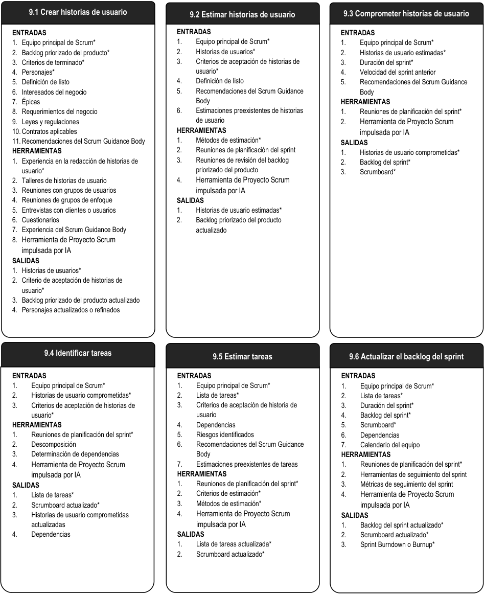

<!-- Start of picture text -->
9.1 Crear historias de usuario  9.2 Estimar historias de usuario  9.3 Comprometer historias de usuario ENTRADAS  ENTRADAS  ENTRADAS 1. Equipo principal de Scrum*  1. Equipo principal de Scrum*  1. Equipo principal de Scrum* 2. Backlog priorizado del producto*  2. Historias de usuarios*  2. Historias de usuario estimadas* 3. Criterios de terminado*  3. Criterios de aceptación de historias de  3. Duración del sprint* 4. Personajes*  usuario*  4. Velocidad del sprint anterior 5. Definición de listo  4. Definición de listo  5. Recomendaciones del Scrum Guidance 6. Interesados del negocio  5. Recomendaciones del Scrum Guidance  Body 7. Épicas  Body  HERRAMIENTAS 8. Requerimientos del negocio  6. Estimaciones preexistentes de historias  1. Reuniones de planificación del sprint* 9. Leyes y regulaciones  de usuario  2. Herramienta de Proyecto Scrum 10.Contratos aplicables  HERRAMIENTAS  impulsada por IA 11.Recomendaciones del Scrum Guidance Body  1. Métodos de estimación*   SALIDAS HERRAMIENTAS  2. Reuniones de planificación del sprint  1. Historias de usuario comprometidas* 1. Experiencia en la redacción de historias de  3. Reuniones de revisión del backlog  2. Backlog del sprint* usuario*  priorizado del producto  3. Scrumboard* 2. Talleres de historias de usuario  4. Herramienta de Proyecto Scrum 3. Reuniones con grupos de usuarios  impulsada por IA 4. Reuniones de grupos de enfoque  SALIDAS 5. Entrevistas con clientes o usuarios   1. Historias de usuario estimadas* 6. Cuestionarios  2. Backlog priorizado del producto 7. Experiencia del Scrum Guidance Body  actualizado 8. Herramienta de Proyecto Scrum impulsada por IA SALIDAS 1. Historias de usuarios* 2. Criterio de aceptación de historias de usuario* 3. Backlog priorizado del producto actualizado 4. Personajes actualizados o refinados 9.4 Identificar tareas 9.5 Estimar tareas  9.6 Actualizar el backlog del sprint ENTRADAS  ENTRADAS  ENTRADAS 1. Equipo principal de Scrum*  1. Equipo principal de Scrum*  1. Equipo principal de Scrum* 2. Historias de usuario comprometidas*  2. Lista de tareas*  2. Lista de tareas* 3. Criterios de aceptación de historias de  3. Criterios de aceptación de historia de  3. Duración del sprint* usuario*  usuario  4. Backlog del sprint* HERRAMIENTAS  4. Dependencias  5. Scrumboard* 1. Reuniones de planificación del sprint*  5. Riesgos identificados  6. Dependencias 2. Descomposición  6. Recomendaciones del Scrum Guidance  7. Calendario del equipo 3. Determinación de dependencias  Body  HERRAMIENTAS 4. Herramienta de Proyecto Scrum  7. Estimaciones preexistentes de tareas  1. Reuniones de planificación del sprint* impulsada por IA HERRAMIENTAS  2. Herramientas de seguimiento del sprint SALIDAS  1. Reuniones de planificación del sprint*  3. Métricas de seguimiento del sprint 1. Lista de tareas*  2. Criterios de estimación*  4. Herramienta de Proyecto Scrum 2. Scrumboard actualizado*  3. Métodos de estimación*  impulsada por IA 3. Historias de usuario comprometidas  4. Herramienta de Proyecto Scrum  SALIDAS actualizadas  impulsada por IA 1. Backlog del sprint actualizado* 4. Dependencias  SALIDAS  2. Scrumboard actualizado* 1. Lista de tareas actualizada*  3. Sprint Burndown o Burnup* 2. Scrumboard actualizado* <!-- End of picture text -->

**9** 

**Figura 9-1: Información general de la fase de planificación y estimación** 

_Nota: Los asteriscos (*) indican una entrada, herramientas o salida “obligatoria” para el proceso correspondiente._ 

©2025 SCRUMstudy™. _Una guía para el cuerpo de conocimiento de Scrum (Guía SBOK®)_ **213** 

9 – PLANIFICACIÓN Y ESTIMACIÓN 

La figura 9-2 muestra las entradas obligatorias, las herramientas y las salidas de los procesos en la fase de planificación y estimación. 

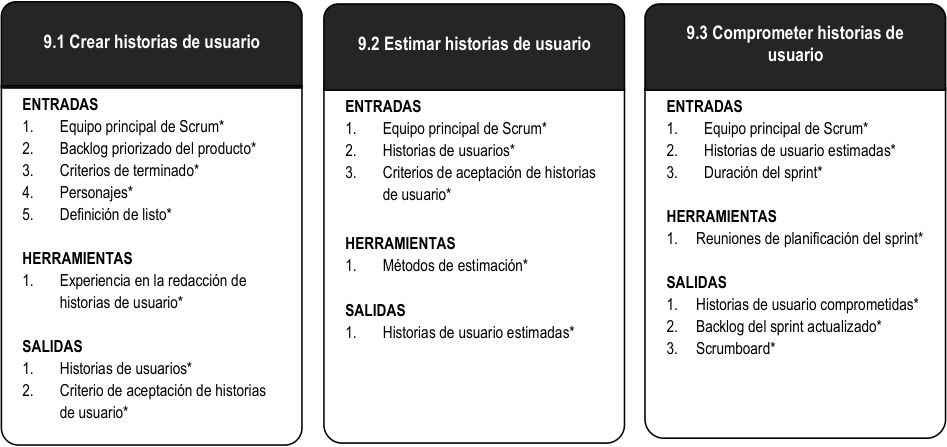

<!-- Start of picture text -->
9.1 Crear historias de usuario  9.2 Estimar historias de usuario 9.3 Comprometer historias de usuario ENTRADAS  ENTRADAS  ENTRADAS 1. Equipo principal de Scrum*  1. Equipo principal de Scrum*  1. Equipo principal de Scrum* 2. Backlog priorizado del producto*  2. Historias de usuarios*  2. Historias de usuario estimadas* 3. Criterios de terminado*  3. Criterios de aceptación de historias  3. Duración del sprint* 4. Personajes*  de usuario* 5. Definición de listo*  HERRAMIENTAS HERRAMIENTAS  1. Reuniones de planificación del sprint* HERRAMIENTAS 1. Métodos de estimación* 1. Experiencia en la redacción de  SALIDAS historias de usuario*  SALIDAS  1. Historias de usuario comprometidas* 1. Historias de usuario estimadas* 2. Backlog del sprint actualizado* SALIDAS 3. Scrumboard* 1. Historias de usuarios* 2. Criterio de aceptación de historias de usuario* <!-- End of picture text -->

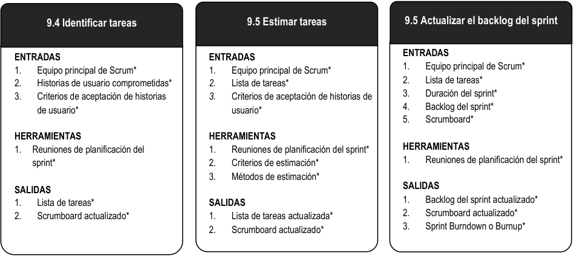

<!-- Start of picture text -->
9.4 Identificar tareas  9.5 Estimar tareas  9.5 Actualizar el backlog del sprint ENTRADAS  ENTRADAS  ENTRADAS 1. Equipo principal de Scrum*  1. Equipo principal de Scrum*  1. Equipo principal de Scrum* 2. Historias de usuario comprometidas*  2. Lista de tareas* 2. Lista de tareas* 3. Criterios de aceptación de historias  3. Criterios de aceptación de historias de  3. Duración del sprint* de usuario*  usuario* 4. Backlog del sprint* 5. Scrumboard* HERRAMIENTAS  HERRAMIENTAS 1. Reuniones de planificación del  1. Reuniones de planificación del sprint*  HERRAMIENTAS sprint*  2. Criterios de estimación*  1. Reuniones de planificación del sprint* 3. Métodos de estimación* SALIDAS  SALIDAS 1. Lista de tareas*  SALIDAS 1. Backlog del sprint actualizado* 2. Scrumboard actualizado*  1. Lista de tareas actualizada*  2. Scrumboard actualizado* 2. Scrumboard actualizado*  3. Sprint Burndown o Burnup* <!-- End of picture text -->

**Figura 9-2: Información general de la fase de planificación y estimación (fundamentales)** 

_Nota: Los asteriscos (*) indican una entrada, herramientas o salida “obligatoria” para el proceso correspondiente._ 

**214** ©2025 SCRUMstudy™. _Una guía para el cuerpo de conocimiento de Scrum (Guía SBOK®)_ 

9 – PLANIFICACIÓN Y ESTIMACIÓN 

**9** 

### **9.1 Crear historias de usuario** 

En este proceso, el Product Owner escribe las historias de usuario y sus respectivos criterios de aceptación a partir de las épicas previamente definidas y se incorporan al backlog priorizado del producto. Las historias de usuario se diseñan para garantizar que los requerimientos del cliente estén claramente representados y que todos los interesados del negocio las pueden entender completamente. Estas historias de usuario deben ser lo suficientemente tangibles y deben satisfacer la definición de listo a fin de que el Equipo Scrum las pueda estimar. 

Se pueden llevar a cabo talleres de historias de usuario donde participen los miembros del Equipo Scrum a fin de que entiendan mejor las historias de usuario creadas por el Product Owner. 

La figura 9-3 muestra todas las entradas, las herramientas y las salidas para el proceso de _Crear historias de usuario_ . 

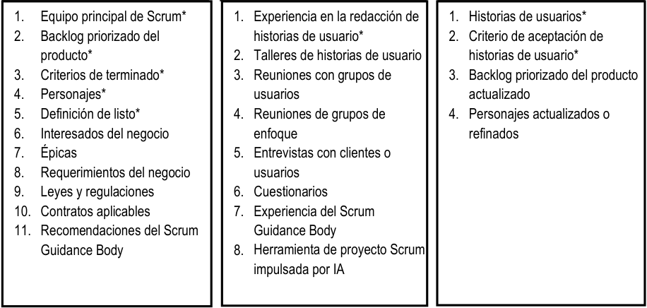

<!-- Start of picture text -->
1. Equipo principal de Scrum*  1. Experiencia en la redacción de  1. Historias de usuarios* 2. Backlog priorizado del  historias de usuario*  2. Criterio de aceptación de producto*  2. Talleres de historias de usuario  historias de usuario* 3. Criterios de terminado*  3. Reuniones con grupos de  3. Backlog priorizado del producto 4. Personajes*  usuarios  actualizado 5. Definición de listo*  4. Reuniones de grupos de  4. Personajes actualizados o 6. Interesados del negocio  enfoque  refinados 7. Épicas  5. Entrevistas con clientes o 8. Requerimientos del negocio  usuarios 9. Leyes y regulaciones  6. Cuestionarios 10. Contratos aplicables  7. Experiencia del Scrum 11. Recomendaciones del Scrum  Guidance Body Guidance Body  8. Herramienta de proyecto Scrum impulsada por IA <!-- End of picture text -->

**Figura 9-3: Crear historias de usuario: entradas, herramientas y salidas** 

_Nota: Los asteriscos (*) indican una entrada, herramientas o salida “obligatoria” para el proceso correspondiente._ 

©2025 SCRUMstudy™. _Una guía para el cuerpo de conocimiento de Scrum (Guía SBOK®)_ **215** 

9 – PLANIFICACIÓN Y ESTIMACIÓN 

La figura 9-4 muestra el diagrama de flujo de este proceso. 

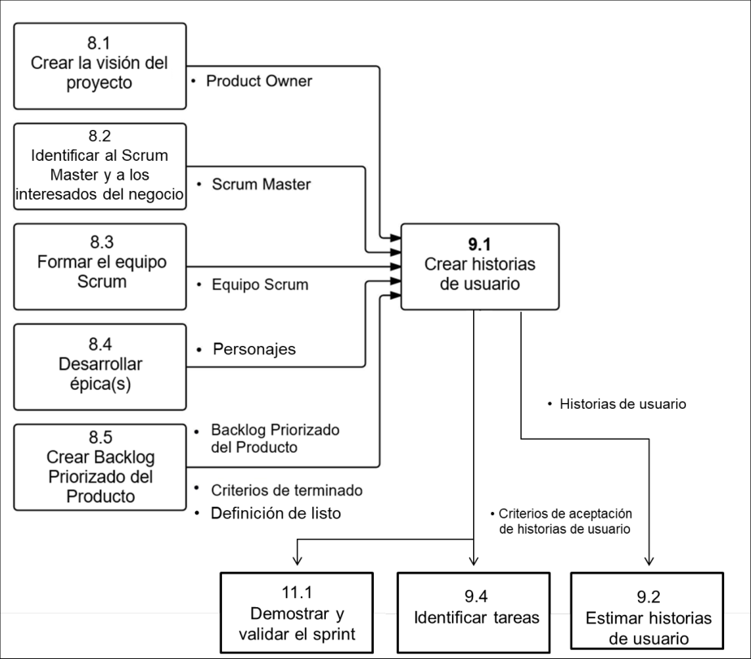

**Figura 9-4: Crear historias de usuario: diagrama de flujo** 

#### **9.1.1 Entradas** 

##### **9.1.1.1 Equipo principal de Scrum*** 

Descrito en la sección 3.3.1. 

##### **9.1.1.2 Backlog priorizado del producto*** 

Descrito en la sección 8.5.3.1. 

**216** ©2025 SCRUMstudy™. _Una guía para el cuerpo de conocimiento de Scrum (Guía SBOK®)_ 

9 – PLANIFICACIÓN Y ESTIMACIÓN 

**9** 

##### **9.1.1.3 Criterios de terminado*** 

Descrito en la sección 8.5.3.2. 

##### **9.1.1.4 Personajes*** 

Descrito en la sección 8.4.3.2. 

##### **9.1.1.5 Definición de listo*** 

La definición de listo establece los criterios que deberá satisfacer una historia de usuario antes de ser considerada para su estimación o inclusión en un sprint. Para obtener más información sobre la definición de listo, véanse las secciones 5.4.2 y 8.5.3.3. 

##### **9.1.1.6 Interesados del negocio** 

Descrito en la sección 8.2.3.2. 

##### **9.1.1.7 Épicas** 

Descrito en la sección 8.4.3.1. 

##### **9.1.1.8 Requerimientos del negocio** 

Descrito en la sección 8.5.1.6. 

##### **9.1.1.9 Leyes y regulaciones** 

Descrito en la sección 8.4.1.6. 

##### **9.1.1.10 Contratos aplicables** 

Descrito en la sección 8.4.1.7. 

##### **9.1.1.11 Recomendaciones del Scrum Guidance Body** 

En el proceso de _Crear historias de usuario_ , las recomendaciones del Scrum Guidance Body pueden incluir información sobre las normas, regulaciones, estándares y mejores prácticas necesarias para crear historias de usuario efectivas. Para obtener más información sobre las recomendaciones del Scrum Guidance Body, véase la sección 8.1.1.7. 

©2025 SCRUMstudy™. _Una guía para el cuerpo de conocimiento de Scrum (Guía SBOK®)_ **217** 

9 – PLANIFICACIÓN Y ESTIMACIÓN 

#### **9.1.2 Herramientas** 

##### **9.1.2.1 Experiencia en la redacción de historias de usuario*** 

El Product Owner, con base en su interacción con los interesados del negocio, en su conocimiento del negocio, en la experiencia y en las aportaciones del equipo, desarrolla las historias de usuario que formarán parte del backlog priorizado del producto inicial para el proyecto. El backlog priorizado del producto representa la suma total de lo que debe completarse en el proyecto. El objetivo de este ejercicio es crear historias de usuario elaboradas y refinadas que pudieran ser estimadas y comprometidas por el Equipo Scrum. En ocasiones, el Product Owner pudiera incluir a un analista de negocios para que ayude en la redacción de historias de usuario. Aunque el Product Owner tiene la principal responsabilidad de escribir las historias de usuario y generalmente lleva a cabo esta actividad por sí mismo, se puede también llevar a cabo un taller de redacción de historias de usuario si así se desea. 

##### **9.1.2.2 Talleres de historias de usuario** 

Descrito en la sección 8.4.2.2. 

##### **9.1.2.3 Reuniones con grupos de usuarios** 

Descrito en la sección 8.4.2.1. 

##### **9.1.2.4 Reuniones de grupos de enfoque** 

Las reuniones de grupos de enfoque son una técnica cualitativa para medir y entender las necesidades y expectativas del usuario respecto al producto que se propone. Se selecciona un pequeño grupo de usuarios para que formen parte del grupo de enfoque. Este grupo pudiera ser seleccionado en forma aleatoria de entre muchos usuarios o bien, puede seleccionarse específicamente para representar a todos los personajes meta. Las reuniones de grupos de enfoque normalmente se apegan a cierto formato en el cual se le hacen preguntas que después analizan entre ellos. Cada reunión de grupo de enfoque puede contar con su propio reglamento de discusiones según lo hayan decidido los organizadores. Dichas reuniones generalmente se llevan a cabo en presencia de un moderador. 

##### **9.1.2.5 Entrevistas con clientes o usuarios** 

Descrito en la sección 8.4.2.4. 

##### **9.1.2.6 Cuestionarios** 

Descrito en la sección 8.4.2.5. 

**218** ©2025 SCRUMstudy™. _Una guía para el cuerpo de conocimiento de Scrum (Guía SBOK®)_ 

9 – PLANIFICACIÓN Y ESTIMACIÓN 

**9** 

##### **9.1.2.7 Experiencia del Scrum Guidance Body** 

Al crear historias de usuario, la experiencia del Scrum Guidance Body pudieran relacionarse a las normas y regulaciones o a los estándares y mejores prácticas para crear historias de usuario. Es posible que exista también un equipo de expertos en la materia que pudiera ayudar al Product Owner a crear historias de usuario. Este equipo podría incluir a analistas de negocios, arquitectos líderes, Senior Developers, expertos de Scrum o demás personas con experiencia. Por lo general, este grupo de expertos no es el mismo equipo que permanecerá y trabajará en un proyecto en particular, ya que tienden a pasar de un proyecto a otro y brindan asesoría al Equipo Scrum cuando es necesario. Para obtener más información sobre el Scrum Guidance Body, véase la sección 8.4.2.7. 

##### **9.1.2.8 Herramienta de proyecto Scrum impulsada por IA** 

Descrito en la sección 2.4.4 

La Figura 9-5 muestra la interfaz de Vabro para agregar historias de usuario al backlog de productos priorizados. Apoya la colaboración en equipo y ayuda a organizar las historias en función del valor empresarial. 

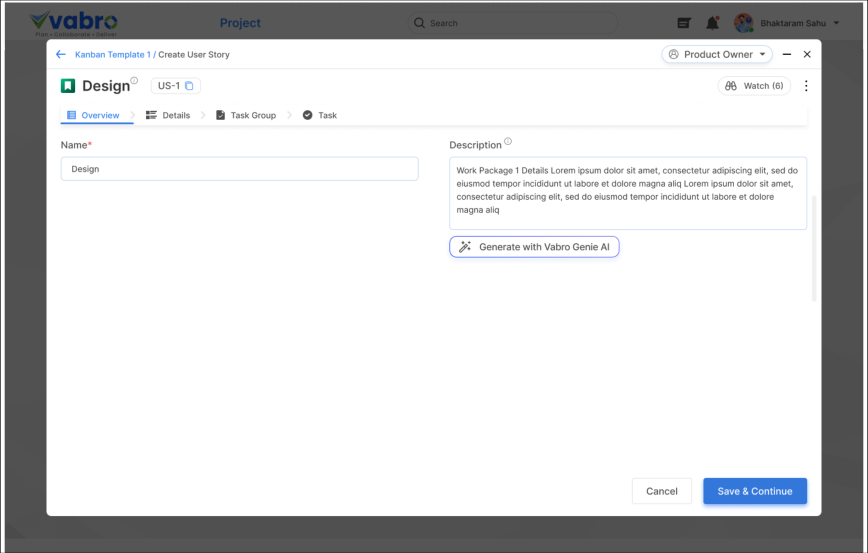

**Figura 9-5: Adición de historias de usuario en el backlog de productos priorizados (fuente: Vabro)** 

©2025 SCRUMstudy™. _Una guía para el cuerpo de conocimiento de Scrum (Guía SBOK®)_ **219** 

9 – PLANIFICACIÓN Y ESTIMACIÓN 

La figura 9-6 muestra la interfaz de Jira para gestionar el backlog de productos. Permite a los equipos agregar, priorizar y realizar un seguimiento de las historias de usuario dentro de un marco ágil. 

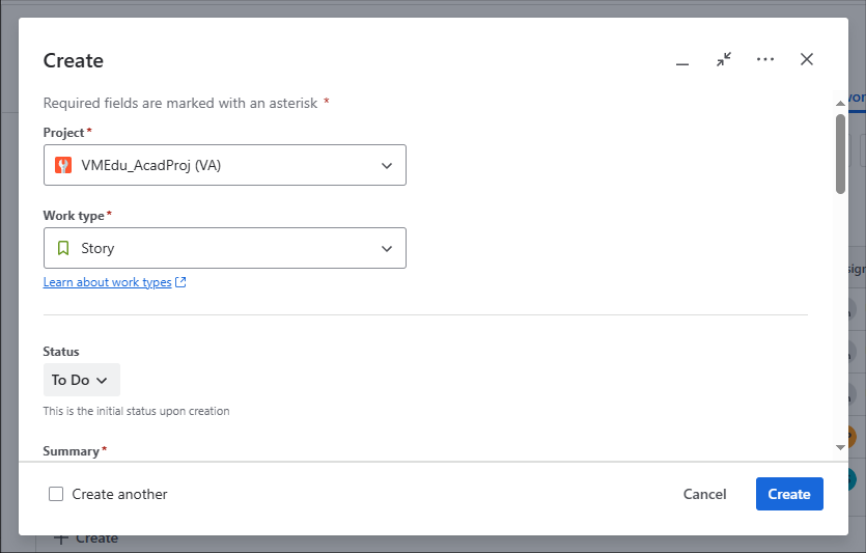

**Figura 9-6: Adición de historias de usuario en el backlog del producto (fuente: Jira)** 

#### **9.1.3 Salidas** 

##### **9.1.3.1 Historias de usuario*** 

Las historias de usuario se apegan a una estructura específica predefinida y son una forma simple de documentar los requerimientos y funcionalidades que desea el usuario final. Una historia de usuario incluye tres elementos sobre el requerimiento: ¿Quién? ¿Qué? y ¿Por qué? Los requerimientos expresados en las historias de usuario son oraciones breves, sencillas y fáciles de entender. El formato estándar predefinido resulta en una comunicación mejorada entre los interesados del negocio, así como en mejores estimaciones por parte del equipo. Algunas épicas o historias de usuario tal vez sean demasiado extensas como para poderse manejar dentro un solo sprint. Cuando surgen épicas en el backlog priorizado del producto para completarse en otro sprint, se desglosan en historias de usuario. 

El backlog priorizado del producto es una lista dinámica que se actualiza constantemente debido a la repriorización de historias de usuarios nuevas, actualizadas, refinadas y en ocasiones eliminadas. Tales actualizaciones al backlog son generalmente el resultado de cambios en los requerimientos del negocio. Para obtener más información sobre el backlog priorizado del producto, véase la sección 8.5.3.1. 

**220** ©2025 SCRUMstudy™. _Una guía para el cuerpo de conocimiento de Scrum (Guía SBOK®)_ 

9 – PLANIFICACIÓN Y ESTIMACIÓN 

**9** 

_Formato de historia de usuario:_ Como <rol/personaje> yo debería <requerimiento> a fin de <beneficio>. _Ejemplo de historia de usuario:_ 

Como administrador de una base de datos, yo debería contar con la capacidad de revertir una cantidad selecta de actualización de la base de datos a fin de que se restablezca a la versión deseada. 

##### **9.1.3.2 Criterios de aceptación de historias de usuario*** 

Cada historia de usuario cuenta con sus respectivos criterios de aceptación definidos por el Product Owner y comunicados al Equipo Scrum. Debido a que las historias de usuario son subjetivas, los criterios de aceptación brindan la objetividad requerida para que las historias se consideren terminadas o no terminadas (aceptadas o rechazadas) durante el proceso _Demostrar y validar el sprint_ . Los criterios de aceptación le explican al equipo los que se espera en una historia de usuario; eliminan la ambigüedad de los requerimientos, ayudando a la armonización de las expectativas. En las reuniones de revisión del sprint, los criterios de aceptación brindan el contexto para que el Product Owner decida si la historia de usuario se ha completado satisfactoriamente. El Scrum Master tiene la responsabilidad de asegurar que el Product Owner no cambie los criterios de aceptación de una historia de usuario a mitad de un sprint. 

##### **9.1.3.3 Backlog priorizado del producto actualizado** 

El backlog priorizado del producto elaborado en el proceso correspondiente se actualiza con la información en las historias de usuario, épicas, estimaciones para historias de usuario, así como los criterios de aceptación de las mismas. Para obtener más información sobre el backlog priorizado del producto, véase la sección 8.5.3.1. 

##### **9.1.3.4 Personajes actualizados o refinados** 

Los personajes se elaboran en el proceso de _Desarrollar épicas._ Al momento de redactar las historias de usuario, el Equipo Scrum puede decidir que dichos personajes iniciales son inadecuados y deben refinarse. En caso de que sea necesario refinar los personajes, esto normalmente se lleva a cabo casi al final del proceso de _Crear historias de usuario_ . Para obtener más información sobre los personajes, véase la sección 8.4.3.2. 

©2025 SCRUMstudy™. _Una guía para el cuerpo de conocimiento de Scrum (Guía SBOK®)_ **221** 

9 – PLANIFICACIÓN Y ESTIMACIÓN 

### **9.2 Estimar historias de usuarios** 

En este proceso el Equipo Scrum, con el apoyo del Scrum Master, estima las historias de usuario e identifica el esfuerzo necesario para desarrollar la funcionalidad descrita en cada historia de usuario. El Equipo Scrum solamente estima las historias de usuario que satisfacen la definición de listo y hayan sido debidamente definidas por el Product Owner. 

Aunque el Product Owner no juega un papel activo en el proceso de estimación, se le puede consultar para que despeje cualquier duda que tenga el Equipo Scrum con relación a las historias de usuario que serán estimadas. 

La figura 9-7 muestra todas las entradas, las herramientas y las salidas para el proceso de _Estimar historias de usuario_ . 

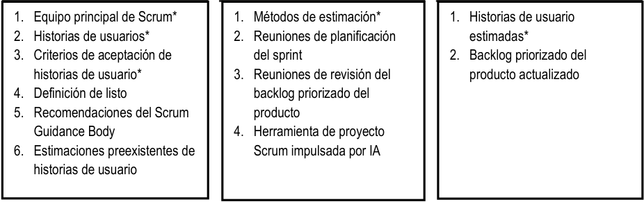

<!-- Start of picture text -->
1. Equipo principal de Scrum*  1. Métodos de estimación*   1. Historias de usuario 2. Historias de usuarios*  2. Reuniones de planificación  estimadas* 3. Criterios de aceptación de  del sprint  2. Backlog priorizado del historias de usuario*  3. Reuniones de revisión del  producto actualizado 4. Definición de listo  backlog priorizado del 5. Recomendaciones del Scrum  producto Guidance Body  4. Herramienta de proyecto 6. Estimaciones preexistentes de  Scrum impulsada por IA historias de usuario <!-- End of picture text -->

**Figura 9-7: Estimar historias de usuario: entradas, herramientas y salidas** 

_Nota: Los asteriscos (*) indican una entrada, herramientas o salida “obligatoria” para el proceso correspondiente._ 

**222** ©2025 SCRUMstudy™. _Una guía para el cuerpo de conocimiento de Scrum (Guía SBOK®)_ 

9 – PLANIFICACIÓN Y ESTIMACIÓN 

**9** 

La figura 9-8 muestra el diagrama de flujo de este proceso. 

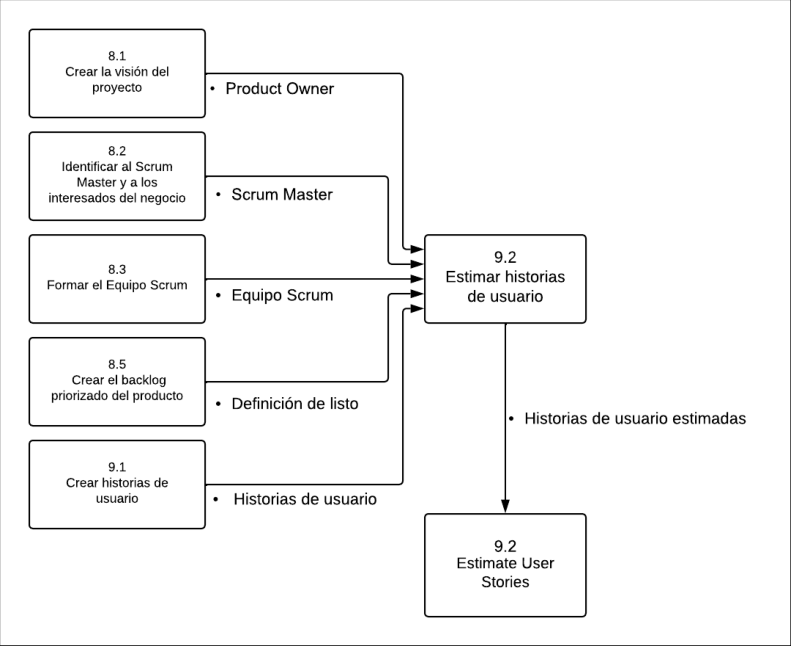

**Figura 9-8: Estimar historias de usuario: diagrama de flujo** 

#### **9.2.1 Entradas** 

##### **9.2.1.1 Equipo principal de Scrum*** 

Descrito en la sección 3.3.1. 

##### **9.2.1.2 Historias de usuario*** 

Descrito en la sección 9.1.3.1. 

##### **9.2.1.3 Criterios de aceptación de historias de usuario** 

Descrito en la sección 9.1.3.2. 

©2025 SCRUMstudy™. _Una guía para el cuerpo de conocimiento de Scrum (Guía SBOK®)_ **223** 

9 – PLANIFICACIÓN Y ESTIMACIÓN 

##### **9.2.1.4 Definición de listo*** 

La definición de listo establece los criterios que debe satisfacer una historia de usuario antes de ser considerada para estimación o inclusión en un sprint. Para conocer más detalles sobre la definición de listo, véanse las secciones 5.4.2 y 8.5.3.3. 

##### **9.2.1.5 Recomendaciones del Scrum Guidance Body** 

En el proceso de _Estimar historias de usuario_ , las recomendaciones del Scrum Guidance Body pudieran incluir información sobre las normal, regulaciones, estándares y mejores prácticas necesarias para estimar eficazmente las historias de usuario. Para conocer más detalles sobre las recomendaciones del Scrum Guidnace Body, véase la sección 8.1.1.7. 

##### **9.2.1.6 Estimaciones preexistentes de historias de usuario** 

Tal vez ya existan algunas estimaciones preexistentes del esfuerzo necesario para terminar una historia de usuario, especialmente si ya se desarrollaron historias de usuario en el mismo proyecto o en previos proyectos relacionados. Se pueden utilizar el tiempo y el esfuerzo de otras historias de usuario similares para obtener estimaciones del tiempo necesario para desarrollar historias de usuario existentes. Los expertos que anteriormente han implementado requerimientos de proyectos similares pudieran aportar algunas estimaciones sobre el esfuerzo para las historias de usuario en el sprint. Es importante asegurar que el Equipo Scrum elabore sus propias estimaciones antes de que las historias de usuario queden comprometidas como parte del sprint en vez de depender únicamente de cualquier estimación preexistente que esté a disposición para las historias. 

#### **9.2.2 Herramientas** 

##### **9.2.2.1 Métodos de estimación*** 

A medida que las historias de usuario se refinan en el backlog del producto, el Equipo Scrum asigna o actualiza las estimaciones preexistentes de cada historia de usuario. Para estimar el tamaño general de una historia de usuario o funcionalidad, se puede utilizar el tamaño relativo (o puntos de historia). Este método asigna un valor de punto de historia con base en una evaluación general del tamaño de una historia de usuario tomando en cuenta el riego, la cantidad de esfuerzo necesario y el nivel de complejidad. Esta evaluación la lleva a cabo el Equipo Scrum y se asignará un valor de punto de historia. Después de evaluar una historia de usuario en el backlog priorizado del producto, el Equipo Scrum puede evaluar otras historias de usuario relacionadas a esta primera historia. Es importante destacar que debido a que la calibración del punto de usuario por cada equipo será diferente, el número de puntos de historia completados pudiera utilizarse para hacer una comparación entre equipos. El método de estimación seleccionado depende del nivel de detalle de estimación que requiera el equipo. 

Algunas técnicas que se pueden utilizar para estimar las historias de usuario son las siguientes: 

**224** ©2025 SCRUMstudy™. _Una guía para el cuerpo de conocimiento de Scrum (Guía SBOK®)_ 

9 – PLANIFICACIÓN Y ESTIMACIÓN 

**9** 

###### **1. Wideband Delphi** 

El Wideband Delphi es una técnica de estimación basada en grupo para determinar la cantidad de trabajo necesario y el tiempo que tardará en completarse. Los individuos en el equipo proporcionan estimaciones anónimas para cada artículo y las estimaciones iniciales se trazan en una gráfica. Posteriormente, el equipo analiza los factores que influyeron en sus estimaciones y proceden a una segunda ronda de estimación. Este proceso se repite hasta que las estimaciones de los individuos quedan cerca una de la otra y se puede llegar a un consenso para la estimación final. 

###### **2. Planning Poker** 

El _Planning Poker_ , conocido también como póker de estimación, es un derivado de la técnica Wideband Delphi. Esta técnica de estimación implementa el consenso para estimar los tamaños relativos de las historias de usuario o el trabajo necesario para desarrollarlos. 

En el Planning Poker, a cada miembro del equipo se le asigna un juego de cartas. Cada carta está enumerada en forma secuencial y los números representan la complejidad del problema en términos de tiempo o esfuerzo, según lo estimado por el miembro del equipo. Los miembros del Equipo Scrum evalúan el artículo (tarea o historia de usuario) e intentan entenderlo mejor antes de brindar su estimación para su desarrollo. Después, cada miembro elige una carta de la baraja que represente su estimación para la historia de usuario. Si la mayoría, o todos los miembros del equipo seleccionan la misma carta, entonces el cálculo que indique la carta será el estimado para el artículo. Si no hay un consenso, entonces los integrantes del equipo discuten las razones de la selección de distintas cartas o estimaciones. Después del análisis seleccionan nuevamente las cartas. Esta secuencia continúa hasta que se entienden todos los supuestos; hasta que se resuelven los malentendidos o hasta que se llega a un consenso o a un acuerdo. El Planning Poker promueve una mayor interacción y una mejor comunicación entre los participantes. Facilita el pensamiento independiente por parte de los participantes, evitando con ello el fenómeno del pensamiento en grupo. 

###### **3. Puño de cinco** ( _Fist of Five_ ) 

El puño de cinco, o _Fist of Five_ , es un mecanismo sencillo y rápido que se puede utilizar como práctica de estimación, así como técnica general de formación de consenso colectivo. Tras el debate inicial sobre sobre la estimación de un elemento, se les pide a los miembros del Equipo Scrum que voten en una escala de 1 a 5 utilizando sus dedos. Al utilizarse como herramienta de estimación, el número de dedos que se muestran indican el valor relativo de estimación. Los integrantes del equipo con estimaciones atípicas (valores más altos o bajos) explican al grupo el motivo de su estimación para su análisis. Una vez que el equipo ha debatido, se lleva a cabo otra ronda de _Fist of Five_ o se toma una decisión colectiva. 

El valor en el uso de esta técnica no está solo en lograr un consenso, sino también en el debate, ya a que a cada miembro del equipo se le pide que explique el motivo de su estimación. También se les da la oportunidad de expresar cualquier problema o inquietud. Al utilizarse como técnica para lograr un consenso general, se discute inicialmente la propuesta o la decisión pendiente que está a consideración; después, los integrantes del equipo votan con base en su nivel de participación y deseo de debatir: 

- Un dedo: No estoy de acuerdo con la conclusión del grupo y tengo grandes inquietudes. 

- Dos dedos: No estoy de acuerdo con la conclusión del grupo y me gustaría hablar sobre algunos asuntos menores. 

- Tres dedos: No estoy seguro y me gustaría sumarme a la conclusión de consenso del grupo. 

©2025 SCRUMstudy™. _Una guía para el cuerpo de conocimiento de Scrum (Guía SBOK®)_ **225** 

9 – PLANIFICACIÓN Y ESTIMACIÓN 

- Cuatro dedos: Estoy de acuerdo con la conclusión del grupo y me gustaría discutir algunos asuntos menores. 

- Cinco dedos: Estoy totalmente de acuerdo con la conclusión del grupo. 

##### **4. Estimación por afinidad** ( _Affinity Estimation_ ) 

La estimación por afinidad, también conocida en inglés como _T-shirt sizing_ , es una técnica que se utiliza para estimar con rapidez un gran número de historias de usuarios con el uso de categorías. Utilizando notas adhesivas o fichas y cinta, cada equipo coloca las historias de usuario en la pared o en cualquier otra superficie en orden de pequeña a grande. Para ello, cada integrante del equipo inicia con un subconjunto de historias de usuario de todo el backlog priorizado del producto para colocarse por tamaño relativo. Esta colocación inicial se hace en silencio. Una vez que todos han colocado en la pared sus historias de usuario, el equipo las revisa y las puede mover según sea necesario. Esta segunda parte del ejercicio incluye discusiones. Por último, el Product Owner indicará en la pared algunas categorías de tamaño. Dichas categorías pueden ser pequeñas, medianas o grandes, o bien, pueden estar enumeradas utilizando valores de punto de la historia para indicar el tamaño relativo. Después el equipo reubicará las historias de usuario en dichas categorías en el paso final del proceso. Algunos de los beneficios claves de este método son que el proceso es muy transparente, visible para todos y fácil de llevar a cabo. 

##### **9.2.2.2 Reuniones de planificación del sprint*** 

Durante las reuniones de planificación del sprint, el equipo principal de Scrum pone a discusión las historias de usuario. Si no se hizo durante la creación o el refinamiento del backlog del producto, cada historia de usuario se evalúa y se le asigna una estimación de alto nivel en puntos de historia relativos. Véase también las secciones 9.3.2.1, 9.4.2.1, 9.5.2.1 y 9.6.2.1. 

##### **9.2.2.3 Reuniones de revisión del backlog priorizado del producto** 

Las reuniones de revisión del backlog priorizado del producto se llevan a cabo como parte del proceso de _Refinar el backlog priorizado del producto_ . La información obtenida en estas reuniones promueve la claridad sobre las historias de usuario y ayuda a estimar las historias de usuario. 

##### **9.2.2.4 Herramienta de proyecto Scrum impulsada por IA** 

Descrito en la sección 2.4.4 

**226** ©2025 SCRUMstudy™. _Una guía para el cuerpo de conocimiento de Scrum (Guía SBOK®)_ 

9 – PLANIFICACIÓN Y ESTIMACIÓN 

**9** 

La Figura 9-9 muestra la interfaz de Vabro utilizada para estimar las historias de usuario. Proporciona herramientas para asignar valores de esfuerzo y organizar tareas listas para sprints. 

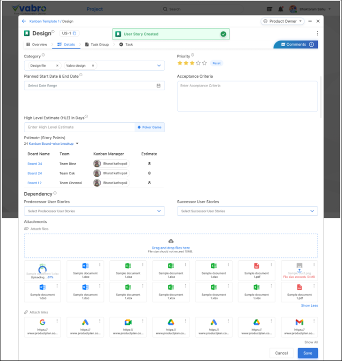

**Figura 9-9: Estimación de historias de usuario (fuente: Vabro)** 

La figura 9-10 muestra la visión de Jira de la estimación de historias de usuario. Permite a los equipos asignar puntos de historia y alinear las historias de usuario con los flujos de trabajo de planificación de sprints. 

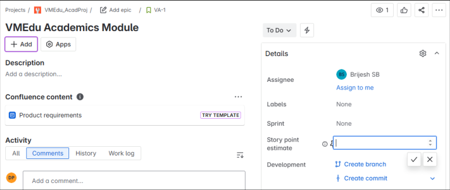

**Figura 9-10: Estimación de historias de usuario en Scrum (fuente: Jira)** 

©2025 SCRUMstudy™. _Una guía para el cuerpo de conocimiento de Scrum (Guía SBOK®)_ **227** 

9 – PLANIFICACIÓN Y ESTIMACIÓN 

#### **9.2.3 Salidas** 

##### **9.2.3.1 Historias de usuario estimadas *** 

Después de que las historias de usuario han sido estimadas por el Equipo Scrum con el uso de las distintas técnicas de estimación analizadas en esta sección, se ponen a consideración para ser historias de usuario estimadas. 

##### **9.2.3.2 Backlog priorizado del producto actualizado** 

Descrito en la sección 9.1.3.3. 

**228** ©2025 SCRUMstudy™. _Una guía para el cuerpo de conocimiento de Scrum (Guía SBOK®)_ 

9 – PLANIFICACIÓN Y ESTIMACIÓN 

**9** 

### **9.3 Comprometer historias de usuario** 

En este proceso, el Equipo Scrum se compromete a entregar una serie de historias de usuario en el sprint. Se compromete a desarrollar las historias con base en la prioridad relativa basada en valor de las historias de usuario, en el esfuerzo estimado y en la velocidad del equipo en un sprint. Como parte de este proceso, el Equipo Scrum empieza a crear el backlog del sprint que incluye las historias de usuario comprometidas que serán asignadas a un sprint específico. A medida que avanza el sprint, el backlog se refina aún más con detalles a nivel de cada tarea. 

Con este compromiso del Equipo Scrum, establecido al inicio de un sprint como parte de su planificación, queda definido el contenido del sprint y no puede cambiar una vez iniciada la fase de implementación del sprint. 

La figura 9-11 muestra todas las entradas, las herramientas y las salidas del proceso de _Comprometer historias de usuario_ . 

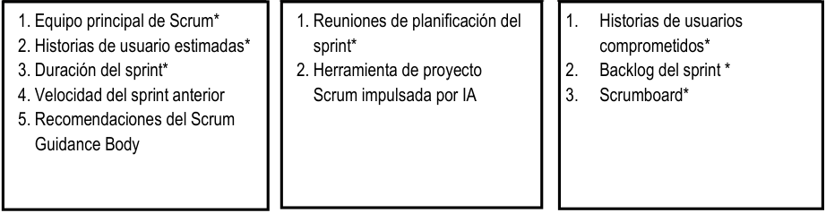

<!-- Start of picture text -->
1. Equipo principal de Scrum*  1. Reuniones de planificación del  1. Historias de usuarios 2. Historias de usuario estimadas*  sprint*  comprometidos* 3. Duración del sprint*  2. Herramienta de proyecto  2. Backlog del sprint * 4. Velocidad del sprint anterior  Scrum impulsada por IA  3. Scrumboard* 5. Recomendaciones del Scrum Guidance Body <!-- End of picture text -->

**Figura 9-11: Comprometer tareas: entradas, herramientas y salidas** 

_Nota: Los asteriscos (*) indican una entrada, herramientas o salida “obligatoria” para el proceso correspondiente._ 

©2025 SCRUMstudy™. _Una guía para el cuerpo de conocimiento de Scrum (Guía SBOK®)_ **229** 

9 – PLANIFICACIÓN Y ESTIMACIÓN 

La figura 9-12 muestra el diagrama de flujo de este proceso. 

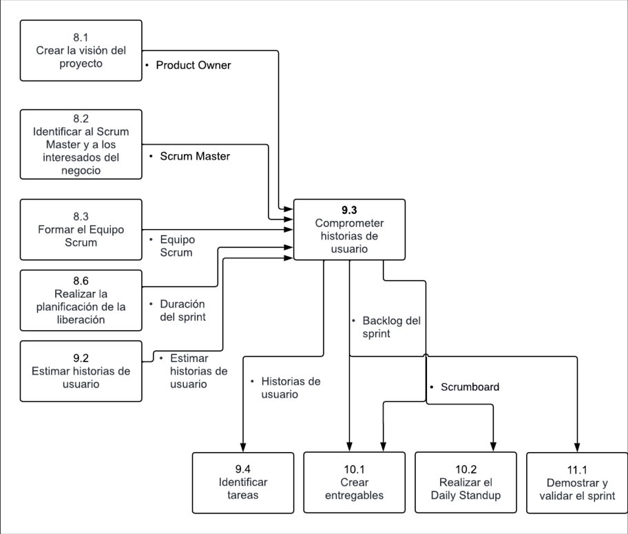

**Figura 9-12: Comprometer historias de usuario: diagrama de flujo** 

#### **9.3.1 Entradas** 

##### **9.3.1.1 Equipo principal de Scrum*** 

Descrito en la sección 3.3.1. 

- **9.3.1.2 Historias de usuario estimadas*** 

Descrito en la sección 9.2.3.1. 

##### **9.3.1.3 Duración del sprint*** 

Descrito en la sección 8.6.3.2. 

**230** ©2025 SCRUMstudy™. _Una guía para el cuerpo de conocimiento de Scrum (Guía SBOK®)_ 

9 – PLANIFICACIÓN Y ESTIMACIÓN 

**9** 

##### **9.3.1.4 Velocidad del sprint anterior** 

La velocidad del sprint es ritmo con el que el equipo puede completar el trabajo en un sprint. Por lo general se expresa en las mismas unidades que se utilizan para la estimación, normalmente en puntos de historia o tiempo ideal. Se lleva un registro de la velocidad del sprint del equipo para cada sprint y se utiliza como referencia para futuros sprints. La velocidad del sprint anterior se convierte en el factor más importante para determinar la cantidad del trabajo a la que se avocará el equipo en un subsecuente sprint. Cualquier cambio en la situación o en las condiciones desde el último sprint, se toma en cuenta para garantizar un cálculo preciso de la velocidad del sprint para el siguiente. 

##### **9.3.1.5 Recomendaciones del Scrum Guidance Body** 

En el proceso de _Comprometer historias de usuario_ , el Scrum Guidance Body puede incluir información sobre normas, regulaciones, estándares y las mejores prácticas necesarias para comprometer eficazmente las historias de usuario. Para obtener más información sobre las recomendaciones del Scrum Guidance Body, véase la sección 8.1.1.7. 

#### **9.3.2 Herramientas** 

##### **9.3.2.1 Reuniones de planificación del sprint*** 

En las reuniones de planificación del sprint, el Equipo Scrum se reúne para planificar el trabajo que se hará en el sprint. El Product Owner se encuentra presente durante las reuniones en caso de ser necesaria una aclaración relacionada a las historias de usuario o en las prioridades. El equipo revisa las historias de usuario que encabezan el backlog priorizado del producto. Para ayudar a garantizar que el equipo no se salga del tema, la reunión debe de tener un límite de tiempo (Time-box) con una duración estándar limitada de dos horas por semana de duración del sprint. Esto ayuda a prevenir la tendencia de desviarse hacia discusiones que deberían de realizarse en otras reuniones, tales como en las de planificación de la liberación o en reuniones de revisión del sprint. Como parte de esta reunión, todo el Equipo Scrum se comprometerá a entregar un subconjunto de historias de usuario del backlog priorizado del producto en el sprint. Estas historias de usuario comprometidas después se incorporan al backlog del sprint. Para obtener más información sobre las reuniones de planificación del sprint, véanse las secciones 9.2.2.1, 9.4.2.1, 9.5.2.1 y 9.6.2.1. 

##### **9.3.2.2 Herramienta de proyecto Scrum impulsada por IA** 

Descrito en la sección 2.4.4. 

©2025 SCRUMstudy™. _Una guía para el cuerpo de conocimiento de Scrum (Guía SBOK®)_ **231** 

9 – PLANIFICACIÓN Y ESTIMACIÓN 

#### **9.3.3 Salidas** 

##### **9.3.3.1 Historias de usuario comprometidas*** 

El Equipo Scrum se compromete a un subconjunto de historias de usuario estimadas que consideran que se pueden completar en el siguiente sprint con base en la velocidad. Las historias de usuario comprometidas se seleccionarán siempre según las prioridades definidas por el Product Owner tal como se incluyeron en el backlog priorizado del producto. 

##### **9.3.3.2 Backlog del sprint*** 

A la lista de tareas que desarrollará el Equipo Scrum en el siguiente sprint se le llama backlog del sprint. Es un subconjunto del backlog priorizado del producto e incluye las historias de usuario comprometidas que se asignan a un sprint específico. Esto se refina más con detalles a nivel de cada tarea a medida que avanza la planificación del sprint. 

Es común que las historias de usuario (y sus correspondientes tareas) del backlog del sprint estén representadas en un Scrumboard o tablero de tareas. Esto brinda una constante representación visual del estado de las historias de usuario en el backlog del producto. 

Una vez que el Equipo Scrum finaliza y se compromete al backlog del sprint, no se deben agregar nuevas historias de usuario. Si durante un sprint surgen nuevos requerimientos, estos serán agregados al backlog priorizado del producto y se incluirán en un futuro sprint. 

##### **9.3.3.3 Scrumboard*** 

Es importante dar seguimiento al proceso de un sprint y saber dónde se encuentra el Equipo Scrum en términos de conclusión de historias de usuario y tareas en el backlog del sprint. Se pueden utilizar varias herramientas para dar seguimiento al trabajo de un sprint, pero una de las más comunes es el Scrumboard, conocido también como tablero de tareas o gráfica de proceso. En Scrum, la transparencia se genera con herramientas de información visibles como el Scrumboard, que muestra el avance del equipo. El equipo utiliza el Scrumboard para planificar y dar seguimiento al avance durante cada sprint. 

La versión más básica de un Scrumboard se divide en tres secciones: Por hacer, o _To Do_ (conocido también como “Trabajo no iniciado”); Trabajo en proceso ( _In Progress)_ y Trabajo concluido ( _Completed Work_ ). Se colocan notas adhesivas en la categoría correspondiente para representar cada tarea o historia de usuario a fin de indicar el estado actual de las actividades. Se reacomodan en la siguiente categoría confirme avanza el trabajo. 

La figura 9-13 muestra un Scrumboard tradicional. Muestra todas las historias de usuario en la columna de la izquierda y tiene tres columnas con los encabezados: “Por hacer”, “En proceso” y “Terminada”. Las tareas se colocan en la columna respectiva a medida que se identifican y se desarrollan en futuros procesos. 

**232** ©2025 SCRUMstudy™. _Una guía para el cuerpo de conocimiento de Scrum (Guía SBOK®)_ 

9 – PLANIFICACIÓN Y ESTIMACIÓN 

**9** 

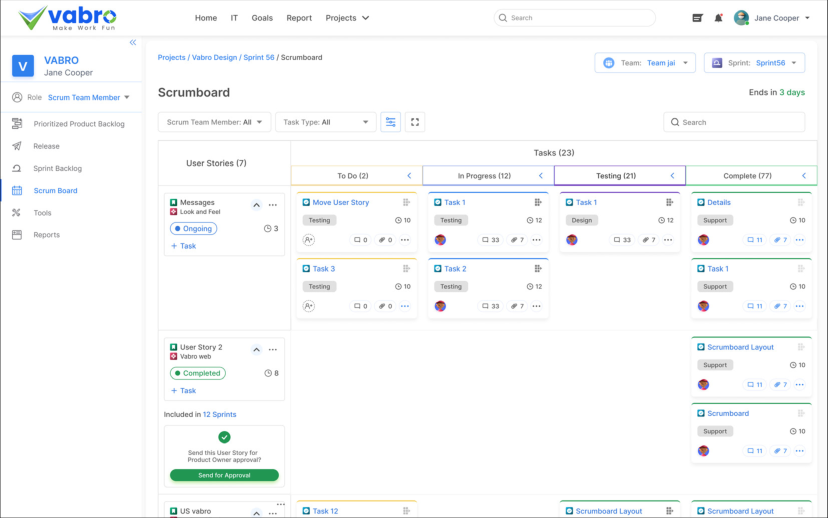

**Figura 9-13: Scrumboard típico (Fuente: Vabro)** 

Se pueden utilizar distintas variantes del Scrumboard tradicional a fin de mostrar debidamente el estatus del trabajo del equipo. Por ejemplo, una variante incluye una columna adicional “En prueba” para indicar que la tarea ya está terminada, pero que los resultados están en proceso de evaluación. La comuna “terminada” se utiliza para representar las tareas que se han concluido y evaluado satisfactoriamente. En vez de la columna “en prueba”, el equipo puede incluir cualquier otra columna que el equipo considere útil para dar seguimiento al avance. El Scrumboard de preferencia debe de mantenerse manualmente en papel o en un pizarrón, aunque también se puede hacer de manera electrónica en una hoja de cálculo o por medio de una herramienta de proyectos de Scrum. El Equipo Scrum debe cambiar o agregar tareas al Scrumboard según sea necesario a fin de que ofrezca información visual y control sobre el estatus del trabajo que se realiza (tal como lo acepto y lo comprometió el equipo). 

©2025 SCRUMstudy™. _Una guía para el cuerpo de conocimiento de Scrum (Guía SBOK®)_ **233** 

9 – PLANIFICACIÓN Y ESTIMACIÓN 

### **9.4 Identificar tareas** 

En este proceso, las historias de usuario comprometidas se desglosan en tareas específicas y se compilan en una lista de tareas. La identificación de tareas se puede hacer al inicio del sprint en todas las historias de usuario comprometidas o antes de que el equipo empiece a trabajar en las tareas requeridas en cada historia de usuario. 

El Product Owner no desempeña un rol activo en la creación de la lista de tareas, pero debe estar disponible para responder cualquier duda del Equipo Scrum que pudiera surgir al desglosar las historias de usuario. 

La figura 9-14 muestra todas las entradas, las herramientas y las salidas para el proceso de _Identificar tareas_ . 

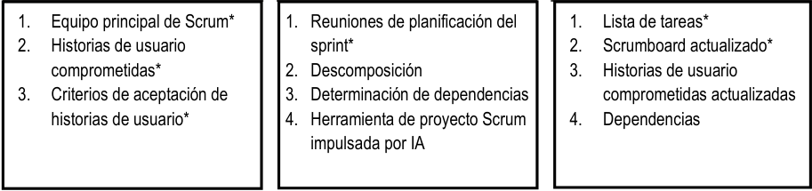

<!-- Start of picture text -->
1. Equipo principal de Scrum*  1. Reuniones de planificación del  1. Lista de tareas* 2. Historias de usuario  sprint*  2. Scrumboard actualizado* comprometidas*  2. Descomposición  3. Historias de usuario 3. Criterios de aceptación de  3. Determinación de dependencias  comprometidas actualizadas historias de usuario*  4. Herramienta de proyecto Scrum  4. Dependencias impulsada por IA <!-- End of picture text -->

**Figura 9-14: Identificar tareas: entradas, herramientas y salidas** 

_Nota: Los asteriscos (*) indican una entrada, herramientas o salida “obligatoria” para el proceso correspondiente._ 

**234** ©2025 SCRUMstudy™. _Una guía para el cuerpo de conocimiento de Scrum (Guía SBOK®)_ 

9 – PLANIFICACIÓN Y ESTIMACIÓN 

**9** 

La figura 9-15 muestra el diagrama de flujo de este proceso. 

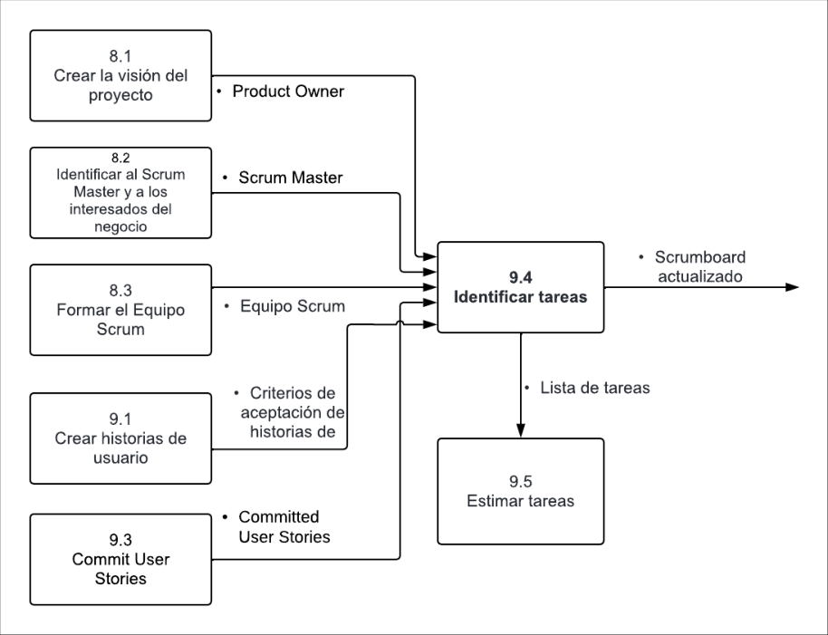

**Figura 9-15: Identificar tareas: diagrama de flujo** 

#### **9.4.1 Entradas** 

##### **9.4.1.1 Equipo principal de Scrum*** 

Descrito en la sección 3.3.1. 

##### **9.4.1.2 Historias de usuario comprometidas*** 

Descrito en la sección 9.3.3.1. 

##### **9.4.1.3 Criterios de aceptación de historia de usuario*** 

Descrito en la sección 9.1.3.2. 

©2025 SCRUMstudy™. _Una guía para el cuerpo de conocimiento de Scrum (Guía SBOK®)_ **235** 

9 – PLANIFICACIÓN Y ESTIMACIÓN 

El Product Owner debe asegurarse de que los criterios de aceptación definidos sean apropiados para las historias de usuario y que le expliquen los requerimientos al Equipo Scrum. Al entender los criterios de aceptación, el Equipo Scrum podrá decidir cuáles tareas son necesarias para cumplir con los requerimientos de la historia de usuario. 

Las pruebas de aceptación permiten evaluar la habilidad con la que cuenta el entregable finalizado para cumplir con sus criterios de aceptación. Esto brinda información al Product Owner para que pueda tomar la decisión de aprobar o rechazar los entregables. 

Los criterios de aceptación deben ser claros, sin ambigüedades y específicos. Deben definirse para garantizar que el equipo pueda verificar que los resultados estén en armonía con las metas y objetivos de la organización que patrocina. 

#### **9.4.2 Herramientas** 

##### **9.4.2.1 Reuniones de planificación del sprint*** 

En las reuniones de planificación del sprint, el Equipo Scrum se reúne para planear el trabajo a realizar en sprint. El equipo revisa cada historia de usuario comprometida en el sprint e identifica actividades accionables o las tareas necesarias para implementar los entregables necesarios para cumplir la historia de usuario y cumplir con los criterios de aceptación. El Product Owner se encuentra presente durante esta reunión en caso de que se necesita una aclaración sobre las historias de usuario comprometidas a fin de ayudar al equipo a tomar decisiones sobre diseño. Para conocer más detalles sobre las reuniones de planificación del sprint, véanse las secciones 9.2.2.1, 9.3.2.1, 9.5.2.1 y 9.6.2.1. 

##### **9.4.2.2 Descomposición** 

La descomposición es una herramienta para desglosar historias de usuario en tareas más detalladas para el sprint. Las historias de usuario deben estar suficientemente desglosadas para que le brinden al Equipo Scrum la información adecuada para crear entregables a partir de la lista de tareas. 

##### **9.4.2.3 Determinación de dependencias** 

Después de que el Equipo Scrum selecciona las historias de usuario en un determinado sprint, debe considerar las dependencias, incluyendo las relacionadas a la disponibilidad de personal y cualquier dependencia técnica. Documentar adecuadamente las dependencias ayuda a los equipos Scrum a determinar el orden relativo en el cual deben ejecutarse las tareas para crear los entregables del sprint. Las dependencias destacan también la relación e interacción entre las tareas dentro del Equipo Scrum que trabaja en un determinado Sprint y con otros equipos Scrum en el proyecto. Para obtener más detalles sobre la determinación de las dependencias, véase la sección 8.5.2.6. 

**236** ©2025 SCRUMstudy™. _Una guía para el cuerpo de conocimiento de Scrum (Guía SBOK®)_ 

9 – PLANIFICACIÓN Y ESTIMACIÓN 

**9** 

##### **9.4.2.4 Herramienta de proyecto Scrum impulsada por IA** 

Descrito en la sección 2.4.4. 

La Figura 9-16 muestra la interfaz de Vabro utilizada para crear tareas a partir de historias de usuario. Admite asignaciones de tareas, estimaciones y seguimiento de dependencias. 

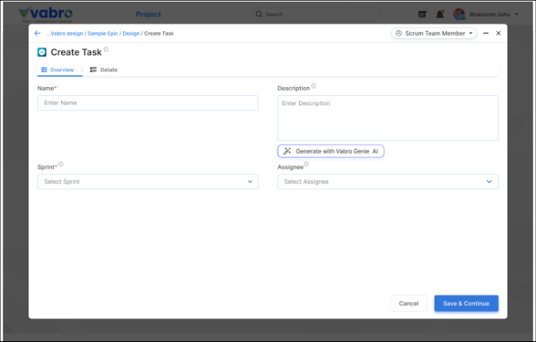

**Figura 9-16: Creación de tareas en la herramienta de proyecto Scrum (fuente: Vabro)** 

En la figura 9-17 se muestra la interfaz de creación de tareas de Jira, que permite a los equipos generar y gestionar tareas de sprint vinculadas a casos de usuario específicos. 

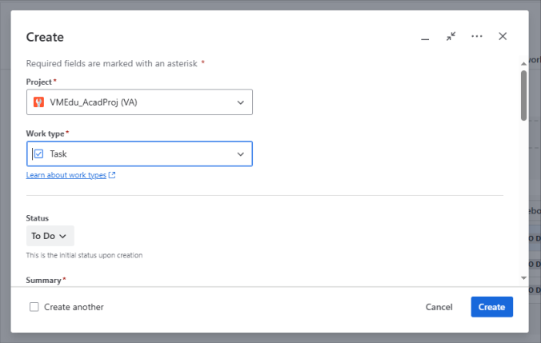

**Figura 9-77: Creación de tareas en la herramienta de proyecto Scrum (fuente: Jira)** 

©2025 SCRUMstudy™. _Una guía para el cuerpo de conocimiento de Scrum (Guía SBOK®)_ **237** 

9 – PLANIFICACIÓN Y ESTIMACIÓN 

#### **9.4.3 Salidas** 

##### **9.4.3.1 Lista de tareas*** 

La lista de tareas es una lista integral que contiene todas las tareas a las que se ha comprometido el Equipo Scrum en el actual sprint y sus correspondientes descripciones. El nivel de granularidad al que se desglosan las tareas lo decide el Equipo Scrum. La lista de tareas debe incluir cualquier prueba o actividad de integración a fin de que el incremento del producto del sprint pueda integrarse con éxito en los entregables de previos sprints. El Equipo Scrum utiliza la lista de tareas durante las reuniones de planificación del sprint para actualizar el backlog del sprint y crear el Sprint Burndown Chart. También se utiliza para decidir si el equipo debe reducir su compromiso o si puede trabajar en historias de usuario adicionales durante la planificación del sprint para el siguiente sprint. 

##### **9.4.3.2 Scrumboard actualizado*** 

A medida que se identifican las tareas, el Scrumboard se actualiza para que muestre las tareas asociadas a las historias de usuario. Las tareas generalmente se escriben en notas adhesivas en un Scrumboard físico o como entradas en la sección de historias de usuario en una herramienta electrónica de Scrum. Durante la implementación, a medida que el equipo agrega, asigna y actualiza las tareas que se están desarrollando, el Scrumboard se actualiza con las tareas adicionales y con su estatus. Si el equipo ha estimado las tareas, estas estimaciones también se muestran en el Scrumboard. 

En el ejemplo de la figura 9-18, el Scrumboard muestra que las historias de usuario 1, 2 y 3 han sido desglosadas en tareas, pero la historia 4 aún no ha sido desglosada en tareas. Al inicio de un sprint, todas las tareas de ese sprint se colocan en la columna “Por hacer” y avanzan subsecuentemente según su desarrollo. Por ejemplo, la historia 1 tiene siete tareas clasificadas en la columna “Por hacer”, que indica que el Equipo Scrum aún no empieza a trabajar en ellas. 

Para obtener más información sobre el Scrumboard, véanse las secciones 9.3.3.3 y 10.1.1.3. 

**238** ©2025 SCRUMstudy™. _Una guía para el cuerpo de conocimiento de Scrum (Guía SBOK®)_ 

9 – PLANIFICACIÓN Y ESTIMACIÓN 

**9** 

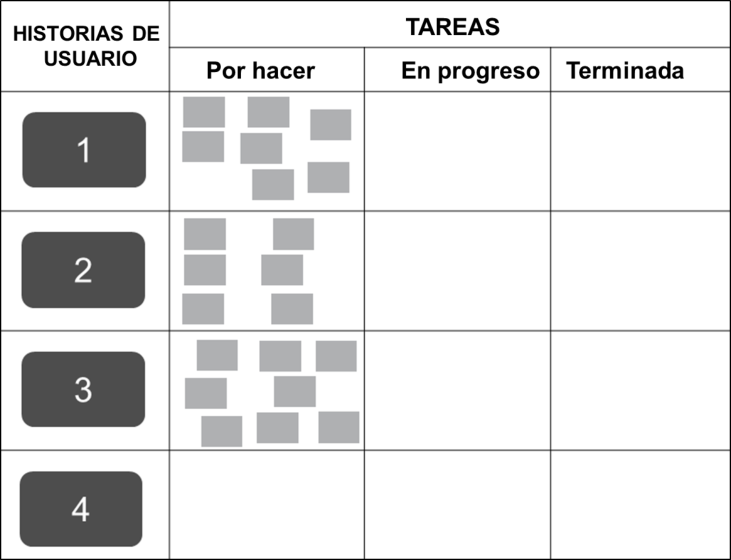

**Figura 9-18: Scrumboard con tareas identificadas** 

##### **9.4.3.3 Historias de usuario comprometidas actualizadas** 

Durante este proceso se actualizan las historias de usuario. Las actualizaciones pueden incluir modificaciones a las estimaciones de las historias de usuario con base en la creación de tareas y en factores de complejidad analizados durante la reunión de planificación del sprint. Las historias de usuario comprometidas se describen en la sección 9.3.3.1. 

##### **9.4.3.4 Dependencias** 

Las dependencias describen la relación y la interacción entre las distintas tareas en un proyecto y pueden clasificarse como obligatorias o discrecionales; internas o externas, tal como se describe en la sección 8.5.2.6. 

©2025 SCRUMstudy™. _Una guía para el cuerpo de conocimiento de Scrum (Guía SBOK®)_ **239** 

9 – PLANIFICACIÓN Y ESTIMACIÓN 

### **9.5 Estimar tareas** 

Este es un proceso opcional que implica crear estimaciones de las tareas en caso de que el Equipo Scrum vea algún valor en ello. En este proceso, el Equipo Scrum estima el esfuerzo necesario para hacer cada tarea en la lista. Las estimaciones de las tareas se pueden establecer al inicio del sprint para todas las historias de usuario o tareas relevantes en ese sprint, o bien, para cada tarea antes de que el equipo empiece a trabajar en una historia o tarea específica. La estimación se puede hacer con los mismos métodos utilizados en el proceso de _Estimar historias de usuario_ . 

La figura 9-19 muestra todas las entradas, las herramientas y las salidas para el proceso de _Estimar tareas_ . 

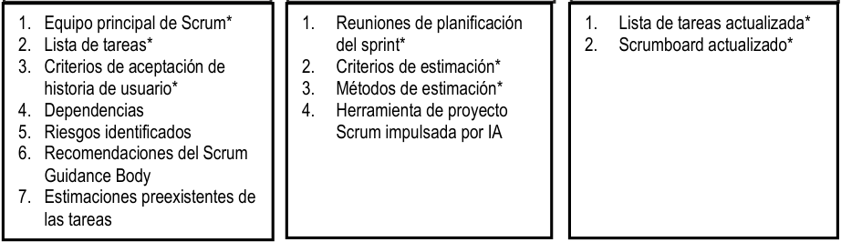

<!-- Start of picture text -->
1. Equipo principal de Scrum*  1. Reuniones de planificación  1. Lista de tareas actualizada* 2. Lista de tareas*  del sprint*  2. Scrumboard actualizado* 3. Criterios de aceptación de  2. Criterios de estimación* historia de usuario*  3. Métodos de estimación* 4. Dependencias  4. Herramienta de proyecto 5. Riesgos identificados  Scrum impulsada por IA 6. Recomendaciones del Scrum Guidance Body 7. Estimaciones preexistentes de las tareas <!-- End of picture text -->

**Figura 9-19: Estimar tareas: entradas, herramientas y salidas** 

_Nota: Los asteriscos (*) indican una entrada, herramientas o salida “obligatoria” para el proceso correspondiente._ 

**240** ©2025 SCRUMstudy™. _Una guía para el cuerpo de conocimiento de Scrum (Guía SBOK®)_ 

9 – PLANIFICACIÓN Y ESTIMACIÓN 

**9** 

La figura 9-20 muestra el diagrama de flujo de este proceso. 

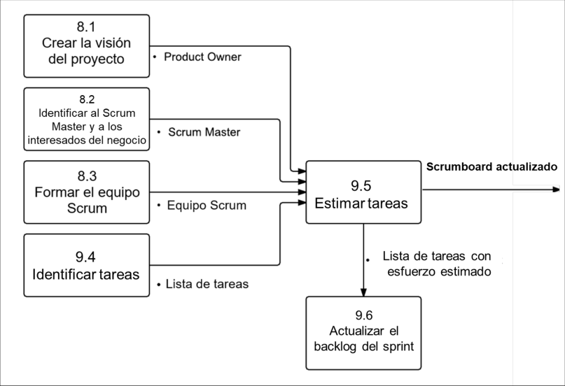

**Figura 9-20: Estimar tareas: Diagrama de flujo** 

#### **9.5.1 Entradas** 

##### **9.5.1.1 Equipo principal de Scrum*** 

Descrito en la sección 3.3.1. 

##### **9.5.1.2 Lista de tareas*** 

Descrito en la sección 9.4.3.1. 

##### **9.5.1.3 Criterios de aceptación de historias de usuario*** 

Cada historia de usuario tiene sus correspondientes criterios de aceptación. Debido a que las historias son subjetivas, los criterios de aceptación aportan la objetividad necesaria para que la historia de usuario se considere terminada o no terminada durante la revisión del sprint (durante el proceso de _Demostrar y validar el sprint_ ). Para obtener más información sobre los criterios de aceptación de las historias de usuario, véase la sección 9.1.3.2. 

©2025 SCRUMstudy™. _Una guía para el cuerpo de conocimiento de Scrum (Guía SBOK®)_ **241** 

9 – PLANIFICACIÓN Y ESTIMACIÓN 

##### **9.5.1.4 Dependencias** 

Descrito en la sección 9.4.3.4. 

##### **9.5.1.5 Riesgos identificados** 

Descrito en la sección 8.4.3.4. 

##### **9.5.1.6 Recomendaciones del Scrum Guidance Body** 

En el proceso de _Estimar tareas_ , las recomendaciones del Scrum Guidance Body puede incluir información sobre normas, regulaciones, estándares y mejores prácticas para estimar eficazmente las tareas en la lista de tareas. Para obtener más información sobre las recomendaciones del Scrum Guidance Body, véase la sección 8.1.1.7. 

##### **9.5.1.7 Estimaciones preexistentes de las tareas** 

Al estimar las tareas, el Equipo Scrum puede tomar en cuenta algunas estimaciones preexistentes. En proyectos anteriores o similares tal vez se realizaron tareas similares, y el esfuerzo y el tiempo requerido para estas tareas similares pueden ayudarle al Equipo Scrum a crear mejores estimaciones durante este proceso. Los expertos que anteriormente han implementado requerimientos de proyectos similares pudieran aportar algunas estimaciones sobre el esfuerzo para las tareas. Sin embargo, es importante asegurar que el Equipo Scrum elabore sus propias estimaciones en vez de depender únicamente de cualquier estimación preexistente. Las estimaciones preexistentes de las tareas también pueden ayudarle al Equipo Scrum a reevaluar el compromiso hecho ante el Product Owner al nivel de historia de usuario. 

#### **9.5.2 Herramientas** 

##### **9.5.2.1 Reuniones de planificación del sprint*** 

Como parte de las reuniones de planificación del sprint, el Equipo Scrum estima el esfuerzo necesario para completar una tarea o serie de tareas y estimar el esfuerzo en cuestión de personal y recursos necesario para llevar a cabo las tareas en un determinado sprint. Los miembros del Equipo Scrum utilizan la lista de tareas para estimar la duración y el esfuerzo para las historias de usuario que serán completadas en el sprint. Uno de los principales beneficios de esta técnica es que permite al equipo contar con una perspectiva compartida de las historias de usuario y los requerimientos de forma que pueda estimar de forma viable el esfuerzo requerido. Para obtener más información sobre las reuniones de planificación del sprint, véanse 3las secciones 9.2.2.1, 9.3.2.1, 9.4.2.1 y 9.6.2.1. 

**242** ©2025 SCRUMstudy™. _Una guía para el cuerpo de conocimiento de Scrum (Guía SBOK®)_ 

9 – PLANIFICACIÓN Y ESTIMACIÓN 

**9** 

##### **9.5.2.2 Criterios de estimación*** 

Los criterios de estimación pueden expresarse de muchas formas. Dos ejemplos comunes son los puntos de historia y el tiempo ideal. Los valores de puntos de historia se utilizan para representar el esfuerzo relativo o comparativo para completar tareas. Mientras que el tiempo ideal normalmente describe el número de horas que los miembros de un Equipo Scrum trabajan exclusivamente en el desarrollo de los entregables del proyecto sin incluir ningún tiempo dedicado a otras actividades o a trabajo ajeno al proyecto. Los criterios de estimación le facilitan al Equipo Scrum estimar el esfuerzo y le permiten evaluar y atender las ineficiencias cuando es necesario. 

##### **9.5.2.3 Métodos de estimación*** 

Los mismos métodos de estimación utilizados para estimar historias de usuario se pueden aplicar también a las tareas. Para obtener más información sobre los métodos de estimación, véase la sección 9.2.2.1. 

##### **9.5.2.4 Herramienta de proyecto Scrum impulsada por IA** 

Descrito en la sección 2.4.4. 

La Figura 9-21 muestra cómo Vabro facilita la estimación de tareas en scrum utilizando funciones impulsadas por IA. Incluye herramientas de sugerencia automatizadas y entradas de estimación de esfuerzo para que los equipos de scrum planifiquen de manera más efectiva. 

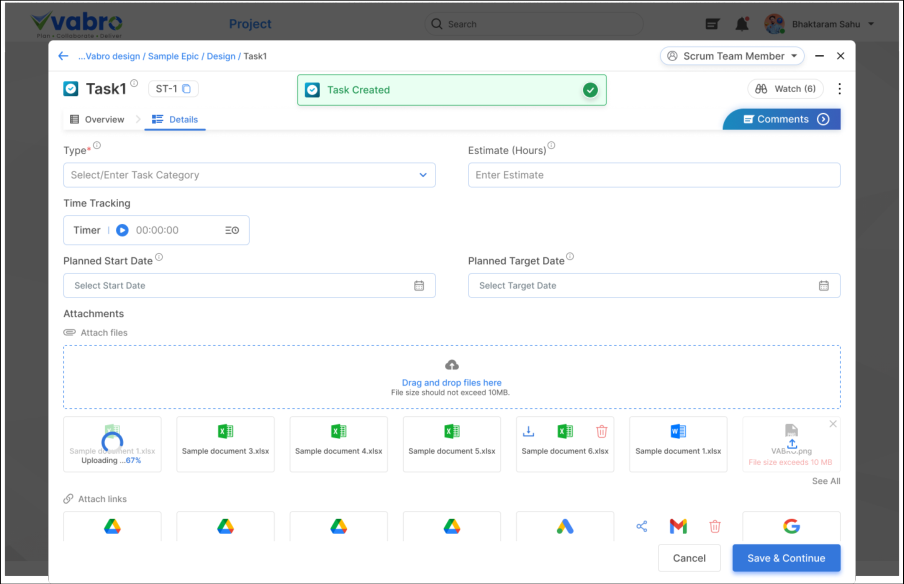

**Figura 9-8: Estimación de tareas en Scrum (fuente: Vabro)** 

©2025 SCRUMstudy™. _Una guía para el cuerpo de conocimiento de Scrum (Guía SBOK®)_ **243** 

9 – PLANIFICACIÓN Y ESTIMACIÓN 

En la figura 9-22 se muestra la interfaz de estimación de tareas de Jira. Incluye elementos visuales para introducir datos de tareas, ver estimaciones y realizar un seguimiento del esfuerzo del sprint. Ayuda a agilizar el proceso de planificación mediante la colaboración en tiempo real. 

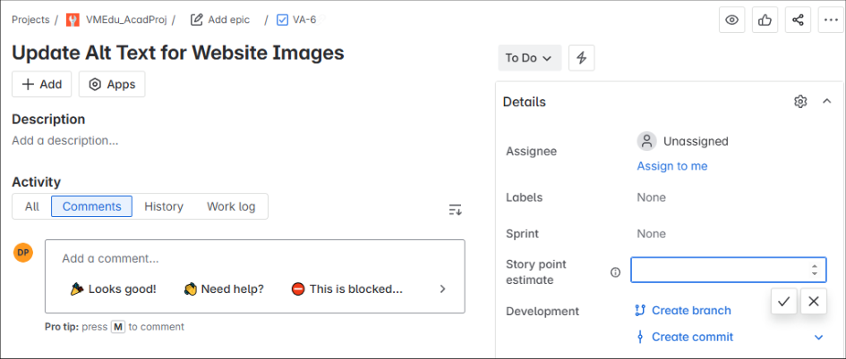

**Figura 9-9: Uso de la herramienta Scrum para la estimación de tareas (fuente: Jira)** 

#### **9.5.3 Salidas** 

##### **9.5.3.1 Lista de tareas actualizada*** 

La lista de tareas se actualiza para incluir el esfuerzo estimado que se estableció mediante las actividades detalladas de estimación en el proceso de _Estimar tareas_ . También se pueden presentar reestimaciones que resulten de los cambios en el conocimiento colectivo del Equipo Scrum sobre las historias de usuario y los requerimientos. El esfuerzo estimado se expresa en términos de los criterios de estimación acordados por el equipo. La precisión de las estimaciones generalmente varía según las habilidades del equipo. El Equipo Scrum utiliza la lista actualizada de tareas durante las reuniones de planificación del sprint a fin para actualizar el backlog del sprint y crear el Sprint Burndown Chart. Se utiliza también para determinar cuándo el equipo necesita reducir su compromiso o recoger historias de usuario adicionales durante la planificación del siguiente sprint. 

##### **9.5.3.2 Scrumboard actualizado*** 

A medida que se estiman las tareas, las estimaciones del esfuerzo se actualizan en el Scrumboard. Para obtener más información sobre el Scrumboard, véanse las secciones 9.3.3.3 y 9.4.3.2. 

**244** ©2025 SCRUMstudy™. _Una guía para el cuerpo de conocimiento de Scrum (Guía SBOK®)_ 

9 – PLANIFICACIÓN Y ESTIMACIÓN 

**9** 

### **9.6 Actualizar el backlog del sprint** 

En este proceso, el equipo principal de Scrum actualiza el backlog del sprint con detalles de las tareas y las estimaciones de las tareas (si cuenta con ellas). El backlog del sprint actualizado se utiliza en la fase de implementación para darle seguimiento al avance del equipo durante el sprint. 

La figura 9-23 muestra todas las entradas, herramientas y salidas del proceso de _Actualizar el_ _<mark>backlog del sprint</mark>_ . 

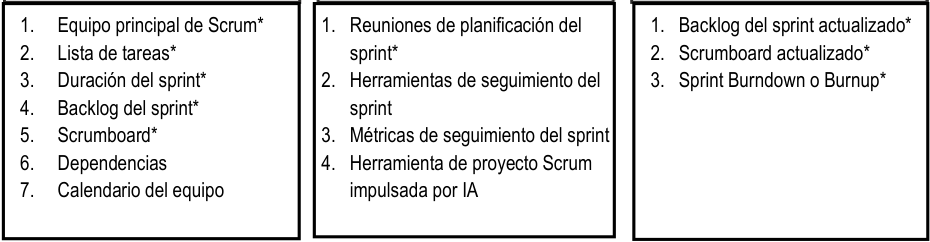

<!-- Start of picture text -->
1. Equipo principal de Scrum*  1. Reuniones de planificación del  1. Backlog del sprint actualizado* 2. Lista de tareas*  sprint*  2. Scrumboard actualizado* 3. Duración del sprint*  2. Herramientas de seguimiento del  3. Sprint Burndown o Burnup* 4. Backlog del sprint*  sprint 5. Scrumboard*  3. Métricas de seguimiento del sprint 6. Dependencias  4. Herramienta de proyecto Scrum 7. Calendario del equipo  impulsada por IA <!-- End of picture text -->

**Figura 9-23: Actualizar el backlog del sprint: entradas, herramientas y salidas** 

_Nota: Los asteriscos (*) indican una entrada, herramientas o salida “obligatoria” para el proceso correspondiente._ 

©2025 SCRUMstudy™. _Una guía para el cuerpo de conocimiento de Scrum (Guía SBOK®)_ **245** 

9 – PLANIFICACIÓN Y ESTIMACIÓN 

La figura 9-24 muestra el diagrama de flujo de este proceso. 

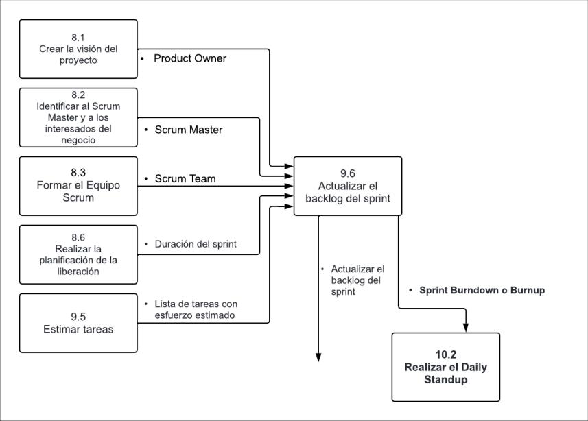

**Figura 9-24: Actualizar el backlog del sprint: diagrama de flujo** 

#### **9.6.1 Entradas** 

##### **9.6.1.1 Equipo principal de Scrum*** 

Descrito en la sección 3.3.1. 

##### **9.6.1.2 Lista de tareas*** 

Descrito en la sección 9.5.3.1 

##### **9.6.1.3 Duración del sprint*** 

Descrito en la sección 8.6.3.2. 

##### **9.6.1.4 Backlog del sprint** 

Descrito en la sección 9.3.3.2. 

**246** ©2025 SCRUMstudy™. _Una guía para el cuerpo de conocimiento de Scrum (Guía SBOK®)_ 

9 – PLANIFICACIÓN Y ESTIMACIÓN 

**9** 

##### **9.6.1.5 Scrumboard*** 

Descrito en la sección 9.3.3.3. 

##### **9.6.1.6 Dependencias** 

Descrito en la sección 9.4.3.4. 

##### **9.6.1.7 Calendario del equipo** 

El calendario del equipo contiene información sobre la disponibilidad de los miembros, incluyendo información relacionada a las vacaciones de los empleados, licencias, ausencias temporales y días festivos. Uno de los principales objetivos del uso del calendario del equipo es dar seguimiento al trabajo que realiza cada integrante del equipo durante el proyecto. Ayuda al equipo no solo a planificar y llevar a cabo eficientemente los sprints, sino a armonizarlos con las fechas de liberación. 

#### **9.6.2 Herramientas** 

##### **9.6.2.1 Reuniones de planificación del sprint*** 

Durante las reuniones de planificación del sprint, el Equipo Scrum se compromete a las historias de usuario en un sprint e identifica y estima las tareas. Cada miembro del Equipo Scrum también utiliza la lista de tareas con esfuerzo estimado para seleccionar las tareas en las que planean trabajar en el sprint con base en sus habilidades y experiencia. El Equipo Scrum elabora también el backlog del sprint y el Sprint Burndown Chart utilizando las historias de usuario y la lista antes mencionada durante las reuniones de planificación del sprint. Para conocer más detalles sobre las reuniones de planificación del sprint, véanse las secciones 9.2.2.2, 9.3.2.1, 9.4.2.1 y 9.5.2.1. 

##### **9.6.2.2 Herramientas de seguimiento del sprint** 

Es importante dar seguimiento al proceso de un sprint y saber dónde se encuentra el Equipo Scrum con relación al avance de las tareas en el backlog del sprint. Se pueden utilizar varias herramientas para dar seguimiento al trabajo de un sprint, pero una de las más comunes es Scrumboard, conocido también como tablero de tareas o gráfica de proceso. Para conocer más detalles sobre el Scrumboard, véanse las secciones 9.3.3.3 y 9.4.3.2. 

##### **9.6.2.3 Métricas de seguimiento del sprint** 

Las métricas que se utilizan en los proyectos Scrum incluyen la velocidad, el valor de negocio entregado y la cantidad de historias. 

©2025 SCRUMstudy™. _Una guía para el cuerpo de conocimiento de Scrum (Guía SBOK®)_ **247** 

9 – PLANIFICACIÓN Y ESTIMACIÓN 

- **Velocidad:** Representa el número de historias de usuario o de funcionalidades entregadas en un solo sprint. 

- **Valor de negocio entregado:** Mide el valor de las historias de usuario entregadas desde la perspectiva del negocio. 

- **Número de historias:** Describe cuántas historias de usuario se entregan como parte de un solo sprint. Se puede expresar en términos de un simple conteo o de un conteo ponderado. 

##### **9.6.2.4 Herramienta de proyecto Scrum impulsada por IA** 

###### Descrito en la sección 2.4.4 

La figura 9-25 muestra cómo configurar el trabajo pendiente de sprint en Vabro. Muestra la categorización visual de las tareas, los niveles de prioridad y las opciones de asignación para prepararse para la ejecución del sprint. 

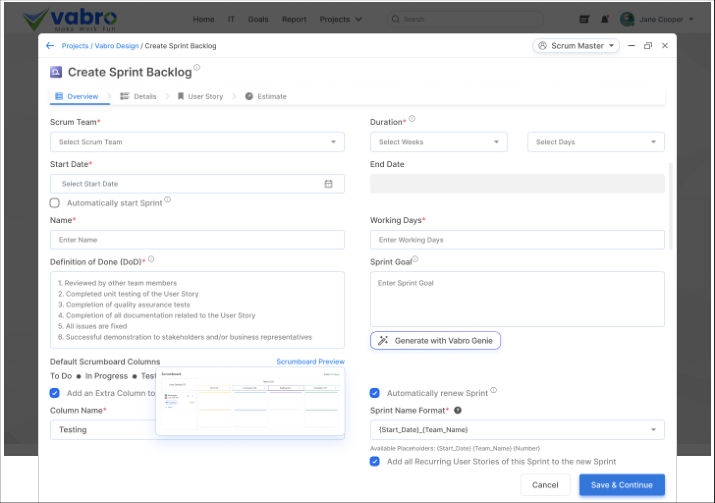

**Figura 9-2510: Configuración del Sprint Backlog en Scrum (Fuente: Vabro)** 

La figura 9-26 ilustra la interfaz de Jira para usar el backlog de sprint. Incluye el filtrado, la priorización y la vinculación de tareas a casos de usuario para una gestión fluida del trabajo pendiente. 

**248** ©2025 SCRUMstudy™. _Una guía para el cuerpo de conocimiento de Scrum (Guía SBOK®)_ 

9 – PLANIFICACIÓN Y ESTIMACIÓN 

**9** 

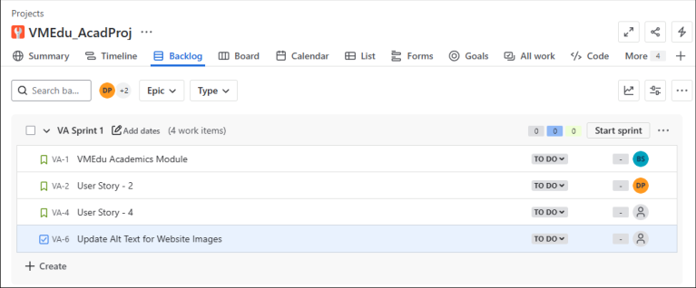

**Figura 9-2611: Uso del backlog de sprint en la herramienta de proyecto Scrum (fuente: Jira)** 

#### **9.6.3 Salidas** 

##### **9.6.3.1 Backlog del sprint actualizado*** 

El equipo principal de Scrum actualiza el backlog del sprint con los detalles de las tareas asociadas a las historias de usuario comprometidas en dicho backlog. Si se cuentan con estimaciones de las tareas, estas también se actualizan en el backlog del sprint. El backlog del sprint actualizado se utilizará en la fase de implementación para dar seguimiento al avance del equipo durante el sprint. 

Una vez que el Equipo Scrum finaliza y se compromete al backlog del sprint no se deben agregar nuevas historias de usuario; sin embargo, las tareas que pudieron haberse pasado por alto o ignoradas de las historias de usuario comprometidas pudieran ser agregadas. Si durante un sprint surgen nuevos requerimientos, estos serán agregados al backlog priorizado del producto e incluidos en un futuro sprint. 

##### **9.6.3.2 Scrumboard actualizado*** 

El Scrumboard se actualiza para que muestre la información del backlog del sprint actualizado, incluyendo tareas, su estatus y estimaciones en caso de que estén disponibles. Para conocer más detalles sobre el Scrumboard, véanse las secciones 9.3.3.3 y 9.4.3.2. 

##### **9.6.3.3 Sprint Burndown Chart*** 

Los _burn charts_ ( _burndown_ o _burnup_ ) se utilizan para darle seguimiento al avance de un proyecto de Scrum. Un _burndown chart_ es una gráfica que muestra la cantidad de trabajo pendiente con relación al tiempo restante. A diferencia del _burndown chart_ , una gráfica _burnup_ muestra lo que se ha terminado con relación al tiempo restante. Las gráficas _burn charts_ se utilizan en la fase de implementación para darle seguimiento al avance del Equipo Scrum durante un sprint y para ver con anticipación si el equipo podrá terminar todas las historias de usuario a las que se comprometió en ese sprint. 

©2025 SCRUMstudy™. _Una guía para el cuerpo de conocimiento de Scrum (Guía SBOK®)_ **249** 

9 – PLANIFICACIÓN Y ESTIMACIÓN 

Si los miembros del equipo consideran que no podrán terminar todas las tareas a las que se comprometieron, pueden tomar medidas a tiempo durante el sprint a fin de lograr el mejor resultado posible. 

El primer _Sprint Burndown Chart_ muestra la forma en la que el equipo visualiza el desempeño de su trabajo. Debido a que el equipo recién se comprometió a trabajar en una serie de historias de usuario y en las tareas correspondientes en el sprint en curso, y debido a que se espera que el equipo cumpla con su compromiso, el primer _burndown_ muestra que, en el último día del sprint, no habrá nada pendiente. Esto significa que todo el trabajo quedará terminado para el último día. El equipo debe actualizar el _burndown chart_ al final de cada día para que muestre el avance a medida que se termina el trabajo. 

La figura 9-27 muestra un ejemplo de un Sprint Burndown Chart: 

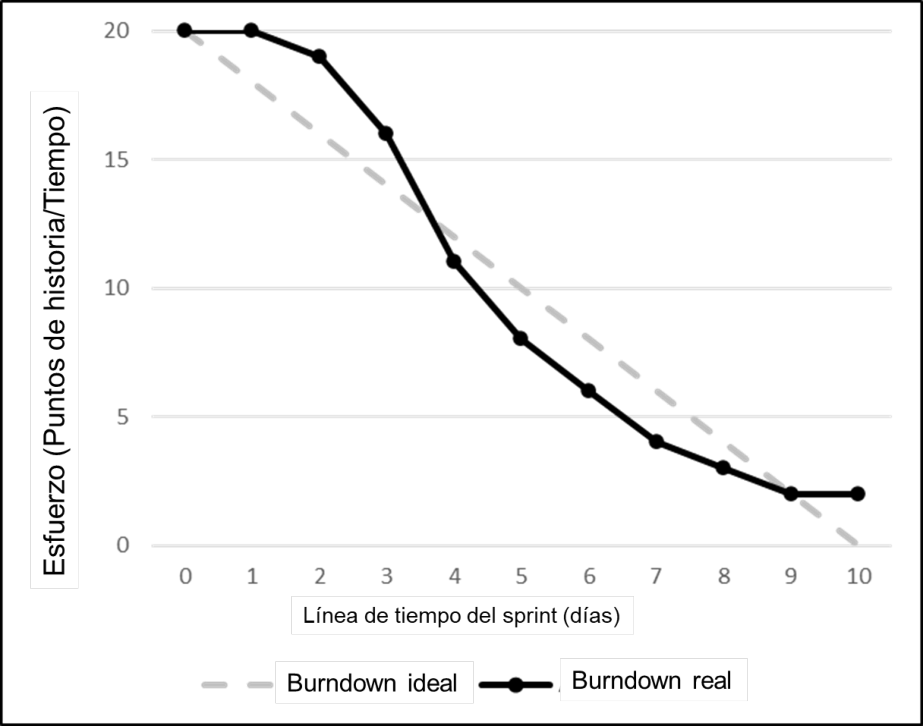

**Figura 9-27: Sprint Burndown Chart** 

**250** ©2025 SCRUMstudy™. _Una guía para el cuerpo de conocimiento de Scrum (Guía SBOK®)_ 

9 – PLANIFICACIÓN Y ESTIMACIÓN 

**9** 

La figura 9-28 muestra un ejemplo de un Sprint Burnup Chart: 

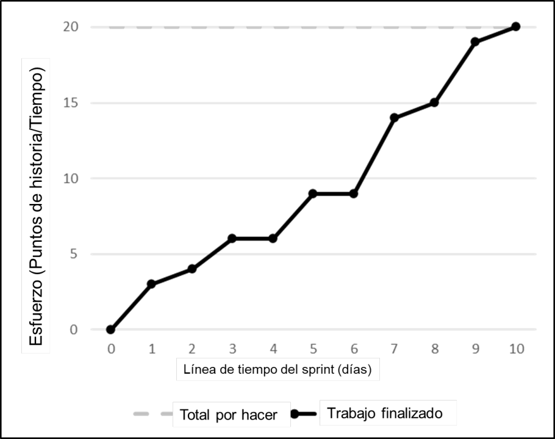

**Figura 9-28: Sprint Burnup Chart** 

El _burndown chart_ se puede actualizar muy fácilmente, no solo para indicar el avance, sino para ajustar cualquier estimación de esfuerzo. A diferencia del _burnup chart_ , el _burndown_ brinda una mejor indicación de cualquier posible desajuste entre el esfuerzo pendiente y el tiempo restante. Por lo tanto, muy pocos equipos utilizan el _burnup chart_ para dar seguimiento a su avance durante un sprint. 

©2025 SCRUMstudy™. _Una guía para el cuerpo de conocimiento de Scrum (Guía SBOK®)_ **251** 

9 – PLANIFICACIÓN Y ESTIMACIÓN 

### **9.7 Diagrama de flujo de la fase de planificación y estimación** 

La figura 9-29 muestra el diagrama de flujo de la fase de planificación y estimación. 

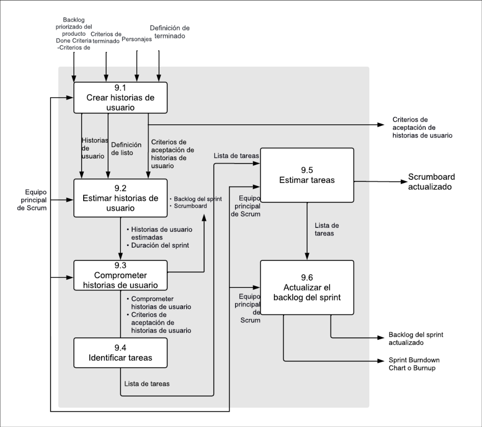

**Figura 9-29: Fase de planificación y estimación: diagrama de flujo** 

**252** ©2025 SCRUMstudy™. _Una guía para el cuerpo de conocimiento de Scrum (Guía SBOK®)_ 

10 – IMPLEMENTACIÓN 

**10** 

## **10. IMPLEMENTACIÓN** 

La fase de implementación está relacionada a la ejecución de las tareas y actividades para crear el producto de un proyecto. Estas actividades incluyen la creación de varios entregables, realizar el Daily Standup y el refinamiento (revisiones, ajustes y actualización periódica) del backlog priorizado del producto en intervalos frecuentes. 

<mark>La implementación, tal como se define en la</mark> _<mark>Guía de los fundamentos de Scrum (Guía del SBOK</mark>__®_ _<mark>)</mark>_ <mark>, es aplicable a los siguientes:</mark> 

- <mark>Portafolios, programas o proyectos en cualquier industria;</mark> 

- <mark>Productos, servicios o cualquier otro resultado que se entregará a los</mark> interesados del negocio; 

- <mark>Proyectos de cualquier tamaño o complejidad.</mark> 

<mark>El término “producto” en la</mark> _<mark>Guía del SBOK</mark>__®_ <mark>puede referirse a un producto, servicio, o cualquier otro entregable. Scrum se puede aplicar de manera efectiva a cualquier proyecto en cualquier industria: desde proyectos o equipos pequeños con tan solo seis miembros, hasta proyectos grandes y complejos con cientos de miembros.</mark> 

Para facilitar la mejor aplicación del marco de trabajo de Scrum, en este capítulo se identifican las entradas, herramientas y salidas de cada proceso, ya sea como “obligatorias” u “opcionales”. Las entradas, herramientas y salidas indicadas con asteriscos (*) son obligatorias o se consideran importantes para el éxito, mientras que las que no tienen asteriscos son opcionales. 

Se recomienda que el Equipo Scrum y aquellas personas que empiezan a aprender sobre el marco de trabajo y los procesos de Scrum, se enfoquen principalmente en las entradas, herramientas y salidas obligatorias; mientras que los Product Owners, Scrum Masters y demás practicantes con experiencia en Scrum, se deberían de esforzar por alcanzar un conocimiento más a fondo sobre la información ofrecida en este capítulo. 

<mark>Este capítulo está escrito desde la perspectiva de un Equipo Scrum que trabaja en un sprint para producir entregables que pudieran ser parte de un proyecto más grande, de un programa o portafolio. La información sobre cómo escalar Scrum en grandes proyectos está disponible en el capítulo 13 y lo relacionado a escalar Scrum para la empresa se puede encontrar en el capítulo 14.</mark> 

<mark>La implementación es la segunda de las tres fases que se hacen repetidamente en cada sprint. Esta fase inicia después de la planificación del sprint. Es el núcleo de cada proyecto de Scrum donde se hace la mayor parte del trabajo.</mark> 

<mark>El Equipo Scrum, con la ayuda del Scrum Master, elabora los entregables asociados a las historias de usuario comprometidas y trabaja en las tareas identificadas en la fase anterior.</mark> 

Mientras el Equipo Scrum trabaja en la creación de los entregables del sprint, el Product Owner refina el backlog priorizado del producto para mantenerlo actualizado con cualquier cambio en los requerimientos o en las prioridades, asegurando así que la serie de historias de usuario que le solicitó al Equipo Scrum para el siguiente sprint estén listas para su desarrollo. 

También es importante destacar que, aunque todos los procesos se definen de forma única en la _<mark>Guía del SBOK</mark>__®_ _<mark>,</mark>_ no necesariamente se llevan a cabo de forma secuencial o por separado. En ocasiones, puede ser más apropiado combinar algunos procesos, dependiendo de los requisitos específicos de cada proyecto. 

©2025 SCRUMstudy™. _Una guía para el cuerpo de conocimiento de Scrum (Guía SBOK®)_ **253** 

10 – IMPLEMENTACIÓN 

<mark>La figura 10-1 brinda una descripción general de los procesos en la fase de implementación, que son los siguientes:</mark> 

**10.1 Crear entregables:** En este proceso, el Equipo Scrum crea los entregables del sprint trabajando en las tareas del backlog del sprint. Este es el proceso en el que el Equipo Scrum y el Scrum Master dedican la mayor parte de su tiempo. El Scrum Master ayuda al equipo y facilita las reuniones, atiende los impedimentos que enfrenta el equipo y hace todo lo que posible para que los miembros del Equipo Scrum se enfoquen en la creación de los entregables del sprint. 

El Equipo Scrum utiliza un Scrumboard para dar seguimiento a su avance durante el sprint. El equipo utiliza la información sobre su avance como un buen indicador de la capacidad con la que cuenta para dar resultados según su compromiso y, de ser necesario, tomar medidas para garantizar el mejor resultado posible del sprint dadas las circunstancias. 

**10.2 Realizar el Daily Standup:** En este proceso se lleva a cabo una reunión altamente focalizada llamada Daily Standup. Esta reunión tiene un límite de tiempo y es un foro para que el Equipo Scrum se ponga al día sobre su avance y contestan tres preguntas específicas sobre cualquier impedimento que pudieran enfrentar sus integrantes. 

**10.3 Refinar el backlog priorizado del producto:** En este proceso, el Product Owner constantemente actualiza y refina el backlog priorizado del producto. Se puede celebrar una reunión de revisión del backlog priorizado del producto, donde los cambios y actualizaciones al backlog se analizan y se incorporan al backlog priorizado del producto, según corresponda. 

A fin de mantener el backlog al día con cualquier cambio en los requerimientos o prioridades, el Product Owner trabaja constantemente con el cliente y otros interesados del negocio para obtener y entender cualquier cambio en sus necesidades. 

A fin de asegurar que la serie de historias de usuario que el Product Owner busca que el equipo elabore en el siguiente sprint esté lista para su compromiso, el Product Owner refina las épicas e historias de usuario existentes en el backlog priorizado del producto y se asegura de que las historias satisfagan la definición de listo. 

Como parte del refinamiento del backlog priorizado del producto, el Product Owner también trabaja con el Equipo Scrum para conocer la opinión y las preguntas relacionadas a las actualizaciones en el backlog priorizado del producto con la posibilidad de incluir estimaciones. 

Si los cambios en los requerimientos o en el avance general del Equipo Scrum requieren de cambios en el cronograma de liberación o en la justificación del negocio, el Product Owner también realizará estos cambios en este proceso. 

Este es el proceso al que el Product Owner dedica la mayor parte de su tiempo. 

**254** ©2025 SCRUMstudy™. _Una guía para el cuerpo de conocimiento de Scrum (Guía SBOK®)_ 

10 – IMPLEMENTACIÓN 

**10** 

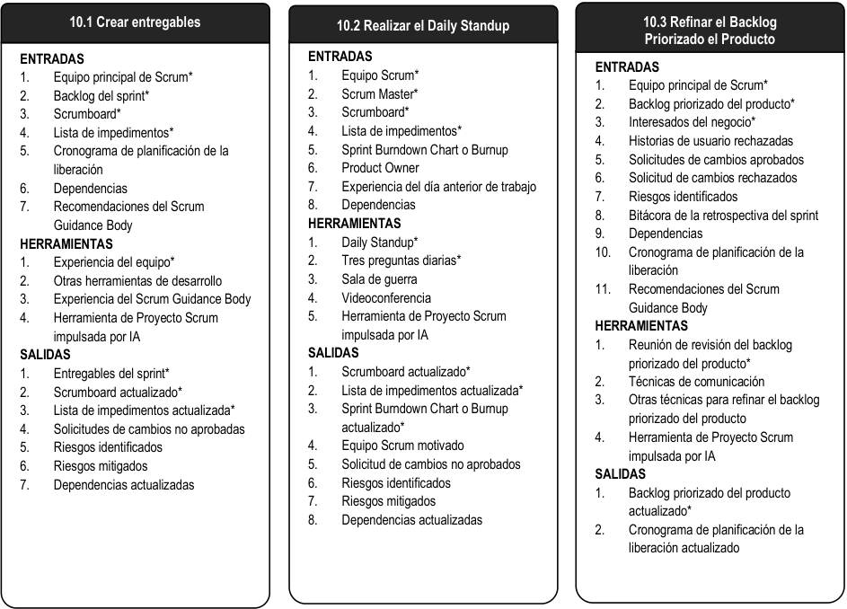

<!-- Start of picture text -->
10.1 Crear entregables  10.2 Realizar el Daily Standup  10.3 Refinar el Backlog Priorizado el Producto ENTRADAS  ENTRADAS ENTRADAS 1. Equipo principal de Scrum*  1. Equipo Scrum*  1. Equipo principal de Scrum* 2. Backlog del sprint*  2. Scrum Master*  2. Backlog priorizado del producto* 3. Scrumboard*  3. Scrumboard* 4. Lista de impedimentos*  4. Lista de impedimentos*  3.4. Interesados del negocio* Historias de usuario rechazadas 5. Cronograma de planificación de la  5. Sprint Burndown Chart o Burnup  5. Solicitudes de cambios aprobados liberación   6. Product Owner 6. Solicitud de cambios rechazados 6. Dependencias  7. Experiencia del día anterior de trabajo  7. Riesgos identificados 7. Recomendaciones del Scrum  8. Dependencias 8. Bitácora de la retrospectiva del sprint Guidance Body  HERRAMIENTAS  9. Dependencias HERRAMIENTAS  1. Daily Standup* 1. Experiencia del equipo*  2. Tres preguntas diarias*   10. Cronograma de planificación de la liberación 2. Otras herramientas de desarrollo   3. Sala de guerra 11. Recomendaciones del Scrum 3. Experiencia del Scrum Guidance Body  4. Videoconferencia Guidance Body 4. Herramienta de Proyecto Scrum  5. Herramienta de Proyecto Scrum  HERRAMIENTAS impulsada por IA  impulsada por IA  1. Reunión de revisión del backlog SALIDAS  SALIDAS 1. Entregables del sprint*  1. Scrumboard actualizado*  2. priorizado del producto* Técnicas de comunicación 2. Scrumboard actualizado*  2. Lista de impedimentos actualizada* 3. Otras técnicas para refinar el backlog 3. Lista de impedimentos actualizada*  3. Sprint Burndown Chart o Burnup priorizado del producto 5.4. Riesgos identificados Solicitudes de cambios no aprobadas   4. actualizado*  Equipo Scrum motivado  4. Herramienta de Proyecto Scrum impulsada por IA 6. Riesgos mitigados   5. Solicitud de cambios no aprobados  SALIDAS 7. Dependencias actualizadas  6.7. Riesgos identificados Riesgos mitigados   1. Backlog priorizado del producto actualizado* 8. Dependencias actualizadas 2. Cronograma de planificación de la liberación actualizado <!-- End of picture text -->

**Figura 10-1: Información general de la fase de implementación** 

_Nota: Los asteriscos (*) indican una entrada, herramientas o salida “obligatoria” para el proceso correspondiente._ 

©2025 SCRUMstudy™. _Una guía para el cuerpo de conocimiento de Scrum (Guía SBOK®)_ **255** 

10 – IMPLEMENTACIÓN 

La figura 10-2 muestra las entradas, herramientas y salidas obligatorias para los procesos en la fase de implementación. 

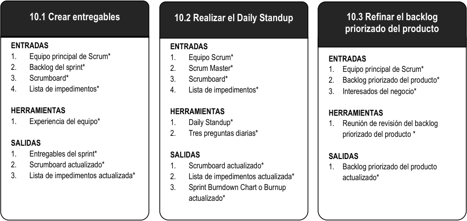

<!-- Start of picture text -->
10.1 Crear entregables  10.2 Realizar el Daily Standup  10.3 Refinar el backlog priorizado del producto ENTRADAS  ENTRADAS 1. Equipo principal de Scrum*  1. Equipo Scrum*  ENTRADAS 2. Backlog del sprint*  2. Scrum Master*  1. Equipo principal de Scrum* 3. Scrumboard*  3. Scrumboard*  2. Backlog priorizado del producto* 4. Lista de impedimentos*  4. Lista de impedimentos*  3. Interesados del negocio* HERRAMIENTAS  HERRAMIENTAS  HERRAMIENTAS 1. Experiencia del equipo*  1. Daily Standup*  1. Reunión de revisión del backlog 2. Tres preguntas diarias*   priorizado del producto * SALIDAS 1. Entregables del sprint*  SALIDAS SALIDAS 2. Scrumboard actualizado*  1. Scrumboard actualizado*  1. Backlog priorizado del producto 3. Lista de impedimentos actualizada*  2. Lista de impedimentos actualizada*  actualizado* 3. Sprint Burndown Chart o Burnup actualizado* <!-- End of picture text -->

**Figura 10-2: Información general de la fase de implementación (fundamentales)** 

_Nota: Los asteriscos (*) indican una entrada, herramientas o salida “obligatoria” para el proceso correspondiente._ 

**256** ©2025 SCRUMstudy™. _Una guía para el cuerpo de conocimiento de Scrum (Guía SBOK®)_ 

10 – IMPLEMENTACIÓN 

**10** 

### **10.1 Crear entregables** 

En este proceso, el Equipo Scrum crea los entregables del sprint trabajando en las tareas del backlog del sprint. Este es el proceso en el que el Equipo Scrum y el Scrum Master dedican la mayor parte de su tiempo. El Scrum Master ayuda al equipo y facilita las reuniones, atiende los impedimentos que enfrenta el equipo y hace todo lo que posible para que los miembros del Equipo Scrum se enfoquen en la creación de los entregables del sprint. 

El Equipo Scrum utiliza un Scrumboard para dar seguimiento a su avance durante el sprint. El equipo utiliza la información sobre su avance como un buen indicador de la capacidad con la que cuenta para dar resultados según su compromiso y, de ser necesario, tomar medidas para garantizar el mejor resultado posible del sprint dadas las circunstancias. 

La figura 10-3 muestra todas las entradas, las herramientas y salidas para el proceso de _Crear entregables_ . 

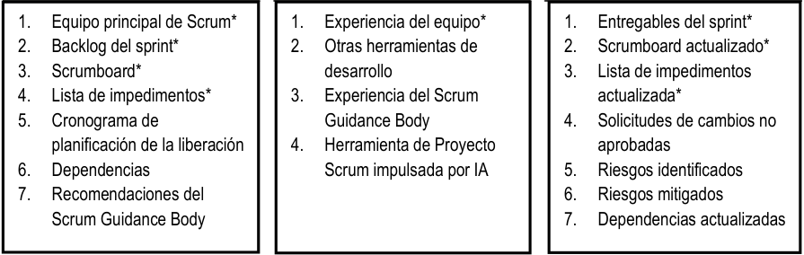

<!-- Start of picture text -->
1. Equipo principal de Scrum*  1. Experiencia del equipo*  1. Entregables del sprint* 2. Backlog del sprint*  2. Otras herramientas de  2. Scrumboard actualizado* 3. Scrumboard*  desarrollo   3. Lista de impedimentos 4. Lista de impedimentos*  3. Experiencia del Scrum  actualizada* 5. Cronograma de  Guidance Body  4. Solicitudes de cambios no planificación de la liberación   4. Herramienta de Proyecto  aprobadas 6. Dependencias  Scrum impulsada por IA  5. Riesgos identificados 7. Recomendaciones del  6. Riesgos mitigados Scrum Guidance Body  7. Dependencias actualizadas <!-- End of picture text -->

**Figura 10-3: Crear entregables: entradas, herramientas y salidas** 

_Nota: Los asteriscos (*) indican una entrada, herramientas o salida “obligatoria” para el proceso correspondiente._ 

©2025 SCRUMstudy™. _Una guía para el cuerpo de conocimiento de Scrum (Guía SBOK®)_ **257** 

10 – IMPLEMENTACIÓN 

La figura 10-4 muestra el diagrama de flujo de este proceso. 

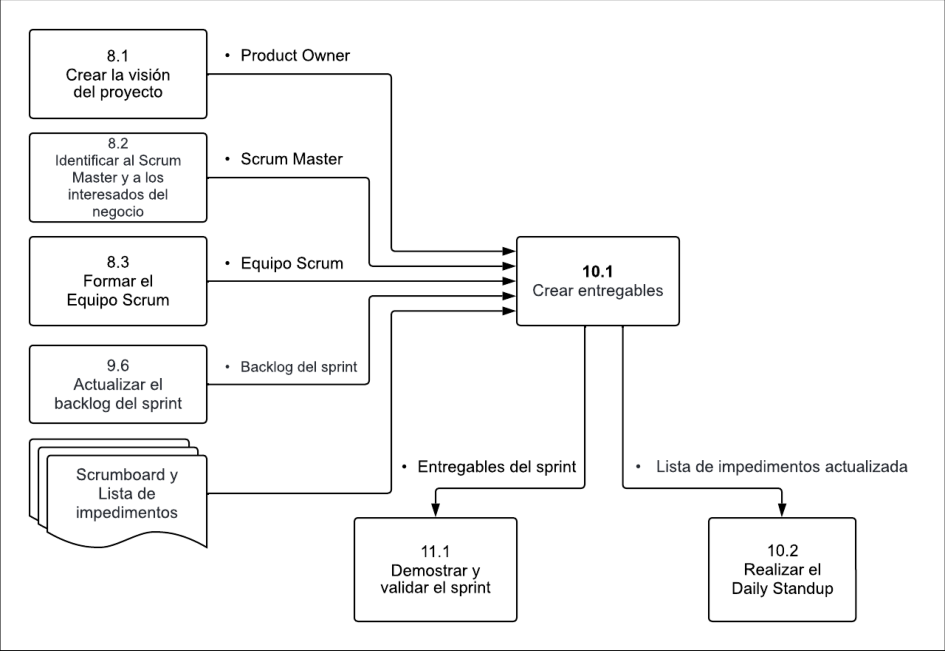

**Figura 10-4: Crear entregables: diagrama de flujo** 

#### **10.1.1 Entradas** 

##### **10.1.1.1 Equipo principal de Scrum*** 

Descrito en la sección 3.3.1. 

##### **10.1.1.2 Backlog del sprint*** 

Descrito en las secciones 9.3.3.2 y 9.6.3.1. 

##### **10.1.1.3 Scrumboard*** 

Descrito en las secciones 9.3.3.3 y 9.4.3.2. 

En Scrum, la transparencia proviene de las herramientas visiblemente abiertas tales como el Scrumboard, donde se muestra el avance del equipo. El equipo utiliza un Scrumboard para planificar y dar seguimiento al progreso durante cada sprint. 

©2025 SCRUMstudy™. _Una guía para el cuerpo de conocimiento de Scrum (Guía SBOK®)_ 

**258** 

10 – IMPLEMENTACIÓN 

**10** 

El equipo debe actualizar el Scrumboard según sea necesario a fin de que muestre información visual y control sobre el trabajo en acción según lo acordado y lo comprometido por el equipo. 

El equipo consulta el Scrumboard elaborado en la fase de planificación y estimación y que contiene todas las tareas en la columna “Por hacer” al inicio del sprint. Los miembros del Equipo Scrum revisan diariamente las historias de usuario y las tareas en el tablero y las acomodan en las columnas “En proceso” y “Terminada” conforme avanza el trabajo. Se puede agregar una columna adicional (por ejemplo: “En prueba”) dependiendo del flujo de trabajo del Equipo Scrum a medida que crean los entregables. 

A medida que el equipo agrega o actualiza asigna tareas para ser desarrolladas, el Scrumboard se sigue actualizando con las tareas adicionales y su estatus. Por ejemplo, la figura 10-5 muestra que todas las tareas en la historia de usuario 1 fueron terminadas, aunque el equipo sigue trabajando en algunas tareas de las historias de usuario 2 y 3. La historia de usuario 4 fue desglosada en tareas, pero el equipo aún no empieza a trabajar en ellas. 

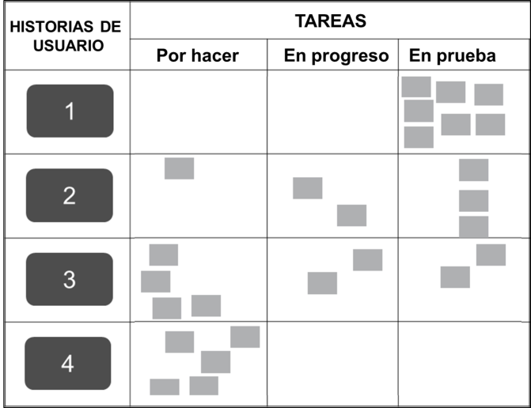

**Figura 10-5: Scrumboard con tareas “Por hacer”, “En proceso” y “Terminada”** 

Para garantizar que el Equipo Scrum asuma la propiedad de su trabajo, se recomienda que los miembros que trabajan en una tarea específica cambien las tareas de la columna “Por hacer” a “En proceso” y escriban su nombre a fin de que quede autoasignada a la persona responsable de completarla. Asimismo, cada integrante del equipo es responsable de completar una tarea, por lo que las historias de usuario deben dividirse en tareas, de forma que cada persona sea responsable de una tarea hasta quedar finalizada. 

A medida que el Equipo Scrum empieza a trabajar en una historia de usuario, es posible que los integrantes entiendan mejor cuáles son las tareas necesarias para desarrollar la historia. Por ello, las tareas pueden ser agregadas, actualizadas o eliminadas del Scrumboard a criterio del equipo. 

©2025 SCRUMstudy™. _Una guía para el cuerpo de conocimiento de Scrum (Guía SBOK®)_ **259** 

10 – IMPLEMENTACIÓN 

Cuando todas las tareas de un Scrumboard estén terminadas (como la historia de usuario 1 en el diagrama anterior), la historia de usuario se considera finalizada por el Equipo Scrum. Tales historias estarán a disposición del Product Owner para ser revisadas y aprobadas o rechazadas. El Product Owner puede revisar las historias después de ser terminadas o durante el proceso de _Demostrar y validar el sprint_ . Si una historia de usuario es aprobada por el Product Owner, se considera “terminada” por el equipo y no requiere de mayor trabajo. 

Si el Product Owner rechaza una historia de usuario, se recomienda que comparta también información sobre los motivos del rechazo (los elementos que no se cumplieron de los criterios de aceptación o de los criterios de terminado). Dependiendo del tiempo restante en el sprint después de haber rechazado la historia y de conocer los motivos del rechazo, el Equipo Scrum tiene dos opciones: 

- Trabajar en la historia de usuario rechazada en el sprint en curso con base en la información proporcionada por el Product Owner. Cuando todas las tareas necesarias para finalizar la historia de usuario han sido terminadas, el Equipo Scrum puede reenviarla al Product Owner para su aprobación durante el mismo sprint. 

- No trabajar en la historia de usuario rechazada durante el mismo sprint. En este caso, la historia regresa al backlog priorizado del producto para ser asignada a otro sprint. El Equipo Scrum puede trabajar en ella o bien, un equipo distinto se puede hacer responsable de esa historia en un sprint posterior. 

El Scrumboard de preferencia debe mantenerse manualmente en papel o en un pizarrón, aunque también se puede hacer de manera electrónica en una hoja de cálculo. Un Scrumboard es válido en toda la duración del sprint y el Equipo Scrum trabajará en un nuevo Scrumboard en el siguiente sprint. 

##### **10.1.1.4 Lista de impedimentos*** 

Un impedimento es cualquier obstáculo o barrera que reduce la productividad del Equipo Scrum. Los impedimentos deben identificarse, resolverse y eliminarse si el equipo desea trabajar eficazmente. Los impedimentos pueden estar dentro de un equipo (por ejemplo: flujo de trabajo ineficiente o la falta de comunicación) o pueden ser externos. Algunos ejemplos de impedimentos externos pudieran ser problemas relacionados a licencias de software o requisitos de documentación innecesaria. El marco de trabajo de Scrum, con su transparencia inherente, facilita la rápida y fácil identificación de impedimentos. Si no se identifican o se atienden los impedimentos, pudiera ser muy costoso. El Scrum Master debe anotar formalmente los impedimentos en una lista de impedimentos y se pueden analizar durante las Daily Standups y en las reuniones de revisión del sprint según sea necesario. 

##### **10.1.1.5 Cronograma de planificación de la liberación** 

Descrito en la sección 8.6.3.1. 

##### **10.1.1.6 Dependencias** 

Descrito en la sección 9.4.3.3. 

©2025 SCRUMstudy™. _Una guía para el cuerpo de conocimiento de Scrum (Guía SBOK®)_ 

**260** 

10 – IMPLEMENTACIÓN 

**10** 

##### **10.1.1.7 Recomendaciones del Scrum Guidance Body** 

En el proceso de _Crear entregables_ , las recomendaciones del Scrum Guidance Body pudieran incluir las mejores prácticas para crear eficazmente los entregables, incluyendo métodos preferenciales para realizar las revisiones, la evaluación, documentación, etc. Para conocer más detalles sobre las recomendaciones del Scrum Guidance Body, véase la sección 8.1.1.7. 

#### **10.1.2 Herramientas** 

##### **10.1.2.1 Experiencia del equipo*** 

Es la experiencia colectiva de los miembros del Equipo Scrum para entender las historias de usuario y las tareas en el backlog del sprint a fin de crear los entregables finales. La experiencia del equipo se utiliza para evaluar las entradas necesarias a fin de ejecutar el trabajo planificado del proyecto. El juicio y la experiencia se aplican en todos los aspectos técnicos y administrativos del proyecto durante el proceso de _Crear entregables_ . Los miembros del Equipo Scrum cuentan con la autoridad y la responsabilidad para determinar las mejores formas de convertir los elementos del backlog priorizado del producto en productos terminados, sin solicitar la participación de ningún <mark>interesado del negocio</mark> ajeno al equipo. De ser necesario, el Scrum Guidance Body cuenta con experiencia disponible. 

##### **10.1.2.2 Otras herramientas de desarrollo** 

Según los requisitos específicos del proyecto y en las especificaciones de la industria, se pueden implementar otras herramientas de desarrollo según sea necesario. 

1. **Refactorización** 

La refactorización es una herramienta específica para proyectos de software. El objetivo de esta técnica es mejorar el mantenimiento del código existente y hacerlo más sencillo, más conciso y flexible. Refactorizar significa mejorar el diseño del código actual sin cambiar su comportamiento. Implica lo siguiente: 

- Eliminación de código repetitivo y redundante; 

- Separar los métodos y las funciones en rutinas más pequeñas; 

- Definir claramente las variables y los nombres de los métodos; 

- Simplificar el diseño del código; 

- Hacer que el código sea más fácil de entender y de modificar. 

La refactorización constante optimiza el diseño del código poco a poco durante cierto periodo. En última instancia, la refactorización da como resultado en un código más limpio y fácil de mantener, preservando a la vez todas las funcionalidades. 

©2025 SCRUMstudy™. _Una guía para el cuerpo de conocimiento de Scrum (Guía SBOK®)_ **261** 

10 – IMPLEMENTACIÓN 

###### **2. Patrones de diseño** 

Los patrones de diseño proporcionan una manera formal de registrar una resolución a un problema de diseño en un campo específico de especialización. Dichos patrones registran el proceso que se utiliza y la resolución, misma que puede reutilizarse después para mejorar la tomar de decisiones y la productividad. 

##### **10.1.2.3 Experiencia del Scrum Guidance Body** 

En los procesos de _Crear entregables_ y _Estimar historias de usuario_ , el Scrum Guidance Body pudiera relacionarse a las normas y regulaciones documentadas, directrices de desarrollo, o bien, a los estándares y mejores prácticas (por ejemplo, orientación sobre cómo realizar revisiones o pruebas). Pudiera haber también un equipo de expertos en la materia que brinden orientación al Equipo Scrum sobre la creación de entregables. Dicho equipo puede incluir a arquitectos líderes, Senior Developers, expertos en seguridad o demás personas con experiencia. Para conocer más detalles sobre la experiencia del Scrum Guidance Boyd, véase la sección 8.4.2.7. 

##### **10.1.2.4 Herramienta de proyecto Scrum impulsada por IA** 

Descrito en la sección 2.4.4. 

#### **10.1.3 Salidas** 

##### **10.1.3.1 Entregables del sprint*** 

Al final de cada sprint se finaliza un incremento de producto o entregable. El entregable debe incluir todas las características y funcionalidades definidas en las historias de usuario que se incluyen en el sprint y debe haber sido evaluado satisfactoriamente. 

##### **10.1.3.2 Scrumboard actualizado*** 

El Scrumboard se actualiza con regularidad a medida que el equipo completa las tareas. Sin embargo, al final del sprint, el Scrumboard se reinicia o se borra y se crea un nuevo para el siguiente sprint. Para obtener más información sobre el Scrumboard, véanse las secciones 9.3.3.3 y 9.4.3.2. 

##### **10.1.3.3 Lista de impedimentos actualizada** 

Descrito en la sección 10.1.1.4. 

##### **10.1.3.4 Solicitudes de cambio no aprobadas** 

Descrito en la sección 8.4.1.5. 

©2025 SCRUMstudy™. _Una guía para el cuerpo de conocimiento de Scrum (Guía SBOK®)_ 

**262** 

10 – IMPLEMENTACIÓN 

**10** 

##### **10.1.3.5 Riesgos identificados** 

Descritos en la sección 8.4.3.4. 

##### **10.1.3.6 Riesgos mitigados** 

A medida que el Equipo Scrum trabaja en la creación de entregables según las historias de usuario en el backlog priorizado del producto, lleva a cabo las acciones de mitigación definidas para atender cualquier riesgo identificado anteriormente. 

Durante todo el proceso de _Crear entregables_ , el equipo documenta cualquier nuevo riesgo identificado y toma medidas para mitigarlo. El registro de los riesgos del proyecto es un documento vivo que actualiza constantemente el equipo a lo largo del proyecto a fin de reflejar el estado actual de todos los riesgos. La sección 7.4.3 incluye información adicional sobre la gestión de riesgos. 

##### **10.1.3.7 Dependencias actualizadas** 

Descritas en la sección 8.5.2.6. 

©2025 SCRUMstudy™. _Una guía para el cuerpo de conocimiento de Scrum (Guía SBOK®)_ **263** 

10 – IMPLEMENTACIÓN 

### **10.2 Realizar el Daily Standup** 

En este proceso se lleva a cabo una reunión altamente focalizada llamada Daily Standup. Esta reunión tiene un límite de tiempo y es un foro para que el Equipo Scrum se ponga al día sobre su avance y contestan tres preguntas específicas sobre cualquier impedimento que pudieran enfrentar sus integrantes. 

La figura 10-6 muestra todas las entradas, las herramientas y las salidas del proceso para _Realizar el Daily Standup_ . 

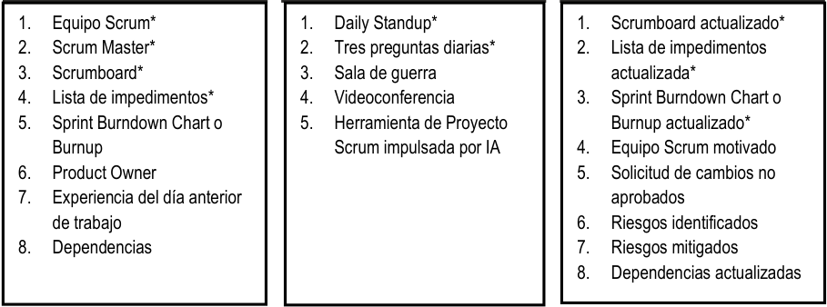

<!-- Start of picture text -->
1. Equipo Scrum*  1. Daily Standup*  1. Scrumboard actualizado* 2. Scrum Master*  2. Tres preguntas diarias*   2. Lista de impedimentos 3. Scrumboard*  3. Sala de guerra  actualizada* 4. Lista de impedimentos*  4. Videoconferencia  3. Sprint Burndown Chart o 5. Sprint Burndown Chart o  5. Herramienta de Proyecto  Burnup actualizado* Burnup  Scrum impulsada por IA  4. Equipo Scrum motivado 6. Product Owner   5. Solicitud de cambios no 7. Experiencia del día anterior  aprobados de trabajo  6. Riesgos identificados 8. Dependencias  7. Riesgos mitigados 8. Dependencias actualizadas <!-- End of picture text -->

**Figura 10-6: Realizar el Daily Standup: entradas, herramientas y salidas** 

_Nota: Los asteriscos (*) indican una entrada, herramientas o salida “obligatoria” para el proceso correspondiente._ 

**264** ©2025 SCRUMstudy™. _Una guía para el cuerpo de conocimiento de Scrum (Guía SBOK®)_ 

10 – IMPLEMENTACIÓN 

**10** 

La figura 10-7 muestra el diagrama de flujo de este proceso. 

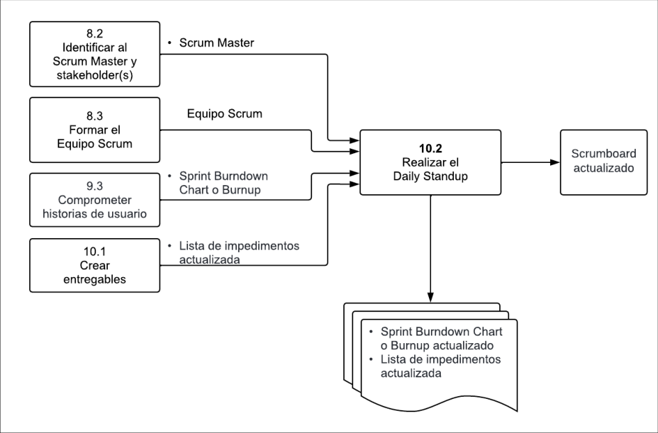

**Figura 10-7: Realizar el Daily Standup: diagrama de flujo** 

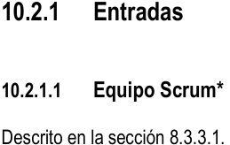

<!-- Start of picture text -->
10.2.1 Entradas 10.2.1.1 Equipo Scrum* Descrito en la sección 8.3.3.1. <!-- End of picture text -->

**10.2.1.2 Scrum Master*** Descrito en la sección 8.2.3.1. 

<!-- Start of picture text -->
10.2.1.3 Scrumboard* <!-- End of picture text -->

Descrito en las secciones 9.3.3.3, 9.4.3.2 y 10.1.1.3. 

©2025 SCRUMstudy™. _Una guía para el cuerpo de conocimiento de Scrum (Guía SBOK®)_ **265** 

10 – IMPLEMENTACIÓN 

##### **10.2.1.4 Lista de impedimentos*** 

Descrito en las secciones 10.1.1.4. 

##### **10.2.1.5 Sprint Burndown o Burndown** 

Descrito en la sección 9.6.3.3. 

##### **10.2.1.6 Product Owner** 

Descrito en la sección 8.1.3.1. 

##### **10.2.1.7 Experiencia del día anterior de trabajo** 

Los miembros del Equipo Scrum mantienen al tanto a sus compañeros durante las reuniones de Daily Standup. Esta sesión se denomina _standup_ (“de pie”), ya que los miembros permanecen de pie durante toda la reunión. Los integrantes del equipo discuten los logros y la experiencia del día anterior. Esta experiencia es una entrada importante al Daily Standup. 

##### **10.2.1.8 Dependencias** 

Descrito en la sección 9.4.3.4. 

#### **10.2.2 Herramientas** 

##### **10.2.2.1 Daily Standup*** 

El Daily Standup es una breve reunión diaria con un límite de tiempo de 15 minutos. Los miembros del equipo se reúnen para dar un reporte sobre su avance en el sprint y planificar las actividades del día. La duración de la reunión es muy corta y se busca que todos los integrantes del Equipo Scrum estén presentes. La reunión no se cancela ni se retrasa si uno o más miembros no pueden asistir. El Daily Standup está a cargo del Equipo Scrum y el Scrum Master facilita la reunión según sea necesario. 

En la reunión, cada miembro del Equipo Scrum da respuesta a las tres preguntas diarias que se mencionan en la sección 10.2.2.2. Se recomiendan los debates entre el Scrum Master y el equipo o entre los miembros del Equipo Scrum, aunque tales discusiones suceden después de la reunión a fin de garantizar que el Daily Standup sea breve. 

©2025 SCRUMstudy™. _Una guía para el cuerpo de conocimiento de Scrum (Guía SBOK®)_ 

**266** 

10 – IMPLEMENTACIÓN 

**10** 

##### **10.2.2.2 Tres preguntas diarias*** 

Las tres preguntas diarias se utilizan en el Daily Standup, facilitada por el Scrum Master, donde cada miembro del Equipo Scrum brinda información en forma de respuesta a tres preguntas específicas: 

1. ¿Qué he hecho desde la última reunión? 

2. ¿Qué tengo planeado hacer antes de la siguiente reunión? 

3. ¿Qué impedimentos u obstáculos (si los hubiera) estoy enfrentando actualmente? 

Al enfocarse en estas tres preguntas, todo el equipo podrá entender claramente el estatus del trabajo. En ocasiones se pueden discutir otros elementos, pero se mantiene al mínimo debido al tiempo asignado que tiene la reunión. 

Se recomienda que, de ser posible, los miembros del equipo den respuesta a las dos primeras preguntas en forma cuantificable en vez de dar largas respuestas cualitativas. Los miembros del equipo pueden organizar reuniones adicionales después del Daily Standup a fin de abordar temas que requieran de mayor discusión. 

##### **10.2.2.3 Sala de guerra** 

Al implementar las prácticas de Scrum en un proyecto, es preferible que el equipo esté coubicado y que todos los miembros trabajen en el mismo lugar. “Sala de guerra” ( _War Room_ ) es el término que comúnmente se utiliza para describir a dicho lugar. Normalmente está diseñado para que los miembros del equipo puedan moverse libremente, trabajar y comunicarse con facilidad, ya que se encuentran ubicados en proximidades inmediatas. Típicamente se distribuyen tarjetas, notas adhesivas y otras herramientas sencillas o sofisticadas a fin de facilitar el flujo de trabajo, la colaboración y la solución de problemas. El salón en ocasiones es ruidoso debido a las conversaciones del equipo, aunque tales conversaciones contribuyen al progreso del equipo. Una buena sala de guerra no tiene cubículos y permite que todos se puedan sentar juntos, garantizando una comunicación cara a cara, lo cual conduce a la formación del equipo y a la apertura. La sala de guerra también es ideal para llevar a cabo el Daily Standup. Los <mark>interesados del negocio</mark> de otros equipos de Scrum pudieran también llegar a la sala de guerra y discutir temas relevantes según sea necesario. 

##### **10.2.2.4 Videoconferencia** 

En situaciones de la vida real, tal vez no sea posible que todo el Equipo Scrum esté coubicado. En tales casos, resulta importante utilizar herramientas de videoconferencia que permitan la comunicación cara a cara. Para conocer más sobre la colaboración eficaz en los equipos dispersos, véase la sección 2.5.3. 

##### **10.2.2.5 Herramienta de proyecto Scrum impulsada por IA** 

Descrito en la sección 2.4.4. 

©2025 SCRUMstudy™. _Una guía para el cuerpo de conocimiento de Scrum (Guía SBOK®)_ **267** 

10 – IMPLEMENTACIÓN 

#### **10.2.3 Salidas** 

##### **10.2.3.1 Scrumboard actualizado*** 

El Scrumboard se sigue actualizando constantemente a medida que el equipo termina las tareas. Para obtener más información sobre el Scrumboard, véanse las secciones 9.3.3.3 y 9.4.3.2. 

La Figura 10-8 es una interfaz de Vabro que muestra el uso de scrumboard en la implementación. Visualiza el seguimiento del progreso en tiempo real, las asignaciones de equipo y el movimiento de tareas en las fases de sprint utilizando funciones impulsadas por IA. 

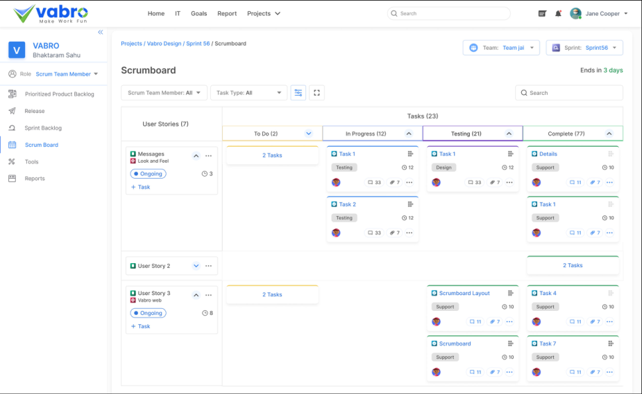

**Figura 10-8: Uso de Scrumboard (fuente: Vabro)** 

La figura 10-9 muestra un tablero de scrum basado en Jira que muestra su papel en la gestión de una iniciativa de Scrum. Cuenta con columnas de estado de tareas, seguimiento del progreso e integración de trabajos pendientes para la ejecución de sprints. 

©2025 SCRUMstudy™. _Una guía para el cuerpo de conocimiento de Scrum (Guía SBOK®)_ 

10 – IMPLEMENTACIÓN 

**10** 

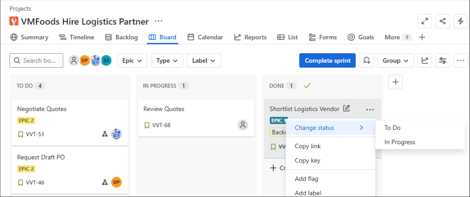

**Figura 10-9: Papel de Scrumboard en Scrum (Fuente: Jira)** 

##### **10.2.3.2 Lista de impedimentos actualizada*** 

Descrito en la sección 10.1.1.4. 

##### **10.2.3.3 Sprint Burndown o Burnup actualizado*** 

El Sprint Burndown Chart debe ser actualizado diariamente a fin de mostrar el avance del Equipo Scrum, así como para detectar las estimaciones que pudieron haber sido incorrectas. Si el Sprint Burndown Chart indica que el Equipo Scrum no avanza por buen camino en el cumplimiento oportuno de las tareas en el sprint, el Scrum Master debe identificar cualquier obstáculo o impedimento que obstruya la terminación satisfactoria y debe intentar resolverlo. Para conocer más detalles sobre el Sprint Burndown Chart, véase la sección 9.6.3.3. 

##### **10.2.3.4 Equipo Scrum motivado** 

El Daily Standup infunde la idea de que cada miembro del equipo es importante y contribuye considerablemente a mejorar la moral individual y colectiva del equipo. Esto, aunado al concepto de la autoorganización del equipo, mejora la motivación general, conduciendo a un mejor desempeño del equipo y mejorando la calidad de los entregables que se producen. Para obtener más información sobre el Equipo Scrum, véase la sección 8.3.3.1. 

##### **10.2.3.5 Solicitudes de cambio no aprobadas** 

Descritas en la sección 8.4.1.5. 

©2025 SCRUMstudy™. _Una guía para el cuerpo de conocimiento de Scrum (Guía SBOK®)_ **269** 

10 – IMPLEMENTACIÓN 

##### **10.2.3.6 Riesgos identificados** 

Descritos en la sección 8.4.3.4. 

##### **10.2.3.7 Riesgos mitigados** 

Descritos en la sección 10.1.3.6. 

##### **10.2.3.8 Dependencias actualizadas** 

Descritas en la sección 8.5.2.6. 

©2025 SCRUMstudy™. _Una guía para el cuerpo de conocimiento de Scrum (Guía SBOK®)_ 

**270** 

10 – IMPLEMENTACIÓN 

**10** 

### **10.3 Refinar el backlog priorizado del producto** 

En este proceso, el Product Owner constantemente actualiza y refina el backlog priorizado del producto. Se puede celebrar una reunión de revisión del backlog priorizado del producto, donde los cambios y actualizaciones al backlog se analizan y se incorporan al backlog priorizado del producto, según corresponda. 

A fin de mantener el backlog al día con cualquier cambio en los requerimientos o prioridades, el Product Owner trabaja constantemente con el cliente y otros interesados del negocio para obtener y entender cualquier cambio en sus necesidades. 

A fin de asegurar que la serie de historias de usuario que el Product Owner busca que el equipo elabore en el siguiente sprint esté lista para su compromiso, el Product Owner refina las épicas e historias de usuario existentes en el backlog priorizado del producto y se asegura de que las historias satisfagan la definición de listo. 

Como parte del refinamiento del backlog priorizado del producto, el Product Owner también trabaja con el Equipo Scrum para conocer la opinión y las preguntas relacionadas a las actualizaciones en el backlog priorizado del producto con la posibilidad de incluir estimaciones. 

La figura 10-10 muestra todas las entradas, las herramientas y las salidas para el proceso de _Refinar el backlog priorizado del producto_ . 

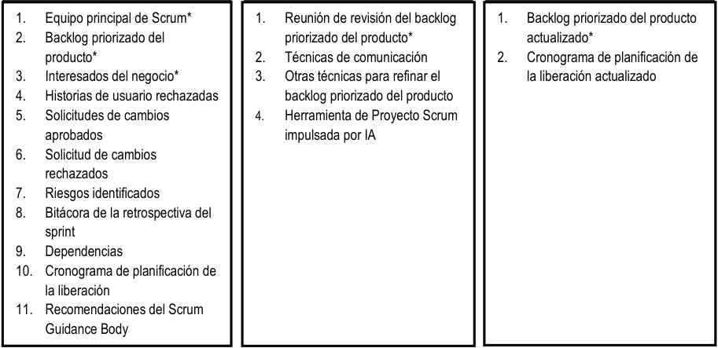

<!-- Start of picture text -->
1. Equipo principal de Scrum*  1. Reunión de revisión del backlog  1. Backlog priorizado del producto 2. Backlog priorizado del  priorizado del producto*  actualizado* producto*  2. Técnicas de comunicación  2. Cronograma de planificación de 3. Interesados del negocio*  3. Otras técnicas para refinar el  la liberación actualizado 4. Historias de usuario rechazadas  backlog priorizado del producto 5. Solicitudes de cambios  4. Herramienta de Proyecto Scrum aprobados   impulsada por IA 6. Solicitud de cambios rechazados 7. Riesgos identificados 8. Bitácora de la retrospectiva del sprint 9. Dependencias 10. Cronograma de planificación de la liberación 11. Recomendaciones del Scrum Guidance Body <!-- End of picture text -->

**Figura 10-10: Refinar el backlog priorizado del producto: entradas, herramientas y salidas** 

_Nota: Los asteriscos (*) indican una entrada, herramientas o salida “obligatoria” para el proceso correspondiente._ 

©2025 SCRUMstudy™. _Una guía para el cuerpo de conocimiento de Scrum (Guía SBOK®)_ **271** 

10 – IMPLEMENTACIÓN 

La figura 10-11 muestra el diagrama de flujo de este proceso. 

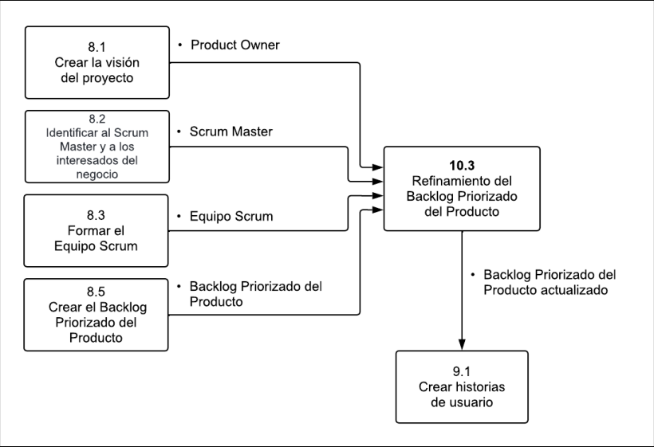

**Figura 10-11: Refinar el backlog priorizado del producto: Diagrama de flujo** 

#### **10.3.1 Entradas** 

##### **10.3.1.1 Equipo principal de Scrum*** 

Descrito en la sección 3.3.1. 

##### **10.3.1.2 Backlog priorizado del producto*** 

Descrita en la sección 8.5.3.1. 

##### **10.3.1.3 Interesados del negocio*** 

A fin de mantener el backlog priorizado del producto al día con cualquier cambio en los requerimientos o prioridades, el Product Owner trabaja constantemente con el cliente y otros interesados del negocio para obtener y entender cualquier cambio en sus necesidades. Para obtener más información sobre los interesados del negocio, véase la sección 3.3.2.1. 

**272** ©2025 SCRUMstudy™. _Una guía para el cuerpo de conocimiento de Scrum (Guía SBOK®)_ 

10 – IMPLEMENTACIÓN 

**10** 

##### **10.3.1.4 Historias de usuario rechazadas** 

En situaciones donde un entregable no cumple con los criterios de aceptación, este se considera rechazado. Los entregables rechazados generalmente no se mantienen en una lista por separado, simplemente permanecen en el backlog priorizado del producto y no se marcan como terminados, de forma que se puedan volver a priorizar en el proceso de _Refinar el backlog priorizado del producto_ y se consideren para su desarrollo en el siguiente o futuro sprint. 

##### **10.3.1.5 Solicitudes de cambio aprobadas** 

Descrito en la sección 8.4.1.4. 

##### **10.3.1.6 Solicitudes de cambio no aprobadas** 

Descrito en la sección 8.4.1.5. 

##### **10.3.1.7 Riesgos identificados** 

Descritos en la sección 8.4.3.4. 

##### **10.3.1.8 Bitácora de la retrospectiva del sprint** 

Descrito en la sección 11.2.3.4. 

##### **10.3.1.9 Dependencias** 

Descrito en la sección 9.4.3.4. 

##### **10.3.1.10 Cronograma de planificación de la liberación** 

Descrito en la sección 8.6.3.1. 

##### **10.3.1.11 Recomendaciones del Scrum Guidance Body** 

En el proceso de _Refinar el backlog priorizado del producto_ , las recomendaciones del Scrum Guidance Body pueden incluir las mejores prácticas sobre cómo entender y recopilar sistemáticamente los requerimientos de los interesados del negocio y de los equipos en Scrum; priorizarlos adecuadamente en el backlog del producto y comunicar las actualizaciones a todas las personas relevantes involucradas en un proyecto Scrum. Para obtener más información sobre las recomendaciones del Scrum Guidance Body, véase la sección 8.1.1.7. 

©2025 SCRUMstudy™. _Una guía para el cuerpo de conocimiento de Scrum (Guía SBOK®)_ **273** 

10 – IMPLEMENTACIÓN 

#### **10.3.2 Herramientas** 

##### **10.3.2.1 Reuniones de revisión del backlog priorizado del producto*** 

El Product Owner puede tener varias reuniones por separado con los interesados del negocio relevantes, con el Scrum Master y con el Equipo Scrum a fin de asegurarse de que cuenta con la información suficiente para actualizar el backlog priorizado del producto en el proceso de su refinamiento. La finalidad de las reuniones de revisión del backlog priorizado del producto es asegurarse de que se entiendan las historias de usuario y los criterios de aceptación, y de que el Product Owner la escriba adecuadamente para que reflejen los requerimientos y prioridades actuales cliente; que todos en el Equipo Scrum entiendan las historias de usuario y que las historias de mayor prioridad sean bien refinadas para que el Equipo Scrum las pueda estimar adecuadamente y trabajar en ellas. Las reuniones de revisión del backlog priorizado del producto garantizan también que se eliminen historias de usuario irrelevantes y que se incorporen las solicitudes de cambio aprobadas o los riesgos identificados en el backlog priorizado del producto. 

##### **10.3.2.2 Técnicas de comunicación** 

Los principios y las prácticas de Scrum promueves la comunicación precisa y eficaz principalmente por medio de la coubicación de equipos. Scrum favorece también las interacciones informales cara a cara en vez de la comunicación formal por escrito. Cuando un Equipo Scrum debe estar disperso, el Scrum Master debe asegurar que existan técnicas eficaces de comunicación para que los equipos se puedan auto organizar y trabajar eficientemente. Para conocer más detalles sobre los equipos dispersos, véase la sección 2.5.3. 

##### **10.3.2.3 Otras técnicas para refinar el backlog priorizado del producto** 

Otras herramientas para refinar el backlog priorizado del producto incluyen muchas de las mismas herramientas implementadas en los siguientes procesos: 

- _Desarrollar épicas:_ Descrito en la sección 8.4.2. 

- _Crear el backlog priorizado del producto:_ Descrito en la sección 8.5.2. 

- _Realizar la planificación de la liberación:_ Descrito en la sección 8.6.2. 

- _Crear historias de usuario:_ Descrito en la sección 9.1.2. 

- _Estimar historias de usuarios:_ Descrito en la sección 9.2.2. 

- _Comprometer historias de usuario:_ Descrito en la sección 9.3.2. 

- _Identificar tareas:_ Descrito en la sección 9.4.2. 

- _Estimar tareas:_ Descrito en la sección 9.5.2. 

##### **10.3.2.4 Herramienta de proyecto Scrum impulsada por IA** 

Descrito en la sección 2.4.4. 

La figura 10-12 muestra la interfaz Vabro para el refinamiento del backlog del producto. Las características incluyen puntuación de elementos, comentarios de las partes interesadas y sugerencias generadas por IA para mejorar la priorización del trabajo pendiente. 

©2025 SCRUMstudy™. _Una guía para el cuerpo de conocimiento de Scrum (Guía SBOK®)_ 

**274** 

10 – IMPLEMENTACIÓN 

**10** 

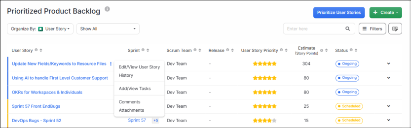

**Figura 10-102: Refinamiento del backlog de productos en Scrum (fuente: Vabro)** 

La figura 10-13 es una interfaz de Jira para el refinamiento del backlog. Los elementos visuales admiten la edición de elementos del backlog, los ajustes de priorización y la colaboración entre los roles de scrum. 

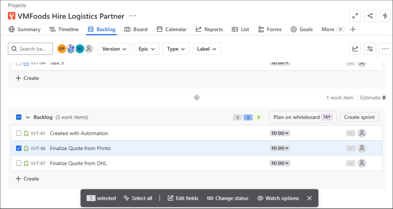

**Figura 10-113: Refinamiento del backlog del producto en Scrum (fuente: Jira)** 

#### **10.3.3 Salidas** 

##### **10.3.3.1 Backlog priorizado del producto actualizado*** 

El backlog priorizado del producto se puede actualizar con nuevas historias de usuario, nuevas solicitudes de cambio, nuevos riesgos identificados o historias de usuario actualizadas o bien, la nueva priorización de las historias ya existentes. Para conocer más detalles sobre el backlog priorizado del producto, véase la sección 8.5.3.1. 

##### **10.3.3.2 Cronograma de planificación de la liberación actualizado** 

El cronograma de planificación de la liberación se puede actualizar para que refleje el impacto de las historias de usuario nuevas o actualizadas en el backlog priorizado del producto. Para conocer más detalles sobre el cronograma de planificación de la liberación, véase la sección 8.6.3.1. 

©2025 SCRUMstudy™. _Una guía para el cuerpo de conocimiento de Scrum (Guía SBOK®)_ **275** 

10 – IMPLEMENTACIÓN 

### **10.4 Diagrama de flujo de la fase de implementación** 

La figura 10-14 muestra el diagrama de flujo de la fase de implementación. 

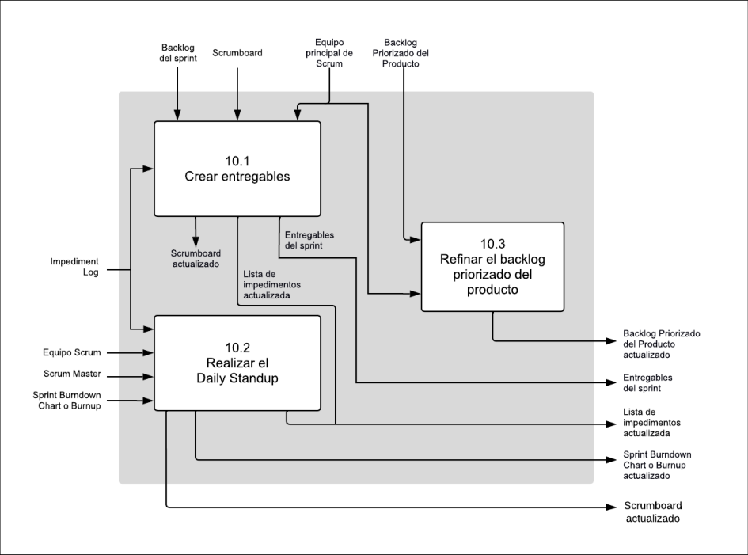

**Figura 10-14: Fase de implementación: diagrama de flujo** 

©2025 SCRUMstudy™. _Una guía para el cuerpo de conocimiento de Scrum (Guía SBOK®)_ 

**276** 

11 – REVISIÓN Y RETROSPECTIVA 

**11** 

## **11. REVISIÓN Y RETROSPECTIVA** 

La fase de revisión y retrospectiva cubre los relacionado a la revisión de los entregables y al trabajo que se ha realizado y determina las formas para mejorar las prácticas y métodos implementados para realizar el trabajo del proyecto. En las grandes organizaciones, el proceso de revisión y retrospectiva también puede incluir el convocar a reuniones de Scrum de Scrums. 

<mark>La revisión y retrospectiva, tal como se define en la</mark> _<mark>Guía de los fundamentos de Scrum (Guía del SBOK</mark>__®_ _<mark>)</mark>_ <mark>,</mark> es <mark>aplicable a los siguientes:</mark> 

- <mark>Portafolios, programas o proyectos en cualquier industria;</mark> 

- <mark>Productos, servicios o cualquier otro resultado que se entregará a los</mark> interesados del negocio; 

- <mark>Proyectos de cualquier tamaño o complejidad.</mark> 

<mark>El término “producto” en la</mark> _<mark>Guía del SBOK</mark>__®_ <mark>puede referirse a un producto, servicio, o cualquier otro entregable. Scrum se puede aplicar de manera efectiva a cualquier proyecto en cualquier industria: desde proyectos o equipos pequeños con tan solo seis miembros, hasta proyectos grandes y complejos con cientos de miembros.</mark> 

Para facilitar la mejor aplicación del marco de trabajo de Scrum, en este capítulo se identifican las entradas, herramientas y salidas de cada proceso, ya sea como “obligatorias” u “opcionales”. Las entradas, herramientas y salidas indicadas con asteriscos (*) son obligatorias o se consideran importantes para el éxito, mientras que las que no tienen asteriscos son opcionales. 

Se recomienda que el Equipo Scrum y aquellas personas que empiezan a aprender sobre el marco de trabajo y los procesos de Scrum, se enfoquen principalmente en las entradas, herramientas y salidas obligatorias; mientras que los Product Owners, Scrum Masters y demás practicantes con experiencia en Scrum, se deberían de esforzar por alcanzar un conocimiento más a fondo sobre la información ofrecida en este capítulo. 

<mark>Este capítulo está escrito desde la perspectiva de un Equipo Scrum que trabaja en un sprint para producir entregables que pudieran ser parte de un proyecto más grande, de un programa o portafolio. La información sobre cómo escalar Scrum en grandes proyectos está disponible en el capítulo 13 y lo relacionado a escalar Scrum para la empresa se puede encontrar en el capítulo 14.</mark> 

<mark>La revisión y la retrospectiva es la tercera y última de las tres fases que se hacen en forma repetitiva en cada sprint.</mark> 

<mark>El Product Owner y otros interesados del negocio relevantes revisan los entregables elaborados por el equipo y presentan su opinión. El Product Owner evalúa cada historia de usuario para ver si cumple con los respectivos criterios de aceptación y los acepta o los rechaza según corresponda.</mark> 

<mark>Como parte final del sprint, el Equipo Scrum define las formas para mejorar constantemente su trabajo.</mark> 

También es importante destacar que, aunque todos los procesos se definen de forma única en la _<mark>Guía del SBOK</mark>__®_ _<mark>,</mark>_ no necesariamente se llevan a cabo de forma secuencial o por separado. En ocasiones, puede ser más apropiado combinar algunos procesos, dependiendo de los requisitos específicos de cada proyecto. 

©2025 SCRUMstudy™. _Una guía para el cuerpo de conocimiento de Scrum (Guía SBOK®)_ **277** 

11 – REVISIÓN Y RETROSPECTIVA 

<mark>La figura 11-1 brinda información general de los procesos de la fase</mark> _<mark>Revisión y Retrospectiva</mark>_ <mark>, los cuales son los siguientes:</mark> 

**11.1 Demostrar y validar el sprint:** En este proceso, el Equipo Scrum demuestra los entregables del sprint al Product Owner durante una reunión de revisión del sprint. El propósito de esta reunión es lograr que el Product Owner apruebe las historias de usuario del sprint. 

Este proceso no solo es un importante elemento de calidad en un proyecto de Scrum, sino también un elemento clave para mantener involucrados a los interesados. A los interesados del negocio se les anima a participar en la reunión de revisión del sprint para que conozcan de primera mano el producto o servicio y su avance, y para que compartan su opinión. La retroalimentación de los interesados es información importante para futuros sprints. 

**11.2 Retrospectiva del sprint:** En este proceso, el Scrum Master y el Equipo Scrum se reúnen para discutir las lecciones aprendidas durante el sprint. Esta información se documenta en forma de lecciones aprendidas que pudieran implementarse en futuros sprints a partir del siguiente. Como consecuencia de esta reunión, se pudieran obtener mejoras accionables acordadas o recomendaciones actualizadas del Scrum Guidance Body. Este proceso es un componente fundamental de la mejora continua en Scrum. 

- **11.2 Demostrar y validar el sprint 11.2 Retrospectiva del sprint** 

- **ENTRADAS ENTRADAS** 1. Equipo principal de Scrum* 1. Scrum Master* 2. Entregables del sprint* 2. Equipo Scrum* 3. Backlog del sprint* 3. Salidas del proceso Demostrar y validar el sprint* 

2. Entregables del sprint* 

3. Backlog del sprint* 

4. Criterios de terminado* 

   4. Product Owner 

5. Criterio de aceptación de historias de usuario* 5. Recomendaciones del Scrum Guidance Body 6. Interesados del negocio **HERRAMIENTAS** 7. Cronograma de planificación de la liberación 1. Reunión de retrospectiva del Sprint* 8. Riesgos identificados 2. ESVP 9. Dependencias 3. Lancha rápida 10. Recomendaciones Scrum Guidance Body 4. Métricas y técnicas de medición **HERRAMIENTAS** 5. Experiencia del Scrum Guidance Body 1. Aceptación o rechazo de las historias de 6. Herramienta de Proyecto Scrum impulsada por IA usuario* **SALIDAS** 

2. Reuniones de revisión del sprint 1. Mejoras accionables acordadas* 3. Análisis del valor ganado 2. Elementos de acción asignados y fechas límite 4. Experiencia del Scrum Guidance Body 3. Elementos no funcionales propuestos para el 5. Herramienta de Proyecto Scrum impulsada por backlog priorizado del producto 

IA 4. Bitácoras de la retrospectiva del sprint 

**SALIDAS** 5. Lecciones aprendidas del Equipo Scrum 1. Historias de usuario aceptadas* 6. Recomendaciones actualizadas del Scrum 2. Historias de usuario rechazadas Guidance Body 3. Riesgos actualizados 4. Resultados del análisis del valor ganado 5. Cronograma de planificación de la liberación actualizado 

**Figura 11-1: Información general de la fase de revisión y retrospectiva** 

_Nota: Los asteriscos (*) indican una entrada, herramientas o salida “obligatoria” para el proceso correspondiente._ 

**278** ©2025 SCRUMstudy™. _Una guía para el conocimiento de Scrum (Guía SBOK™)_ 

11 – REVISIÓN Y RETROSPECTIVA 

**11** 

La figura 11-2 muestra las entradas, herramientas y salidas obligatorias para los procesos en la fase de revisión y retrospectiva _._ 

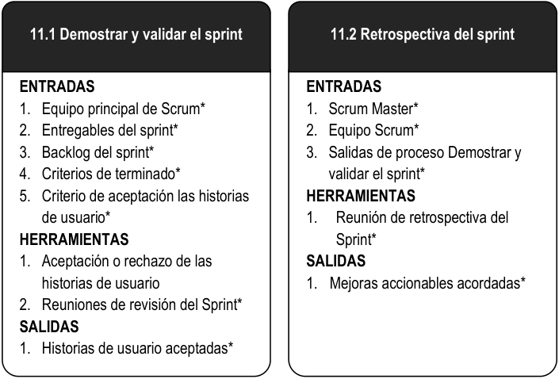

<!-- Start of picture text -->
11.1 Demostrar y validar el sprint  11.2 Retrospectiva del sprint ENTRADAS  ENTRADAS 1. Equipo principal de Scrum*  1. Scrum Master* 2. Entregables del sprint*  2. Equipo Scrum* 3. Backlog del sprint*  3. Salidas de proceso Demostrar y 4. Criterios de terminado*  validar el sprint* 5. Criterio de aceptación las historias  HERRAMIENTAS de usuario*  1. Reunión de retrospectiva del HERRAMIENTAS  Sprint* 1. Aceptación o rechazo de las  SALIDAS historias de usuario  1. Mejoras accionables acordadas* 2. Reuniones de revisión del Sprint* SALIDAS 1. Historias de usuario aceptadas* <!-- End of picture text -->

**Figura 11-2: Información general de la fase de revisión y retrospectiva (fundamentales)** 

_Nota: Los asteriscos (*) indican una entrada, herramientas o salida “obligatoria” para el proceso correspondiente._ 

©2025 SCRUMstudy™. _Una guía para el cuerpo de conocimiento de Scrum (Guía SBOK®)_ **279** 

11 – REVISIÓN Y RETROSPECTIVA 

### **11.1 Demostrar y validar el sprint** 

En este proceso, el Equipo Scrum demuestra los entregables del sprint al Product Owner durante una reunión de revisión del sprint. El propósito de esta reunión es lograr que el Product Owner apruebe las historias de usuario del sprint. 

Este proceso no solo es un importante elemento de calidad en un proyecto de Scrum, sino también un elemento clave para mantener involucrados a los interesados. A los interesados del negocio se les anima a participar en la reunión de revisión del sprint para que conozcan de primera mano el producto o servicio y su avance, y para que compartan su opinión. La retroalimentación de los interesados es información importante para futuros sprints. 

La figura 11-3 muestra todas las entradas, las herramientas y las salidas para el proceso de _Demostrar y validar el sprint_ . 

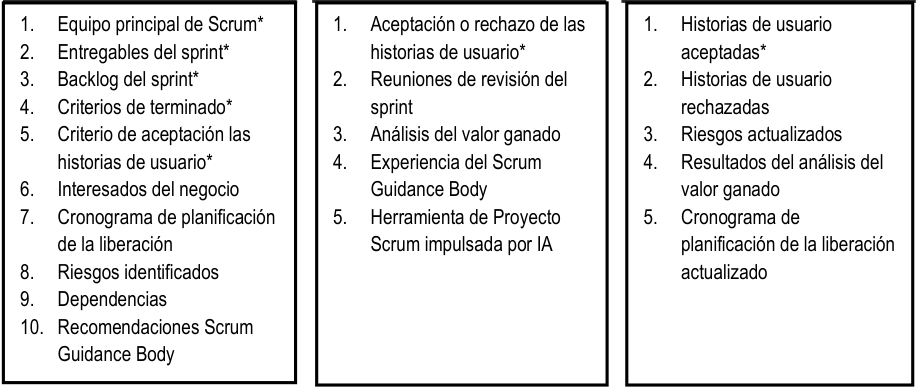

<!-- Start of picture text -->
1. Equipo principal de Scrum*  1. Aceptación o rechazo de las  1. Historias de usuario 2. Entregables del sprint*  historias de usuario*  aceptadas* 3. Backlog del sprint*  2. Reuniones de revisión del  2. Historias de usuario 4. Criterios de terminado*  sprint  rechazadas 5. Criterio de aceptación las  3. Análisis del valor ganado  3. Riesgos actualizados historias de usuario*  4. Experiencia del Scrum  4. Resultados del análisis del 6. Interesados del negocio  Guidance Body  valor ganado 7. Cronograma de planificación  5. Herramienta de Proyecto  5. Cronograma de de la liberación   Scrum impulsada por IA  planificación de la liberación 8. Riesgos identificados  actualizado 9. Dependencias 10. Recomendaciones Scrum Guidance Body <!-- End of picture text -->

**Figura 11-3: Demostrar y validar el sprint: entradas, herramientas y salidas** 

_Nota: Los asteriscos (*) indican una entrada, herramientas o salida “obligatoria” para el proceso correspondiente._ 

**280** ©2025 SCRUMstudy™. _Una guía para el conocimiento de Scrum (Guía SBOK™)_ 

11 – REVISIÓN Y RETROSPECTIVA 

**11** 

La figura 11-4 muestra el diagrama de flujo de este proceso. 

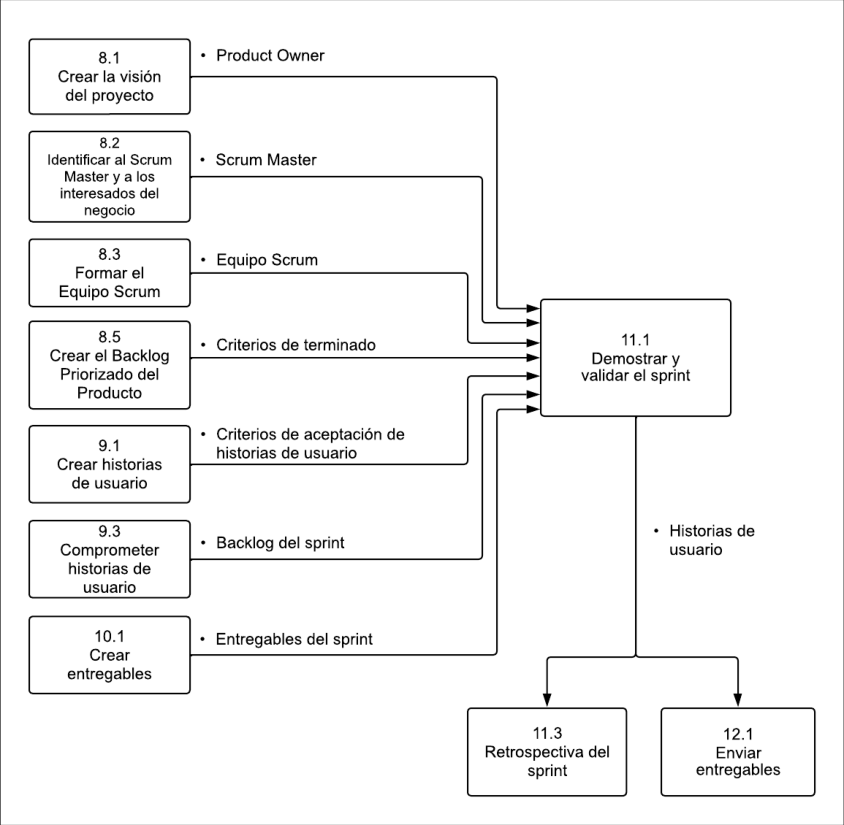

**Figura 11-4: Demostrar y validar el sprint: diagrama de flujo** 

#### **11.1.1 Entradas** 

##### **11.1.1.1 Equipo principal de Scrum*** 

Descrito en la sección 3.3.1. 

##### **11.1.1.2 Entregables del sprint*** 

Descrito en la sección 10.1.3.1 

©2025 SCRUMstudy™. _Una guía para el cuerpo de conocimiento de Scrum (Guía SBOK®)_ **281** 

11 – REVISIÓN Y RETROSPECTIVA 

##### **11.1.1.3 Backlog del sprint*** 

Descrito en las secciones 9.3.3.2 y 9.6.3.1. 

##### **11.1.1.4 Criterios de terminado*** 

Descrito en la sección 8.5.3.2. 

##### **11.1.1.5 Criterios de aceptación de las historias de usuario*** 

Descrito en las secciones 9.1.3.2 y 9.4.1.3. 

##### **11.1.1.6 Interesados del negocio** 

Descrito en la sección 8.2.3.2. 

##### **11.1.1.7 Cronograma de planificación de la liberación** 

Descrito en la sección 8.6.3.1. 

##### **11.1.1.8 Riesgos identificados** 

Descrito en la sección 8.4.3.4. 

##### **11.1.1.9 Dependencias** 

Descritas en la sección 9.4.3.3 

##### **11.1.1.10 Recomendaciones del Scrum Guidance Body** 

En el proceso de _Demostrar y validar el sprint_ , las recomendaciones del Scrum Guidance Body pueden incluir las mejores prácticas sobre cómo llevar a cabo las reuniones de revisión del sprint y evaluar los resultados del análisis del valor ganado. Pudiera haber también una orientación sobre como compartir experiencias con otras personas en el equipo principal de Scrum, así como demás equipos Scrum en el proyecto. Para conocer más detalles sobre las recomendaciones de Scrum Guidance Body, véase la sección 8.1.1.7. 

**282** ©2025 SCRUMstudy™. _Una guía para el conocimiento de Scrum (Guía SBOK™)_ 

11 – REVISIÓN Y RETROSPECTIVA 

**11** 

#### **11.1.2 Herramientas** 

##### **11.1.2.1 Aceptación o rechazo de las historias de usuario*** 

Después de terminar las historias de usuario, se ponen a consideración del Product Owner para su revisión. El Product Owner puede revisar las historias de usuario tan pronto como queden concluidas o bien, durante una reunión de revisión del sprint convocada al final de cada sprint. El Product Owner acepta las historias de usuario que cumplen con los respectivos criterios de aceptación y los criterios de terminado; y rechaza las que no cumplen con dichos criterios. De preferencia, esto se hace compartiendo su opinión sobre el rechazo de las historias. Si aún hay tiempo disponible en el sprint, estas historias de usuario se presentan al equipo para corregir los motivos del rechazo y después se muestran de nuevo al Product Owner en el mismo sprint para una segunda revisión. Sin embargo, puede seguir habiendo algunas historias rechazadas al final de un sprint que deben ser desarrolladas en un sprint posterior. 

##### **11.1.2.2 Reunión de revisión del sprint*** 

Las reuniones de revisión del sprint se convocan al final de cada sprint. Los miembros del equipo principal de Scrum y los interesados del negocio relevantes participan en las reuniones de revisión del sprint para presentar los entregables. El Equipo Scrum demuestra las historias de usuario y los entregables creados como parte del sprint, incluyendo las nuevas funcionalidades o productos desarrollados. En la reunión de revisión del sprint el equipo también demuestra los entregables de las historias de usuario que ya han sido previamente aprobados por el Producct Owner antes de esta reunión a fin de que los interesados del negocio evalúen también la funcionalidad respectiva. El Product Owner y los interesados del negocio inspeccionan todos los entregables y deciden si es necesario hacer cambios en un sprint posterior. Al final de la reunión de revisión del sprint, todas las historias de usuario se ponen a consideración; algunas son aprobadas y otras se rechazan con base en el cumplimiento de los respectivos criterios de aceptación y criterios de terminado. 

##### **11.1.2.3 Análisis del valor ganado** 

Descrito en la sección 4.6.1 

##### **11.1.2.4 Experiencia del Scrum Guidance Body** 

En el proceso de _Demostrar y validar el sprint_ , la experiencia del Scrum Guidance Body podría estar relacionado a las mejores prácticas documentadas sobre cómo llevar a cabo reuniones de revisión del sprint. Pudiera también haber expertos que pudieran brindar orientación sobre como facilitar de una mejor forma las reuniones de revisión del sprint. Para conocer más detalles sobre la experiencia del Scrum Guidance Body, véase la sección 8.4.2.7. 

##### **11.1.2.5 Herramienta de proyecto Scrum impulsada por IA** 

Descrito en la sección 2.4.4 

©2025 SCRUMstudy™. _Una guía para el cuerpo de conocimiento de Scrum (Guía SBOK®)_ **283** 

11 – REVISIÓN Y RETROSPECTIVA 

La Figura 11-5 es una interfaz de Vabro que muestra cómo la IA ayuda a administrar la validación y las aprobaciones de historias de usuario. Incluye indicadores de estado, entradas de revisores y seguimiento de criterios de aceptación para cada caso de usuario. 

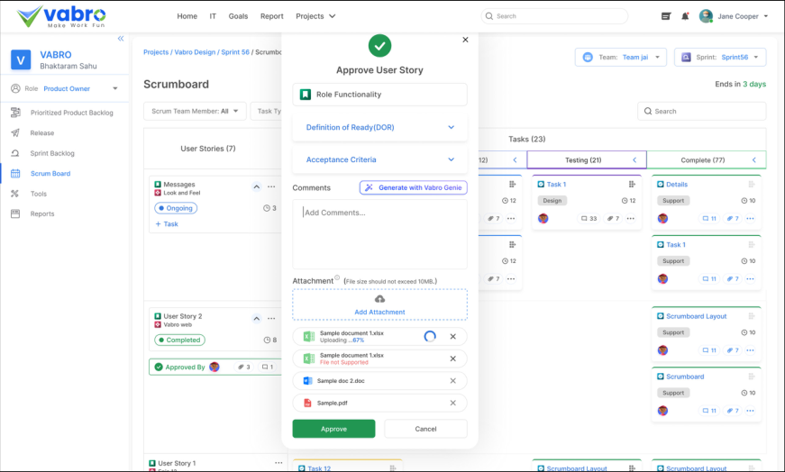

**Figura 11-5: Revisión y aprobación de la historia de usuario (fuente: Vabro)** 

#### **11.1.3 Salidas** 

##### **11.1.3.1 Historias de usuario aceptadas*** 

El objetivo de un sprint es crear entregables potencialmente enviables o incrementos del producto que cumplan con los criterios de aceptación definidos por el cliente y el Product Owner. Las historias de usuario que cumplen con los criterios de aceptación son aceptadas formalmente por el Product Owner. Estos entregables de historias de usuario aceptadas pueden ser presentados al cliente si así se desea.  Al final de cada reunión de revisión del sprint se conserva y se actualiza una lista de historias de usuario aceptadas. 

##### **11.1.3.2 Historias de usuario rechazadas** 

Si las historias de usuario no cumplen con los criterios de aceptación, se consideran incompletas y son rechazadas por el Product Owner. Las historias rechazadas se agregan de nuevo al backlog priorizado del producto para que puedan ser consideradas como parte de un sprint posterior. El trabajo en los entregables asociados a las historias de usuario rechazadas puede hacerlo cualquier Equipo Scrum al que se le asignen posteriormente esas historias. Debido a que probablemente ya se hizo algún trabajo al crear los entregables de estas historias rechazadas, si los entregables parcialmente terminados se desarrollan en un sprint posterior, las futuras estimaciones de estas historias pueden ser menores a la estimación original. 

**284** ©2025 SCRUMstudy™. _Una guía para el conocimiento de Scrum (Guía SBOK™)_ 

11 – REVISIÓN Y RETROSPECTIVA 

**11** 

Sin embargo, en algunos casos, los equipos pueden optar por ignorar por completo los entregables asociados a las historias de usuario rechazadas y considerarlas como historias nuevas. 

##### **11.1.3.3 Riesgos actualizados** 

Descrito en la sección 8.4.3.4. 

##### **11.1.3.4 Resultados del análisis del valor ganado** 

Descrito en la sección 4.6.1. 

##### **11.1.3.5 Cronograma de la planificación de la liberación actualizado** 

Descrito en la sección 8.6.3.1. 

©2025 SCRUMstudy™. _Una guía para el cuerpo de conocimiento de Scrum (Guía SBOK®)_ **285** 

11 – REVISIÓN Y RETROSPECTIVA 

### **11.2 Retrospectiva del sprint** 

En este proceso, el Scrum Master y el Equipo Scrum se reúnen para discutir las lecciones aprendidas durante el sprint. Esta información se documenta en forma de lecciones aprendidas que pudieran implementarse en futuros sprints a partir del siguiente. Como consecuencia de esta reunión, se pudieran obtener mejoras accionables acordadas o recomendaciones actualizadas del Scrum Guidance Body. Este proceso es un componente fundamental de la mejora continua en Scrum. 

La figura 11-6 muestra todas las entradas, las herramientas y las salidas para el proceso _Retrospectiva del sprint_ . 

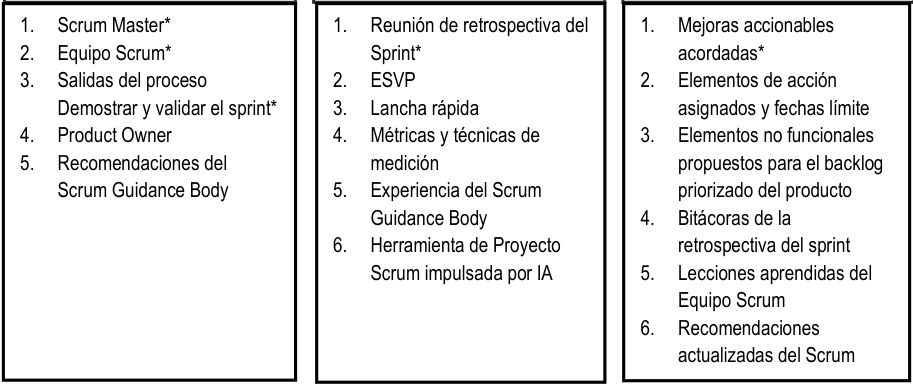

<!-- Start of picture text -->
1. Scrum Master*  1. Reunión de retrospectiva del  1. Mejoras accionables 2. Equipo Scrum*  Sprint*  acordadas* 3. Salidas del proceso  2. ESVP  2. Elementos de acción Demostrar y validar el sprint*  3. Lancha rápida  asignados y fechas límite 4. Product Owner   4. Métricas y técnicas de  3. Elementos no funcionales 5. Recomendaciones del  medición  propuestos para el backlog Scrum Guidance Body  5. Experiencia del Scrum  priorizado del producto Guidance Body  4. Bitácoras de la 6. Herramienta de Proyecto  retrospectiva del sprint Scrum impulsada por IA  5. Lecciones aprendidas del Equipo Scrum 6. Recomendaciones actualizadas del Scrum <!-- End of picture text -->

**Figura 11-6: Retrospectiva del sprint: entradas, herramientas y salidas** 

_Nota: Los asteriscos (*) indican una entrada, herramientas o salida “obligatoria” para el proceso correspondiente._ 

**286** ©2025 SCRUMstudy™. _Una guía para el conocimiento de Scrum (Guía SBOK™)_ 

11 – REVISIÓN Y RETROSPECTIVA 

**11** 

La figura 11-7 muestra el diagrama de flujo de este proceso. 

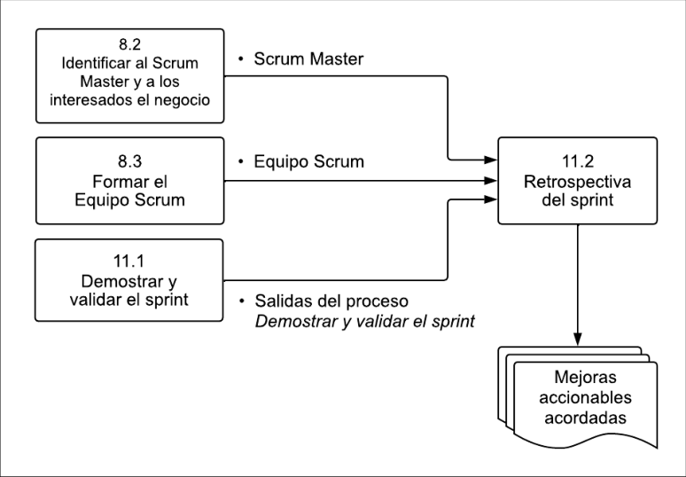

**Figura 11-7: Retrospectiva del sprint: diagrama de flujo** 

#### **11.2.1 Entradas** 

##### **11.2.1.1 Scrum Master*** 

Descrito en la sección 8.2.3.1. 

##### **11.2.1.2 Equipo Scrum*** 

Descrito en la sección 8.3.3.1. 

##### **11.2.1.3 Salidas del proceso Demostrar y validar el sprint*** 

Las salidas del proceso de _Demostrar y validar el sprint_ ofrecen información útil al momento de llevar a cabo el proceso de retrospectiva del sprint. Para conocer más detalles sobre las salidas del proceso de _Demostrar y validar el sprint_ , véase la sección 11.1.3. 

##### **11.2.1.4 Product Owner** 

Descrito en la sección 8.1.3.1. 

©2025 SCRUMstudy™. _Una guía para el cuerpo de conocimiento de Scrum (Guía SBOK®)_ **287** 

11 – REVISIÓN Y RETROSPECTIVA 

##### **11.2.1.5 Recomendaciones del Scrum Guidance Body** 

El Scrum Guidance Body puede brindar directrices para llevar a cabo las reuniones de retrospectiva del sprint, incluyendo sugerencias sobre herramientas a utilizarse, así como documentación o los entregables que se esperan de las reuniones. Para conocer más detalles sobre las recomendaciones del Scrum Guidance Body, véase la sección 8.1.1.7. 

#### **11.2.2 Herramientas** 

##### **11.2.2.1 Reunión de retrospectiva del sprint*** 

La reunión de retrospectiva del sprint es un elemento importante del marco de trabajo de “inspecciónadaptación” de Scrum y es el último paso en un sprint. Todos los miembros del Equipo Scrum asisten a la reunión que organiza y modera el Scrum Master. Se recomienda que asista el Product Owner, aunque no es obligatorio. Un integrante del equipo se desempeña como secretario y documenta las discusiones y los elementos para acciones a futuro. Es fundamental celebrar esta reunión es un entorno abierto y relajado a fin de fomentar la completa participación de todos los miembros del equipo. Las discusiones en la reunión de retrospectiva del sprint abarcan tanto lo que salió mal como lo que salió bien. 

Los principales objetivos de la reunión son identificar tres elementos específicos: 

- 1) Las cosas que el equipo necesita seguir haciendo: mejores prácticas 

- 2) Las cosas que el equipo necesita empezar a hacer: mejoras en el proceso 

- 3) Las cosas que el equipo necesita dejar de hacer: problemas de proceso y embotellamiento 

Estas áreas se analizan y se crea una lista de mejoras accionables acordadas. 

##### **11.2.2.2 Explorador—Comprador—Vacacionista—Prisionero (ESVP)** 

Es un ejercicio que se puede llevar a cabo al inicio de la reunión de retrospectiva del sprint para entender la mentalidad de los participantes y establecer el tono de la reunión. Se les pide a los asistentes que indiquen de forma anónima lo que mejor representa su punto de vista en la reunión. 

- Explorador ( _Explorer_ ): Quiere participar y aprender todo lo que se discutió en la retrospectiva 

- Comprador ( _Shopper_ ): Quiere escuchar todo y elegir lo que entiende de la retrospectiva 

- Vacacionista ( _Vacationer_ ): Quiere relajarse y ser turista en la retrospectiva 

- Prisionero ( _Prisoner_ ): Quiere estar en otro lugar y asiste a la retrospectiva por ser obligatorio 

El Scrum Master recoge las respuestas; prepara y comparte la información con el grupo. 

**288** ©2025 SCRUMstudy™. _Una guía para el conocimiento de Scrum (Guía SBOK™)_ 

11 – REVISIÓN Y RETROSPECTIVA 

**11** 

##### **11.2.2.3 Lancha rápida** 

La lancha rápida ( _speed boat_ ) es una técnica que se puede utilizar para llevar a cabo la reunión de retrospectiva del sprint. Los miembros juegan el rol de la tripulación en una lancha. La lancha debe llegar a una isla: simbólicamente la visión del proyecto. Los asistentes utilizan notas adhesivas para llevar un registro de motores y anclas. Los “motores” ayudan a llegar a la isla, mientras que las “anclas” son cosas que están obstaculizando la llegada. Este ejercicio tiene un límite de unos cuantos minutos. Una vez que se documentan todos los elementos, se reúne la información, se discute y se prioriza por medio de un proceso de votación. Se reconocen los motores y se planifican las acciones de mitigación para las anclas dependiendo de la prioridad. 

##### **11.2.2.4 Métricas y técnicas de medición** 

Se pueden utilizar varios indicadores para medir y contrastar el desempeño del equipo en el actual sprint en comparación al rendimiento de sprints anteriores. Algunos ejemplos de dichos parámetros incluyen: 

- Velocidad del equipo: Número de puntos de historia en un determinado sprint. 

- Tasa de terminado satisfactorio: Porcentaje de puntos de historia que se han terminado en comparación a los que se han asignado. 

- Efectividad de la estimación: Número o porcentaje de discrepancia entre el tiempo estimado y el tiempo actual en las tareas e historias de usuario. 

- Clasificación de retroalimentación de revisiones: Se puede solicitar la retroalimentación de los interesados del negocio utilizando clasificaciones cuantitativas o cualitativas, brindando una medida del desempeño del equipo. 

- Clasificación moral del equipo: Resultados de una autoevaluación de la moral de los miembros del equipo. 

- Retroalimentación de los compañeros: Se pueden implementar mecanismos de retroalimentación de 360 grados para solicitar una crítica constructiva e información sobre el rendimiento del equipo. 

- Avance hacia la liberación o lanzamiento: El valor de negocio que se brinda en cada liberación, así como el valor representado por el actual proceso encaminado a una liberación. Esto contribuye a la motivación del equipo y al nivel de satisfacción de trabajo. 

##### **11.2.2.5 Experiencia del Scrum Guidance Body** 

En el proceso de _Retrospectiva del sprint_ , la experiencia del Scrum Guidance Body podría estar relacionada a las mejores prácticas sobre cómo llevar a cabo reuniones de retrospectiva del sprint. Pudiera también haber expertos que pudieran brindar orientación sobre cómo utilizar las herramientas en el proceso de retrospectiva del sprint para entregar mejoras accionables acordadas para los futuros sprints. Para conocer más detalles sobre la experiencia del Scrum Guidance Body, véase la sección 8.4.2.7. 

##### **11.2.2.6 Herramienta de proyecto Scrum impulsada por IA** 

Descrito en la sección 2.4.4. 

©2025 SCRUMstudy™. _Una guía para el cuerpo de conocimiento de Scrum (Guía SBOK®)_ **289** 

11 – REVISIÓN Y RETROSPECTIVA 

#### **11.2.3 Salidas** 

##### **11.2.3.1 Mejoras accionables acordadas*** 

Las mejoras accionables acordadas ( _agreed actionable improvements_ ) son el principal resultado del proceso de _Retrospectiva del sprint_ . Forman parte de la lista de elementos accionables que ha elaborado el equipo para hacer frente a los problemas y mejorar los procesos a fin de mejorar también su desempeño en futuros sprints. 

##### **11.2.3.2 Elementos de acción asignados y fechas límite** 

Después de elaborar y refinar las mejoras accionables acordadas, el Equipo Scrum puede considerar los puntos de acción para implementar las mejoras. Cada elemento de acción contará con una fecha límite de conclusión. 

##### **11.2.3.3 Elementos no funcionales propuestos para el backlog priorizado del producto** 

La creación del backlog priorizado del producto inicial debe basarse en historias de usuario y en funcionalidades requeridas. Por lo general, los requerimientos no funcionales pudieran no estar completamente definidos en las primeras etapas del proyecto y pudieran surgir durante la revisión del sprint o en las reuniones de retrospectiva del sprint. Estos elementos deben agregarse al backlog priorizado del producto a medida que se descubren. Algunos ejemplos de requerimientos no funcionales son: tiempos de respuesta, limitaciones en la capacidad y problemas en materia de seguridad. 

##### **11.2.3.4 Bitácoras de la retrospectiva del sprint** 

Las bitácoras de la retrospectiva del sprint registran las opiniones, los debates y los elementos accionables planteados en la reunión de retrospectiva del sprint. El Scrum Master puede facilitar la creación de esta bitácora con la ayuda de los miembros del equipo principal de Scrum. La recopilación de todas las bitácoras de la retrospectiva del sprint se convierte en el diario del proyecto y detalla los éxitos, los problemas y las resoluciones. Las bitácoras son documentos públicos disponibles a todos en la organización. 

##### **11.2.3.5 Lecciones aprendidas del Equipo Scrum** 

El Equipo Scrum es un equipo autoorganizado y empoderado que debe aprender de los errores cometidos durante el sprint. Estas lecciones pueden ayudarle al equipo a mejorar su desempeño en futuros sprints. Las lecciones aprendidas también pueden documentarse en las recomendaciones del Scrum Guidance Body para compartirse con otros equipos de Scrum. 

Puede haber varias lecciones positivas aprendidas como parte de un sprint. Estas lecciones positivas aprendidas son parte clave de la retrospectiva y deben compartirse adecuadamente dentro del equipo y con el Scrum Guidance Body conforme el equipo avanza hacia una automejora continua. 

Algunos mejoramientos están por encima de la autoridad del Equipo Scrum o de las recomendaciones del Scrum Guidance Body. En tales casos, tal vez sea necesaria la ayuda de la alta gerencia o de otros interesados, y los elementos respectivos son escalados y rastreados por el Scrum Master o el Product Owner. 

©2025 SCRUMstudy™. _Una guía para el conocimiento de Scrum (Guía SBOK™)_ 

**290** 

11 – REVISIÓN Y RETROSPECTIVA 

**11** 

##### **11.2.3.6 Recomendaciones del Scrum Guidance Body actualizadas** 

Como resultado de la reunión de retrospectiva del sprint, se pueden hacer sugerencias para revisar o mejorar las recomendaciones del Scrum Guidance Body. Si dicho órgano acepta las sugerencias, estas se incorporarán como actualizaciones a la documentación del Scrum Guidance Body. 

©2025 SCRUMstudy™. _Una guía para el cuerpo de conocimiento de Scrum (Guía SBOK®)_ **291** 

11 – REVISIÓN Y RETROSPECTIVA 

### **11.3 Diagrama de flujo de la fase de revisión y retrospectiva** 

La figura 11-8 muestra el diagrama de flujo de la fase de revisión y retrospectiva. 

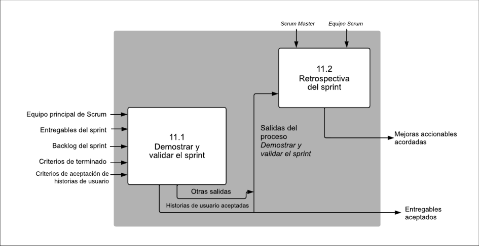

**Figura 11-8: Fase de revisión y retrospectiva: diagrama de flujo** 

©2025 SCRUMstudy™. _Una guía para el conocimiento de Scrum (Guía SBOK™)_ 

**292** 

12 – LIBERACIÓN 

**12** 

## **12. LIBERACIÓN** 

La fase de liberación ( _release_ ) se enfoca en la entrega al cliente de los entregables aceptados, así como en la identificación, documentación e internalización de las lecciones aprendidas durante el proyecto. 

<mark>La liberación, tal como se define en la</mark> _<mark>Guía de los fundamentos de Scrum (Guía del SBOK</mark>__®_ _<mark>)</mark>_ <mark>, es aplicable a los siguientes:</mark> 

- <mark>Portafolios, programas o proyectos en cualquier industria;</mark> 

- <mark>Productos, servicios o cualquier otro resultado que se entregará a los</mark> interesados del negocio; 

- <mark>Proyectos de cualquier tamaño o complejidad.</mark> 

<mark>El término “producto” en la</mark> _<mark>Guía del SBOK</mark>__®_ <mark>puede referirse a un producto, servicio, o cualquier otro entregable. Scrum se puede aplicar de manera efectiva a cualquier proyecto en cualquier industria: desde proyectos o equipos pequeños con tan solo seis miembros, hasta proyectos grandes y complejos con cientos de miembros.</mark> 

Para facilitar la mejor aplicación del marco de trabajo de Scrum, en este capítulo se identifican las entradas, herramientas y salidas de cada proceso, ya sea como “obligatorias” u “opcionales”. Las entradas, herramientas y salidas indicadas con asteriscos (*) son obligatorias o se consideran importantes para el éxito, mientras que las que no tienen asteriscos son opcionales. 

Se recomienda que el Equipo Scrum y aquellas personas que empiezan a aprender sobre el marco de trabajo y los procesos de Scrum, se enfoquen principalmente en las entradas, herramientas y salidas obligatorias; mientras que los Product Owners, Scrum Masters y demás practicantes con experiencia en Scrum, se deberían de esforzar por alcanzar un conocimiento más a fondo sobre la información ofrecida en este capítulo. 

<mark>Este capítulo está escrito desde la perspectiva de un Equipo Scrum que trabaja en un sprint para producir entregables que pudieran ser parte de un proyecto más grande, de un programa o portafolio. La información sobre cómo escalar Scrum en grandes proyectos está disponible en el capítulo 13 y lo relacionado a escalar Scrum para la empresa se puede encontrar en el capítulo 14.</mark> 

La liberación es una fase que normalmente se hace varias veces en un proyecto. Aunque el resultado de cada sprint equivale a un producto potencialmente enviable, no necesariamente hay una liberación después de cada sprint. 

Después de que uno o varios sprints, todos los entregables de las historias de usuario aceptadas del sprint son liberados a los interesados del negocio relevantes para su uso y aceptación. La frecuencia de las liberaciones se define en el cronograma de la liberación. 

Además de la liberación de los entregables, el equipo principal de Scrum y los interesados del negocio en la organización establecen la forma de mejorar la ejecución en futuras liberaciones en el proyecto. 

También es importante destacar que, aunque todos los procesos se definen de forma única en la _<mark>Guía del SBOK</mark>__®_ _<mark>,</mark>_ no necesariamente se llevan a cabo de forma secuencial o por separado. En ocasiones, puede ser más apropiado combinar algunos procesos, dependiendo de los requisitos específicos de cada proyecto. 

©2025 SCRUMstudy™. _Una guía para el conocimiento de Scrum (Guía SBOK™)_ **293** 

12 – LIBERACIÓN 

<mark>La figura 12-1 brinda una descripción general de los procesos de la fase de liberación:</mark> 

**12.1 Enviar entregables:** En este proceso se entregan los interesados del negocio relevantes todos los entregables de las historias de usuario aceptadas en sprints previamente terminados. La conclusión satisfactoria del sprint se documenta en un acuerdo de entregables funcionales. 

**12.2 Retrospectiva de la liberación:** En este proceso, en el cual se concluye el proyecto, los interesados del negocio y los miembros del equipo principal de Scrum se reúnen para reflexionar sobre el proyecto e identificar, documentar e internalizar las lecciones que se aprendieron. Generalmente, dichas lecciones permiten documentar las mejoras accionables acordadas e implementarlas en futuros proyectos. 

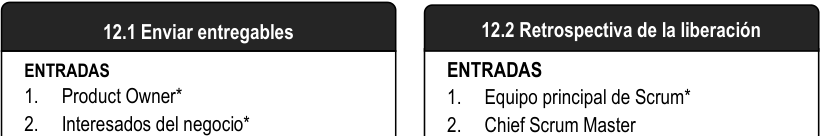

<!-- Start of picture text -->
12.1 Enviar entregables  12.2 Retrospectiva de la liberación ENTRADAS  ENTRADAS 1. Product Owner*  1. Equipo principal de Scrum* 2. Interesados del negocio*  2. Chief Scrum Master <!-- End of picture text -->

3. Entregables aceptados* 3. Chief Product Owner 4. Cronograma de planificación de la 4. Interesados del negocio liberación* 5. Recomendaciones del Scrum Guidance 

5. Scrum Master Body 6. Equipo Scrum **HERRAMIENTAS** 7. Criterios de aceptación de las historias 1. Reunión de retrospectiva de la liberación* de usuario 2. Otras herramientas para la retrospectiva 

8. Plan piloto de la liberación 9. Recomendaciones del Scrum Guidance 3. Experiencia del Scrum Guidance Body Body 4. Herramienta de Proyecto Scrum 

**HERRAMIENTAS** impulsada por IA 1. Métodos de despliegue organizacional* **SALIDAS** 2. Planificación de las comunicaciones 1. Mejoras accionables acodadas* 3. Herramienta de Proyecto Scrum 2. Elementos de acción asignados y fechas impulsada por IA límite* 

**SALIDAS** 3. Elementos no funcionales propuestos 1. Acuerdo de entregables funcionales* para el backlog del producto del 2. Entregables funcionales programa y el backlog priorizado del 3. Liberación del producto* producto 4. Plan de comunicación 4. Recomendaciones del Scrum Guidance Body actualizadas 

   4. Interesados del negocio 5. Recomendaciones del Scrum Guidance Body 

   **HERRAMIENTAS** 1. Reunión de retrospectiva de la liberación* 

**Figura 12-1: Información general de la fase de liberación** 

_Nota: Los asteriscos (*) indican una entrada, herramientas o salida “obligatoria” para el proceso correspondiente._ 

**294** ©2025 SCRUMstudy™. _Una guía para el conocimiento de Scrum (Guía SBOK™)_ 

12 – LIBERACIÓN 

**12** 

La figura 12-2 muestra las entradas obligatorias, herramientas y salidas para los procesos en fase de liberación. 

- **12.1 Enviar entregables 12.2 Retrospectiva de la liberación** 

- **ENTRADAS ENTRADAS** 1. Product Owner* 1. Equipo principal de Scrum* 2. Interesados del negocio* **HERRAMIENTAS** 3. Entregables aceptados* 1. Reunión de retrospectiva de la 4. Cronograma de planificación de la liberación* liberación* **SALIDAS** 

- **HERRAMIENTAS** 1. Mejoras accionables acodadas* 

- 1. Métodos de despliegue 2. Elementos de acción asignados y 

- organizacional* fechas límite* 

- **SALIDAS** 1. Acuerdo de entregables funcionales* 2. Entregables funcionales 3. Liberación del producto* 

**Figura 12-2: Información general de la fase de liberación (fundamentales)** 

_Nota: Los asteriscos (*) indican una entrada, herramientas o salida “obligatoria” para el proceso correspondiente._ 

©2025 SCRUMstudy™. _Una guía para el conocimiento de Scrum (Guía SBOK™)_ **295** 

12 – LIBERACIÓN 

### **12.1 Enviar entregables** 

En este proceso se entregan los interesados del negocio relevantes todos los entregables de las historias de usuario aceptadas en sprints previamente terminados. La conclusión satisfactoria del sprint se documenta en un acuerdo de entregables funcionales. 

La figura 12-3 muestra todas las entradas, las herramientas y las salidas para el proceso de _Enviar entregables_ . 

1. Product Owner* 1. Métodos de despliegue 1. Acuerdo de entregables 2. Interesados del negocio* organizacional* funcionales* 3. Entregables aceptados* 2. Planificación de las 2. Entregables funcionales 4. Cronograma de planificación comunicaciones 3. Liberación del producto* de la liberación* 3. Herramienta de Proyecto 4. Plan de comunicación 

5. Scrum Master Scrum impulsada por IA 6. Equipo Scrum 7. Criterios de aceptación de las historias de usuario 

8. Plan piloto 9. Recomendaciones del Scrum Guidance Body 

**Figura 12-3: Enviar entregables: entradas, herramientas y salidas** 

_Nota: Los asteriscos (*) indican una entrada, herramientas o salida “obligatoria” para el proceso correspondiente._ 

**296** ©2025 SCRUMstudy™. _Una guía para el conocimiento de Scrum (Guía SBOK™)_ 

12 – LIBERACIÓN 

**12** 

La figura 12-4 muestra el diagrama de flujo de este proceso. 

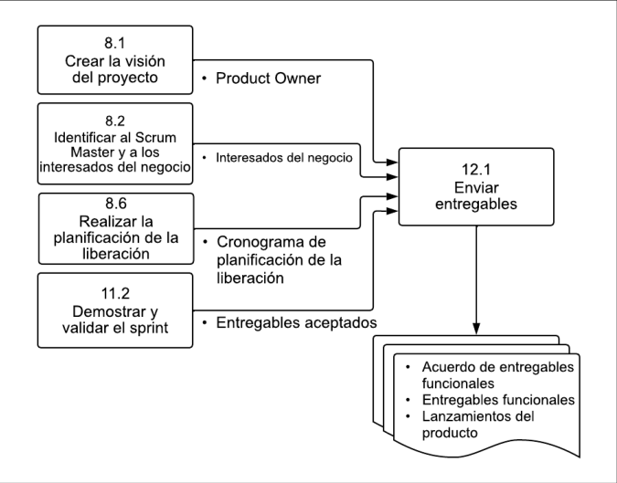

**Figura 12-4: Enviar entregables: diagrama de flujo** 

#### **12.1.1 Entradas** 

##### **12.1.1.1 Product Owner*** 

Descrito en la sección 8.1.3.1. 

##### **12.1.1.2 Interesados del negocio*** 

Descrito en la sección 8.2.3.2. 

##### **12.1.1.3 Entregables aceptados*** 

Son los entregables creados por el Equipo Scrum y que están asociados a las historias de usuario aceptadas que fueron formalmente aprobadas por el Product Owner. 

Las historias de usuario aceptadas se describen en la sección 11.1.3.1. 

##### **12.1.1.4 Cronograma de planificación de la liberación** 

Descrito en la sección 8.6.3.1. 

©2025 SCRUMstudy™. _Una guía para el conocimiento de Scrum (Guía SBOK™)_ **297** 

12 – LIBERACIÓN 

##### **12.1.1.5 Scrum Master** 

Descrito en la sección 8.2.3.1. 

##### **12.1.1.6 Equipo Scrum** 

Descrito en la sección 8.3.3.1. 

##### **12.1.1.7 Criterios de aceptación de las historias de usuario** 

Descrito en la sección 9.1.3.2. 

##### **12.1.1.8 Plan piloto** 

Se puede utilizar un plan piloto para mapear a detalle un despliegue piloto. El alcance y los objetivos del despliegue, la base de usuarios seleccionada para la implementación, un cronograma del despliegue, los planes de transición, la preparación requerida del usuario, los criterios de evaluación para el despliegue y otros elementos clave relacionados al despliegue, se identifican en el plan piloto y se comparten con los interesados del negocio. 

##### **12.1.1.9 Recomendaciones del Scrum Guidance Body** 

En el proceso de _Enviar entregables_ , el Scrum Guidance Body puede brindar recomendaciones y directrices para el despliegue de productos. Estas son las mejores prácticas que se deben tomar en cuenta al implementar un producto al cliente con el fin de maximizar el valor entregado. Para obtener más información sobre las recomendaciones del Scrum Guidance Body, véase la sección 8.1.1.7. 

#### **12.1.2 Herramientas** 

##### **12.1.2.1 Métodos de despliegue organizacional*** 

Los mecanismos de despliegue de cada organización tienden a ser diferentes según su respectiva industria, sus usuarios meta y su posicionamiento. Dependiendo del producto a entregarse, el despliegue puede ser remoto o puede incluir el envío físico o la transición de un artículo. Debido a que la implementación tiende a implicar un alto nivel de riesgo, las organizaciones suelen tener mecanismos de implementación bien definidos y establecidos, con procesos detallados para garantizar el cumplimiento de todas las normas aplicables y medidas de garantía de calidad _._ Estas podrían incluir aprobaciones finales de los representantes específicos de gestión, mecanismos de aprobación de usuario y directrices para la funcionalidad mínima de una liberación. 

**298** ©2025 SCRUMstudy™. _Una guía para el conocimiento de Scrum (Guía SBOK™)_ 

12 – LIBERACIÓN 

**12** 

##### **12.1.2.2 Planificación de las comunicaciones** 

La planificación de las comunicaciones se utiliza para crear el plan de comunición del proyecto. El plan especifica los registros que se deben crear y mantener durante todo el proyecto. Se utiliza una variedad de métodos para transmitir a los interesados del negocio información importante sobre el proyecto. A medida que se los entregables de la historia de usuario se someten a prueba, el estatus de las actividades de prueba se comunica según el plan de comunicaciones como lo haya establecido el Product Owner y el patrocinador. 

##### **12.1.2.3 Herramienta de proyecto Scrum impulsada por IA** 

###### Descrito en la sección 2.4.4. 

La Figura 12-5 es una interfaz Vabro utilizada para la gestión de versiones en scrum. Muestra cómo las herramientas impulsadas por IA ayudan con el empaquetado, el seguimiento de aprobaciones y la documentación de lanzamiento de versiones para la entrega a las partes interesadas. 

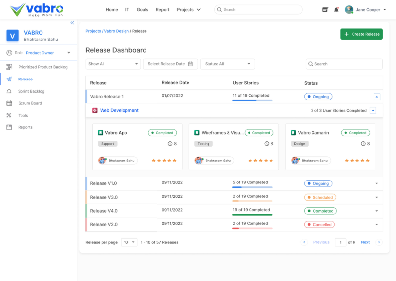

**Figura 12-5: Gestión de lanzamientos en Scrum (fuente: Vabro)** 

©2025 SCRUMstudy™. _Una guía para el conocimiento de Scrum (Guía SBOK™)_ **299** 

12 – LIBERACIÓN 

La figura 12-6 es una interfaz de Jira para administrar versiones. Incluye visualización de fechas de lanzamiento, listas de verificación de implementación y elementos de trabajo pendiente vinculados para garantizar la integridad y la trazabilidad. 

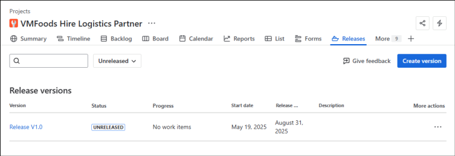

**Figura 12-6: Gestión de lanzamientos en Scrum (fuente: Jira)** 

#### **12.1.3 Salidas** 

##### **12.1.3.1 Acuerdo de entregables funcionales*** 

Los entregables aceptados obtienen el cierre formal del negocio y la aprobación formal del cliente o del patrocinador. Obtener la aceptación formal del cliente es fundamental para el reconocimiento o la aceptación de los resultados del proyecto y el cumplimiento del objetivo del proyecto. 

##### **12.1.3.2 Entregables funcionales*** 

Los entregables funcionales son los entregables enviables en un proyecto aprobado y que ya quedaron terminados, probados y autorizados. A medida que se crean nuevos incrementos de los productos, estos se integran constantemente a los incrementos anteriores, por lo que hay un producto potencialmente entregable disponible en todo momento a lo largo del proyecto. 

##### **12.1.3.3 Liberación del producto*** 

La liberación del producto debe incluir lo siguiente: 

- Contenido de la liberación: Incluye información importante sobre los entregables que pudiera ayudar al personal de atención al cliente. 

- Notas sobre la liberación: Las notas sobre la liberación deben incluir criterios de envío externos para el mercado sobre los productos que serán entregados. 

**300** ©2025 SCRUMstudy™. _Una guía para el conocimiento de Scrum (Guía SBOK™)_ 

12 – LIBERACIÓN 

**12** 

##### **12.1.3.4 Plan de comunicación** 

El plan de comunicación define los métodos que se utilizarán para transmitir información importante sobre el proyecto a los interesados del negocio y a las personas responsables de varias actividades de comunicación. Un mecanismo común de comunicación es una representación visual que muestra información importante y en un formato fácil de interpretar, publicado en un lugar accesible y que se mantiene al día con la información más actualizada. 

©2025 SCRUMstudy™. _Una guía para el conocimiento de Scrum (Guía SBOK™)_ **301** 

12 – LIBERACIÓN 

### **12.2 Retrospectiva de la liberación** 

En este proceso, en el cual se concluye el proyecto, los interesados del negocio y los miembros del equipo principal de Scrum se reúnen para reflexionar sobre el proyecto e identificar, documentar e internalizar las lecciones que se aprendieron. Generalmente, dichas lecciones permiten documentar las mejoras accionables acordadas e implementarlas en futuros proyectos. 

La figura 12-7 muestra todas las entradas, las herramientas y las salidas para el proceso de _Retrospectiva de la liberación._ 

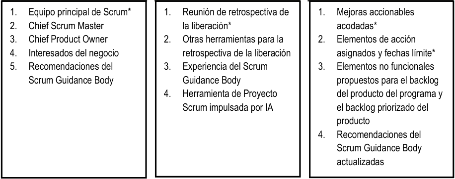

<!-- Start of picture text -->
1. Equipo principal de Scrum*  1. Reunión de retrospectiva de  1. Mejoras accionables 2. Chief Scrum Master   la liberación*  acodadas* 3. Chief Product Owner  2. Otras herramientas para la  2. Elementos de acción 4. Interesados del negocio  retrospectiva de la liberación   asignados y fechas límite* 5. Recomendaciones del  3. Experiencia del Scrum  3. Elementos no funcionales Scrum Guidance Body  Guidance Body  propuestos para el backlog 4. Herramienta de Proyecto  del producto del programa y Scrum impulsada por IA  el backlog priorizado del producto 4. Recomendaciones del Scrum Guidance Body actualizadas <!-- End of picture text -->

**Figura 12-7: Retrospectiva de la liberación: entrada, herramientas y salidas** 

_Nota: Los asteriscos (*) indican una entrada, herramientas o salida “obligatoria” para el proceso correspondiente._ 

**302** ©2025 SCRUMstudy™. _Una guía para el conocimiento de Scrum (Guía SBOK™)_ 

12 – LIBERACIÓN 

**12** 

La figura 12-8 muestra el diagrama de flujo de este proceso. 

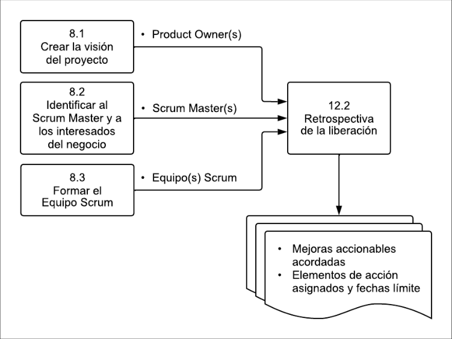

**Figura 12-8: Retrospectiva de la liberación: Diagrama de flujo** 

#### **12.2.1 Entradas** 

##### **12.2.1.1 Equipo principal de Scrum*** 

Descrito en la sección 8.4.1.1. 

##### **12.2.1.2 Chief Scrum Master** 

Descrito en la sección 3.7.2.2. 

##### **12.2.1.3 Chief Product Owner** 

Descrito en la sección 3.7.2.1. 

##### **12.2.1.4 Interesados del negocio** 

Descrito en la sección 8.2.3.2. 

©2025 SCRUMstudy™. _Una guía para el conocimiento de Scrum (Guía SBOK™)_ **303** 

12 – LIBERACIÓN 

##### **12.2.1.5 Recomendaciones del Scrum Guidance Body** 

En el proceso de _Retrospectiva de la liberación_ , las recomendaciones del Scrum Guidance Body pueden incluir un repositorio de plantillas internas que apoyan los proyectos futuros y brindan orientación para la realizar la reunión de retrospectiva de la liberación. La orientación que se brinda puede estar relacionada a procedimientos administrativos, auditorias, evaluaciones y criterios de transición del proyecto. Generalmente incluyen también la forma en la que la organización habrá de mantener el conocimiento base de las lecciones aprendidas y la información de todos los proyectos. Para obtener más información sobre las recomendaciones del Scrum Guidance Body, véase la sección 8.1.1.7. 

#### **12.2.2 Herramientas** 

##### **12.2.2.1 Reunión de retrospectiva de la liberación*** 

La reunión de retrospectiva de la liberación ayuda a definir la forma en la que pueden mejorar a futuro la colaboración y la eficiencia del equipo. También se analizan las oportunidades positivas, negativas y potenciales para mejorar. Esta reunión no tiene un time-box asignado y se puede llevar a cabo en forma presencial o en formato virtual. Entre los asistentes se encuentran: el equipo del proyecto, el Chief Scrum Master, el Chief Product Owner y los <mark>interesados del negocio</mark> . Durante la reunión, se documentan las lecciones aprendidas y los participantes buscan oportunidades para mejorar los procesos y atender las ineficiencias. Si el equipo principal de Scrum o el Scrum Guidance Body no tienen autoridad para aprobar las sugerencias de mejoramiento, estas sugerencias deben de presentarse ante los ejecutivos de la organización u a otras personas ajenas al proyecto. 

##### **12.2.2.2 Otras herramientas para la retrospectiva de la liberación** 

Algunas de las herramientas utilizadas en el proceso de _Retrospectiva del sprint_ también se pueden utilizar en este proceso. Por ejemplo: 

- Ejercicios de Explorador—Comprador—Vacacionista—Prisionero (ESVP) 

- Lancha rápida 

- Métricas y técnicas de medición 

Para conocer más detalles sobre estas herramientas, véanse las secciones 11.2.2.2, 11.2.2.3 y 11.2.2.4. 

##### **12.2.2.3 Experiencia del Scrum Guidance Body** 

En el proceso de _Retrospectiva de la liberación_ , la responsabilidad principal del Scrum Guidance Body es asegurar que las lecciones aprendidas en cada proyecto no se hayan perdido y que estén integradas en la organización y en sus esfuerzos de mejora continua. Asimismo, un Scrum Guidance Body puede aportar su experiencia en diversos ámbitos, entre ellos la calidad, recursos humanos y Scrum, que pudiera ser útil en el proceso de _Retrospectiva de la liberación._ Además, dicho órgano puede ofrecer sugerencias respecto a cómo se debe llevar a cabo la reunión de retrospectiva de la liberación. Para obtener más información sobre la experiencia del Scrum Guidance Body, véase la sección 8.4.2.7. 

**304** ©2025 SCRUMstudy™. _Una guía para el conocimiento de Scrum (Guía SBOK™)_ 

12 – LIBERACIÓN 

**12** 

##### **12.2.2.4 Herramienta de proyecto Scrum impulsada por IA** 

Descrito en la sección 2.4.4. 

#### **12.2.3 Salidas** 

##### **12.2.3.1 Mejoras accionables acordadas*** 

Descrito en la sección 11.2.3.1. 

##### **12.2.3.2 Elementos de acción asignados y fechas límite*** 

Descrito en la sección 11.2.3.2. 

##### **12.2.3.3 Elementos no funcionales propuestos para el backlog del producto del programa y el backlog priorizado del producto** 

Cuando se desarrolla el primer backlog del producto del programa o el backlog priorizado del producto, se basan en las historias de usuario y en las funcionalidades requeridas. Por lo general los requerimientos no funcionales pudieran no estar completamente definidos en las primeras etapas del proyecto y pudieran surgir durante la revisión del sprint, la retrospectiva del sprint o en las reuniones de retrospectiva de la liberación. 

Dichos elementos deben agregarse al backlog del producto del programa (para el programa) y en el backlog priorizado del producto (para el proyecto) conforme se van encontrando. Algunos ejemplos de requerimientos no funcionales son: tiempos de respuesta, limitaciones en la capacidad y asuntos en materia de seguridad. 

##### **12.2.3.4 Recomendaciones del Scrum Guidance Body actualizadas** 

Descritos en la sección 11.2.3.6 

©2025 SCRUMstudy™. _Una guía para el conocimiento de Scrum (Guía SBOK™)_ **305** 

12 – LIBERACIÓN 

### **12.3 Diagrama de flujo de la fase de liberación** 

La figura 12-9 muestra el diagrama de flujo de la fase de liberación. 

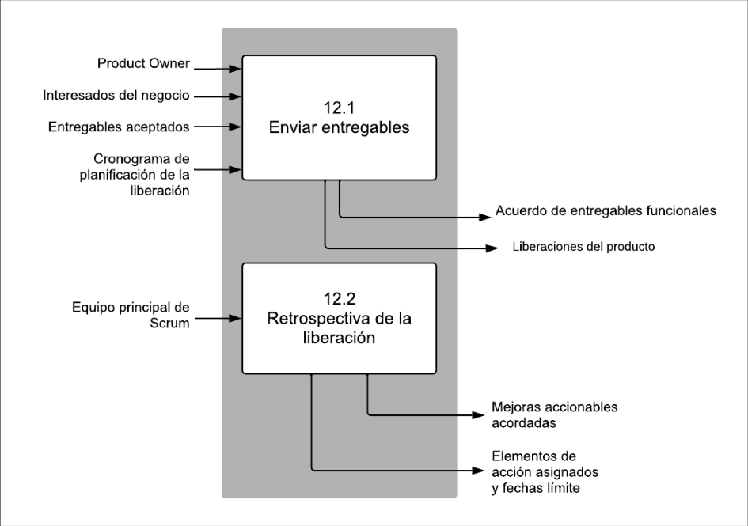

**Figura 12-9: Fase de liberación: diagrama de flujo** 

**306** ©2025 SCRUMstudy™. _Una guía para el conocimiento de Scrum (Guía SBOK™)_ 

13 – ESCALADO DE SCRUM PARA PROYECTOS GRANDES 

**13** 

## **13. ESCALAMIENTO DE SCRUM EN GRANDES PROYECTOS** 

Este capítulo se enfoca en aspectos adicionales de proyectos Scrums que aplican únicamente a grandes proyectos. Escalar Scrum en grandes proyectos, tal como se define en la _Guía de los fundamentos de Scrum (Guía del SBOK__®_ _)_ aplica a lo siguiente: 

- Grandes proyectos en cualquier industria 

- <mark>Productos, servicios o cualquier otro resultado que se entregará a los</mark> interesados del negocio; 

<mark>El término “producto” en la</mark> _<mark>Guía del SBOK</mark>__®_ <mark>puede referirse a un producto, servicio, o cualquier otro entregable. Scrum no solo se aplica eficazmente en pequeños proyectos en cualquier industria, sino también en proyectos grandes y complejos con cientos de personas y varios equipos.</mark> 

<mark>Además del impacto que tienen los grandes proyectos en los procesos fundamentales de Scrum en los capítulos del 8 al 12, este capítulo introduce tres procesos adicionales que aplican a nuevos grandes proyectos.</mark> 

Para facilitar la mejor aplicación del marco de trabajo de Scrum, en este capítulo se identifican las entradas, herramientas y salidas de cada proceso, ya sea como “obligatorias” u “opcionales”. Las entradas, herramientas y salidas indicadas con asteriscos (*) son obligatorias o se consideran importantes para el éxito, mientras que las que no tienen asteriscos son opcionales. 

Se recomienda que el Equipo Scrum y aquellas personas que empiezan a aprender sobre el marco de trabajo y los procesos de Scrum, se enfoquen principalmente en las entradas, herramientas y salidas obligatorias; mientras que los Product Owners, Scrum Masters y demás practicantes con experiencia en Scrum, se deberían de esforzar por alcanzar un conocimiento más a fondo sobre la información ofrecida en este capítulo. También es importante destacar que, aunque todos los procesos se definen de forma única en la _<mark>Guía del SBOK</mark>__®_ _<mark>,</mark>_ no necesariamente se llevan a cabo de forma secuencial o por separado. En ocasiones, puede ser más apropiado combinar algunos procesos, dependiendo de los requisitos específicos de cada proyecto. 

<mark>Este capítulo está escrito desde la perspectiva de un equipo de un proyecto grande que coordina actividades de varios equipos Scrum en un proyecto grande para producto incrementos o entregables potencialmente enviables. La información adicional sobre el uso de Scrum para cualquier proyecto (grandes o pequeños) está disponible en los capítulos del 2 al 7, que cubren los principios y aspectos de Scrum.</mark> 

###### **Grandes proyectos de Scrum vs. Típico proyecto pequeño de Scrum** 

Los procesos fundamentales de Scrum que se definen en los capítulos del 8 al 12 son válidos para proyectos de Scrum con un Product Owner, un Scrum Master y un Equipo Scrum. Los conceptos mencionados en dichos capítulos también son suficientes para gestionar pequeños proyectos Scrum. Al gestionar grandes proyectos que generalmente requieren la participación de más equipos con múltiples Product Owners y Scrum Masters, además de los procesos definidos en los capítulos del 8 al 12, tal vez sean necesarios algunos procesos adicionales para abordar la coordinación adicional y los esfuerzos de sincronización. El efecto de estos procesos fundamentales que solo aplican a los grandes proyectos de Scrum se describe en este capítulo. 

La definición de “grandes proyectos” dependerá de la empresa y de la complejidad del proyecto emprendido. El criterio fundamental para que un proyecto se considere grande en vez de pequeño es contar con múltiples Scrum Masters o Product Owners. Si el proyecto solo requiere de un Scrum Master y de un Product Owner, estos generalmente pueden gestionar cualquier actividad de comunicación y sincronización que requiera el proyecto. 

©2025 SCRUMstudy™. _Una guía para el conocimiento de Scrum (Guía SBOK™)_ **307** 

13 – ESCALADO DE SCRUM PARA PROYECTOS GRANDES 

Algunos motivos por los que resulta necesario definir entradas, herramientas y salidas adicionales en los grandes proyectos son los siguientes: 

###### **Equipos Scrum** 

- Mayor interacción y dependencias entre los equipos Scrum, ya que en los grandes proyectos aumenta la complejidad. 

- La necesidad de gestionar conflictos, resolver problemas y establecer prioridades entre todos los equipos Scrum. 

- La necesidad de la especialización, ya que en algunos equipos Scrum tal vez sea necesaria la presencia de recursos especializados para realizar tareas específicas en un proyecto grande, y tal vez no todos los equipos Scrum cuenten con tales habilidades. 

- La necesidad de definir ciertas normas y estándares que deben cumplir todos los equipos Scrum (ejemplo: estándares de seguridad dentro de una empresa o normas legales o gubernamentales en industrias específicas). Estas tal vez tengan que ser definidas en el Scrum Guidance Body. 

- Los requisitos para establecer un ambiente en un proyecto grande que después utilizarán todos los equipos Scrum. 

- La necesidad de coordinar los resultados de varios equipos Scrum a fin de crear la liberación de en un proyecto grande. 

###### **Scrum Masters** 

- La necesidad de colaboración entre Scrum Masters al atender los impedimentos y para sincronizar el trabajo de múltiples equipos Scrum. 

###### **Product Owner** 

- La necesidad de colaboración entre Product Owners cuando trabajan con los interesados del negocio, cuando refinan el backlog priorizado del producto y cuando trabajar con equipos Scrum. 

También es importante destacar que, a medida que Scrum se aplica en grandes proyectos, tal vez resulte necesario el apoyo de arquitectos, directores de producto, cumplimiento, seguridad de información, órganos de gobierno, etc. 

**308** ©2025 SCRUMstudy™. _Una guía para el conocimiento de Scrum (Guía SBOK™)_ 

13 – ESCALADO DE SCRUM PARA PROYECTOS GRANDES 

**13** 

La figura 13-1 muestra el panel de Vabro utilizado para configurar un proyecto grande, mostrando información sobre el proyecto, las tareas personales y las opciones de navegación, lo que permite a los usuarios administrar el trabajo, la configuración y acceder a la consola de administración de manera eficiente. 

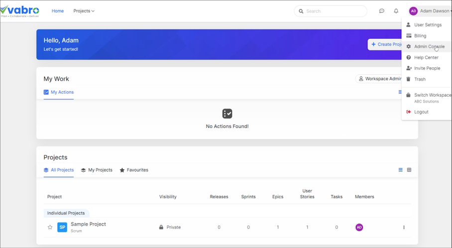

**Figura 13-1: Configuración de un proyecto grande (Fuente: Vabro)** 

©2025 SCRUMstudy™. _Una guía para el conocimiento de Scrum (Guía SBOK™)_ **309** 

13 – ESCALADO DE SCRUM PARA PROYECTOS GRANDES 

### **13.1 El impacto de los grandes proyectos en los procesos fundamentales de Scrum** 

Aunque los procesos fundamentales de Scrum descritos en los capítulos del 8 al 12 son válidos en los grandes proyectos, existen consideraciones especiales que deben tomarse en cuenta. Las tablas 13-1 a 13.5 describen el impacto de los grandes proyectos en los procesos fundamentales de Scrum de cada fase del proyecto. 

#### **13.1.1 Inicio** 

La fase de inicio en un proyecto grande tiene los mismos objetivos y sigue el mismo flujo que en un típico proyecto pequeño de Scrum. 

A diferencia de un proyecto pequeño, se deben identificar roles y actividades adicionales que se llevarán a cabo para lograr un acuerdo sobre la colaboración entre los interesados del negocio y los múltiples Scrum Masters, Equipos Scrum y Product Owner. 

La figura 13-2 muestra la pantalla de creación de proyectos en Vabro, donde los usuarios definen la plantilla, la visibilidad, el nombre, la descripción y los criterios de estimación para la planificación estructurada. 

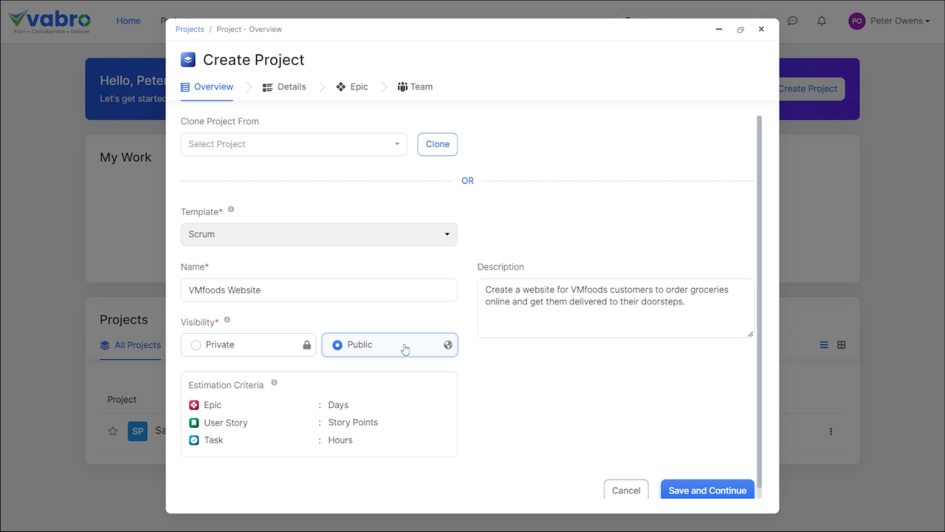

**Figura 13-2: Inicio de un proyecto de gran envergadura (fuente: Vabro)** 

**310** ©2025 SCRUMstudy™. _Una guía para el conocimiento de Scrum (Guía SBOK™)_ 

13 – ESCALADO DE SCRUM PARA PROYECTOS GRANDES 

**13** 

|**Proceso**|**Resumen del impacto en los grandes proyectos**|
|---|---|
|**8.1 Crear la visión** **del proyecto**|En este proceso se identifican al Chief Product Owner y a los Product Owners adicionales. En un proyecto grande, el Chief Product Owner tiene la responsabilidad general de negocio en el proyecto y trabaja con el patrocinador y con otros interesados del negocio para crear la visión del proyecto. En este proceso también se elabora el plan de colaboración de Product Owners. **Salida adicional: Chief Product Owner identificado***(sección 3.7.2.1) En los grandes proyectos, el Chief Product Owner tiene la responsabilidad general del negocio y trabaja con el patrocinador y otros interesados del negocio para crear la visión del proyecto. En este proceso se identifica al Chief Product Owner. **Salida actualizada: Product Owner identificado***(sección 8.1.3.1) Debido a que en un proyecto grande hay múltiples Product Owners, también es necesario identificarlos en este proceso. **Salida adicional: Plan de colaboración de Product Owners***(sección 13.2.2) En los grandes proyectos es fundamental que todo el equipo de Product Owners adopten Scrum y colaboren para presentar con éxito los proyectos de Scrum.|

©2025 SCRUMstudy™. _Una guía para el conocimiento de Scrum (Guía SBOK™)_ **311** 

13 – ESCALADO DE SCRUM PARA PROYECTOS GRANDES 

|**8.2 Identificar al** **Scrum Master** **y a los** **interesados** **del negocio**|En este proceso se identifican al Chief Scrum Master y a los Scrum Masters adicionales. El Chief Scrum Master se enfoca en la interacción entre múltiples equipos y en la sincronización. Las salidas adicionales o actualizadas de este proceso son las siguientes: **Salida adicional: Chief Scrum Master identificado***(sección 3.7.2.2) Al igual que el Chief Product Owner, el Chief Scrum Master también debe ser identificado en un proyecto grande. Este rol se enfoca en la interacción de múltiples equipos y en la sincronización. **Salida adicional: Scrum Masters identificados*** En este proceso se identifican a múltiples Scrum Masters **Salida adicional: Organización de scrum para grandes proyectos***(13.2.1) Es fundamental que todo el equipo de un proyecto grande tenga un entendimiento común de Scrum y de los acuerdos de trabajo para entregar con éxito el proyecto de Scrum. **Salida adicional:  Plan de colaboración de los Scrum Masters y los Equipos** **Scrum***(13.2.3) El plan de colaboración de los Scrum Master y los Equipos Scrum define la forma en la que participación los Scrum Masters y los equipos en la refinación del backlog priorizado del producto. Este plan define también cuáles representantes del equipo participarán en el proceso de refinamiento y cómo serán seleccionados. **Salida adicional: Recursos compartidos***(sección 13.2.4) Una entrada necesaria para formar equipos individuales de Scrum es el conocimiento de cualquier recurso disponible para el equipo. **Salida actualizada: Servicios de apoyo identificados***(sección 3.3.2) Además de identificar los servicios de apoyo, en los grandes proyectos tal vez sean necesarios servicios de apoyo adicionales que permitan coordinar las actividades entre todos los Product Owners, Scrum Masters y Equipos Scrum.|
|---|---|

**312** ©2025 SCRUMstudy™. _Una guía para el conocimiento de Scrum (Guía SBOK™)_ 

13 – ESCALADO DE SCRUM PARA PROYECTOS GRANDES 

**13** 

**8.3 Formar el** Debido a que en un proyecto grande se forman múltiples equipos Scrum, resulta **Equipo Scrum** necesaria la participación de múltiples Product Owners y Scrum Masters, así como del Chief Product Owner y el Chief Product Master. Además de los criterios de selección del equipo que se utilizan en un típico proyecto pequeño de Scrum, la especialización del equipo, tal como se describe en la sección 13.2.5, tiene una función importante en la selección de los miembros del equipo y su asignación a los distintos equipos. 

**Entrada adicional: Chief Product Owner*** (sección 3.7.2.1) En los grandes proyectos, el Chief Product Owner participa en la formación del Equipo Scrum y tienen injerencia sobre los miembros del equipo. El Chief Product Owner ayuda a los intereses de los grandes proyectos en su conjunto, mientras que los Product Owners se enfocan en el nivel de equipos individuales. **Entrada adicional: Chief Scrum Master*** (sección 3.7.2.2) 

En los grandes proyectos, el Chief Scrum Master participa en la formación del Equipo Scrum y tienen injerencia sobre los miembros del equipo. El Chief Scrum Master ayuda a los intereses de los grandes proyectos en su conjunto, mientras que los Scrum Masters se enfocan en el nivel de equipos individuales. **Entrada adicional: Plan de colaboración de los Scrum Master y los Equipos Scrum*** (sección 13.2.3) 

**Entrada adicional: Especialización del equipo*** (sección 13.2.5) Algunos equipos y sus integrantes tal vez requieran habilidades especiales para trabajar en temas específicos relacionados a los grandes proyectos. **Herramienta adicional: Plan de comunicación para grandes proyectos** (sección 13.3.1) Este plan indica cómo gestionar una comunicación efectiva entre todas las personas involucradas en un proyecto grande. 

**Herramienta adicional: Planificación de recursos para grandes proyectos** 

Esto ayuda a manejar la complejidad de asignar varios tipos de recursos a los múltiples equipos que trabajan en paralelo. 

**Herramienta opcional adicional: Herramienta de proyecto Scrum impulsada por IA** (consulte la sección 13.3.8) 

Dado que los proyectos grandes tendrían muchas personas, habría una complejidad e interacción significativas entre los equipos de Scrum, se recomienda utilizar una herramienta de proyectos de Scrum impulsada por IA para automatizar procesos, administrar la complejidad, generar informes, administrar la comunicación entre las partes interesadas del negocio, etc. **Herramienta adicional: Identificación del ambiente*** 

En los grandes proyectos, es importante identificar el número y el tipo de ambiente necesario debido a los varios equipos de Scrum que trabajarán simultáneamente para ejecutar el trabajo en sus respectivos sprints. 

©2025 SCRUMstudy™. _Una guía para el conocimiento de Scrum (Guía SBOK™)_ **313** 

13 – ESCALADO DE SCRUM PARA PROYECTOS GRANDES 

**8.3 Formar el Equipo Scrum** (Continuación) 

**Salida adicional: Ambiente y cronograma del ambiente*** (sección 13.2.6) Después de identificar los ambientes, se desarrolla un cronograma de ambientes que se utiliza para coordinar las actividades del sprint entre los equipos. **Salida adicional: Plan de colaboración de los equipos Scrum actualizado*** (sección 13.2.3) A medida que se forman los equipos Scrum, la información de los equipos y las consideraciones adicionales dan como resultado la actualización del plan de colaboración de los equipos. 

**314** ©2025 SCRUMstudy™. _Una guía para el conocimiento de Scrum (Guía SBOK™)_ 

13 – ESCALADO DE SCRUM PARA PROYECTOS GRANDES 

**13** 

|**8.4 Desarrollar** **épicas**|Cualquier interacción del Product Owner con el cliente u otros interesados del negocio la coordinan el Chief Product Owner y los múltiples Product Owners en vez de uno solo. El plan de colaboración de Product Owners define cómo se dividirá esta interacción. Cualquier interacción y participación de los Scrum Masters o de los miembros del equipo se lleva a cabo según lo que indique el plan de colaboración de los equipos Scrum. De lo contrario, la creación de épicas se hace igual que en un típico proyecto pequeño de Scrum. **Entrada adicional: Plan de colaboración de Product Owners***(sección 13.2.2) Descrito en la sección 13.2.2. Define la forma en la que trabajarán juntos los distintos Product Owners y el Chief Product Owner. Indica la forma en la que trabajan con los interesados del negocio para recoger los requisitos de los interesados del negocio, actualizar el backlog priorizado del producto y trabajar con múltiples equipos Scrum. Solo habrá un Product Owner que interactúe con cada Equipo Scrum. Sin embargo, se deben tomar decisiones sobre cómo se asignarán los equipos entre los Product Owners y con cuántos equipos trabajará cada Product Owner. **Entrada adicional: Plan de colaboración de los Scrum Masters y los Equipos** **Scrum**(sección 13.2.3) **Herramienta opcional adicional: Herramienta de proyecto Scrum impulsada** **por IA**(consulte la sección 13.3.8)|
|---|---|

©2025 SCRUMstudy™. _Una guía para el conocimiento de Scrum (Guía SBOK™)_ **315** 

13 – ESCALADO DE SCRUM PARA PROYECTOS GRANDES 

|**8.5 Crear el** **backlog** **priorizado del** **producto**|Generalmente, los distintos Product Owners contribuyen a la creación del backlog priorizado del producto según lo acordado en el plan de colaboración de los Product Owners. El Chief Product Owner está a cargo de las decisiones finales sobre la priorización y de la resolución de conflictos entre Product Owners. De lo contrario, el proceso se hace igual que en un típico proyecto pequeño de Scrum. **Entrada adicional: Plan de colaboración de los Product Owners***(sección 13.2.2) Esta es una entrada importante en este proceso debido a que el plan de colaboración de los Product Owners define la forma de actualizar el backlog priorizado del producto. **Herramienta adicional: Asignaciones del backlog priorizado del producto*** (sección 13.3.4) Debido a que en los grandes proyectos participan el Chief Product Owner y varios Product Owners, las asignaciones del backlog priorizado del producto garantizan una asignación efectiva de las épicas a historias de usuario a todos los Product Owners. **Herramienta opcional adicional: Herramienta para un proyecto de Scrum** (sección 13.3.8)|
|---|---|
|**8.6 Realizar la** **planificación de** **la liberación**|En los grandes proyectos, el Chief Product Owner elabora el cronograma de la liberación. Debido que las liberaciones pueden ser más complicadas en los grandes proyectos, el plan de preparación para la liberación se elabora en este proceso (si fuera necesario), y después se utiliza para confirmar que se cumplieron los requisitos para cada liberación. De lo contrario, el proceso se hace igual que en un típico proyecto pequeño de Scrum. **Entrada adicional: Chief Scrum Master**(sección 3.7.2.2) **Salida adicional: Sprint de preparación para la liberación**(sección 13.3.7) En ocasiones pudiera ser necesario planear un sprint de preparación para la liberación de todo el proyecto. Los requisitos de tal sprint se deben agregar al backlog priorizado del producto. **Salida opcional adicional: Plan de preparación para la liberación**(sección 13.2.7) El plan de preparación para la liberación incluye actividades específicas que se deben llevar a cabo poco antes de planificar la liberación.|

**Tabla 13-1: El impacto de los grandes proyectos en los procesos fundamentales de Scrum: Fase de inicio** 

**316** ©2025 SCRUMstudy™. _Una guía para el conocimiento de Scrum (Guía SBOK™)_ 

13 – ESCALADO DE SCRUM PARA PROYECTOS GRANDES 

**13** 

#### **13.1.2 Planificación y estimación** 

Al igual que en cualquier proyecto típico de Scrum, la fase de estimación y planificación en los grandes proyectos tiene la finalidad de acordar y planificar el trabajo que se llevará a cabo a un próximo sprint. Cada Equipo Scrum trabaja en con su respectivo Scrum Master y Product Owner para comprometer su trabajo específico en el sprint y planear cómo lo llevarán a cabo, tal como se hace en un pequeño proyecto de Scrum. 

A diferencia de un proyecto pequeño de Scrum, en los proyectos grandes es necesario tomar pasos adicionales para dividir el trabajo entre los varios equipos. El plan de colaboración de los equipos Scrum y la especialización del equipo definen cuáles equipos y cuáles integrantes participarán en la creación y estimación de las historias de usuario y cómo se habrán de dividir los entregables respectivos entre los equipos. 

La Figura 13-3 muestra la interfaz de creación de historias de usuario en Vabro, lo que permite a los usuarios definir el nombre, la descripción, el tipo de trabajo y la asignación de equipo para los elementos de trabajo pendiente. 

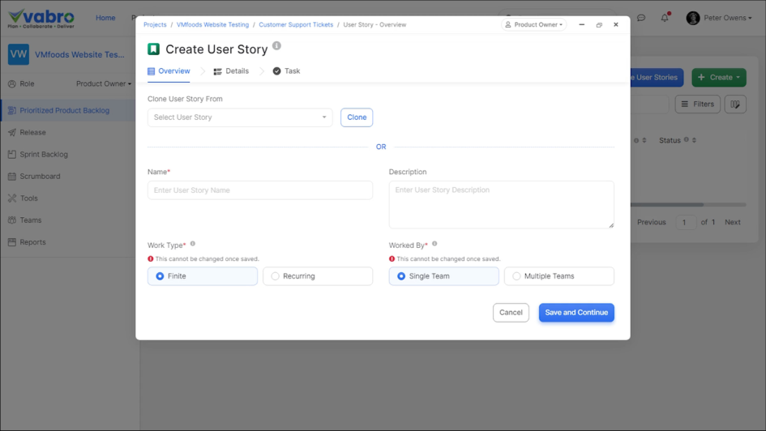

**Figura 13-3: Creación de una historia de usuario en la fase de planificación y estimación (fuente: Vabro)** 

©2025 SCRUMstudy™. _Una guía para el conocimiento de Scrum (Guía SBOK™)_ **317** 

13 – ESCALADO DE SCRUM PARA PROYECTOS GRANDES 

|**Proceso**|**Resumen del impacto en los grandes proyectos**|
|---|---|
|**9.1 Crear historias de** **usuario**|En un proyecto grande, los varios Product Owners y los múltiples equipos Scrum participan en la creación de historias de usuario. No todos los Product Owners y no todos miembros del equipo pueden participar en la creación de historias. Por lo tanto, la creación de historias de usuario se divide entre los múltiples Product Owners con base en el plan de colaboración de Product Owners; y entre los varios equipos se hace con base en la especialización del equipo y en el plan de colaboración de los equipos Scrum. De lo contrario, el proceso se hace igual que en un típico proyecto pequeño de Scrum. **Entrada adicional: Plan de colaboración de los Product Owners***(sección 13.2.2) **Entrada adicional: Plan de colaboración de los Scrum Masters y los Equipos** **Scrum***(sección 13.2.3) **Herramienta adicional:** **Identificación del ambiente***(sección 13.3.3) En un proyecto grande, es importante identificar el número y el tipo de ambientes necesarios para que los equipos trabajen eficazmente. **Herramienta opcional adicional: Herramienta de proyecto Scrum** **impulsada por IA**(consulte la sección 13.3.8)|
|**9.2 Estimar historias** **de usuario**|En un proyecto grande, no todos los equipos de Scrum y no todos los integrantes pueden participar en la estimación de cada historia de usuario. Por lo tanto, solo equipos e integrantes específicos participan en la estimación de algunas historias. La especialización del equipo y el plan de colaboración definen cuáles equipos y cuáles miembros estiman historias de usuario específicas. El Product Owner que trabajará con los respectivos equipos e integrantes dependerá de quién elaboró la historia de usuario y será quien mejor conteste las preguntas relacionadas a las historias que serán estimadas. Esto se base en el plan de colaboración de Product Owners. De lo contrario, el proceso se hace igual que en un típico proyecto pequeño de Scrum. **Entrada adicional: Plan de colaboración de los Product Owners***(sección 13.2.2) **Entrada adicional: Plan de colaboración de los Scrum Masters y los Equipos** **Scrum***(sección 13.2.3) **Herramienta opcional adicional: Herramienta de proyecto Scrum** **impulsada por IA**(consulte la sección 13.3.8)|

**318** ©2025 SCRUMstudy™. _Una guía para el conocimiento de Scrum (Guía SBOK™)_ 

13 – ESCALADO DE SCRUM PARA PROYECTOS GRANDES 

**13** 

|**9.3 Comprometer** **historias de usuario**|En cada sprint de un proyecto grande, a cada equipo se le pide que se comprometa a una subserie específica de historias de usuario y que elabore después los entregables respectivos. La decisión sobre qué equipos se comprometerán e implementarán las historias de usuario depende de las habilidades específicas de cada quipo y se basa en la especialización del mismo. De lo contrario, el compromiso de las historias de usuario se hace igual que en un típico proyecto pequeño de Scrum con base en las prioridades, estimaciones y velocidad específica del equipo. **Herramienta opcional adicional: Herramienta de proyecto Scrum** **impulsada por IA**(consulte la sección 13.3.8)|
|---|---|
|**9.4 Identificar tareas**|La identificación de tareas está a cargo del equipo a fin de que este pueda desglosar las historias de usuario a las que se ha comprometido. Cada Equipo Scrum identifica tareas tal como se hace en un típico proyecto pequeño de Scrum. Sin embargo, la identificación apropiada de las dependencias ayuda al Equipo Scrum a definir cuáles decisiones y actividades pudieran afectar a los otros equipos e influir en el orden relativo en el que un Equipo Scrum ejecuta sus respectivas tareas para crear los entregables del sprint. **Herramienta actualizada: Determinación de dependencias*** En los grandes proyectos, la identificación apropiada de las dependencias ayuda al Equipo Scrum a definir cuáles decisiones y actividades pudieran afectar a los otros equipos e influir en el orden relativo en el que un Equipo Scrum ejecuta sus respectivas tareas para crear los entregables del sprint. **Herramienta opcional adicional: Herramienta de proyecto Scrum** **impulsada por IA**(consulte la sección 13.3.8)|
|**9.5 Estimar tareas**|Si el equipo estima las tareas identificadas en el proceso anterior, la estimación se hace exactamente igual que en un típico proyecto pequeño de Scrum. **Herramienta opcional adicional: Herramienta de proyecto Scrum** **impulsada por IA**(consulte la sección 13.3.8)|
|**9.6 Actualizar el backlog** **del sprint**|Cada equipo actualiza su backlog del sprint específico según las historias de usuario a las que se comprometió a trabajar y sus respectivas tareas. Cada equipo actualiza el backlog del sprint tal cómo se hace en un típico proyecto pequeño de Scrum. **Entrada adicional: Ambiente y cronograma del ambiente**(sección 13.2.6) **Herramienta opcional adicional: Herramienta de proyecto Scrum** **impulsada por IA**(consulte la sección 13.3.8)|

**Tabla 13-2: El impacto de los grandes proyectos en los procesos fundamentales de Scrum: Fase de planificación y estimación** 

©2025 SCRUMstudy™. _Una guía para el conocimiento de Scrum (Guía SBOK™)_ **319** 

13 – ESCALADO DE SCRUM PARA PROYECTOS GRANDES 

#### **13.1.3 Implementación** 

En la fase de implementación de un proyecto grande, cada Equipo Scrum, con la ayuda del Scrum Master, elabora los entregables asociados a las historias de usuario a las que se comprometió. El equipo trabaja en el desarrollo de las tareas identificadas en la fase de planificación y estimación. 

A diferencia de un proyecto pequeño de Scrum, en los proyectos grandes es necesario tomar medidas adicionales a fin de garantizar una buena comunicación entre los varios equipos (tal como esté definido en el plan de comunicación) y que su trabajo esté sincronizado según lo plasmado en el plan de colaboración. 

Tal como se hace en los proyectos pequeños de Scrum, mientras el Equipo Scrum trabaja en la elaboración de los entregables del sprint, el Chief Product Owner y los Product Owners refinan el backlog priorizado del producto para mantenerlo al día con cualquier cambio en los requerimientos o prioridades. Esto garantiza que las historias de usuario a las que deben comprometerse los equipos según lo que indique el Product Owner estén listas para su estimación y compromiso. 

En un proyecto grande, los Product Owners dividen su trabajo con base en el plan de colaboración de los Product Owners. Su interacción con los equipos y los integrantes se basa en la especialización del Equipo Scrum y el plan de colaboración de los equipos Scrum. 

La figura 13-4 muestra la pantalla "Priorizar historias de usuario" en Vabro, lo que permite a los usuarios clasificar los elementos del trabajo pendiente por prioridad, DoR, estado y estimaciones de puntos de historia. 

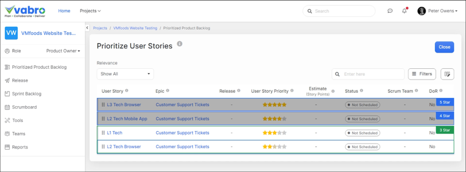

**Figura 13-4: Priorización de historias de usuario en la fase de implementación (fuente: Vabro)** 

**320** ©2025 SCRUMstudy™. _Una guía para el conocimiento de Scrum (Guía SBOK™)_ 

13 – ESCALADO DE SCRUM PARA PROYECTOS GRANDES 

**13** 

|**Proceso**|**Resumen del impacto en los grandes proyectos**|
|---|---|
|**10.1 Crear entregables**|Cada equipo elabora los entregables relacionadas a las historias de usuario a las que se comprometió a desarrollar. A diferencia de los proyectos pequeños de Scrum, en los proyectos grandes, el Equipo Scrum enfrenta limitaciones en su autonomía para organizar el trabajo. Estas limitaciones se deben a la necesidad de compartir recursos con otros equipos tales como se acordó en los recursos compartidos y en el ambiente y el cronograma de ambiente. Esto se debe al posible impacto de las decisiones que pudieran tomar otros equipos. Se requieren además actividades adicionales a fin de asegurar una buena comunicación y sincronización entre los equipos Scrum. **Entrada adicional: Plan de preparación para la liberación***(sección 13.2.7) **Herramienta adicional: Reuniones de Scrum de Scrums***(sección 13.3.5) Estas son reuniones breves con los representantes de varios equipos que se reúnen para compartir el estatus de sus respectivos equipos. **Herramienta adicional: Métodos de preparación para la liberación*** (sección 13.2.6) Los métodos de preparación para la liberación se utilizan para ejecutar las tareas identificadas en al plan de preparación para la liberación a fin de preparar los entregables que serán enviados o liberados.|
|**10.2 Realizar el Daily** **Standup**|Cada equipo lleva a cabo su Daily Standup tal como se hace en un típico proyecto de Scrum. Debido a que solamente un Scrum Master puede trabajar con múltiples equipos, resulta necesaria cierta coordinación a fin de evitar conflictos en el cronograma entre las distintos Daily Standups de los varios equipos. **Herramienta opcional adicional: Herramienta de proyecto Scrum** **impulsada por IA**(consulte la sección 13.3.8)|

©2025 SCRUMstudy™. _Una guía para el conocimiento de Scrum (Guía SBOK™)_ **321** 

13 – ESCALADO DE SCRUM PARA PROYECTOS GRANDES 

|**10.3 Refinar el backlog** **priorizado del** **producto**|En este proceso, las diferencias entre un típico proyecto pequeño de Scrum y proyecto grande son las mismas que en los procesos de_Desarrollar épicas_y _Crear el Backlog Priorizado del Producto_. Cualquier interacción del Product Owner con el cliente y otros interesados del producto la hace el Chief Product Owner y los múltiples Product Owners en vez de un solo Product Owner. El plan de interacción de Product Owners indica cómo se divide dicha interacción. El Chief Product Owner toma la decisión sobre la priorización final. Cualquier interacción o participación con el Scrum Master o con los miembros del Equipo Scrum se hace según lo que indique el plan de colaboración de los equipos Scrum. De lo contrario, la refinación del Backlog Priorizado del Producto se hace igual que en un típico proyecto de Scrum. **Entrada adicional: Plan de colaboración de los Product Owners**(sección 13.2.2) El plan de colaboración de Product Owners define cómo los Product Owners actualizan el backlog priorizado del producto. **Entrada adicional: Plan de colaboración de los Scrum Masters y los** **Equipos Scrum**(sección 13.2.3) **Entrada adicional: Especialización del equipo**(sección 13.2.5) **Herramienta opcional adicional: Herramienta de proyecto Scrum** **impulsada por IA**(consulte la sección 13.3.8) **Entrada adicional opcional: Sprint de preparación para la liberación** **actualizado**(sección 13.3.7) **Salida adicional: Plan de preparación para la liberación actualizado** Los cambios que se hacen al backlog priorizado del producto durante el proceso de refinación pueden afectar el plan de preparación para la liberación.|
|---|---|

**Tabla 13-3: El impacto de los grandes proyectos en los procesos fundamentales de Scrum: Fase de implementación** 

#### **13.1.4 Revisión y retrospectiva** 

En la fase de revisión y retrospectiva de un Proyecto grande, cada Equipo Scrum demuestra los entregables que elaboró en un sprint a su respectivo Product Owner para su aprobación y opinión. El equipo después se reúne para decidir de qué forma seguir mejorando su trabajo. Esto se hace de la misma forma que en un típico proyecto de Scrum. 

Además, los Product Owners se reúnen para decidir la forma de mejorar su trabajo. Como último paso de un sprint, el Chief Scrum Master y los Chief Product Owners se reúnen con los Scrum Masters, Product Owners y equipos seleccionados para compartir los resultados de sus respectivas reuniones de retrospectiva del sprint. 

**322** ©2025 SCRUMstudy™. _Una guía para el conocimiento de Scrum (Guía SBOK™)_ 

13 – ESCALADO DE SCRUM PARA PROYECTOS GRANDES 

**13** 

Debido a que un solo Scrum Master y un solo Product Owner pueden trabajar con múltiples equipos Scrum, se requiere de algún tipo de coordinación a fin de evitar conflictos de cronograma entre las reuniones de revisión del sprint y las de retrospectiva del sprint de los distintos equipos. 

|**Proceso**|**Resumen del impacto en los grandes proyectos**|
|---|---|
|**11.1 Demostrar y validar** **el sprint**|Cada Equipo Scrum lleva a cabo ese proceso en forma individual. En cada equipo, su respectivo Producto Owner aprueba las historias de usuario; sin embargo, debido a las interdependencias, esto puede ser algo complejo. En ocasiones el Chief Product Owner puede asistir las reuniones de revisión del sprint de algunos equipos con entregables interdependientes.|
||**Entrada adicional: Chief Product Owner***(sección 3.7.2.1)|

©2025 SCRUMstudy™. _Una guía para el conocimiento de Scrum (Guía SBOK™)_ **323** 

13 – ESCALADO DE SCRUM PARA PROYECTOS GRANDES 

|**11.2 Retrospectiva del** **sprint**|En los proyectos grandes, cada Equipo Scrum se reúne con su Scrum Master en su respectiva reunión de retrospectiva del sprint, la cual se lleva a cabo de la misma forma que en un típico proyecto pequeño de Scrum. Debido a que un solo Scrum Master y un solo Product Owner pueden trabajar con múltiples equipos Scrum, se requiere de algún tipo de coordinación a fin de evitar conflictos de cronograma entre las reuniones de retrospectiva del sprint de los distintos equipos. Asimismo, el Chief Product Owner y los Product Owners llevan a cabo una reunión de retrospectiva del sprint para dialogar sobre su colaboración y otros aspectos del sprint. Además, los Scrum Masters u otros representantes de cada Equipo Scrum llevan a cabo una reunión especial de Scrum de Scrums para compartir las mejores prácticas y demás resultados de las reuniones de retrospectiva del sprint de los distintos equipos (por ejemplo: problemas con la colaboración entre equipos). Debido a que en los grandes proyectos la colaboración entre múltiples equipos scrum y el equipo de Product Owners resulta en mejores prácticas y también en problemas, es común que el Chief Product Owner y los demás Product Owners participen en esta reunión. **Entrada adicional: Plan de colaboración de los Product Owners**(sección 13.2.2) En los grandes proyectos, refinar el backlog del producto puede resultar difícil. Si no se hace adecuadamente, puede causar problemas y pérdida de tiempo en los equipos. Por lo tanto, se recomienda que el refinamiento se discuta como parte de la retrospectiva haciendo especial énfasis en la forma en la que los múltiples Product Owners interactúan entre sí y con otros equipos para llevar a cabo adecuadamente el refinamiento. Además, es preferible agrupar las épicas y las historias de usuario con muchas dependencias. **Entrada adicional: Plan de colaboración de los Scrum Masters y los** **Equipos Scrum**(sección 13.2.3) En los grandes proyectos, refinar el backlog del producto puede resultar difícil. Si no se hace adecuadamente, puede causar problemas y pérdida de tiempo en los equipos. Por lo tanto, se recomienda que el refinamiento se discuta como parte de la retrospectiva haciendo especial énfasis en el trabajo entre los varios Scrum Masters y en cómo interactúan con los Product Owners en las actividades de refinamiento.|
|---|---|

**Tabla 13-4: El impacto de los grandes proyectos en los procesos fundamentales de Scrum: Fase de revisión y retrospectiva** 

**324** ©2025 SCRUMstudy™. _Una guía para el conocimiento de Scrum (Guía SBOK™)_ 

13 – ESCALADO DE SCRUM PARA PROYECTOS GRANDES 

**13** 

#### **13.1.5 Liberación** 

En la fase de liberación de un proyecto grande, los Product Owners de cada Equipo Scrum se coordinan con el Chief Product Owner para asegurar que los entregables de todos los equipos estén sincronizados, integrados y liberados según lo solicite el cliente u otros interesados del negocio. Asimismo, el plan de colaboración de los Product Owners y el de los Scrum Masters se refinan para asegurar una mejor coordinación entre todos los equipos en un proyecto grande. 

|**Proceso**|**Resumen del impacto en un proyecto grande**|
|---|---|
|**12.1 Enviar entregables**|En los grandes proyectos, todos los entregables aceptados de sprints previamente finalizados se entregan o se presentan a los interesados del negocio en la misma forma en la que se hace en un proyecto pequeño de Scrum. Sin embargo, dependiendo de las consideraciones del negocio, y debido a la complejidad de los grandes proyectos, tal vez resulte necesario tomar medidas adicionales para preparar la liberación. **Entrada adicional: Chief Product Owner**(sección 3.7.2.1) **Entrada adicional: Chief Scrum Master**(sección 3.7.2.2) **Entrada adicional: Plan de preparación para la liberación**(sección 13.2.7)|
|**13.2 Retrospectiva de la** **liberación**|**Entrada adicional: Chief Product Owner***(sección 3.7.2.1) **Entrada adicional: Chief Scrum Master***(sección 3.7.2.2) **Entrada adicional: Plan de colaboración de los Product Owners**(sección 13.2.2) En los grandes proyectos, refinar el backlog del producto puede resultar difícil. Si no se hace adecuadamente, puede causar problemas y pérdida de tiempo en los equipos. Por lo tanto, se recomienda que el refinamiento se discuta como parte de la retrospectiva haciendo especial énfasis en la forma en la que los múltiples Product Owners interactúan entre sí y con otros equipos para llevar a cabo adecuadamente el refinamiento. Además, es preferible agrupar las épicas y las historias de usuario con muchas dependencias. **Entrada adicional: Plan de colaboración de los Scrum Masters y los** **Equipos Scrum***(sección 13.2.3) En los grandes proyectos, refinar el backlog del producto puede resultar difícil. Si no se hace adecuadamente, puede causar problemas y pérdida de tiempo en los equipos. Por lo tanto, se recomienda contar con un plan de colaboración de los Scrum Masters y los Equipos Scrum que se refine constantemente a fin de asegurar una mejor colaboración entre todos los Scrum Masters y los equipos Scrum.|

**Tabla 13-5: Impacto de los grandes proyectos en los procesos fundamentales de Scrum: Fase de liberación** 

©2025 SCRUMstudy™. _Una guía para el conocimiento de Scrum (Guía SBOK™)_ **325** 

13 – ESCALADO DE SCRUM PARA PROYECTOS GRANDES 

### **13.2 Entradas y salidas adicionales para los grandes proyectos** 

#### **13.2.1 Organización de Scrum en los grandes proyectos** 

El desarrollo de la organización de Scrum en los grandes proyectos está a cargo del Chief Product Owner, el Chief Scrum Master, la alta gerencia, el Scrum Guidance Body y otros expertos relevantes. 

Las organizaciones que busquen implementar Scrum en grandes proyectos deben adoptar el marco de trabajo de Scrum. En los grandes proyectos, la organización debe contar con la capacidad para respaldar los esfuerzos mediante la asignación de los recursos necesarios. De no ser posible, deben hacerse planes para obtener más recursos tales como personal, herramientas y espacio laboral. Es de suma importancia que las organizaciones que buscan implementar Scrum se preparen para cambiar sus hábitos y su cultura laboral a fin de obtener los beneficios del uso de Scrum. 

En el entorno de un proyecto grande de Scrum con numerosos equipos que compiten por la asignación de recursos y priorización de tareas, es importante gestionar los recursos organizacionales en forma óptima a fin de alcanzar los objetivos generales del proyecto. La organización de un proyecto grande de Scrum debe incluir los componentes que se desarrollarán, así como las habilidades, los costos y demás recursos necesarios para desarrollarlos. Se debe incluir también la velocidad actual de los equipos (si se cuenta con esta información) o las velocidades estimadas a fin de ofrecer una estimación de alto nivel de la duración del proyecto, los requisitos de comunicación y otras interfaces que debe mantener el Equipo Scrum. 

#### **13.2.2 Plan de colaboración los Product Owners*** 

El Chief Product Owner trabaja con los principales Product Owners para crear el plan de colaboración de los Product Owners. Este plan debe definir la forma en la que los múltiples Product Owners colaboran con el Chief Product Owner. Debe de definir, como mínimo, la cantidad de equipos Scrum que puede manejar un Product Owner (con base en experiencia, tiempo, conocimiento del tema); cómo se dividirá el trabajo entre los Product Owners para obtener los requerimientos de los interesados del negocio; cómo se actualizará el backlog priorizado del producto con nuevos requerimientos o cambios en los mismos y cómo colaborarán los Product Owners con múltiples equipos Scrum. Es importante destacar que cada Equipo Scrum colabora solamente con un Product Owner; sin embargo, un Product Owner puede colaborar con más de un Equipo Scrum en caso de ser necesario. 

#### **13.2.3 Plan de colaboración de los Scrum Masters y los Equipos Scrum** 

El Chief Product Owner trabaja con los principales Scrum Masters y el Scrum Guidance Body, y en ocasiones con algunos miembros selectos de los equipos Scrum, a fin de crear el plan de colaboración de los Scrum Masters. Este plan define la forma en la que los varios equipos Scrum colaboran entre sí a fin de proveer el más alto valor en el menor tiempo posible. 

**326** ©2025 SCRUMstudy™. _Una guía para el conocimiento de Scrum (Guía SBOK™)_ 

13 – ESCALADO DE SCRUM PARA PROYECTOS GRANDES 

**13** 

Un proyecto grande generalmente cuenta con múltiples Scrum Masters. Cada uno facilita y asegura un ambiente laboral productivo en su respectivo Equipo Scrum. Un Scrum Master puede trabajar con más de un equipo. Los Scrum Masters colaboran con el Chief Scrum Master, el Chief Product Owner, otros Scrum Masters y Product Owners para desarrollar la lista de componentes y recursos necesarios en común para todos los equipos a lo largo del proyecto. También aportan información para la creación del plan de preparación para la liberación. El plan debe incluir información sobre las áreas de especialización asignadas a los equipos cualificados; la forma en la que los equipos ayudarán en el refinamiento y estimación del backlog priorizado del producto (ejemplo: decidir qué integrantes del equipo participarán en las sesiones de refinamiento y ejercicios de estimación de alto nivel), y sobre cómo los equipos organizarán las reuniones de Scrum de Scrums. También puede ser útil o incluso necesario utilizar una herramienta para un proyecto de Scrum para facilitar la implementación de Scrum en los grandes proyectos. El plan de colaboración de los Scrum Masters y los Equipos Scrum puede también incluir información sobre cómo entrenar al Equipo Scrum. Por ejemplo, puede incluir información sobre la participación de un coach por separado además del Scrum Master; sobre la participación de un Scrum Master en cada ubicación cuando se trate de equipos dispersos; sobre la forma de colaborar de los equipos Scrum con Scrum Masters coubicados y dispersos, etc. Aunque los equipos Scrum deben interactuar entre sí en los grandes proyectos, al crear el backlog priorizado del producto, los Product Owners pueden asegurar que las historias de usuario con muchas dependencias se agrupen a fin de que sean propiedad de un solo Product Owner, y así, uno o varios equipos Scrum desarrollen los entregables. Entre menor sea la dependencia en las tareas entre los distintos equipos, más eficiente será el trabajo para crear los entregables. 

#### **13.2.4 Recursos compartidos*** 

Los recursos compartidos pueden ser el personal, el ambiente y el equipamiento que necesitan todos o algunos equipos Scrum que trabajan en un proyecto. En un proyecto grande, los recursos compartidos pueden estar limitados; son recursos que necesitan al mismo tiempo todos o parte de los equipos Scrum. En este contexto, el Chief Product Owner, el Chief Scrum Master, así como otros Product Owners y Scrum Masters deben desarrollar un método para asignar estos recursos compartidos. Un ejemplo de un método para la asignación de recursos compartidos pudiera ser garantizar que los recursos se destinen primero a las características de valor más importantes o elevadas y a los equipos que trabajan en ellas. Cuando las solicitudes competentes tienen prioridades muy similares, el Chief Product Owner debe decidir sobre la asignación de recursos con base en los últimos requerimientos del negocio y otros criterios definidos. 

#### **13.2.5 Especialización del equipo** 

Existen tres consideraciones sobre la especialización del equipo que se deben tomar en cuenta al aplicar Scrum en los grandes proyectos. La primera dimensión es la necesidad de cumplir con una tarea específica. Por ejemplo, un equipo especializado pudiera ser un equipo de integración con conocimiento especializado sobre la integración continua. Dicho conocimiento puede ser de especial importancia si existe un sprint de preparación de liberación (en caso de que exista la necesidad de tareas específicas que deban llevarse a cabo antes de ua liberación). La segunda dimensión es la necesidad de que algunos integrantes específicos del equipo cuenten con habilidades especiales. En teoría, todos los equipos Scrum son generalistas y especialistas, ya que tienen conocimiento sobre varias áreas y son expertos por lo menos en una. Sin embargo, este no pudiera ser el caso en un proyecto grande. 

©2025 SCRUMstudy™. _Una guía para el conocimiento de Scrum (Guía SBOK™)_ **327** 

13 – ESCALADO DE SCRUM PARA PROYECTOS GRANDES 

Los miembros de equipos especializados deben tener habilidades específicas, tales como conocimiento de temas específicos como seguridad, lo cual no pudiera existir en todos los equipos en grandes proyectos donde es necesario. En tal caso, sería demasiado costoso capacitar a todos en todas las áreas de especialización requeridas. Se pueden asignar al proyecto expertos con habilidades especiales para que trabajen en los distintos equipos según sea necesario. Sin embargo, en ocasiones pudiera ser necesario contratar a expertos externos cuando resulte necesario, tomando en cuenta que agregar a nuevos integrantes al equipo afectará su velocidad. La tercera dimensión para la contratación de expertos es cualquier flexibilidad limitada en el equipo. Generalmente, en un proyecto de Scrum, cada equipo cuenta con experiencia considerable en una o más áreas; puede trabajar en algunas otras con información y capacitación, así como en otras áreas en las que no tenga experiencia o conocimiento. Durante la planificación del sprint, a cada equipo cada equipo se le asigna una subserie de historias de usuario asignadas lógicamente con base en su experiencia; algunas que puedan desarrollar y algunas en las que tal vez no puedan trabajar, ya que no cuentan con el conocimiento o las habilidades necesarias. En tal caso, tal vez sea necesario contratar a expertos cuando los integrantes del equipo no cuenten con las habilidades necesarias. El acceso limitado al personal con habilidades especializadas en un proyecto grande puede resultar en cierto nivel de riesgo en el proyecto. Algunas historias de usuario de mayor prioridad pudieran quedar inconclusas en un solo sprint. Los equipos tal vez deban trabajar en algunas historias de usuario de menor prioridad mientras esperan la incorporación de integrantes con habilidades especiales. 

#### **13.2.6 Ambiente y cronograma de ambiente*** 

Es posible que durante el desarrollo de un proyecto grande no se cuente con el ambiente deseado. Por ejemplo, la grúa para un proyecto de construcción pudiera estar disponible solo unos días del mes; o un ambiente de pruebas especializadas en un proyecto de informática pudiera estar disponible solo durante días específicos. Después de identificar todos los ambientes, se desarrolla un cronograma de ambiente para coordinar las actividades del sprint en el proceso de _Actualizar el backlog del sprint_ . El cronograma de ambiente es un calendario que detalla la forma en la que el Equipo Scrum tendrá acceso y compartirá cualquier ambiente específico. El cronograma asigna los días y los periodos en los que cada equipo hará uso de cada ambiente. 

#### **13.2.7 Plan de preparación para la liberación*** 

El Chief Product Owner trabaja con los Product Owners para crear el plan de preparación para la liberación. Este plan describe las medidas que se deben de tomar los Equipo Scrum relevantes y cualquier otra persona para confirmar que se han cumplido los requisitos mínimos para la liberación y que el producto o los incrementos del producto están listos para la liberación. El plan de preparación para la liberación también describe las decisiones de negocio con sus correspondientes justificaciones para llevar a cabo las tareas de preparación para la liberación. Debido a que en cada sprint se produce un producto potencialmente liberable u otros entregables, en un proyecto pequeño de Scrum, después de cualquier sprint se puede realizar una liberación si tiene sentido hacerlo desde el punto de vista del negocio. Sin embargo, en un proyecto grande pudiera haber ciertas actividades relacionadas a la preparación para la liberación que deban realizarse en algunos sprints en el proyecto. Por ejemplo, un equipo del proyecto pudiera optar por llevar a cabo una serie de pruebas de desempeño costosas y prolongadas justo antes de la liberación o bien, llevar a cabo una serie de pruebas de integración de fin a fin. Estas actividades se consideran ajenas a los criterios de terminado definidos en los sprints regulares; y en tales casos, será necesario llevar a cabo otro sprint de preparación de liberación (sección 13.3.7) para completar las tareas necesarias para preparar una liberación. 

**328** ©2025 SCRUMstudy™. _Una guía para el conocimiento de Scrum (Guía SBOK™)_ 

13 – ESCALADO DE SCRUM PARA PROYECTOS GRANDES 

**13** 

### **13.3 Herramientas adicionales para los grandes proyectos** 

#### **13.3.1 Plan de comunicación para grandes proyectos** 

El plan de comunicación para grandes proyectos lo elaboran el Chief Product Owner, el Chief Scrum Master y el Scrum Guidance Body con información de otros Product Owners, Scrum Master, el Equipo Scrum y otras personas relevantes. 

El plan de comunicación es fundamental en los grandes proyectos, ya que la mala comunicación o la falta de comunicación en el proyecto puede ser perjudicial en las actividades de colaboración y resultar en el fracaso del proyecto. Los planes de comunicación deben de incluir información sobre las formas de comunicación entre los equipos Scrum y los interesados del negocio, incluyendo los métodos de comunicación que se utilizarán, los canales o mecanismos para comunicar información importante, las responsabilidades de la comunicación, la clasificación y los medios para atender información confidencial, los tiempos para las actividades de comunicación, así como los procesos para evaluar la efectividad de la comunicación. Los planes de comunicación también deben de incluir el tiempo y la frecuencia de las reuniones de Scrum de Scrums (SoS) y la forma en la que dichas reuniones se llevarán a cabo. 

Cada Equipo Scrum puede contar con su propio plan de comunicación (véase la sección 12.1.3.4) que especifique los registros que deben ser creados y distribuidos, así como la forma de conservar estos registros a lo largo del proyecto. El plan debe también incluir los métodos para transmitir información importante del proyecto a los interesados del negocio y a la persona responsable de las distintas actividades de comunicación. 

Debido a que pudiera ser muy difícil que en un proyecto grande todos estén coubicados, el uso de una herramienta para un proyecto de Scrum pudiera ayudar a lograr una comunicación efectiva. 

#### **13.3.2 Planificación de recursos para grandes proyectos*** 

La planificación de recursos para grandes proyectos es fundamental debido a la complejidad de la asignación de varios tipos de recursos a los numerosos equipos Scrum que trabajan en paralelo. Habrá necesidades en conflicto por la escasez de recursos y el Chief Product Owner y otros Product Owners planificarán la entrega del mayor valor en el menor tiempo posible. En la planificación de recursos en un proyecto grande, se deben de tomar en cuenta los varios costos relacionados a recursos, tales como personal, capacitación, hardware y software, servicios externos y espacio físico. 

El Chief Product Owner y otros Product Owners tal vez tengan que coordinarse con recursos externos para adquirir recursos y aumentar el personal (ejemplo: tal vez sea necesario contratar recursos externos para que trabajen con el equipo existente de tiempo completo y tal vez tengan que interactuar con el equipo de gestión del proveedor existente dentro de la compañía). Cuando se contratan recursos externos, el Chief Product Owner y el equipo deben de apegarse a las políticas de la compañía respecto a los recursos externos y los proveedores. 

En los grandes proyectos, el Chief Product Owner tal vez tenga que tomar en cuenta la planificación de recursos externos a fin de atender las necesidades de los equipos especializados y la necesidad de fijar el ambiente de los varios equipos Scrum que trabajan en forma paralela. 

©2025 SCRUMstudy™. _Una guía para el conocimiento de Scrum (Guía SBOK™)_ **329** 

13 – ESCALADO DE SCRUM PARA PROYECTOS GRANDES 

El Chief Product Owner y los Product Owners pueden colaborar con los Scrum Masters y los equipos Scrum para definir las habilidades especiales que se requieren en los grandes proyectos, así como el número de recursos requeridos, los equipos Scrum que necesiten habilidades especiales y la estimación de las asignaciones. 

#### **13.3.3 Identificación del ambiente*** 

El Chief Scrum Master trabaja con los Scrum Masters, los Product Owners relevantes, los integrantes del Equipo Scrum, los servicios de apoyo, el Scrum Guidance Body y con otros expertos a fin de identificar el ambiente para un proyecto grande. De preferencia esto se hace después de la fase de inicio o cuando así lo requieran los equipos o el Scrum Guidance Body. 

En un proyecto grande, es importante identificar el número y el tipo de ambientes necesarios, ya que habrá muchos equipos que trabajen simultáneamente en sus respectivos sprints y las necesidades del ambiente pudieran ser complicadas o pudieran estar en conflicto. Algunos ejemplos de ambientes son: áreas de pruebas y desarrollo de software, recursos o áreas de trabajo físico o bien, ambientes con equipos especializado. Los ambientes también pueden verse afectados por los límites de proceso de cada Equipo Scrum. Además, con los equipos dispersos que trabajan en distintas zonas horarias, puede ser posible llevar a cabo pruebas las 24 horas del día a fin de maximizar el uso de los ambientes. Por lo tanto, es de suma importancia crear un cronograma para establecer los horarios de pruebas de cada equipo. Para los proyectos de software, el plan de ambiente puede también incluir información sobre cómo y quién llevará el código a cada ambiente. 

#### **13.3.4 Asignación del backlog priorizado del producto*** 

En un proyecto grande, el Chief Product Owner y los Product Owners elaboran el backlog priorizado del producto con sus correspondientes épicas e historias de usuario de la misma forma en la que se haría en un típico proyecto pequeño de Scrum. 

La creación de épicas e historias de usuario a cargo del Product Owner puede depender de múltiples factores tales como: 

- La forma de recopilar los requerimientos de los interesados del negocio 

- El conocimiento y la experiencia de los Product Owners 

El Chief Product Owner y los otros Product Owners trabajan juntos para revisar el backlog priorizado del producto y decidir cuáles épicas e historias de usuario estarán a cargo de cada Product Owner. Aunque algunas épicas e historias de usuario pueden ser creadas por un Product Owner específico, pueden ser asignadas a otro Product Owner para ser gestionadas e implementadas como parte de un proyecto grande de Scrum. Las épicas y las historias de usuario deben estar priorizadas y se pueden utilizar estimaciones preexistentes para facilitar su asignación a distintos Product Owners. 

Los siguientes factores influyen en la asignación de épicas o historias de usuario a los Product Owners: 

- El Product Owner que creó las épicas o historias de usuario (ya que generalmente estará ca cargo de su implementación) 

**330** ©2025 SCRUMstudy™. _Una guía para el conocimiento de Scrum (Guía SBOK™)_ 

13 – ESCALADO DE SCRUM PARA PROYECTOS GRANDES 

**13** 

- El Product Owner que tiene un equipo con las habilidades adecuadas para desarrollar la épica o la historia de usuario 

- El cliente específico, patrocinador u organización vinculados a la épica o a las historias de usuario (ya que pudiera haber antecedentes de una relación con un Product Owner específico) 

- El número de dependencias pertenecientes a cada épica o historia de usuario (ya que agrupar las historias de usuario con mucha dependencia a cargo de un Product Owner pudiera permitir que los equipos trabajen en forma relativamente independiente unos de otros, sin la necesidad de dedicar mucho tiempo a la coordinación con otros equipos) 

La asignación y priorización de épicas o historias de usuario a los Product Owners puede hacerse durante cierto periodo por medio de reuniones y, de ser posible, por medio de una herramienta para proyectos de Scrum. 

#### **13.3.5 Reunión de Scrum de Scrums (SoS)*** 

Una reunión de Scrum de Scrums es un elemento importante en el escalamiento de Scrum en grandes proyectos. El objetivo de esta reunión puede ser la sincronización de los equipos durante la creación de entregables, pero también se puede utilizar para intercambiar las mejores prácticas después de las reuniones de retrospectiva del sprint y en la planeación de futuros sprints. La frecuencia de la reunión depende de cada proyecto y de su tamaño y complejidad, así como de las dependencias entre los distintos equipos, etc. Si las épicas o las historias de usuario en los sprints se pueden terminar sin mucha interacción de otras épicas o historias de usuario, no será necesario llevar a cabo estas reuniones con tanta frecuencia; si, por el contrario, hay muchas dependencias, tal vez resulte necesario hacer estas reuniones con mayor frecuencia. 

En la reunión típicamente hay un representante de cada Equipo Scrum, por lo general el Scrum Master, aunque también es común que cualquiera en el Equipo Scrum asista a la reunión en caso de ser necesario. Esta reunión generalmente la organiza el Chief Scrum Master y el objetivo es enfocarse en áreas de coordinación e integración entre los distintos equipos Scrum. 

De preferencia son reuniones breves donde se reúne un representante de cada Equipo Scrum (por ejemplo, el Scrum Master y otros) para compartir el estatus del trabajo en sus respectivos equipos, algo similar al Daily Standup. Generalmente no hay un límite de tiempo, lo cual permite que todos los representantes intercambien su información, incluso en proyectos muy grandes. La reunión de Scrum de Scrums se lleva a cabo en intervalos predeterminados o cuando lo requieran los equipos Scrum para facilitar el intercambio de información entre los distintos equipos. Se pueden monitorear de cerca los problemas, las dependencias y los riesgos que afectan a los múltiples equipos Scrum, lo cual ayuda a integrar y coordinar mejor el trabajo de los varios equipos que trabajan en un proyecto grande. Es responsabilidad del Chief Scrum Master (u otro Scrum Master que facilite las reuniones de Scrum de Scrums) asegurarse de que todos los representantes cuenten con un ambiente adecuado para el intercambio abierto y honesto de información, que incluya la retroalimentación de los representantes de otros equipos. Para los grandes proyectos que involucran a una cantidad considerable de equipos, se pueden convocar a múltiples niveles de dichas reuniones para compartir el estatus de cada equipo. 

Cada representante comunica las actualizaciones sobre su equipo. Dichas actualizaciones generalmente se presentan en forma de respuesta a cuatro preguntas específicas: 

- 1) ¿En qué ha estado trabajando mi equipo desde la última reunión? 

- 2) ¿Qué hará mi equipo hasta la próxima reunión? 

©2025 SCRUMstudy™. _Una guía para el conocimiento de Scrum (Guía SBOK™)_ **331** 

13 – ESCALADO DE SCRUM PARA PROYECTOS GRANDES 

- 3) ¿Qué esperaban otros equipos que mi equipo hiciera y que aún no se ha hecho? 

- 4) ¿Qué planea hacer nuestro equipo que pudiera afectar a otros equipos? 

Las respuestas a estas cuatro preguntas proporcionan información que permite a cada equipo entender claramente la situación de trabajo de todos los demás equipos y si hay o pudiera haber algún problema con las entregas próximas. 

#### **13.3.6 Métodos de preparación para la liberación*** 

Los métodos de preparación para la liberación se utilizan para ejecutar las tareas identificadas en el plan de preparación para la liberación a fin de preparar los entregables para su entrega o liberación. Cada proyecto puede tener sus proprios métodos específicos, aunque probablemente sean también válidos en un portafolio o al menos al nivel del programa. Se pueden definir en el Scrum Guidance Body. 

#### **13.3.7 Sprint de preparación para la liberación** 

Si existe la necesidad de llevar a cabo tareas específicas para preparar una liberación y confirmar que se hayan cumplido los requerimientos mínimos para ella, dichas tareas se llevan a cabo en un sprint de preparación para la liberación. En un sprint de preparación de liberación no se desarrollan historias de usuario del backlog priorizado del producto. En cambio, se llevan a cabo las tareas identificadas en el plan de preparación de liberación (véase la sección 13.2.7). El sprint de preparación para la liberación solo se hace una sola vez por liberación como el primer paso en el proceso de _Enviar entregables_ . La duración de este sprint puede ser distinta a la duración de otros sprints. 

Si se lleva a cabo un sprint de preparación para la liberación, sus criterios de terminado generalmente son únicos y distintos a los criterios de terminado de las historias de usuario de otros sprints (que también deben cumplirse). Los criterios de terminado se definen con la finalidad de asegurar que los entregables del sprint sean “potencialmente enviables”. El sprint de preparación para la liberación atiende todos los problemas que no se vieron en los sprints regulares con base en decisiones de negocio deliberadas y se anotan en el plan de preparación para la liberación. 

El sprint de preparación para la liberación no es obligatorio a menos que exista una justificación de negocio para incorporarlo al proyecto. Además, normalmente solo los miembros relevantes del equipo participan en este sprint. Los demás miembros del Equipo Scrum no participan en el sprint de preparación para la liberación y pueden empezar a trabajar en otros sprints regulares. 

#### **13.3.8 Herramienta de proyecto Scrum impulsada por IA** 

Dado que los proyectos grandes involucran a muchos equipos Scrum con varios cientos o más de personas trabajando en el proyecto, y dado que los equipos también pueden estar distribuidos, puede haber una complejidad e interacciones significativas entre los equipos. 

**332** ©2025 SCRUMstudy™. _Una guía para el conocimiento de Scrum (Guía SBOK™)_ 

13 – ESCALADO DE SCRUM PARA PROYECTOS GRANDES 

**13** 

Por lo tanto, sería beneficioso para los equipos tener acceso a una herramienta de proyecto Scrum estructurada impulsada por IA, o un conjunto de herramientas que se puedan utilizar para automatizar procesos, gestionar la complejidad, compartir información (entre equipos y con las partes interesadas del negocio), generar informes, etc. 

Algunas tareas específicas que podrían ser administradas por la herramienta de proyecto Scrum impulsada por IA en un proyecto grande incluyen: 

- Capacidad para formar equipos con roles apropiados y la capacidad de escalar roles a proyectos grandes 

- Capacidad para crear y mantener un backlog de productos priorizados para cada equipo, incluida la creación, estimación y gestión de epopeyas, historias de usuario y tareas 

- Capacidad para admitir otros artefactos importantes del proyecto Scrum , como Scrumboards, Sprint Backlogs, horarios/actas de reuniones, etc 

- Capacidad para permitir una comunicación fluida y efectiva entre todos los miembros del equipo del proyecto 

- Capacidad para apoyar equipos distribuidos (ver sección 2.5.3) 

- Capacidad para respaldar la creación de informes y métricas según lo requieran los diferentes roles de Scrum 

- Capacidad para capturar y compartir recomendaciones o experiencia del Cuerpo de Orientación de Scrum (por ejemplo, lecciones aprendidas de Sprints Retrospectivos, mejores prácticas, políticas organizacionales relacionadas con Scrum, etc.). 

©2025 SCRUMstudy™. _Una guía para el conocimiento de Scrum (Guía SBOK™)_ **333** 

**Esta página ha sido dejada en blanco intencionalmente.** 

**334** ©2025 SCRUMstudy™. _Una guía para el conocimiento de Scrum (Guía SBOK™)_ 

14. ESCALAMIENTO DE SCRUM PARA LA EMPRESA 

**14** 

## **14. ESCALAMIENTO DE SCRUM PARA LA EMPRESA** 

Este capítulo se enfoca en los aspectos adicionales de Scrum que se aplican a programas y portafolios. El escalamiento de Scrum para la empresa, tal como se define en la _Guía de los fundamentos de Scrum (Guía del SBOK__®_ _)_ aplica a: 

- Portafolios, programas o proyectos en cualquier industria; 

- <mark>Productos, servicios o cualquier otro resultado que se entregará a los</mark> interesados del negocio; 

<mark>El término “programa” en la</mark> _<mark>Guía del SBOK</mark>__®_ <mark>se refiere a un conjunto de proyectos o subprogramas relacionados que deben gestionarse en forma coordinada para producir o entregar los componentes del programa. La palabra “portafolio” se refiere a un conjunto de programas o proyectos distintos dentro de la misma organización que pudieran estar o no relacionados entre sí y pudieran o no ser gestionados en forma coordinada para cumplir con los objetivos del portafolio. Desde la perspectiva del marco de trabajo de Scrum, los programas o portafolios pueden abordarse de la misma forma, aunque en niveles diferentes de la empresa y posiblemente con una cantidad distinta de coordinación para los programas o proyectos subyacentes.</mark> 

<mark>Este capítulo describe el impacto (en las entras, herramientas y salidas) que tiene un programa o portafolio en los procesos fundamentales de Scrum en los capítulos del 8 al 12. Este capítulo también introduce procesos adicionales que se aplican únicamente a los programas y portafolios y que no son relevantes al nivel de proyecto.</mark> 

Para facilitar la mejor aplicación del marco de trabajo de Scrum, en este capítulo se identifican las entradas, herramientas y salidas de cada proceso, ya sea como “obligatorias” u “opcionales”. Las entradas, herramientas y salidas indicadas con asteriscos (*) son obligatorias o se consideran importantes para el éxito, mientras que las que no tienen asteriscos son opcionales. 

Se recomienda que aquellas personas que empiezan a aprender sobre el marco de trabajo y los procesos de Scrum se enfoquen principalmente en las entradas, herramientas y salidas obligatorias; mientras que los Chief Product Owners, Product Owners, Chief Scrum Masters, Scrum Masters y otros practicantes con mayor experiencia en Scrum busquen conocer más sobre la información en todo este capítulo. También es importante destacar que, aunque todos los procesos de definen exclusivamente en la _<mark>Guía del SBOK</mark>__®_ <mark>, no necesariamente se llevan a cabo en forma separada o secuencia. En ocasiones puede ser más apropiado hacer algunos procesos en paralelo o en forma iterativa, dependiendo de los requisitos específicos de cada programa o portafolio.</mark> 

<mark>Este capítulo está escrito desde la perspectiva de un solo equipo de programa o portafolio que coordina y prioriza las actividades de múltiples proyectos o programas subyacentes de Scrum. La información adicional sobre el uso de Scrum para cualquier proyecto, no solo en los granes, está disponible en los capítulos del 2 al 7, mismos que cubren los principios y aspectos de Scrum.</mark> 

©2025 SCRUMstudy™. _Una guía para el conocimiento de Scrum (Guía SBOK™)_ **335** 

14. ESCALAMIENTO DE SCRUM PARA LA EMPRESA 

###### **Scrum para la empresa vs. Scrum para un solo proyecto** 

Al implementar Scrum a nivel de la empresa, es posible que participen cientos de equipos Scrum con miles de personas que trabajen en múltiples proyectos dentro de los programas o portafolios de la compañía. Utilizar Scrum al nivel de un programa o portafolio tiene cierto impacto en los proyectos subyacentes. En general, los proyectos de Scrum se seguirán ejecutando con los procesos fundamentales descritos en los capítulos de 8 al 12 que se usan en típicos proyectos pequeños, aunque con las entradas herramientas y salidas adicionales descritas en el capítulo 13 (para grandes proyectos con múltiples Product Owners o Scrum Masters). 

El impacto de programas y portafolios en los procesos de Scrum a nivel del proyecto (descritos en los capítulos del 8 al 13) se describen en la sección 14.1 de este capítulo como entradas, herramientas y salidas. Las consideraciones adicionales o preguntas relevantes solo para el nivel de programa o portafolio se describen en las secciones 14.2 a la 14.8. 

Algunas preguntas que surgen al nivel de programa o portafolio son similares a las de un proyecto grande de Scrum. La sincronización entre equipos y la colaboración general son los más grandes retos en un proyecto grande y existen también a nivel de un programa o un portafolio. Los más grandes retos para un programa o portafolio pueden presentarse en el aspecto empresarial, ya que las prioridades del negocio de los distintos proyectos pudieran estar en conflicto y en ocasiones pudieran también contraponerse a metas generales del programa o portafolios que deben estar en armonía. 

Al igual que en los grandes proyectos de Scrum, es necesario incluir entradas, herramientas y salidas adicionales para atender la priorización adicional, la armonización y las actividades de coordinación. Algunos motivos para incluir entradas, herramientas y salidas adicionales en los programas y portafolios son los siguientes: 

###### **Product Owners** 

- Programa y portafolio: La necesidad de armonizar las metas del negocio que están en conflicto 

- Programa: La necesidad de colaboración entre el Program Product Owner y los Product Owners de los proyectos en el programa: 

   - Refinación del backlog priorizado del producto 

   - Interacción con interesados del negocio para sincronizar los mensajes 

   - Evitar duplicidad de trabajo dentro del programa (sinergia) 

- Portafolio: La necesidad de colaboración entre el Portfolio Product Owner y los Program Product Owners y Product Owners de los programas y proyectos en el portafolio: 

   - Refinación del backlog priorizado del producto 

   - Interacción con interesados del negocio para sincronizar los mensajes 

   - Evitar duplicidad de trabajo dentro del programa (sinergia) 

###### **Scrum Masters** 

- Programa y portafolio: La necesidad de colaboración entre Scrum Masters al atender impedimentos 

- Programa: Sincronizar el trabajo de los equipos Scrum de múltiples proyectos (si fuera necesario) 

- • Portafolio: Sincronizar el trabajo de los equipos Scrum de múltiples programas y proyectos (si fuera necesario) 

**336** ©2025 SCRUMstudy™. _Una guía para el conocimiento de Scrum (Guía SBOK™)_ 

14. ESCALAMIENTO DE SCRUM PARA LA EMPRESA 

**14** 

###### **Equipos Scrum** 

- Programa y portafolio: La necesidad de gestionar dependencias entre equipos Scrum 

- Programa y portafolio: La necesidad de gestionar los conflictos en los recursos compartidos entre equipos Scrum 

- Programa y portafolio: La necesidad de definir ciertos lineamientos y estándares que deben cumplir los equipos Scrum en todos los proyectos del programa o portafolio (por ejemplo: estándares de seguridad dentro de una compañía o lineamientos jurídicos o gubernamentales en industrias específicas). Esto tal vez lo deba definir el Scrum Guidance Body 

- Programa y portafolio: La necesidad de configurar y mantener el ambiente que será utilizado por los múltiples equipos Scrum 

©2025 SCRUMstudy™. _Una guía para el conocimiento de Scrum (Guía SBOK™)_ **337** 

14. ESCALAMIENTO DE SCRUM PARA LA EMPRESA 

### **14.1 El impacto de programas o portafolios en los procesos fundamentales a nivel del proyecto** 

Las tablas 14-1 a la 14-4 presentan un resumen del impacto de los programas y portafolios en los procesos fundamentales de Scrum en cada una de las fases del proyecto. 

#### **14.1.1 Inicio** 

Las entradas adicionales a nivel del programa o portafolio que se deben tomar en cuenta en los proyectos subyacentes se describen a continuación: 

|**Proceso**|**Descripción del impacto del proceso en un programa o portafolio**|
|---|---|
|**8.1 Crear la visión del** **proyecto**|La visión del proyecto se elabora con entradas adicionales del programa o portafolio al que pertenece el proyecto. Fuera de eso, no hay cambios en este proceso. **Entrada adicional: Program o Portfolio Product Owner** Los roles de un Program o Portfolio Product Owner se describen en las secciones 3.7.4.1 y 3.7.4.2.|
||**Entrada adicional: Program o Portfolio Scrum Master** Los roles de un Program o Portfolio Scrum Master se describen en las secciones 3.7.4.3 y 3.7.4.4. **Entrada adicional: Interesados del negocio del programa o portafolio** Los interesados del negocio del programa o portafolio se describen en la sección 14.3.3.5. Estos influyen en todos los proyectos en el programa o portafolio. **Entrada adicional: Backlog priorizado del programa o portafolio** El backlog priorizado del programa o portafolio se describe en la sección 14.6.1.2. El backlog priorizado del programa o portafolio contiene los requerimientos del programa o portafolio que pudieran afectar la visión del proyecto.|

**338** ©2025 SCRUMstudy™. _Una guía para el conocimiento de Scrum (Guía SBOK™)_ 

14. ESCALAMIENTO DE SCRUM PARA LA EMPRESA 

**14** 

|**Proceso**|**Descripción del impacto del proceso en un programa o portafolio**|
|---|---|
|**8.2 Identificar al Scrum** **Master y a los** **interesados del negocio**|El Scrum Master y los interesados del negocio del proyecto se identifican con entradas adicionales del programa o portafolio al que pertenece el proyecto. Fuera de eso, no hay cambios en este proceso. **Entrada adicional: Program o Portfolio Product Owner** Los roles de un Program o Portfolio Product Owner se describen en las secciones 3.7.4.1 y 3.7.4.2. **Entrada adicional: Program o Portfolio Scrum Master** Los roles de un Program o Portfolio Scrum Master se describen en las secciones 3.7.4.3 y 3.7.4.4. **Entrada adicional: Interesados del negocio del programa o portafolio** Los interesados del negocio del programa o portafolio se describen en la sección 14.3.3.5. Estos influyen en todos los proyectos en el programa o portafolio.|
|**8.3 Formar el Equipo Scrum**|No hay un efecto adicional a este proceso en un programa o portafolio.|
|**8.4 Desarrollar épicas**|Las épicas se desarrollan con entradas adicionales del programa o portafolio al que pertenece el proyecto. Fuera de eso, no hay cambios en este proceso. **Entrada adicional: Backlog priorizado del programa o portafolio** El backlog priorizado del programa o portafolio se describe en la sección 14.6.1.2. El backlog priorizado del programa o portafolio contiene los requerimientos del programa o portafolio que pudieran afectar la creación de épicas. **Entrada adicional: Riesgos del programa o portafolio** Los riesgos del programa o del portafolio se describen en las secciones 7.6.1 y 7.6.2. Los riesgos relacionados a un portafolio o un programa también afectarán a los proyectos que forman parte del respectivo portafolio o programa. Durante la evaluación de riesgos en portafolios y programas, si se establece que un riesgo pudiera afectar a un proyecto individual, se debe de comunicar la información relevante sobre el riesgo al Product Owner y al Equipo Scrum. Los riesgos del programa y portafolio pudieran ser entradas en el proceso de_Desarrollar épicas_ y pueden tener un impacto general en la forma de llevar a cabo este proceso.|

©2025 SCRUMstudy™. _Una guía para el conocimiento de Scrum (Guía SBOK™)_ **339** 

14. ESCALAMIENTO DE SCRUM PARA LA EMPRESA 

|**Proceso**|**Descripción del impacto del proceso en un programa o portafolio**|
|---|---|
|**8.5 Crear el backlog** **priorizado del producto**|El backlog priorizado del producto se elabora con entradas adicionales del programa o portafolio al que pertenece el proyecto. Fuera de eso, no hay cambios en este proceso. **Entrada adicional: Backlog priorizado del programa o portafolio** El backlog priorizado del programa o portafolio se describe en la sección 14.6.1.2. El backlog priorizado del programa o portafolio contiene los requerimientos del programa o portafolio que pudieran afectar la creación del backlog priorizado del producto.|
|**8.6 Realizar la planificación** **de la liberación**|La planificación de la liberación se lleva a cabo con entradas adicionales del programa o portafolio al que pertenece el proyecto. Fuera de eso, no hay cambios en este proceso. **Entrada adicional: Program o Portfolio Product Owner** Los roles de un Program o Portfolio Product Owner se describen en las secciones 3.7.4.1 y 3.7.4.2. **Entrada adicional: Program o Portfolio Scrum Master** Los roles de un Program o Portfolio Scrum Master se describen en las secciones 3.7.4.3 y 3.7.4.4. **Entrada adicional: Backlog priorizado del programa o portafolio** El backlog priorizado del programa o portafolio se describe en la sección 14.6.1.2. El backlog priorizado del programa o portafolio puede incluir fechas específicas de coordinación importantes o fechas límite para los mismos requerimientos que se deben cumplir en un proyecto.|

**Tabla 14-1: Impacto de un programa o portafolio en los procesos fundamentales de Scrum: Fase de inicio** 

**340** ©2025 SCRUMstudy™. _Una guía para el conocimiento de Scrum (Guía SBOK™)_ 

14. ESCALAMIENTO DE SCRUM PARA LA EMPRESA 

**14** 

<mark>La Figura 14-1 muestra la pantalla "Crear versión" en Vabro, donde los usuarios definen un nombre de versión, una descripción y una fecha de lanzamiento objetivo antes de guardar y continuar.</mark> 

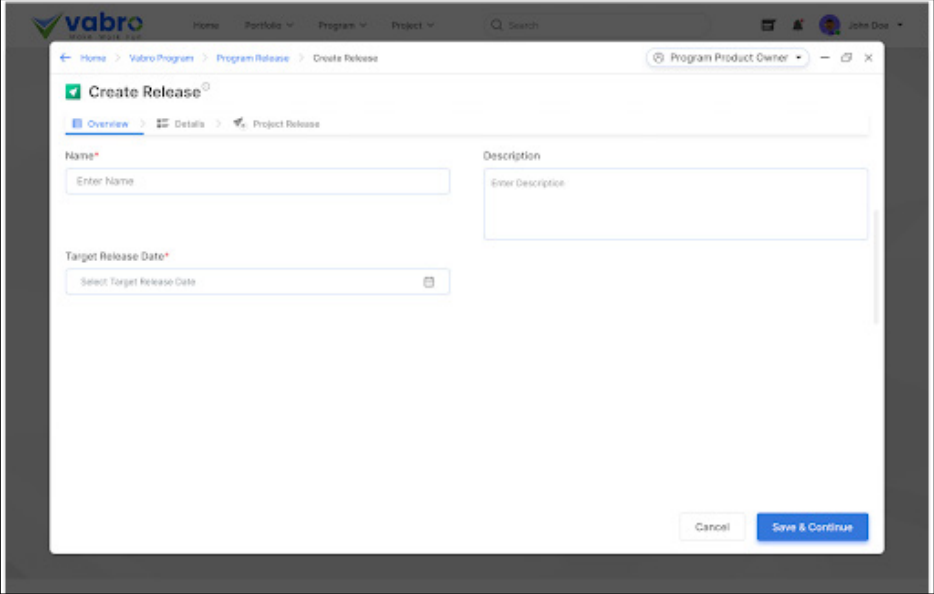

**Figura 14-1: Creación de una versión durante la iniciación (Fuente: Vabro)** 

#### **14.1.2 Planificación y estimación** 

El uso de Scrum a nivel de un programa o portafolio no tiene impacto en la fase de planificación y estimación de los proyectos respectivos en el programa o portafolio. 

#### **14.1.3 Implementación** 

Las entradas adicionales a nivel del programa o portafolio que se deben tomar en cuenta en la fase de implementación se describen a continuación: 

|**Proceso**|**Descripción del impacto del proceso en un programa o portafolio**|
|---|---|
|**10.1 Crear entregables**|El uso de Scrum en un programa o portafolio no afecta el proceso de_Crear_ _entregables_.|
|**10.2 Realizar el Daily** **Standup**|El uso de Scrum en un programa o portafolio no afecta el proceso de _Realizar el Daily Stanup._|

©2025 SCRUMstudy™. _Una guía para el conocimiento de Scrum (Guía SBOK™)_ **341** 

14. ESCALAMIENTO DE SCRUM PARA LA EMPRESA 

||Al refinar el backlog priorizado del producto, los cambios nuevos o actualizados del nivel del programa o portafolio deben ser priorizados e incorporados a este backlog según sea necesario.|
|---|---|
|**10.3 Refinar el backlog** **priorizado del producto**|**Entrada adicional: Program o Portfolio Product Owner** Los roles de un Program o Portfolio Product Owner se describen en las secciones 3.7.4.1 y 3.7.4.2. En este proceso, el Program o Portfolio Product Owner comunica al proyecto los requerimientos actualizados del nivel del programa o portafolio.|
||**Entrada adicional: Backlog priorizado del programa o portafolio** El backlog priorizado del programa o portafolio se describe en la sección 14.6.1.2. Cualquier cambio en el backlog priorizado del programa o portafolio debe ser incorporado al backlog priorizado del producto del proyecto.|

**Tabla 14-2: Impacto de un programa o portafolio en los procesos fundamentales de Scrum: Fase de implementación** 

#### **14.1.4 Revisión y retrospectiva** 

Los representantes del programa o del portafolio pueden compartir su opinión durante la revisión o retrospectiva del sprint. Fuera de eso, no hay cambio en la fase de revisión y retrospectiva de un proyecto. 

|**Proceso**|**Resumen del impacto en un programa o portafolio**|
|---|---|
|**11.1 Demonstrar y validar el** **sprint**|Los representantes del programa o portafolio pueden compartir su opinión. Fuera de eso, no hay cambios en este proceso.|
||**Entrada adicional: Program o Portfolio Product Owner**|
||Los roles de un Program o Portfolio Product Owner se describen en las secciones 3.7.4.1 y 3.7.4.2. **Entrada adicional: Interesados del negocio del programa o portafolio**|
||Los interesados del negocio del programa o portafolio se describen en la sección 14.3.3.5.|
|**11.2 Retrospectiva del sprint**|El uso de Scrum en un programa o portafolio no afecta el proceso de _Retrospectiva del sprint_.|

**Tabla 14-3: Impacto de un programa o portafolio en los procesos fundamentales de Scrum: Fase de revisión y retrospectiva** 

**342** ©2025 SCRUMstudy™. _Una guía para el conocimiento de Scrum (Guía SBOK™)_ 

14. ESCALAMIENTO DE SCRUM PARA LA EMPRESA 

**14** 

#### **14.1.5 Liberación** 

El uso de Scrum a nivel de un programa o portafolio puede afectar la liberación de proyectos individuales, ya que pudiera haber dependencias entre la liberación de distintos proyectos. Por ejemplo, si los entregables de dos proyectos (A y B) deben liberarse al mismo tiempo, pero los entregables del proyecto A se retrasan, esto puede afectar la liberación de los entregables del proyecto B, incluso si esos se terminaron a tiempo. 

La Figura 14-2 muestra un "Panel de control de versiones de programas" de la plataforma Vabro, que realiza un seguimiento de varias versiones de software, su progreso, historias de usuario y estado actual. 

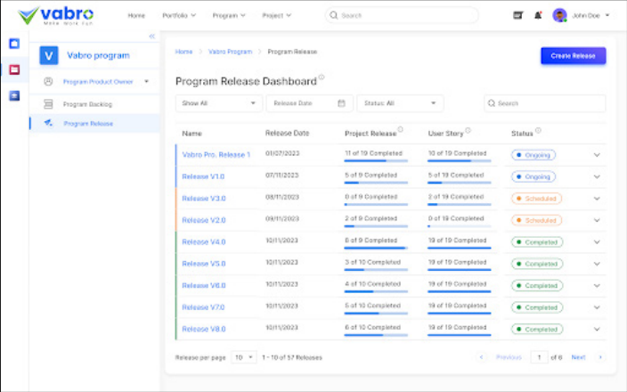

**Figura 14-2: Program Release Dashboard (Source: Vabro)** 

|**Proceso**|**Descripción del impacto del proceso en un programa o portafolio**|
|---|---|
||Los entregables en los proyectos grandes se desarrollan igual que en proyectos individuales. Sin embargo, pudiera haber cierta dependencia en los entregables de otros proyectos que deben coordinar el Program o Portfolio Product Owner o el Program o Portfolio Scrum Master.|
|**12.1 Enviar entregables**|**Entrada adicional: Program o Portfolio Product Owner** Descrito en las secciones 3.7.4.1 y 3.7.4.2. **Entrada adicional: Program o Portfolio Scrum Master** Descrito en las secciones 3.7.4.3 y 3.7.4.4.|
|**12.2 Retrospectiva de la** **liberación**|El uso de Scrum en un programa o portafolio no afecta el proceso de _Retrospectiva de la liberación_.|

**Tabla 14-4: Impacto de un programa o portafolio en los procesos fundamentales de Scrum: Fase de liberación** 

©2025 SCRUMstudy™. _Una guía para el conocimiento de Scrum (Guía SBOK™)_ **343** 

14. ESCALAMIENTO DE SCRUM PARA LA EMPRESA 

### **14.2 Procesos adicionales para escalar Scrum en la empresa (programa o portafolio)** 

Todos los proyectos de Scrum en un programa o portafolio se desarrollan tal como se describe en los capítulos del 8 al 13 con los impactos adicionales descritos en la sección 14.1. 

Sin embargo, al escalar Scrum en la empresa, tal vez sea necesario incluir procesos adicionales a fin de manejar la complejidad adicional al contar con cientos o miles de personas que trabajan en un proyecto, así como la coordinación adicional necesaria al nivel del programa o portafolio. Todos estos procesos no son secuenciales y se pueden hacer en forma paralela e iterativa, según lo requiera la empresa. 

La figura 14-3 <mark>brinda una descripción general de los procesos adicionales necesarios en la escalación de Scrum en la empresa:</mark> 

**<mark>14.3 Crear o actualizar los equipos del programa o portafolio:</mark>** <mark>En este proceso se crean roles adicionales para manejar los programas y portafolios. Estos roles incluyen al</mark> Program Product Owner, Portfolio Product Owner, Program Scrum Master, Portfolio Scrum Master, interesados del negocio y servicios de apoyo. 

**14.4 Crear o actualizar los componentes del programa o portafolio:** En este proceso, los Product Owners del programa o portafolio, así como los Scrum Masters y los interesados del negocio identifican los componentes comunes y los recursos necesarios en el programa o portafolio. Se definen los criterios mínimos de terminado y se identifican a todos los interesados del negocio relevantes. Se atienden las dependencias entre proyectos; se discuten impedimentos comunes y se comparten las mejores prácticas. En ocasiones se hacen recomendaciones para mejorar el Scrum Guidance Body. 

**14.5 Revisar y actualizar el Scrum Guidance Body:** En este proceso, las recomendaciones del Scrum Guidance Body se revisan constantemente por parte de sus miembros y se actualizan cuando sea necesario. En este proceso, también se atienden los cambios en los integrantes del Scrum Guidance Body. El principal objetivo de este proceso es monitorear contantemente y trabajar para mejorar la productividad de los proyectos, programas y portafolios de Scrum en la organización. 

**14.6 Crear o refinar el backlog priorizado del programa o portafolio:** En este proceso se elabora, se actualiza y se refina el backlog del programa o portafolio con base en los requerimientos al nivel del programa o del portafolio. El backlog priorizado del producto se ajusta de manera constante para agregar o actualizar requerimientos, riesgos y prioridades. 

**14.7 Crear o actualizar las liberaciones del programa o portafolio:** En este proceso se planifican las liberaciones del programa o portafolio y se define cualquier dependencia entre estas liberaciones. Esto también afectará la planificación de liberación al nivel de un proyecto individual. El cronograma de liberación del programa o portafolio debe revisarse a lo largo del proyecto y se puede modificar con base en el avance de los entregables del proyecto, en requerimientos nuevos o modificados, o en otros factores. 

**14.8 Retrospectiva de las liberaciones del programa o portafolio:** En este proceso se reúnen el Program o Portfolio Product Owner y los interesados del negocio para hacer una retrospectiva de la liberación del programa o portafolio e interiorizar las lecciones aprendidas. Generalmente, estas lecciones aprendidas llevan a mejoras accionables acordadas que se implementarán en futuras liberaciones. En ocasiones se pueden recomendar mejoras al Scrum Guidance Body. 

**344** ©2025 SCRUMstudy™. _Una guía para el conocimiento de Scrum (Guía SBOK™)_ 

14. ESCALAMIENTO DE SCRUM PARA LA EMPRESA 

**14** 

###### **14.3 Crear o actualizar los equipos del programa o portafolio** 

###### **ENTRADAS** 

1. Misión y visión de la compañía* 

2. Alta gerencia* 3. Matriz de recursos organizacionales* 

4. Consultores 

###### **HERRAMIENTAS** 

1. Plan de recursos humanos de la compañía* 

2. Análisis de los interesados del negocio* 

**SALIDAS** 

1. Portfolio Product Owner* 2. Program Product Owner* 3. Portfolio Scrum Maser* 

4. Program Scrum Master* 5. Interesados del negocio* 6. Servicios de apoyo* 

###### **14.4 Crear o actualizar los componentes del programa o portafolio** 

###### **ENTRADAS** 

1. Misión y visión de la compañía* 2. Portfolio Product Owner* 3. Portfolio Scrum Master* 4. Program Product Owner* 5. Program Scrum Master* 6. Matriz de recursos organizacionales 7. Recomendaciones del Scrum Guidance Body 

8. Interesados del negocio 

###### **HERRAMIENTAS** 

1. Plan de comunicación* 2. Plan de recursos humanos de la compañía* 

3. Análisis de los interesados del negocio* 

4. Reunión de Scrum de Scrums 5. Reunión de Scrum de Scrum de Scrums 

###### **14.5 Revisar y actualizar el Scrum Guidance Body** 

###### **ENTRADAS** 

1. Regulaciones* 

2. Mejoras recomendaciones del Scrum 

   - Guidance Body* 

3. Miembros del Scrum Guidance Body* **HERRAMIENTAS** 

1. Criterios de selección de miembros* 

2. Reuniones del Scrum Guidance Body* 3. Reportes de desempeño* 

4. Benchmarking 

###### **SALIDAS** 

   1. Recomendaciones del Scrum Guidance Body actualizadas* 

   2. Escalaciones accionables 

   3. Miembros del Scrum Guidance Body actualizados 

   4. Actualizaciones rechazadas a las actualizaciones del Scrum Guidance Body 

6. Técnicas de comunicación 

7. Herramienta de Proyecto Scrum impulsada por IA 

###### **SALIDAS** 

1. Criterios mínimos de terminado* 2. Recursos compartidos* 3. Interesados del negocio identificados* 

4. Lista de impedimentos actualizada* 

5. Dependencias actualizadas* 

6. Plan de colaboración de los Product 

   - Owners* 

7. Plan de colaboración de los Scrum 

   - Masters y los Equipos Scrum* 

8. Mejoras recomendadas del Scrum 

   - Guidance Body 

©2025 SCRUMstudy™. _Una guía para el conocimiento de Scrum (Guía SBOK™)_ **345** 

14. ESCALAMIENTO DE SCRUM PARA LA EMPRESA 

###### **14.6 Crear o refinar el backlog 14.7 Crear o actualizar las** _Nota: Los asteriscos (*) indican una entrada, herramientas o salida “obligatoria” para el proceso correspondiente._ **priorizado del programa o liberaciones del programa o portafolio portafolio** 

###### **14.7 Crear o actualizar las liberaciones del programa o portafolio** 

###### **14.8 Retrospectiva de las liberaciones del programa o portafolio** 

###### **ENTRADAS** 

###### **ENTRADAS** 

###### **ENTRADAS** 

1. Visión y misión de la compañía* 

1. Definición de terminado* 

      1. Portfolio Product Owner* 

   2. Dependencias* 

2. Backlog priorizado del programa o portafolio* 

      2. Program Product Owners* 3. Portfolio Scrum Master* 

   3. Backlog priorizado del programa o portafolio* 

   4. Portfolio Product Owner* 5. Portfolio Scrum Master* 6. Program Product Owner* 7. Program Scrum Master* 8. Entregables potencialmente enviables de los proyectos 

   9. Listas de impedimentos 10. Lecciones aprendidas del Equipo Scrum 

3. Portfolio Scrum Master* 

   4. Program Scrum Master* 5. Backlog priorizado del programa o portafolio* 

   6. Liberaciones del programa o portafolio 

   7. Interesados del negocio 8. Recomendaciones del Scrum Guidance Body 

4. Portfolio Product Owner* 

5. Program Product Owner* 

6. Program Scrum Master* 

7. Plan de colaboración de Product Owners* 

8. Plan de colaboración de Scrum Masters * 

9. Recomendaciones del Scrum 10. Lecciones aprendidas del Equipo **HERRAMIENTAS** 

Guidance Body Scrum 1. Reunión de retrospectiva del 

10. Políticas de la compañía 11. Cronogramas de planificación de programa o portafolio 

11. Estándares de la industria la liberación 2. Experiencia del Scrum Guidance 

12. Resultados de la evaluación o **HERRAMIENTAS** Body 

benchmarking 1. Reunión de planificación de la **SALIDAS** 

**HERRAMIENTAS** liberación* 1. Mejoras accionables acordadas 

1. Reuniones de revisión del backlog 2. Reuniones de Scrum de Scrums 2. Elementos de acción asignados y 

priorizado del producto o 3. Reuniones de Scrum de Scrum fechas límite 

Portafolio* de Scrums 3. Mejoras recomendadas del 

2. Técnicas de comunicación* 4. Herramienta de Proyecto Scrum Scrum Guidance Body 

3. Métodos de priorización de épicas impulsada por IA o historias de usuario **SALIDAS** 

4. Talleres de épicas o historias de 1. Liberaciones del programa o usuario portafolio* 

5. Entrevistas con clientes o 2. Cronograma de liberación del usuarios programa o portafolio* 

6. Cuestionarios 3. Backlog priorizado del programa o 7. Herramienta de Proyecto Scrum portafolio actualizado* impulsada por IA 4. Dependencias actualizadas* 

**SALIDAS** 1. Backlog priorizado del producto o del portafolio actualizado* 

2. Recomendaciones del Scrum Body Guidance actualizadas* 

3. Personajes* 4. Riesgos identificados * 

**Figura 14-3: Información general de proceso de escalamiento de Scrum para la empresa (continuación)** 

_Nota: Los asteriscos (*) indican una entrada, herramientas o salida “obligatoria” para el proceso correspondiente._ 

**346** ©2025 SCRUMstudy™. _Una guía para el conocimiento de Scrum (Guía SBOK™)_ 

14. ESCALAMIENTO DE SCRUM PARA LA EMPRESA 

**14** 

### **14.3 Crear o actualizar los equipos del programa o portafolio** 

Los equipos de un programa o portafolio deben ser creados antes de empezar a trabajar en Scrum para la empresa. Algunos de los roles importantes son el Program Product Owner, Portfolio Product Owner, Program Scrum Master, Portfolio Scrum Master, los interesados del negocio y los servicios de apoyo. 

Es importante destacar que no es necesario identificar y asignar a todas estas personas al inicio del programa o portafolio. Algunas personas clave pueden ser identificadas con anticipación y es probable que se sumen personas adicionales dependiendo de los requerimientos del programa o del portafolio. 

Las salidas del proceso de _Crear o actualizar los equipos del programa o portafolio_ serían las entradas del proceso después de crear el equipo inicial. Por ejemplo, después de identificar al Program Product Owner o al Program Scrum Master, estos participarán en la actualización del equipo del programa. 

La figura 14-4 muestra todas las entradas, herramientas y salidas del proceso de _Crear o actualizar los equipos del programa o portafolio._ 

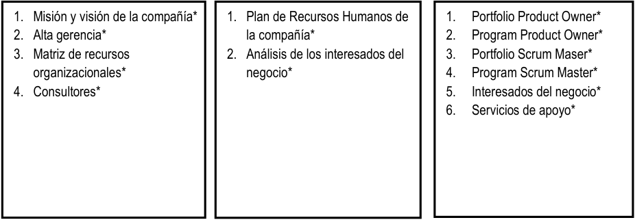

<!-- Start of picture text -->
1. Misión y visión de la compañía*  1. Plan de Recursos Humanos de  1. Portfolio Product Owner* 2. Alta gerencia*  la compañía*  2. Program Product Owner* 3. Matriz de recursos  2. Análisis de los interesados del  3. Portfolio Scrum Maser* organizacionales*  negocio*  4. Program Scrum Master* 4. Consultores*  5. Interesados del negocio* 6. Servicios de apoyo* <!-- End of picture text -->

**Figura 14-4: Crear o actualizar los equipos del programa o portafolio: entradas, herramientas y salidas** 

_Nota: Los asteriscos (*) indican una entrada, herramientas o salida “obligatoria” para el proceso correspondiente._ 

©2025 SCRUMstudy™. _Una guía para el conocimiento de Scrum (Guía SBOK™)_ **347** 

14. ESCALAMIENTO DE SCRUM PARA LA EMPRESA 

#### **14.3.1 Entradas** 

##### **14.3.1.1 Visión y misión de la compañía*** 

La visión y la misión de la compañía son entradas importantes en cualquier proyecto, pero aún más en programas, especialmente al nivel del portafolio. Los programas y portafolios deben guiarse por la misión y visión general de la empresa, ya que esto garantiza la unidad en el esfuerzo en toda la organización. 

Entender la visión de la compañía ayuda al portafolio o al programa a mantenerse enfocados en los objetivos de la organización y el futuro potencial de la compañía. El Product Owner del programa o del portafolio pueden guiarse y orientarse con la visión de la compañía para crear la declaración de la visión del proyecto. 

La misión de la compañía proporciona el marco de trabajo para formular las estrategias de la compañía y guiar la toma de decisiones. La visión del proyecto debe estructurarse de forma que su cumplimiento ayude a la organización a cumplir con su misión. 

##### **14.3.1.2 Alta gerencia*** 

La alta gerencia debe contar con representantes de la organización interna de la compañía que recibe los beneficios o es responsable de los entregables del programa o portafolio. La alta gerencia de la compañía debe incluir al director ejecutivo (CEO), director tecnológico (CTO), director de finanzas (CFO), vicepresidentes, directores u otros empleados de alto nivel de las distintas divisiones al interior de la organización. 

##### **14.3.1.3 Matriz de recursos organizacionales** 

La matriz de recursos organizacionales a nivel de un programa o portafolio debe incluir a los empleados de la compañía que cuentan con los conocimientos y la disponibilidad para desempeñar los roles de alto nivel relacionados a los proyectos de Scrum. Para obtener más información sobre la matriz de recursos organizacionales, véase la sección 8.2.1.5. 

##### **14.3.1.4 Consultores** 

Si la compañía no cuenta con las habilidades necesarias para organizar y manejar programas o portafolios de Scrum, debe acudir a consultores externos para que ayuden a la alta gerencia a conformar los equipos del programa o portafolio. 

**348** ©2025 SCRUMstudy™. _Una guía para el conocimiento de Scrum (Guía SBOK™)_ 

14. ESCALAMIENTO DE SCRUM PARA LA EMPRESA 

**14** 

#### **14.3.2 Herramientas** 

##### **14.3.2.1 Plan de recursos humanos de la compañía** 

El plan de recursos humanos de la compañía brinda información general sobre la disponibilidad de personal para varios proyectos, programas y portafolios. También incluye información sobre el conocimiento y las capacidades con las que cuenta la compañía, así como los planes para la contratación del personal necesario para futuras actividades. 

##### **14.3.2.2 Análisis de interesados del negocio** 

Se pueden utilizar técnicas de análisis de los interesados a fin de identificar y analizar a los interesados del negocio y a cualquier otro interesado relevante afectado en los niveles del programa y portafolio. Las técnicas de análisis de los interesados se pueden utilizan para evaluar los intereses, la participación y el posible impacto de cada interesado identificado en el programa o portafolio. Este análisis es útil para entender los requisitos de comunicación y participación que beneficien al programa o portafolio. 

#### **14.3.3 Salidas** 

##### **14.3.3.1 Portfolio Product Owner*** 

Descrito en la sección 3.7.4.2. 

##### **14.3.3.2 Program Product Owner*** 

Descrito en la sección 3.7.4.1. 

##### **14.3.3.3 Portfolio Scrum Master*** 

Descrito en la sección 3.7.4.4. 

##### **14.3.3.4 Program Scrum Master*** 

Descrito en la sección 3.7.4.3. 

©2025 SCRUMstudy™. _Una guía para el conocimiento de Scrum (Guía SBOK™)_ **349** 

14. ESCALAMIENTO DE SCRUM PARA LA EMPRESA 

##### **14.3.3.5 Interesados del negocio*** 

En este proceso se identifican a los interesados del negocio que juegan un papel importante en el programa o portafolio. Se identifican también a clientes, usuarios y patrocinadores. Estos influyen en el programa o portafolio y en todos sus respectivos proyectos a lo largo del desarrollo del proyecto. Los interesados del programa o portafolio también pueden ayudar a definir la visión del proyecto, programa o portafolio y brindan asesoría sobre el valor del negocio. 

Los interesados del programa interactúan con los interesados del portafolio para garantizar que el programa esté en armonía con las metas y objetivos del portafolio. Los interesados del programa o del portafolio también participan en la identificación de los interesados de proyectos individuales y aseguran que la visión, los objetivos, los resultados y las liberaciones de proyectos individuales en el programa o el portafolio coincidan con la visión del programa o portafolio. 

Al nivel del portafolio, los interesados del negocio pueden ser los miembros del consejo directivo de la compañía u organización gubernamental. Al nivel del programa, los interesados del negocio pueden ser los ejecutivos de alto nivel y el patrocinador del programa o de proyectos asociados. 

##### **14.3.3.6 Servicios de apoyo** 

Al nivel del programa o portafolio, esto debe incluir a personas o grupos responsables a cargo de la capacitación, la logística, la publicidad, las finanzas, la infraestructura, la arquitectura y demás servicios de apoyo necesarios para el funcionamiento satisfactorio del programa o portafolio. Algunas de estas personas también pudieran trabajar de tiempo completo en el programa o portafolio. Para obtener más información sobre los servicios de apoyo, véase a la sección 3.3.2. 

**350** ©2025 SCRUMstudy™. _Una guía para el conocimiento de Scrum (Guía SBOK™)_ 

14. ESCALAMIENTO DE SCRUM PARA LA EMPRESA 

**14** 

### **14.4 Crear o actualizar los componentes del programa o portafolio** 

En este proceso, los Product Owners del programa o portafolio, así como los Scrum Masters y los interesados del negocio identifican los componentes comunes y los recursos necesarios en el programa o portafolio. Se definen los criterios mínimos de terminado y se identifican a todos los interesados del negocio relevantes. Se atienden las dependencias entre proyectos; se discuten impedimentos comunes y se comparten las mejores prácticas. En ocasiones se hacen recomendaciones para mejorar el Scrum Guidance Body. 

Es importante destacar que no es necesario crear todos los componentes del programa o portafolio al inicio. Esto generalmente es un proceso iterativo, ya que algunos de los principales componentes del programa o portafolio se crean con anticipación y otros se pueden crear o actualizar después. 

Las salidas del proceso de _Crear o actualizar los componentes del programa o portafolio_ serían entradas al proceso posterior a la creación inicial. Por ejemplo, después de identificar los criterios mínimos de terminado, esas serán las entradas al actualizar los componentes del programa o portafolio. 

La figura 14-5 muestra las entradas, herramientas y salidas del proceso de _Crear o actualizar los componentes del programa o portafolio_ . 

1. Misión y visión de la 1. Plan de comunicación* 1. Criterios mínimos de terminado* compañía* 2. Plan de Recursos Humanos 2. Recursos compartidos* 

2. Portfolio Product Owner* de la compañía* 3. Interesados del negocio 3. Portfolio Scrum Master* 3. Análisis de los interesados identificados* 4. Program Product Owner* del negocio* 4. Lista de impedimentos 5. Program Scrum Master* 4. Reunión de Scrum de Scrums actualizada* 6. Matriz de recursos 5. Reunión de Scrum de Scrum 5. Dependencias actualizadas* organizacionales de Scrums 6. Plan de colaboración de 

7. Recomendaciones del Scrum 6. Técnicas de comunicación Product Owners* Guidance Body 7. Herramienta de Proyecto 7. Plan de colaboración de Scrum 

8. Interesados del negocio Scrum impulsada por IA Masters y los Equipos Scrum* 8. Mejoras recomendadas del Scrum Guidance Body 

**Figura 14-5: Crear o actualizar los componentes del programa o portafolio: entradas, herramientas y salidas** 

_Nota: Los asteriscos (*) indican una entrada, herramientas o salida “obligatoria” para el proceso correspondiente._ 

©2025 SCRUMstudy™. _Una guía para el conocimiento de Scrum (Guía SBOK™)_ **351** 

14. ESCALAMIENTO DE SCRUM PARA LA EMPRESA 

#### **14.4.1 Entradas** 

##### **14.4.1.1 Visión y misión de la compañía*** 

La visión y la misión de la compañía son entradas importantes en cualquier proyecto, pero aún más en programas y portafolios. Los programas y portafolios deben guiarse por la misión y visión general de la empresa, ya que esto garantiza la unidad en el esfuerzo en toda la organización. Para obtener más información sobre la visión y misión de la compañía, véase la sección 14.3.1.1. 

La figura 14-6 muestra una hoja de trabajo de declaración de visión con cinco indicaciones para definir la cultura, los objetivos, los logros, las palabras clave y una representación visual de una organización. 

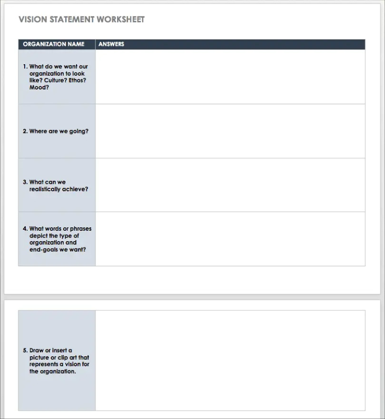

**Figura 14-6: Plantilla de declaración de visión de la empresa (fuente: Smartsheet)** 

**352** ©2025 SCRUMstudy™. _Una guía para el conocimiento de Scrum (Guía SBOK™)_ 

14. ESCALAMIENTO DE SCRUM PARA LA EMPRESA 

**14** 

La Figura 14-7 muestra una Hoja de Trabajo de Declaración de Misión que describe seis pasos para crear una declaración de misión, desde hacer preguntas hasta publicar, terminando con espacio para la declaración final. 

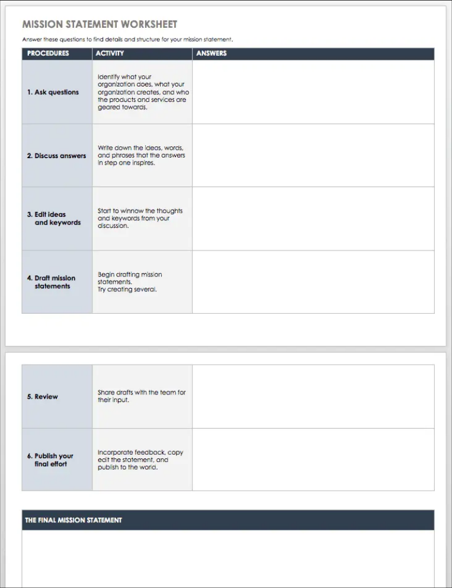

**Figura 14-7: Plantilla de declaración de misión de la empresa (fuente: Smartsheet)** 

##### **14.4.1.2 Portfolio Product Owner*** 

Descrito en la sección 3.7.4.2. 

©2025 SCRUMstudy™. _Una guía para el conocimiento de Scrum (Guía SBOK™)_ **353** 

14. ESCALAMIENTO DE SCRUM PARA LA EMPRESA 

##### **14.4.1.3 Portfolio Scrum Master*** 

Descrito en la sección 3.7.4.4. 

##### **14.4.1.4 Program Product Owner*** 

Descrito en la sección 3.7.4.1. 

##### **14.4.1.5 Program Scrum Master*** 

Descrito en la sección 3.7.4.3. 

##### **14.4.1.6 Matriz de recursos organizacionales** 

Descrito en la sección 8.2.1.5 

##### **14.4.1.7 Recomendaciones del Scrum Guidance Body** 

Las recomendaciones del Scrum Guidance Body son especialmente importantes al nivel del programa y portafolio, ya que es necesaria una participación apropiada cuando se trata de una cantidad considerable de proyectos. Para obtener más información sobre las recomendaciones del Scrum Guidance Body, véase la sección 8.1.1.7. 

##### **14.4.1.8 Interesados del negocio** 

Descrito en las secciones 3.3.2 y 14.3.3.5. 

#### **14.4.2 Herramientas** 

##### **14.4.2.1 Plan de comunicación** 

El plan de comunicación debe definir la forma de diseminar información a los interesados del negocio y en toda la organización, el portafolio y los programas. Debe definir también cómo y cuándo comunicar, así como el método de comunicación que se utilizará. El portafolio ofrece orientación e información para el plan de comunicación en los programas dentro del portafolio. De igual forma, el programa proporciona orientación e información al plan de comunicaciones para los proyectos dentro del programa. Para obtener más información sobre el plan de comunicación, véase la sección 12.1.3.4. 

**354** ©2025 SCRUMstudy™. _Una guía para el conocimiento de Scrum (Guía SBOK™)_ 

14. ESCALAMIENTO DE SCRUM PARA LA EMPRESA 

**14** 

##### **14.4.2.2 Plan de recursos humanos de la compañía*** 

Descrito en la sección 14.3.2.1. 

##### **14.4.2.3 Análisis de los interesados** 

Descrito en la sección 14.3.2.2. 

##### **14.4.2.4 Reunión de Scrum de Scrums*** 

El objetivo de la reunión de Scrum de Scrums es similar a su implementación en los grandes proyectos. A nivel del programa, los representantes de cada proyecto subyacente en el programa se reúnen periódicamente en las reuniones de Scrum de Scrums (SoS). Para obtener más información sobre las reuniones de Scrum de Scrums, véase la sección 13.3.5. 

##### **14.4.2.5 Reunión de Scrum de Scrum de Scrums** 

Al nivel del programa, y especialmente al nivel del portafolio, resulta lógico contar con otro nivel de reuniones. Los representantes de los programas y proyectos relevantes o interrelacionados en el programa o portafolio se reúnen periódicamente o cuando sea necesario. A esta reunión asisten los representantes de las reuniones de Scrum de Scrums. Este nivel adicional de reuniones se denomina Scrum de Scrum de Scrums (SoSoS). La figura 14-8 muestra el concepto del Scrum de Scrums (SoS) y del Scrum de Scrum de Scrums. 

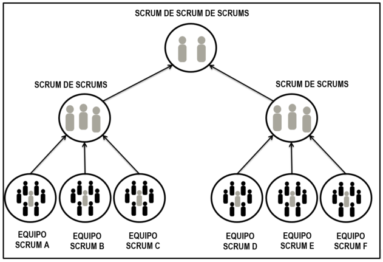

**Figura 14-8: Reunión de Scrum de Scrums (SoS)** 

En este ejemplo hay seis proyectos de Scrum que avanzan simultáneamente. Los proyectos A, B y C son parte de un programa, mientras que los proyectos D, E y F son parte de otro. Se lleva a cabo una reunión de Scrum de Scrums para coordinar las interdependencias dentro de cada uno de los dos programas. 

©2025 SCRUMstudy™. _Una guía para el conocimiento de Scrum (Guía SBOK™)_ **355** 

14. ESCALAMIENTO DE SCRUM PARA LA EMPRESA 

Se puede llevar a cabo una reunión de Scrum de Scrums de Scrums para coordinar y gestionar las dependencias entre los dos programas del portafolio. 

##### **14.4.2.6 Técnicas de comunicación** 

Al nivel del programa o portafolio, los métodos y técnicas de comunicación deben escalar a un gran número de participantes y debido a que no todos se encuentran en el mismo lugar de trabajo. Debe haber consideraciones adicionales para comunicaciones de tipo _push_ (empujar) en vez de _pull_ (jalar). Por ejemplo: tableros o informes publicados en línea para que los puedan ver los interesados del negocio cuando lo deseen ( _pull_ ) o enviarlos directamente ( _push_ ) en periodos frecuentes. En grupos más grandes, cuando la comunicación cara a cara no es posible, se pueden utilizar herramientas como reuniones virtuales, correo electrónico, mensajería instantánea, tableros de mensajes. El uso de una herramienta para un proyecto de Scrum también puede facilitar la comunicación al nivel del programa o portafolio. Para obtener más información sobre las técnicas de comunicación, véase la sección 10.3.2.2. 

##### **14.4.2.7** **<mark>Herramienta de proyecto Scrum impulsada por IA</mark>** 

A nivel de programa o cartera, la herramienta de proyectos Scrum impulsada por IA proporciona la capacidad de escalar para administrar los roles adicionales, la coordinación, la generación de informes, las comunicaciones y otros requisitos relevantes. Para obtener más información sobre la herramienta de proyectos Scrum impulsada por IA, consulte las secciones 2.4.4 y 13.3.8. 

#### **14.4.3 Salidas** 

##### **14.4.3.1 Criterios mínimos de terminado*** 

Los criterios mínimos de terminado definidos al nivel del portafolio aplican a todos los proyectos y programas subyacentes. De igual forma, los criterios mínimos de terminado al nivel del programa aplican a todos los proyectos subyacentes. La serie de criterios de terminado en cascada asegura que todos los criterios de terminado subyacentes cumplan con los requisitos mínimos establecidos a niveles superiores. Al nivel del portafolio, el Scrum Guidance Body puede participar en la definición de los criterios mínimos de terminado. Para obtener más información sobre los criterios mínimos de terminado, véase la sección 5.4.4. 

##### **14.4.3.2 Recursos compartidos*** 

Descrito en la sección 13.2.4. 

**356** ©2025 SCRUMstudy™. _Una guía para el conocimiento de Scrum (Guía SBOK™)_ 

14. ESCALAMIENTO DE SCRUM PARA LA EMPRESA 

**14** 

##### **14.4.3.3 Interesados del negocio identificados*** 

Los interesados del negocio al nivel del programa o portafolio son una entrada en este proceso. En este proceso también se identifican interesados del negocio adicionales. Para obtener más información sobre los interesados del negocio relevantes al nivel del proyecto, véase la sección 8.2.3.2. 

##### **14.4.3.4 Lista de impedimentos actualizada*** 

Los impedimentos que enfrentan los proyectos individuales pueden ser relevantes para otros proyectos. Por lo tanto, las listas de impedimentos al nivel del Proyecto se pueden compartir entre proyectos o programas. Como resultado de la reunión de Scrum de Scrums o de Scrum de Scrum de Scrums, tal vez sea necesario actualizar las listas de impedimentos a nivel del proyecto. También puede haber listas de impedimentos al nivel del programa o portafolio. Para obtener más información sobre la lista de impedimentos, véase la sección 10.1.1.4. 

##### **14.4.3.5 Dependencias actualizadas*** 

En proyectos o programas interrelacionados dentro de la empresa es posible encontrar interdependencias que deben ser identificadas. Por ello debe de haber una coordinación entre proyectos a fin de gestionar las dependencias. 

Estas dependencias pueden incluir: 

- Fechas de liberación compartidas en proyectos interrelacionados 

- Dependencias entre liberaciones 

- Dependencias en funcionalidades interrelacionadas 

Debido a la coordinación de los componentes del programa o portafolio, tal vez sea necesario actualizar las dependencias conocidas con dependencias nuevas o con cambios a las ya existentes. Pudiera haber, por ejemplo, dependencias entre proyectos dentro de un programa o portafolio. Ejemplo: En un programa existen los proyectos A y B. Ambos proyectos pudieran tener la misma fecha de liberación, o la fecha de liberación del proyecto A pudiera ser posterior a la liberación del proyecto B. En cualquier de los casos, si el proyecto B se retrasa, el proyecto A también se retrasará incluso si sus entregables fueron terminados a tiempo. Para obtener más información sobre las dependencias al nivel del proyecto, véanse las secciones 8.5.2.6 y 9.4.2.3. 

##### **14.4.3.6 Plan de colaboración de los Product Owners*** 

Descrito en la sección 13.2.2. 

##### **14.4.3.7 Plan de colaboración de los Scrum Masters y los Equipos Scrum*** 

Descrito en la sección 13.2.3. 

©2025 SCRUMstudy™. _Una guía para el conocimiento de Scrum (Guía SBOK™)_ **357** 

14. ESCALAMIENTO DE SCRUM PARA LA EMPRESA 

##### **14.4.3.8 Mejoras recomendadas del Scrum Guidance Body** 

Como resultado del proceso de _Crear o actualizar los componentes del programa o portafolio_ , se pueden presentar sugerencias y opiniones para posibles mejoras del Scrum Guidance Body. Estas mejoras recomendadas se discutirán a fin de ser rechazadas o aceptadas por el Scrum Guidance Body (véase la sección 14.5, _Revisar y actualizar el Scrum Guidance Body_ ). Si el Scrum Guidance Body acepta las sugerencias, estas se incorporan como actualizaciones a la documentación del Scrum Guidance Body. 

**358** ©2025 SCRUMstudy™. _Una guía para el conocimiento de Scrum (Guía SBOK™)_ 

14. ESCALAMIENTO DE SCRUM PARA LA EMPRESA 

**14** 

### **14.5 Revisar y actualizar el Scrum Guidance Body** 

En este proceso, las recomendaciones del Scrum Guidance Body se revisan constantemente por parte de sus miembros y se actualizan cuando sea necesario. En este proceso, también se atienden los cambios en los integrantes del Scrum Guidance Body. El principal objetivo de este proceso es monitorear contantemente y trabajar para mejorar la productividad de los proyectos, programas y portafolios de Scrum. 

Es importante destacar que el proceso de _Revisar y actualizar el Scrum Guidance Body_ generalmente se hace en forma iterativa, ya que los proyectos de Scrum continúan con sus retrospectivas y constantemente se identifican oportunidades para mejorar. Al nivel del programa o portafolio, el Scrum Guidance Body revisa la información de las retrospectivas a nivel del programa y portafolio; identifica oportunidades de mejora y ayuda a diseminar buenas prácticas en toda la empresa. 

La figura 14-9 muestra todas las entradas, herramientas y salidas del proceso de _Revisar y actualizar el Scrum Guidance Body_ . 

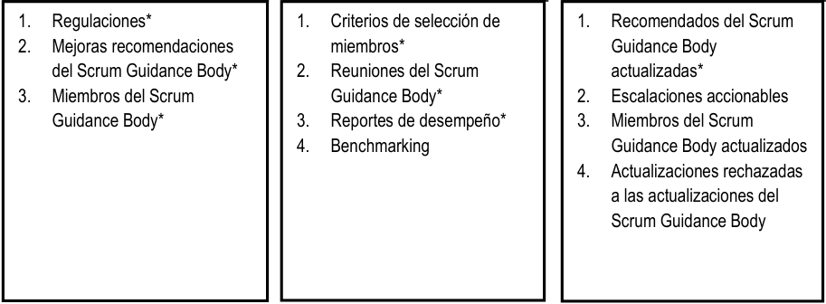

<!-- Start of picture text -->
1. Regulaciones*  1. Criterios de selección de  1. Recomendados del Scrum 2. Mejoras recomendaciones  miembros*  Guidance Body del Scrum Guidance Body*  2. Reuniones del Scrum  actualizadas* 3. Miembros del Scrum  Guidance Body*  2. Escalaciones accionables Guidance Body*  3. Reportes de desempeño*  3. Miembros del Scrum 4. Benchmarking   Guidance Body actualizados 4. Actualizaciones rechazadas a las actualizaciones del Scrum Guidance Body <!-- End of picture text -->

**Figura 14-9: Revisar y actualizar el Scrum Guidance Body: entradas, herramientas y salidas** 

_Nota: Los asteriscos (*) indican una entrada, herramientas o salida “obligatoria” para el proceso correspondiente._ 

#### **14.5.1 Entradas** 

##### **14.5.1.1 Regulaciones*** 

Las regulaciones incluyen cualquier regulación federal, estatal, local o de la industria que debe cumplir el programa o portafolio. Las historias de usuario elaboradas para cumplir con las regulaciones gubernamentales dentro de un periodo estipulado se incluyen en el backlog del producto del programa o portafolio. 

©2025 SCRUMstudy™. _Una guía para el conocimiento de Scrum (Guía SBOK™)_ **359** 

14. ESCALAMIENTO DE SCRUM PARA LA EMPRESA 

En ocasiones pudiera ser necesario actualizar las recomendaciones del Scrum Guidance Body para incluir las nuevas regulaciones. 

##### **14.5.1.2 Mejoras recomendadas del Scrum Guidance Body*** 

Como resultado de las retrospectivas y de otros procesos, se pueden hacer sugerencias para revisar o mejorar los lineamientos, las plantillas y demás documentación del Scrum Guidance Body. Si el Scrum Guidance Body acepta las regulaciones u opiniones, los cambios relevantes se incorporan como actualizaciones al material del Scrum Guidance Body en forma de recomendaciones a los equipos del proyecto, del programa y del portafolio. 

##### **14.5.1.3 Miembros del Scrum Guidance Body*** 

Entre los miembros del Scrum Guidance Body (SGB) se pueden incluir a expertos en Scrum, _coaches_ de Scrum, consultores externos, Scrum Masters selectos, Product Owners y miembros del equipo (en todos los niveles). Sin embargo, debe de haber un límite en el número de integrantes que puede tener un SGB a fin de asegurar que permanezca relevante y no se convierta en órgano prescriptivo. 

#### **14.5.2 Herramientas** 

##### **14.5.2.1 Criterios de selección de miembros*** 

Los criterios de selección de miembros se crean para definir quienes serán los miembros del Scrum Guidance Body, cuáles serán sus roles y responsabilidades, el número de miembros, así como la experiencia y los conocimientos necesarios. Cada organización puede tener sus propios criterios de selección de miembros del Scrum Guidance Body; sin embargo, se recomienda que cada miembro tenga experiencia Scrum y pueda contribuir eficazmente al Scrum Guidance Body. 

##### **14.5.2.2 Reuniones del Scrum Guidance Body*** 

Los miembros del Scrum Guidance Body se reúnen constantemente para dialogar sobre la posible necesidad de actualizar las recomendaciones del Scrum Guidance Body (por ejemplo: mejoras recomendadas de las retrospectivas y otros procesos, regulaciones actualizadas, etc.). La frecuencia de estas reuniones la decide el propio Scrum Guidance Body con base en las necesidades específicas de la empresa. 

##### **14.5.2.3 Reportes de desempeño** 

Pueden existir reportes disponibles sobre el desempeño de proyectos, programas y portafolios de Scrum. Estos reportes pueden incluir información relacionada a la velocidad del equipo, a la funcionalidad entregada, al estatus de finalización, etc. Cualquier información debe ser considerada por el Scrum Guidance Body para establecer oportunidades de mejora. 

**360** ©2025 SCRUMstudy™. _Una guía para el conocimiento de Scrum (Guía SBOK™)_ 

14. ESCALAMIENTO DE SCRUM PARA LA EMPRESA 

**14** 

##### **14.5.2.4 Benchmarking** 

Se le conoce como _benchmarking_ al proceso de comparar los procesos de negocio de una organización, así como las métricas de desempeño de compañías líderes en la misma industria o en otras. La empresa debe comparar constantemente sus propias prácticas con las de otras compañías a fin de mantenerse al día con la competencia y estar al tanto de nuevas prácticas y estándares de la industria. 

#### **14.5.3 Salidas** 

##### **14.5.3.1 Recomendaciones del Scrum Guidance Body actualizadas*** 

Después de revisar y tomar en cuenta las recomendaciones de mejora del Scrum Guidance Body, los informes sobre el desempeño y la información del benchmarking, tal vez sea necesario hacer cambios a la documentación existente. Cualquier cambio aprobado conlleva a una actualización al material que conforma el Scrum Guidance Body y se presenta en forma de recomendación al actual o futuro proyecto, programa o portafolio de Scrum. 

##### **14.5.3.2 Escalaciones accionables** 

El Scrum Guidance Body puede decidir si algunas de las políticas de la compañía no les permiten a los equipos obtener los máximos beneficios en el uso de Scrum. En tales casos, se debe activar una escalación a fin de obtener la aprobación para modificar las políticas. 

##### **14.5.3.3 Miembros del Scrum Guidance Body actualizados** 

Como resultado de la evaluación de los integrantes del Scrum Guidance Body, se pueden incluir a nuevos integrantes y los ya existentes pueden salir o ser removidos. 

##### **14.5.3.4 Actualizaciones rechazadas a las recomendaciones del Scrum Guidance Body** 

Las mejoras recomendadas del Scrum Guidance Body no siempre serán aceptadas. Si una recomendación es rechazada por los integrantes del Scrum Guidance Body, se presenta una opinión sobre los motivos del rechazo a la parte correspondiente. 

©2025 SCRUMstudy™. _Una guía para el conocimiento de Scrum (Guía SBOK™)_ **361** 

14. ESCALAMIENTO DE SCRUM PARA LA EMPRESA 

### **14.6 Crear o refinar el backlog priorizado del programa o portafolio** 

En este proceso se elabora, se actualiza y se refina el backlog del programa o portafolio con base en los requerimientos al nivel del programa o del portafolio. El backlog priorizado del producto se ajusta de manera constante para agregar o actualizar requerimientos, riesgos y prioridades. 

Cualquier salida del proceso de _Crear o refinar el backlog priorizado del programa o portafolio_ sería entrada en el proceso posterior a la creación inicial. Por ejemplo, el backlog priorizado del programa o del portafolio se puede crear por primera vez durante este proceso, pero se convierte en entrada obligatoria en subsecuentes refinaciones o actualizaciones. 

La figura 14-10 muestra todas las entradas, herramientas y salidas del proceso de _Crear o refinar el backlog priorizado del programa o portafolio_ . 

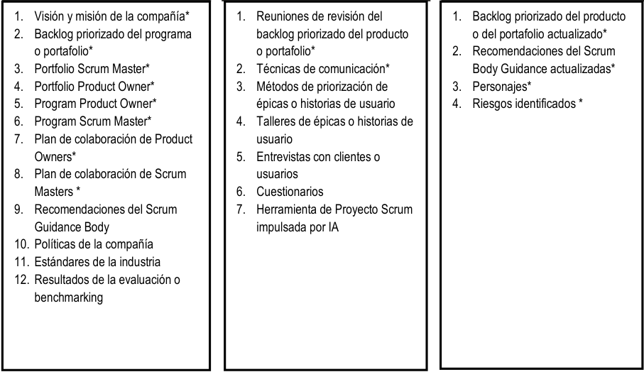

<!-- Start of picture text -->
1. Visión y misión de la compañía*  1. Reuniones de revisión del  1. Backlog priorizado del producto 2. Backlog priorizado del programa  backlog priorizado del producto  o del portafolio actualizado* o portafolio*  o portafolio*  2. Recomendaciones del Scrum 3. Portfolio Scrum Master*  2. Técnicas de comunicación*   Body Guidance actualizadas* 4. Portfolio Product Owner*  3. Métodos de priorización de  3. Personajes* 5. Program Product Owner*  épicas o historias de usuario  4. Riesgos identificados * 6. Program Scrum Master* 4. Talleres de épicas o historias de 7. Plan de colaboración de Product  usuario Owners* 5. Entrevistas con clientes o 8. Plan de colaboración de Scrum  usuarios Masters * 6. Cuestionarios 9. Recomendaciones del Scrum  7. Herramienta de Proyecto Scrum Guidance Body  impulsada por IA 10. Políticas de la compañía 11. Estándares de la industria 12. Resultados de la evaluación o benchmarking <!-- End of picture text -->

**Figura 14-10: Crear o refinar el backlog priorizado del programa o portafolio: entradas, herramientas y salidas** 

_Nota: Los asteriscos (*) indican una entrada, herramientas o salida “obligatoria” para el proceso correspondiente._ 

**362** ©2025 SCRUMstudy™. _Una guía para el conocimiento de Scrum (Guía SBOK™)_ 

14. ESCALAMIENTO DE SCRUM PARA LA EMPRESA 

**14** 

#### **14.6.1 Entradas** 

##### **14.6.1.1 Visión y misión de la compañía** 

Descrito en la sección 14.3.1.1. 

##### **14.6.1.2 Backlog priorizado del programa o portafolio** 

El Product Owner del programa o del portafolio desarrolla el backlog priorizado del programa o del portafolio, el cual incluye una lista priorizada de requisitos de alto nivel del negocio y del proyecto escritos en forma de épicas al nivel del programa o portafolio. Posteriormente, el Product Owner de cada proyecto refina estas épicas a medida que elabora y prioriza los backlogs del producto en su respectivo proyecto. Estos backlogs priorizados del producto cuentan con historias de usuario más pequeñas pero detalladas que los equipos Scrum pueden estimar y a las que se pueden comprometer. Estos detalles se comparten entre los distintos proyectos para evitar la duplicidad innecesaria del trabajo. 

Al nivel del programa, el backlog priorizado del programa tiene una función muy similar al rol del backlog priorizado del producto al nivel del proyecto. Identifica los requerimientos del programa y sus prioridades, pero existen algunas diferencias. La creación de los entregables respectivos y su aceptación se hace en los proyectos del programa. Los criterios de terminado respectivos o de aceptación de cada elemento o historia de usuario en el backlog del producto pueden ser definidos al nivel del programa. Los proyectos deben cumplir con estos criterios, aunque pueden agregar sus propios criterios según sea necesario. 

La duración del sprint depende del proyecto y generalmente varía de proyecto en proyecto dentro de un programa. Además, la velocidad varía de un equipo a otro. Por lo tanto, no es necesario tener historias de usuario muy granulares al nivel del proyecto. Típicamente los programas cuentan con requerimientos de alto nivel como épicas, y la refinación de épicas al nivel del programa solo se extiende lo suficiente para garantizar que la épica respectiva se entienda claramente y que se puedan definir los criterios de aceptación tangibles del programa. 

Al nivel del portafolio, el backlog priorizado del portafolio tiene la misma función que el backlog priorizado del programa (al nivel del programa). Los elementos en el backlog priorizado del portafolio aportan información a los varios backlogs priorizados del programa y en última instancia a los backlogs priorizados del producto de cada proyecto correspondiente. Tal como se hace en los backlogs priorizados del programa, en este nivel, las épicas se refinan solo al mínimo si es necesario, ya que el refinamiento se hace dentro de los proyectos asociados al nivel de cada uno de los backlogs priorizados del producto. 

El Product Owner del programa o del portafolio refina constantemente el backlog priorizado del programa o del portafolio a fin de asegurar que se agreguen los nuevos requerimientos del negocio y que se documenten y se prioricen los ya existentes. Esto asegura que los requerimientos de mayor valor para los objetivos del programa tengan una alta prioridad y que el resto tengan menos prioridad. 

El backlog priorizado del programa o del portafolio brinda un amplio panorama de todos los proyectos que forman parte del programa o del portafolio. Por lo tanto, puede guiar considerablemente las metas, el alcance y los objetivos del proyecto, así como los beneficios esperados del negocio. 

©2025 SCRUMstudy™. _Una guía para el conocimiento de Scrum (Guía SBOK™)_ **363** 

14. ESCALAMIENTO DE SCRUM PARA LA EMPRESA 

##### **14.6.1.3 Portfolio Product Owner*** 

El Porftolio Product Owner es responsable de crear y refinar el backlog priorizado del portafolio. Para obtener más información sobre el rol del Portfolio Product Owner, véase la sección 3.7.4.2. 

##### **14.6.1.4 Portfolio Scrum Master*** 

Al nivel del portafolio, el Portfolio Scrum Master tiene una función similar al rol del Program Scrum Master en un programa. Es un facilitador, resuelve problemas y elimina impedimentos al nivel del portafolio. Para obtener más información sobre el rol del Portfolio Scrum Master, véase la sección 3.7.4.4. 

##### **14.6.1.5 Program Product Owner*** 

Al nivel del programa, el Program Product Owner es responsable de crear, entregar y refinar el backlog priorizado del programa del producto. Para obtener más información sobre el rol del Program Product Owner, véase la sección 3.7.4.1. 

##### **14.6.1.6 Program Scrum Master*** 

Al nivel del programa, el Program Scrum Master tiene una función similar al rol del Scrum Master en un proyecto. Es un facilitador, resuelve problemas y elimina impedimentos al nivel del programa. Para obtener más información sobre el rol del Program Scrum Master, véase la sección 3.7.4.3. 

##### **14.6.1.7 Plan de colaboración de los Product Owners** 

Descrito en la sección 13.2.2. 

##### **14.6.1.8 Plan de colaboración de los Scrum Masters y los Equipos Scrum** 

Descrito en la sección 13.2.3. 

##### **14.6.1.9 Recomendaciones del Scrum Guidance Body** 

Al crear y refinar el backlog priorizado del programa o portafolio, las recomendaciones del Scrum Guidance Body aporta las mejores prácticas que se deben tomar en cuenta al nivel del programa o portafolio. Para obtener más información sobre las recomendaciones del Scrum Guidance Body véanse las secciones 8.1.1.7 y 10.3.1.11. 

**364** ©2025 SCRUMstudy™. _Una guía para el conocimiento de Scrum (Guía SBOK™)_ 

14. ESCALAMIENTO DE SCRUM PARA LA EMPRESA 

**14** 

##### **14.6.1.10 Políticas de la compañía** 

Las políticas de la compañía son una serie de principios, reglas y lineamientos formulados o adoptados por una organización. La modificación a las políticas de la compañía puede afectar las épicas o historias de usuario existentes que fueron elaboradas con base en las políticas existentes. 

##### **14.6.1.11 Estándares de la industria** 

Para que un producto o servicio se mantenga viable, es necesario implementar los nuevos estándares de la industria o los cambios a los ya existentes. Por lo tanto, las historias de usuario relacionadas al cumplimiento de estos estándares deben de ser incluidas en el backlog priorizado del programa o del portafolio y se deben priorizar según sea el caso. En ocasiones es necesario modificar las recomendaciones del Scrum Guidance Body a fin de que se incluyan los estándares nuevos o modificados. 

##### **14.6.1.12 Resultados de la evaluación o benchmarking** 

Los resultados de la evaluación o benchmarking requerirán principalmente de una actualización a las mejores prácticas de las recomendaciones del Scrum Guidance Body. Los resultados también pueden ayudar a establecer un estándar mínimo al crear un producto o servicio y a modificar los criterios de terminado. En ocasiones pueden también dar el impulso para que un Product Owner del programa o portafolio desarrolle nuevas épicas a fin de implementar las mejores prácticas. 

#### **14.6.2 Herramientas** 

##### **14.6.2.1 Reuniones de revisión del backlog priorizado del programa o portafolio*** 

La participación en las reuniones de revisión del backlog del programa o portafolio es muy distinta a la participación en las reuniones de revisión al nivel del proyecto. Los equipos Scrum participan en las sesiones de refinamiento al nivel del proyecto. Al nivel del programa o portafolio hay un representante de cada proyecto en el programa o de cada programa o proyecto independiente en el portafolio. Sin embargo, para simplificar la reunión, generalmente se recomienda contar solamente uno o pocos representantes de cada proyecto o programa al nivel del programa o portafolio. Vénase las secciones 6.5.1.2 y 10.3.2.1 para conocer más detalles. 

##### **14.6.2.2 Técnicas de comunicación*** 

Descrito en la sección 10.3.2.2. 

©2025 SCRUMstudy™. _Una guía para el conocimiento de Scrum (Guía SBOK™)_ **365** 

14. ESCALAMIENTO DE SCRUM PARA LA EMPRESA 

##### **14.6.2.3 Métodos de priorización de épicas o historias de usuario** 

Al nivel del programa o portafolio, generalmente hay menos requerimientos, épicas o historias de usuario que al nivel del proyecto. Estos requerimientos también son de muy alto nivel y la priorización se guía principalmente por los requisitos del negocio según lo determinen los interesados del negocio, el Portfolio Product Owner y el Program Product Owner. Para obtener más información sobre los métodos de priorización, véase la sección 8.5.2.1. 

##### **14.6.2.4 Talleres de épicas o historias de usuario** 

En comparación a los proyectos, los talleres de historias de usuario en programas y portafolios producen solo historias de usuario de más alto nivel, por lo que el número de historias también es menor. Sin embargo, las reuniones siguen siendo útiles debido a la participación de representantes de distintos proyectos en un programa o de distintos programas en un portafolio. Estas reuniones típicamente son coordinadas por el Scrum Master del portafolio o del programa. Esto garantiza que los requerimientos se entiendan y estén bien definidos. Para obtener más información sobre los talleres de historias de usuario, véase la sección 8.4.2.2. 

##### **14.6.2.5 Entrevistas con clientes o usuarios** 

Descrito en la sección 8.4.2.4. 

##### **14.6.2.6 Cuestionarios** 

Descrito en la sección 8.4.2.5. 

##### **14.6.2.7** **<mark>Herramienta de proyecto Scrum impulsada por IA</mark>** 

Una herramienta de proyecto Scrum impulsada por IA adecuadamente diseñada proporciona una vista fácil de entender del programa priorizado o del backlog de la cartera y también ayuda al propietario del producto del programa o de la cartera a ver y priorizar los requisitos/epopeyas/historias de usuario. Para obtener más información sobre la herramienta de proyectos Scrum impulsada por IA, consulte las secciones 2.4.4 y 13.3.8. 

#### **14.6.3 Salidas** 

##### **14.6.3.1 Backlog priorizado del programa o portafolio actualizado** 

El backlog priorizado del programa o portafolio se puede actualizar con nuevas épicas o historias de usuario, con el trabajo relacionado a nuevas solicitudes de cambio, o bien, para que incluya la repriorización de las épicas o historias de usuario existentes. 

**366** ©2025 SCRUMstudy™. _Una guía para el conocimiento de Scrum (Guía SBOK™)_ 

14. ESCALAMIENTO DE SCRUM PARA LA EMPRESA 

**14** 

Debido a la refinación del backlog del programa o portafolio tal vez sea necesario iniciar un proyecto nuevo (por ejemplo: crear algún marco de trabajo para todos los proyectos o un interfaz web común que se use en todos los proyectos). 

##### **14.6.3.2 Mejoras recomendadas del Scrum Guidance Body** 

Como resultado del proceso de _Crear o refinar el backlog priorizado del programa o portafolio_ , se pueden presentar sugerencias u opiniones para posibles mejoras del Scrum Guidance Body. Estas mejoras recomendadas se discutirán, se aceptarán o se rechazarán por el propio Scrum Guidance Body. Si se aceptan las sugerencias, estas se incorporan en forma de actualización a la documentación del Scrum Guidance Body. Para obtener más información, véase el proceso de _Revisar y actualizar el Scrum Guidance Body_ . 

##### **14.6.3.3 Personajes** 

Descrito en la sección 8.4.3.2. 

##### **14.6.3.4 Riesgos identificados** 

Los riesgos relacionados a un programa o portafolio también afectan a los proyectos que forman parte del programa o portafolio respectivo. Durante la evaluación de riesgos en programas y portafolios, si se establece que un riesgo pudiera afectar a un programa o proyecto de menor nivel, la información relevante debe ser comunicada al Product Owner respectivo y al Equipo Scrum. Los riesgos del programa y del portafolio se convierten en entradas del proceso de _Desarrollar épicas_ en los proyectos relevantes y pueden tener un impacto general en la forma de llevar a cabo este proceso. Para obtener más información sobre la identificación de los riesgos en el proyecto, véanse las secciones 7.4.1 y 8.4.3.4. Los riesgos del programa y portafolio se describen en la sección 7.6. 

©2025 SCRUMstudy™. _Una guía para el conocimiento de Scrum (Guía SBOK™)_ **367** 

14. ESCALAMIENTO DE SCRUM PARA LA EMPRESA 

### **14.7 Crear o actualizar las liberaciones del programa o portafolio** 

En este proceso se planifican las liberaciones del programa o portafolio y se define cualquier dependencia entre estas liberaciones. Esto también afectará la planificación de liberación al nivel de un proyecto individual. El cronograma de liberación del programa o portafolio debe revisarse a lo largo del proyecto y se puede modificar con base en el avance de los entregables del proyecto, en requerimientos nuevos o modificados, o en otros factores. 

La reunión de planificación de la liberación se utiliza para revisar las liberaciones existentes y planificar las nuevas. 

Cualquier salida del proceso de _Crear o actualizar las liberaciones del programa o portafolio_ serán entradas del proceso después de la creación inicial. Por ejemplo, las liberaciones del programa o portafolio pueden crearse por primera vez durante este proceso, aunque estas se convierten en entradas obligatorias en futuras libraciones del programa o portafolio. 

La figura 14-11 muestra todas las entradas, herramientas y salidas del proceso de _Crear o actualizar las liberaciones del programa o portafolio_ . 

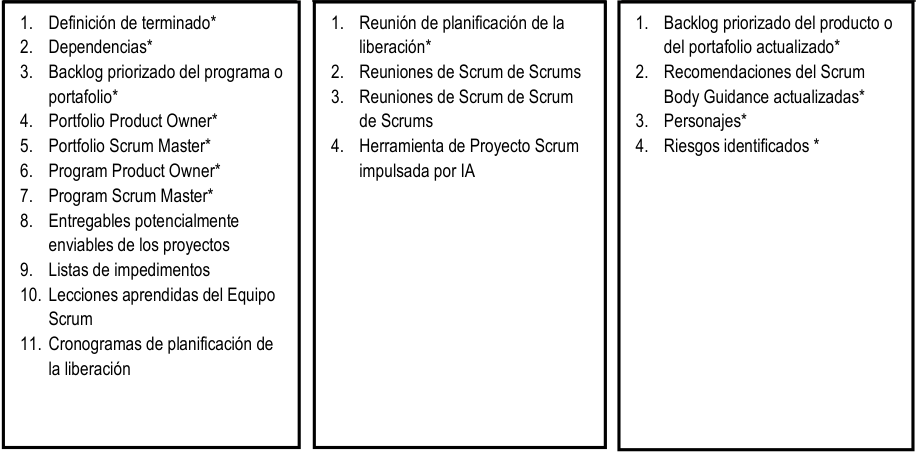

<!-- Start of picture text -->
1. Definición de terminado*  1. Reunión de planificación de la  1. Backlog priorizado del producto o 2. Dependencias*  liberación*  del portafolio actualizado* 3. Backlog priorizado del programa o  2. Reuniones de Scrum de Scrums  2. Recomendaciones del Scrum portafolio*  3. Reuniones de Scrum de Scrum  Body Guidance actualizadas* 4. Portfolio Product Owner*  de Scrums  3. Personajes* 5. Portfolio Scrum Master*  4. Herramienta de Proyecto Scrum  4. Riesgos identificados * 6. Program Product Owner*  impulsada por IA 7. Program Scrum Master* 8. Entregables potencialmente enviables de los proyectos 9. Listas de impedimentos 10. Lecciones aprendidas del Equipo Scrum 11. Cronogramas de planificación de la liberación <!-- End of picture text -->

**Figura 14-11: Crear o actualizar las liberaciones del programa o portafolio: entradas, herramientas y salidas** 

_Nota: Los asteriscos (*) indican una entrada, herramientas o salida “obligatoria” para el proceso correspondiente._ 

**368** ©2025 SCRUMstudy™. _Una guía para el conocimiento de Scrum (Guía SBOK™)_ 

14. ESCALAMIENTO DE SCRUM PARA LA EMPRESA 

**14** 

#### **14.7.1 Entradas** 

##### **14.7.1.1 Definición de terminado*** 

La definición de terminado (o criterios de terminado) establecida al nivel del programa o portafolio se puede utilizar como criterio mínimo de terminado de los proyectos en toda la empresa. Para obtener más detalles sobre los criterios de terminado, véanse las secciones 5.4.3 y 8.5.3.2. 

##### **14.7.1.2 Dependencias*** 

Descrito en las secciones 8.5.2.6 y 8.5.3.5. 

##### **14.7.1.3 Backlog priorizado del programa o portafolio*** 

Descrito en la sección 14.6.1.2. 

##### **14.7.1.4 Porfolio Product Owner*** 

Descrito en la sección 3.7.4.2. 

##### **14.7.1.5 Portfolio Scrum Master*** 

Descrito en la sección 3.7.4.4. 

##### **14.7.1.6 Program Product Owner*** 

Descrito en la sección 3.7.4.1. 

##### **14.7.1.7 Program Scrum Master*** 

Descrito en la sección 3.7.4.3. 

##### **14.7.1.8 Entregables potencialmente enviables de los proyectos** 

Los entregables potencialmente enviables de los proyectos son valiosas entradas para la coordinación al nivel del programa o portafolio. Al final de los sprints en los proyectos se finalizan los entregables o los incrementos del producto. Las historias de usuario que se incluyen en estos incrementos cumplen con la definición de terminado y con sus respectivos criterios de aceptación. 

©2025 SCRUMstudy™. _Una guía para el conocimiento de Scrum (Guía SBOK™)_ **369** 

14. ESCALAMIENTO DE SCRUM PARA LA EMPRESA 

##### **14.7.1.9 Listas de impedimentos** 

Descrito en las secciones 10.1.1.4 y 14.4.3.4. 

##### **14.7.1.10 Lecciones aprendidas de los equipos Scrum** 

Descrito en la sección 11.2.3.5. 

##### **14.7.1.11 Cronogramas de planificación de la liberación** 

Estos cronogramas, aunque son tentativos y están sujetos a cambios, son importantes para evaluar si los proyectos respectivos pueden o no cumplir con las fechas límite requeridas. También son especialmente importantes con relación a las dependencias. Para obtener más información sobre el cronograma de planificación de la liberación al nivel del proyecto, véase la sección 8.6.3.1. 

#### **14.7.2 Herramientas** 

##### **14.7.2.1 Reuniones de planificación de la liberación*** 

Para asegurar que las liberaciones del programa y portafolio sean planificadas adecuadamente, tal vez sea necesario llevar a cabo reuniones específicas de planificación de liberación entre Portfolio Product Owners, Program Product Owners, Portfolio Scrum Masters, Program Scrum Masters y otros interesados relevantes del negocio y de los equipos del proyecto. Las liberaciones del programa y portafolio brindan, a su vez, valiosas entradas para planificar las liberaciones al nivel del proyecto. 

##### **14.7.2.2 Reuniones de Scrum de Scrums*** 

Descrito en la sección 13.3.5. 

##### **14.7.2.3 Reuniones de Scrum de Scrum de Scrums*** 

Descrito en la sección 14.4.2.5. 

##### **14.7.2.4 Herramienta de proyecto Scrum impulsada por IA** 

La herramienta de proyectos Scrum impulsada por IA ayuda a los equipos a ver fácilmente los lanzamientos planificados de programas o carteras, realizar los cambios apropiados si es necesario y también planificar lanzamientos adicionales. Para obtener más información sobre la herramienta de proyectos Scrum impulsada por IA, consulte las secciones 2.4.4 y 13.3.8. 

**370** ©2025 SCRUMstudy™. _Una guía para el conocimiento de Scrum (Guía SBOK™)_ 

14. ESCALAMIENTO DE SCRUM PARA LA EMPRESA 

**14** 

#### **14.7.3 Salidas** 

##### **14.7.3.1 Liberaciones del programa o portafolio** 

La liberación de un programa o portafolio incluye las liberaciones de todos los proyectos subyacentes en el programa o portafolio. Hay dos formas típicas de llevar a cabo las liberaciones: 

1. Todos los entregables de los proyectos subyacentes se finalizan y quedan listos para ser liberados según lo determine el programa o portafolio. Puede haber una fecha específica de liberación para liberar todo el programa o portafolio al cliente final. 

2. Los entregables se liberan al nivel del proyecto cuando estén listos (por ejemplo, DevOps permite el desarrollo constante, la implementación y el despliegue). 

##### **14.7.3.2 Cronograma de liberación del programa o portafolio** 

Un cronograma de liberación del programa o portafolio incluye las fechas límite de diferentes liberaciones planificadas al nivel del programa o portafolio. 

##### **14.7.3.3 Backlog priorizado del programa o del portafolio actualizado** 

El backlog priorizado del programa o portafolio se actualiza a medida que las liberaciones existentes se ajustan y se proponen cambios o se agregan nuevas liberaciones. La actualización de las liberaciones del programa o portafolio pueden afectar también la priorización de las épicas o historias de usuario en el backlog priorizado del programa o portafolio. Para obtener más información sobre el backlog priorizado del programa o del portafolio, véase la sección 14.6.1.2. 

##### **14.7.3.4 Dependencias actualizadas** 

Las dependencias se pueden actualizar con base en las entradas de las reuniones o sesiones de planificación de liberación. 

©2025 SCRUMstudy™. _Una guía para el conocimiento de Scrum (Guía SBOK™)_ **371** 

14. ESCALAMIENTO DE SCRUM PARA LA EMPRESA 

### **14.8 Retrospectiva de las liberaciones del programa o portafolio** 

En este proceso se reúnen el Program o Portfolio Product Owner y los interesados del negocio para hacer una retrospectiva de la liberación del programa o portafolio e interiorizar las lecciones aprendidas. Generalmente, estas lecciones aprendidas se traducen en mejoras accionables acordadas que se implementarán en futuras liberaciones. En ocasiones se pueden recomendar mejoras al Scrum Guidance Body. Estas reuniones se pueden programar después de cada liberación del programa o portafolio 

La figura 14-12 muestra todas las entradas, herramientas y salidas del proceso de _Retrospectiva de las liberaciones del programa o portafolio_ . 

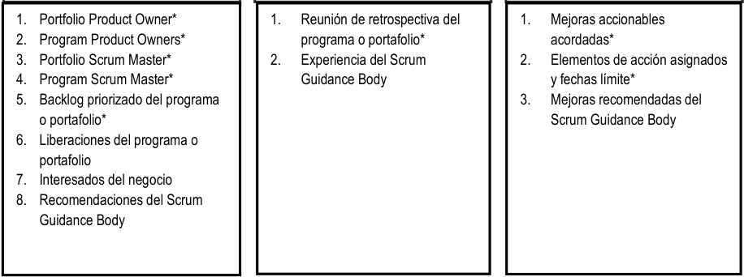

<!-- Start of picture text -->
1. Portfolio Product Owner*  1. Reunión de retrospectiva del  1. Mejoras accionables 2. Program Product Owners*  programa o portafolio*  acordadas* 3. Portfolio Scrum Master*  2. Experiencia del Scrum  2. Elementos de acción asignados 4. Program Scrum Master*  Guidance Body  y fechas límite* 5. Backlog priorizado del programa  3. Mejoras recomendadas del o portafolio*  Scrum Guidance Body 6. Liberaciones del programa o portafolio 7. Interesados del negocio 8. Recomendaciones del Scrum Guidance Body <!-- End of picture text -->

**Figura 14-12: Retrospectiva de las liberaciones del programa o portafolio: entradas, herramientas y salidas** 

_Nota: Los asteriscos (*) indican una entrada, herramientas o salida “obligatoria” para el proceso correspondiente._ 

#### **14.8.1 Entradas** 

##### **14.8.1.1 Portfolio Product Owner*** 

Descrito en la sección 3.7.4.2. 

##### **14.8.1.2 Portfolio Scrum Master*** 

Descrito en la sección 3.7.4.4. 

**372** ©2025 SCRUMstudy™. _Una guía para el conocimiento de Scrum (Guía SBOK™)_ 

14. ESCALAMIENTO DE SCRUM PARA LA EMPRESA 

**14** 

##### **14.8.1.3 Program Product Owner*** 

Descrito en la sección 3.7.4.1. 

##### **14.8.1.4 Program Scrum Master*** 

Descrito en la sección 3.7.4.3. 

##### **14.8.1.5 Backlog priorizado del programa o portafolio*** 

Descrito en la sección 14.6.1.2. 

##### **14.8.1.6 Liberaciones del programa o portafolio*** 

Descrito en la sección 14.7.3.1. 

##### **14.8.1.7 Interesados del negocio** 

Descrito en las secciones 3.3.2 y 14.3.3.5. 

##### **14.8.1.8 Recomendaciones del Scrum Guidance Body** 

Durante la retrospectiva de las liberaciones del programa o portafolio, las recomendaciones del Scrum Guidance Body brindan las mejores prácticas pertinentes, incluyendo información sobre procedimientos administrativos, auditorías, evaluaciones y criterios de transición del proyecto. Es similar al rol de las recomendaciones del Scrum Guidance Body al nivel de las retrospectivas del proyecto (descrito en la sección 12.2.1.5). 

#### **14.8.2 Herramientas** 

##### **14.8.2.1 Reunión de retrospectiva del programa o portafolio** 

La reunión de retrospectiva del programa o portafolio es similar a la reunión de retrospectiva de la liberación al nivel del proyecto (véase la sección 12.2.2.1). La principal diferencia es que las reuniones de retrospectiva del programa o portafolio se hacen con mucho menos frecuencia que las de retrospectiva de la liberación e incluyen al Product Owner del programa o portafolio, al Scrum Master del programa o portafolio, así como a los interesados del negocio en el programa o portafolio. 

##### **14.8.2.2 Experiencia del Scrum Guidance Body** 

Descrito en la sección 8.4.2.7. 

©2025 SCRUMstudy™. _Una guía para el conocimiento de Scrum (Guía SBOK™)_ **373** 

14. ESCALAMIENTO DE SCRUM PARA LA EMPRESA 

#### **14.8.3 Salidas** 

##### **14.8.3.1 Mejoras accionables acordadas** 

Descrito en la sección 11.2.3.1. 

##### **14.8.3.2 Elementos de acción asignados y fechas límite*** 

Descrito en la sección 11.2.3.2. 

##### **14.8.3.3 Mejoras recomendadas del Scrum Guidance Body** 

Como resultado del proceso de _Retrospectiva de las liberaciones del programa o portafolio_ se pueden presentar sugerencias y opiniones para posibles mejoras del Scrum Guidance Body. Estas mejoras recomendadas se analizan a fin de ser rechazadas o aceptadas por el Scrum Guidance Body. Si se aceptan las sugerencias, estas se incorporan en forma de actualizaciones a la documentación del Scrum Guidance Body. Para obtener más información, véase el proceso _Revisar y actualizar el Scrum Guidance Body_ . 

**374** ©2025 SCRUMstudy™. _Una guía para el conocimiento de Scrum (Guía SBOK™)_ 

APÉNDICE A. INFORMACIÓN GENERAL SOBRE LA AGILIDAD 

## **APÉNDICE A. INFORMACIÓN GENERAL SOBRE LA AGILIDAD** 

### **A.1 Introducción** 

El propósito de este apéndice es familiarizar al lector con el concepto de desarrollo ágil y las diversas metodologías ágiles. 

<mark>En las siguientes secciones se incluyen:</mark> 

**A.2 Información general:** Esta sección analiza la definición y los factores detrás del surgimiento de la agilidad. 

**A.3 Manifiesto Ágil:** En esta sección se presenta el _Manifiesto Ágil_ , sus principios, y la _Declaración de Interdependencia_ para proporcionar el contexto histórico de Ágil. 

**A.4 Métodos ágiles:** Esta sección ofrece una breve descripción de las metodologías ágiles específicas tales como: 

- **Lean Kanban** 

- **Extreme Programming (XP)** _– Programación Extrema_ 

- **Crystal Methods** – _Métodos Crystal_ 

- **Dynamic Systems Development Methods (DSDM)** – _Métodos de desarrollo de sistemas dinámicos_ 

- **Feature Driven Development (FDD)** – _Desarrollo basado en funcionalidades_ 

- **Test Driven Development (TDD)** – _Desarrollo guiado por pruebas_ 

- **Adaptive Software Development (ASD)** – _Desarrollo adaptativo de software_ 

- **Agile Unified Process (AUP)** – _Proceso Unificado Ágil_ 

- **Domain Driven Design (DDD)** – _Diseño guiado por el dominio_ 

© 2025 SCRUMstudy™. _Una guía para el conocimiento de Scrum (Guía SBOK™)_ 

**375** 

14. ESCALAMIENTO DE SCRUM PARA LA EMPRESA 

### **A.2 Información general** 

La palabra “ágil” generalmente hace referencia a la capacidad de moverse o responder con rapidez y facilidad; ser ágil. En cualquier tipo de disciplina de administración, la agilidad es una calidad, y, por lo tanto, es algo bueno que se debe buscar. Específicamente, la gestión ágil de proyectos implica ser adaptativo durante la creación de un producto, servicio u otro entregable. 

Es importante entender que, aunque el desarrollo de métodos ágiles es altamente adaptativo, también es necesario considerar la estabilidad en su proceso de adaptación. 

#### **A.2.1 El surgimiento de la agilidad** 

Los rápidos cambios en la tecnología, las demandas y expectativas del mercado han creado mayores desafíos en el desarrollo de productos y servicios mediante el uso de modelos tradicionales de gestión de proyectos. Esto abrió el camino para la conceptualización e implementación de métodos y valores ágiles en muchas organizaciones. Los modelos de desarrollo ágil atienden las deficiencias asociadas con los modelos tradicionales de gestión de proyectos para satisfacer las crecientes demandas ambientales y expectativas que enfrentan las organizaciones. Dado a que los modelos tradicionales de gestión de proyectos en general hacen énfasis en una amplia planificación anticipada y se ajustan al plan una vez que se establece, tales modelos no tuvieron éxito al intentar cumplir la realidad de los frecuentes cambios ambientales. 

Ágil depende de la planificación adaptiva y del desarrollo y la entrega iterativa. Se enfoca principalmente en el valor de las personas al hacer eficazmente el trabajo. Aunque las metodologías adaptativas e incrementales han existido desde los años cincuenta, únicamente las metodologías que conforman el _Manifiesto Ágil_ generalmente se consideran verdaderamente “ágiles”. 

**376** ©2025 SCRUMstudy™. _Una guía para el conocimiento de Scrum (Guía SBOK™)_ 

APÉNDICE A. INFORMACIÓN GENERAL SOBRE LA AGILIDAD 

### **A.3 El Manifiesto Ágil** 

En febrero del 2001, un grupo de 17 gurús de la informática, desarrolladores de software y administradores, se reunieron para discutir los métodos de desarrollo de software ligero. Formaron la Alianza Ágil ( _Agile Alliance_ ) y lo debates de estas reuniones resultaron después en un _Manifiesto para el desarrollo ágil de software_ ( _Manifesto for Agile Software Development_ ). El manifiesto fue escrito por Flowler y Highsmith (2001) y suscrito después por todos los participantes a fin de establecer los lineamientos básicos de cualquier método ágil. 

El propósito del Manifiesto Ágil se plasmó de la siguiente forma: 

_Estamos descubriendo formas mejores de desarrollar software tanto por nuestra propia experiencia como ayudando a terceros. A través de este trabajo hemos aprendido a valorar:_ 

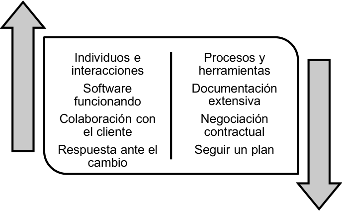

<!-- Start of picture text -->
Individuos e  Procesos y interacciones herramientas Software  Documentación funcionando extensiva Colaboración con  Negociación el cliente contractual Respuesta ante el  Seguir un plan cambio <!-- End of picture text -->

_Esto es, aunque valoramos los elementos de la derecha, valoramos más los de la izquierda._ 

Kent Beck James Grenning Robert C. Martin Mike Beedle Jim Highsmith Steve Mellor Arie van Bennekum Andrew Hunt Ken Schwaber Alistair Cockburn Ron Jeffries Jeff Sutherland Ward Cunningham Jon Kern Dave Thomas Martin Fowler Brian Marick 

El permiso para su reproducción fue proporcionado por los autores mencionados mediante aviso en http://agilemanifesto.org/ 

© 2025 SCRUMstudy™. _Una guía para el conocimiento de Scrum (Guía SBOK™)_ **377** 

14. ESCALAMIENTO DE SCRUM PARA LA EMPRESA 

Las cuatro contrapartes del Manifiesto Ágil se elaboran de la siguiente forma: 

**1. Individuos e interacciones sobre procesos y herramientas** 

Aunque los procesos y las herramientas ayudan a terminar con éxito un proyecto, son las personas quienes asumen, participan e implementan un proyecto y determinan cuáles procesos y herramientas utilizar. Por lo tanto, los actores clave en cualquier proyecto son las personas, por ello, el énfasis debe estar en ellos y en sus interacciones en vez de los complicados procesos y herramientas. 

###### 2. **Software funcionando sobre documentación extensiva** 

Aunque la documentación es necesaria y útil para cualquier proyecto, muchos equipos se centran en la recopilación y el registro de descripciones cualitativas y cuantitativas de los entregables, cuando el valor real que se le entrega al cliente es en forma de un software funcional. Por lo tanto, en vez de la documentación detallada, el enfoque ágil está en la entrega de un software de buen funcionamiento en incrementos a lo largo del ciclo de vida del producto. 

###### 3. **Colaboración con el cliente sobre negociación contractual** 

Tradicionalmente a los clientes se les ha visto como participantes externos, involucrados principalmente al inicio y al final del ciclo de vida del producto y cuya relación se basaba en contractos y en su cumplimiento. Ágil cree en un enfoque de valor compartido en el cual los clientes se consideran colaboradores. El equipo de desarrollo y el cliente trabajan unidos para evolucionar y desarrollar el producto. 

4. **Responder ante el cambio sobre seguir un plan** 

En el mercado actual —donde los requerimientos del cliente, las tecnologías disponibles y los patrones de negocio cambian constantemente—, es fundamental abordar el desarrollo de productos en una forma adaptativa que permita la incorporación de cambio y rápidos ciclos de vida de desarrollo de producto en vez de enfatizar el seguimiento de planes formados probablemente con información obsoleta. 

#### **A.3.1 Principios de Manifiesto Ágil** 

Los 12 principios del Manifiesto Ágil de Fowler y Highsmith (2001) son los siguientes: 

1. Nuestra mayor prioridad es satisfacer al cliente mediante la entrega temprana y continua de software valioso. 

2. Aceptamos que los requisitos cambien, incluso en etapas tardías del desarrollo. Los procesos Ágiles aprovechan el cambio para proporcionar ventaja competitiva al cliente. 

3. Entregamos software funcional frecuentemente, entre dos semanas y dos meses, de preferencia al menor tiempo posible. 

4. Los responsables de negocio y los desarrolladores deben trabajar juntos de forma cotidiana durante todo el proyecto. 

**378** ©2025 SCRUMstudy™. _Una guía para el conocimiento de Scrum (Guía SBOK™)_ 

APÉNDICE A. INFORMACIÓN GENERAL SOBRE LA AGILIDAD 

5. Los proyectos se desarrollan en torno a individuos motivados. Hay que darles el entorno y el apoyo que necesitan, y confiarles la ejecución del trabajo. 

6. El método más eficiente y efectivo de comunicar información al equipo de desarrollo y entre sus miembros es la conversación cara a cara. 

7. El software funcionando es la medida principal de progreso. 

8. Los procesos ágiles promueven el desarrollo sostenible. Los patrocinadores, desarrolladores y usuarios deben ser capaces de mantener un ritmo constante de forma indefinida. 

9. La atención continua a la excelencia técnica y al buen diseño mejora la agilidad. 

10. La simplicidad, o el arte de maximizar la cantidad de trabajo no realizado, es esencial. 

11. Las mejores arquitecturas, requisitos y diseños emergen de equipos autoorganizados. 

12. A intervalos regulares el equipo reflexiona sobre cómo ser más eficaz para después ajustar y perfeccionar su comportamiento según corresponda. 

#### **A.3.2 Declaración de interdependencia** 

La _Declaración de Interdependencia_ de gestión de proyectos ágiles fue redactada a principios del 2005 por un grupo de 15 líderes de proyecto como suplemento del Manifiesto Ágil. Enumera seis valores de gestión necesarios para reforzar la mentalidad del desarrollo ágil, particularmente en la gestión de proyectos complejos o inciertos. 

La declaración destaca que los equipos del proyecto, los clientes y demás interesados del negocio son interdependientes y están conectados, lo cual se debe reconocer a fin de lograr el éxito. Los valores por sí mismos son también interdependientes. 

_Nosotros..._ 

**_Aumentamos el retorno sobre la inversión_** _enfocándonos en la aportación continua de valor._ 

**_Entregamos resultados fiables_** _mediante la participación de clientes en las interacciones frecuentes, así como la propiedad compartida._ 

**_Esperamos la incertidumbre_** _y la gestionamos a través de iteraciones, con anticipación y adaptación._ 

**_Damos rienda suelta a la creatividad y la innovación_** _reconociendo que las personas son la fuente última de valor, y creando un ambiente donde pueden ser la diferencia._ 

**_Aumentamos el rendimiento_** _mediante la orientación del grupo a los resultados y la responsabilidad compartida para la efectividad del equipo._ 

**_Mejoramos la eficacia y fiabilidad_** _a través de estrategias, procesos y prácticas específicas._ 

Anderson. D., Augustine, S., Avery, C., Cockburn, A., Cohn, M., _et al._ 2005 

© 2025 SCRUMstudy™. _Una guía para el conocimiento de Scrum (Guía SBOK™)_ 

**379** 

14. ESCALAMIENTO DE SCRUM PARA LA EMPRESA 

### **A.4 Métodos ágiles** 

En la década de los noventa y a principios del 2000, se originó y obtuvo fuerza una serie de metodologías ágiles. Aunque difieren en una variedad de aspectos, lo que tienen en común se deriva de su apego al _Manifiesto Ágil_ . 

A continuación, se describen brevemente los siguientes métodos ágiles: 

- **Lean Kanban** 

- **Extreme Programming (XP)** _– Programación Extrema_ 

- **Crystal Methods** – _Métodos Crystal_ 

- **Dynamic Systems Development Methods (DSDM)** – _Métodos de desarrollo de sistemas dinámicos_ 

- **Feature Driven Development (FDD)** – _Desarrollo basado en funcionalidades_ 

- **Test Driven Development (TDD)** – _Desarrollo guiado por pruebas_ 

- **Adaptive Software Development (ASD)** – _Desarrollo adaptativo de software_ 

- **Agile Unified Process (AUP)** – _Proceso Unificado Ágil_ 

- **Domain Driven Development (DDD)** – _Desarrollo guiado por el dominio_ 

#### **A.4.1 Lean Kanban** 

El concepto de Lean optimiza el sistema de una organización a fin de producir resultados valiosos con base en sus recursos, necesidades y alternativas, a la vez que se reducen las perdidas. Los desperdicios ( _waste_ ) pudieran ser por la fabricación de algo equivocado, la imposibilidad de aprender, o prácticas que impidan el proceso. Debido a que estos factores tienen una naturaleza dinámica, una organización Lean evalúa la totalidad de su sistema y refina constantemente sus procesos. El fundamento de Lean es la reducción de la duración de cada ciclo (cada interacción), lo cual lleva a un aumento en la productividad, reduciendo retrasos y ayudando a detectar errores en las primeras etapas, disminuyendo en consecuencia la cantidad total del trabajo necesario para finalizar una tarea. Los principios del software Lean se han implementado con éxito en el desarrollo de software. 

_Kanban_ literalmente significa “cartel” o “letrero”, e implica el uso de ayuda visual para dar seguimiento a la producción. El concepto fue introducido por Taiichi Ohno, considerado como el padre de los Sistemas de Producción Toyota (TPS, por sus siglas en inglés). El uso de ayuda visual es eficaz y se ha convertido en una práctica común. Algunos ejemplos incluyen: tarjetas de tarea, Scrumboards y Burndown Charts. Dichos métodos generaron atención debido a su práctica en Toyota, empresa líder en gestión de procesos. Lean Kanban integra el uso de métodos de visualización según lo prescrito por Kanban aunado a los principios de Lean, creando así un sistema visual de gestión de proceso evolutivo incremental. 

**380** ©2025 SCRUMstudy™. _Una guía para el conocimiento de Scrum (Guía SBOK™)_ 

APÉNDICE A. INFORMACIÓN GENERAL SOBRE LA AGILIDAD 

#### **A.4.2 Programación Extrema** ( _Extreme Programming_ ) 

La Programación Extrema ( _Extreme Programming_ ) o XP _,_ creada en la Chrysler Corporation, obtuvo impulso en la década de 1990. La Programación Extrema, o XP, por sus siglas en inglés, evita el aumento radical del costo de software cambiante con el paso del tiempo. Las características claves del XP incluyen el desarrollo incremental, horarios flexibles, códigos de prueba automatizados, comunicación verbal, diseño en evolución constante y la vinculación a corto y largo plazo de todos los involucrados. 

La Programación Extrema valora la comunicación, la retroalimentación, la simplicidad y el valor. Los distintos roles en el enfoque de XP incluyen: el cliente, el desarrollador, el _tracker_ y el _coach._ Prescribe varias prácticas de codificación, de desarrollo y de negocio, así como eventos y artefactos para lograr un desarrollo eficaz y eficiente. La Programación Extrema ha sido adoptada extensamente debido a sus prácticas de ingeniería bien definidas. 

#### **A.4.3 Métodos Crystal** ( _Crystal Methods_ ) 

Las metodologías Crystal para el desarrollo de software fueron introducidas por Alistair Cockburn a principios de la década de 1990. La intención de los métodos Crystal es centrarse en las personas; ser ligeros y fáciles de adaptar. Debido a que las personas son primordiales, el proceso de desarrollo y las herramientas no son fijas, sino que se ajustan a los requerimientos y características específicas del proyecto. Se utiliza el espectro de colores para decidir sobre la variante de un proyecto. Los factores tales como la comodidad, el dinero a discreción, dinero esencial y la vida, juegan un papel importante para determinar el “peso” de la metodología, lo cual se representa en varios colores del espectro. La familia Crystal se divide en: _Crystal Clear_ (claro como el cristal), _Crystal Yellow_ (cristal amarillo), _Crystal Orange_ (cristal naranja), _Crystal Orange Web_ (cristal naranja web), _Crystal Red_ (cristal rojo), _Crystal Maroon_ (cristal marrón), _Crystal Diamond_ (cristal diamante) y _Crystal Sapphire_ (cristal zafiro). 

Todos los métodos Crystal tienen cuatro roles: patrocinador ejecutivo ( _executive sponsor_ ), diseñador líder ( _lead designer_ ), desarrolladores y usuarios experimentados. Los métodos Crystal recomiendan varias estrategias y técnicas para lograr agilidad. Un ciclo de proyecto Crystal consiste en la implementación del acta de constitución ( _chartering_ ), ciclo de entrega y cierre ( _wrap-up_ ). 

#### **A.4.4 Métodos de desarrollo de sistemas dinámicos** 

#### ( _Dynamic Systems Development Methods, DSMS_ ) 

El marco de trabajo del sistema de desarrollo de sistemas dinámicos (DSMS, por sus siglas en inglés) fue publicado inicialmente en 1995 y lo administra el Consorcio DSMS. El DSMS fija la calidad y el esfuerzo en términos de costo y tiempo al principio y ajusta los entregables del proyecto para cumplir con los criterios fijos mediante la priorización de los entregables en las categorías: “Debe tener” ( _Must have_ ), “Debería tener” ( _Should have_ ), “Podría tener” ( _Could have_ ) y “No tendrá” ( _Won’t have_ ), con el uso de la técnica de priorización MoSCoW. El DSMS es un método orientado en sistemas con seis fases distintas: pre-proyecto; viabilidad; fundamentos; exploración e ingeniería; despliegue y evaluación de beneficios. 

© 2025 SCRUMstudy™. _Una guía para el conocimiento de Scrum (Guía SBOK™)_ **381** 

14. ESCALAMIENTO DE SCRUM PARA LA EMPRESA 

#### **A.4.5 Desarrollo basado en funcionalidades** ( _Feature Driven Development, FDD_ ) 

El desarrollo basado en funcionalidades (FDD, por sus siglas en inglés) fue introducido por Jeff De Luca en 1997 y opera bajo el principio de concluir un proyecto mediante su fragmentación en pequeñas funciones valoradas por el cliente que puedan presentarse en menos de dos semanas. El FDD tiene dos principios fundamentales: el desarrollo de software es una actividad humana y es una funcionalidad valorada por el cliente. 

El FDD define seis roles principales: Director del proyecto, Chief Architect, Developer Manager, Chief Programmers, Class Owners y Domain Experts, aunados a una serie de funciones complementarias. El proceso FDD es iterativo y consiste en el desarrollo de un modelo general; en crear una lista de características y después planificar, diseñar y crear con base en la característica. 

#### **A.4.6 Desarrollo guiado por pruebas** ( _Test Driven Development, TDD_ ) 

Conocido también como “desarrollo primero por pruebas”, el desarrollo guiado por pruebas ( _Test-First Development_ ), fue introducido por Kent Beck, uno de los creadores de la Programación Extrema. El desarrollo guiado por pruebas es un método de desarrollo de software que implica redactar primero códigos de prueba automáticos y desarrollar la cantidad mínima de código necesario para avanzar después hacia la siguiente prueba. Todo el proyecto se divide en pequeñas características valoradas por el cliente que deben desarrollarse en el ciclo de desarrollo más breve posible. Las pruebas se redactan con base en los requerimientos y especificaciones del cliente. Las pruebas diseñadas en la etapa anterior se utilizan para diseñar y redactar el código de producción. 

El desarrollo guiado por pruebas (TDD, por sus siglas en inglés) se puede clasificar en dos niveles: _Acceptance TDD_ (ATDD), lo cual requiere de una prueba distinta de aceptación, y _Developer TDD_ (DTDD) que implica la redacción de una sola prueba de desarrollo. El TDD se ha popularizado debido a las numerosas ventajas que ofrece como los resultados confiables, la retroalimentación constante y la reducción de tiempo de depuración ( _debugging_ ). 

#### **A.4.7 Desarrollo adaptativo de software** ( _Adaptive Software Development, ASD_ ) 

El desarrollo adaptativo de software (ASD, por sus siglas en inglés) surgió a partir del rápido trabajo de desarrollo de aplicaciones por parte de Jim Highsmith y Sam Bayer. Los aspectos más destacados del ASD son la constante adaptación de procesos al trabajo con el que se cuenta, el suministro de soluciones a los problemas que surgen en los grandes proyectos, así como el desarrollo iterativo e incremental con prototipos continuos. 

Al ser un método de desarrollo impulsado por el riesgo y tolerante al cambio, el ASD indica que un plan no puede aceptar incertidumbres y riesgos, ya que esto sería indicativo de un plan deficiente y fallido. El desarrollo adaptativo de software se basa en características y se guía por metas. La primera fase en este tipo de desarrollo es la especulación (a diferencia de la planificación), seguida de las fases de colaboración y aprendizaje. 

**382** ©2025 SCRUMstudy™. _Una guía para el conocimiento de Scrum (Guía SBOK™)_ 

APÉNDICE A. INFORMACIÓN GENERAL SOBRE LA AGILIDAD 

#### **A.4.8 Proceso Unificado Ágil** ( _Agile Unified Process, AUP_ ) 

El Proceso Unificado Ágil (AUP, por sus siglas en inglés) evolucionó del Proceso Unificado Racional de IBM ( _IBM’s Rational Unified Process_ ). El Proceso Unificado Ágil, desarrollado por Scott Ambler, combina las técnicas ágiles probadas y examinadas por la industria, tales como el desarrollo guiado por pruebas (TDD), la modelación ágil, la gestión ágil de cambios y la refactorización de base de datos, a fin de brindar un producto funcional de la mejor calidad. 

El Proceso Unificado Ágil modela sus procesos y técnicas con base en los valores de las herramientas de simplicidad, agilidad, personalización, autoorganización e independencia y se enfoca en actividades de alto valor. Los principios y valores del Proceso Unificado Ágil se ponen en acción en las fases de: Incepción (inicio), Elaboración, Construcción y Transición. 

#### **A.4.9 Diseño guiado por el dominio** ( _Domain-Driven Design, DDD_ ) 

El diseño guiado por el dominio (DDD, por sus siglas en inglés) es un método de desarrollo ágil diseñado para manejar diseños complejos con la implementación vinculada a un modelo evolutivo. Fue conceptualizado en el 2004 por Eric Evans y gira en torno al diseño de un dominio central. La palabra “dominio” se define como un área de actividad en la cual el usuario aplica un programa o funcionalidad. Muchas de estas áreas se procesan en lotes y se diseña un modelo. El modelo consiste en un sistema de abstracciones que se pueden utilizan para diseñar un proyecto general y resolver los problemas relacionadas a los dominios en lote. Los valores centrales del DDD incluyen: el diseño orientado en el dominio, diseño guiado por el modelo, el lenguaje ubicuo y el contexto limitado. 

En el DDD se establece un lenguaje ubicuo y se modela el dominio. Después sigue el diseño, el desarrollo y la evaluación. La refinación y refactorización del modelo del dominio se lleva a cabo hasta que sea satisfactorio. 

© 2025 SCRUMstudy™. _Una guía para el conocimiento de Scrum (Guía SBOK™)_ 

**383** 

**Esta página ha sido dejada en blanco intencionalmente.** 

**384** ©2025 SCRUMstudy™. _Una guía para el conocimiento de Scrum (Guía SBOK™)_ 

APÉNDICE B. ACTUALIZACIONES EN LA QUINTA EDICIÓN 

## **APÉNDICE B. ACTUALIZACIONES EN LA QUINTA EDICIÓN** 

### **B.1 Resumen de cambios** 

Los cambios en la 5ª edición de SBOK en comparación con la 4ª edición son relativamente menores. El alcance de las actualizaciones realizadas a la Guía SBOK®—Quinta Edición incluye lo siguiente: 

- Incorporación de una nueva herramienta, "Scrum Tool impulsada por IA", a la mayoría de los ITO de proceso, lo que permite a los estudiantes aprender cómo la IA y las herramientas de Scrum pueden ayudar a los profesionales de Scrum. 

- Se han incluido capturas de pantalla para mostrar cómo se implementa Scrum en varias herramientas populares de Scrum en línea habilitadas para IA, como Vabro.ai, Jira, ClickUp, Monday, Wrike, Asana, etc., lo que ayuda a los participantes a comprender Scrum en escenarios de la vida real. 

También se realizaron mejoras generales en todo el texto para garantizar que la información fuera precisa, clara y completa. Esto incluyó actualizaciones de tablas y figuras, según correspondiera. 

> © 2025 SCRUMstudy™. _Una guía para el conocimiento de Scrum (Guía SBOK™)_ **385** 

**Esta página ha sido dejada en blanco intencionalmente.** 

**386** ©2025 SCRUMstudy™. _Una guía para el conocimiento de Scrum (Guía SBOK™)_ 

REFERENCIAS 

## **REFERENCIAS** 

Anderson, D., Augustine, S., Avery, C., Cockburn, A., Cohn, M., DeCarlo, D., Fitzgerald, D., Highsmith, J., Jepsen, O., Lindstrom, L., Little, T., McDonald, K., Pixton, P., Smith, P., and Wysocki, R. (2005) “Declaration of Interdependence,” obtenido en septiembre de 2013, http://www.pmdoi.org/. 

Beck, K., Beedle, M., van Bennekum, A., Cockburn, A., Cunningham, W., Fowler, M., Grenning, J., Highsmith, J., Hunt, A., Jeffries, R., Kern, J., Marick, B., Martin, R.C., Mellor, S., Schwaber, K., Sutherland, J., and Thomas, D. (2001) “Manifesto for Agile Software Development,” obtenido en septiembre de 2013, http://agilemanifesto.org/. 

Fellers, G. (1994) _Why Things Go Wrong: Deming Philosophy In A Dozen Ten-Minute Sessions_ . Gretna, LA: Pelican Publishing. 

Greenleaf, R. K. (1977) _Servant Leadership: A Journey into the Nature of Legitimate Power and Greatness. Mahwah_ , NJ: Paulist Press. 

Kano, N., Seraku, N., Takahashi, F., and Tsuji, S. (1984) “Attractive Quality and Must Be Quality.” _Quality_ , 14 (2): 39–48. 

Leffingwell, D. and Widrig, D. (2003) _Managing Software Requirements: A Use Case Approach, 2nd ed_ . Boston: Addison-Wesley. 

Maslow, A. H. (1943) “A Theory of Human Motivation.” _Psychological Review_ , 50 (4): 370–396. 

McGregor, D. (1960) _The Human Side of Enterprise_ . Nueva York: McGraw-Hill. 

Patton, J. (2005) “It’s All in How You Slice.” Better _Software_ , enero: 16–40. 

Spears, L. C. (2010) “Character and Servant Leadership: Ten Characteristics of Effective, Caring Leaders.” _The Journal of Virtues & Leadership_ , 1 (1): 25–30. 

Takeuchi, H. and Nonaka, I. (1986) “The New New Product Development Game.” _Harvard Business Review_ , enero–febrero: 137–146 

© 2025 SCRUMstudy™. _Guía de los fundamentos de Scrum (Guía del SBOK__®_ _)_ **387** 

##### **Esta página ha sido dejada en blanco intencionalmente.** 

**388** © 2025 SCRUMstudy™. _Una guía para el conocimiento de Scrum (Guía SBOK™)_ 

GLOSARIO 

## **GLOSARIO** 

###### **Acta de constitución del proyecto** ( _Project Charter_ ) 

El acta de constitución del proyecto es una declaración oficial de los objetivos y resultados deseados del proyecto. En varias organizaciones, el acta de constitución del proyecto es el documento que autoriza el proyecto oficial y formalmente, dándole al equipo la autoridad por escrito para iniciar el proyecto. 

###### **Actitud de riesgo** 

Fundamentalmente, la actitud de riesgo de los interesados del negocio determina cuánto riesgo consideran aceptable. Es un factor determinante cuando deciden tomar acciones para mitigar los posibles impactos adversos de los riesgos. 

###### **Acuerdo de entregables funcionales** ( _Working Deliverables Agreement_ ) 

Los entregables aceptados obtienen el cierre formal del negocio y la aprobación formal del cliente o del patrocinador. 

###### **Actualizar el backlog del sprint** 

En este proceso, el equipo principal de Scrum elabora un backlog del sprint que contiene todas las tareas a ser completadas en un sprint como parte de la reunión de planificación del sprint. 

###### **Adaptación** 

La adaptación se da cuando el equipo principal de Scrum y los interesados del negocio aprenden mediante la transparencia y la inspección, y después se adaptan al hacer mejoras en el trabajo que llevan a cabo. 

###### **Alcance** ( _Scope_ ) 

<mark>El alcance de un proyecto es la suma total de todos los incrementos del producto, así como el trabajo necesario para el desarrollo del producto final.</mark> 

###### **Amenazas** 

Las amenazas son riesgos que pudieran afectar negativamente un proyecto. 

###### **Análisis de brecha** ( _Gap Analysis_ ) 

El análisis de brecha es una técnica que se utiliza para comparar el estado actual con el estado deseado y determinar la forma de acortar la brecha entre ambos 

©2025 SCRUMstudy™. _Una guía para el conocimiento de Scrum (Guía SBOK™)_ 

**389** 

GLOSARIO 

###### **Análisis de Kano** 

El análisis de Kano fue desarrollado en 1984 por Noriaki Kano y consiste en clasificar las características o requisitos en cuatro categorías con base en las preferencias del cliente: 

1. Calidad atractiva ( _Exciters/Delighters_ ) 

2. Calidad unidimensional ( _Satisfiers_ ) 

3. Calidad requerida ( _Dissatisfiers_ ) 

4. Calidad indiferente ( _Indifferent_ ) 

###### **Análisis de Pareto** 

En esta técnica, los riesgos se evalúan por su magnitud, lo cual ayuda al Equipo Scrum a abordar los riesgos en orden de su impacto potencial en el proyecto. 

###### **Análisis de interesados del negocio** 

El análisis estándar de interesados del negocio se utiliza para identificar a los interesados del negocio al nivel del programa y portafolio. Los detalles adicionales relacionados a los interesados del negocio del programa o portafolio pueden ser identificados como personajes en el proceso de _Crear y refinar el backlog del programa o portafolio_ . 

###### **Análisis del valor ganado** ( _Earned Value Analysis_ ) 

El análisis del valor ganado (AVG) analiza el verdadero rendimiento del proyecto en comparación al rendimiento planeado en un punto previsto. Mide las variaciones actuales en el cronograma del proyecto, así como el costo de funcionamiento y prevé del costo final con base en el rendimiento actual determinado. 

###### **Análisis FODA** 

El análisis FODA es un enfoque estructurado para la planificación que ayuda a evaluar las fortalezas, oportunidades, debilidades y amenazas relacionadas con un proyecto. Este tipo de análisis ayuda a identificar los factores internos y externos que podrían afectar el proyecto. 

###### **Apetito de riesgo** 

El apetito de riesgo es la cantidad de incertidumbre que está dispuesta a asumir el interesado o la organización. 

###### **Autoorganización** 

Scrum sostiene que los empleados son automotivados y que buscan aceptar mayores responsabilidades. Por tanto, ofrecen mucho más valor cuando se autoorganizan. 

**390** © 2025 SCRUMstudy™. _Una guía para el conocimiento de Scrum (Guía SBOK™)_ 

GLOSARIO 

###### **Árboles de probabilidad** 

Los eventos potenciales se representan en un diagrama con una rama para cada resultado posible de los acontecimientos. La probabilidad de cada resultado se indica en la rama apropiada, y estos valores se pueden utilizar para calcular el impacto general esperado de un riesgo para un proyecto. 

###### **Aversión al riesgo** 

La aversión al riesgo es una de las categorías de la función de utilidad. Describe al interesado que no está dispuesto a aceptar un riesgo sin importar el beneficio o la oportunidad anticipada. 

###### **Backlog del sprint** 

El <mark>backlog del sprint</mark> es una lista de tareas que desarrollará el Equipo Scrum en el próximo sprint. 

###### **Backlog priorizado del producto** 

El backlog priorizado del producto <mark>es un solo documento de requisitos que define el alcance del proyecto, proporcionando una lista de prioridades de las características del producto o servicio a ser entregado por el proyecto.</mark> 

###### **Backlog priorizado del programa o del portafolio actualizado** 

El backlog priorizado del programa o del portafolio puede ser actualizado con nuevas historias de usuario, con nuevas solicitudes de cambio, riesgos identificados, historias de usuario actualizadas o la repriorización de las historias de usuario existentes. 

###### **Benchmarking** 

La empresa debe comparar constantemente sus propias prácticas con las de otras compañías a fin de mantenerse al día con la competencia y estar al tanto de nuevas prácticas y estándares de la industria. El _benchmarking_ es el proceso de comparar los procesos de negocio de una organización, así como las métricas de desempeño de compañías líderes en la misma industria o en otras. 

###### **Beneficios del proyecto** 

Los beneficios del proyecto incluyen todas las mejoras cuantificables de un producto, servicio o resultado que se pudieran obtener durante la conclusión satisfactoria de un proyecto. 

###### **Bitácoras de la retrospectiva del sprint** 

Las bitácoras de la retrospectiva del sprint son registros de las opiniones, los debates y los elementos accionables planteados en la reunión de retrospectiva del sprint. El Scrum Master puede facilitar la creación de esta bitácora con la aportación de los miembros del equipo principal de Scrum. 

©2025 SCRUMstudy™. _Una guía para el conocimiento de Scrum (Guía SBOK™)_ **391** 

GLOSARIO 

###### **Búsqueda de riesgos** ( _Risk Seeking_ ) 

La búsqueda de riesgos es una de las categorías de la función de utilidad que describe al interesado que está dispuesto a aceptar el riesgo, incluso si ofrece un aumento marginal de retorno o beneficio al proyecto. 

###### **Calendario del equipo** 

El calendario del equipo contiene información sobre la disponibilidad de los miembros, incluyendo información relacionada a las vacaciones de los empleados, licencias, ausencias temporales y días festivos. 

###### **Calidad** 

<mark>La calidad se define como la capacidad con la que cuenta el producto o los entregables para cumplir con los criterios de aceptación y de alcanzar el valor de negocio que el cliente espera.</mark> 

###### **Chief Product Owner** 

En los grandes proyectos, el Chief Product Owner prepara y refina el backlog priorizado del producto en el proyecto. <mark>Es responsable de coordinar el trabajo de múltiples Product Owners</mark> . Los Product Owners, a su vez, se encargan de administrar sus respectivas partes en el backlog priorizado del producto. 

###### **Chief Scrum Master** 

En los grandes proyectos, el Chief Scrum Master es responsable de moderar las reuniones de Scrum de Scrums (SoS) y eliminar los impedimentos que afectan a los varios equipos. 

###### **Ciclo PDCA/PDSA** 

El ciclo de planificar, hacer, verificar y actuar (PDCA, por sus siglas en inglés), conocido también como Ciclo Deming o Shewhart, fue desarrollado por el doctor W. Edwards Deming, considerado como el padre del control de calidad moderno, y por el doctor Walter A. Shewhart. Deming modificó después el nombre de “planificar, hacer, verificar y actuar” a “planificar, hacer, estudiar y actuar” (PDSA, por sus siglas en inglés) ya que consideraba que el término “estudiar” hacía énfasis en el análisis en vez de simplemente inspección, como lo implica el término “verificar”. Tanto Scrum como el Ciclo Deming/Shewhart/PDCA son métodos iterativos enfocados en la mejora continua. 

###### **Clasificación relativa de priorización** ( _Relative Prioritization Ranking_ ) 

La clasificación relativa de priorización es una simple enumeración de historias de usuario por orden de prioridad. Es un método eficaz para determinar las historias deseadas para cada iteración o liberación del producto o servicio. 

**392** © 2025 SCRUMstudy™. _Una guía para el conocimiento de Scrum (Guía SBOK™)_ 

GLOSARIO 

###### **Cliente** 

El cliente es un individuo u organización que adquiere el producto servicio u otro resultado de un proyecto. En cualquier organización, dependiendo del proyecto, puede haber clientes internos (dentro de la misma organización) o clientes externos (fuera de la organización). 

**Clientes meta para la liberación** ( _Target Customers for Release_ ) 

No todas las liberaciones están dirigidas a todos los interesados del negocio o usuarios. Los <mark>interesados del negocio</mark> pueden optar por limitar ciertas liberaciones a un subconjunto de usuarios. El plan de liberación debe especificar a qué clientes va dirigida la liberación. 

###### **Colaboración** 

La colaboración en Scrum se refiere a que el equipo principal de Scrum trabaja e interactúa con los interesados del negocio para crear y validar los resultados del proyecto a fin de cumplir con los objetivos que se plantean en la visión del proyecto. La colaboración se produce cuando un equipo trabaja en conjunto para contraponer los aportes del otro a fin de producir algo más grande. 

###### **Comparación por pares** <mark>(</mark> _<mark>Paired Comparison</mark>_ <mark>)</mark> 

La comparación por pares <mark>es una técnica donde se prepara una lista de todas las historias de usuario en el backlog priorizado del producto. Después, cada historia de usuario se tomará en forma individual con otras historias en la lista, una a la vez. Cada vez que se comparan dos historias de usuario, se decide cuál es más importante. Por medio de este proceso, se puede generar una lista priorizada de historias de usuario.</mark> 

###### **Comprometer historias de usuario** 

En este proceso, el Product Owner aprueba las historias de usuario de un sprint. Después, el Equipo Scrum calcula el esfuerzo necesario para desarrollar la funcionalidad descrita en cada historia de usuario. Por último, el equipo se compromete a entregar al cliente los requerimientos en forma de historias de usuario aprobadas, estimadas y comprometidas. 

###### **Comunicación de riesgo** 

La comunicación de riesgo implica comunicar a los interesados del negocio apropiados los resultados de los primeros cuatros pasos de la gestión de riesgos y determinar su percepción respecto a eventos inciertos. 

**Contrato de desarrollo en fases** ( _Development in Phases Contract_ ) 

Este contrato facilita la disponibilidad de fondos cada mes o cada trimestre después de concluir satisfactoriamente una liberación. Incentiva tanto al cliente como al proveedor y garantiza que el riesgo monetario del cliente esté limitado a un periodo específico, ya que las liberaciones fracasadas no reciben financiamiento. 

©2025 SCRUMstudy™. _Una guía para el conocimiento de Scrum (Guía SBOK™)_ 

**393** 

GLOSARIO 

###### **Contrato de entrega incremental** ( _Incremental Delivery Contract_ ) 

Este contrato incluye puntos de inspección en intervalos frecuentes. Ayuda a que el cliente o los interesados del negocio tomen decisiones periódicas sobre el desarrollo a lo largo de un proyecto en cada punto de inspección. El cliente puede aceptar el desarrollo del producto, optar por detener su desarrollo o solicitar modificaciones al mismo. 

###### **Contrato de incentivos y sanciones** 

Este contrato se basa en el acuerdo de que el proveedor será recompensado con un incentivo económico si los productos del proyecto se entregan a tiempo, pero incurrirá en sanciones económicas si la entrega se realiza tarde. 

###### **Contrato** **_Joint Venture_** 

Este tipo de contratos se generalmente cuando dos o más partes se asocian para realizar el trabajo de un proyecto. Ambas partes involucradas en el proyecto lograrán algún retorno de la inversión, ya que ambas partes compartirán los ingresos o beneficios generados. 

###### **Control de calidad** 

El control de calidad es la ejecución de las actividades de calidad planeadas por el Equipo Scrum en el proceso de creación de entregables con la potencialidad de enviarse. Incluye también el aprendizaje de cada serie de actividades realizadas a fin de lograr una mejora continua. 

###### **Control del proceso empírico** 

Un modelo de control de proceso empírico ayuda a tomar decisiones basadas en la observación y en la experimentación en vez de la planificación inicial detallada. Se base en las tres principales ideas de transparencia, inspección y adaptación. 

###### **Contenido de la liberación** 

Consiste en la información fundamental sobre los entregables que puede ayudar al equipo de atención al cliente. 

###### **Costo de oportunidad** 

El costo de oportunidad es el valor de la siguiente mejor opción de negocio o proyecto que fue descartado en favor del proyecto seleccionado. 

###### **Costos del proyecto** 

Los costos del proyecto son las inversiones y demás costos de desarrollo en un proyecto. 

**394** © 2025 SCRUMstudy™. _Una guía para el conocimiento de Scrum (Guía SBOK™)_ 

GLOSARIO 

###### **Coubicación** ( _Collocation_ ) 

Coubicación es tener a todos los miembros del equipo principal de Scrum ubicados en el mismo lugar de trabajo, aprovechando las ventajas de una mejor coordinación, resolución de problemas, intercambio de conocimiento y aprendizaje. 

###### **Crear el backlog priorizado del producto** 

En este proceso se elaboran y se refinan las épicas dándoles después prioridad para crear un backlog priorizado del producto en el proyecto. Durante este proceso también se establecen los criterios de terminado. 

###### **Crear entregables** 

_Crear entregables_ es el proceso en el cual el Equipo Scrum trabaja en las tareas del <mark>backlog del sprint</mark> para crear los entregables del sprint. 

###### **Crear historias de usuario** 

En este proceso se crean las historias de usuario y los criterios de aceptación de las historias de usuario. Las historias de usuario generalmente las escribe el Product Owner y están diseñadas para asegurar que los requisitos del cliente estén claramente representados y puedan ser plenamente comprendidos por todos los interesados del negocio. 

###### **Crear la visión del proyecto** 

En este proceso se revisa el caso de negocio del proyecto ( _Project Business Case_ ) a fin de crear una Declaración de la visión del proyecto, que servirá de inspiración y proporcionará un enfoque para todo el proyecto. En este proceso se identifica al Product Owner. 

###### **Criterios de aceptación de historias de usuario** 

Cada historia de usuario cuenta con sus respectivos criterios de aceptación. Debido a que las historias de usuario son subjetivas, los criterios de aceptación brindan la objetividad requerida para que las historias se consideren terminadas o no terminadas durante la revisión del sprint. Los criterios de aceptación le explican al equipo los que se espera en una historia de usuario. 

###### **Criterios de estimación** 

El principal objetivo del uso de los criterios de estimación es mantener tamaños relativos de estimación y minimizar la necesidad de volver a estimar. Los criterios de estimación pueden expresarse de muchas formas. Dos ejemplos comunes son los puntos de historia y el tiempo ideal. 

©2025 SCRUMstudy™. _Una guía para el conocimiento de Scrum (Guía SBOK™)_ 

**395** 

GLOSARIO 

###### **Criterios de selección de miembros** 

Los interesados del negocio desarrollan los criterios de selección de miembros para definir quiénes serán los miembros del Scrum Guidance Body, cuáles serán sus respectivos roles y responsabilidades, la cantidad de integrantes, así como la experiencia y las habilidades necesarias. 

###### **Criterios de terminado** 

Los criterios de terminado son un conjunto de reglas que se aplican a todas las historias de usuarios. Es importante contar con una definición clara de terminado, ya que elimina la ambigüedad de los requisitos y ayuda a que el equipo se apegue a las normas obligatorias de calidad. Esta clara definición se utiliza para crear los criterios de terminado, que son un resultado del proceso de _Crear el backlog priorizado del producto_ . Una historia de usuario se considera terminada cuando se demuestra al Product Owner y la aprueba con base en los respectivos criterios de terminado y criterios de aceptación. 

###### **Criterios mínimos de aceptación** 

Los criterios mínimos de aceptación son declarados por la unidad de negocio. Después se convierten en parte de los criterios de aceptación para cualquier historia de usuario para dicha unidad de negocio. Cualquier funcionalidad definida por la unidad de negocio debe satisfacer dichos criterios mínimos de aceptación si se busca la aceptación del respectivo Product Owner. 

###### **Cronograma del ambiente** 

El cronograma del ambiente es un horario/calendario que indica la forma en la que los equipos Scrum compartirán los ambientes. Indica también los días y los horarios disponibles en los que cada equipo dispondrá de ellos. 

**Cronograma de planificación de la liberación** ( _Release Planning Schedule_ ) 

El cronograma de planificación de la liberación es una de las salidas más importantes del proceso de _Realizar la planificación de la liberación_ . Un cronograma de planificación de la liberación indica cuáles entregables serán entregados al cliente, así como los intervalos planificados y fechas para las liberaciones ( _releases_ ). Es posible que no exista una liberación programada al final de cada iteración del sprint. 

###### **Cuatro preguntas por equipo** 

Conjunto de preguntas formuladas en cada reunión de Scrum de Scrums (SoS). Cada representante de los equipos Scrum comunica las actualizaciones sobre su equipo. Dichas actualizaciones generalmente se presentan en forma de respuesta a cuatro preguntas específicas: 

- 1) ¿En qué ha estado trabajando mi equipo desde la última reunión? 

- 2) ¿Qué hará mi equipo hasta la próxima reunión? 

- 3) ¿Qué esperaban otros equipos que mi equipo hiciera y que aún no se ha hecho? 

- 4) ¿Qué planea hacer nuestro equipo que pudiera afectar a otros equipos? 

**396** © 2025 SCRUMstudy™. _Una guía para el conocimiento de Scrum (Guía SBOK™)_ 

GLOSARIO 

###### **Daily Standup** 

El Daily Standup es una breve reunión diaria con un time-box de 15 minutos. Los miembros del equipo se reúnen para informar sobre cómo avanza el proyecto, respondiendo a las siguientes tres preguntas: 

- 1) ¿Qué he hecho desde la última reunión? 

- 2) ¿Qué tengo planeado hacer antes de la siguiente reunión? 

- 3) ¿Qué impedimentos u obstáculos (si los hubiera) estoy enfrentando actualmente? 

###### **Declaración de la visión del proyecto** ( _Project Vision Statement_ ) 

El principal resultado del proceso de _Crear la visión del proyecto_ es una declaración bien estructurada de la visión del proyecto. Una buena visión del proyecto explica las necesidades del negocio que el proyecto busca cumplir y no la forma en la que se cumplirá. 

###### **Demostrar y validar el sprint** 

En este proceso, el Equipo Scrum demuestra los entregables del Sprint al Product Owner y a los interesados del negocio relevantes durante una reunión de revisión del sprint. 

###### **Dependencias discrecionales** 

Son aquellas que se colocan en el flujo de trabajo por decisión propia. Normalmente, el Equipo Scrum determina cuáles son las dependencias discrecionales con base en experiencias anteriores o las mejores prácticas en un campo o dominio específico. 

###### **Dependencias externas** 

Las dependencias externas son aquellas que están relacionadas a las tareas, actividades o productos fuera del alcance del trabajo a realizar por el Equipo Scrum, pero que son necesarias para concluir una tarea del proyecto o crear un entregable del proyecto. Las dependencias externas generalmente están fuera del alcance del Equipo Scrum 

###### **Dependencias internas** 

Son dependencias entre épicas, historias de usuario, productos o actividades que está bajo el control del Equipo Scrum 

###### **Dependencias obligatorias** 

Dependencias inherentes a la naturaleza del trabajo (como una limitación física) o que se deben a obligaciones contractuales o requerimientos legales. 

©2025 SCRUMstudy™. _Una guía para el conocimiento de Scrum (Guía SBOK™)_ 

**397** 

GLOSARIO 

###### **Spike basado en riesgo** ( _Risk-Based Spike_ ) 

Los _spikes_ basados en riesgo son básicamente experimentos que implican una investigación o hacer un prototipo para entender mejor los riesgos potenciales. En un _spike_ , se lleva a cabo un intenso ejercicio de dos a tres días (de preferencia al inicio de un proyecto, antes del proceso de _Desarrollar épicas_ o _Crear el backlog priorizado del producto_ ) para ayudar al equipo a determinar las incertidumbres que pudieran afectar al proyecto. 

###### **Desarrollar épicas** 

En este proceso, la declaración de visión del proyecto sirve como base para el desarrollo de épicas. Se pueden llevar a cabo reuniones de grupos de usuarios para hablar sobre las épicas adecuadas. 

###### **Desarrollo iterativo** 

El desarrollo iterativo es entregar valor al cliente en forma gradual. 

###### **Descomposición** 

La descomposición (también conocida como “segmentación”) es una herramienta donde las tareas de alto nivel se dividen en niveles inferiores y más detallados. Los miembros del Equipo Scrum segmentan las historias de usuario en tareas. Las historias de usuario del backlog priorizado del producto deben estar suficientemente segmentadas a un nivel que le brinde al Equipo Scrum la información adecuada para crear entregables a partir de las tareas mencionadas en la lista de tareas. 

###### **Determinación de dependencias** 

A medida que el Product Owner elabora el backlog priorizado del producto, debe participar también en la búsqueda de cualquier discrepancia entre las épicas y las historias de usuario, incluyendo aquellas relacionadas a la disponibilidad de personal, así como cualquier dependencia técnica. Documentar adecuadamente las dependencias ayuda a los equipos Scrum a determinar el orden relativo en el cual deben ejecutarse las tareas para crear los entregables del sprint. Las dependencias destacan también la relación e interacción entre épicas e historias de usuario dentro del equipo que trabaja en un determinado sprint y con otros equipos en el proyecto. 

###### **Deuda técnica** 

<mark>La deuda técnica, conocida también como deuda de diseño o deuda de código,</mark> es el trabajo al que los equipos dan menor prioridad; el trabajo que omiten o que no terminan a medida que trabajan en la creación de los principales entregables asociados al producto del proyecto. La deuda técnica se acumula y se debe saldar a futuro. 

**Diagrama de flujo acumulado** ( _Cumulative Flow Diagram_ ) 

El diagrama de flujo acumulado (CFD, por sus siglas en inglés) es una herramienta útil para la elaboración de informes y para el seguimiento de los resultados del proyecto. 

**398** © 2025 SCRUMstudy™. _Una guía para el conocimiento de Scrum (Guía SBOK™)_ 

GLOSARIO 

Proporciona una representación sencilla y visual del avance del proyecto en un punto de tiempo determinado. Se utiliza generalmente para brindar un estado de mayor nivel de la totalidad del proyecto y no para actualizaciones individuales diarias de sprints. 

###### **Dinero de Monopoly** 

El dinero de Monopoly es una técnica que consiste en darle al cliente dinero del juego Monopoly, o “dinero falso”, equivalente a la cantidad del presupuesto del proyecto, solicitando que lo distribuyan entre las historias de usuario que están a consideración. De esta forma, el cliente prioriza con base en lo que está dispuesto a pagar por cada historia de usuario. 

###### **Duración del sprint** 

El Product Owner y el Equipo Scrum deciden la duración del sprint en el proyecto con base en las diversas entradas, incluyendo los requerimientos del negocio y el cronograma de planificación de la liberación. Una vez determinada, la duración del sprint generalmente permanece igual durante el proyecto 

###### **Elementos de acción asignados y fechas límite** 

Después de elaborar y refinar las mejoras accionables acordadas, el Equipo Scrum puede considerar los puntos de acción para implementar las mejoras. Cada elemento de acción contará con una fecha límite de conclusión. 

###### **Elementos no funcionales propuestos para el backlog priorizado del producto** 

Los requerimientos no funcionales pudieran no estar completamente definidos en las primeras etapas del proyecto y pudieran surgir durante la revisión del sprint o en las reuniones de retrospectiva del sprint. Estos elementos deben agregarse al backlog priorizado del producto a medida que se descubren. 

###### **Entregables aceptados** ( _Accepted Deliverables_ ) 

Las historias de usuario que cumplen con sus respectivos criterios de aceptación son aceptadas por el Product Owner. Estos entregables potencialmente enviables están asociados a historias de usuario que son aceptados por el Product Owner, y los entregables pueden ser presentados al cliente si así se desea. 

###### **Entregables del sprint** ( _Sprint Deliverables_ ) 

Los entregables del sprint son los incrementos del producto o los entregables que se terminan al final de cada sprint. 

###### **Entregables funcionales** ( _Working Deliverables_ ) 

Este resultado es el entregable final enviable para el cual se aprobó el proyecto. 

©2025 SCRUMstudy™. _Una guía para el conocimiento de Scrum (Guía SBOK™)_ 

**399** 

GLOSARIO 

###### **Entregables potencialmente enviables de los proyectos** 

Los entregables potencialmente enviables de los proyectos son entradas valiosas para la coordinación al nivel del programa o portafolio. Al final de los sprints en proyectos, se completan los entregables o incrementos de producto. Las historias de usuario incluidas en dichos incrementos cumplen con los criterios en la definición de terminado, así como con sus respectivos criterios de aceptación. 

###### **Entregables rechazados** 

Los entregables rechazados son aquellos que no cumplen con los criterios de aceptación definidos. Después de cada reunión de revisión del sprint, se actualiza y se mantiene una lista de entregables rechazados incluyendo los entregables que no fueron aceptados. 

###### **Enviar entregables** 

En este proceso se entregan los interesados del negocio relevantes todos los entregables de las historias de usuario aceptadas en sprint previamente terminadas. La conclusión satisfactoria del sprint se documenta en un acuerdo de entregables funcionales. 

###### **Épicas** 

Las épicas se escriben en las etapas iniciales del proyecto, cuando la mayoría de las historias de usuario son funcionalidades de alto nivel o descripciones de productos que están ampliamente definidas. Las épicas son historias de usuario grandes sin refinar en el backlog priorizado del producto. 

###### **Equipo Scrum** 

El Equipo Scrum es uno de los roles del equipo principal de Scrum. El Equipo Scrum trabaja en la creación de entregables del proyecto y contribuye a la realización del valor del negocio para todos los interesados del negocio y del proyecto. 

###### **Escalaciones accionables** 

El Scrum Guidance Body puede decidir si algunas de las políticas de la compañía no les permiten a los equipos obtener los máximos beneficios en el uso de Scrum. En tales casos, se debe activar una escalación a fin de obtener la aprobación para modificar las políticas. 

###### **Especialización del equipo** 

En un proyecto grande tal vez sea necesaria la especialización del equipo. Existen tres dimensiones de especialización de equipo. La primera dimensión es la necesidad de cumplir con una tarea específica. La segunda dimensión es la necesidad de que algunos integrantes específicos del equipo cuenten con habilidades especiales. La tercera dimensión es que pudiera haber limitaciones en la flexibilidad del equipo. 

**400** © 2025 SCRUMstudy™. _Una guía para el conocimiento de Scrum (Guía SBOK™)_ 

GLOSARIO 

###### **Esquemas simples** 

Los esquemas simples implican etiquetar elementos como prioridad “1”, “2”, “3” o “alta”, “media” y “baja”, etc. Aunque se trata de un método sencillo y directo, puede llegar a ser problemático, ya que a menudo hay una tendencia en etiquetar todo como prioridad “1” o “alta”. 

###### **Estimar tareas** 

En este proceso, el equipo principal de Scrum estima el esfuerzo necesario para cumplir con cada tarea en la lista de tareas. El resultado de este proceso es una lista de tareas con esfuerzo estimado ( _Effort Estimated Task List_ ). 

###### **Estructura de desglose de riesgos** ( _Risk Breakdown Structure)_ 

En esta estructura se agrupan los riesgos con base en sus categorías o modalidades. Por ejemplo, los riesgos se pueden clasificar como financieros, técnicos o en materia de seguridad 

###### **Estándares de la industria** 

Para que un producto o servicio se mantenga viable, es necesario implementar los nuevos estándares de la industria o los cambios a los ya existentes. Por lo tanto, las historias de usuario relacionadas al cumplimiento de estos estándares deben de ser incluidas en el backlog priorizado del programa o del portafolio y se deben priorizar según sea el caso. 

###### **Estimación por afinidad** ( _Affinity Estimation_ ) 

La estimación por afinidad, también conocida en inglés como _T-shirt sizing_ , es una técnica que se utiliza para estimar con rapidez un gran número de historias de usuarios con el uso de categorías. Dichas categorías pueden ser pequeñas, medianas o grandes, o bien, pueden estar enumeradas utilizando valores de punto de la historia para indicar el tamaño relativo. Algunos de los beneficios claves de este método son que el proceso es muy transparente, visible para todos y fácil de llevar a cabo. 

###### **Estimar historias de usuario** 

En este proceso el Equipo Scrum, con el apoyo del Scrum Master, estima las historias de usuario e identifica el esfuerzo necesario para desarrollar la funcionalidad descrita en cada historia de usuario. 

###### **Estudio de mercado** 

El estudio de mercado es la investigación organizada, la recopilación, la comparación y el análisis de datos relacionados con las preferencias de los clientes sobre los productos. Generalmente incluye numerosos datos sobre las tendencias y la segmentación del mercado, así como los procesos de comercialización. 

©2025 SCRUMstudy™. _Una guía para el conocimiento de Scrum (Guía SBOK™)_ 

**401** 

GLOSARIO 

###### **Etapa de desempeño** ( _Performing_ ) 

Es la etapa final de la formación del equipo cuando está unido y opera en su nivel más alto en términos de rendimiento. Los miembros se han convertido en un equipo eficiente de profesionales consistentemente productivos. 

###### **Etapa de enfrentamiento** ( _Storming_ ) 

La etapa de enfrentamiento es la segunda etapa de formación del equipo donde este empieza a tratar de cumplir con el trabajo; sin embargo, puede encontrar conflictos de poder y, con frecuencia, existe un caos o confusión entre los miembros del equipo. 

###### **Etapa de formación** ( _Forming_ ) 

La etapa de formación es la primera etapa en la formación de un equipo. Generalmente se considera una etapa divertida, ya que todo es novedoso y no se han encontrado dificultades con el proyecto. 

###### **Etapa de normalización** ( _Norming_ ) 

La tercera etapa de la formación del equipo es cuando el equipo empieza a madurar, resolver sus diferencias internas, y encontrar soluciones para así trabajar juntos. Se considera un período de ajuste. 

###### **Evaluación de riesgo** 

La evaluación de riesgo es la evaluación y el cálculo de los riesgos identificados. 

###### **Experiencia en la redacción de historias de usuario** 

El Product Owner, con base en su interacción con los interesados del negocio, en su conocimiento del negocio, en la experiencia y en las aportaciones del equipo, desarrolla las historias de usuario que formarán parte del backlog priorizado del producto inicial para el proyecto. 

###### **Experiencia del equipo** 

Es la experiencia colectiva de los miembros del Equipo Scrum para entender las historias de usuario y las tareas en el backlog del sprint a fin de crear los entregables finales. La experiencia del equipo se utiliza para evaluar las entradas necesarias a fin de ejecutar el trabajo planificado del proyecto. 

###### **Experiencia del Scrum Guidance Body** 

La experiencia del Scrum Guidance Body se refiere a las reglas y regulaciones documentadas, lineamientos de desarrollo o estándares y mejores prácticas. 

**402** © 2025 SCRUMstudy™. _Una guía para el conocimiento de Scrum (Guía SBOK™)_ 

GLOSARIO 

###### **Explorador—Comprador—Vacacionista—Prisionero (ECVP)** 

Es un ejercicio que se puede llevar a cabo al inicio de la reunión de retrospectiva del sprint para entender la mentalidad de los participantes y establecer el tono de la reunión. Se les pide a los asistentes que indiquen de forma anónima lo que mejor representa su punto de vista en la reunión. 

###### **Fase de implementación** 

La fase de implementación está relacionada a la ejecución de las tareas y actividades para crear el producto de un proyecto. 

###### **Fase de inicio** 

Este capítulo incluye los procesos relacionados con el inicio de un proyecto: _Crear la visión del proyecto, Identificar al Scrum Master y a los interesados del negocio_ , _Formar el Equipo Scrum_ , _Desarrollar épicas_ , _Crear el backlog priorizado del producto_ y _Realizar la planificación de la liberación_ . 

###### **Fase de planificación y estimación** 

La fase de Planificación y Estimación consiste en procesos relacionados a la planificación y estimación de tareas, los cuales incluyen: _Crear historias de usuario_ , _Estimar historias de usuario_ , _Comprometer historias de usuario_ , _Identificar tareas_ , _Estimar tareas_ y _Actualizar el_ _<mark>backlog del sprint</mark>_ <mark>.</mark> 

###### **Fechas límite de implementación actualizadas para los proyectos** 

Las fechas límite de implementación en los proyectos pueden ser actualizadas para que se refleje el impacto de historias de usuario nuevas o modificadas que deban cambiar o introducir requerimientos nuevos. 

###### **Fichas** ( _Index Cards_ ) 

Las fichas se utilizan para dar seguimiento a las historias de usuario durante todo el proyecto. Esto aumenta la visibilidad y la transparencia, facilitando la detención oportuna de cualquier problema que pueda surgir. 

###### **Formar el Equipo Scrum** 

En este proceso se seleccionan a los miembros del Equipo Scrum. Normalmente, el Product Owner es el responsable principal de la selección de los miembros del equipo, pero a menudo lo hace en colaboración con el Scrum Master. 

###### **Función de utilidad** ( _Utility Function_ ) 

La función de utilidad es un modelo utilizado para medir la preferencia del interesado por el riesgo o su actitud hacia el riesgo. Esto define el nivel de los interesados del negocio para aceptar riesgos. 

©2025 SCRUMstudy™. _Una guía para el conocimiento de Scrum (Guía SBOK™)_ 

**403** 

GLOSARIO 

###### **Garantía de calidad** 

La garantía de calidad es la evaluación de procesos y estándares que rigen la gestión de calidad en un proyecto a fin de garantizar que continúen siendo relevantes. Las actividades relacionadas a la garantía de calidad se llevan a cabo como parte del trabajo. 

###### **Gestión de calidad** 

<mark>En Scrum, el control de calidad les permite a los clientes conocer cualquier problema en el proyecto en forma anticipada, ayudándoles a reconocer si el proyecto habrá o no de funcionarles. En Scrum, la gestión de calidad se facilita mediante tres actividades interrelacionadas:</mark> 

1. <mark>Planificación de calidad</mark> 

2. <mark>Control de calidad</mark> 

3. <mark>Garantía de calidad</mark> 

###### **Gestión de conflictos** 

Los miembros del equipo utilizan técnicas de gestión de conflictos para atender los conflictos que surjan durante un proyecto Scrum. Los orígenes de los conflictos evolucionan principalmente debido a los horarios, prioridades, recursos, informes de jerarquía, cuestiones técnicas, procedimientos, personalidad y costos. 

###### **Grandes equipos principales** 

Los grandes equipos principales se componen por el Chief Product Owner, el Chief Scrum Master, los Scrum Masters, Productos Owners y miembros seleccionados de los equipos Scrum en los grandes proyectos. 

###### **Herramientas automatizadas de software** 

Las herramientas automatizadas de software se utilizan para la planificación, recopilación de información y distribución. 

###### **Herramientas de seguimiento del sprint** 

Las herramientas de seguimiento del sprint se utilizan para dar seguimiento al proceso de un sprint y saber dónde se encuentra el Equipo Scrum en términos de conclusión de tareas en el backlog del sprint. Se puede utilizar una variedad de herramientas para dar seguimiento al trabajo de un sprint, pero una de las más comunes es Scrumboard, conocido también como tablero de tareas o gráfica de proceso. 

###### **Historias de usuario** 

Las historias de usuario se apegan a una estructura específica predefinida y son una forma simple de documentar los requerimientos y funcionalidades que desea el usuario final. Los requerimientos expresados en las historias de usuario son oraciones breves, sencillas y fáciles de entender. 

**404** © 2025 SCRUMstudy™. _Una guía para el conocimiento de Scrum (Guía SBOK™)_ 

GLOSARIO 

El formato estándar predefinido resulta en una comunicación mejorada entre los interesados del negocio, así como en mejores estimaciones por parte del equipo. 

###### **Identificación de riesgo** 

La identificación de riesgo es un paso importante en la gestión de riesgos, que implica el uso de varias técnicas para identificar todos los posibles riesgos. 

###### **Identificación del ambiente** 

En un proyecto grande, es importante identificar el número y el tipo de ambientes necesarios, ya que habrá muchos equipos que trabajen simultáneamente en sus respectivos sprints. 

###### **Identificar al Scrum Master y a los interesados del negocio** 

En este proceso se identifica al Scrum Master utilizando criterios específicos de selección que se enfocan en las habilidades interpersonales y en el conocimiento de Scrum para este importante rol. También se identifican a los interesados del negocio 

###### **Identificar tareas** 

En este proceso, las historias de usuario comprometidas se desglosan en tareas específicas y se compilan en una lista de tareas. Esto se hace como parte de la reunión de planificación del sprint. 

###### **Impedimento** 

Un impedimento es cualquier obstáculo o barrera que reduce la productividad del Equipo Scrum. 

###### **Inspección** 

La inspección es el seguimiento necesario al control del proceso empírico a fin de garantizar que los entregables del proyecto se ajusten a los requisitos. 

###### **Interesados del negocio** ( _Business Stakeholders_ ) 

Es un término colectivo que incluye a clientes _,_ usuarios y patrocinadores, que con frecuencia interactúan con el equipo principal de Scrum, e influyen en el proyecto a lo largo de su desarrollo. Lo más importante es que el proyecto produzca beneficios colaborativos para los interesados del negocio. 

###### **Justificación continua de valor** 

La justificación continua de valor describe la constante evaluación del valor del negocio para determinar si aún existe justificación o viabilidad para la ejecución del proyecto. 

©2025 SCRUMstudy™. _Una guía para el conocimiento de Scrum (Guía SBOK™)_ 

**405** 

GLOSARIO 

###### **Justificación del negocio** 

La justificación del negocio demuestra las razones para emprender un proyecto. Responde a la pregunta: “¿Por qué es necesario este proyecto?” La justificación del negocio es lo que impulsa todas las decisiones relacionadas a un proyecto. 

###### **Lancha rápida** ( _Speed Boat_ ) 

La lancha rápida es una técnica que se puede utilizar para llevar a cabo la reunión de retrospectiva del sprint. Los miembros juegan el rol de la tripulación en una lancha. La lancha debe llegar a una isla: simbólicamente la visión del proyecto. Los asistentes utilizan notas adhesivas para llevar un registro de motores y anclas. Los “motores” ayudan a llegar a la isla, mientras que las “anclas” son cosas que están obstaculizando la llegada. Este ejercicio tiene un límite de unos cuantos minutos. 

###### **Lecciones aprendidas del Equipo Scrum** 

Se espera que el Equipo Scrum (autoorganizado y empoderado) aprenda de los errores cometidos durante el sprint y que estas lecciones aprendidas ayuden a mejorar su desempeño en futuros sprints. 

###### **Líder asertivo** ( _Assertive Leader_ ) 

Los líderes asertivos confrontan los problemas y demuestran confianza para establecer autoridad con respeto. 

###### **Líder autocrático** 

Los líderes autocráticos toman decisiones por su cuenta, dándoles poco o nada de tiempo a los miembros del equipo antes de tomar una decisión. Este estilo de liderazgo debe utilizarse solamente en raras ocasiones. 

###### **Líder de apoyo** 

Los líderes saben escuchar, tienen empatía, compromiso y conocimiento, y comparten el poder y la autoridad con los miembros del equipo. Los líderes de apoyo son auxiliares que logran resultados centrándose en las necesidades del equipo. Este estilo es la personificación del rol del Scrum Master. 

###### **Líder de apoyo** ( _Supportive Leader_ ) 

Los líderes saben escuchar, tienen empatía, compromiso y conocimiento, y comparten el poder y la autoridad con los miembros del equipo. Los líderes de apoyo son auxiliares que logran resultados centrándose en las necesidades del equipo. Este estilo es la personificación del rol del Scrum Master. 

**Líder directivo** 

Los líderes directivos instruyen a los miembros del equipo sobre las tareas que se requieren y sobre cómo y cuándo deben llevarse a cabo. 

**406** © 2025 SCRUMstudy™. _Una guía para el conocimiento de Scrum (Guía SBOK™)_ 

GLOSARIO 

###### **Líder enfocado en las tareas** ( _Task-Oriented Leader_ ) 

Los líderes que se enfocan en las tareas se encargan de que se hagan las tareas con apego a los plazos. 

###### **Líder** **_Laissez Faire_** 

Es un estilo de liderazgo en el que el equipo se queda sin supervisión y donde el líder no interfiere con las actividades laborales diarias. Esto a menudo conduce a un estado de anarquía. 

###### **Líder que delega** 

Los líderes que delegan están involucrados en la mayoría de la toma de decisiones; sin embargo, delegan parte de las responsabilidades de planificación y decisiones a los miembros del equipo, particularmente si son competentes para manejar las tareas asignadas. Este estilo de liderazgo es apropiado en situaciones en las que el líder está en sintonía con los detalles específicos del proyecto y cuando el tiempo es limitado. 

###### **Lista corta de riesgos** ( _Risk Prompt Lists_ ) 

Estas listas se utilizan para estimular el pensamiento respecto al origen que pudieran tener los riesgos. Las listas cortas de riesgos para distintas industrias y los tipos de proyectos están disponibles al público. 

###### **Lista de tareas** 

Es una lista integral que contiene todas las tareas a las que se ha comprometido el Equipo Scrum en el actual sprint. Contiene descripciones de cada tarea. 

###### **Lista de tareas del esfuerzo estimado** ( _Effort Estimated Task List_ ) 

La lista de tareas con esfuerzo estimado es una lista de tareas asociadas con las historias de usuario incluidas en un sprint. El esfuerzo estimado se expresa en términos de los criterios de estimación acordados por el equipo. El Equipo Scrum utiliza la lista de tareas con esfuerzo estimado durante las reuniones de planificación del sprint a fin de crear el backlog del sprint y el Sprint Burndown Chart. 

###### **Listas de verificación de riesgos** ( _Risk Checklists_ ) 

Las listas de verificación de riesgos pueden incluir puntos clave a considerarse cuando se identifican los riesgos, riesgos comunes encontrados en un proyecto Scrum, o incluso categorías de riesgo que el equipo debe atender. 

###### **Mapeo de flujo de valor** ( _Value Stream Mapping_ ) 

El mapa de flujo de valor utiliza diagramas de flujo para ilustrar el flujo de información necesaria para completar un proceso. Esta técnica pudiera utilizarse para racionalizar un proceso ayudando a determinar los elementos que no aportan valor. 

©2025 SCRUMstudy™. _Una guía para el conocimiento de Scrum (Guía SBOK™)_ 

**407** 

GLOSARIO 

###### **Mapeos de historias** ( _Story Mapping_ ) 

El mapeo de historias es una técnica para proporcionar un esquema visual del producto y sus componentes clave. El mapeo de historias, formulado por primera vez por Jeff Patton (2005), se utiliza comúnmente para ilustrar la ruta del producto. Los mapeos de historia representan la secuencia de las iteraciones de desarrollo del producto y trazan las características que serán incluidas en el primer, segundo, tercero y subsecuentes liberaciones. 

###### **Matriz de probabilidad e impacto** ( _Probability Impact Grid_ ) 

Es una cuadrícula donde se evalúan los riesgos para establecer la probabilidad de ocurrencia y del impacto potencia en los objetivos del proyecto. Generalmente, se asigna una clasificación numérica a la probabilidad y al impacto en forma independiente. Ambos valores se multiplican para obtener una puntuación de la gravedad del riesgo, lo cual se puede utilizar para calificar los riesgos y después priorizarlos. 

###### **Matriz de recursos organizacionales** ( _Organizational Resource Matrix_ ) 

La matriz de recursos organizacionales es una representación jerárquica de una combinación de una estructura de organización funcional y una estructura organizativa proyectada. En los proyectos, las organizaciones matriciales reúnen a integrantes de varios equipos de distintas áreas tales como informática, finanzas, publicidad, ventas, manufactura y otros departamentos a fin de crear equipos multidisciplinarios. 

###### **Matriz de requerimientos de habilidades** ( _Skills Requirement Matrix_ ) 

La matriz de requerimientos de habilidades, conocida también marco de competencia, se utiliza para evaluar la falta de habilidades y los requisitos de formación de los miembros del equipo. Una matriz de habilidades mapea las habilidades, las capacidades y el nivel de interés de los miembros del equipo en el uso de dichas habilidades y capacidades en un proyecto. Al utilizar esta matriz, la organización puede evaluar la ausencia de conocimientos de los miembros del equipo e identificar a los empleados que necesitan más formación en una área o competencia particular. 

###### **Mejor coordinación del equipo** 

La reunión de Scrum de Scrums facilita la coordinación del trabajo entre los varios equipos Scrum. Es de especial importancia cuando existen tareas que involucran dependencias entre equipos. Esto permite exponer rápidamente las incompatibilidades y discrepancias entre el trabajo y los entregables de los distintos equipos. Este foro brinda también a los equipos la oportunidad de mostrar sus logros y dar su retroalimentación a los demás equipos. 

###### **Mejora continua** 

<mark>Scrum adopta un enfoque de mejora continua mediante el cual el equipo aprende de sus experiencias y de la participación de los</mark> interesados del negoci <mark>o para mantener constantemente actualizado el backlog priorizado del producto con cualquier cambio en los requisitos</mark> 

**408** © 2025 SCRUMstudy™. _Una guía para el conocimiento de Scrum (Guía SBOK™)_ 

GLOSARIO 

**Mejoras accionables acordadas** ( _Agreed Actionable Improvements_ ) 

Las mejoras accionables acordadas son el principal resultado del proceso de _Retrospectiva del sprint_ . Forman parte de la lista de elementos accionables que ha elaborado el equipo para hacer frente a los problemas y mejorar los procesos a fin de mejorar también su desempeño en futuros sprints. 

**Método de los 100 puntos** ( _100-Point Method_ ) 

El método de los 100 puntos fue desarrollado por Dean Leffingwell y Don Widrig (2003). Implica otorgar 100 puntos al cliente a fin de que los pueda utilizar para votar por las características que consideren más importantes. 

###### **Métodos de despliegue organizacional** 

Los mecanismos de despliegue de cada organización tienden a ser diferentes según su respectiva industria, sus usuarios meta y su posicionamiento. Dependiendo del producto a entregarse, el despliegue puede ser remoto o puede incluir el envío físico o la transición de un artículo. 

**Métodos de preparación para la liberación** ( _Release Preparation Methods_ ) 

Los métodos de preparación para la liberación son métodos que se utilizan para ejecutar las tareas identificadas en el plan de preparación para la liberación a fin de preparar los entregables para su entrega o liberación. 

**Métodos de priorización de la liberación** ( _Release Prioritization Methods_ ) 

Los métodos de priorización de la liberación se utilizan para desarrollar un plan de la liberación. Estos métodos son específicos a la industria y organización, y generalmente son determinados por la alta gerencia de la organización. 

###### **Miembros del Scrum Guidance Body** 

Entre los miembros del Scrum Guidance Body (SGB) se pueden incluir a expertos en Scrum, _coaches_ de Scrum, consultores externos, Scrum Masters selectos, Product Owners y miembros del equipo (en todos los niveles). Sin embargo, debe de haber un límite en el número de integrantes que puede tener un SGB a fin de asegurar que permanezca relevante y no se convierta en órgano prescriptivo. 

###### **Misión de la compañía** 

La misión de la compañía ofrece un marco de trabajo para formular las estrategias de la empresa y guía la toma de decisiones generales en la compañía. 

©2025 SCRUMstudy™. _Una guía para el conocimiento de Scrum (Guía SBOK™)_ 

**409** 

GLOSARIO 

###### **Mitigación de riesgo** 

La mitigación de riesgo es un paso importante en la gestión de riesgos que implica el desarrollo de una estrategia adecuada para hacer frente a un riesgo. 

###### **Miembros del Scrum Guidance Body actualizados** 

Como resultado de la evaluación de los integrantes del Scrum Guidance Body, se pueden incluir a nuevos integrantes y los ya existentes pueden salir o ser removidos. 

###### **Necesidades del negocio** 

Las necesidades del negocio son aquellos resultados del negocio que se espera que cumpla el proyecto, tal como se documenta en la declaración de visión del proyecto. 

###### **Neutral al riesgo** 

Neutral al riesgo es una de las categorías de la función de utilidad. Describe al interesado que no tiene aversión al riesgo, ni lo busca. Cualquier decisión que no se ve afectada por el nivel de incertidumbre de los resultados. Cuando dos posibles escenarios llevan el mismo nivel de beneficio, el interesado neutral al riesgo no se preocupará si uno de dichos casos es más riesgoso que el otro 

###### **Notas sobre la liberación** ( _Release Notes_ ) 

Las notas sobre la liberación deben incluir criterios de envío externos para el mercado sobre los productos que serán entregados 

###### **Número de historias** 

El término número de historias se refiere a la cantidad de historias de usuario que se entregan como parte de un solo sprint. Se puede expresar en términos de un simple conteo o de un conteo ponderado. 

###### **Oportunidades** 

A los riegos que pueden tener un impacto positivo en el proyecto se les conoce como oportunidades 

###### **Patrocinador** ( _Sponsor_ ) 

El patrocinador es la persona o la organización que provee recursos y apoyo para el proyecto. El patrocinador es también el interesado del negocio, a quien todos le deben rendir cuentas al final 

**410** © 2025 SCRUMstudy™. _Una guía para el conocimiento de Scrum (Guía SBOK™)_ 

GLOSARIO 

###### **Patrones de diseño** 

Los patrones de diseño proporcionan una manera formal de registrar una resolución a un problema de diseño en un campo específico de especialización. Dichos patrones registran el proceso que se utiliza y la resolución, misma que puede reutilizarse después para mejorar la tomar de decisiones y la productividad. 

###### **Plan piloto** ( _Piloting Plan_ ) 

Un plan piloto se puede utilizar para mapear un despliegue piloto a detalle. El alcance y los objetivos del despliegue, la base de usuarios seleccionada para la implementación, un cronograma del despliegue, los planes de transición, la preparación requerida del usuario, los criterios de evaluación para el despliegue y otros elementos clave relacionados al despliegue, se identifican en el plan piloto y se comparten con los interesados del negocio 

###### **Planificar según el valor** ( _Planning for Value_ ) 

La planificación para el valor es la justificación y confirmación del valor del proyecto. La responsabilidad de determinar cómo se crea valor recae en los interesados del negocio (patrocinadores, clientes o usuarios), mientras que el Equipo Scrum se concentra en lo que se habrá de desarrollar 

###### **Planning Poker** 

El _Planning Poker_ , conocido también como póker de estimación, es un derivado de la técnica Wideband Delphi. Esta técnica de estimación implementa el consenso para estimar los tamaños relativos de las historias de usuario o el trabajo necesario para desarrollarlos. 

###### **Plan de colaboración** 

La colaboración es un elemento de suma importancia en Scrum. El plan de colaboración describe la forma en la que participan y colaboran entre sí las personas encargadas de la toma de decisiones, los interesados del negocio y los miembros del equipo. 

###### **Plan de comunicación** 

Muchos proyectos cuentan con un plan de comunicación. El plan especifica los registros que se deben crear y mantener durante todo el proyecto. Se utiliza una variedad de métodos para transmitir a los interesados del negocio información importante sobre el proyecto. El plan de comunicación define los métodos e indica quién es responsable de las distintas actividades de comunicación. 

©2025 SCRUMstudy™. _Una guía para el conocimiento de Scrum (Guía SBOK™)_ 

**411** 

GLOSARIO 

###### **Plan de colaboración de los equipos Scrum** 

El plan de colaboración de los equipos Scrum define la forma en la que los varios equipos Scrum colaboran entre sí a fin de proveer el más alto valor en el menor tiempo posible. 

###### **Plan de colaboración de Product Owners** 

El plan de colaboración de Product Owners debe definir la forma en la que los múltiples Product Owners colaboran con el Chief Product Owner. 

###### **Plan de desarrollo del equipo** ( _Team Building Plan_ ) 

Debido a que el Equipo Scrum es multidisciplinario, cada integrante debe participar activamente en todos los aspectos del proyecto. El Scrum Master debe identificar los problemas con los miembros del equipo y hacer frente a estos a fin de mantener un equipo eficaz. 

###### **Planificación de calidad** 

<mark>Para conservar una cantidad mínima de deuda técnica, es importante definir el producto requerido en un sprint y del proyecto, así como los criterios de terminado, cualquier método de desarrollo a seguir y las responsabilidades clave de los miembros del Equipo Scrum respecto a la calidad.</mark> 

###### **Plazos del proyecto** ( _Project Timescales_ ) 

Las escalas de tiempo reflejan la duración de un proyecto y el tiempo durante el cual se obtendrán sus los beneficios. 

###### **Políticas de la compañía** 

Las políticas de la compañía son una serie de principios, reglas y lineamientos formulados o adoptados por una organización. La modificación a las políticas de la compañía puede afectar las épicas o historias de usuario existentes, ya que estas fueron elaboradas bajo las políticas existentes. 

###### **Portafolio** 

Un portafolio es un grupo de programas o proyectos relacionados con la finalidad de entregar resultados de negocio tal como se define en la declaración de la visión del portafolio. El backlog priorizado del portafolio incorpora el backlog priorizado del producto de todos los programas en el portafolio. El backlog priorizado del producto de proyectos independientes también forma parte del portafolio. 

###### **Portfolio Product Owner** 

El Portfolio Product Owner define los objetivos y prioridades estratégicas del portafolio. 

**412** © 2025 SCRUMstudy™. _Una guía para el conocimiento de Scrum (Guía SBOK™)_ 

GLOSARIO 

###### **Portfolio Scrum Master** 

El Portfolio Scrum Master resuelve problemas, elimina impedimentos, facilita y dirige las reuniones del portafolio. 

###### **Presupuesto del proyecto** 

El presupuesto del proyecto es un documento financiero que incluye el costo del personal, materiales y otros gastos relacionados en un proyecto. Por lo general, dicho presupuesto es autorizado por los patrocinadores para asegurar que haya suficientes fondos disponibles. 

###### **Priorización** 

La priorización se puede definir como la determinación del orden y la separación de lo que debe hacerse ahora, de lo que debe hacerse después. 

###### **Priorización basada en el valor para el cliente** ( _Customer Value-based Prioritization_ ) 

La priorización basada en el valor para el cliente le da importancia primordial al cliente y se esfuerza primero en implementar las historias de usuario con más alto valor. Dichas historias de usuario de alto valor se identifican y se colocan en la parte superior del backlog priorizado del producto. 

###### **Priorización MoSCoW** 

El esquema de priorización MoSCoW obtiene su nombre de la versión en inglés de las frases: “Debe tener” ( _Must have_ ), “Debería tener” ( _Should have_ ), “Podría tener” ( _Could have_ ) y “No tendrá” ( _Won’t have_ ). Las etiquetas están en orden de prioridad decreciente con historias de usuario con características de “debería tener”, siendo aquellas sin las que el producto no tendrá valor, e historias de usuarios con características de “gustaría que tuviera” siendo aquellas que, a pesar de que sería bueno tener, no se es necesario incluir. 

###### **Priorización de riesgos** 

La priorización de riesgos es un paso importante en la gestión de riesgos que implica la priorización de estos y que habrán de incluirse en una acción específica en el backlog priorizado del producto. 

###### **Problemas** ( _Issues_ ) 

Los problemas generalmente son certezas que se están suscitando en el proyecto, por lo que no es necesario hacer una evaluación de probabilidad como se hace con los riesgos. 

###### **Problemas resueltos** 

En las reuniones de Scrum de Scrums, los miembros del Equipo Scrum tienen la oportunidad de discutir con transparencia los problemas que tienen un impacto en el proyecto. 

©2025 SCRUMstudy™. _Una guía para el conocimiento de Scrum (Guía SBOK™)_ 

**413** 

GLOSARIO 

Esta discusión y resolución oportuna de los problemas en las reuniones de Scrum de Scrums mejora en buena medida la coordinación entre los distintos equipos de Scrum y reduce también la necesidad de rediseñar o volver a realizar el trabajo. 

###### **Product Owner** 

El Product Owner es la persona responsable de maximizar el valor del negocio en el proyecto. Este rol es responsable de articular los requisitos del cliente y de mantener la justificación del negocio del proyecto. 

###### **Producto** 

La palabra “producto” en la _Guía del SBOK®_ puede referirse a un producto, servicio o cualquier otro entregable que brinde valor al cliente. 

###### **Program Product Backlog actualizado** 

Program Product Backlog que se somete a un refinamiento constante a fin de incorporar cambios y nuevos requerimientos. 

###### **Program Product Owner** 

El Program Product Owner define los objetivos estratégicos y las prioridades del programa. 

###### **Program Scrum Master** 

El Program Scrum Master resuelve problemas, elimina impedimentos, facilita y lleva a cabo reuniones del programa. 

###### **Programa** 

Un programa es un grupo de proyectos relacionados con la finalidad de entregar resultados de negocio definidos en la declaración de la visión del programa. El backlog priorizado del programa incorpora al backlog priorizado del producto de todos los proyectos del programa. 

###### **Personajes** 

Son personajes ficticios muy detallados que representan a la mayoría de los usuarios y demás interesados del negocio que pudieran no utilizar directamente el producto final. Los personajes se crean para identificar las necesidades de los usuarios. 

###### **Proyecto** 

Un proyecto es un emprendimiento colaborativo para crear nuevos productos o servicios, o para obtener resultados tal como los que se definen en la declaración de la visión del proyecto. 

**414** © 2025 SCRUMstudy™. _Una guía para el conocimiento de Scrum (Guía SBOK™)_ 

GLOSARIO 

Los proyectos por lo general se ven afectados por restricciones de tiempo, costo, alcance, calidad, personal y la capacidad de la organización. 

###### **Puño de cinco** ( _Fist of Five_ ) 

El puño de cinco, o _Fist of Five_ , es un mecanismo sencillo y rápido que se puede utilizar como práctica de estimación, así como técnica general de formación de consenso colectivo. Tras el debate inicial sobre sobre la estimación de un elemento, se les pide a los miembros del Equipo Scrum que voten en una escala de 1 a 5 utilizando sus dedos. 

###### **Rango de estimación** 

Las estimaciones de los proyectos deben presentarse en rangos. Las cifras exactas pueden dar la impresión de ser altamente precisas cuando en realidad tal vez no lo sean. De hecho, las estimaciones, según su definición, se entiende que no son precisamente exactas. Los rangos de estimación deben basarse en el nivel de confianza que el equipo tenga en cada cálculo. 

###### **Razonamiento del proyecto** 

El razonamiento del proyecto incluye todos los factores que este requiere, ya sean positivos, negativos, elegidos o no (por ejemplo: capacidad inadecuada para cumplir con la demanda actual y la demanda prevista, la disminución en la satisfacción del cliente, baja utilidad, requerimientos legales, etc.). 

###### **Realizar el Daily Standup** 

En este proceso se lleva a cabo una reunión altamente focalizada llamada Daily Standup. Esta reunión tiene un límite de tiempo y es un foro para que el Equipo Scrum se ponga al día sobre su avance y contestan tres preguntas específicas sobre cualquier impedimento que pudieran enfrentar sus integrantes. 

###### **Realizar la planificación de la liberación** 

En este proceso, el Product Owner, con el apoyo del Equipo Scrum, desarrolla el cronograma inicial de liberación, el cual se comunica y se comparte a los interesados del negocio. Se entiende que, debido a la naturaleza iterativa de Scrum, tal vez sea necesario hacer ajustes posteriores al cronograma de liberación. En este proceso también se establece la duración del sprint. 

###### **Recursos compartidos** 

Los recursos compartidos pueden ser el personal, el ambiente y el equipamiento que necesitan todos o algunos equipos Scrum que trabajan en un proyecto. En un proyecto grande, los recursos compartidos pueden estar limitados; son recursos que necesitan al mismo tiempo todos o parte de los equipos Scrum. 

©2025 SCRUMstudy™. _Una guía para el conocimiento de Scrum (Guía SBOK™)_ 

**415** 

GLOSARIO 

###### **Refactorización** ( _Refactoring_ ) 

La refactorización es una herramienta específica para proyectos de software. El objetivo de esta técnica es mejorar el mantenimiento del código existente y hacerlo más sencillo, más conciso y flexible. Refactorizar significa mejorar el diseño del código actual sin cambiar su comportamiento. Implica lo siguiente: 

- Eliminación de código repetitivo y redundante; 

- Separar los métodos y las funciones en rutinas más pequeñas; 

- Definir claramente las variables y los nombres de los métodos; 

- Simplificar el diseño del código; 

- Hacer que el código sea más fácil de entender y de modificar. 

###### **Refinar el backlog priorizado del producto** 

Proceso en el cual se refina y se actualiza constantemente el backlog priorizado del producto. 

###### **Regulaciones** 

Las regulaciones incluyen cualquier regulación federal, estatal, local o de la industria que debe cumplir el programa o portafolio. En ocasiones tal vez sea necesario actualizar las recomendaciones del Scrum Guidance Body para incluir las nuevas regulaciones 

###### **Representantes del Equipo Scrum** 

Representante nombrado por el equipo para que lo represente en las reuniones de Scrum de Scrums, basado en quien puede desempeñar mejor el rol dependiendo de los actuales problemas y circunstancias. 

###### **Requerimientos del negocio** 

La suma de todos los conocimientos adquiridos mediante las diversas herramientas tales como las entrevistas a los clientes o usuarios o los cuestionarios, las sesiones JAD, el análisis de brecha, el análisis FODA y otras reuniones, ayudan a desarrollar una mejor perspectiva sobre los requerimientos y ayuda en la creación del backlog priorizado del producto 

###### **Resultados de la evaluación o benchmarking** 

Los resultados de la evaluación o benchmarking requerirán principalmente de una actualización a las mejores prácticas de las recomendaciones del Scrum Guidance Body. Los resultados también pueden ayudar a establecer un estándar mínimo al crear un producto o servicio y a modificar los criterios de terminado. En ocasiones pueden también dar el impulso para que un Product Owner del programa o portafolio desarrolle nuevas épicas a fin de implementar las mejores prácticas. 

**416** © 2025 SCRUMstudy™. _Una guía para el conocimiento de Scrum (Guía SBOK™)_ 

GLOSARIO 

###### **Retorno de la inversión (ROI)** 

Al utilizar el retorno de la inversión (ROI) para la justificación del proyecto, se evalúan los ingresos netos esperados que se buscan obtener a partir de un proyecto. Se calcula deduciendo los costos esperados o la inversión en un proyecto de su ingreso previsto; después se divide (la utilidad neta) por los costos previstos a fin de obtener la tasa de retorno. 

###### **Reunión de ambiente** 

Esta reunión se lleva a cabo para identificar el tipo y la cantidad de ambientes necesarios para desarrollar, administrar y evaluar los entregables del proyecto. En esta reunión también se discuten los recursos necesarios para establecer los ambientes requeridos. 

###### **Retrospectiva de la liberación** 

En este proceso, mismo que concluye el proyecto, los interesados del negocio y miembros del equipo principal de Scrum se reúnen para reflexionar sobre el proyecto e identificar, documentar e internalizar las lecciones aprendidas. A menudo, estas lecciones llevan a la documentación de mejoras accionables acordadas, que se implementarán en futuros proyectos 

###### **Retrospectiva del sprint** 

En este proceso, el Scrum Master y el Equipo Scrum se reúnen para discutir las lecciones aprendidas durante el sprint. Esta información se documenta en forma de lecciones aprendidas que pudieran implementarse en futuros sprints a partir del siguiente. 

**Reunión de plan del ambiente** ( _Environment Plan Meeting_ ) 

Para definir un programa o calendario de cómo los equipos Scrum compartirán ambientes, se utiliza una reunión de plan de ambiente. 

###### **Reunión de planificación del sprint** 

En las reuniones de planificación del sprint, el Equipo Scrum se reúne para planificar el trabajo que se hará en el sprint. El equipo revisa las historias de usuario asignadas que encabezan el backlog priorizado del producto. Para ayudar a garantizar que el equipo no se salga del tema, la reunión debe de tener un límite de tiempo (Timebox) con una duración estándar limitada de dos horas por semana de duración del sprint. 

###### **Reunión de retrospectiva del programa o portafolio** 

La reunión de retrospectiva del programa o portafolio es similar a la reunión de retrospectiva de la liberación al nivel del proyecto, pero se lleva a cabo al nivel del programa o portafolio. 

©2025 SCRUMstudy™. _Una guía para el conocimiento de Scrum (Guía SBOK™)_ 

**417** 

GLOSARIO 

La principal diferencia es que las reuniones de retrospectiva del programa o portafolio se hacen con mucho menos frecuencia que las de retrospectiva de la liberación e incluyen al Product Owner del programa o portafolio, al Scrum Master del programa o portafolio, así como a los interesados del negocio en el programa o portafolio. 

###### **Reunión de retrospectiva de la liberación** 

La reunión de retrospectiva de la liberación ayuda a definir la forma en la que pueden mejorar a futuro la colaboración y la eficiencia del equipo. También se analizan las oportunidades positivas, negativas y potenciales para mejorar. Esta reunión no tiene un time-box asignado y se puede llevar a cabo en forma presencial o en formato virtual. 

###### **Reunión de retrospectiva del sprint** 

Esta reunión tiene un time-box de una hora por cada semana de duración del sprint. Por ejemplo, en un sprint de un mes (cuatro semanas), el time-box de la reunión de retrospectiva del sprint debe ser de cuatro horas y se lleva a cabo como parte del proceso _Retrospectiva del sprint_ . Durante esta reunión, el Equipo Scrum se reúne para revisar y reflexionar sobre el sprint anterior con relación a los procesos que se siguieron, las herramientas empleadas, la colaboración y los mecanismos de comunicación, así como otros aspectos de interés para el proyecto. 

###### **Reunión de revisión del backlog priorizado del producto** 

La reunión de revisión del backlog priorizado del producto (conocida también como sesión de refinamiento del backlog priorizado del producto) es una reunión formal durante el proceso de refinar de dicho backlog, que ayuda al Equipo Scrum a repasar y lograr el consenso sobre el refinamiento del backlog priorizado del producto. 

###### **Reunión de revisión del sprint** 

La reunión de revisión del sprint tiene un time-box de una hora por cada semana de duración del sprint. Por ejemplo, en un sprint de un mes (cuatro semanas), el time-box de la reunión de revisión del sprint debe ser de cuatro horas. Durante esta reunión, que se lleva a cabo en el proceso de _Demostrar y validar el sprint_ , el Equipo Scrum presenta los entregables del sprint actual al Product Owner. Este revisa el producto (o incremento del producto) para compararlo con los criterios de aceptación acordados y acepta o rechaza las historias de usuario completadas. 

###### **Reunión de riesgos** 

Los riesgos de pueden priorizar con facilidad por el Product Owner convocando a una reunión del equipo principal de Scrum con la opción de invitar a los interesados del negocio relevantes. 

**418** © 2025 SCRUMstudy™. _Una guía para el conocimiento de Scrum (Guía SBOK™)_ 

GLOSARIO 

###### **Reunión de Scrum de Scrums** 

Una reunión de Scrum de Scrums es un elemento importante en el escalamiento de Scrum en grandes proyectos. En la reunión típicamente hay un representante de cada Equipo Scrum, por lo general el Scrum Master, aunque también es común que cualquiera en el Equipo Scrum asista a la reunión en caso de ser necesario. Esta reunión generalmente la organiza el Chief Scrum Master y el objetivo es enfocarse en áreas de coordinación e integración entre los distintos equipos Scrum. 

###### **Reunión de visión del proyecto** 

La reunión de la visión del proyecto es una reunión con los interesados del negocio, el Program Product Owner, el Program Scrum Master y el Chief Product Owner. Esta ayuda a identificar el contexto del negocio, los requerimientos de negocio y las expectativas de los interesados del negocio a fin de desarrollar una declaración de la visión del proyecto eficaz. 

###### **Reuniones con grupo de usuarios** 

Las reuniones con grupos de usuarios incluyen a interesados del negocio relevantes (principalmente usuarios o clientes del producto). Estos brindan al Product Owner información de primera mano sobre las expectativas del usuario. Esto ayuda a la formulación de los criterios de aceptación para el producto y proporciona información valiosa para el desarrollo de épicas. 

###### **Reuniones de grupos de enfoque** 

En las reuniones de grupos de enfoque ( _focus groups_ ) las personas se reúnen en una sesión guiada para ofrecer sus opiniones, percepciones o valoraciones sobre un producto, servicio o resultado deseado. Los miembros del grupo de enfoque tienen la libertad de hacerse preguntas de obtener aclaraciones sobre temas o conceptos específicos. Mediante el cuestionamiento, la crítica constructiva y la retroalimentación, los grupos de enfoque conducen a un producto de mejor calidad y con ello contribuyen a la satisfacción de las expectativas de los usuarios. 

###### **Reuniones del Scrum Guidance Body** 

Los miembros del Scrum Guidance Body se reúnen constantemente para dialogar sobre la posible necesidad de actualizar las recomendaciones del Scrum Guidance Body (por ejemplo: mejoras recomendadas de las retrospectivas y otros procesos, regulaciones actualizadas, etc.). La frecuencia de estas reuniones la decide el propio Scrum Guidance Body con base en las necesidades específicas de la empresa. 

###### **Riesgo** 

El riesgo se define como un evento incierto o serie de eventos que pueden afectar los objetivos de un proyecto y pueden contribuir a su éxito o fracaso. 

©2025 SCRUMstudy™. _Una guía para el conocimiento de Scrum (Guía SBOK™)_ 

**419** 

GLOSARIO 

###### **Riesgos en portafolios y programas** 

Riesgos relacionados a un portafolio o programa también tendrán un impacto en los proyectos que forman parte del respectivo portafolio o programa. 

###### **Riesgos mitigados** 

Los riesgos mitigados son aquellos que se tratan o mitigan con éxito por el Equipo Scrum durante el proyecto. 

###### **Risk Burndown Chart** 

Es una gráfica de disminución de riesgos que muestra la gravedad cumulativa del riesgo a lo largo del tiempo. <mark>Las probabilidades de los diversos riesgos se trazan una sobre otra para mostrar el riesgo acumulado en el eje vertical. La identificación y evaluación inicial de los riesgos en el proyecto, así como la creación del</mark> _<mark>Risk Burndown Chart</mark>_ <mark>se realizan al inicio.</mark> 

###### **Ritmo sostenible** ( _Sustainable Pace_ ) 

El ritmo sostenible es el ritmo al cual el equipo puede trabajar y sostener cómodamente. Esto <mark>se traduce en una mayor satisfacción del empleado, en estabilidad y una mayor precisión en la estimación. Todo esto conlleva, en última instancia, a un aumento en la satisfacción del cliente.</mark> 

###### **Roles principales** ( _Core Roles_ ) 

Los roles principales son aquellos que se requieren obligadamente para crear el producto del proyecto, están comprometidos con el proyecto, y por último son los responsables del éxito de cada sprint del proyecto y del proyecto en su totalidad 

###### **Roles secundarios** ( _Non-core Roles_ ) 

Los roles secundarios no son necesariamente obligatorios para el proyecto Scrum, y estos pueden incluir a miembros de los equipos que estén interesados en el proyecto. No tienen ningún rol formal en el equipo del proyecto, y pueden interactuar con el equipo, pero pueden no ser responsables del éxito del proyecto _._ Los roles secundarios deben tenerse en cuenta en cualquier proyecto de Scrum. 

###### **Sala de guerra** 

Salón de guerra ( _War Room_ ) en inglés, es el término que comúnmente se utiliza para describir a dicho lugar. Normalmente está diseñado para que los miembros del equipo puedan moverse libremente, trabajar y comunicarse con facilidad, ya que se encuentran ubicados en proximidades inmediatas. 

**420** © 2025 SCRUMstudy™. _Una guía para el conocimiento de Scrum (Guía SBOK™)_ 

GLOSARIO 

**Sesiones de planificación de la liberación** ( _Release Planning Sessions_ ) 

En Scrum, el objetivo principal de una sesión de planificación de liberación es hacer que el Equipo Scrum cuente con una visión general de las liberaciones y del calendario de entrega del producto que están desarrollando para que puedan coincidir con las expectativas del Product Owner y de los interesados del negocio relevantes. 

**Sesiones JAD** ( _Joint Application Design_ ) 

La sesión _Joint Application Design_ (JAD), o sesión de diseño de aplicación conjunta, es una técnica de recopilación de requisitos. Es un taller impartido y altamente estructurado que acelera el proceso de _Crear la visión del proyecto_ , ya que permite a los interesados del negocio y a otras personas que toman decisiones llegar a un consenso sobre el alcance, los objetivos y otras especificaciones del proyecto. 

###### **Scrumboard** 

El Scrumboard es una herramienta utilizada por el Equipo Scrum para planificar y dar seguimiento al proceso durante cada sprint. El tablero contiene cuatro columnas para indicar el progreso de las tareas estimadas para el sprint: “Por hacer” para las columnas que aún no empiezan; una columna “en proceso” para las tareas que ya iniciaron, pero no se han concluido; una columna “en prueba” para las tareas concluidas pero que están en proceso de evaluación y una columna de “terminada” para las tareas que se han concluido y evaluado satisfactoriamente. 

###### **Scrum Guidance Body** 

El Scrum Guidance Body (SGB) es un rol opcional, aunque altamente recomendado para formalizar las prácticas organizacionales relacionadas a Scrum. Por lo general, se compone de un grupo de documentos o un grupo de expertos que normalmente están involucrados en definir los objetivos relacionados a la calidad, regulaciones gubernamentales, seguridad y otros parámetros clave de la organización. Estos objetivos guían el trabajo que lleva a cabo el Product Owner, el Scrum Master y el Equipo Scrum. 

###### **Scrum Master** 

El Scrum Master es uno de los roles en el equipo principal de Scrum. Facilita la creación de entregables del proyecto; está a cargo de la gestión de riesgos, de cambios e impedimentos durante los procesos de _Realizar el Daily Standup_ y de la _Retrospectiva del sprint_ , entre otros. 

###### **Solicitudes de cambio** ( _Change Requests_ ) 

Las peticiones para hacer cambios se presentan por lo general como solicitudes de cambio. Las solicitudes de cambio permanecen como no aprobadas hasta que se obtiene una aprobación formal. 

©2025 SCRUMstudy™. _Una guía para el conocimiento de Scrum (Guía SBOK™)_ 

**421** 

GLOSARIO 

###### **Solicitudes de cambio aprobadas** 

Las solicitudes de cambios aprobadas son los cambios que han sido aprobados para incluirse en el backlog priorizado del producto. En ocasiones, las solicitudes de cambio aprobadas pueden presentarlas los administradores del programa o portafolio, y serían entradas que se añadirán a la lista de cambios autorizados del proyecto para su implementación en futuros sprints. 

###### **Solicitudes de cambio no aprobadas** 

Las peticiones para hacer cambios se presentan por lo general como solicitudes de cambio. Las solicitudes de cambio permanecen como no aprobadas hasta que se obtiene una aprobación formal. 

###### **Sprint** 

Un sprint es una iteración con un time-box de una a cuatro semanas de duración durante el cual el Scrum Master trabaja en la creación de entregables. 

###### **Sprint Burndown Chart** 

El _Sprint Burndown Chart_ es una gráfica que muestra la cantidad de trabajo pendiente en un sprint. 

###### **Sprint de preparación para la liberación** ( _Release Readiness Sprint_ ) 

Si hay necesidad de llevar a cabo tareas específicas para preparar una liberación y confirmar que se hayan cumplido los requerimientos mínimos para ella, dichas tareas se llevan a cabo en un sprint de preparación para la liberación. De ser necesario, dicho sprint solo se hace una vez por cada liberación como último sprint previo a la liberación. 

###### **Taller de estimación de tareas** 

El taller de estimación de tareas permite al Equipo Scrum estimar el esfuerzo requerido para terminar una tarea o serie de tareas y estimar el trabajo necesario del personal para realizar las tareas dentro de un determinado sprint. 

###### **Talleres de historias de usuario** 

Los talleres de historias de usuarios se llevan a cabo como parte del proceso de _Desarrollar épicas_ . El Scrum Master facilita estas sesiones, donde el equipo principal Scrum interviene y, en ocasiones, se recomienda incluir a otros <mark>interesados del negocio.</mark> 

###### **Tamaño relativo/Puntos de historia** ( _Relative Sizing/Story Points_ ) 

Además de utilizarse para la estimación de costos, los puntos de historia también se pueden utilizar para calcular el tamaño total de una historia de usuario o de una característica. 

**422** © 2025 SCRUMstudy™. _Una guía para el conocimiento de Scrum (Guía SBOK™)_ 

GLOSARIO 

Este método asigna un valor de punto de historia con base en una evaluación general del tamaño de una historia de usuario tomando en cuenta el riego, la cantidad de esfuerzo necesario y el nivel de complejidad. 

###### **Tasa interna de retorno (TIR)** 

La tasa interna de retorno (IRR), es una tasa de descuento sobre una inversión en la cual el valor actual de los flujos de efectivo se iguala al valor actual del flujo de salidas de efectivo a fin de evaluar la tasa de retorno del proyecto. Al hacer un comparativo de los proyectos, generalmente resulta mejor aquel que cuenta con una tasa interna de retorno más elevada. 

###### **Técnica Wideband Delphi** 

El Wideband Delphi es una técnica de estimación basada en grupo para determinar la cantidad de trabajo necesario y el tiempo que tardará en completarse. Los individuos en el equipo proporcionan estimaciones anónimas para cada artículo y las estimaciones iniciales se trazan en una gráfica. Posteriormente, el equipo analiza los factores que influyeron en sus estimaciones y proceden a una segunda ronda de estimación. Este proceso se repite hasta que las estimaciones de los individuos quedan cerca una de la otra y se puede llegar a un consenso para la estimación final. 

###### **Teoría X** 

En la Teoría X, los líderes asumen que los empleados están inherentemente desmotivados y evitarán el trabajo si es posible, lo cual justifica un estilo autoritario de gestión. 

###### **Teoría Y** 

En la Teoría Y, los líderes asumen que los empleados son auto motivados y buscan aceptar una mayor responsabilidad. La Teoría Y implica un estilo más participativo de gestión. 

###### **Teoría Z** 

En la Teoría Z, los líderes pueden ser motivados promoviendo la estabilidad mediante la seguridad laboral, alta moral y la satisfacción dentro y fuera del trabajo. 

###### **Time-boxing** 

El Time-boxing es la fijación de breves periodos de periodos para hacer el trabajo. Si el trabajo realizado queda incompleto al final del time-box, este se asigna a un nuevo time-box. Asignar límites de tiempo proporciona la estructura necesaria para los proyectos Scrum, los cuales tienen un elemento de incertidumbre, son dinámicos por naturaleza y propensos a cambios frecuentes. 

###### **Tolerancia de riesgo** 

La tolerancia al riesgo indica el grado, cantidad o volumen de riesgo que resistirán los interesados del negocio 

©2025 SCRUMstudy™. _Una guía para el conocimiento de Scrum (Guía SBOK™)_ 

**423** 

GLOSARIO 

###### **Tormenta de ideas** ( _Brainstorming_ ) 

Son sesiones donde los interesados del negocio y los miembros del equipo principal de Scrum comparten abiertamente ideas por medio de discusiones y sesiones de intercambio de conocimientos, generalmente dirigidas por un facilitador. 

###### **Transparencia** 

La transparencia permite que todos puedan observar las facetas de cualquier proceso de Scrum. Compartir toda la información conduce a un ambiente de alta confianza. 

###### **Tres preguntas diarias** 

Las tres preguntas diarias se utilizan en el Daily Standup, facilitada por el Scrum Master, donde cada miembro del Equipo Scrum brinda información en forma de respuesta a tres preguntas específicas: 

1. ¿Qué he hecho desde la última reunión? 

2. ¿Qué tengo planeado hacer antes de la siguiente reunión? 

3. ¿Qué impedimentos u obstáculos (si los hubiera) estoy enfrentando actualmente? 

###### **Umbral de riesgo** ( _Risk Threshold_ ) 

Es el nivel de riesgo aceptable para la organización interesada. Un riesgo caerá por encima o por debajo del umbral de riesgo. Si está por debajo, es más probable que el interesado o la organización lo acepte. 

###### **Usuario** 

El usuario es el individuo o la organización que utiliza directamente el producto, servicio o cualquier otro resultado del proyecto. Al igual que los clientes, para cualquier organización, puede haber usuarios internos y externos. En algunas industrias los clientes y los usuarios pueden ser los mismos. 

**Valor monetario esperado** ( _Expected Monetary Value_ ) 

El valor monetario del riesgo está basado en su valor monetario esperado (EMV). Dicho valor se calcula multiplicando el impacto monetario por la probabilidad de riesgo, según la aproximación del cliente. 

###### **Valor presente neto (VPN)** 

El valor presente neto (VPN) es un método que se utiliza para determinar el valor neto actual de un futuro beneficio económico, dada una inflación o tasa de interés prevista. 

**424** © 2025 SCRUMstudy™. _Una guía para el conocimiento de Scrum (Guía SBOK™)_ 

GLOSARIO 

###### **Velocidad del sprint** 

La velocidad del sprint es la velocidad en la que el equipo puede completar el trabajo en un sprint. Por lo general se expresa en las mismas unidades que se utilizan para la estimación, normalmente en puntos de historia o tiempo ideal. 

###### **Proveedores** 

Los proveedores son personas u organizaciones externas que ofrecen productos y servicios que no están dentro de las competencias básicas de la organización del proyecto. 

**Visión de la empresa** 

Entender la visión de la empresa ayuda a que el proyecto mantenga su enfoque en los objetivos de la organización y el futuro probable de la empresa. El Product Owner puede guiarse por la visión de la compañía para crear la declaración de la visión del proyecto. 

**Voz del cliente** ( _Voice of the Customer_ ) 

<mark>La voz del cliente puede describirse como los requerimientos explícitos e implícitos del cliente, los cuales deben entenderse antes del diseño de un producto o servicio.</mark> El Product Owner representa la voz del cliente. 

©2025 SCRUMstudy™. _Una guía para el conocimiento de Scrum (Guía SBOK™)_ 

**425** 

**Esta página ha sido dejada en blanco intencionalmente.** 

**426** © 2025 SCRUMstudy™. _Una guía para el conocimiento de Scrum (Guía SBOK™)_ 

ÍNDICE 

## **ÍNDICE** 

**1** 

#### **C** 

**100-point method** , 198 

#### **6** 

6SigmaStudy.com, 9 

#### **A** 

Acuerdo de entregables funcionales, 300 **Adaptability** , 4 Adaptación, 31 AI, 7 Análisis de brecha, 169 **Apetito de riesgo** , 145 **Appropriation** , 37 **Aprobación, estimación y asignación de historias de usuario** , 212 Aprobación, estimación y asignación de historias de usuarios Entradas, 223 Herramientas, 224 Salidas, 228 Aprobadas de cambio, 125 Asesoramiento de expertos RH, 177 **Aspects** , 10 Authorized Training Partners, 9 **Autocrático** , 79 Auto-organización, 25 

#### **B** 

BALearning.com, 7, 9 BARGTM , 7 BARG™, 7, 8, 9 Business Analysis, 7, 8, 9 _<mark>Business Analysis Reference Guide</mark>_ <mark>,</mark> 7, 8, 9 Business Analysis Reference Guide _(BARG™)_ , 7, 8, 9 Business Analyst, 7 Business Analysts, 8 Business Justification, 10, 15 **Business Stakeholder(s)** , 14 business stakeholders, 1, 3, 4, 6, 12, 14, 15, 16, 18, 19, 20, 313, 333 

Calidad y valor del negocio, 108 Capacitación y costos de capacitación, 178 Caso de negocio del proyecto, 167 Change, 16 <mark>Change Requests,</mark> 16 Clientes meta para el lanzamiento, 209 **Collaboration** , 12 **Collective ownership** , 4 _Commit User Stories_ , 4, 17, 19, 21 Conduct Daily Standup, 4, 17, 19, 21 Conduct Release Planning, 17, 19, 21 Confirmar la realización de beneficios, 101 **Continuous delivery of value** , 4 **Continuous feedback** , 4 **Continuous improvement** , 4, 16 Contratos aplicables, 188 Control del proceso empírico, 27 **Core roles** , 13 Costo actual, 98 Costo de los recursos, 178 Creación de entregables Entradas, 258 Herramientas, 261 Salidas, 262 Creación de entregables, 257 Creación de historias de usuario Herramientas, 218 Salidas, 220 **Creación de historias de usuario** , 212, 215 Entradas, 216 Creación de la lista de pendientes del sprint Entradas, 241 Herramientas, 242 Salidas, 244 Creación de la lista de pendientes del sprint, 240 **Creación de la lista de pendientes del Sprint** , 212 Creación de la lista priorizada de pendientes del producto Entradas, 196 outputs, 201 **Creación de la lista priorizada de pendientes del producto** , 162, 195 Creación de la visión del proyecto Entradas, 167 

©2025 SCRUMstudy™. _Una guía para el conocimiento de Scrum (Guía SBOK™)_ **427** 

ÍNDICE 

Salidas, 170 C _reación de la visión del proyecto_ , 165 Creación de la visión del proyecto, 168 Creación de la visión del proyecto, 174 Creación de tareas Herramientas, 231 Salidas, 232 Creación de tareas, 229 Create Deliverables, 17, 19 _Create Prioritized Product Backlog_ , 4, 17, 18 Herramientas, 197 Create Project Vision, 17, 18, 21 Create User Stories, 17, 19, 21 Criterios de aceptación de historias de usuario, 221 Criterios de estimación, 236 Criterios de selección, 177 Criterios de terminado, 202 Cronograma de planificación del lanzamiento, 208 Cronograma de planificación del lanzamiento actualizado, 275 Cuestionarios, 191 **Customer centric** , 4 customers, 6, 14, 16 

#### **D** 

Daily Standup Meetings, 3, 13, 42 Demonstrate and Validate Sprint, 4, 17, 20, 21 Demostración y validación del sprint Entradas, 281 Herramientas, 283 Salidas, 284 Demostración y validación del sprint, 280 Demostraciones, 101 **Desarrollo de épica(s)** , 162, 186 Entradas, 187 Herramientas, 189 Salidas, 193 **Desarrollo iterativo** , 26, 54, 129 Desempeño, 402 Develop Epic(s, 17, 18 _Develop Epic(s)_ , 18 DevOps, 8 Duración del sprint, 136, 209 

**Enhance** , 8 **<mark>Entrega basada en el valor</mark>** <mark>,</mark> 83 Entrega basada en valor, 85 Entregables aceptados, 284 Entregables del sprint, 262 Entrevistas al usuario o cliente, 190 Envío de entregables Entradas, 297 Herramientas, 298 Salidas, 300 **Envío de entregables** , 294, 296 Épica (s), 193 Equilibrio, 128 Equipo principal Scrum, 187 Equipo Scrum, 65 **Escalas de tiempo del proyecto** , 88 Estilos de liderazgo, 79 Estimación de tareas Herramientas, 236 **Estimación de tareas** , 212, 234 **Estimaciones** , 202 Estimado al completar, 98 Estimado para completar, 98 Estimate Tasks, 17, 19, 21 Estimate User Stories, 17, 19, 21 Evaluación de riesgos, 148 Experiencia del cuerpo de asesoramiento de Scrum, 191, 262, 283, 289, 304 Experiencia en la redacción de historias de usuario, 218 Expert Advice from HR, 182 

#### **F** 

Fase de planificación y estimación—Diagrama de flujo de datos, 252 **Faster problem resolution** , 4 Form Scrum Team, 17, 18 Formación de un equipo Scrum Entradas, 180 Herramientas, 182 outputs, 184 **Formación de un equipo Scrum** , 162 _Formación de un equipo Scrum_ ., 179 

#### **G** 

#### **E** 

**Effective Deliverables** , 4 **Efficient development process** , 4 **El equipo principal de Scrum** , 130 **Empirical Process Control** , 12 

Ganar-Ganar, 78 Ganar-Perder, 79 Gestión de conflictos, 78 

**428** © 2025 SCRUMstudy™. _Una guía para el conocimiento de Scrum (Guía SBOK™)_ 

ÍNDICE 

#### **H** 

**High trust environment** , 4 **High velocity** , 4 Historias de usuario, 223 

#### **I** 

Identificación de riesgos, 147 **Identificación del Scrum Master y el(los) socio(s)** , 162 Identificar al Scrum Master y al socio(s), 174 Entradas, 176 Herramientas, 177 Salidas, 178 Identified Scrum Team, 184 _Identify Scrum Master and Business Stakeholder(s)_ , 18 Identify Tasks, 17, 19, 21 Implement, 8, 19 Índice de desempeño del programa, 98 Información de proyectos previos, 189 <mark>Inicio,</mark> 161 Initiate, 18 Initiate phase, 18 **<mark>Innovative environment</mark>** <mark>,</mark> 4 Inspección, 29 Integración continua, 133 Integración del cambio, 134 **Iterative Development** , 13 

#### **K** 

<mark>Kanban,</mark> 8 KanbanStudy.com, 9 

#### **L** 

Lanzamientos del producto, 300 Leyes y regulaciones, 188 **Líder de apoyo y entrenamiento** , 80 **Líder directivo** , 79 **Líder** **_Laissez Faire_** , 79 Lista priorizada de pendientes del producto, 201 **Listas de verificación de riesgos** , 147 

#### **M** 

Mantenimiento de la lista priorizada de pendientes del producto Entradas, 272 Herramientas, 274 Salidas, 275 

###### **Mantenimiento de la lista priorizada de pendientes del** 

**producto** , 254, 271 Matriz de recursos organizacionales, 176 Matriz de requerimientos de habilidades, 177, 408 Mejoras accionables aceptadas, 290 Métodos de priorización del lanzamiento, 207 Modelo de dinámica de grupo de Tuckman, 77 **Motivation** , 4 

#### **N** 

**Non-core roles** , 13 

#### **O** 

OKRs, 8 OKRStudy.com, 9 Organization, 13 

#### **P** 

**Paired comparison** , 198 Patrocinador, 61 People Costs, 182 Perder-Ganar, 78 Perder-Perder, 79 Plan and Estimate, 19 Plan de colaboración, 185 Plan de desarrollo del equipo, 185 Planificar para el valor, 92 Porcentaje completado, 98 Portfolio Product Owner, 6, 366 **Portfolio Scrum Master** , 6 <mark>Portfolios,</mark> 1 Presupuesto al finalizar, 98 Presupuesto del proyecto, 170 **Principles** , 10 Prioritized Product Backlog, 3, 16, 18, 19, 20, 23, 42, 333 **Priorización  basada en el valor** , 25 Priorización basada en el valor que se entrega al cliente, 133 Priorización basada en valor, 47 priorizada de pendientes del producto refinada, 209 Proceso de aprobación de cambios, 126 processes, 1, 8 **Processes** , 10 <mark>Product,</mark> 1 Product Owner, 6, 13 <mark>Products,</mark> 8 Program Product Owner, 6 Program Scrum Master, 6 

©2025 SCRUMstudy™. _Una guía para el conocimiento de Scrum (Guía SBOK™)_ **429** 

ÍNDICE 

Programa, 70 <mark>programs,</mark> 1, 5, 15, 22 Project, 2 <mark>Project Vision,</mark> 3 Project Vision Statement, 2 <mark>projects,</mark> 1, 2, 4, 5, 6, 10, 11, 15, 16, 17, 18, 20, 21, 22, 42, 43, 313, 332, 333 Propietario del producto del programa, 167 Propietario del producto identificado, 170 

#### **Q** 

Quality, 16 

#### **R** 

Realizar el plan de lanzamiento Entradas, 205 Herramientas, 206 Salidas, 208 **Realizar el plan de lanzamiento** , 162, 204 Realizar reunión diaria de pie Entradas, 265 Herramientas, 266 Salidas, 268 **Realizar reunión diaria de pie** , 254, 264 Recomendaciones de cuerpo de asesoramiento de Scrum, 217 Recomendaciones del cuerpo de asesoramiento de Scrum, 189, 197, 206, 224, 261, 273, 288, 298, 304 _Refine Prioritized Product Backlog_ , 4, 17, 20, 21 **Refine Prioritized Product Backlog** , 4 Release, 20 Release Planning Schedule, 19 Requerida, 94, 390 Requerimientos de negocio, 197 <mark>Requirements churn,</mark> 16 Requisitos de recursos, 181 Resource Costs, 183 _<mark>Retrospect Release</mark>_ <mark>,</mark> 4, 18, 20, 21 _<mark>Retrospect Sprint</mark>_ <mark>,</mark> 3, 4, 13, 18, 20, 21 Retrospectiva del proyecto Herramientas, 304 inputs, 303 Salidas, 305 **Retrospectiva del proyecto** , 294, 302 Retrospectiva del sprint Entradas, 287 Herramientas, 288 Salidas, 290 Retrospectiva del sprint, 286 

Reunión de la visión del proyecto, 168, 170 **Reunión de retrospectiva del sprint** , 51 **Reunión de revisión del sprint** , 51, 283 **Reunión de riesgos** , 148 Reunión diaria de pie, 266 Reuniones de estimación de tareas, 236 Reuniones de planificación de tareas, 231 Reuniones de planificación del sprint, 242 Reuniones del grupo de usuarios, 189 Review and Retrospect, 20 **Riesgo e incertidumbre** , 201 Riesgos identificados, 194 Risk, 17 Ritmo Sostenible, 117 Roles Guide, 11 

#### **S** 

**_SBOK_****_®_** **_Guide_** , 1, 2, 3, 6, 10, 11, 12, 17 Scalability of Scrum, 5 Scaled Scrum Master Certified (SSMC_™_ ), 6 Scaled Scrum Product Owner Certified (SSPOC_™_ ), 6 Scrum, 2, 8 Scrum aspects, 1, 11, 12, 13 Scrum Aspects, 13 Scrum Core Team, 6 Scrum Developer Certified (SDC_®_ ), 6 Scrum for Large Projects, 5, 11, 18, 21 Scrum for the Enterprise, 5, 11, 18, 22 Scrum Guidance Body, 1, 6, 14, 16, 20, 42, 333 Scrum Guidance Body (SGB), 1, 14 Scrum Guidance Body Expertise, 200 Scrum Master, 6, 11, 13, 14, 17, 18, 19, 20, 22, 64 Scrum Master Certified (SMC_®_ ), 6 Scrum Master identificado, 178 Scrum principles, 1, 11, 12, 20 Scrum processes, 1, 4, 6, 10, 11, 13, 17, 21, 22, 42 Scrum Processes, 17 Scrum Product Owner Certified (SPOC_®_ ), 6 Scrum project, 1, 2, 11, 13, 14, 16, 17, 22, 333 <mark>Scrum Project Tool,</mark> 42, 43, 191, 200, 207, 219, 231, 237, 243, 248, 262, 267, 274, 289, 299, 305, 313, 315, 318, 319, 321, 322, 332, 333, 356, 366, 370 Scrum <mark>projects,</mark> 6 Scrum Team, 6, 13 Scrum Team Selection, 182, 226, 283 Scrum Teams, 5 Scrumboard, 42 SCRUMstudy Agile Master Certified (SAMC_™_ ), 6 Selección de personal, 66 **Self-organization** , 12 

**430** © 2025 SCRUMstudy™. _Una guía para el conocimiento de Scrum (Guía SBOK™)_ 

ÍNDICE 

<mark>services,</mark> 8 Sesiones de diseño de aplicación conjunta, 168 Sesiones de planificación del lanzamiento, 206 _Setup_ , 8 Ship Deliverables, 4, 18, 20 Socio(s) identificado(s), 178 Solicitudes de cambio, 188 Solicitudes de cambio no aprobadas, 188 sponsors, 6, 14, 16 <mark>Sprint,</mark> 3, 50 Sprint Backlog, 19, 42 Sprint Planning Meetings, 13, 21, 42 Sprint Review Meetings, 13, 42 <mark>Stakeholder Meeting,</mark> 3 Substitutos, 184 **Sustainable pace** , 4 

#### **T** 

Tablero de Scrum, 258 Talleres de historias de usuario, 190 Técnicas de comunicación, 274 **Teoría X** , 81 **Teoría Y** , 82 **Time-boxing** , 13 **Traditional Project Management** , 1, 23 

Transparencia, 27 **Transparency** , 4 

#### **U** 

Update Sprint Backlog, 17, 19, 21 User Stories, 3, 19, 20, 42, 43, 333, 366 User Story Estimation Methods, 198 users, 6, 14, 16 **Usuarios** , 61 _Utility Function_ , 146 

#### **V** 

**Valor** , 201 Valor ganado, 98 Valor planeado, 98 **Value-based Prioritization** , 13 Value-driven Delivery, 15 Variancia al completar, 98 Varianza del costo, 98 **Vendors** , 14 Videoconferencia, 267 VMEdu, 9 VMEdu Inc, 9 VMEdu.com, 9 

©2025 SCRUMstudy™. _Una guía para el conocimiento de Scrum (Guía SBOK™)_ **431** 

#### **La guía esencial para entregar proyectos con éxito utilizando Scrum** 

A Guide to the Scrum Body of Knowledge (SBOK® Guide) proporciona pautas completas para la implementación exitosa de Scrum, el enfoque más popular de desarrollo de productos ágiles y entrega de proyectos. Definido en la Guía SBOK® como un marco flexible, Scrum se puede aplicar a carteras, programas o proyectos de cualquier tamaño o complejidad en todas las industrias para ofrecer productos, servicios u otros resultados. 

Esta quinta edición se basa en el conocimiento colectivo obtenido de miles de proyectos en diversas organizaciones e industrias. Refleja las contribuciones de un gran número de expertos en Scrum y entrega de proyectos. Los comentarios de la comunidad global de Scrum desempeñaron un papel vital en la configuración de las mejoras y adiciones, lo que hizo de la Guía SBOK® un esfuerzo verdaderamente colaborativo. 

A diferencia de otras referencias de Scrum, la Guía SBOK® está disponible de forma gratuita en Scrumstudy.com, junto con certificaciones, seminarios web, videos y guías de estudio gratuitos. Es ideal para profesionales que buscan una comprensión fundamental del análisis de negocios o exploran carreras en campos relacionados. La Guía aborda los desafíos de la vida real que enfrentan los profesionales de Scrum y explica cómo resolverlos utilizando herramientas modernas e Inteligencia Artificial (IA). 

Diseñada para ser accesible y atractiva, la Guía SBOK® sigue la regla 80-20: el 80% de los conceptos clave se pueden aprender leyendo solo el 20% del contenido, y el resto está disponible para una referencia más profunda. Es más legible que la mayoría de los libros de Scrum, que a menudo son demasiado simplistas o detallados. 

La Guía SBOK® sirve como referencia tanto para los profesionales experimentados como para aquellos sin conocimientos previos de Scrum o métodos de entrega de proyectos. Organizada para facilitar la navegación, la Guía SBOK® tiene como objetivo informar, apoyar e inspirar a todos los lectores a través de su contenido rico y colaborativo. 

SCRUMstudy™ , una marca de VMEdu, Inc. 

